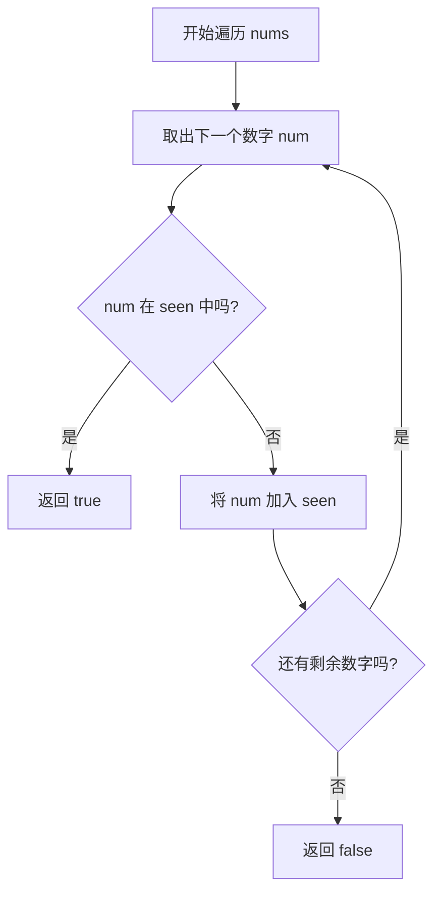

# 217-ContainsDuplicate-思路分析

## 📋 题目信息
- **难度**：简单
- **标签**：数组、哈希表、排序
- **来源**：LeetCode

## 📖 题目描述

给你一个整数数组 `nums` 。如果任一值在数组中出现 **至少两次** ，返回 `true` ；如果数组中每个元素互不相同，返回 `false` 。

### 示例

**示例 1：**
```
输入：nums = [1,2,3,1]
输出：true
解释：元素 1 在下标 0 和 3 出现。
```

**示例 2：**
```
输入：nums = [1,2,3,4]
输出：false
解释：所有元素都不同。
```

**示例 3：**
```
输入：nums = [1,1,1,3,3,4,3,2,4,2]
输出：true
```

### 约束条件

- `1 <= nums.length <= 10^5`
- `-10^9 <= nums[i] <= 10^9`

---

## 🤔 题目分析

### 问题理解

我们需要检查一个整数数组中是否存在重复的元素。
- 只要发现 **任何一个** 数字出现了两次或更多次，就立即返回 `true`。
- 只有当 **所有** 数字都独一无二时，才返回 `false`。

关键点：
- 不需要知道具体是哪个数字重复了。
- 不需要知道重复了多少次。
- 只需要判断“有”还是“没有”。

### 关键观察

- 数组长度可能达到 10 万 (`10^5`)，这意味着 $O(n^2)$ 的暴力解法（100亿次运算）会超时。我们需要一个接近 $O(n)$ 或 $O(n \log n)$ 的解法。
- 数字的范围很大（$-10^9$ 到 $10^9$），不能用简单的计数数组（桶排序思想）来直接映射，除非使用哈希表。

---

## 💡 解题思路

### 方法一：暴力解法

#### 🌟 形象化理解

想象你在检查一堆苹果中是否有烂苹果（重复元素）。暴力做法是：拿起第一个苹果，然后把它和后面所有的苹果逐一对比，看是不是长得一样；接着拿起第二个，再和后面所有的对比……

#### 思路说明

使用两层循环，拿每一个元素 `nums[i]` 与其后面的所有元素 `nums[j]` 进行比较。

#### 算法步骤

1. 第一层循环：从第一个元素开始遍历到倒数第二个元素。
2. 第二层循环：从当前元素的下一个位置开始，遍历到最后一个元素。
3. 比较：如果发现两个元素相等，立即返回 `true`。
4. 结束：如果循环结束都没有发现重复，返回 `false`。

#### 复杂度分析

- **时间复杂度**：$O(n^2)$ - 随着数组长度增加，比较次数呈平方级增长。对于 $10^5$ 的数据规模，会超时。
- **空间复杂度**：$O(1)$ - 不需要额外空间。

#### 为什么需要优化

虽然不需要额外空间，但速度太慢，无法处理大规模数据。我们需要一种更“聪明”的方法来记录我们见过什么。

---

### 方法二：优化解法（哈希表）

#### 🌟 形象化理解

> **💡 在进入专业算法分析之前，先通过一个生活化的例子来理解优化思路的本质**

**场景类比**：
想象你在举办一场大型派对，作为安检人员，你需要确保没有“克隆人”混进去。
- **暴力做法**：每来一个客人，你都让他站在门口，然后你去大厅里把已经进来的几百个客人都看一遍，确认没人长得和他一样。这太慢了！
- **哈希表做法（签到表）**：你拿一本空白的**签到簿**。每来一个客人，你先查签到簿上有没有他的名字。
  - 如果名字**已经在**上面了：抓住他！这是克隆人（发现重复）。
  - 如果名字**不在**上面：把名字写上去，让他进去。

**对应关系**：
- **签到簿** = **哈希集合 (Hash Set)**
- **客人名字** = **数组中的数字**
- **查名字/写名字** = **哈希表的查找/插入操作**
- **抓住克隆人** = **返回 true**

**核心理解**：
通过一个“记事本”记录历史，我们只需要看一眼记事本（$O(1)$ 时间）就能知道这个数字之前是否出现过，而不需要回头去翻看之前所有的数字。

---

#### 优化思路推导

1. 暴力法的瓶颈在于每次都要回头看所有元素。
2. 我们可以引入一个**哈希集合 (Set)** 来记录遍历过的元素。
3. 集合有两个特性非常适合本题：
   - **查找快**：平均情况下，判断一个元素是否在集合中只需要 $O(1)$ 时间。
   - **去重**：当然本题主要利用它的查找能力。
4. 遍历数组，对于每个元素，先问集合：“你见过它吗？”
   - 见过 -> 发现重复，返回 `true`。
   - 没见过 -> 把它加入集合，继续下一个。

#### 算法步骤

1. 初始化一个空的哈希集合 `seen`。
2. 遍历数组 `nums` 中的每一个数字 `num`：
   - 检查 `num` 是否存在于 `seen` 中。
   - 如果存在，说明之前遇到过，返回 `true`。
   - 如果不存在，将 `num` 加入 `seen` 中。
3. 如果遍历完所有数字都没有返回，说明没有重复，返回 `false`。

#### 复杂度分析

- **时间复杂度**：$O(n)$ - 我们只需要遍历一次数组，哈希表的查找和插入平均是 $O(1)$ 的。
- **空间复杂度**：$O(n)$ - 最坏情况下（没有重复元素），我们需要把所有元素都存入哈希集合中。

#### 💭 回顾类比

- 生活中的 **签到簿** 对应 代码中的 **Hash Set**。
- 生活中的 **查签到** 对应 代码中的 **`if num in seen`**。
- 这就是为什么我们能从 $O(n^2)$ 优化到 $O(n)$ 的原因：因为查找历史记录变快了。

---

## 🎨 图解说明

### 执行过程示例

**示例输入**：`nums = [1, 2, 3, 1]`

**执行步骤**：

```
初始化：seen = {} (空集合)

1. 遇到数字 1
   - 查 seen：没有 1
   - 操作：把 1 加入 seen
   - 状态：seen = {1}

2. 遇到数字 2
   - 查 seen：没有 2
   - 操作：把 2 加入 seen
   - 状态：seen = {1, 2}

3. 遇到数字 3
   - 查 seen：没有 3
   - 操作：把 3 加入 seen
   - 状态：seen = {1, 2, 3}

4. 遇到数字 1
   - 查 seen：有 1 ！！
   - 操作：发现重复，立即返回 true
```

### 可视化图表



---

## ✏️ 代码框架填空

> **💡 学习提示**：在查看完整代码之前，先尝试根据上面的算法步骤，自己思考并填写下面的空白处。这将帮助你从"不知道怎么开始"过渡到"能够独立实现关键逻辑"。

### Python填空版

```python
def containsDuplicate(nums):
    """
    判断数组中是否存在重复元素
    """
    # 🔹 填空1：初始化需要的变量
    # 提示：我们需要一个快速查找的数据结构来记录见过的数字
    seen = ______
    
    # 🔹 填空2：主循环结构
    # 提示：我们需要遍历数组中的每个数字
    for num in ______:
        
        # 🔹 填空3：核心判断逻辑
        # 提示：如果这个数字之前出现过（在seen里），怎么办？
        if ______ in ______:
            # 🔹 填空4：满足条件时的操作
            # 提示：找到了重复元素，直接返回结果
            return ______
        
        # 🔹 填空5：更新状态
        # 提示：如果没出现过，现在它出现了，需要记下来
        seen.add(______)
    
    # 🔹 填空6：返回结果
    # 提示：循环结束都没找到重复的，说明什么？
    return ______
```

### 填空提示详解

**填空1**
- 思考：什么数据结构查找最快？
- 答案：`set()`

**填空2**
- 思考：我们要检查所有数字。
- 答案：`nums`

**填空3**
- 思考：如何检查 `num` 是否在集合 `seen` 中？
- 答案：`num` 和 `seen`

**填空4**
- 思考：题目要求发现重复返回什么？
- 答案：`True`

**填空5**
- 思考：当前数字没重复，但要为后面的数字做“历史记录”，所以要把它加进去。
- 答案：`num`

**填空6**
- 思考：跑完了都没发现重复，说明全是唯一的。
- 答案：`False`

---

### C++填空版

```cpp
bool containsDuplicate(vector<int>& nums) {
    // 🔹 填空1：初始化变量
    // 提示：C++中使用什么容器实现哈希集合？
    ______<int> seen;
    
    // 🔹 填空2：主循环
    // 提示：使用范围for循环遍历更方便
    for (int num : ______) {
        
        // 🔹 填空3：核心逻辑
        // 提示：count() 或者 find() 方法可以检查元素是否存在
        if (seen.count(______)) {
            return ______;
        }
        
        // 🔹 填空4：更新状态
        // 提示：将元素插入集合
        seen.insert(______);
    }
    
    // 🔹 填空5：返回结果
    return ______;
}
```

---

## 💻 完整代码实现

> **✅ 对照检查**：现在对比你的填空答案和下面的完整实现，看看思路是否一致。

### Python实现

```python
from typing import List

class Solution:
    def containsDuplicate(self, nums: List[int]) -> bool:
        """
        利用哈希集合检测重复元素
        时间复杂度: O(n)
        空间复杂度: O(n)
        """
        # 初始化一个哈希集合，用于存储出现过的元素
        seen = set()
        
        # 遍历数组中的每一个数字
        for num in nums:
            # 核心判断：如果当前数字已经在集合中，说明之前遇到过
            if num in seen:
                return True
            
            # 如果没遇到过，将其加入集合，作为"历史记录"
            seen.add(num)
            
        # 如果遍历完整个数组都没有触发上面的 return，说明没有重复
        return False

# 测试用例
if __name__ == "__main__":
    sol = Solution()
    
    # 测试用例1
    print(f"Test 1: {sol.containsDuplicate([1,2,3,1])}") # 应为 True
    
    # 测试用例2
    print(f"Test 2: {sol.containsDuplicate([1,2,3,4])}") # 应为 False
```

**填空答案解析**：
- **填空1**：`set()` - 创建空集合。
- **填空2**：`nums` - 遍历输入数组。
- **填空3**：`num`, `seen` - `if num in seen` 是Python标准的集合查找语法。
- **填空4**：`True` - 发现重复。
- **填空5**：`num` - `seen.add(num)` 记录当前数字。
- **填空6**：`False` - 未发现重复。

### C++实现

```cpp
#include <vector>
#include <unordered_set>
#include <iostream>

using namespace std;

class Solution {
public:
    bool containsDuplicate(vector<int>& nums) {
        // 使用 unordered_set 实现哈希集合，查找效率平均为 O(1)
        unordered_set<int> seen;
        
        // 范围 for 循环遍历数组
        for (int num : nums) {
            // check if num exists in hash set
            // count() 返回 1 表示存在，0 表示不存在
            if (seen.count(num)) {
                return true;
            }
            // 将当前数字加入集合
            seen.insert(num);
        }
        
        // 遍历结束未发现重复
        return false;
    }
};
```

**与Python的主要差异**：
- Python使用 `set`，C++使用 `std::unordered_set`（需要 `#include <unordered_set>`）。
- C++的查找常用 `.count(key)` 或 `.find(key) != seen.end()`。

---

## ⚠️ 易错点提醒

### 1. 边界条件

**易错点**：数组为空或只有一个元素。
- 虽然题目约束 `1 <= nums.length`，但养成处理空输入的习惯很好。
- **分析**：对于空数组或单元素数组，循环体要么不执行，要么执行一次但不满足 `if` 条件（集合初始为空），最终返回 `false`。逻辑是正确的。

### 2. 常见错误

**错误1**：使用列表（List）代替集合（Set）来存储历史。
- **原因**：初学者可能习惯用 `seen = []`。
- **后果**：`if num in seen` 在列表中是 $O(n)$ 操作，导致整体复杂度退化回 $O(n^2)$，会超时。
- **正确做法**：必须使用哈希结构（Set 或 Dict）。

**错误2**：混淆 `true` 和 `false` 的返回条件。
- **提醒**：题目问的是“是否存在重复”，有重复才是 `true`。

### 3. 调试技巧

- **Print大法**：在循环中打印 `print(f"当前数字: {num}, 集合内容: {seen}")`，可以直观看到集合是如何增长的。
- **小数据测试**：手动构造 `[1, 1]` 这样最小的重复案例来验证逻辑。

---

## 🔗 相似题目推荐

### 同类型题目

1. **219. 存在重复元素 II** (简单)
   - **相似点**：也是找重复，但增加了一个距离条件（下标差 $\le k$）。
   - **思路**：使用哈希表，但这次存的不是 `num`，而是 `{num: index}`，或者维护一个固定大小的滑动窗口集合。

2. **220. 存在重复元素 III** (困难)
   - **相似点**：值差 $\le t$，下标差 $\le k$。
   - **思路**：哈希表升级为桶排序思想，或者有序集合。

3. **1. 两数之和** (简单)
   - **相似点**：也是遍历数组，利用哈希表查询“我们需要的东西是否在之前出现过”。

### 进阶题目

1. **287. 寻找重复数** (中等)
   - **进阶点**：要求 **不修改数组** 且 **只用 $O(1)$ 空间**。
   - **思路**：这道题不能用哈希表（空间受限），需要用 **快慢指针**（链表环路检测思想）或者 **二分查找**。这是面试常考题，非常值得挑战。

---

## 📚 知识点总结

### 核心算法
- **哈希查找**：利用哈希表将查找时间从 $O(n)$ 降低到 $O(1)$。这是典型的 **空间换时间** 策略。

### 数据结构
- **哈希集合 (Hash Set)**：无序、不重复、查找快。
  - Python: `set`
  - C++: `std::unordered_set`
  - Java: `HashSet`

### 学习要点
1. **时间与空间的权衡**：暴力法省空间但费时间，哈希法费空间但省时间。
2. **抽象思维**：将“检查历史”抽象为“查哈希表”。
3. **填空练习价值**：通过填空，你掌握了“初始化 -> 遍历 -> 检查 -> 更新 -> 结束”的标准处理流。

---
