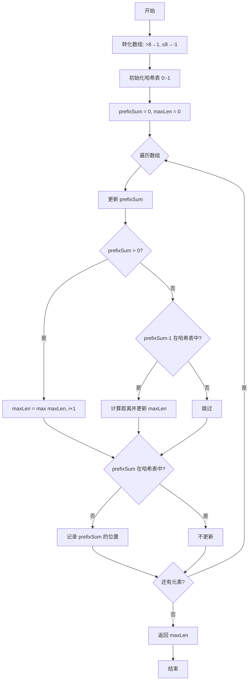

# 1124. 表现良好的最长时间段

## 📋 题目信息
- **难度**：Medium
- **标签**：数组、哈希表、前缀和、单调栈
- **来源**：LeetCode

## 📖 题目描述

给你一份工作时间表 `hours`，上面记录着某一位员工每天的工作小时数。

我们认为当员工一天中的工作小时数大于 `8` 小时的时候，那么这一天就是「**劳累的一天**」。

所谓「表现良好的时间段」，意味在这段时间内，「劳累的天数」是严格 **大于** 「不劳累的天数」。

请你返回「表现良好时间段」的最大长度。

### 示例

**示例 1：**
```
输入：hours = [9,9,6,0,6,6,9]
输出：3
解释：最长的表现良好时间段是 [9,9,6]。
```

**示例 2：**
```
输入：hours = [6,6,6]
输出：0
```

### 约束条件

- `1 <= hours.length <= 10^4`
- `0 <= hours[i] <= 16`

---

## 🤔 题目分析

### 问题理解

这道题要求我们找到最长的时间段，使得这个时间段内劳累的天数（工作时间 > 8）严格大于不劳累的天数（工作时间 ≤ 8）。

用自己的话重新描述：我们需要找到一个最长的连续子数组，使得这个子数组中大于8的元素个数严格大于小于等于8的元素个数。

### 关键观察

通过仔细分析题目，我们可以发现以下关键点：

1. **问题转化**：
   - 将 hours[i] > 8 的天数看作 +1（劳累的一天）
   - 将 hours[i] ≤ 8 的天数看作 -1（不劳累的一天）
   - "劳累天数 > 不劳累天数" 等价于 "转化后的数组和 > 0"

2. **与525题的相似性**：
   - 525题（连续数组）：找0和1数量相等的最长子数组（和 = 0）
   - 本题：找劳累天数大于不劳累天数的最长子数组（和 > 0）
   - 都可以用前缀和 + 哈希表解决

3. **前缀和的应用**：
   - 定义 prefixSum[i] 为从开始到第 i 个位置的累积和
   - 如果 prefixSum[j] > prefixSum[i]，说明区间 (i, j] 的和 > 0
   - 我们要找最长的这样的区间

4. **关键差异**：
   - 525题：找和 = 0，查找相同的前缀和
   - 本题：找和 > 0，查找更小的前缀和
   - 需要找到比当前前缀和小的、距离最远的位置

5. **贪心策略**：
   - 对于当前位置 j，如果 prefixSum[j] > 0，整个区间 [0, j] 就满足条件
   - 如果 prefixSum[j] ≤ 0，需要找之前最早出现的 prefixSum[i] < prefixSum[j]
   - 只需要查找 prefixSum[j] - 1（最接近的更小值）

### 核心难点

1. **如何将问题转化？**
   - 从"劳累天数 > 不劳累天数"转化为"和 > 0"
   - 这是解题的关键突破口

2. **如何高效查找？**
   - 不能像525题那样查找相同的前缀和
   - 需要查找比当前前缀和小的、距离最远的位置
   - 关键：只需要查找 prefixSum - 1

3. **为什么只查找 prefixSum - 1？**
   - 如果存在 prefixSum[i] = prefixSum[j] - 1
   - 那么区间 (i, j] 的和 = prefixSum[j] - prefixSum[i] = 1 > 0
   - 这是最小的满足条件的差值，能找到最长的区间

### 问题本质

这道题的本质是：**通过巧妙的转化（>8 → +1，≤8 → -1），将"劳累天数大于不劳累天数"转化为"子数组和大于0"，然后用前缀和+哈希表高效求解**。

关键洞察：
- **问题转化**：劳累天数 > 不劳累天数 ⟺ 转化后的和 > 0
- **前缀和的应用**：区间和 = 两个前缀和的差
- **贪心策略**：只需要查找 prefixSum - 1，这是最接近的更小值

---

## 💡 解题思路

### 方法一：暴力解法

#### 思路说明

最直观的想法是：枚举所有可能的子数组，统计每个子数组中劳累天数和不劳累天数，找出满足条件的最长子数组。

#### 算法步骤

1. **外层循环**：遍历所有可能的起始位置 i
2. **内层循环**：从 i 开始遍历所有可能的结束位置 j
3. **统计计数**：统计区间 [i, j] 中劳累天数和不劳累天数
4. **更新结果**：如果劳累天数 > 不劳累天数，更新最大长度

#### 复杂度分析

- **时间复杂度**：O(n²) - 两层嵌套循环
- **空间复杂度**：O(1) - 只使用常数变量

#### 为什么需要优化

虽然暴力解法简单直观，但存在明显的性能瓶颈：

1. **效率低下**：当 n = 10⁴ 时，O(n²) 约为 10⁸ 次操作，会超时
2. **重复计算**：每个子数组都要重新统计，存在大量重复计算
3. **无法通过大数据测试**：题目约束 n 最大为 10⁴，暴力解法无法通过

---

### 方法二：前缀和 + 哈希表

#### 🌟 形象化理解：爬山的高度变化

> **💡 在进入专业算法分析之前，先通过一个生活化的例子来理解问题转化**

**场景类比**：

想象你在爬山，每天的工作时间决定你的高度变化：
- 劳累的一天（>8小时）：向上爬1米（+1）
- 不劳累的一天（≤8小时）：向下走1米（-1）
- 你想找最长的一段路程，使得这段路程结束时的高度比开始时高

**对应关系**：
- **劳累的一天** = 向上爬（+1）
- **不劳累的一天** = 向下走（-1）
- **当前高度** = 前缀和
- **高度差 > 0** = 劳累天数 > 不劳累天数
- **最长的上升路程** = 表现良好的最长时间段

**核心理解**：
如果你从某个高度 h 开始，走了一段路后到达高度 h+1（或更高），说明这段路程中向上爬的次数多于向下走的次数。

**举例说明**：
```
工作时间：[9, 9, 6, 0, 6, 6, 9]
转化：    [1, 1, -1, -1, -1, -1, 1]
前缀和：  [0, 1, 2, 1, 0, -1, -2, -1]

从高度0到高度2（索引0-1）：上升了2米，劳累天数多
从高度0到高度1（索引0-2）：上升了1米，劳累天数多
```

**从类比到算法**：
现在让我们把这个爬山的思想转化为具体的算法...

---

#### 优化思路推导

**思考过程**：

1. **暴力解法的瓶颈**：需要枚举所有子数组并统计，时间复杂度 O(n²)

2. **问题转化**：
   - 劳累天数 > 不劳累天数 ⟺ count(劳累) - count(不劳累) > 0
   - 将 hours[i] > 8 看作 +1，hours[i] ≤ 8 看作 -1
   - 问题变成：找和 > 0 的最长子数组

3. **前缀和的应用**：
   - 定义 prefixSum[i] = 从开始到第 i 个位置的累积和
   - 如果 prefixSum[j] > prefixSum[i]，说明区间 (i, j] 的和 > 0
   - 我们要找最长的这样的区间

4. **关键观察**：
   - 如果 prefixSum[j] > 0，整个区间 [0, j] 就满足条件，长度为 j+1
   - 如果 prefixSum[j] ≤ 0，需要找之前的某个位置 i，使得 prefixSum[i] < prefixSum[j]
   - 为了找最长的区间，需要找最早出现的这样的位置

5. **贪心策略**：
   - 对于 prefixSum[j]，只需要查找 prefixSum[j] - 1
   - 因为如果存在 prefixSum[i] = prefixSum[j] - 1，区间 (i, j] 的和 = 1 > 0
   - 这是最小的满足条件的差值，能找到最长的区间

#### 算法步骤

1. **转化数组**：
   - 将 hours[i] > 8 转化为 1，hours[i] ≤ 8 转化为 -1

2. **初始化**：
   - 创建哈希表 `firstOccurrence`，记录每个前缀和第一次出现的位置
   - 初始化 `prefixSum = 0`，`maxLen = 0`
   - 预设 `firstOccurrence[0] = -1`

3. **遍历数组**：
   - 更新前缀和：`prefixSum += (1 if hours[i] > 8 else -1)`
   - 如果 `prefixSum > 0`，更新 `maxLen = i + 1`（整个区间满足条件）
   - 否则，查找 `prefixSum - 1` 是否在哈希表中
     - 如果存在，计算距离并更新 `maxLen`
   - 如果当前 `prefixSum` 不在哈希表中，记录其位置

4. **返回结果**：返回 `maxLen`

#### 复杂度分析

- **时间复杂度**：O(n) - 只需遍历数组一次，哈希表操作 O(1)
- **空间复杂度**：O(n) - 哈希表最多存储 n 个不同的前缀和

#### 💭 回顾类比

- 生活中的**爬山高度** 对应 代码中的**前缀和**
- 生活中的**高度上升** 对应 代码中的**前缀和增大**
- 生活中的**最长上升路程** 对应 代码中的**和 > 0 的最长子数组**
- 这就是为什么这个算法能够将时间复杂度从 O(n²) 优化到 O(n) 的原因

---

## 🎨 图解说明

### 执行过程示例

让我们通过示例 1 来详细演示算法的执行过程。

**示例输入**：`hours = [9, 9, 6, 0, 6, 6, 9]`

**执行步骤**：

```
转化数组：[1, 1, -1, -1, -1, -1, 1]

初始状态：
firstOccurrence = {0: -1}
prefixSum = 0
maxLen = 0

索引 0，值 9 (>8)，转化为 1：
- prefixSum = 0 + 1 = 1
- prefixSum > 0，更新 maxLen = 0 + 1 = 1
- 记录：firstOccurrence = {0: -1, 1: 0}

索引 1，值 9 (>8)，转化为 1：
- prefixSum = 1 + 1 = 2
- prefixSum > 0，更新 maxLen = 1 + 1 = 2
- 记录：firstOccurrence = {0: -1, 1: 0, 2: 1}

索引 2，值 6 (≤8)，转化为 -1：
- prefixSum = 2 + (-1) = 1
- prefixSum > 0，更新 maxLen = 2 + 1 = 3 ✓
- 1 已存在，不更新

索引 3，值 0 (≤8)，转化为 -1：
- prefixSum = 1 + (-1) = 0
- prefixSum = 0，不满足 > 0
- 查找 prefixSum - 1 = -1，不存在
- 0 已存在，不更新

索引 4，值 6 (≤8)，转化为 -1：
- prefixSum = 0 + (-1) = -1
- prefixSum ≤ 0
- 查找 prefixSum - 1 = -2，不存在
- 记录：firstOccurrence = {0: -1, 1: 0, 2: 1, -1: 4}

索引 5，值 6 (≤8)，转化为 -1：
- prefixSum = -1 + (-1) = -2
- prefixSum ≤ 0
- 查找 prefixSum - 1 = -3，不存在
- 记录：firstOccurrence = {0: -1, 1: 0, 2: 1, -1: 4, -2: 5}

索引 6，值 9 (>8)，转化为 1：
- prefixSum = -2 + 1 = -1
- prefixSum ≤ 0
- 查找 prefixSum - 1 = -2，存在！位置是 5
- 距离 = 6 - 5 = 1，maxLen 仍为 3
- -1 已存在，不更新

最终结果：maxLen = 3
对应子数组：[9, 9, 6]（索引 0-2）
```

### 可视化图表



### 前缀和变化图

**示例：hours = [9, 9, 6, 0, 6, 6, 9]**

```
索引：      -1   0    1    2    3    4    5    6
工作时间：       9    9    6    0    6    6    9
转化：           1    1   -1   -1   -1   -1    1
前缀和：    0    1    2    1    0   -1   -2   -1

分析：
索引 0: prefixSum=1 > 0, 长度=1
索引 1: prefixSum=2 > 0, 长度=2
索引 2: prefixSum=1 > 0, 长度=3 ✓ 最长
索引 3: prefixSum=0, 查找-1, 不存在
索引 4: prefixSum=-1, 查找-2, 不存在
索引 5: prefixSum=-2, 查找-3, 不存在
索引 6: prefixSum=-1, 查找-2, 存在于索引5, 距离=1
```

### 关键理解

**为什么 prefixSum > 0 时直接更新长度？**
- 如果当前前缀和 > 0，说明从数组开始到当前位置的和 > 0
- 整个区间 [0, i] 都满足条件，长度为 i + 1

**为什么只查找 prefixSum - 1？**
- 我们要找 prefixSum[i] < prefixSum[j] 的最早位置 i
- 如果存在 prefixSum[i] = prefixSum[j] - 1，区间 (i, j] 的和 = 1 > 0
- 这是最小的满足条件的差值，对应最长的区间
- 查找更小的值（如 prefixSum - 2）虽然也满足，但距离更近

**为什么只记录第一次出现的位置？**
- 我们要找最长的子数组
- 相同前缀和第一次出现的位置距离当前位置最远

**与525题的区别**：
- 525题：找和 = 0，查找相同的前缀和
- 本题：找和 > 0，查找 prefixSum - 1（最接近的更小值）

---

## ✏️ 代码框架填空

> **💡 学习提示**：在查看完整代码之前，先尝试根据上面的算法步骤，自己思考并填写下面的空白处。

### Python填空版

```python
def longestWPI(hours):
    """
    找表现良好的最长时间段
    
    参数:
        hours: 工作时间数组
    
    返回:
        最长时间段的长度
    """
    # 🔹 填空1：初始化哈希表
    # 提示：前缀和0在哪个位置？
    first_occurrence = {______: ______}
    
    # 🔹 填空2：初始化前缀和和最大长度
    prefix_sum = ______
    max_len = ______
    
    # 🔹 填空3：遍历数组
    for i, hour in ______:
        
        # 🔹 填空4：更新前缀和
        # 提示：>8 转化为 1，≤8 转化为 -1
        if hour > 8:
            prefix_sum ______
        else:
            prefix_sum ______
        
        # 🔹 填空5：如果前缀和 > 0
        # 提示：整个区间都满足条件
        if ______:
            max_len = ______
        else:
            # 🔹 填空6：查找 prefixSum - 1
            # 提示：查找最接近的更小值
            if ______ in first_occurrence:
                length = ______
                max_len = max(max_len, length)
        
        # 🔹 填空7：记录前缀和第一次出现的位置
        # 提示：只在第一次出现时记录
        if ______ not in first_occurrence:
            first_occurrence[______] = ______
    
    # 🔹 填空8：返回结果
    return ______
```

### 填空提示详解

**填空1 - 初始化哈希表**
- 思考：为什么要预设 {0: -1}？
- 提示：前缀和0在位置-1，处理从数组开始就满足条件的情况

**填空2 - 初始化变量**
- 思考：前缀和和最大长度的初始值是多少？
- 提示：都初始化为0

**填空3 - 遍历数组**
- 思考：需要获取什么信息？
- 提示：需要索引和值，使用 enumerate(hours)

**填空4 - 更新前缀和**
- 思考：如何转化工作时间？
- 提示：>8 加1，≤8 减1

**填空5 - 判断前缀和是否大于0**
- 思考：什么情况下整个区间满足条件？
- 提示：prefix_sum > 0 时，长度为 i + 1

**填空6 - 查找并计算距离**
- 思考：要查找什么？如何计算距离？
- 提示：查找 prefix_sum - 1，距离为 i - first_occurrence[prefix_sum - 1]

**填空7 - 记录位置**
- 思考：什么时候记录？记录什么？
- 提示：只在第一次出现时记录当前前缀和和索引

**填空8 - 返回结果**
- 思考：最终返回什么？
- 提示：返回 max_len

---

## 💻 完整代码实现

> **✅ 对照检查**：现在对比你的填空答案和下面的完整实现，看看思路是否一致。

### Python实现

```python
def longestWPI(hours):
    """
    找表现良好的最长时间段
    
    时间复杂度：O(n)
    空间复杂度：O(n)
    """
    # 初始化哈希表，记录每个前缀和第一次出现的位置
    # {0: -1} 表示前缀和0在位置-1（数组开始之前）
    first_occurrence = {0: -1}
    
    # 初始化前缀和和最大长度
    prefix_sum = 0
    max_len = 0
    
    # 遍历数组，同时获取索引和值
    for i, hour in enumerate(hours):
        
        # 更新前缀和：>8 转化为 1，≤8 转化为 -1
        if hour > 8:
            prefix_sum += 1
        else:
            prefix_sum -= 1
        
        # 如果前缀和 > 0，说明从开始到当前位置满足条件
        if prefix_sum > 0:
            max_len = i + 1
        else:
            # 查找 prefixSum - 1（最接近的更小值）
            # 如果存在，说明从那个位置到当前位置的和 > 0
            if (prefix_sum - 1) in first_occurrence:
                length = i - first_occurrence[prefix_sum - 1]
                max_len = max(max_len, length)
        
        # 只记录前缀和第一次出现的位置
        # 这样能保证找到最长的子数组
        if prefix_sum not in first_occurrence:
            first_occurrence[prefix_sum] = i
    
    return max_len


# 测试用例
if __name__ == "__main__":
    # 测试用例1
    hours1 = [9, 9, 6, 0, 6, 6, 9]
    result1 = longestWPI(hours1)
    print(f"测试1: hours = {hours1}, 结果 = {result1}, 期望 = 3")
    
    # 测试用例2
    hours2 = [6, 6, 6]
    result2 = longestWPI(hours2)
    print(f"测试2: hours = {hours2}, 结果 = {result2}, 期望 = 0")
    
    # 额外测试
    hours3 = [9, 9, 9]
    result3 = longestWPI(hours3)
    print(f"测试3: hours = {hours3}, 结果 = {result3}, 期望 = 3")
    
    hours4 = [6, 9, 9]
    result4 = longestWPI(hours4)
    print(f"测试4: hours = {hours4}, 结果 = {result4}, 期望 = 3")
```

**代码说明**：
- 第12行：初始化哈希表为 `{0: -1}`，处理从数组开始就满足条件的情况
- 第15-16行：初始化前缀和为0，最大长度为0
- 第19行：使用 `enumerate` 同时获取索引和值
- 第22-25行：根据工作时间更新前缀和（>8 加1，≤8 减1）
- 第28-29行：如果前缀和 > 0，整个区间满足条件
- 第33行：查找 `prefix_sum - 1`，这是最接近的更小值
- 第39-40行：只在第一次出现时记录位置

**填空答案解析**：
- **填空1**：`0: -1` - 前缀和0在位置-1
- **填空2**：`prefix_sum = 0, max_len = 0` - 初始化为0
- **填空3**：`enumerate(hours)` - 同时获取索引和值
- **填空4**：`+= 1` 和 `-= 1` - 根据条件加1或减1
- **填空5**：`prefix_sum > 0` 和 `i + 1` - 判断并计算长度
- **填空6**：`(prefix_sum - 1)` 和 `i - first_occurrence[prefix_sum - 1]`
- **填空7**：`prefix_sum` 和 `prefix_sum] = i`
- **填空8**：`max_len` - 返回最大长度

---

### C++实现

```cpp
#include <vector>
#include <unordered_map>
#include <algorithm>
#include <iostream>
using namespace std;

class Solution {
public:
    int longestWPI(vector<int>& hours) {
        // 初始化哈希表
        unordered_map<int, int> firstOccurrence;
        firstOccurrence[0] = -1;
        
        // 初始化变量
        int prefixSum = 0;
        int maxLen = 0;
        
        // 遍历数组
        for (int i = 0; i < hours.size(); i++) {
            
            // 更新前缀和
            if (hours[i] > 8) {
                prefixSum += 1;
            } else {
                prefixSum -= 1;
            }
            
            // 如果前缀和 > 0
            if (prefixSum > 0) {
                maxLen = i + 1;
            } else {
                // 查找 prefixSum - 1
                if (firstOccurrence.find(prefixSum - 1) != firstOccurrence.end()) {
                    int length = i - firstOccurrence[prefixSum - 1];
                    maxLen = max(maxLen, length);
                }
            }
            
            // 只记录第一次出现的位置
            if (firstOccurrence.find(prefixSum) == firstOccurrence.end()) {
                firstOccurrence[prefixSum] = i;
            }
        }
        
        return maxLen;
    }
};

// 测试代码
int main() {
    Solution sol;
    
    // 测试用例1
    vector<int> hours1 = {9, 9, 6, 0, 6, 6, 9};
    cout << "测试1: " << sol.longestWPI(hours1) << " (期望: 3)" << endl;
    
    // 测试用例2
    vector<int> hours2 = {6, 6, 6};
    cout << "测试2: " << sol.longestWPI(hours2) << " (期望: 0)" << endl;
    
    return 0;
}
```

**与Python的主要差异**：
- **类型声明**：C++需要显式声明 `unordered_map<int, int>` 类型
- **数组大小**：Python用 `len()`，C++用 `.size()`
- **哈希表查找**：Python用 `in`，C++用 `.find() != .end()`
- **最大值函数**：Python用 `max()`，C++用 `std::max()`

---

## ⚠️ 易错点提醒

### 1. 边界条件

**易错点1：忘记初始化 {0: -1}**

❌ **错误做法**：
```python
first_occurrence = {}  # 空哈希表
```

✅ **正确做法**：
```python
first_occurrence = {0: -1}  # 预设前缀和0在位置-1
```

**原因**：
- 如果前缀和 > 0，说明从数组开始到当前位置满足条件
- 没有预设的话，无法正确处理这种情况

---

**易错点2：查找错误的值**

❌ **错误做法**：
```python
# 查找相同的前缀和（像525题那样）
if prefix_sum in first_occurrence:
    length = i - first_occurrence[prefix_sum]
```

✅ **正确做法**：
```python
# 查找 prefixSum - 1
if (prefix_sum - 1) in first_occurrence:
    length = i - first_occurrence[prefix_sum - 1]
```

**原因**：
- 本题要找和 > 0，不是和 = 0
- 需要查找比当前前缀和小的值
- prefixSum - 1 是最接近的更小值，能找到最长的区间

---

**易错点3：忘记处理 prefixSum > 0 的情况**

❌ **错误做法**：
```python
# 只查找 prefixSum - 1
if (prefix_sum - 1) in first_occurrence:
    length = i - first_occurrence[prefix_sum - 1]
    max_len = max(max_len, length)
```

✅ **正确做法**：
```python
# 先判断 prefixSum > 0
if prefix_sum > 0:
    max_len = i + 1
else:
    if (prefix_sum - 1) in first_occurrence:
        length = i - first_occurrence[prefix_sum - 1]
        max_len = max(max_len, length)
```

**原因**：
- 如果 prefixSum > 0，整个区间 [0, i] 都满足条件
- 这种情况下长度为 i + 1，是最长的
- 不需要查找哈希表

---

### 2. 常见错误

**错误1：不理解为什么只查找 prefixSum - 1**

**疑问**：为什么不查找 prefixSum - 2、prefixSum - 3 等？

**解释**：
- 我们要找 prefixSum[i] < prefixSum[j] 的最早位置 i
- 如果存在多个满足条件的位置，最早的那个距离最远
- prefixSum - 1 是最接近的更小值，对应的位置最早出现
- 查找更小的值虽然也满足条件，但对应的位置更晚，距离更近

**示例**：
```
前缀和：[0, -1, -2, -1]
当前位置索引3，prefixSum = -1

查找 -1 - 1 = -2：找到索引2，距离 = 3 - 2 = 1
如果查找 -1 - 2 = -3：不存在

所以只需要查找 prefixSum - 1
```

---

**错误2：混淆本题和525题**

| 特性 | 525题（连续数组） | 本题（表现良好的最长时间段） |
|------|------------------|---------------------------|
| 目标 | 0和1数量相等 | 劳累天数 > 不劳累天数 |
| 转化 | 0→-1, 1→+1 | ≤8→-1, >8→+1 |
| 条件 | 和 = 0 | 和 > 0 |
| 查找 | 相同的前缀和 | prefixSum - 1 |

---

### 3. 调试技巧

**技巧1：打印前缀和和哈希表状态**

```python
for i, hour in enumerate(hours):
    if hour > 8:
        prefix_sum += 1
    else:
        prefix_sum -= 1
    
    print(f"索引{i}, 工作时间{hour}, 前缀和{prefix_sum}")
    
    if prefix_sum > 0:
        print(f"  前缀和>0，长度={i+1}")
        max_len = i + 1
    else:
        if (prefix_sum - 1) in first_occurrence:
            length = i - first_occurrence[prefix_sum - 1]
            print(f"  找到{prefix_sum-1}在位置{first_occurrence[prefix_sum-1]}，距离={length}")
            max_len = max(max_len, length)
    
    if prefix_sum not in first_occurrence:
        first_occurrence[prefix_sum] = i
    print(f"  哈希表: {first_occurrence}")
```

**技巧2：手动验证小例子**

```
hours = [9, 9, 6], 转化 = [1, 1, -1]

索引0: prefix_sum=1 > 0, 长度=1
索引1: prefix_sum=2 > 0, 度=2
索引2: prefix_sum=1 > 0, 长度=3 ✓

结果: 3
```

**技巧3：测试边界情况**

- 全是劳累的：`[9, 9, 9]`
- 全是不劳累的：`[6, 6, 6]`
- 单个元素：`[9]` 或 `[6]`
- 交替出现：`[9, 6, 9, 6]`

---

**🎉 恭喜你完成了这道题的学习！** 通过本题，你应该掌握了前缀和+哈希表在"和大于0"问题中的应用，以及与"和等于0"问题的区别。

继续加油，向着算法大师的目标前进！💪


