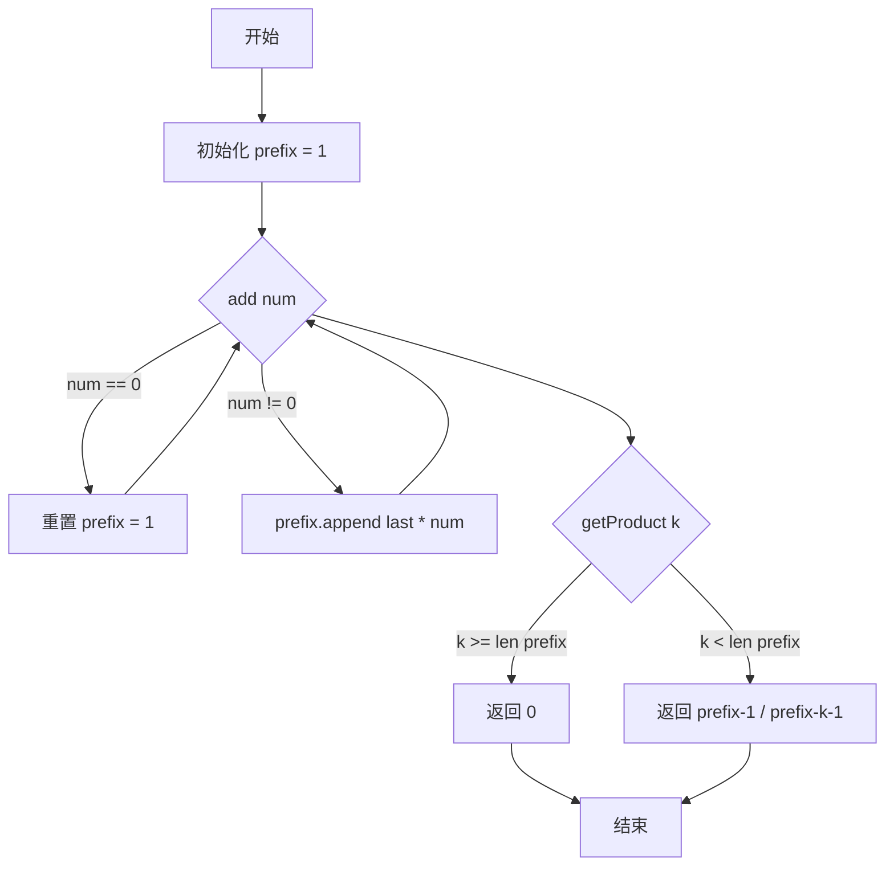

# 1352. 最后 K 个数的乘积

## 📋 题目信息
- **难度**：Medium
- **标签**：设计、数组、数学、前缀积
- **来源**：LeetCode

## 📖 题目描述

设计一个算法，该算法接受一个整数流并检索该流中最后 `k` 个整数的乘积。

实现 `ProductOfNumbers` 类：

*   `ProductOfNumbers()` 用一个空的流初始化对象。
*   `void add(int num)` 将数字 `num` 添加到当前数字列表的最后面。
*   `int getProduct(int k)` 返回当前数字列表中，最后 `k` 个数字的乘积。你可以假设当前列表中始终 **至少** 包含 `k` 个数字。

题目数据保证：任何时候，任一连续数字序列的乘积都在 32 位整数范围内，不会溢出。

### 示例

**示例 1：**
```
输入：
["ProductOfNumbers","add","add","add","add","add","getProduct","getProduct","getProduct","add","getProduct"]
[[],[3],[0],[2],[5],[4],[2],[3],[4],[8],[2]]

输出：
[null,null,null,null,null,null,20,40,0,null,32]

解释：
ProductOfNumbers productOfNumbers = new ProductOfNumbers();
productOfNumbers.add(3);        // [3]
productOfNumbers.add(0);        // [3,0]
productOfNumbers.add(2);        // [3,0,2]
productOfNumbers.add(5);        // [3,0,2,5]
productOfNumbers.add(4);        // [3,0,2,5,4]
productOfNumbers.getProduct(2); // 返回 20 。最后 2 个数字的乘积是 5 * 4 = 20
productOfNumbers.getProduct(3); // 返回 40 。最后 3 个数字的乘积是 2 * 5 * 4 = 40
productOfNumbers.getProduct(4); // 返回  0 。最后 4 个数字的乘积是 0 * 2 * 5 * 4 = 0
productOfNumbers.add(8);        // [3,0,2,5,4,8]
productOfNumbers.getProduct(2); // 返回 32 。最后 2 个数字的乘积是 4 * 8 = 32
```

### 约束条件

- `0 <= num <= 100`
- `1 <= k <= 4 * 10^4`
- `add` 和 `getProduct` 最多被调用 `4 * 10^4` 次。
- 在任何时间点流的乘积都在 32 位整数范围内。

**进阶**：您能否 **同时** 将 `GetProduct` 和 `Add` 的实现改为 `O(1)` 时间复杂度，而不是 `O(k)` 时间复杂度？

---

## 🤔 题目分析

### 问题理解

这道题要求我们设计一个数据结构，能够：
1. **动态添加数字**：不断向数字流中添加新的整数
2. **快速查询乘积**：能够快速返回最后 k 个数字的乘积

用自己的话重新描述：我们需要维护一个动态增长的数字序列，并且能够高效地计算任意后缀区间的乘积。

### 关键观察

通过仔细分析题目，我们可以发现以下关键点：

1. **数字流是动态的**：数字不断被添加，序列长度不断增长
2. **查询的是后缀乘积**：每次查询都是"最后 k 个数"，即后缀区间
3. **0 的特殊性**：如果区间内包含 0，乘积必然为 0
4. **频繁查询**：`getProduct` 可能被调用很多次（最多 4×10⁴ 次）
5. **进阶要求**：希望 `add` 和 `getProduct` 都是 O(1) 时间复杂度

### 核心难点

1. **如何高效计算区间乘积？**
   - 暴力方法：每次查询都遍历最后 k 个数相乘 → O(k) 时间
   - 优化目标：能否做到 O(1) 时间？

2. **如何处理 0 的情况？**
   - 0 会让乘积变为 0
   - 0 之前的数字对后续查询没有意义
   - 需要特殊处理

3. **类比已知问题**
   - 这个问题和"区域和检索"非常相似
   - 区域和用"前缀和"，那么区域积能否用"前缀积"？

### 问题本质

这道题的本质是：**如何在动态数据流中高效维护区间乘积信息**。

关键洞察：
- **前缀和的思想可以推广到前缀积**
- 如果我们维护从开始到每个位置的累积乘积
- 那么任意区间 [i, j] 的乘积 = prefix[j] / prefix[i-1]
- 但是 0 会破坏这个性质，需要特殊处理

---

## 💡 解题思路

### 方法一：暴力解法

#### 思路说明

最直观的想法是：用一个列表存储所有添加的数字，每次查询时遍历最后 k 个数字，将它们相乘。

#### 算法步骤

1. **初始化**：创建一个空列表 `nums` 存储所有数字
2. **add(num)**：将 `num` 添加到列表末尾
3. **getProduct(k)**：
   - 从列表末尾开始，向前遍历 k 个数字
   - 将这 k 个数字依次相乘
   - 返回乘积结果

#### 复杂度分析

- **时间复杂度**：
  - `add(num)`：O(1) - 只需在列表末尾添加元素
  - `getProduct(k)`：O(k) - 需要遍历 k 个数字
- **空间复杂度**：O(n) - n 是添加的数字总数

#### 为什么需要优化

虽然暴力解法简单直观，但存在明显的性能瓶颈：

1. **查询效率低**：每次 `getProduct` 都需要 O(k) 时间，当 k 很大或查询频繁时，性能很差
2. **重复计算**：如果连续查询相同或相近的 k 值，会重复计算相同的乘积
3. **不满足进阶要求**：题目希望 `getProduct` 也能达到 O(1) 时间复杂度

---

### 方法二：前缀积优化

#### 🌟 形象化理解：银行账户余额

> **💡 在进入专业算法分析之前，先通过一个生活化的例子来理解前缀积的本质**

**场景类比**：

想象你在记录银行账户的余额变化：
- 你不是每天记录"今天赚了多少钱"
- 而是记录"到今天为止，总共有多少钱"

如果你想知道某段时间（比如最近 7 天）赚了多少钱，只需要：
**今天的总余额 - 7天前的总余额 = 这7天赚的钱**

**对应关系**：
- **每天的收入** = 数字流中的每个数字
- **累计余额** = 前缀积（从开始到当前位置的累积乘积）
- **某段时间的收入** = 最后 k 个数的乘积
- **余额相减** = 前缀积相除

**核心理解**：
通过预先计算累积值（前缀积），我们可以用"除法"快速得到任意区间的乘积，就像用余额相减快速得到某段时间的收入一样。

**特殊情况 - 遇到 0**：
如果某天你的账户被清零了（遇到 0），那么之前的余额记录就没用了，需要重新开始记录。这就是为什么遇到 0 时要重置前缀积数组。

**从类比到算法**：
现在让我们把这个生活化的思想转化为具体的算法...

---

#### 优化思路推导

**思考过程**：

1. **暴力解法的瓶颈**：每次查询都要遍历 k 个数字相乘，时间复杂度 O(k)

2. **借鉴前缀和的思想**：
   - 前缀和可以快速计算区间和：`sum[i, j] = prefixSum[j] - prefixSum[i-1]`
   - 能否用类似的方法计算区间积？

3. **前缀积的定义**：
   - 定义 `prefix[i]` 为从开始到第 i 个位置的所有数字的乘积
   - 那么最后 k 个数的乘积 = `prefix[n] / prefix[n-k]`
   - 其中 n 是当前数字总数

4. **0 的特殊处理**：
   - 如果遇到 0，乘积会变成 0，无法用除法恢复
   - 解决方案：遇到 0 时，清空前缀积数组，重新开始
   - 如果查询的 k 大于当前数组长度，说明区间包含 0，直接返回 0

#### 算法步骤

1. **初始化**：
   - 创建前缀积数组 `prefix`，初始值为 `[1]`（表示空乘积为 1）

2. **add(num)**：
   - 如果 `num == 0`：清空数组，重置为 `[1]`
   - 如果 `num != 0`：将 `prefix[-1] * num` 添加到数组末尾

3. **getProduct(k)**：
   - 如果 `k >= len(prefix)`：说明区间包含 0（或超出范围），返回 0
   - 否则：返回 `prefix[-1] / prefix[-k-1]`

#### 复杂度分析

- **时间复杂度**：
  - `add(num)`：O(1) - 只需在数组末尾添加或重置
  - `getProduct(k)`：O(1) - 只需一次除法运算
- **空间复杂度**：O(n) - n 是添加的数字总数（不包含 0 之前的数字）

#### 💭 回顾类比

- 生活中的**累计余额** 对应 代码中的**前缀积数组**
- 生活中的**余额相减** 对应 代码中的**前缀积相除**
- 生活中的**账户清零** 对应 代码中的**遇到 0 时重置数组**
- 这就是为什么这个算法能够将查询优化到 O(1) 的原因

---

## 🎨 图解说明

### 执行过程示例

让我们通过题目给出的示例来详细演示算法的执行过程。

**示例输入**：
```
add(3), add(0), add(2), add(5), add(4), getProduct(2), getProduct(3), getProduct(4), add(8), getProduct(2)
```

**执行步骤**：

```
初始状态：
prefix = [1]

步骤1：add(3)
- num = 3 ≠ 0
- prefix.append(1 * 3) = prefix.append(3)
- prefix = [1, 3]
- 数字序列：[3]

步骤2：add(0)
- num = 0
- 遇到0，重置数组
- prefix = [1]
- 数字序列：[3, 0]（但前缀积数组重置了）

步骤3：add(2)
- num = 2 ≠ 0
- prefix.append(1 * 2) = prefix.append(2)
- prefix = [1, 2]
- 数字序列：[3, 0, 2]

步骤4：add(5)
- num = 5 ≠ 0
- prefix.append(2 * 5) = prefix.append(10)
- prefix = [1, 2, 10]
- 数字序列：[3, 0, 2, 5]

步骤5：add(4)
- num = 4 ≠ 0
- prefix.append(10 * 4) = prefix.append(40)
- prefix = [1, 2, 10, 40]
- 数字序列：[3, 0, 2, 5, 4]

步骤6：getProduct(2)
- k = 2
- len(prefix) = 4, k < len(prefix)
- 返回 prefix[-1] / prefix[-2-1] = 40 / 2 = 20
- 解释：最后2个数是 5 * 4 = 20 ✓

步骤7：getProduct(3)
- k = 3
- len(prefix) = 4, k < len(prefix)
- 返回 prefix[-1] / prefix[-3-1] = 40 / 1 = 40
- 解释：最后3个数是 2 * 5 * 4 = 40 ✓

步骤8：getProduct(4)
- k = 4
- len(prefix) = 4, k >= len(prefix)
- 返回 0
- 解释：最后4个数包含0，所以是 0 * 2 * 5 * 4 = 0 ✓

步骤9：add(8)
- num = 8 ≠ 0
- prefix.append(40 * 8) = prefix.append(320)
- prefix = [1, 2, 10, 40, 320]
- 数字序列：[3, 0, 2, 5, 4, 8]

步骤10：getProduct(2)
- k = 2
- len(prefix) = 5, k < len(prefix)
- 返回 prefix[-1] / prefix[-2-1] = 320 / 10 = 32
- 解释：最后2个数是 4 * 8 = 32 ✓
```

### 可视化图表



### 关键理解

**为什么 prefix 初始值是 [1]？**
- 1 是乘法的单位元，任何数乘以 1 等于它本身
- 这样第一个数字的前缀积就是 1 * num = num

**为什么遇到 0 要重置？**
- 0 会让所有包含它的区间乘积变为 0
- 0 之前的数字对后续查询没有意义
- 重置后，如果查询的 k 超过数组长度，说明包含了 0

**为什么用除法计算区间积？**
- prefix[i] = nums[0] × nums[1] × ... × nums[i]
- 最后 k 个数的乘积 = nums[n-k] × ... × nums[n-1]
- = prefix[n-1] / prefix[n-k-1]

---

## ✏️ 代码框架填空

> **💡 学习提示**：在查看完整代码之前，先尝试根据上面的算法步骤，自己思考并填写下面的空白处。这将帮助你从"不知道怎么开始"过渡到"能够独立实现关键逻辑"。

### Python填空版

```python
class ProductOfNumbers:
    def __init__(self):
        """
        初始化数据结构
        """
        # 🔹 填空1：初始化前缀积数组
        # 提示：前缀积数组的初始值应该是什么？为什么？
        self.prefix = ______
    
    def add(self, num: int) -> None:
        """
        添加数字到数字流
        
        参数:
            num: 要添加的数字
        """
        # 🔹 填空2：判断是否为0
        # 提示：遇到0时应该如何处理前缀积数组？
        if ______:
            # 🔹 填空3：重置数组
            self.prefix = ______
        else:
            # 🔹 填空4：添加新的前缀积
            # 提示：新的前缀积 = 上一个前缀积 * 当前数字
            self.prefix.append(______)
    
    def getProduct(self, k: int) -> int:
        """
        获取最后k个数字的乘积
        
        参数:
            k: 要查询的数字个数
        
        返回:
            最后k个数字的乘积
        """
        # 🔹 填空5：判断是否包含0
        # 提示：什么情况下说明区间包含0？
        if ______:
            return 0
        
        # 🔹 填空6：计算区间乘积
        # 提示：使用前缀积的除法来计算
        return ______
```

### 填空提示详解

**填空1 - 初始化前缀积数组**
- 思考：前缀积数组的第一个元素应该是什么？
- 提示：1 是乘法的单位元，任何数乘以 1 等于它本身
- 参考算法步骤的初始化部分

**填空2 - 判断是否为0**
- 思考：什么条件下需要重置数组？
- 提示：当添加的数字是 0 时
- 简单的相等判断

**填空3 - 重置数组**
- 思考：重置后的数组应该是什么状态？
- 提示：和初始化时一样
- 参考填空1的答案

**填空4 - 添加新的前缀积**
- 思考：新的前缀积如何计算？
- 提示：当前位置的前缀积 = 前一个位置的前缀积 × 当前数字
- 如何获取数组的最后一个元素？

**填空5 - 判断是否包含0**
- 思考：什么情况下查询的区间包含 0？
- 提示：如果 k 大于等于数组长度（不包括初始的1），说明要查询的范围超出了当前有效数字
- 这意味着区间包含了之前遇到的 0

**填空6 - 计算区间乘积**
- 思考：如何用前缀积计算最后 k 个数的乘积？
- 提示：最后 k 个数的乘积 = 最后一个前缀积 / 倒数第(k+1)个前缀积
- 注意 Python 的负索引用法

### C++填空版

```cpp
class ProductOfNumbers {
private:
    // 🔹 填空1：声明前缀积数组
    // 提示：使用 vector<int> 存储前缀积
    vector<int> ______;
    
public:
    ProductOfNumbers() {
        // 🔹 填空2：初始化前缀积数组
        // 提示：初始值为 {1}
        ______.push_back(______);
    }
    
    void add(int num) {
        // 🔹 填空3：判断是否为0
        if (______) {
            // 🔹 填空4：重置数组
            ______.clear();
            ______.push_back(1);
        } else {
            // 🔹 填空5：添加新的前缀积
            // 提示：获取最后一个元素用 .back()
            ______.push_back(______.back() * ______);
        }
    }
    
    int getProduct(int k) {
        // 🔹 填空6：判断是否包含0
        if (______) {
            return 0;
        }
        
        // 🔹 填空7：计算区间乘积
        // 提示：C++中访问倒数第k个元素用 [size - k]
        int n = ______.size();
        return ______[n - 1] / ______[n - k - 1];
    }
};
```

---

## 💻 完整代码实现

> **✅ 对照检查**：现在对比你的填空答案和下面的完整实现，看看思路是否一致。

### Python实现

```python
class ProductOfNumbers:
    def __init__(self):
        """
        初始化数据结构
        用一个前缀积数组来存储累积乘积
        """
        # 初始化前缀积数组，[1] 表示空乘积
        # 1 是乘法的单位元，方便后续计算
        self.prefix = [1]
    
    def add(self, num: int) -> None:
        """
        添加数字到数字流
        
        时间复杂度：O(1)
        """
        if num == 0:
            # 遇到0时，重置前缀积数组
            # 因为0会让所有包含它的区间乘积变为0
            # 0之前的数字对后续查询没有意义
            self.prefix = [1]
        else:
            # 计算新的前缀积：上一个前缀积 * 当前数字
            # 这样 prefix[i] 就表示从开始到第i个数字的累积乘积
            self.prefix.append(self.prefix[-1] * num)
    
    def getProduct(self, k: int) -> int:
        """
        获取最后k个数字的乘积
        
        时间复杂度：O(1)
        """
        # 如果k大于等于数组长度（不包括初始的1）
        # 说明查询范围包含了之前遇到的0
        if k >= len(self.prefix):
            return 0
        
        # 使用前缀积的除法计算区间乘积
        # 最后k个数的乘积 = prefix[-1] / prefix[-k-1]
        # 例如：prefix = [1, 2, 10, 40]，k=2
        # 最后2个数的乘积 = 40 / 2 = 20
        return self.prefix[-1] // self.prefix[-k-1]


# 测试用例
if __name__ == "__main__":
    # 测试示例
    productOfNumbers = ProductOfNumbers()
    productOfNumbers.add(3)        # [3]
    productOfNumbers.add(0)        # [3,0]
    productOfNumbers.add(2)        # [3,0,2]
    productOfNumbers.add(5)        # [3,0,2,5]
    productOfNumbers.add(4)        # [3,0,2,5,4]
    
    print(productOfNumbers.getProduct(2))  # 返回 20
    print(productOfNumbers.getProduct(3))  # 返回 40
    print(productOfNumbers.getProduct(4))  # 返回 0
    
    productOfNumbers.add(8)        # [3,0,2,5,4,8]
    print(productOfNumbers.getProduct(2))  # 返回 32
```

**代码说明**：
- 第11行：初始化 `prefix = [1]`，1 作为乘法单位元，方便计算第一个数字的前缀积
- 第20行：遇到 0 时重置数组，因为 0 会让所有包含它的区间乘积变为 0
- 第26行：计算新的前缀积，使用 `self.prefix[-1]` 获取最后一个元素
- 第37行：判断 k 是否超出范围，如果超出说明包含了 0
- 第43行：使用整除运算符 `//` 确保返回整数

**填空答案解析**：
- **填空1**：`[1]` - 初始化为包含1的列表，1是乘法单位元
- **填空2**：`num == 0` - 判断添加的数字是否为0
- **填空3**：`[1]` - 重置为初始状态
- **填空4**：`self.prefix[-1] * num` - 上一个前缀积乘以当前数字
- **填空5**：`k >= len(self.prefix)` - 判断k是否超出有效范围
- **填空6**：`self.prefix[-1] // self.prefix[-k-1]` - 用除法计算区间乘积

---

### C++实现

```cpp
#include <vector>
#include <iostream>
using namespace std;

class ProductOfNumbers {
private:
    vector<int> prefix;  // 前缀积数组
    
public:
    ProductOfNumbers() {
        // 初始化前缀积数组，初始值为1
        prefix.push_back(1);
    }
    
    void add(int num) {
        if (num == 0) {
            // 遇到0时，清空并重置数组
            prefix.clear();
            prefix.push_back(1);
        } else {
            // 添加新的前缀积
            // prefix.back() 获取最后一个元素
            prefix.push_back(prefix.back() * num);
        }
    }
    
    int getProduct(int k) {
        // 判断k是否超出范围
        if (k >= prefix.size()) {
            return 0;
        }
        
        // 计算区间乘积
        int n = prefix.size();
        return prefix[n - 1] / prefix[n - k - 1];
    }
};

// 测试代码
int main() {
    ProductOfNumbers* productOfNumbers = new ProductOfNumbers();
    productOfNumbers->add(3);
    productOfNumbers->add(0);
    productOfNumbers->add(2);
    productOfNumbers->add(5);
    productOfNumbers->add(4);
    
    cout << productOfNumbers->getProduct(2) << endl;  // 20
    cout << productOfNumbers->getProduct(3) << endl;  // 40
    cout << productOfNumbers->getProduct(4) << endl;  // 0
    
    productOfNumbers->add(8);
    cout << productOfNumbers->getProduct(2) << endl;  // 32
    
    delete productOfNumbers;
    return 0;
}
```

**与Python的主要差异**：
- **类型声明**：C++需要显式声明 `vector<int>` 类型
- **访问最后元素**：Python用 `[-1]`，C++用 `.back()`
- **数组大小**：Python用 `len()`，C++用 `.size()`
- **清空数组**：C++需要先 `.clear()` 再 `.push_back(1)`
- **内存管理**：C++需要手动 `delete` 释放内存

**填空答案解析（C++版）**：
- **填空1**：`prefix` - 声明前缀积数组
- **填空2**：`prefix` - 初始化数组名
- **填空3**：`num == 0` - 判断是否为0
- **填空4**：`prefix` - 数组名
- **填空5**：`prefix.back() * num` - 最后元素乘以当前数字
- **填空6**：`k >= prefix.size()` - 判断k是否超出范围
- **填空7**：`prefix[n-1] / prefix[n-k-1]` - 计算区间乘积

---

## ⚠️ 易错点提醒

### 1. 边界条件

**易错点1：忘记初始化为 [1]**

❌ **错误做法**：
```python
def __init__(self):
    self.prefix = []  # 空数组
```

✅ **正确做法**：
```python
def __init__(self):
    self.prefix = [1]  # 初始值为1
```

**原因**：
- 1 是乘法的单位元，第一个数字的前缀积应该是 1 × num = num
- 如果初始化为空数组，第一次 `add` 时无法获取上一个前缀积

---

**易错点2：判断条件写错**

❌ **错误做法**：
```python
def getProduct(self, k: int) -> int:
    if k > len(self.prefix):  # 错误：应该是 >=
        return 0
```

✅ **正确做法**：
```python
def getProduct(self, k: int) -> int:
    if k >= len(self.prefix):  # 正确：包含等于的情况
        return 0
```

**原因**：
- `prefix` 包含初始的 1，所以长度比实际数字个数多 1
- 如果 `k == len(prefix)`，说明要查询所有数字，但这些数字之前有个 0
- 例如：`prefix = [1, 2, 10]`，实际数字是 2 个，如果 `k = 2`，应该正常计算

---

**易错点3：除法运算符选择错误**

❌ **错误做法**：
```python
return self.prefix[-1] / self.prefix[-k-1]  # 返回浮点数
```

✅ **正确做法**：
```python
return self.prefix[-1] // self.prefix[-k-1]  # 返回整数
```

**原因**：
- 题目要求返回 `int` 类型
- Python 3 中 `/` 返回浮点数，`//` 返回整数
- C++ 中整数除法自动返回整数

---

### 2. 常见错误

**错误1：不理解为什么遇到 0 要重置**

**错误理解**：遇到 0 时，将 0 也加入前缀积数组
```python
def add(self, num: int) -> None:
    self.prefix.append(self.prefix[-1] * num)  # 错误：0会让后续所有前缀积变为0
```

**正确理解**：
- 如果把 0 加入前缀积，后续所有前缀积都会变成 0
- 无法通过除法恢复区间乘积
- 重置数组可以让 0 之后的数字重新开始计算

---

**错误2：索引计算错误**

❌ **错误做法**：
```python
return self.prefix[-1] / self.prefix[-k]  # 错误：少减了1
```

✅ **正确做法**：
```python
return self.prefix[-1] / self.prefix[-k-1]  # 正确
```

**原因**：
- 最后 k 个数的乘积 = `prefix[n-1] / prefix[n-k-1]`
- 例如：`prefix = [1, 2, 10, 40]`，要计算最后 2 个数
- 应该是 `40 / 2 = 20`，即 `prefix[-1] / prefix[-3]` 或 `prefix[-1] / prefix[-2-1]`

---

**错误3：忘记处理 0 的情况**

❌ **错误做法**：
```python
def add(self, num: int) -> None:
    self.prefix.append(self.prefix[-1] * num)  # 没有特殊处理0
```

**后果**：
- 遇到 0 后，所有前缀积都变成 0
- 无法正确计算后续的区间乘积

---

### 3. 调试技巧

**技巧1：打印前缀积数组**

在开发过程中，可以打印数组状态来调试：
```python
def add(self, num: int) -> None:
    if num == 0:
        self.prefix = [1]
    else:
        self.prefix.append(self.prefix[-1] * num)
    print(f"After add({num}): prefix = {self.prefix}")  # 调试输出
```

**技巧2：手动验证小例子**

选择一个简单的例子，手动计算每一步：
```
add(2): prefix = [1, 2]
add(3): prefix = [1, 2, 6]
getProduct(2): 6 / 1 = 6 ✓ (2 * 3 = 6)
```

**技巧3：测试边界情况**

- 第一个数字就是 0
- 连续多个 0
- k = 1（只查询最后一个数）
- 查询所有数字

**技巧4：验证填空答案**

填完空后，用示例数据走一遍流程：
1. 初始化后 `prefix` 是什么？
2. 每次 `add` 后 `prefix` 如何变化？
3. `getProduct` 的计算是否正确？

---

## 🔗 相似题目推荐

### 同类型题目

这些题目使用相同或相似的算法思路（前缀积/前缀和）：

1. **[LeetCode 303](../questions/303.%20区域和检索%20-%20数组不可变.md) - 区域和检索 - 数组不可变** (Easy)
   - **相似点**：都使用前缀和/前缀积的思想，预处理后 O(1) 查询
   - **区别**：303 是前缀和（加法），本题是前缀积（乘法）
   - **建议**：如果还不熟悉前缀和，建议先做 303 题打基础

2. **[LeetCode 304](../questions/304.%20二维区域和检索%20-%20矩阵不可变.md) - 二维区域和检索 - 矩阵不可变** (Medium)
   - **相似点**：前缀和思想的二维扩展
   - **区别**：从一维扩展到二维矩阵
   - **建议**：掌握一维前缀和后的进阶练习

3. **[LeetCode 238](../questions/238.%20除了自身以外数组的乘积.md) - 除自身以外数组的乘积** (Medium)
   - **相似点**：都涉及数组乘积的计算，需要处理 0 的特殊情况
   - **区别**：238 是静态数组，本题是动态数据流
   - **建议**：理解前缀积和后缀积的应用

4. **[LeetCode 560](https://leetcode.cn/problems/subarray-sum-equals-k/) - 和为 K 的子数组** (Medium)
   - **相似点**：前缀和 + 哈希表优化
   - **区别**：需要找到所有满足条件的子数组
   - **建议**：前缀和的高级应用

### 进阶题目

掌握本题后，可以挑战这些更难的题目：

1. **[LeetCode 1314](../questions/1314.%20矩阵区域和.md) - 矩阵区域和** (Medium)
   - **进阶点**：二维前缀和 + 动态查询
   - **难度提升**：从一维到二维，空间和时间的权衡

2. **[LeetCode 307](https://leetcode.cn/problems/range-sum-query-mutable/) - 区域和检索 - 数组可修改** (Medium)
   - **进阶点**：支持修改操作，需要使用线段树或树状数组
   - **难度提升**：动态修改 + 区间查询

3. **[LeetCode 1622](https://leetcode.cn/problems/fancy-sequence/) - 奇妙序列** (Hard)
   - **进阶点**：支持加法、乘法、修改等多种操作
   - **难度提升**：需要维护更复杂的状态

### 相关知识点

本题涉及的核心知识点：

- **前缀积（Prefix Product）**：
  - 核心思想：预处理累积乘积，O(1) 查询区间乘积
  - 相关题目：LeetCode 238、LeetCode 1352
  - 应用场景：需要频繁查询区间乘积的问题

- **前缀和（Prefix Sum）**：
  - 核心思想：预处理累积和，O(1) 查询区间和
  - 相关题目：LeetCode 303、LeetCode 304、LeetCode 560
  - 应用场景：需要频繁查询区间和的问题

- **数据流设计（Stream Design）**：
  - 核心思想：在动态数据流中维护特定信息
  - 相关题目：LeetCode 295（数据流中位数）、LeetCode 703（数据流第K大元素）
  - 应用场景：实时数据处理、在线算法

- **特殊值处理（Zero Handling）**：
  - 核心思想：识别并特殊处理会破坏算法性质的值
  - 相关题目：LeetCode 238、LeetCode 1352
  - 应用场景：乘法运算中的 0、除法运算中的除数为 0

---

## 📚 知识点总结

### 核心算法

**前缀积（Prefix Product）**

前缀积是前缀和思想在乘法运算中的应用：

- **定义**：`prefix[i]` 表示从开始到第 i 个位置的所有元素的乘积
- **性质**：区间 [i, j] 的乘积 = `prefix[j] / prefix[i-1]`
- **优势**：预处理 O(n)，查询 O(1)
- **局限**：遇到 0 需要特殊处理

**对比前缀和与前缀积**：

| 特性 | 前缀和 | 前缀积 |
|------|--------|--------|
| 运算 | 加法 | 乘法 |
| 初始值 | 0 | 1 |
| 区间计算 | 相减 | 相除 |
| 特殊值 | 无 | 0（需重置） |
| 应用 | 区间和查询 | 区间积查询 |

### 数据结构

**动态数组（Dynamic Array）**

本题使用动态数组存储前缀积：

- **优势**：支持动态添加元素，访问速度快 O(1)
- **操作**：`append`（添加）、索引访问、`clear`（清空）
- **空间**：O(n)，n 是元素个数

### 解题模板

**前缀积模板（处理 0 的情况）**：

```python
class PrefixProduct:
    def __init__(self):
        # 初始化为 [1]，1 是乘法单位元
        self.prefix = [1]
    
    def add(self, num):
        if num == 0:
            # 遇到 0 重置数组
            self.prefix = [1]
        else:
            # 添加新的前缀积
            self.prefix.append(self.prefix[-1] * num)
    
    def query(self, k):
        # 查询最后 k 个数的乘积
        if k >= len(self.prefix):
            return 0  # 包含 0
        return self.prefix[-1] // self.prefix[-k-1]
```

**前缀和模板（标准版）**：

```python
class PrefixSum:
    def __init__(self, nums):
        # 初始化为 [0]，0 是加法单位元
        self.prefix = [0]
        for num in nums:
            self.prefix.append(self.prefix[-1] + num)
    
    def query(self, left, right):
        # 查询区间 [left, right] 的和
        return self.prefix[right + 1] - self.prefix[left]
```

### 学习要点

1. **前缀积的本质**：通过预处理累积信息，将 O(k) 的查询优化为 O(1)
2. **0 的特殊处理**：理解为什么遇到 0 要重置，以及如何判断区间是否包含 0
3. **空间换时间**：使用 O(n) 空间存储前缀积，换取 O(1) 的查询时间
4. **填空练习的价值**：通过填空练习，你应该掌握了：
   - 如何初始化数据结构
   - 如何处理特殊情况（0）
   - 如何用前缀积计算区间乘积
   - 如何判断边界条件

---

## 📝 补充说明

### 从填空到完整实现的进阶路径

1. **第一遍**：看算法步骤和类比，尝试填空
2. **第二遍**：对照答案，理解每个填空的原因和细节
3. **第三遍**：不看提示，独立完整实现（包括测试用例）
4. **第四遍**：优化代码，考虑边界情况，添加注释

### 时间复杂度优化历程

- **暴力解法**：`getProduct` O(k) → 每次查询都要遍历 k 个数字
- **优化解法**：`getProduct` O(1) → 使用前缀积，一次除法即可
- **优化策略**：预处理 + 空间换时间

### 空间复杂度权衡

- **空间使用**：O(n)，n 是添加的数字总数
- **优化可能**：无法进一步优化，因为需要存储所有前缀积
- **权衡分析**：用 O(n) 空间换取 O(1) 查询时间，非常值得

### 实际应用场景

1. **金融数据分析**：计算股票收益率的累积乘积
2. **游戏开发**：计算连续增益效果的总倍率
3. **数据统计**：实时计算滑动窗口内的乘积指标
4. **性能监控**：追踪系统性能指标的变化趋势

### 扩展思考

1. **如果允许负数怎么办？**
   - 前缀积方法仍然适用
   - 但需要注意负数相乘可能导致符号变化

2. **如果数字很大会溢出怎么办？**
   - 可以使用取模运算
   - 或者使用大数库（Python 自动支持）

3. **如果需要支持删除操作怎么办？**
   - 前缀积方法不再适用
   - 需要使用其他数据结构（如线段树）

---

**🎉 恭喜你完成了这道题的学习！**

通过本题，你应该掌握了：
- ✅ 前缀积的概念和应用
- ✅ 如何处理乘法运算中的 0
- ✅ 空间换时间的优化思想
- ✅ 动态数据流的设计方法

继续加油，向着算法大师的目标前进！💪

