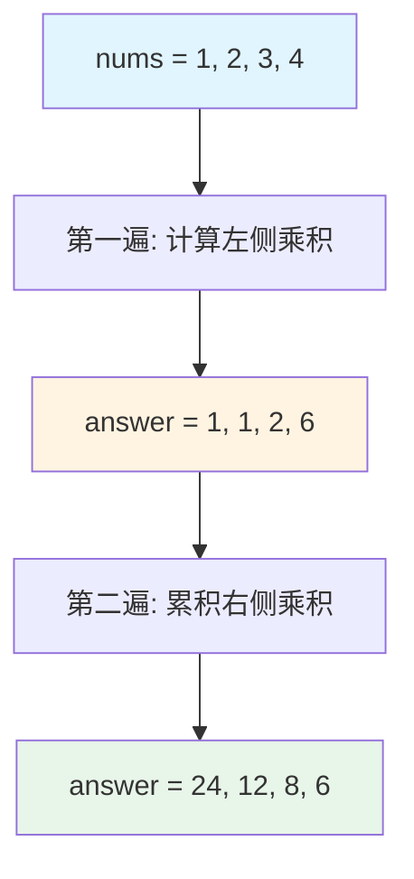

# 238. 除了自身以外数组的乘积

## 📋 题目信息
- **难度**：中等
- **标签**：数组、前缀和、前缀积
- **来源**：LeetCode

## 📖 题目描述

给你一个整数数组 `nums`，返回 数组 `answer` ，其中 `answer[i]` 等于 `nums` 中除了 `nums[i]` 之外其余各元素的乘积 。

题目数据  **保证**  数组 `nums`之中任意元素的全部前缀元素和后缀的乘积都在   **32 位**  整数范围内。

请  **不要使用除法，** 且在 `O(n)` 时间复杂度内完成此题。

### 示例

**示例 1：**
```
输入: nums = [1,2,3,4]
输出: [24,12,8,6]
```

**示例 2：**
```
输入: nums = [-1,1,0,-3,3]
输出: [0,0,9,0,0]
```

### 约束条件

- `2 <= nums.length <= 10^5`
- `-30 <= nums[i] <= 30`
- 输入  **保证**  数组 `answer[i]` 在   **32 位**  整数范围内

**进阶：** 你可以在 `O(1)` 的额外空间复杂度内完成这个题目吗？（ 出于对空间复杂度分析的目的，输出数组  **不被视为**  额外空间。）

---

## 🤔 题目分析

### 问题理解

让我们用自己的话重新理解这道题：

对于数组中的每个位置 `i`，我们需要计算"除了这个位置之外，其他所有元素的乘积"。

**关键点：**
- 对于位置 `i`，结果 = 左边所有元素的乘积 × 右边所有元素的乘积
- 不能使用除法（否则可以先算总乘积再除以当前元素）
- 需要 O(n) 时间复杂度（不能用暴力的 O(n²)）
- 进阶要求 O(1) 额外空间（不计输出数组）

### 关键观察

**核心洞察：**

对于数组 `[1, 2, 3, 4]`，我们来看位置 2（值为 3）：
- 它左边的元素：`[1, 2]`，乘积 = 1 × 2 = 2
- 它右边的元素：`[4]`，乘积 = 4
- 结果：2 × 4 = 8

**关键发现：**
```
answer[i] = (nums[0] × ... × nums[i-1]) × (nums[i+1] × ... × nums[n-1])
          = 左边所有元素的乘积 × 右边所有元素的乘积
```

这让我们想到了**前缀积**的概念！就像前缀和一样，我们可以预先计算：
- 每个位置左边所有元素的乘积
- 每个位置右边所有元素的乘积

### 问题分解

1. **如何高效计算左边的乘积？** → 从左到右遍历，维护前缀积
2. **如何高效计算右边的乘积？** → 从右到左遍历，维护后缀积
3. **如何组合两者？** → 对应位置相乘

---

## 💡 解题思路

### 方法一：暴力解法

#### 思路说明

最直观的想法：对于每个位置 `i`，遍历数组计算除了 `nums[i]` 之外所有元素的乘积。

#### 算法步骤

1. 创建结果数组 `answer`
2. 对于每个位置 `i`：
   - 初始化乘积 `product = 1`
   - 遍历数组的每个位置 `j`：
     - 如果 `j != i`，则 `product *= nums[j]`
   - 将 `product` 存入 `answer[i]`
3. 返回 `answer`

#### 复杂度分析

- **时间复杂度**：O(n²) - 外层循环 n 次，内层循环 n 次
- **空间复杂度**：O(1) - 不计输出数组，只用了常数变量

#### 为什么需要优化

暴力解法的问题在于：
- 对于每个位置，都要重新遍历整个数组
- 存在大量重复计算
- 当 n = 10^5 时，需要 10^10 次操作，会超时

**优化方向**：能否避免重复计算？能否用 O(n) 时间完成？

---

### 方法二：前缀积 + 后缀积（两个数组）

#### 🌟 形象化理解

> **💡 在进入专业算法分析之前，先通过一个生活化的例子来理解优化思路的本质**

**场景类比**：

想象你是一个工厂的质检员，生产线上有一排产品 `[A, B, C, D]`。你需要为每个产品计算"除了它自己，其他所有产品的总价值"。

**笨方法（暴力）**：
- 检查产品 A 时：计算 B × C × D
- 检查产品 B 时：计算 A × C × D
- 检查产品 C 时：计算 A × B × D
- 检查产品 D 时：计算 A × B × C

每次都要重新计算，太慢了！

**聪明方法（前缀积）**：

你准备两个笔记本：

**笔记本1（从左往右记录）**：
- 位置 0 之前：没有产品，记为 1
- 位置 1 之前：A，记为 A
- 位置 2 之前：A × B，记为 A×B
- 位置 3 之前：A × B × C，记为 A×B×C

**笔记本2（从右往左记录）**：
- 位置 3 之后：没有产品，记为 1
- 位置 2 之后：D，记为 D
- 位置 1 之后：C × D，记为 C×D
- 位置 0 之后：B × C × D，记为 B×C×D

**计算结果时**：
- 产品 A 的答案 = 左边的积（1） × 右边的积（B×C×D）
- 产品 B 的答案 = 左边的积（A） × 右边的积（C×D）
- 产品 C 的答案 = 左边的积（A×B） × 右边的积（D）
- 产品 D 的答案 = 左边的积（A×B×C） × 右边的积（1）

**对应关系**：
- **数组元素** = 生产线上的产品
- **前缀积数组** = 从左往右的笔记本
- **后缀积数组** = 从右往左的笔记本
- **最终答案** = 两个笔记本对应位置的乘积

**核心理解**：
提前记录好"左边的累积"和"右边的累积"，查询时直接相乘，避免重复计算。

**从类比到算法**：
现在让我们把这个生活化的思想转化为具体的算法...

---

#### 优化思路推导

**思考过程**：

1. **暴力解法的瓶颈**：每次都要遍历整个数组计算乘积
2. **观察重复计算**：
   - 计算 `answer[0]` 时：需要 `nums[1] × nums[2] × nums[3]`
   - 计算 `answer[1]` 时：需要 `nums[0] × nums[2] × nums[3]`
   - 很多乘积被重复计算了
3. **引入前缀积的思想**：
   - 类似前缀和，我们可以预先计算前缀积
   - `left[i]` = `nums[0] × nums[1] × ... × nums[i-1]`（位置 i 左边所有元素的乘积）
   - `right[i]` = `nums[i+1] × nums[i+2] × ... × nums[n-1]`（位置 i 右边所有元素的乘积）
4. **组合结果**：
   - `answer[i] = left[i] × right[i]`

#### 算法步骤

1. **创建左侧乘积数组 `left`**：
   - `left[0] = 1`（第一个元素左边没有元素）
   - 从左到右遍历：`left[i] = left[i-1] × nums[i-1]`

2. **创建右侧乘积数组 `right`**：
   - `right[n-1] = 1`（最后一个元素右边没有元素）
   - 从右到左遍历：`right[i] = right[i+1] × nums[i+1]`

3. **计算最终结果**：
   - `answer[i] = left[i] × right[i]`

#### 复杂度分析

- **时间复杂度**：O(n) - 三次遍历，每次 O(n)
- **空间复杂度**：O(n) - 使用了 `left` 和 `right` 两个辅助数组

#### 💭 回顾类比

- 生产线上的产品 → 数组元素
- 从左往右的笔记本 → `left` 数组（前缀积）
- 从右往左的笔记本 → `right` 数组（后缀积）
- 查笔记本相乘 → `left[i] × right[i]`

这就是为什么这个算法能够优化的原因：**用空间换时间，避免重复计算**。

---

### 方法三：优化空间（一个数组 + 一个变量）

#### 🌟 形象化理解

**场景类比**：

还是刚才的工厂质检员，但现在老板说："只给你一个笔记本，不能用两个！"

**聪明做法**：

1. **第一遍（从左往右）**：
   - 在答案纸上直接写下"左边的累积"
   - 答案纸现在是：`[1, A, A×B, A×B×C]`

2. **第二遍（从右往左）**：
   - 用一个临时变量记住"右边的累积"
   - 边走边更新答案纸：用答案纸上的值（左边累积）× 临时变量（右边累积）
   - 同时更新临时变量

**核心理解**：
不需要两个笔记本，可以先在答案纸上写左边的，然后用一个临时变量记住右边的，边走边更新答案。

---

#### 优化思路推导

**思考过程**：

1. **方法二的空间瓶颈**：使用了两个 O(n) 的辅助数组
2. **观察**：
   - `left` 数组最终会和 `right` 数组相乘
   - 我们可以直接把 `left` 的值存在 `answer` 中
   - `right` 数组可以用一个变量动态计算
3. **优化策略**：
   - 第一遍：在 `answer` 中存储左侧乘积
   - 第二遍：用一个变量 `right` 从右往左累积，同时更新 `answer`

#### 算法步骤

1. **第一遍（从左到右）**：
   - 初始化 `answer[0] = 1`
   - 从左到右遍历：`answer[i] = answer[i-1] × nums[i-1]`
   - 此时 `answer[i]` 存储的是位置 i 左边所有元素的乘积

2. **第二遍（从右到左）**：
   - 初始化 `right = 1`（表示右边的累积乘积）
   - 从右到左遍历：
     - `answer[i] = answer[i] × right`（左边的积 × 右边的积）
     - `right = right × nums[i]`（更新右边的累积乘积）

3. **返回 `answer`**

#### 复杂度分析

- **时间复杂度**：O(n) - 两次遍历，每次 O(n)
- **空间复杂度**：O(1) - 只使用了常数个变量（不计输出数组）

#### 💭 回顾类比

- 答案纸 → `answer` 数组
- 第一遍写左边累积 → 第一次遍历存储前缀积
- 临时变量记右边累积 → `right` 变量
- 边走边更新答案纸 → 第二次遍历更新 `answer`

这就是空间优化的精髓：**复用输出数组，用变量代替数组**。

---

## 🎨 图解说明

### 执行过程示例

**示例输入**：`nums = [1, 2, 3, 4]`

让我们详细看看优化解法（方法三）的执行过程：

#### 初始状态
```
nums   = [1, 2, 3, 4]
answer = [?, ?, ?, ?]  (待填充)
```

#### 第一遍：从左到右计算前缀积

```
步骤0：初始化
answer[0] = 1  (第一个元素左边没有元素)
answer = [1, ?, ?, ?]

步骤1：i=1
answer[1] = answer[0] × nums[0] = 1 × 1 = 1
answer = [1, 1, ?, ?]

步骤2：i=2
answer[2] = answer[1] × nums[1] = 1 × 2 = 2
answer = [1, 1, 2, ?]

步骤3：i=3
answer[3] = answer[2] × nums[2] = 2 × 3 = 6
answer = [1, 1, 2, 6]
```

**此时 answer[i] 存储的是位置 i 左边所有元素的乘积**

#### 第二遍：从右到左累积右侧乘积

```
初始化：right = 1 (最右边没有元素)

步骤0：i=3
answer[3] = answer[3] × right = 6 × 1 = 6
right = right × nums[3] = 1 × 4 = 4
answer = [1, 1, 2, 6]

步骤1：i=2
answer[2] = answer[2] × right = 2 × 4 = 8
right = right × nums[2] = 4 × 3 = 12
answer = [1, 1, 8, 6]

步骤2：i=1
answer[1] = answer[1] × right = 1 × 12 = 12
right = right × nums[1] = 12 × 2 = 24
answer = [1, 12, 8, 6]

步骤3：i=0
answer[0] = answer[0] × right = 1 × 24 = 24
right = right × nums[0] = 24 × 1 = 24
answer = [24, 12, 8, 6]
```

**最终结果**：`[24, 12, 8, 6]` ✓

### 可视化图表

#### 前缀积和后缀积的关系



#### 详细计算过程（以位置2为例）

```
位置 2 (值为 3) 的计算：

左边元素: [1, 2]
左边乘积: 1 × 2 = 2

右边元素: [4]
右边乘积: 4

最终结果: 2 × 4 = 8 ✓
```

#### 数据流动图

```
第一遍（从左到右）：
  1  →  1  →  2  →  6
  ↓     ↓     ↓     ↓
 [1]  [1]  [2]  [6]  ← answer数组

第二遍（从右到左）：
  24 ← 12 ← 4  ← 1   ← right变量
  ↓     ↓     ↓     ↓
 [24] [12] [8]  [6]  ← 最终answer
```

---

## ✏️ 代码框架填空

> **💡 学习提示**：在查看完整代码之前，先尝试根据上面的算法步骤，自己思考并填写下面的空白处。这将帮助你从"不知道怎么开始"过渡到"能够独立实现关键逻辑"。

### Python填空版

```python
from typing import List

def productExceptSelf(nums: List[int]) -> List[int]:
    """
    计算除自身以外数组的乘积
    
    参数:
        nums: 输入的整数数组
    
    返回:
        answer: 结果数组，answer[i] 等于 nums 中除 nums[i] 之外其余各元素的乘积
    """
    n = len(nums)
    
    # 🔹 填空1：初始化结果数组
    # 提示：需要创建一个长度为 n 的数组来存储结果
    answer = ______
    
    # 第一遍：从左到右，计算每个位置左边所有元素的乘积
    # 🔹 填空2：初始化第一个位置的值
    # 提示：第一个元素左边没有元素，乘积应该是多少？
    answer[0] = ______
    
    # 🔹 填空3：从左到右遍历，计算左侧乘积
    # 提示：从索引1开始，到索引n-1结束
    for i in range(______, ______):
        # 🔹 填空4：计算当前位置左边所有元素的乘积
        # 提示：当前位置的左侧乘积 = 前一个位置的左侧乘积 × 前一个元素的值
        answer[i] = ______ × ______
    
    # 第二遍：从右到左，累积右侧乘积并更新结果
    # 🔹 填空5：初始化右侧累积乘积变量
    # 提示：最右边元素的右侧没有元素，乘积应该是多少？
    right = ______
    
    # 🔹 填空6：从右到左遍历
    # 提示：从索引n-1开始，到索引0结束（包含），步长为-1
    for i in range(______, ______, ______):
        # 🔹 填空7：更新当前位置的最终结果
        # 提示：最终结果 = 左侧乘积 × 右侧乘积
        answer[i] = ______ × ______
        
        # 🔹 填空8：更新右侧累积乘积
        # 提示：右侧累积乘积需要包含当前元素
        right = ______ × ______
    
    # 🔹 填空9：返回结果
    return ______


# 测试用例
if __name__ == "__main__":
    # 测试用例1
    nums1 = [1, 2, 3, 4]
    expected1 = [24, 12, 8, 6]
    result1 = productExceptSelf(nums1)
    print(f"测试1: {result1 == expected1}, 结果: {result1}")
    
    # 测试用例2
    nums2 = [-1, 1, 0, -3, 3]
    expected2 = [0, 0, 9, 0, 0]
    result2 = productExceptSelf(nums2)
    print(f"测试2: {result2 == expected2}, 结果: {result2}")
```

### 填空提示详解

**填空1 - 初始化结果数组**
- 思考：需要一个什么样的数组来存储结果？
- 提示：长度应该和输入数组相同
- 参考：`[0] * n` 创建长度为 n 的数组

**填空2 - 第一个位置的左侧乘积**
- 思考：第一个元素左边有元素吗？
- 提示：没有元素时，乘积的单位元是什么？
- 答案应该是：1

**填空3 - 第一遍循环范围**
- 思考：从哪个索引开始？到哪个索引结束？
- 提示：第一个位置已经初始化了，从第二个位置开始
- 范围：从 1 到 n

**填空4 - 计算左侧乘积**
- 思考：当前位置的左侧乘积如何从前一个位置推导？
- 提示：前一个位置的左侧乘积 × 前一个元素
- 需要用到：`answer[i-1]` 和 `nums[i-1]`

**填空5 - 初始化右侧累积变量**
- 思考：最右边元素的右侧有元素吗？
- 提示：和填空2类似，乘积的单位元
- 答案应该是：1

**填空6 - 第二遍循环范围**
- 思考：从右到左遍历，起点、终点、步长是什么？
- 提示：从最后一个索引开始，到第一个索引结束，每次减1
- 范围：`range(n-1, -1, -1)`

**填空7 - 更新最终结果**
- 思考：最终结果由哪两部分组成？
- 提示：左侧乘积（已存在answer中）× 右侧乘积（right变量）
- 需要用到：`answer[i]` 和 `right`

**填空8 - 更新右侧累积乘积**
- 思考：下一次迭代时，right应该包含哪些元素？
- 提示：当前的right × 当前元素
- 需要用到：`right` 和 `nums[i]`

**填空9 - 返回结果**
- 思考：题目要求返回什么？
- 答案：`answer`

### C++填空版

```cpp
#include <vector>
using namespace std;

class Solution {
public:
    vector<int> productExceptSelf(vector<int>& nums) {
        int n = nums.size();
        
        // 🔹 填空1：初始化结果数组
        // 提示：创建一个大小为n的vector
        vector<int> answer(______);
        
        // 第一遍：从左到右
        // 🔹 填空2：初始化第一个位置
        answer[0] = ______;
        
        // 🔹 填空3：循环计算左侧乘积
        for (int i = ______; i < ______; i++) {
            // 🔹 填空4：计算左侧乘积
            answer[i] = ______ * ______;
        }
        
        // 第二遍：从右到左
        // 🔹 填空5：初始化右侧累积变量
        int right = ______;
        
        // 🔹 填空6：从右到左遍历
        for (int i = ______; i >= ______; i--) {
            // 🔹 填空7：更新最终结果
            answer[i] = ______ * ______;
            
            // 🔹 填空8：更新右侧累积
            right = ______ * ______;
        }
        
        // 🔹 填空9：返回结果
        return ______;
    }
};
```

---

## 💻 完整代码实现

> **✅ 对照检查**：现在对比你的填空答案和下面的完整实现，看看思路是否一致。

### Python实现

```python
from typing import List

def productExceptSelf(nums: List[int]) -> List[int]:
    """
    计算除自身以外数组的乘积
    
    时间复杂度：O(n)
    空间复杂度：O(1) - 不计输出数组
    
    参数:
        nums: 输入的整数数组
    
    返回:
        answer: 结果数组，answer[i] 等于 nums 中除 nums[i] 之外其余各元素的乘积
    """
    n = len(nums)
    answer = [0] * n  # 创建结果数组
    
    # 第一遍：从左到右，计算每个位置左边所有元素的乘积
    answer[0] = 1  # 第一个元素左边没有元素，乘积为1
    for i in range(1, n):
        # 当前位置的左侧乘积 = 前一个位置的左侧乘积 × 前一个元素
        answer[i] = answer[i - 1] * nums[i - 1]
    
    # 第二遍：从右到左，累积右侧乘积并更新结果
    right = 1  # 最右边元素的右侧没有元素，乘积为1
    for i in range(n - 1, -1, -1):
        # 最终结果 = 左侧乘积（已在answer中） × 右侧乘积（right变量）
        answer[i] = answer[i] * right
        # 更新右侧累积乘积，为下一次迭代做准备
        right = right * nums[i]
    
    return answer


# 测试用例
if __name__ == "__main__":
    # 测试用例1
    nums1 = [1, 2, 3, 4]
    expected1 = [24, 12, 8, 6]
    result1 = productExceptSelf(nums1)
    print(f"测试1: {'通过' if result1 == expected1 else '失败'}")
    print(f"  输入: {nums1}")
    print(f"  输出: {result1}")
    print(f"  期望: {expected1}")
    print()
    
    # 测试用例2
    nums2 = [-1, 1, 0, -3, 3]
    expected2 = [0, 0, 9, 0, 0]
    result2 = productExceptSelf(nums2)
    print(f"测试2: {'通过' if result2 == expected2 else '失败'}")
    print(f"  输入: {nums2}")
    print(f"  输出: {result2}")
    print(f"  期望: {expected2}")
    print()
    
    # 测试用例3：包含负数
    nums3 = [2, -3, 4]
    result3 = productExceptSelf(nums3)
    print(f"测试3: 包含负数")
    print(f"  输入: {nums3}")
    print(f"  输出: {result3}")
    print(f"  验证: 2的结果 = -3*4 = {-3*4}, 实际 = {result3[0]}")
```

**代码说明**：

- **第8行**：创建长度为 n 的结果数组，初始值为0
- **第11行**：第一个元素左边没有元素，所以左侧乘积为1（乘法的单位元）
- **第12-14行**：从左到右遍历，计算每个位置的左侧乘积
  - `answer[i-1]` 是前一个位置的左侧乘积
  - `nums[i-1]` 是前一个元素的值
  - 两者相乘得到当前位置的左侧乘积
- **第17行**：初始化右侧累积变量为1
- **第18-22行**：从右到左遍历，累积右侧乘积并更新最终结果
  - 先用当前的 `right` 更新 `answer[i]`
  - 再将当前元素 `nums[i]` 累积到 `right` 中

**填空答案解析**：

- **填空1**：`[0] * n` - 创建长度为n的列表
- **填空2**：`1` - 第一个元素左边没有元素，乘积为1
- **填空3**：`1, n` - 从索引1开始到n-1
- **填空4**：`answer[i-1] * nums[i-1]` - 前一个位置的左侧乘积 × 前一个元素
- **填空5**：`1` - 最右边元素右侧没有元素，乘积为1
- **填空6**：`n-1, -1, -1` - 从n-1到0，步长-1
- **填空7**：`answer[i] * right` - 左侧乘积 × 右侧乘积
- **填空8**：`right * nums[i]` - 累积当前元素到右侧乘积
- **填空9**：`answer` - 返回结果数组

---

### C++实现

```cpp
#include <vector>
#include <iostream>
using namespace std;

class Solution {
public:
    /**
     * 计算除自身以外数组的乘积
     * 
     * 时间复杂度：O(n)
     * 空间复杂度：O(1) - 不计输出数组
     */
    vector<int> productExceptSelf(vector<int>& nums) {
        int n = nums.size();
        vector<int> answer(n);  // 创建结果数组
        
        // 第一遍：从左到右，计算每个位置左边所有元素的乘积
        answer[0] = 1;  // 第一个元素左边没有元素，乘积为1
        for (int i = 1; i < n; i++) {
            // 当前位置的左侧乘积 = 前一个位置的左侧乘积 × 前一个元素
            answer[i] = answer[i - 1] * nums[i - 1];
        }
        
        // 第二遍：从右到左，累积右侧乘积并更新结果
        int right = 1;  // 最右边元素的右侧没有元素，乘积为1
        for (int i = n - 1; i >= 0; i--) {
            // 最终结果 = 左侧乘积（已在answer中） × 右侧乘积（right变量）
            answer[i] = answer[i] * right;
            // 更新右侧累积乘积，为下一次迭代做准备
            right = right * nums[i];
        }
        
        return answer;
    }
};

// 测试代码
int main() {
    Solution sol;
    
    // 测试用例1
    vector<int> nums1 = {1, 2, 3, 4};
    vector<int> result1 = sol.productExceptSelf(nums1);
    cout << "测试1: [";
    for (int i = 0; i < result1.size(); i++) {
        cout << result1[i];
        if (i < result1.size() - 1) cout << ", ";
    }
    cout << "]" << endl;
    // 期望输出: [24, 12, 8, 6]
    
    // 测试用例2
    vector<int> nums2 = {-1, 1, 0, -3, 3};
    vector<int> result2 = sol.productExceptSelf(nums2);
    cout << "测试2: [";
    for (int i = 0; i < result2.size(); i++) {
        cout << result2[i];
        if (i < result2.size() - 1) cout << ", ";
    }
    cout << "]" << endl;
    // 期望输出: [0, 0, 9, 0, 0]
    
    return 0;
}
```

**与Python的主要差异**：

1. **类型声明**：C++需要明确声明变量类型（`int`, `vector<int>`）
2. **数组初始化**：
   - Python: `[0] * n`
   - C++: `vector<int> answer(n)`
3. **循环语法**：
   - Python: `for i in range(1, n)`
   - C++: `for (int i = 1; i < n; i++)`
4. **反向循环**：
   - Python: `for i in range(n-1, -1, -1)`
   - C++: `for (int i = n - 1; i >= 0; i--)`

**填空答案解析（C++版本）**：

- **填空1**：`n` - 创建大小为n的vector
- **填空2**：`1` - 第一个元素左边没有元素
- **填空3**：`1, n` - 循环从1到n-1
- **填空4**：`answer[i-1] * nums[i-1]` - 左侧乘积计算
- **填空5**：`1` - 右侧累积初始值
- **填空6**：`n-1, 0` - 从n-1到0
- **填空7**：`answer[i] * right` - 最终结果
- **填空8**：`right * nums[i]` - 更新右侧累积
- **填空9**：`answer` - 返回结果

---

## ⚠️ 易错点提醒

### 1. 边界条件

**易错点**：忘记处理数组长度为2的情况

虽然题目保证 `2 <= nums.length`，但要确保算法对最小情况也正确。

**正确处理**：
```python
# 对于 nums = [a, b]
# answer[0] = 1 (左侧) × b (右侧) = b ✓
# answer[1] = a (左侧) × 1 (右侧) = a ✓
```

我们的算法天然支持这种情况，无需特殊处理。

---

### 2. 常见错误

**错误1**：混淆左侧和右侧乘积的计算顺序

- **原因**：第一遍从左到右，第二遍从右到左，容易搞混
- **正确做法**：
  - 第一遍：`answer[i] = answer[i-1] × nums[i-1]`（用前一个位置）
  - 第二遍：`right = right × nums[i]`（用当前位置）
- **填空时注意**：仔细区分 `i-1` 和 `i` 的使用

**错误2**：第二遍循环时先更新 `right` 再更新 `answer`

```python
# ❌ 错误写法
for i in range(n - 1, -1, -1):
    right = right * nums[i]  # 先更新right
    answer[i] = answer[i] * right  # 再用right，导致多乘了一次nums[i]

# ✓ 正确写法
for i in range(n - 1, -1, -1):
    answer[i] = answer[i] * right  # 先用当前的right
    right = right * nums[i]  # 再更新right
```

- **原因**：顺序错误会导致 `answer[i]` 包含了 `nums[i]` 本身
- **正确做法**：先用 `right` 更新结果，再将当前元素累积到 `right`
- **填空时注意**：两行代码的顺序不能颠倒

**错误3**：初始化 `answer[0]` 或 `right` 时使用了错误的值

```python
# ❌ 错误写法
answer[0] = 0  # 错误！乘积的单位元是1，不是0
right = 0      # 错误！会导致所有结果都是0

# ✓ 正确写法
answer[0] = 1  # 乘法的单位元
right = 1      # 乘法的单位元
```

- **原因**：混淆了加法和乘法的单位元
- **正确做法**：乘法的单位元是1（任何数乘以1等于自己）
- **填空时注意**：初始值必须是1

---

### 3. 调试技巧

**技巧1**：分步验证

```python
# 在第一遍循环后打印 answer，检查左侧乘积是否正确
print(f"第一遍后: {answer}")

# 在第二遍循环中打印每一步
for i in range(n - 1, -1, -1):
    print(f"i={i}, answer[{i}]={answer[i]}, right={right}")
    answer[i] = answer[i] * right
    right = right * nums[i]
```

**技巧2**：手动计算小例子

对于 `nums = [1, 2, 3, 4]`，手动计算每个位置的期望值：
- `answer[0] = 2 × 3 × 4 = 24`
- `answer[1] = 1 × 3 × 4 = 12`
- `answer[2] = 1 × 2 × 4 = 8`
- `answer[3] = 1 × 2 × 3 = 6`

**技巧3**：验证填空答案

填完空后，用测试用例验证：
```python
# 快速验证
nums = [1, 2, 3, 4]
result = productExceptSelf(nums)
assert result == [24, 12, 8, 6], f"期望 [24, 12, 8, 6]，实际 {result}"
```

**技巧4**：检查特殊情况

```python
# 包含0的情况
nums = [1, 0, 3]
# answer[0] = 0 × 3 = 0
# answer[1] = 1 × 3 = 3
# answer[2] = 1 × 0 = 0
# 期望: [0, 3, 0]

# 包含负数的情况
nums = [-1, 2, -3]
# answer[0] = 2 × (-3) = -6
# answer[1] = (-1) × (-3) = 3
# answer[2] = (-1) × 2 = -2
# 期望: [-6, 3, -2]
```

---

## 🔗 相似题目推荐

### 同类型题目

这些题目使用相同或相似的算法思路（前缀积/前缀和）：

1. **[LeetCode 303] - 区域和检索 - 数组不可变** (Easy)
   - 相似点：使用前缀和思想，预处理后快速查询区间和
   - 建议：可以用类似的填空方式练习前缀和的构建
   - 核心：`prefixSum[i] = prefixSum[i-1] + nums[i-1]`

2. **[LeetCode 304] - 二维区域和检索 - 矩阵不可变** (Medium)
   - 相似点：前缀和的二维扩展
   - 建议：先掌握一维前缀和，再学习二维
   - 核心：二维前缀和的构建和查询

3. **[LeetCode 724] - 寻找数组的中心下标** (Easy)
   - 相似点：需要计算左侧和右侧的和（或积）
   - 建议：用双指针或前缀和思想
   - 核心：左侧和 = 右侧和的位置

### 进阶题目

掌握本题后，可以挑战这些更难的题目：

1. **[LeetCode 152] - 乘积最大子数组** (Medium)
   - 进阶点：需要同时维护最大值和最小值（因为负数）
   - 与本题的联系：都涉及数组乘积的计算
   - 难度提升：需要动态规划思想

2. **[LeetCode 560] - 和为K的子数组** (Medium)
   - 进阶点：前缀和 + 哈希表的组合应用
   - 与本题的联系：都使用前缀思想
   - 难度提升：需要理解前缀和的差值含义

3. **[LeetCode 1314] - 矩阵区域和** (Medium)
   - 进阶点：二维前缀和的应用
   - 与本题的联系：前缀思想的扩展
   - 难度提升：从一维到二维的思维转换

### 相关知识点

本题涉及的核心知识点：

- **前缀积（Prefix Product）**：类似前缀和，预处理累积乘积
  - 相关题目：LeetCode 238、152
  - 应用场景：需要快速计算区间乘积

- **空间优化技巧**：用变量代替数组，降低空间复杂度
  - 相关题目：LeetCode 238、509（斐波那契数）
  - 应用场景：动态规划的空间优化

- **双向遍历**：从左到右和从右到左两次遍历
  - 相关题目：LeetCode 238、42（接雨水）、135（分发糖果）
  - 应用场景：需要同时考虑左右两侧信息

---

## 📚 知识点总结

### 核心算法

**前缀积（Prefix Product）**

前缀积是前缀和思想在乘法运算上的应用：
- **前缀和**：`prefixSum[i] = nums[0] + nums[1] + ... + nums[i]`
- **前缀积**：`prefixProduct[i] = nums[0] × nums[1] × ... × nums[i]`

**本题的创新点**：
- 不仅需要前缀积，还需要后缀积
- 通过两次遍历分别计算左侧和右侧的乘积
- 空间优化：复用输出数组，用变量代替后缀积数组

### 数据结构

- **数组（Array）**：存储前缀积和最终结果
- **变量（Variable）**：动态维护后缀积，实现空间优化

### 解题模板

```python
# 前缀积 + 后缀积模板（空间优化版）
def prefixSuffixProduct(nums):
    n = len(nums)
    answer = [0] * n
    
    # 第一遍：计算前缀积
    answer[0] = 1  # 初始化
    for i in range(1, n):
        answer[i] = answer[i-1] * nums[i-1]
    
    # 第二遍：累积后缀积
    suffix = 1  # 初始化
    for i in range(n-1, -1, -1):
        answer[i] = answer[i] * suffix  # 先用
        suffix = suffix * nums[i]        # 再更新
    
    return answer
```

**模板要点**：
1. 初始化为乘法单位元（1）
2. 第一遍从左到右，用 `i-1` 计算
3. 第二遍从右到左，先用后更新
4. 注意更新顺序不能颠倒

### 学习要点

1. **理解前缀思想**：预处理累积信息，避免重复计算
2. **掌握双向遍历**：有些问题需要同时考虑左右两侧
3. **空间优化技巧**：复用数组，用变量代替数组
4. **填空练习的价值**：通过填空，你应该掌握了：
   - 如何初始化前缀积（单位元是1）
   - 如何从左到右累积
   - 如何从右到左更新
   - 更新顺序的重要性

---

## 📝 补充说明

### 从填空到完整实现的进阶路径

1. **第一遍**：看算法步骤，尝试填空（不看提示）
2. **第二遍**：对照答案，理解每个填空的原因
3. **第三遍**：不看提示，独立完整实现
4. **第四遍**：优化代码，考虑边界情况，添加注释

### 时间复杂度优化历程

- **暴力解法**：O(n²) → 每个位置都要遍历整个数组
  - 瓶颈：大量重复计算
- **前缀积优化**：O(n) → 预处理前缀积和后缀积
  - 优化策略：空间换时间，避免重复计算
  - 两次遍历：O(n) + O(n) = O(n)

### 空间复杂度权衡

- **方法二**：O(n) 空间 - 使用两个辅助数组
  - 优点：思路清晰，易于理解
  - 缺点：需要额外的 O(n) 空间

- **方法三**：O(1) 空间 - 只用一个变量
  - 优点：满足进阶要求，空间最优
  - 缺点：需要理解如何复用输出数组

**权衡建议**：
- 面试时先说清楚两种方法
- 如果时间充裕，实现空间优化版本
- 如果面试官没有特别要求，方法二也完全可以

### 实际应用场景

这个算法在实际中的应用：

1. **数据分析**：计算除某个异常值外的统计指标
2. **推荐系统**：计算除当前用户外其他用户的行为特征
3. **图像处理**：计算除当前像素外周围像素的综合信息
4. **金融计算**：计算除某个时间点外的累积收益率

### 扩展思考

**问题1**：如果允许使用除法，如何解决？

```python
def productExceptSelfWithDivision(nums):
    # 计算总乘积
    total = 1
    zero_count = 0
    for num in nums:
        if num != 0:
            total *= num
        else:
            zero_count += 1
    
    # 根据0的个数分情况讨论
    result = []
    for num in nums:
        if zero_count > 1:
            result.append(0)
        elif zero_count == 1:
            result.append(total if num == 0 else 0)
        else:
            result.append(total // num)
    
    return result
```

**问题2**：如果数组很大，如何并行化？

- 可以将数组分段，每段独立计算前缀积
- 最后合并各段的结果
- 适合分布式计算场景

---

**🎉 恭喜你完成了这道题的学习！**

通过本题，你应该掌握了：
- ✅ 前缀积的概念和应用
- ✅ 双向遍历的技巧
- ✅ 空间优化的方法
- ✅ 通过填空练习理解算法的每个步骤

继续加油，向更多算法题目挑战！💪


