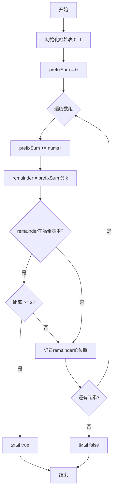

# 523. 连续的子数组和

## 📋 题目信息
- **难度**：Medium
- **标签**：数组、哈希表、数学、前缀和
- **来源**：LeetCode

## 📖 题目描述

给你一个整数数组 `nums` 和一个整数 `k`，如果 `nums` 有一个 **好的子数组** 返回 `true`，否则返回 `false`：

一个 **好的子数组** 是：

*   长度 **至少为 2**，且
*   子数组元素总和为 `k` 的倍数。

**注意**：

*   **子数组** 是数组中 **连续** 的部分。
*   如果存在一个整数 `n`，令整数 `x` 符合 `x = n * k`，则称 `x` 是 `k` 的一个倍数。`0` **始终** 视为 `k` 的一个倍数。

### 示例

**示例 1：**
```
输入：nums = [23,2,4,6,7], k = 6
输出：true
解释：[2,4] 是一个大小为 2 的子数组，并且和为 6。
```

**示例 2：**
```
输入：nums = [23,2,6,4,7], k = 6
输出：true
解释：[23, 2, 6, 4, 7] 是大小为 5 的子数组，并且和为 42。
42 是 6 的倍数，因为 42 = 7 * 6 且 7 是一个整数。
```

**示例 3：**
```
输入：nums = [23,2,6,4,7], k = 13
输出：false
```

### 约束条件

- `1 <= nums.length <= 10^5`
- `0 <= nums[i] <= 10^9`
- `0 <= sum(nums[i]) <= 2^31 - 1`
- `1 <= k <= 2^31 - 1`

---

## 🤔 题目分析

### 问题理解

这道题要求我们判断数组中是否存在一个长度至少为 2 的连续子数组，使得这个子数组的元素和是 k 的倍数。

用自己的话重新描述：我们需要在数组中找到一个区间 [i, j]（j - i >= 1），使得这个区间内所有元素的和能被 k 整除。

### 关键观察

通过仔细分析题目，我们可以发现以下关键点：

1. **倍数的数学性质**：
   - 如果 sum 是 k 的倍数，那么 sum % k == 0
   - 如果两个数除以 k 的余数相同，它们的差是 k 的倍数

2. **同余定理的应用**：
   - 如果 prefixSum[i] % k == prefixSum[j] % k
   - 那么 (prefixSum[j] - prefixSum[i]) % k == 0
   - 即区间 (i, j] 的和是 k 的倍数

3. **长度限制**：
   - 子数组长度至少为 2
   - 即 j - i >= 2，或者说两个相同余数的位置至少相差 2

4. **前缀和 + 哈希表**：
   - 用哈希表记录每个余数第一次出现的位置
   - 当再次遇到相同余数时，检查距离是否 >= 2

5. **特殊情况**：
   - 0 始终是 k 的倍数
   - 需要初始化 {0: -1} 处理从数组开始就满足条件的情况

### 核心难点

1. **如何高效判断子数组和是否为 k 的倍数？**
   - 暴力方法：枚举所有子数组并计算和 → O(n²)
   - 优化方法：前缀和 + 取模 + 哈希表 → O(n)

2. **如何利用同余定理？**
   - 理解：两个前缀和的余数相同，它们的差就是 k 的倍数
   - 这是解题的数学基础

3. **如何处理长度限制？**
   - 必须保证子数组长度至少为 2
   - 需要检查两个位置的距离是否 >= 2

### 问题本质

这道题的本质是：**利用同余定理和前缀和，将"子数组和是 k 的倍数"转化为"两个前缀和的余数相同"，然后用哈希表高效查找**。

关键洞察：
- **同余定理**：(a - b) % k == 0 ⟺ a % k == b % k
- **前缀和的应用**：区间和 = 两个前缀和的差
- **哈希表加速**：O(1) 时间查找之前是否出现过相同的余数

---

## 💡 解题思路

### 方法一：暴力解法

#### 思路说明

最直观的想法是：枚举所有长度至少为 2 的子数组，计算每个子数组的和，判断是否为 k 的倍数。

#### 算法步骤

1. **外层循环**：遍历所有可能的起始位置 i
2. **内层循环**：从 i+1 开始遍历所有可能的结束位置 j（保证长度至少为 2）
3. **计算和**：累加区间 [i, j] 的元素和
4. **判断倍数**：如果 sum % k == 0，返回 true
5. **返回结果**：如果所有子数组都不满足，返回 false

#### 复杂度分析

- **时间复杂度**：O(n²) - 两层嵌套循环
- **空间复杂度**：O(1) - 只使用常数变量

#### 为什么需要优化

虽然暴力解法简单直观，但存在明显的性能瓶颈：

1. **效率低下**：当 n = 10⁵ 时，O(n²) 约为 10¹⁰ 次操作，会超时
2. **重复计算**：每个子数组都要重新计算和，存在大量重复计算
3. **无法通过大数据测试**：题目约束 n 最大为 10⁵，暴力解法无法通过

---

### 方法二：前缀和 + 哈希表 + 同余定理

#### 🌟 形象化理解：钟表的指针

> **💡 在进入专业算法分析之前，先通过一个生活化的例子来理解同余定理**

**场景类比**：

想象一个钟表，时针每转一圈回到 12 点：
- 如果现在是 3 点，再过 9 小时后是 12 点（3 + 9 = 12）
- 如果现在是 3 点，再过 21 小时后也是 12 点（3 + 21 = 24 = 0）
- 关键：只要两个时刻在钟表上指向同一位置，它们之间的时间差就是 12 的倍数

**对应关系**：
- **钟表的 12 个刻度** = k 的取模运算
- **时针的位置** = 前缀和对 k 取模的余数
- **两次指向同一位置** = 两个前缀和的余数相同
- **两次之间的时间差** = 子数组的和（是 k 的倍数）

**核心理解**：
如果两个前缀和除以 k 的余数相同（就像时针两次指向同一位置），那么这两个前缀和的差就是 k 的倍数（就像时间差是 12 小时的倍数）。

**举例说明**：
```
k = 6，数组 = [23, 2, 4, 6, 7]
前缀和：    [23, 25, 29, 35, 42]
余数：      [5,  1,  5,  5,  0]

位置 0 和位置 2 的余数都是 5（时针两次指向 5 点）
它们之间的和 = 29 - 23 = 6（是 6 的倍数）✓
```

**从类比到算法**：
现在让我们把这个钟表的思想转化为具体的算法...

---

#### 优化思路推导

**思考过程**：

1. **暴力解法的瓶颈**：需要枚举所有子数组并计算和，时间复杂度 O(n²)

2. **数学转化**：
   - 子数组和是 k 的倍数 ⟺ sum % k == 0
   - 利用前缀和：区间 [i, j] 的和 = prefixSum[j] - prefixSum[i-1]
   - 如果 (prefixSum[j] - prefixSum[i-1]) % k == 0
   - 根据同余定理：prefixSum[j] % k == prefixSum[i-1] % k

3. **同余定理的应用**：
   - 如果两个前缀和对 k 取模的余数相同
   - 那么它们的差就是 k 的倍数
   - 问题转化为：找两个余数相同的前缀和

4. **哈希表优化**：
   - 用哈希表记录每个余数第一次出现的位置
   - 当再次遇到相同余数时，检查距离是否 >= 2
   - 如果满足，返回 true

5. **初始化技巧**：
   - 初始化 {0: -1}，表示余数 0 在位置 -1
   - 这样可以处理从数组开始就满足条件的情况

#### 算法步骤

1. **初始化**：
   - 创建哈希表 `remainderToIndex`，初始化为 `{0: -1}`
   - 初始化 `prefixSum = 0`

2. **遍历数组**：
   - 对于每个元素，更新前缀和：`prefixSum += nums[i]`
   - 计算余数：`remainder = prefixSum % k`
   - 如果 `remainder` 在哈希表中：
     - 检查距离：`i - remainderToIndex[remainder]`
     - 如果距离 >= 2，返回 true
   - 如果 `remainder` 不在哈希表中：
     - 记录当前位置：`remainderToIndex[remainder] = i`

3. **返回结果**：如果遍历完都没找到，返回 false

#### 复杂度分析

- **时间复杂度**：O(n) - 只需遍历数组一次，哈希表操作 O(1)
- **空间复杂度**：O(min(n, k)) - 哈希表最多存储 k 个不同的余数

#### 💭 回顾类比

- 生活中的**钟表刻度** 对应 代码中的**k 的取模**
- 生活中的**时针位置** 对应 代码中的**前缀和的余数**
- 生活中的**两次指向同一位置** 对应 代码中的**相同余数**
- 生活中的**时间差是 12 的倍数** 对应 代码中的**子数组和是 k 的倍数**
- 这就是为什么这个算法能够将时间复杂度从 O(n²) 优化到 O(n) 的原因

---

## 🎨 图解说明

### 执行过程示例

让我们通过示例 1 来详细演示算法的执行过程。

**示例输入**：`nums = [23, 2, 4, 6, 7], k = 6`

**执行步骤**：

```
初始状态：
remainderToIndex = {0: -1}  # 余数0在位置-1
prefixSum = 0

索引 0，值 23：
- prefixSum = 0 + 23 = 23
- remainder = 23 % 6 = 5
- 5 不在哈希表中
- remainderToIndex = {0: -1, 5: 0}

索引 1，值 2：
- prefixSum = 23 + 2 = 25
- remainder = 25 % 6 = 1
- 1 不在哈希表中
- remainderToIndex = {0: -1, 5: 0, 1: 1}

索引 2，值 4：
- prefixSum = 25 + 4 = 29
- remainder = 29 % 6 = 5
- 5 在哈希表中！位置是 0
- 距离 = 2 - 0 = 2 >= 2 ✓
- 找到满足条件的子数组 [2, 4]（索引1到2）
- 返回 true

验证：[2, 4] 的和 = 6，6 % 6 = 0 ✓
```

### 可视化图表



### 前缀和与余数变化图

**示例 1：nums = [23, 2, 4, 6, 7], k = 6**

```
索引：      -1   0    1    2    3    4
数组：           23   2    4    6    7
前缀和：    0    23   25   29   35   42
余数：      0    5    1    5    5    0
                 ↑         ↑
                 └─────────┘
                 余数相同，距离=2
                 子数组 [2,4] 和=6
```

**示例 2：nums = [23, 2, 6, 4, 7], k = 6**

```
索引：      -1   0    1    2    3    4
数组：           23   2    6    4    7
前缀和：    0    23   25   31   35   42
余数：      0    5    1    1    5    0
            ↑                        ↑
            └────────────────────────┘
            余数相同，距离=5
            整个数组和=42
```

### 关键理解

**为什么要用取模运算？**
- 取模运算可以判断一个数是否是另一个数的倍数
- 如果 sum % k == 0，说明 sum 是 k 的倍数

**为什么初始化 {0: -1}？**
- 当前缀和的余数为 0 时，说明从数组开始到当前位置的和是 k 的倍数
- 位置 -1 表示"数组开始之前"，这样计算距离时不需要特殊处理
- 例如：索引 1 的余数是 0，距离 = 1 - (-1) = 2，满足长度要求

**为什么只记录第一次出现的位置？**
- 我们只需要判断是否存在满足条件的子数组
- 第一次出现的位置距离当前位置最远，最容易满足长度 >= 2 的要求
- 如果第一次出现的位置都不满足，后续的更不会满足

**同余定理的应用**：
- 如果 a % k == b % k，那么 (a - b) % k == 0
- 即 a - b 是 k 的倍数
- 这是本题的数学基础

**为什么要检查距离 >= 2？**
- 题目要求子数组长度至少为 2
- 如果两个位置是 i 和 j，子数组是 (i, j]，长度是 j - i
- 所以需要 j - i >= 2

---

## ✏️ 代码框架填空

> **💡 学习提示**：在查看完整代码之前，先尝试根据上面的算法步骤，自己思考并填写下面的空白处。这将帮助你从"不知道怎么开始"过渡到"能够独立实现关键逻辑"。

### Python填空版

```python
def checkSubarraySum(nums, k):
    """
    判断是否存在长度至少为2的子数组，其和为k的倍数
    
    参数:
        nums: 整数数组
        k: 目标倍数
    
    返回:
        是否存在满足条件的子数组
    """
    # 🔹 填空1：初始化哈希表
    # 提示：余数0应该在哪个位置？为什么是-1？
    remainder_to_index = {______: ______}
    
    # 🔹 填空2：初始化前缀和
    # 提示：前缀和初始值是多少？
    prefix_sum = ______
    
    # 🔹 填空3：遍历数组
    # 提示：需要同时获取索引和值
    for i, num in ______:
        
        # 🔹 填空4：更新前缀和
        # 提示：累加当前元素
        prefix_sum ______
        
        # 🔹 填空5：计算余数
        # 提示：前缀和对k取模
        remainder = ______
        
        # 🔹 填空6：检查余数是否出现过
        # 提示：如果出现过，说明找到了一个满足条件的子数组
        if ______ in remainder_to_index:
            # 🔹 填空7：检查距离是否满足长度要求
            # 提示：当前位置 - 第一次出现的位置 >= 2
            if ______:
                return True
        else:
            # 🔹 填空8：记录余数第一次出现的位置
            remainder_to_index[______] = ______
    
    # 🔹 填空9：返回结果
    return ______
```

### 填空提示详解

**填空1 - 初始化哈希表**
- 思考：为什么要预设 {0: -1}？
- 提示：当前缀和的余数为0时，说明从开始到当前位置满足条件
- -1 表示"数组开始之前"的位置

**填空2 - 初始化前缀和**
- 思考：前缀和的起始值应该是多少？
- 提示：还没有遍历任何元素时，累积和为0

**填空3 - 遍历数组**
- 思考：需要获取什么信息？
- 提示：需要索引来计算距离，需要值来更新前缀和
- 使用 enumerate(nums)

**填空4 - 更新前缀和**
- 思考：如何累加当前元素？
- 提示：使用 += 运算符

**填空5 - 计算余数**
- 思考：如何计算前缀和对k的余数？
- 提示：使用 % 运算符

**填空6 - 检查是否出现过**
- 思考：如何判断余数是否在哈希表中？
- 提示：使用 in 运算符

**填空7 - 检查距离**
- 思考：如何判断距离是否满足长度要求？
- 提示：当前索引 - 第一次出现的索引 >= 2

**填空8 - 记录位置**
- 思考：要记录什么信息？
- 提示：记录当前余数第一次出现的位置

**填空9 - 返回结果**
- 思考：如果遍历完都没找到，应该返回什么？
- 提示：返回 False

### C++填空版

```cpp
bool checkSubarraySum(vector<int>& nums, int k) {
    // 🔹 填空1：初始化哈希表
    // 提示：使用 unordered_map<int, int>
    unordered_map<int, int> remainderToIndex;
    remainderToIndex[______] = ______;
    
    // 🔹 填空2：初始化前缀和
    int prefixSum = ______;
    
    // 🔹 填空3：遍历数组
    for (int i = 0; i < nums.size(); i++) {
        
        // 🔹 填空4：更新前缀和
        prefixSum ______;
        
        // 🔹 填空5：计算余数
        int remainder = ______;
        
        // 🔹 填空6：检查余数是否出现过
        // 提示：使用 find() 方法
        if (remainderToIndex.______(remainder) != remainderToIndex.______()) {
            // 🔹 填空7：检查距离
            if (______) {
                return true;
            }
        } else {
            // 🔹 填空8：记录位置
            remainderToIndex[______] = ______;
        }
    }
    
    // 🔹 填空9：返回结果
    return ______;
}
```

---

## 💻 完整代码实现

> **✅ 对照检查**：现在对比你的填空答案和下面的完整实现，看看思路是否一致。

### Python实现

```python
def checkSubarraySum(nums, k):
    """
    判断是否存在长度至少为2的子数组，其和为k的倍数
    
    时间复杂度：O(n)
    空间复杂度：O(min(n, k))
    """
    # 初始化哈希表，记录每个余数第一次出现的位置
    # {0: -1} 表示余数0在位置-1（数组开始之前）
    # 这样当前缀和的余数为0时，说明从开始到当前位置满足条件
    remainder_to_index = {0: -1}
    
    # 初始化前缀和
    prefix_sum = 0
    
    # 遍历数组，同时获取索引和值
    for i, num in enumerate(nums):
        
        # 更新前缀和
        prefix_sum += num
        
        # 计算前缀和对k的余数
        # 根据同余定理，如果两个前缀和的余数相同，它们的差是k的倍数
        remainder = prefix_sum % k
        
        # 检查当前余数是否之前出现过
        if remainder in remainder_to_index:
            # 如果出现过，计算距离
            # 距离必须 >= 2，保证子数组长度至少为2
            if i - remainder_to_index[remainder] >= 2:
                return True
        else:
            # 如果没出现过，记录当前余数第一次出现的位置
            # 只记录第一次，因为我们要找最长的子数组（距离最远）
            remainder_to_index[remainder] = i
    
    # 如果遍历完都没找到，返回False
    return False


# 测试用例
if __name__ == "__main__":
    # 测试用例1
    nums1 = [23, 2, 4, 6, 7]
    k1 = 6
    result1 = checkSubarraySum(nums1, k1)
    print(f"测试1: nums = {nums1}, k = {k1}, 结果 = {result1}, 期望 = True")
    
    # 测试用例2
    nums2 = [23, 2, 6, 4, 7]
    k2 = 6
    result2 = checkSubarraySum(nums2, k2)
    print(f"测试2: nums = {nums2}, k = {k2}, 结果 = {result2}, 期望 = True")
    
    # 测试用例3
    nums3 = [23, 2, 6, 4, 7]
    k3 = 13
    result3 = checkSubarraySum(nums3, k3)
    print(f"测试3: nums = {nums3}, k = {k3}, 结果 = {result3}, 期望 = False")
    
    # 边界测试：长度为2
    nums4 = [0, 0]
    k4 = 1
    result4 = checkSubarraySum(nums4, k4)
    print(f"测试4: nums = {nums4}, k = {k4}, 结果 = {result4}, 期望 = True")
```

**代码说明**：
- 第11行：初始化哈希表为 `{0: -1}`，处理从数组开始就满足条件的情况
- 第14行：初始化前缀和为0
- 第17行：使用 `enumerate` 同时获取索引和值
- 第20行：累加当前元素到前缀和
- 第24行：计算余数，这是同余定理的应用
- 第27行：检查余数是否之前出现过
- 第30行：检查距离是否 >= 2，保证子数组长度至少为2
- 第35行：只在第一次出现时记录位置

**填空答案解析**：
- **填空1**：`0: -1` - 余数0在位置-1
- **填空2**：`prefix_sum = 0` - 初始化为0
- **填空3**：`enumerate(nums)` - 同时获取索引和值
- **填空4**：`+= num` - 累加当前元素
- **填空5**：`prefix_sum % k` - 计算余数
- **填空6**：`remainder` - 检查余数是否在哈希表中
- **填空7**：`i - remainder_to_index[remainder] >= 2` - 检查距离
- **填空8**：`remainder] = i` - 记录余数和位置
- **填空9**：`False` - 返回False

---

### C++实现

```cpp
#include <vector>
#include <unordered_map>
#include <iostream>
using namespace std;

class Solution {
public:
    bool checkSubarraySum(vector<int>& nums, int k) {
        // 初始化哈希表
        unordered_map<int, int> remainderToIndex;
        remainderToIndex[0] = -1;  // 余数0在位置-1
        
        // 初始化前缀和
        int prefixSum = 0;
        
        // 遍历数组
        for (int i = 0; i < nums.size(); i++) {
            
            // 更新前缀和
            prefixSum += nums[i];
            
            // 计算余数
            int remainder = prefixSum % k;
            
            // 检查余数是否出现过
            if (remainderToIndex.find(remainder) != remainderToIndex.end()) {
                // 检查距离是否满足长度要求
                if (i - remainderToIndex[remainder] >= 2) {
                    return true;
                }
            } else {
                // 记录余数第一次出现的位置
                remainderToIndex[remainder] = i;
            }
        }
        
        return false;
    }
};

// 测试代码
int main() {
    Solution sol;
    
    // 测试用例1
    vector<int> nums1 = {23, 2, 4, 6, 7};
    cout << "测试1: " << (sol.checkSubarraySum(nums1, 6) ? "true" : "false") 
         << " (期望: true)" << endl;
    
    // 测试用例2
    vector<int> nums2 = {23, 2, 6, 4, 7};
    cout << "测试2: " << (sol.checkSubarraySum(nums2, 6) ? "true" : "false") 
         << " (期望: true)" << endl;
    
    // 测试用例3
    vector<int> nums3 = {23, 2, 6, 4, 7};
    cout << "测试3: " << (sol.checkSubarraySum(nums3, 13) ? "true" : "false") 
         << " (期望: false)" << endl;
    
    return 0;
}
```

**与Python的主要差异**：
- **类型声明**：C++需要显式声明 `unordered_map<int, int>` 类型
- **数组大小**：Python用 `len()`，C++用 `.size()`
- **哈希表查找**：Python用 `in`，C++用 `.find() != .end()`
- **布尔值**：Python用 `True/False`，C++用 `true/false`

**填空答案解析（C++版）**：
- **填空1**：`0] = -1` - 初始化哈希表
- **填空2**：`prefixSum = 0` - 初始化前缀和
- **填空3**：标准for循环遍历
- **填空4**：`+= nums[i]` - 更新前缀和
- **填空5**：`prefixSum % k` - 计算余数
- **填空6**：`find(remainder) != remainderToIndex.end()` - 检查是否存在
- **填空7**：`i - remainderToIndex[remainder] >= 2` - 检查距离
- **填空8**：`remainder] = i` - 记录位置
- **填空9**：`false` - 返回false

---

## ⚠️ 易错点提醒

### 1. 边界条件

**易错点1：忘记初始化 {0: -1}**

❌ **错误做法**：
```python
remainder_to_index = {}  # 空哈希表
```

✅ **正确做法**：
```python
remainder_to_index = {0: -1}  # 预设余数0在位置-1
```

**原因**：
- 如果前缀和的余数为0，说明从数组开始到当前位置的和是k的倍数
- 没有预设的话，无法正确处理这种情况
- 例如：`[6, 0], k=6`，遍历到索引1时余数为0，应该返回True

---

**易错点2：距离判断错误**

❌ **错误做法**：
```python
if i - remainder_to_index[remainder] >= 1:  # 错误：应该是 >= 2
    return True
```

✅ **正确做法**：
```python
if i - remainder_to_index[remainder] >= 2:  # 正确：长度至少为2
    return True
```

**原因**：
- 题目要求子数组长度至少为2
- 如果两个位置是 i 和 j，子数组是 (i, j]，长度是 j - i
- 所以需要 j - i >= 2，而不是 >= 1

---

**易错点3：每次都更新哈希表**

❌ **错误做法**：
```python
# 每次都更新
remainder_to_index[remainder] = i
```

✅ **正确做法**：
```python
# 只在第一次出现时记录
if remainder not in remainder_to_index:
    remainder_to_index[remainder] = i
```

**原因**：
- 我们要找距离最远的两个相同余数
- 第一次出现的位置距离当前位置最远
- 如果每次都更新，会覆盖第一次出现的位置，可能导致距离不满足要求

---

### 2. 常见错误

**错误1：不理解同余定理**

**错误理解**：直接判断子数组和是否能被k整除
```python
for i in range(len(nums)):
    sum_val = 0
    for j in range(i, len(nums)):
        sum_val += nums[j]
        if j - i >= 1 and sum_val % k == 0:
            return True
```

**问题**：
- 这是暴力解法，时间复杂度O(n²)
- 没有利用同余定理优化

**正确理解**：
- 利用同余定理：如果两个前缀和的余数相同，它们的差是k的倍数
- 用哈希表记录余数，实现O(1)查找
- 时间复杂度优化到O(n)

---

**错误2：忘记检查长度限制**

❌ **错误做法**：
```python
if remainder in remainder_to_index:
    return True  # 忘记检查距离
```

**后果**：
- 可能返回长度为1的子数组
- 例如：`[5, 0], k=5`，索引0和1的余数都是0，但距离只有1
- 题目要求长度至少为2

---

**错误3：处理负数余数错误**

**注意**：虽然本题约束 `nums[i] >= 0`，但如果有负数：

```python
# Python中负数取模的结果是正数
# -5 % 3 = 1（不是-2）

# 但在某些语言中可能不同
# C++中 -5 % 3 = -2

# 统一处理方式：
remainder = ((prefix_sum % k) + k) % k
```

---

### 3. 调试技巧

**技巧1：打印前缀和和余数**

在开发过程中，可以打印状态来调试：
```python
for i, num in enumerate(nums):
    prefix_sum += num
    remainder = prefix_sum % k
    
    print(f"索引{i}, 值{num}, 前缀和{prefix_sum}, 余数{remainder}")
    print(f"  哈希表: {remainder_to_index}")
    
    if remainder in remainder_to_index:
        distance = i - remainder_to_index[remainder]
        print(f"  找到匹配！距离={distance}")
        if distance >= 2:
            print(f"  满足长度要求，返回True")
            return True
    else:
        remainder_to_index[remainder] = i
```

**技巧2：手动验证小例子**

选择一个简单的例子，手动计算每一步：
```
nums = [23, 2, 4], k = 6

索引0: prefix_sum = 23, remainder = 5, 哈希表 = {0: -1, 5: 0}
索引1: prefix_sum = 25, remainder = 1, 哈希表 = {0: -1, 5: 0, 1: 1}
索引2: prefix_sum = 29, remainder = 5, 在哈希表中！
       距离 = 2 - 0 = 2 >= 2 ✓
       子数组 [2, 4] 和 = 6
```

**技巧3：测试边界情况**

- 长度为2：`[0, 0], k=1`
- 整个数组：`[1, 2, 3], k=6`
- 没有满足条件的：`[1, 2, 3], k=10`
- 包含0：`[0, 0], k=1`
- 大数：`[1000000000, 1000000000], k=2`

**技巧4：验证同余定理**

手动验证同余定理的应用：
```
如果 prefixSum[i] % k == prefixSum[j] % k
那么 (prefixSum[j] - prefixSum[i]) % k == 0

例如：
prefixSum[0] = 23, 23 % 6 = 5
prefixSum[2] = 29, 29 % 6 = 5
(29 - 23) % 6 = 6 % 6 = 0 ✓
```

---

## 🔗 相似题目推荐

### 同类型题目

这些题目使用相同或相似的算法思路（前缀和 + 哈希表 + 取模）：

1. **[LeetCode 525](../questions/525.%20连续数组.md) - 连续数组** (Medium)
   - **相似点**：都使用前缀和 + 哈希表，找满足条件的子数组
   - **区别**：525是找0和1数量相等，本题是找和为k的倍数
   - **建议**：理解前缀和 + 哈希表的经典应用

2. **[LeetCode 560](https://leetcode.cn/problems/subarray-sum-equals-k/) - 和为 K 的子数组** (Medium)
   - **相似点**：都使用前缀和 + 哈希表
   - **区别**：560是找和等于k，本题是找和为k的倍数
   - **建议**：前缀和的基础应用，先掌握这道题

3. **[LeetCode 974](https://leetcode.cn/problems/subarray-sums-divisible-by-k/) - 和可被 K 整除的子数组** (Medium)
   - **相似点**：都使用前缀和 + 取模 + 哈希表
   - **区别**：974是统计子数组个数，本题是判断是否存在
   - **建议**：本题的直接扩展，理解同余定理的应用

4. **[LeetCode 1590](https://leetcode.cn/problems/make-sum-divisible-by-p/) - 使数组和能被 P 整除** (Medium)
   - **相似点**：都涉及取模运算和前缀和
   - **区别**：1590是找最短的子数组删除
   - **建议**：同余定理的高级应用

### 进阶题目

掌握本题后，可以挑战这些更难的题目：

1. **[LeetCode 1124](https://leetcode.cn/problems/longest-well-performing-interval/) - 表现良好的最长时间段** (Medium)
   - **进阶点**：类似的转化思想 + 前缀和
   - **难度提升**：需要找前缀和大于0的最长区间

2. **[LeetCode 325](https://leetcode.cn/problems/maximum-size-subarray-sum-equals-k/) - 和等于 k 的最长子数组长度** (Medium)
   - **进阶点**：前缀和 + 哈希表，找和为k的最长子数组
   - **难度提升**：本题的变体，去掉取模运算

3. **[LeetCode 1477](https://leetcode.cn/problems/find-two-non-overlapping-sub-arrays-each-with-target-sum/) - 找两个和为目标值且不重叠的子数组** (Medium)
   - **进阶点**：需要找两个不重叠的子数组
   - **难度提升**：需要维护更多状态信息

### 相关知识点

本题涉及的核心知识点：

- **同余定理（Modular Arithmetic）**：
  - 核心思想：(a - b) % k == 0 ⟺ a % k == b % k
  - 相关题目：LeetCode 523、974、1590
  - 应用场景：判断差值是否为某个数的倍数

- **前缀和（Prefix Sum）**：
  - 核心思想：预处理累积和，利用差值快速计算区间和
  - 相关题目：LeetCode 303、304、560、525、523
  - 应用场景：需要频繁查询区间和的问题

- **哈希表优化（Hash Table）**：
  - 核心思想：用空间换时间，O(1)查找之前出现的值
  - 相关题目：LeetCode 1、560、525、523
  - 应用场景：需要快速查找"之前是否出现过某个值"

- **长度限制处理**：
  - 核心思想：通过检查位置距离来满足长度要求
  - 相关题目：LeetCode 523
  - 应用场景：有最小/最大长度限制的子数组问题

---

## 📚 知识点总结

### 核心算法

**前缀和 + 哈希表 + 同余定理**

这是一种强大的算法组合，用于高效解决子数组倍数问题：

- **前缀和**：将区间和问题转化为两个前缀和的差值
- **同余定理**：判断差值是否为k的倍数
- **哈希表**：快速查找之前是否出现过某个余数
- **组合优势**：将O(n²)的暴力解法优化为O(n)

**同余定理的应用**

| 问题 | 转化 |
|------|------|
| 子数组和是k的倍数 | 两个前缀和的余数相同 |
| (a - b) % k == 0 | a % k == b % k |
| 区间和能被k整除 | 区间两端的前缀和余数相同 |

### 数据结构

**哈希表（Hash Map）**

本题使用哈希表存储余数及其位置：

- **键（Key）**：前缀和对k取模的余数
- **值（Value）**：该余数第一次出现的位置
- **操作**：插入O(1)，查找O(1)
- **空间**：O(min(n, k))，最多存储k个不同的余数

### 解题模板

**前缀和 + 哈希表 + 取模模板（判断是否存在）**：

```python
def checkDivisibleSubarray(nums, k):
    """
    判断是否存在长度至少为2的子数组，其和为k的倍数
    """
    # 初始化哈希表，余数0在位置-1
    remainder_to_index = {0: -1}
    prefix_sum = 0
    
    for i, num in enumerate(nums):
        # 更新前缀和
        prefix_sum += num
        
        # 计算余数
        remainder = prefix_sum % k
        
        # 检查余数是否出现过
        if remainder in remainder_to_index:
            # 检查距离是否满足长度要求
            if i - remainder_to_index[remainder] >= 2:
                return True
        else:
            # 记录第一次出现的位置
            remainder_to_index[remainder] = i
    
    return False
```

**前缀和 + 哈希表 + 取模模板（统计个数）**：

```python
def countDivisibleSubarrays(nums, k):
    """
    统计和为k的倍数的子数组个数
    """
    # 初始化哈希表，记录每个余数出现的次数
    remainder_count = {0: 1}
    prefix_sum = 0
    count = 0
    
    for num in nums:
        # 更新前缀和
        prefix_sum += num
        
        # 计算余数
        remainder = prefix_sum % k
        
        # 如果余数出现过，累加次数
        if remainder in remainder_count:
            count += remainder_count[remainder]
        
        # 记录当前余数出现的次数
        remainder_count[remainder] = remainder_count.get(remainder, 0) + 1
    
    return count
```

### 学习要点

1. **同余定理的理解**：两个数除以k的余数相同，它们的差就是k的倍数
2. **前缀和的应用**：区间和 = 两个前缀和的差
3. **哈希表的使用**：记录第一次出现的位置，实现O(1)查找
4. **长度限制的处理**：检查位置距离是否满足要求
5. **初始化技巧**：`{0: -1}` 处理从数组开始就满足条件的情况
6. **填空练习的价值**：通过填空练习，你应该掌握了：
   - 如何初始化哈希表和变量
   - 如何计算前缀和和余数
   - 如何利用同余定理判断子数组和是否为k的倍数
   - 如何处理长度限制

---

## 📝 补充说明

### 从填空到完整实现的进阶路径

1. **第一遍**：看算法步骤和类比，尝试填空
2. **第二遍**：对照答案，理解每个填空的原因和细节
3. **第三遍**：不看提示，独立完整实现（包括测试用例）
4. **第四遍**：尝试解决相似题目（如974题），举一反三

### 时间复杂度优化历程

- **暴力解法**：O(n²) → 枚举所有子数组并计算和
- **优化解法**：O(n) → 前缀和 + 哈希表 + 同余定理，一次遍历
- **优化策略**：数学转化（同余定理）+ 空间换时间

### 空间复杂度权衡

- **空间使用**：O(min(n, k))，哈希表最多存储k个不同的余数
- **优化分析**：余数的范围是[0, k-1]，所以最多有k个不同的余数
- **权衡分析**：用O(min(n, k))空间换取O(n)时间，非常值得

### 实际应用场景

1. **财务分析**：判断某段时间的收入是否能被某个数整除
2. **数据分组**：判断是否存在连续的数据段，其总和满足特定条件
3. **资源分配**：判断是否能将连续的资源分配成若干等份
4. **周期性检测**：检测数据流中是否存在周期性模式

### 扩展思考

1. **如果要找所有满足条件的子数组怎么办？**
   - 需要记录每个余数出现的所有位置
   - 时间复杂度可能变为O(n²)

2. **如果要找最长的满足条件的子数组怎么办？**
   - 只记录第一次出现的位置（本题已经这样做了）
   - 当再次遇到相同余数时，计算距离并更新最大长度

3. **如果k可以为0怎么办？**
   - 需要特殊处理，因为除以0没有意义
   - 但题目约束k >= 1，不需要考虑

---

**🎉 恭喜你完成了这道题的学习！**

通过本题，你应该掌握了：
- ✅ 同余定理的理解和应用
- ✅ 前缀和 + 哈希表 + 取模的经典组合
- ✅ 如何利用"相同余数"找满足条件的区间
- ✅ 如何处理长度限制的要求

继续加油，向着算法大师的目标前进！💪


