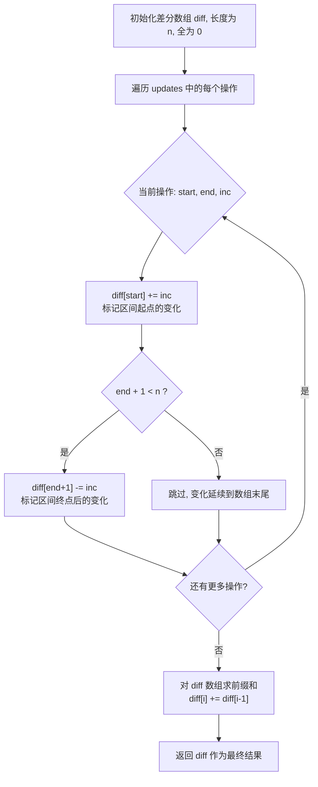
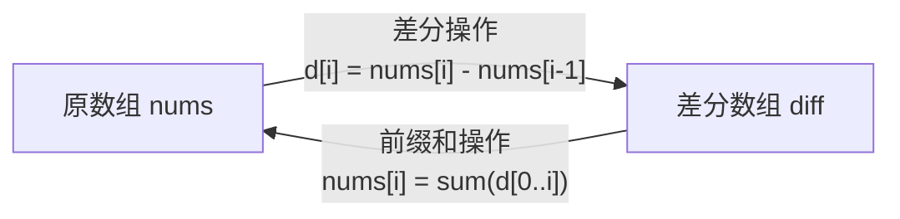

# 370. 区间加法

## 📋 题目信息
- **难度**：Medium
- **标签**：数组、前缀和、差分数组
- **来源**：LeetCode

## 📖 题目描述

假设你有一个长度为 `n` 的数组，初始情况下所有的元素都为 `0`。

另给你一个二维数组 `updates`，其中 `updates[i] = [startIndex, endIndex, inc]`，你需要将子数组 `nums[startIndex...endIndex]`（包含 startIndex 和 endIndex）中的所有元素增加 `inc`。

请你返回执行完所有操作后的数组。

### 示例

**示例 1：**
```
输入：n = 5, updates = [[1,3,2],[2,4,3],[0,2,-2]]
输出：[-2,0,3,5,3]

解释：
初始数组：[0,0,0,0,0]
执行 [1,3,2] 后：[0,2,2,2,0]
执行 [2,4,3] 后：[0,2,5,5,3]
执行 [0,2,-2] 后：[-2,0,3,5,3]
```

**示例 2：**
```
输入：n = 10, updates = [[2,5,1],[0,3,2]]
输出：[2,2,3,3,1,1,0,0,0,0]
```

### 约束条件

- `1 <= n <= 10^5`
- `0 <= updates.length <= 10^5`
- `updates[i].length == 3`
- `0 <= startIndex <= endIndex < n`
- `-10^5 <= inc <= 10^5`

### 进阶

你可以设计一个时间复杂度为 `O(n + k)`（其中 `k` 为更新次数）的算法吗？

---

## 🤔 题目分析

### 问题理解

用自己的话重新描述这道题：我们有一个全零数组，需要执行一系列"区间加法"操作——每次操作给定一个区间 `[start, end]` 和一个增量 `inc`，将该区间内的所有元素都加上 `inc`。最终返回操作完成后的数组。

关键点：
- 初始数组全为 0，长度为 n
- 每次操作是对一个**连续区间**进行**统一加法**
- 操作次数可能很多（最多 10^5 次）
- 数组长度也可能很大（最多 10^5）
- 需要返回所有操作执行完毕后的最终数组

### 关键观察

1. **操作的特点**：每次操作都是对一段连续区间做相同的加法，这是一种"批量修改"操作
2. **只关心最终结果**：我们不需要在每次操作后都输出数组，只需要最终结果
3. **区间操作的叠加性**：多次区间加法可以叠加，顺序无关（加法满足交换律和结合律）
4. **数据规模提示**：n 和 k 都可达 10^5，暴力解法 O(n*k) 可能达到 10^10，会超时。进阶要求 O(n+k)，提示我们需要一种巧妙的方法

### 题目类型识别

这道题的核心是**区间批量修改**问题。当我们看到"对区间内所有元素做相同操作"时，应该联想到：
- **差分数组**：专门用于高效处理区间加法操作
- **前缀和的逆操作**：差分数组是前缀和的逆运算

---

## 💡 解题思路

### 方法一：暴力解法

#### 🌟 形象化理解

**场景类比**：
想象你是一个班主任，手里有一份全班同学的成绩单（初始都是0分）。现在你收到了一叠"加分通知"，每张通知上写着："从第 start 号到第 end 号同学，每人加 inc 分"。

**暴力做法**：
每收到一张通知，你就从第 start 号同学开始，一个一个地在成绩单上加分，一直加到第 end 号同学。

**对应关系**：
- 成绩单 = 数组
- 加分通知 = updates 中的每个操作
- 逐个加分 = 遍历区间内每个元素并累加

**核心理解**：
最直观的方法就是"老老实实"地执行每一次操作，对区间内的每个元素逐一修改。

---

#### 思路说明

对于每个 update 操作 `[start, end, inc]`，我们遍历数组中从 `start` 到 `end` 的所有位置，将每个位置的值加上 `inc`。

#### 算法步骤

1. 创建一个长度为 n 的全零数组 `result`
2. 遍历 `updates` 中的每个操作 `[start, end, inc]`
3. 对于每个操作，遍历 `result[start]` 到 `result[end]`，将每个元素加上 `inc`
4. 所有操作执行完毕后，返回 `result`

#### 复杂度分析

- **时间复杂度**：O(n * k) - 其中 k 是 updates 的长度。最坏情况下每次操作都覆盖整个数组，每次操作需要 O(n) 时间
- **空间复杂度**：O(n) - 需要一个长度为 n 的结果数组（不计入输出空间则为 O(1)）

#### 为什么需要优化

当 n = 10^5 且 k = 10^5 时，暴力解法需要 10^10 次操作，这在大多数在线评测系统中会超时。我们需要找到一种方法，使得每次操作的时间复杂度降低到 O(1)，而不是 O(n)。

---

### 方法二：差分数组（优化解法）

#### 🌟 形象化理解（重点：差分数组的核心思想）

> **💡 在进入专业算法分析之前，先通过一个生活化的例子来理解差分数组的本质**

**场景类比**：
想象你是一个公交车调度员。一条公交线路有 n 个站点（编号 0 到 n-1），你需要统计每个站点上车内有多少乘客。

你收到了一系列乘客信息：
- "有 2 个人从第 1 站上车，第 3 站下车"
- "有 3 个人从第 2 站上车，第 4 站下车"
- "有 -2 个人（即 2 个人下车）从第 0 站上车，第 2 站下车"

**笨方法（暴力）**：
每收到一条信息，你就在第 start 站到第 end 站的每一站都记录"+inc 人"。

**聪明方法（差分数组）**：
你只需要在**上车站**记录"+inc"，在**下车站的下一站**记录"-inc"。最后从第 0 站开始，逐站累加，就能知道每站车上有多少人。

为什么这样做是对的？因为：
- 在上车站 `start` 记录 `+inc`，表示从这一站开始，车上多了 inc 个人
- 在下车站的下一站 `end+1` 记录 `-inc`，表示从这一站开始，那 inc 个人已经下车了
- 从头到尾累加（前缀和），就能还原出每一站车上的实际人数

**对应关系**：
- **差分数组** = 每站的"上下车变化量"记录表
- **diff[start] += inc** = 在上车站记录上车人数
- **diff[end+1] -= inc** = 在下车站的下一站记录下车人数
- **前缀和还原** = 从第 0 站开始逐站累加，得到每站的实际人数
- **O(1) 的单次操作** = 每条乘客信息只需要修改两个位置

**核心理解**：
差分数组的精髓在于：**不直接记录每个位置的值，而是记录相邻位置之间的"变化量"**。对区间 `[start, end]` 加 inc，只会在 start 处产生一个"+inc"的变化，在 end+1 处产生一个"-inc"的变化，中间的位置变化量为 0（因为它们和前一个位置的差值没有改变）。

**从类比到算法**：
现在让我们把这个公交车的思想转化为具体的算法...

---

#### 优化思路推导

**思考过程**：
1. 暴力解法的瓶颈在于：每次操作都要遍历整个区间，逐个修改元素
2. 我们观察到：区间加法操作只改变了区间**边界**处的"变化趋势"，区间内部的相邻元素差值不变
3. 引入**差分数组** `diff`，其中 `diff[i]` 表示原数组中 `nums[i] - nums[i-1]` 的值（`diff[0] = nums[0]`）
4. 对区间 `[start, end]` 加 inc，等价于：`diff[start] += inc`，`diff[end+1] -= inc`（如果 end+1 < n）
5. 最终通过对 `diff` 数组求前缀和，还原出结果数组

**数学推导**：

设原数组为 `a[0], a[1], ..., a[n-1]`（初始全为 0）

定义差分数组 `d[i]`：
- `d[0] = a[0]`
- `d[i] = a[i] - a[i-1]`（i >= 1）

那么原数组可以通过前缀和还原：
- `a[i] = d[0] + d[1] + ... + d[i]`

当我们对区间 `[start, end]` 执行 `+inc` 操作时：
- `a[start]` 增加了 inc，而 `a[start-1]` 没变 → `d[start]` 增加 inc
- `a[end]` 增加了 inc，而 `a[end+1]` 没变 → `d[end+1]` 减少 inc
- 区间内部：`a[i]` 和 `a[i-1]` 都增加了 inc → `d[i]` 不变

所以每次操作只需修改差分数组的两个位置！

#### 算法步骤

1. **创建差分数组**：创建长度为 n 的全零数组 `diff`
2. **处理每个操作**：对于每个 `[start, end, inc]`：
   - `diff[start] += inc`
   - 如果 `end + 1 < n`，则 `diff[end + 1] -= inc`
3. **前缀和还原**：从左到右对 `diff` 数组求前缀和，得到最终结果
   - `diff[i] += diff[i-1]`（i 从 1 到 n-1）
4. **返回结果**：`diff` 数组即为最终结果

#### 复杂度分析

- **时间复杂度**：O(n + k) - 处理 k 个操作每个 O(1)，最后一次前缀和遍历 O(n)
- **空间复杂度**：O(n) - 差分数组的空间（如果可以原地修改则为 O(1) 额外空间）

#### 💭 回顾类比

- 公交车的"上下车记录表" 对应 代码中的差分数组 `diff`
- "在上车站记 +inc" 对应 `diff[start] += inc`
- "在下车站下一站记 -inc" 对应 `diff[end+1] -= inc`
- "从头逐站累加得到每站人数" 对应 对 `diff` 求前缀和
- 这就是为什么每次操作只需 O(1) 时间——我们只记录"变化"，不记录"状态"

---

## 🎨 图解说明

### 执行过程示例

**示例输入**：`n = 5, updates = [[1,3,2],[2,4,3],[0,2,-2]]`

**执行步骤**：

#### 第一步：初始化差分数组

```
索引:    0    1    2    3    4
diff: [ 0,   0,   0,   0,   0 ]
```

#### 第二步：处理操作 [1, 3, 2]（从索引1到索引3，每个元素加2）

```
diff[1] += 2  →  diff[1] = 2
diff[4] -= 2  →  diff[4] = -2    (因为 end+1 = 3+1 = 4 < 5)

索引:    0    1    2    3    4
diff: [ 0,  +2,   0,   0,  -2 ]
         ↑         ↑              
         |    从这里开始+2   到这里结束(+2的效果被抵消)
```

#### 第三步：处理操作 [2, 4, 3]（从索引2到索引4，每个元素加3）

```
diff[2] += 3  →  diff[2] = 3
diff[5] -= 3  →  跳过！(因为 end+1 = 4+1 = 5 >= n，越界了)

索引:    0    1    2    3    4
diff: [ 0,  +2,  +3,   0,  -2 ]
                   ↑
              从这里开始+3，一直到数组末尾
```

#### 第四步：处理操作 [0, 2, -2]（从索引0到索引2，每个元素加-2）

```
diff[0] += -2  →  diff[0] = -2
diff[3] -= -2  →  diff[3] = 2    (因为 end+1 = 2+1 = 3 < 5)

索引:    0    1    2    3    4
diff: [-2,  +2,  +3,  +2,  -2 ]
```

#### 第五步：前缀和还原（逐步累加）

```
i=0: diff[0] = -2                          → result[0] = -2
i=1: diff[1] = diff[1] + diff[0] = 2+(-2) → result[1] =  0
i=2: diff[2] = diff[2] + diff[1] = 3+0    → result[2] =  3
i=3: diff[3] = diff[3] + diff[2] = 2+3    → result[3] =  5
i=4: diff[4] = diff[4] + diff[3] = -2+5   → result[4] =  3

最终结果: [-2, 0, 3, 5, 3] ✅
```

#### 验证：与暴力法对比

```
暴力法逐步执行：
初始:          [0,  0,  0,  0,  0]
+[1,3,2] 后:  [0,  2,  2,  2,  0]
+[2,4,3] 后:  [0,  2,  5,  5,  3]
+[0,2,-2] 后: [-2, 0,  3,  5,  3]  ← 结果一致 ✅
```

### 可视化图表

#### 差分数组工作原理流程图



#### 差分数组与前缀和的关系



#### 单次区间操作的差分效果示意

```
对区间 [1, 3] 加 2 的效果：

原数组变化:  [ 0, +2, +2, +2,  0 ]   ← 区间内每个元素都+2
差分数组:    [ 0, +2,  0,  0, -2 ]   ← 只在边界处标记变化
                  ↑               ↑
                start           end+1
                (+inc)          (-inc)

关键洞察：区间内部相邻元素的差值没有改变！
  nums[2]-nums[1] = (0+2)-(0+2) = 0  (和操作前一样)
  nums[3]-nums[2] = (0+2)-(0+2) = 0  (和操作前一样)
只有边界处的差值发生了变化：
  nums[1]-nums[0] = (0+2)-0 = +2     (变化了 +inc)
  nums[4]-nums[3] = 0-(0+2) = -2     (变化了 -inc)
```

---

## ✏️ 代码框架填空

> **💡 学习提示**：在查看完整代码之前，先尝试根据上面的算法步骤，自己思考并填写下面的空白处。这将帮助你从"不知道怎么开始"过渡到"能够独立实现关键逻辑"。

### Python填空版（暴力解法）

```python
import sys
input = sys.stdin.readline  # 与下方的 input() 读取关联

def getModifiedArray(n, updates):
    """
    暴力解法：逐个操作，逐个修改区间内的元素
    
    参数:
        n: 数组长度
        updates: 操作列表，每个操作为 [startIndex, endIndex, inc]
    
    返回:
        执行完所有操作后的数组
    """
    # 🔹 填空1：初始化结果数组（提示：长度为n，初始值全为0）
    result = ______
    
    # 🔹 填空2：遍历每个操作
    # 提示：每个操作包含 start, end, inc 三个值
    for ______ in updates:
        
        # 🔹 填空3：遍历区间内的每个位置
        # 提示：从 start 到 end（包含 end），对每个位置加 inc
        for j in range(______, ______):
            # 🔹 填空4：对当前位置执行加法
            result[j] ______ ______
    
    # 🔹 填空5：返回结果
    return ______

# ACM模式输入处理
n = int(input())
k = int(input())
updates = []
for _ in range(k):
    line = list(map(int, input().split()))
    updates.append(line)

print(getModifiedArray(n, updates))
```

### Python填空版（差分数组优化解法）

```python
import sys
input = sys.stdin.readline  # 与下方的 input() 读取关联

def getModifiedArray(n, updates):
    """
    差分数组解法：利用差分数组将区间修改优化为O(1)操作
    
    参数:
        n: 数组长度
        updates: 操作列表，每个操作为 [startIndex, endIndex, inc]
    
    返回:
        执行完所有操作后的数组
    """
    # 🔹 填空1：初始化差分数组（提示：长度为n，初始值全为0）
    # 思考：为什么差分数组的长度和原数组一样？
    diff = ______
    
    # 🔹 填空2：遍历每个操作，更新差分数组
    for start, end, inc in updates:
        
        # 🔹 填空3：在区间起点标记变化
        # 提示：从 start 开始，值增加了 inc
        diff[______] += ______
        
        # 🔹 填空4：在区间终点的下一个位置标记变化（注意边界检查）
        # 提示：在 end+1 处，值的增加效果需要被"抵消"
        # 思考：为什么需要检查 end + 1 < n？
        if ______:
            diff[______] -= ______
    
    # 🔹 填空5：通过前缀和还原原数组
    # 提示：从第二个元素开始，每个元素等于自身加上前一个元素
    for i in range(______, ______):
        diff[i] += ______
    
    # 🔹 填空6：返回结果
    # 提示：差分数组经过前缀和处理后就是最终结果
    return ______

# ACM模式输入处理
n = int(input())
k = int(input())
updates = []
for _ in range(k):
    line = list(map(int, input().split()))
    updates.append(line)

print(getModifiedArray(n, updates))
```

### 填空提示详解

**暴力解法填空提示：**

**填空1 - 初始化结果数组**
- 思考：题目说初始数组全为 0，长度为 n
- Python 中如何创建一个长度为 n 的全零列表？
- 常见写法：`[0] * n` 或 `[0 for _ in range(n)]`

**填空2 - 遍历操作并解包**
- 思考：每个操作是一个三元素列表 `[start, end, inc]`
- Python 支持在 for 循环中直接解包

**填空3 - 区间遍历范围**
- 思考：区间是 `[start, end]`，包含两端
- `range()` 函数的右端点是开区间，所以需要 `end + 1`

**填空4 - 执行加法**
- 思考：对 `result[j]` 加上 `inc`
- 使用 `+=` 运算符

**填空5 - 返回结果**
- 直接返回修改后的 `result` 数组

---

**差分数组解法填空提示：**

**填空1 - 初始化差分数组**
- 思考：初始数组全为 0，所以差分数组也全为 0
- 差分数组长度与原数组相同

**填空2 - 遍历操作**
- 已给出解包方式：`for start, end, inc in updates`

**填空3 - 标记区间起点**
- 思考：从 start 位置开始，值增加了 inc
- 所以 `diff[start]` 应该加上 `inc`

**填空4 - 标记区间终点后一位**
- 思考：在 `end + 1` 位置，增加效果需要被抵消
- 边界检查：`end + 1` 可能等于 `n`，会越界
- 如果 `end + 1 < n`，则 `diff[end + 1] -= inc`

**填空5 - 前缀和还原**
- 思考：从索引 1 开始到 n-1，每个位置累加前一个位置的值
- `range(1, n)` 遍历，`diff[i] += diff[i-1]`

**填空6 - 返回结果**
- 差分数组经过前缀和处理后，就变成了最终的结果数组

### C++填空版（差分数组优化解法）

```cpp
#include <iostream>  // 与下方的 cin/cout 关联
#include <vector>    // 与下方的 vector 容器关联
using namespace std;

vector<int> getModifiedArray(int n, vector<vector<int>>& updates) {
    // 🔹 填空1：初始化差分数组
    // 提示：C++中使用 vector<int> 创建长度为n的全零数组
    vector<int> diff(______, ______);
    
    // 🔹 填空2：遍历每个操作，更新差分数组
    for (auto& update : updates) {
        int start = update[0], end = update[1], inc = update[2];
        
        // 🔹 填空3：在区间起点标记变化
        diff[______] += ______;
        
        // 🔹 填空4：在区间终点的下一个位置标记变化
        if (______) {
            diff[______] -= ______;
        }
    }
    
    // 🔹 填空5：通过前缀和还原原数组
    for (int i = ______; i < ______; i++) {
        diff[i] += ______;
    }
    
    // 🔹 填空6：返回结果
    return ______;
}

// ACM模式主函数
int main() {
    int n, k;
    cin >> n >> k;
    
    vector<vector<int>> updates(k, vector<int>(3));
    for (int i = 0; i < k; i++) {
        cin >> updates[i][0] >> updates[i][1] >> updates[i][2];
    }
    
    vector<int> result = getModifiedArray(n, updates);
    for (int i = 0; i < n; i++) {
        cout << result[i];
        if (i < n - 1) cout << " ";
    }
    cout << endl;
    
    return 0;
}
```

---

## 💻 完整代码实现

> **✅ 对照检查**：现在对比你的填空答案和下面的完整实现，看看思路是否一致。

### Python实现（暴力解法）

```python
import sys
input = sys.stdin.readline

def getModifiedArray(n, updates):
    """
    暴力解法：逐个操作，逐个修改区间内的元素
    
    参数:
        n: 数组长度
        updates: 操作列表，每个操作为 [startIndex, endIndex, inc]
    
    返回:
        执行完所有操作后的数组
    """
    # 初始化长度为n的全零数组
    result = [0] * n
    
    # 遍历每个操作
    for start, end, inc in updates:
        # 对区间 [start, end] 内的每个元素加上 inc
        for j in range(start, end + 1):
            result[j] += inc
    
    return result


# ACM模式输入处理
n = int(input())
k = int(input())
updates = []
for _ in range(k):
    line = list(map(int, input().split()))
    updates.append(line)

result = getModifiedArray(n, updates)
print(' '.join(map(str, result)))
```

**代码说明**：
- 第 16 行：`[0] * n` 创建全零数组，这是 Python 中最简洁的写法
- 第 19 行：利用 Python 的解包特性，直接将三元素列表解包为 start, end, inc
- 第 21 行：`range(start, end + 1)` 确保包含 end 位置（range 右端点开区间）
- 第 22 行：`+=` 运算符将 inc 累加到当前位置

**暴力解法填空答案解析**：
- **填空1**：`result = [0] * n` - 创建长度为 n 的全零列表
- **填空2**：`for start, end, inc in updates` - 解包遍历每个操作
- **填空3**：`range(start, end + 1)` - 注意 end+1 保证包含右端点
- **填空4**：`result[j] += inc` - 对每个位置累加增量
- **填空5**：`return result` - 返回修改后的数组

---

### Python实现（差分数组优化解法）

```python
import sys
input = sys.stdin.readline

def getModifiedArray(n, updates):
    """
    差分数组解法：利用差分数组将区间修改优化为O(1)操作
    
    参数:
        n: 数组长度
        updates: 操作列表，每个操作为 [startIndex, endIndex, inc]
    
    返回:
        执行完所有操作后的数组
    """
    # 步骤1：初始化差分数组，长度为n，全为0
    # 差分数组记录的是"相邻元素之间的变化量"
    diff = [0] * n
    
    # 步骤2：遍历每个操作，更新差分数组
    for start, end, inc in updates:
        # 在区间起点标记：从这里开始，值增加了 inc
        diff[start] += inc
        
        # 在区间终点的下一个位置标记：从这里开始，之前的增加效果被抵消
        # 需要检查边界：如果 end+1 == n，说明增加效果延续到数组末尾，无需抵消
        if end + 1 < n:
            diff[end + 1] -= inc
    
    # 步骤3：通过前缀和还原原数组
    # diff[i] 累加前面所有的变化量，就得到了位置 i 的实际值
    for i in range(1, n):
        diff[i] += diff[i - 1]
    
    # 步骤4：差分数组经过前缀和处理后就是最终结果
    return diff


# ACM模式输入处理
n = int(input())
k = int(input())
updates = []
for _ in range(k):
    line = list(map(int, input().split()))
    updates.append(line)

result = getModifiedArray(n, updates)
print(' '.join(map(str, result)))
```

**代码说明**：
- 第 17 行：差分数组初始化为全零，因为原数组全为零，相邻差值也全为零
- 第 22 行：`diff[start] += inc` 是差分数组的核心操作之一，标记区间起点的变化
- 第 27 行：边界检查 `end + 1 < n` 防止数组越界，当 end 是最后一个元素时无需抵消
- 第 28 行：`diff[end + 1] -= inc` 标记区间终点后的变化，抵消之前的增量
- 第 32 行：前缀和还原，这是差分数组到原数组的逆操作

**差分数组解法填空答案解析**：
- **填空1**：`diff = [0] * n` - 初始差分数组全为零
- **填空3**：`diff[start] += inc` - 在起点标记增量
- **填空4**：`if end + 1 < n: diff[end + 1] -= inc` - 在终点后标记抵消
- **填空5**：`for i in range(1, n): diff[i] += diff[i - 1]` - 前缀和还原
- **填空6**：`return diff` - 返回还原后的差分数组即为结果

---

### C++实现（差分数组优化解法）

```cpp
#include <iostream>
#include <vector>
using namespace std;

class Solution {
public:
    /**
     * 差分数组解法
     * @param n 数组长度
     * @param updates 操作列表
     * @return 执行完所有操作后的数组
     */
    vector<int> getModifiedArray(int n, vector<vector<int>>& updates) {
        // 步骤1：初始化差分数组，长度为n，全为0
        vector<int> diff(n, 0);
        
        // 步骤2：遍历每个操作，更新差分数组
        for (auto& update : updates) {
            int start = update[0];
            int end = update[1];
            int inc = update[2];
            
            // 在区间起点标记变化
            diff[start] += inc;
            
            // 在区间终点的下一个位置标记变化（注意边界检查）
            if (end + 1 < n) {
                diff[end + 1] -= inc;
            }
        }
        
        // 步骤3：通过前缀和还原原数组
        for (int i = 1; i < n; i++) {
            diff[i] += diff[i - 1];
        }
        
        // 步骤4：返回结果
        return diff;
    }
};

// ACM模式主函数
int main() {
    ios::sync_with_stdio(false);  // 加速输入输出
    cin.tie(nullptr);
    
    int n, k;
    cin >> n >> k;
    
    vector<vector<int>> updates(k, vector<int>(3));
    for (int i = 0; i < k; i++) {
        cin >> updates[i][0] >> updates[i][1] >> updates[i][2];
    }
    
    Solution sol;
    vector<int> result = sol.getModifiedArray(n, updates);
    
    for (int i = 0; i < n; i++) {
        cout << result[i];
        if (i < n - 1) cout << " ";
    }
    cout << endl;
    
    return 0;
}
```

**与Python的主要差异**：
- 差异1：C++ 使用 `vector<int> diff(n, 0)` 初始化，需要显式指定类型和大小
- 差异2：C++ 使用 `auto&` 引用遍历避免拷贝开销，Python 天然支持引用语义
- 差异3：C++ 需要手动处理输入输出格式，使用 `ios::sync_with_stdio(false)` 加速 I/O
- 差异4：C++ 的数组越界不会抛出异常（未定义行为），所以边界检查更加重要

**C++填空答案解析**：
- **填空1**：`vector<int> diff(n, 0)` - C++ 中 vector 的初始化语法
- **填空3**：`diff[start] += inc` - 与 Python 逻辑完全一致
- **填空4**：`if (end + 1 < n)` 和 `diff[end + 1] -= inc` - 注意 C++ 的 if 需要括号
- **填空5**：`for (int i = 1; i < n; i++)` 和 `diff[i - 1]` - C++ 的 for 循环三段式
- **填空6**：`return diff` - 返回 vector 对象

---

## ⚠️ 易错点提醒

### 1. 边界条件

**易错点**：`end + 1` 越界问题

当 `end` 是数组的最后一个元素（即 `end == n - 1`）时，`end + 1 == n`，此时访问 `diff[n]` 会导致数组越界。

**正确处理**：
```python
# ✅ 正确：先检查边界再操作
if end + 1 < n:
    diff[end + 1] -= inc

# ❌ 错误：不检查边界直接操作
diff[end + 1] -= inc  # 当 end == n-1 时，访问 diff[n] 越界！
```

**替代方案**：也可以将差分数组长度设为 `n + 1`，这样就不需要边界检查：
```python
# 另一种写法：差分数组长度为 n+1，避免边界检查
diff = [0] * (n + 1)
for start, end, inc in updates:
    diff[start] += inc
    diff[end + 1] -= inc  # 不需要边界检查，因为 end+1 最大为 n，不会越界

# 前缀和还原（只取前 n 个元素）
for i in range(1, n):
    diff[i] += diff[i - 1]
return diff[:n]
```

### 2. 常见错误

**错误1**：忘记前缀和还原步骤
- **原因**：只做了差分数组的更新，忘记最后一步前缀和还原
- **正确做法**：差分数组更新完毕后，必须执行前缀和操作才能得到最终结果
- **填空时注意**：填空5（前缀和还原）是不可省略的关键步骤

**错误2**：前缀和的起始索引错误
- **原因**：前缀和应该从索引 1 开始，而不是索引 0
- **正确做法**：`for i in range(1, n)` 而不是 `for i in range(0, n)`
- **解释**：`diff[0]` 本身就是正确的值，不需要累加

**错误3**：差分数组的减法位置搞错
- **原因**：应该在 `end + 1` 处减去 inc，而不是在 `end` 处
- **正确做法**：`diff[end + 1] -= inc`
- **理解**：`end` 位置仍然在区间内，需要被加上 inc；`end + 1` 才是区间外的第一个位置

**错误4**：混淆 `+=` 和 `=`
- **原因**：多个操作可能影响同一个位置，应该用 `+=` 累加而不是 `=` 赋值
- **正确做法**：`diff[start] += inc` 而不是 `diff[start] = inc`
- **解释**：多个操作的效果是叠加的

### 3. 调试技巧

- **技巧1**：手动模拟小规模用例。用 n=5 的示例，手动画出差分数组每一步的变化，验证前缀和还原后是否与暴力法结果一致
- **技巧2**：单独测试边界情况。测试 `updates = [[0, n-1, 1]]`（覆盖整个数组）和 `updates = [[0, 0, 1]]`（只修改一个元素）
- **技巧3**：打印中间状态。在差分数组更新后、前缀和还原前，打印 diff 数组，检查是否符合预期
- **填空验证**：填完空后，用示例1的数据手动走一遍代码，检查每一步的 diff 数组值是否与图解说明中的一致

---

## 🔗 相似题目推荐

### 同类型题目

这些题目使用相同或相似的算法思路：

1. **LeetCode 303 - 区域和检索 - 数组不可变** (Easy)
   - 相似点：前缀和的基础应用，是理解差分数组的前置知识
   - 建议：先掌握前缀和，再学习差分数组（差分是前缀和的逆操作）

2. **LeetCode 1109 - 航班预订统计** (Medium)
   - 相似点：与本题几乎完全相同的差分数组应用，只是题目背景不同
   - 建议：用完全相同的差分数组模板解决，巩固理解

3. **LeetCode 560 - 和为 K 的子数组** (Medium)
   - 相似点：前缀和 + 哈希表的经典组合，与差分数组同属"前缀和家族"
   - 建议：理解前缀和在不同场景下的灵活运用

### 进阶题目

掌握本题后，可以挑战这些更难的题目：

1. **LeetCode 304 - 二维区域和检索 - 矩阵不可变** (Medium)
   - 进阶点：将一维前缀和扩展到二维，需要理解二维前缀和的容斥原理

2. **LeetCode 2381 - 字母移位 II** (Medium)
   - 进阶点：差分数组的变体应用，需要对字符进行区间移位操作

3. **LeetCode 798 - 得分最高的最小轮调** (Hard)
   - 进阶点：差分数组与贪心的结合，需要更深入的分析能力

### 相关知识点

本题涉及的核心知识点：

- **差分数组**：区间批量修改的利器
  - 相关题目：LeetCode 370、LeetCode 1109、LeetCode 2381

- **前缀和**：区间查询的基础工具，差分数组的逆操作
  - 相关题目：LeetCode 303、LeetCode 304、LeetCode 560、LeetCode 238

---

## 📚 知识点总结

### 核心算法

**差分数组（Difference Array）**是一种用于高效处理区间批量修改的数据结构。它的核心思想是：

> 不直接记录每个位置的值，而是记录相邻位置之间的变化量（差分）。

**关键性质**：
- 对区间 `[l, r]` 加 `val`，只需修改差分数组的两个位置：`diff[l] += val`，`diff[r+1] -= val`
- 通过对差分数组求前缀和，可以还原出原数组
- 差分数组和前缀和互为逆操作

### 数据结构

| 数据结构 | 用途 | 本题中的角色 |
|---------|------|------------|
| 数组 | 存储结果 | 差分数组 `diff` |
| 前缀和 | 区间求和 | 还原差分数组为原数组 |

### 解题模板

```python
# 差分数组通用模板（带填空提示）
def range_update(n, operations):
    # 初始化：diff = [0] * n 或 [0] * (n + 1)
    diff = [0] * (n + 1)  # 长度 n+1 可以避免边界检查
    
    # 区间修改：for start, end, val in operations:
    for start, end, val in operations:
        diff[start] += val      # 标记起点
        diff[end + 1] -= val    # 标记终点后一位
    
    # 前缀和还原：for i in range(1, n):
    for i in range(1, n):
        diff[i] += diff[i - 1]
    
    # 返回：return diff[:n]
    return diff[:n]
```

### 学习要点

1. **要点1**：差分数组是前缀和的逆操作。前缀和用于"区间查询"，差分数组用于"区间修改"。两者互为逆运算，理解这个关系是掌握差分数组的关键
2. **要点2**：差分数组的核心优势在于将 O(n) 的区间修改操作降低为 O(1)。代价是最后需要一次 O(n) 的前缀和还原，但当操作次数 k 很大时，总体从 O(n*k) 优化为 O(n+k)
3. **要点3**：边界处理是差分数组最容易出错的地方。记住：`diff[end+1] -= inc` 中的 `end+1` 可能越界，需要检查或使用长度为 `n+1` 的数组
4. **填空练习的价值**：通过填空练习，你应该掌握了差分数组的三个核心步骤——初始化、区间标记、前缀和还原，以及边界检查的重要性

---

## 📝 补充说明

### 从填空到完整实现的进阶路径

1. **第一遍**：看算法步骤和图解，理解差分数组的工作原理
2. **第二遍**：尝试填空，重点关注差分数组的三个核心操作
3. **第三遍**：对照答案，理解每个填空的原因，特别是边界检查
4. **第四遍**：不看提示，独立完整实现差分数组解法

### 时间复杂度优化历程

- 暴力解法：O(n * k) → 瓶颈在于每次操作都遍历整个区间
- 差分数组：O(n + k) → 每次操作 O(1)，最后一次性还原 O(n)

### 空间复杂度权衡

本题的空间复杂度为 O(n)，无论暴力还是差分数组都需要一个长度为 n 的数组。差分数组解法的优势完全体现在时间复杂度上。如果使用长度为 `n+1` 的差分数组来避免边界检查，额外空间仅多 O(1)，可以忽略不计。

### 实际应用场景

差分数组在实际开发中有广泛应用：

1. **航班/酒店预订系统**：统计某时间段内的预订量变化（LeetCode 1109）
2. **交通流量分析**：统计某路段在不同时间段的车流量
3. **资源调度**：在某时间区间内分配/释放资源
4. **图像处理**：对图像的某个矩形区域进行统一的亮度/对比度调整（二维差分）
5. **游戏开发**：对地图上某个区域的属性进行批量修改（如地形高度、温度等）

这些场景的共同特点是：需要对连续区间进行大量的批量修改操作，最终只关心所有操作完成后的最终状态。