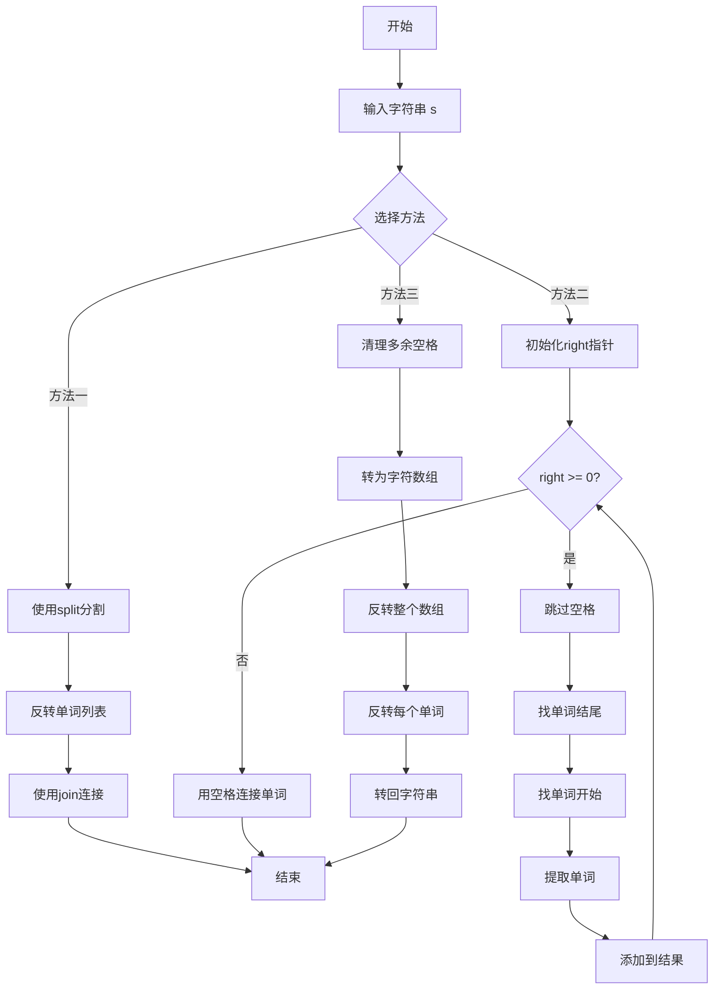

# 151. 反转字符串中的单词

## 📋 题目信息
- **难度**：中等
- **标签**：字符串、双指针、字符串处理
- **来源**：LeetCode

## 📖 题目描述

给你一个字符串 `s` ，请你反转字符串中 **单词** 的顺序。

**单词** 是由非空格字符组成的字符串。`s` 中使用至少一个空格将字符串中的 **单词** 分隔开。

返回 **单词** 顺序颠倒且 **单词** 之间用单个空格连接的结果字符串。

**注意：** 输入字符串 `s`中可能会存在前导空格、尾随空格或者单词间的多个空格。返回的结果字符串中，单词间应当仅用单个空格分隔，且不包含任何额外的空格。

### 示例

**示例 1：**
```
输入：s = "the sky is blue"
输出："blue is sky the"
```

**示例 2：**
```
输入：s = "  hello world  "
输出："world hello"
解释：反转后的字符串中不能存在前导空格和尾随空格。
```

**示例 3：**
```
输入：s = "a good   example"
输出："example good a"
解释：如果两个单词间有多余的空格，反转后的字符串需要将单词间的空格减少到仅有一个。
```

### 约束条件

- `1 <= s.length <= 10^4`
- `s` 包含英文大小写字母、数字和空格 `' '`
- `s` 中 **至少存在一个** 单词

**进阶：** 如果字符串在你使用的编程语言中是一种可变数据类型，请尝试使用 `O(1)` 额外空间复杂度的 **原地** 解法。

---

## 🤔 题目分析

### 问题理解

用自己的话重新描述这个问题：

我们需要将一个字符串中的单词顺序完全颠倒。比如原来是"A B C"，要变成"C B A"。但是有几个额外的要求：
1. 输入字符串可能有多余的空格（开头、结尾、单词之间）
2. 输出字符串必须干净整洁：单词之间只有一个空格，没有前导和尾随空格

**关键点：**
- **单词识别**：需要正确识别出每个单词（非空格字符组成）
- **空格处理**：要处理多余的空格，包括前导、尾随和单词间的多个空格
- **顺序反转**：将识别出的单词按相反顺序排列
- **格式规范**：输出时单词间只用一个空格连接

### 关键观察

从题目中我们可以观察到以下几点：

1. **输入的复杂性**：输入字符串可能很"脏"，有各种多余空格
2. **输出的规范性**：输出字符串必须很"干净"，格式统一
3. **核心操作**：本质上是"提取单词 + 反转顺序 + 重新组合"
4. **边界情况**：需要处理连续空格、前导空格、尾随空格

### 问题分解

这个问题可以分解为三个子问题：
1. **如何提取单词？** - 需要跳过空格，识别有效字符
2. **如何反转顺序？** - 可以从后往前收集，或者先收集再反转
3. **如何格式化输出？** - 单词间用单个空格连接

---

## 💡 解题思路

### 方法一：使用内置函数（最简单）

#### 🌟 形象化理解

> **💡 在进入专业算法分析之前，先通过一个生活化的例子来理解这个问题**

**场景类比**：

想象你在整理一排书架上的书。这些书的书名是一个句子，比如"the sky is blue"，每本书代表一个单词。但是书架很乱：
- 最左边有几个空位（前导空格）
- 最右边也有空位（尾随空格）
- 书与书之间有的地方空了好几个位置（多余空格）

你的任务是：
1. **收集所有的书**：把书架上所有的书拿下来，忽略空位
2. **反转顺序**：把书按相反的顺序重新排列（"blue is sky the"）
3. **整齐摆放**：把书重新放回书架，每本书之间只留一个空位

**对应关系**：
- **书架** = 输入字符串
- **书** = 单词
- **空位** = 空格
- **拿下书** = 提取单词（split操作）
- **反转顺序** = 列表反转（reverse操作）
- **整齐摆放** = 用单个空格连接（join操作）

**核心理解**：
这个问题就像整理书架：先把有用的东西（单词）收集起来，忽略无用的东西（多余空格），然后按新的顺序重新组织。

---

#### 思路说明

最直观的方法是利用编程语言提供的字符串处理函数：

1. 使用 `split()` 函数分割字符串，自动处理多余空格
2. 反转得到的单词列表
3. 使用 `join()` 函数用单个空格连接单词

这个方法简单直接，代码清晰易懂。

#### 算法步骤

1. 使用 `split()` 分割字符串，得到单词列表（自动去除空格）
2. 反转单词列表
3. 使用空格 `join()` 连接单词列表
4. 返回结果

#### 复杂度分析

- **时间复杂度**：O(n) - 其中 n 是字符串长度
  - split() 需要遍历整个字符串：O(n)
  - 反转列表：O(k)，k 是单词数量，k ≤ n
  - join() 需要遍历所有单词：O(n)
  - 总体：O(n)

- **空间复杂度**：O(n) - 需要存储分割后的单词列表和结果字符串

#### 为什么需要优化

虽然这个方法简单有效，但它有以下局限：
1. **空间使用**：需要额外的 O(n) 空间存储单词列表
2. **不够通用**：依赖语言内置函数，在某些语言中可能不可用
3. **面试考察**：面试官可能要求不使用内置函数，考察手动实现能力
4. **进阶要求**：题目进阶要求 O(1) 空间复杂度的原地解法

---

### 方法二：双指针手动提取（推荐）

#### 🌟 形象化理解

> **💡 现在让我们用另一个角度来理解优化思路**

**场景类比**：

想象你在一个仓库里找箱子。这些箱子（单词）散落在地上，中间有很多空地（空格）。你有一个记录本，要从右往左记录箱子的标签：

1. **从右往左走**：你从仓库最右边开始往左走
2. **跳过空地**：遇到空地（空格）就继续走，不记录
3. **发现箱子**：遇到箱子（单词的结尾）时，标记这个位置
4. **找到箱子的开头**：继续往左走，直到找到箱子的开头（单词的开始）
5. **记录标签**：把这个箱子的完整标签记录下来
6. **重复过程**：继续往左找下一个箱子

**对应关系**：
- **从右往左走** = 从字符串末尾开始遍历
- **跳过空地** = 跳过空格字符
- **发现箱子** = 找到单词的结尾
- **找箱子开头** = 找到单词的开始
- **记录标签** = 提取单词并添加到结果中
- **记录本** = 结果列表

**核心理解**：
通过从右往左遍历，我们可以直接按反转后的顺序收集单词，避免了先收集再反转的步骤。同时，我们手动控制单词的提取，可以精确处理空格。

**从类比到算法**：
现在让我们把这个生活化的思想转化为具体的算法...

---

#### 优化思路推导

**思考过程**：

1. **方法一的瓶颈**：使用了内置函数，不够灵活，且需要额外空间
2. **优化方向**：手动遍历字符串，自己控制单词的提取
3. **关键洞察**：如果从右往左遍历，可以直接按反转后的顺序收集单词
4. **技术选择**：使用双指针技术来定位每个单词的边界

**为什么从右往左？**
- 从左往右：需要先收集所有单词，然后反转 → 两步操作
- 从右往左：直接按反转后的顺序收集 → 一步到位

#### 算法步骤

1. **初始化**：
   - 创建结果列表 `words`
   - 初始化右指针 `right` 指向字符串末尾
   - 获取字符串长度 `n`

2. **从右往左遍历**：
   - 当 `right >= 0` 时循环：
     - **跳过空格**：如果 `s[right]` 是空格，`right` 左移
     - **找到单词结尾**：记录当前位置为单词结尾
     - **找到单词开始**：左指针 `left` 从 `right` 开始左移，直到遇到空格或到达开头
     - **提取单词**：提取 `s[left+1:right+1]` 作为一个单词
     - **添加到结果**：将单词添加到 `words` 列表
     - **继续遍历**：`right` 移动到 `left` 位置，继续寻找下一个单词

3. **组合结果**：
   - 使用单个空格连接 `words` 列表中的所有单词
   - 返回结果字符串

#### 复杂度分析

- **时间复杂度**：O(n) - 其中 n 是字符串长度
  - 每个字符最多被访问两次（一次被 right 指针，一次被 left 指针）
  - 总体仍然是线性时间

- **空间复杂度**：O(n) - 需要存储结果
  - 结果列表和最终字符串需要 O(n) 空间
  - 如果不计算输出所需空间，额外空间为 O(k)，k 是单词数量

#### 💭 回顾类比

让我们回顾一下类比和算法的对应关系：

- **仓库从右往左走** 对应 **代码中的 right 指针从 n-1 递减到 0**
- **跳过空地** 对应 **while s[right] == ' ' 的循环**
- **找箱子的边界** 对应 **left 指针定位单词开始位置**
- **记录标签** 对应 **提取子串 s[left+1:right+1]**

这就是为什么双指针方法能够高效地解决这个问题！

---

### 方法三：原地反转（进阶 - O(1)空间）

#### 🌟 形象化理解

**场景类比**：

想象你有一串珠子（字符），珠子之间用绳结（空格）分隔成几组（单词）。你要在不用额外盒子的情况下，把这串珠子重新排列：

1. **整体翻转**：先把整串珠子完全翻转
2. **局部翻转**：再把每组珠子（每个单词）单独翻转回来
3. **整理绳结**：去掉多余的绳结，保持每组之间只有一个绳结

**对应关系**：
- **珠子** = 字符
- **绳结** = 空格
- **一组珠子** = 一个单词
- **整体翻转** = 反转整个字符串
- **局部翻转** = 反转每个单词

**核心理解**：
两次反转的巧妙之处：整体反转改变了单词顺序，局部反转恢复了单词内部的字符顺序。

**示例**：
```
原始：    "the sky is blue"
整体反转： "eulb si yks eht"
局部反转： "blue is sky the"
```

---

#### 思路说明

这是一个经典的原地算法，适用于字符串是可变类型的语言（如C++）。在Python中，由于字符串不可变，需要先转换为列表。

核心思想：**两次反转**
1. 反转整个字符串 → 单词顺序反转了，但单词内部也反转了
2. 反转每个单词 → 单词内部恢复正常，单词顺序保持反转

#### 算法步骤

1. **清理空格**：
   - 去除前导和尾随空格
   - 将多个连续空格替换为单个空格

2. **转换为可变类型**（Python需要）：
   - 将字符串转换为字符列表

3. **反转整个字符串**：
   - 使用双指针从两端向中间交换字符

4. **反转每个单词**：
   - 遍历字符串，找到每个单词的边界
   - 对每个单词单独进行反转

5. **转换回字符串**（Python需要）：
   - 将字符列表转换回字符串

#### 复杂度分析

- **时间复杂度**：O(n)
  - 清理空格：O(n)
  - 反转整个字符串：O(n)
  - 反转每个单词：O(n)
  - 总体：O(n)

- **空间复杂度**：
  - C++等可变字符串语言：O(1)（原地修改）
  - Python：O(n)（需要转换为列表）

---

## 🎨 图解说明

### 方法二：双指针法执行过程

让我们通过一个具体例子来看双指针法的执行过程：

**示例输入**：`s = "  hello   world  "`

**执行步骤**：

```
初始状态：
s = "  hello   world  "
     ↑              ↑
   left          right (从这里开始)

步骤1：跳过右侧空格
s = "  hello   world  "
                  ↑
                right

步骤2：找到单词"world"的结尾
s = "  hello   world  "
                  ↑
              right (单词结尾)

步骤3：找到单词"world"的开始
s = "  hello   world  "
              ↑   ↑
            left right
提取单词："world"
words = ["world"]

步骤4：继续向左，跳过空格
s = "  hello   world  "
         ↑
       right

步骤5：找到单词"hello"的结尾
s = "  hello   world  "
         ↑
       right

步骤6：找到单词"hello"的开始
s = "  hello   world  "
      ↑   ↑
    left right
提取单词："hello"
words = ["world", "hello"]

步骤7：继续向左，跳过空格
s = "  hello   world  "
  ↑
right

步骤8：right < 0，遍历结束

最终结果：
words = ["world", "hello"]
join with " " → "world hello"
```

### 方法三：两次反转法图解

**示例输入**：`s = "the sky is blue"`

```
步骤1：反转整个字符串
原始：  t h e   s k y   i s   b l u e
索引：  0 1 2 3 4 5 6 7 8 9 10 11 12 13

反转后：e u l b   s i   y k s   e h t
索引：  0 1 2 3 4 5 6 7 8 9 10 11 12 13

步骤2：反转每个单词

单词1 "eulb" (索引0-3)：
反转前：e u l b
反转后：b l u e

单词2 "si" (索引5-6)：
反转前：s i
反转后：i s

单词3 "yks" (索引8-10)：
反转前：y k s
反转后：s k y

单词4 "eht" (索引12-14)：
反转前：e h t
反转后：t h e

最终结果：b l u e   i s   s k y   t h e
         "blue is sky the"
```

### 流程图



---

## ✏️ 代码框架填空

> **💡 学习提示**：在查看完整代码之前，先尝试根据上面的算法步骤，自己思考并填写下面的空白处。这将帮助你从"不知道怎么开始"过渡到"能够独立实现关键逻辑"。

### 方法一：使用内置函数（填空版）

```python
def reverseWords(s: str) -> str:
    """
    使用内置函数反转字符串中的单词
    
    参数:
        s: 输入字符串
    
    返回:
        单词顺序反转后的字符串
    """
    # 🔹 填空1：使用split()分割字符串，得到单词列表
    # 提示：split()不带参数时会自动处理多余空格
    words = ______
    
    # 🔹 填空2：反转单词列表
    # 提示：可以使用列表的reverse()方法或切片[::-1]
    ______
    
    # 🔹 填空3：使用空格连接单词列表
    # 提示：使用join()方法，连接符是单个空格
    result = ______
    
    return result
```

### 方法二：双指针法（填空版）

```python
def reverseWords(s: str) -> str:
    """
    使用双指针从右往左提取单词
    
    参数:
        s: 输入字符串
    
    返回:
        单词顺序反转后的字符串
    """
    # 🔹 填空1：初始化结果列表
    # 提示：用于存储提取的单词
    words = ______
    
    # 🔹 填空2：初始化右指针
    # 提示：从字符串末尾开始
    right = ______
    
    # 🔹 填空3：获取字符串长度
    n = ______
    
    # 从右往左遍历字符串
    while right >= 0:
        # 🔹 填空4：跳过空格
        # 提示：当right指向空格时，继续左移
        while right >= 0 and ______:
            right -= 1
        
        # 如果right已经小于0，说明遍历结束
        if right < 0:
            break
        
        # 🔹 填空5：记录单词的结尾位置
        # 提示：此时right指向单词的最后一个字符
        word_end = ______
        
        # 🔹 填空6：找到单词的开始位置
        # 提示：继续左移直到遇到空格或到达字符串开头
        while right >= 0 and ______:
            right -= 1
        
        # 🔹 填空7：提取单词
        # 提示：从right+1到word_end+1的子串
        word = ______
        
        # 🔹 填空8：将单词添加到结果列表
        words.______
    
    # 🔹 填空9：用单个空格连接所有单词
    # 提示：使用join()方法
    return ______
```

### 填空提示详解

#### 方法一填空提示

**填空1 - split()的使用**
- 思考：split()不带参数时有什么特殊效果？
- 答案方向：会按任意空白字符分割，并自动去除空字符串
- 常见错误：使用split(' ')会保留空字符串

**填空2 - 反转列表**
- 思考：Python中反转列表有哪些方法？
- 答案方向：words.reverse() 或 words = words[::-1]
- 注意：reverse()是原地修改，[::-1]返回新列表

**填空3 - join()的使用**
- 思考：如何用特定字符连接列表元素？
- 答案方向：' '.join(words)
- 常见错误：写成words.join(' ')

#### 方法二填空提示

**填空1 - 初始化结果列表**
- 思考：需要存储什么？
- 答案：空列表 []

**填空2 - 初始化右指针**
- 思考：从哪里开始遍历？
- 答案：len(s) - 1 或 n - 1

**填空3 - 字符串长度**
- 思考：如何获取字符串长度？
- 答案：len(s)

**填空4 - 跳过空格的条件**
- 思考：什么时候需要继续左移？
- 答案：s[right] == ' '

**填空5 - 记录单词结尾**
- 思考：此时right指向什么位置？
- 答案：right（单词的最后一个字符）

**填空6 - 找单词开始的条件**
- 思考：什么时候继续左移？
- 答案：s[right] != ' '（不是空格）

**填空7 - 提取单词**
- 思考：单词的范围是什么？
- 答案：s[right+1:word_end+1]
- 解释：right停在空格或-1位置，所以单词从right+1开始

**填空8 - 添加到列表**
- 思考：使用什么方法添加元素？
- 答案：append(word)

**填空9 - 连接单词**
- 思考：如何用空格连接？
- 答案：' '.join(words)

---

## 💻 完整代码实现

> **✅ 对照检查**：现在对比你的填空答案和下面的完整实现，看看思路是否一致。

### 方法一：使用内置函数（Python实现）

```python
def reverseWords(s: str) -> str:
    """
    使用内置函数反转字符串中的单词
    
    参数:
        s: 输入字符串，可能包含前导、尾随和多余空格
    
    返回:
        单词顺序反转后的字符串，单词间只有一个空格
    
    时间复杂度：O(n)
    空间复杂度：O(n)
    """
    # 使用split()分割字符串，自动处理所有空格
    # split()不带参数时，会按任意空白字符分割，并去除空字符串
    words = s.split()
    
    # 反转单词列表
    words.reverse()
    # 或者使用切片：words = words[::-1]
    
    # 使用单个空格连接单词
    result = ' '.join(words)
    
    return result


# 更简洁的写法（一行代码）
def reverseWords_oneline(s: str) -> str:
    return ' '.join(s.split()[::-1])


# 测试用例
if __name__ == "__main__":
    # 测试用例1：正常情况
    s1 = "the sky is blue"
    expected1 = "blue is sky the"
    result1 = reverseWords(s1)
    print(f"测试1: {result1 == expected1}")
    print(f"输入: '{s1}'")
    print(f"输出: '{result1}'")
    print(f"期望: '{expected1}'")
    print()
    
    # 测试用例2：前导和尾随空格
    s2 = "  hello world  "
    expected2 = "world hello"
    result2 = reverseWords(s2)
    print(f"测试2: {result2 == expected2}")
    print(f"输入: '{s2}'")
    print(f"输出: '{result2}'")
    print(f"期望: '{expected2}'")
    print()
    
    # 测试用例3：多余空格
    s3 = "a good   example"
    expected3 = "example good a"
    result3 = reverseWords(s3)
    print(f"测试3: {result3 == expected3}")
    print(f"输入: '{s3}'")
    print(f"输出: '{result3}'")
    print(f"期望: '{expected3}'")
```

**代码说明**：
- 第13行：`s.split()` 不带参数，会自动按空白字符分割，并去除空字符串
- 第16行：`words.reverse()` 原地反转列表
- 第19行：`' '.join(words)` 用单个空格连接所有单词

**填空答案解析**：
- **填空1**：`s.split()` - 自动处理所有类型的空格
- **填空2**：`words.reverse()` 或 `words = words[::-1]` - 反转列表
- **填空3**：`' '.join(words)` - 用空格连接

---

### 方法二：双指针法（Python实现）

```python
def reverseWords(s: str) -> str:
    """
    使用双指针从右往左提取单词
    
    参数:
        s: 输入字符串
    
    返回:
        单词顺序反转后的字符串
    
    时间复杂度：O(n)
    空间复杂度：O(n) - 存储结果
    """
    # 初始化结果列表，用于存储提取的单词
    words = []
    
    # 从字符串末尾开始遍历
    right = len(s) - 1
    n = len(s)
    
    while right >= 0:
        # 跳过空格，找到单词的结尾
        while right >= 0 and s[right] == ' ':
            right -= 1
        
        # 如果right已经小于0，说明遍历结束
        if right < 0:
            break
        
        # 记录单词的结尾位置
        word_end = right
        
        # 继续向左移动，找到单词的开始位置
        while right >= 0 and s[right] != ' ':
            right -= 1
        
        # 提取单词：从right+1到word_end+1
        # right停在空格位置或-1，所以单词从right+1开始
        word = s[right + 1:word_end + 1]
        
        # 将单词添加到结果列表
        words.append(word)
    
    # 使用单个空格连接所有单词
    return ' '.join(words)


# 测试用例
if __name__ == "__main__":
    # 测试用例1
    s1 = "the sky is blue"
    result1 = reverseWords(s1)
    print(f"输入: '{s1}'")
    print(f"输出: '{result1}'")
    print(f"期望: 'blue is sky the'")
    print(f"通过: {result1 == 'blue is sky the'}")
    print()
    
    # 测试用例2
    s2 = "  hello world  "
    result2 = reverseWords(s2)
    print(f"输入: '{s2}'")
    print(f"输出: '{result2}'")
    print(f"期望: 'world hello'")
    print(f"通过: {result2 == 'world hello'}")
    print()
    
    # 测试用例3
    s3 = "a good   example"
    result3 = reverseWords(s3)
    print(f"输入: '{s3}'")
    print(f"输出: '{result3}'")
    print(f"期望: 'example good a'")
    print(f"通过: {result3 == 'example good a'}")
```

**代码说明**：
- 第18行：从字符串末尾开始，right = len(s) - 1
- 第22-23行：跳过空格，找到单词的最后一个字符
- 第29行：记录单词结尾位置
- 第32-33行：继续左移，找到单词的第一个字符
- 第37行：提取单词，注意right停在空格或-1位置
- 第40行：将单词添加到结果列表
- 第43行：用空格连接所有单词

**填空答案解析**：
- **填空1**：`[]` - 空列表
- **填空2**：`len(s) - 1` - 字符串最后一个字符的索引
- **填空3**：`len(s)` - 字符串长度
- **填空4**：`s[right] == ' '` - 判断是否为空格
- **填空5**：`right` - 当前位置就是单词结尾
- **填空6**：`s[right] != ' '` - 不是空格就继续
- **填空7**：`s[right+1:word_end+1]` - 提取子串
- **填空8**：`append(word)` - 添加到列表
- **填空9**：`' '.join(words)` - 用空格连接

---

### 方法三：原地反转法（Python实现）

```python
def reverseWords(s: str) -> str:
    """
    使用两次反转的方法（原地算法思想）
    注意：Python字符串不可变，需要转换为列表
    
    参数:
        s: 输入字符串
    
    返回:
        单词顺序反转后的字符串
    
    时间复杂度：O(n)
    空间复杂度：O(n) - Python字符串不可变，需要额外空间
    """
    # 步骤1：清理空格，转换为字符列表
    # 先用split()和join()去除多余空格
    s_clean = ' '.join(s.split())
    chars = list(s_clean)
    n = len(chars)
    
    # 步骤2：反转整个字符数组
    reverse(chars, 0, n - 1)
    
    # 步骤3：反转每个单词
    start = 0
    for i in range(n + 1):
        # 遇到空格或到达末尾，反转当前单词
        if i == n or chars[i] == ' ':
            reverse(chars, start, i - 1)
            start = i + 1
    
    # 步骤4：转换回字符串
    return ''.join(chars)


def reverse(chars, left, right):
    """
    反转字符数组的指定区间
    
    参数:
        chars: 字符列表
        left: 左边界
        right: 右边界
    """
    while left < right:
        chars[left], chars[right] = chars[right], chars[left]
        left += 1
        right -= 1


# 测试用例
if __name__ == "__main__":
    s1 = "the sky is blue"
    result1 = reverseWords(s1)
    print(f"输入: '{s1}'")
    print(f"输出: '{result1}'")
    print(f"期望: 'blue is sky the'")
    print(f"通过: {result1 == 'blue is sky the'}")
    print()
    
    s2 = "  hello world  "
    result2 = reverseWords(s2)
    print(f"输入: '{s2}'")
    print(f"输出: '{result2}'")
    print(f"期望: 'world hello'")
    print(f"通过: {result2 == 'world hello'}")
```

**代码说明**：
- 第16-17行：先清理空格，然后转换为字符列表
- 第21行：反转整个字符数组
- 第24-28行：遍历数组，找到每个单词并反转
- 第31行：转换回字符串
- 第34-47行：辅助函数，用于反转指定区间

---

### C++实现

#### 方法一：使用内置函数

```cpp
#include <string>
#include <sstream>
#include <vector>
#include <algorithm>
using namespace std;

class Solution {
public:
    string reverseWords(string s) {
        // 使用stringstream分割字符串
        stringstream ss(s);
        string word;
        vector<string> words;
        
        // 提取所有单词
        while (ss >> word) {
            words.push_back(word);
        }
        
        // 反转单词列表
        reverse(words.begin(), words.end());
        
        // 构建结果字符串
        string result = "";
        for (int i = 0; i < words.size(); i++) {
            if (i > 0) result += " ";
            result += words[i];
        }
        
        return result;
    }
};
```

#### 方法二：双指针法

```cpp
#include <string>
#include <vector>
using namespace std;

class Solution {
public:
    string reverseWords(string s) {
        vector<string> words;
        int right = s.length() - 1;
        int n = s.length();
        
        while (right >= 0) {
            // 跳过空格
            while (right >= 0 && s[right] == ' ') {
                right--;
            }
            
            if (right < 0) break;
            
            // 记录单词结尾
            int word_end = right;
            
            // 找到单词开始
            while (right >= 0 && s[right] != ' ') {
                right--;
            }
            
            // 提取单词
            string word = s.substr(right + 1, word_end - right);
            words.push_back(word);
        }
        
        // 构建结果
        string result = "";
        for (int i = 0; i < words.size(); i++) {
            if (i > 0) result += " ";
            result += words[i];
        }
        
        return result;
    }
};
```

#### 方法三：原地反转法

```cpp
#include <string>
#include <algorithm>
using namespace std;

class Solution {
public:
    string reverseWords(string s) {
        // 步骤1：去除多余空格
        int slow = 0;
        int fast = 0;
        int n = s.length();
        
        // 去除前导空格
        while (fast < n && s[fast] == ' ') {
            fast++;
        }
        
        // 去除中间多余空格
        while (fast < n) {
            if (s[fast] != ' ') {
                s[slow++] = s[fast++];
            } else {
                // 遇到空格，只保留一个
                if (slow > 0 && s[slow - 1] != ' ') {
                    s[slow++] = ' ';
                }
                fast++;
            }
        }
        
        // 去除尾随空格
        if (slow > 0 && s[slow - 1] == ' ') {
            slow--;
        }
        
        // 调整字符串长度
        s.resize(slow);
        
        // 步骤2：反转整个字符串
        reverse(s.begin(), s.end());
        
        // 步骤3：反转每个单词
        int start = 0;
        for (int i = 0; i <= s.length(); i++) {
            if (i == s.length() || s[i] == ' ') {
                reverse(s.begin() + start, s.begin() + i);
                start = i + 1;
            }
        }
        
        return s;
    }
};
```

**与Python的主要差异**：
- **字符串可变性**：C++的string是可变的，可以原地修改
- **分割方法**：C++使用stringstream或手动分割
- **内存管理**：C++需要注意字符串的resize操作
- **STL函数**：使用reverse()、substr()等STL函数

---

## ⚠️ 易错点提醒

### 1. 边界条件

**易错点1：空字符串或只有空格的字符串**

```python
# 错误处理
def reverseWords_wrong(s: str) -> str:
    words = s.split()
    # 如果words为空，join会返回空字符串，这是正确的
    return ' '.join(words[::-1])

# 测试
s = "   "
result = reverseWords_wrong(s)  # 返回 ""，正确
```

**正确处理**：
- split()会自动处理这种情况，返回空列表
- join空列表返回空字符串

**易错点2：单个单词**

```python
s = "hello"
# 应该返回 "hello"，不是 ""
```

**正确做法**：算法对单个单词也适用，无需特殊处理

**易错点3：连续多个空格**

```python
# 错误：使用split(' ')会产生空字符串
s = "a  b"
words = s.split(' ')  # ['a', '', 'b']
result = ' '.join(words[::-1])  # 'b  a' - 错误！

# 正确：使用split()不带参数
words = s.split()  # ['a', 'b']
result = ' '.join(words[::-1])  # 'b a' - 正确！
```

### 2. 常见错误

**错误1：使用split(' ')而不是split()**

```python
# ❌ 错误
def reverseWords_wrong(s: str) -> str:
    words = s.split(' ')  # 会保留空字符串
    words.reverse()
    return ' '.join(words)

# 测试
s = "  hello  world  "
result = reverseWords_wrong(s)
# 结果：'  world  hello  ' - 保留了空格！

# ✅ 正确
def reverseWords_correct(s: str) -> str:
    words = s.split()  # 自动去除空字符串
    words.reverse()
    return ' '.join(words)

# 结果：'world hello' - 正确！
```

**原因**：split(' ')按单个空格分割，会产生空字符串；split()按任意空白字符分割，自动去除空字符串

**错误2：双指针法中索引越界**

```python
# ❌ 错误：没有检查right < 0
while right >= 0 and s[right] == ' ':
    right -= 1

# 如果right变成-1，下面的代码会出错
word_end = right  # right可能是-1

# ✅ 正确：先检查right
while right >= 0 and s[right] == ' ':
    right -= 1

if right < 0:  # 添加检查
    break
```

**错误3：子串提取范围错误**

```python
# ❌ 错误
word = s[right:word_end]  # 范围错误

# ✅ 正确
word = s[right+1:word_end+1]  # right停在空格或-1位置
```

**填空时注意**：
- 在填空练习中，最容易出错的是填空6和填空7（子串提取）
- 一定要理解right指针停在哪里（空格位置或-1）
- 单词实际从right+1开始

### 3. 调试技巧

**技巧1：打印中间状态**

```python
def reverseWords_debug(s: str) -> str:
    words = []
    right = len(s) - 1
    
    while right >= 0:
        # 打印当前right位置
        print(f"right = {right}, char = '{s[right] if right >= 0 else 'N/A'}'")
        
        while right >= 0 and s[right] == ' ':
            right -= 1
        
        if right < 0:
            break
        
        word_end = right
        print(f"word_end = {word_end}")
        
        while right >= 0 and s[right] != ' ':
            right -= 1
        
        word = s[right+1:word_end+1]
        print(f"Extracted word: '{word}'")
        words.append(word)
    
    return ' '.join(words)
```

**技巧2：使用断言验证**

```python
def reverseWords(s: str) -> str:
    words = s.split()
    words.reverse()
    result = ' '.join(words)
    
    # 验证结果
    assert result.count('  ') == 0, "结果中不应有连续空格"
    assert not result.startswith(' '), "结果不应有前导空格"
    assert not result.endswith(' '), "结果不应有尾随空格"
    
    return result
```

**技巧3：边界测试用例**

```python
# 测试各种边界情况
test_cases = [
    ("", ""),  # 空字符串
    ("   ", ""),  # 只有空格
    ("a", "a"),  # 单个字符
    ("hello", "hello"),  # 单个单词
    ("  hello  ", "hello"),  # 单词带空格
    ("a b", "b a"),  # 两个单词
    ("a  b", "b a"),  # 多个空格
    ("  a  b  c  ", "c b a"),  # 多个单词多个空格
]

for input_str, expected in test_cases:
    result = reverseWords(input_str)
    assert result == expected, f"Failed: input='{input_str}', expected='{expected}', got='{result}'"
    print(f"✓ Passed: '{input_str}' -> '{result}'")
```

**填空验证技巧**：
- 填完空后，先用简单测试用例验证（如"a b"）
- 再用复杂测试用例（如"  a  b  "）
- 最后用边界用例（如""、"a"）

---

## 🔗 相似题目推荐

### 同类型题目

这些题目使用相同或相似的字符串处理和双指针技巧：

1. **LeetCode 186 - 反转字符串中的单词 II** (Medium)
   - 相似点：同样是反转单词，但要求原地操作
   - 区别：输入是字符数组，可以原地修改
   - 建议：可以用类似的填空方式练习原地算法

2. **LeetCode 557 - 反转字符串中的单词 III** (Easy)
   - 相似点：也是处理字符串中的单词
   - 区别：反转每个单词内部的字符，但保持单词顺序
   - 建议：更简单，适合先练习这道题

3. **LeetCode 344 - 反转字符串** (Easy)
   - 相似点：使用双指针反转
   - 区别：只需反转整个字符串，不涉及单词
   - 建议：基础题，理解双指针反转的基本原理

### 进阶题目

掌握本题后，可以挑战这些更难的题目：

1. **LeetCode 58 - 最后一个单词的长度** (Easy)
   - 进阶点：需要从右往左遍历找单词
   - 关联：使用了类似的从右往左遍历技巧

2. **LeetCode 68 - 文本左右对齐** (Hard)
   - 进阶点：不仅要处理单词，还要格式化对齐
   - 关联：涉及单词提取和空格处理

3. **LeetCode 14 - 最长公共前缀** (Easy)
   - 进阶点：需要比较多个字符串
   - 关联：字符串处理和遍历技巧

### 相关知识点

本题涉及的核心知识点：

- **字符串处理**：
  - split()和join()的使用
  - 字符串切片操作
  - 相关题目：LeetCode 557、LeetCode 344

- **双指针技术**：
  - 对撞指针（反转）
  - 快慢指针（提取单词）
  - 相关题目：LeetCode 167、LeetCode 344、LeetCode 125

- **原地算法**：
  - 空间优化技巧
  - 两次反转的巧妙应用
  - 相关题目：LeetCode 186、LeetCode 189

---

## 📚 知识点总结

### 核心算法

本题主要使用了以下算法技巧：

1. **字符串分割与连接**
   - Python的split()和join()
   - C++的stringstream
   - 时间复杂度：O(n)

2. **双指针技术**
   - 从右往左遍历
   - 定位单词边界
   - 适用于字符串和数组问题

3. **两次反转技巧**
   - 整体反转 + 局部反转
   - 经典的原地算法思想
   - 可以推广到其他反转问题

### 数据结构

本题涉及的数据结构：

1. **字符串（String）**
   - 不可变性（Python）vs 可变性（C++）
   - 切片操作
   - 遍历方法

2. **列表/向量（List/Vector）**
   - 动态数组
   - 用于存储单词
   - reverse()操作

### 解题模板

#### 模板1：字符串分割反转

```python
def reverseWords(s: str) -> str:
    # 步骤1：分割字符串
    words = s.split()
    
    # 步骤2：反转列表
    words.reverse()
    
    # 步骤3：连接字符串
    return ' '.join(words)
```

**适用场景**：需要反转单词顺序，可以使用额外空间

#### 模板2：双指针提取

```python
def extractWords(s: str) -> list:
    words = []
    right = len(s) - 1
    
    while right >= 0:
        # 跳过空格
        while right >= 0 and s[right] == ' ':
            right -= 1
        
        if right < 0:
            break
        
        # 找单词边界
        word_end = right
        while right >= 0 and s[right] != ' ':
            right -= 1
        
        # 提取单词
        word = s[right+1:word_end+1]
        words.append(word)
    
    return words
```

**适用场景**：需要手动控制单词提取，或从右往左处理

#### 模板3：两次反转

```python
def reverseWithTwoPass(s: str) -> str:
    # 清理空格
    s_clean = ' '.join(s.split())
    chars = list(s_clean)
    
    # 反转整体
    chars.reverse()
    
    # 反转每个单词
    start = 0
    for i in range(len(chars) + 1):
        if i == len(chars) or chars[i] == ' ':
            chars[start:i] = chars[start:i][::-1]
            start = i + 1
    
    return ''.join(chars)
```

**适用场景**：需要原地操作，空间复杂度要求O(1)

### 学习要点

1. **理解split()的两种用法**
   - split()：按任意空白字符分割，去除空字符串
   - split(' ')：按单个空格分割，保留空字符串

2. **掌握双指针技巧**
   - 从右往左遍历的优势
   - 如何定位单词边界
   - 索引计算的细节

3. **理解两次反转的原理**
   - 为什么两次反转能达到目的
   - 如何推广到其他问题

4. **填空练习的价值**
   - 通过填空，你应该掌握了：
     - 如何初始化变量
     - 如何设计循环条件
     - 如何提取子串
     - 如何处理边界情况

---

## 📝 补充说明

### 从填空到完整实现的进阶路径

1. **第一遍**：看算法步骤，尝试填空（不看提示）
2. **第二遍**：看提示，继续填写未完成的部分
3. **第三遍**：对照答案，理解每个填空的原因
4. **第四遍**：关闭答案，重新填写一遍
5. **第五遍**：不看任何提示，独立完整实现
6. **第六遍**：尝试优化，考虑其他解法

### 时间复杂度优化历程

- **方法一（内置函数）**：O(n) - 简单直接，但依赖内置函数
- **方法二（双指针）**：O(n) - 手动控制，更灵活
- **方法三（原地反转）**：O(n) - 空间优化，适合C++等语言

所有方法的时间复杂度都是O(n)，主要区别在于：
- 代码复杂度
- 空间使用
- 是否依赖内置函数

### 空间复杂度权衡

- **方法一和方法二**：O(n)空间，但代码简洁
- **方法三**：理论上O(1)空间（C++），但代码复杂

在实际应用中：
- 如果没有严格的空间限制，推荐方法一或方法二
- 如果面试要求原地操作，使用方法三
- Python中由于字符串不可变，很难真正做到O(1)空间

### 实际应用场景

这个算法在实际中的应用：

1. **文本处理**：
   - 格式化用户输入
   - 清理多余空格
   - 调整文本顺序

2. **数据清洗**：
   - 处理CSV文件中的字段
   - 标准化数据格式

3. **自然语言处理**：
   - 句子预处理
   - 分词和标准化

4. **面试常考**：
   - 考察字符串处理能力
   - 考察双指针技巧
   - 考察空间优化思维

### 扩展思考

1. **如果要保留原始空格怎么办？**
   - 需要记录每个空格的位置和数量
   - 反转后恢复空格

2. **如果单词之间要用其他分隔符怎么办？**
   - 修改split()和join()的参数
   - 或者手动识别分隔符

3. **如果要反转句子中的句子怎么办？**
   - 类似的思路，但分隔符是句号
   - 递归应用反转逻辑

### 三种方法对比总结

| 方法 | 时间复杂度 | 空间复杂度 | 代码难度 | 推荐场景 |
|------|-----------|-----------|---------|---------|
| 方法一：内置函数 | O(n) | O(n) | 简单 | 快速实现，不限制使用内置函数 |
| 方法二：双指针 | O(n) | O(n) | 中等 | 面试推荐，展示算法思维 |
| 方法三：原地反转 | O(n) | O(1)* | 困难 | 空间受限，C++等可变字符串语言 |

*注：Python中仍需O(n)空间

### 面试建议

1. **首选方法二（双指针）**：
   - 展示了算法思维
   - 代码清晰易懂
   - 面试官容易理解

2. **可以提及方法一**：
   - 说明你知道更简单的方法
   - 但主动选择了更有技术含量的实现

3. **如果被问到空间优化**：
   - 介绍方法三的思路
   - 说明Python的局限性
   - 展示对不同语言特性的理解

4. **填空练习的面试价值**：
   - 帮助你快速回忆算法框架
   - 在白板编程时不会遗漏关键步骤
   - 提高代码一次性正确率

---

**总结**：

本题是字符串处理的经典问题，通过三种不同的方法，我们学习了从简单到复杂、从依赖内置函数到手动实现、从使用额外空间到原地操作的完整思路。

**核心收获**：
1. 掌握了split()和join()的正确用法
2. 学会了双指针从右往左提取单词的技巧
3. 理解了两次反转的巧妙思想
4. 通过填空练习，建立了从理解到实现的桥梁

**下一步学习**：
- 练习相似题目巩固知识点
- 尝试不看答案独立实现
- 思考如何将这些技巧应用到其他问题

