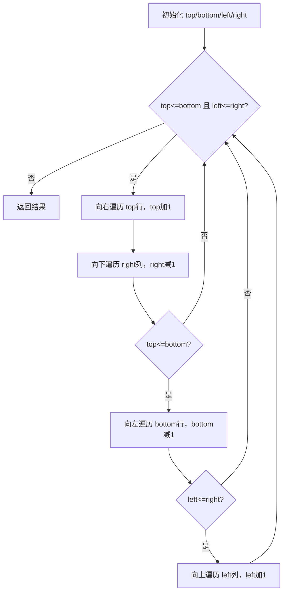

# 54. 螺旋矩阵

## 📋 题目信息
- **难度**：Medium
- **标签**：数组、矩阵、模拟
- **来源**：LeetCode 54

---

## 📖 题目描述

给你一个 `m` 行 `n` 列的矩阵 `matrix`，请按照**顺时针螺旋顺序**，返回矩阵中的所有元素。

### 示例

**示例 1：**
```
输入：matrix = [[1,2,3],[4,5,6],[7,8,9]]
输出：[1,2,3,6,9,8,7,4,5]
```

**示例 2：**
```
输入：matrix = [[1,2,3,4],[5,6,7,8],[9,10,11,12]]
输出：[1,2,3,4,8,12,11,10,9,5,6,7]
```

### 约束条件

- `m == matrix.length`
- `n == matrix[i].length`
- `1 <= m, n <= 10`
- `-100 <= matrix[i][j] <= 100`

---

## 🤔 题目分析

### 问题理解

用自己的话描述：给定一个二维矩阵，要求按照"顺时针螺旋"的顺序依次读取所有元素，并以一维列表的形式返回。

所谓"顺时针螺旋"，就是从矩阵左上角出发，先向右走完第一行，再向下走完最后一列，再向左走完最后一行，再向上走完第一列，然后缩小范围，继续对内层矩阵重复这个过程，直到所有元素都被访问。

**关键点：**
- 遍历方向固定为：右 → 下 → 左 → 上，循环往复
- 每走完一个方向，对应的边界就要收缩一格
- 需要判断何时停止（已收集所有 m×n 个元素）

### 关键观察

1. **边界收缩规律**：
   - 向右走完一行后，上边界 `top` 下移一行（`top += 1`）
   - 向下走完一列后，右边界 `right` 左移一列（`right -= 1`）
   - 向左走完一行后，下边界 `bottom` 上移一行（`bottom -= 1`）
   - 向上走完一列后，左边界 `left` 右移一列（`left += 1`）

2. **终止条件**：当 `left > right` 或 `top > bottom` 时，说明所有元素已被访问完毕。

3. **矩形不一定是正方形**：需要在向左和向上遍历时额外判断边界是否仍然有效，避免重复遍历单行或单列。

4. **题目规模**：`m, n <= 10`，矩阵最多 100 个元素，任何合理算法都能通过，重点在于逻辑的正确性。

### 题目类型识别

- **数据结构**：二维数组（矩阵）
- **算法思想**：模拟（Simulation）
- **核心技巧**：边界收缩法 / 方向数组法

这道题本质上是一道**模拟题**，没有复杂的数学推导，关键在于清晰地维护四个边界，并按顺序模拟螺旋遍历的过程。

---

## 💡 解题思路

### 方法一：暴力解法（标记已访问）

#### 🌟 形象化理解

**场景类比：扫地机器人**

想象一个扫地机器人在一个房间里工作。房间被划分成一个个格子，机器人从左上角出发，按照"右→下→左→上"的顺序清扫。每扫过一个格子，就在地上贴一张"已清扫"的标签。当机器人发现前方是墙壁（边界）或者是"已清扫"的格子时，就右转90度，继续前进。

**对应关系**：
- **房间格子** = 矩阵中的每个元素
- **机器人当前位置** = 当前遍历的坐标 `(row, col)`
- **"已清扫"标签** = `visited` 数组中标记为 `True`
- **右转** = 切换到下一个方向（右→下→左→上→右...）
- **遇到墙或已清扫格子** = 越界或已访问，触发转向

**核心理解**：机器人不需要提前规划路线，只需要"走不通就转弯"，自然就能走出螺旋路径。

---

#### 思路说明

最直观的方法：用一个与原矩阵同等大小的 `visited` 布尔数组记录哪些位置已经被访问过。然后模拟机器人的行走过程：

1. 定义四个方向的移动向量：右`(0,1)`、下`(1,0)`、左`(0,-1)`、上`(-1,0)`
2. 从 `(0, 0)` 出发，按当前方向一直走
3. 每走一步，将当前位置加入结果，并标记为已访问
4. 如果下一步越界或已访问，则顺时针换方向
5. 重复直到收集了所有 `m×n` 个元素

#### 算法步骤

1. 初始化 `visited` 数组（全为 `False`），结果列表 `result = []`
2. 定义方向数组 `directions = [(0,1), (1,0), (0,-1), (-1,0)]`，初始方向索引 `d = 0`
3. 当前位置 `row = 0, col = 0`
4. 循环 `m * n` 次：
   - 将 `matrix[row][col]` 加入 `result`
   - 标记 `visited[row][col] = True`
   - 计算下一步位置 `next_row = row + directions[d][0]`，`next_col = col + directions[d][1]`
   - 若下一步越界或已访问，则 `d = (d + 1) % 4`（换方向）
   - 更新 `row, col` 为新方向的下一步
5. 返回 `result`

#### 复杂度分析

- **时间复杂度**：O(m×n) — 每个元素恰好被访问一次
- **空间复杂度**：O(m×n) — 需要额外的 `visited` 数组存储访问状态

#### 为什么需要优化

暴力解法的逻辑清晰，但**额外使用了 O(m×n) 的空间**来存储 `visited` 数组。对于这道题，矩阵规模最大只有 10×10，空间开销不是问题。但从算法设计的角度，我们希望能做到 **O(1) 额外空间**（不计输出结果）。

核心问题：**能否不用 `visited` 数组，也能知道什么时候该转向？**

答案是可以的——通过维护四个边界来代替 `visited` 数组，这就是方法二的核心思想。

---

### 方法二：优化解法（边界收缩法）

#### 🌟 形象化理解

> **💡 在进入专业算法分析之前，先通过一个生活化的例子来理解优化思路的本质**

**场景类比：剥洋葱**

想象你在剥一颗洋葱，洋葱是一层一层的。你每次从最外层开始，沿着外圈把这一层剥下来（顺序：上边→右边→下边→左边），剥完一圈后，洋葱就缩小了一圈，然后继续剥下一层，直到洋葱被完全剥完。

**对应关系**：
- **洋葱的每一层** = 矩阵的每一圈元素
- **剥一圈的顺序** = 向右→向下→向左→向上遍历一圈
- **洋葱缩小一圈** = 四个边界各收缩一格（top+1, right-1, bottom-1, left+1）
- **洋葱剥完** = `top > bottom` 或 `left > right`，遍历结束
- **不需要记录"剥过哪里"** = 不需要 `visited` 数组，边界本身就记录了进度

**核心理解**：用四条边界线围住"还没遍历的区域"，每走完一条边就把对应边界往内收缩，自然就不会重复访问，也不需要额外标记。

**从类比到算法**：现在让我们把"剥洋葱"的思想转化为具体的边界收缩算法...

---

#### 优化思路推导

**思考过程**：

1. **暴力解法的瓶颈在于**：需要 O(m×n) 的 `visited` 数组来判断"是否已访问"
2. **观察螺旋遍历的规律**：每走完一条边（上/右/下/左），那条边就永远不会再被访问了
3. **关键洞察**：与其记录"哪些格子访问过"，不如直接记录"还剩哪些格子没访问"——用四个边界变量 `top, bottom, left, right` 来表示当前未访问区域的范围
4. **每走完一条边，对应边界收缩一格**，下次遍历自然就跳过了已访问的部分
5. **最终得到优化方案**：O(1) 额外空间（只用4个整数变量）

#### 算法步骤

1. **初始化四个边界**：
   - `top = 0`（上边界，初始为第0行）
   - `bottom = m - 1`（下边界，初始为最后一行）
   - `left = 0`（左边界，初始为第0列）
   - `right = n - 1`（右边界，初始为最后一列）

2. **循环，直到边界交叉**（`top > bottom` 或 `left > right`）：

   - **向右遍历**：从 `left` 到 `right`，固定行为 `top`，收集元素；完成后 `top += 1`
   - **向下遍历**：从 `top` 到 `bottom`，固定列为 `right`，收集元素；完成后 `right -= 1`
   - **向左遍历**（需判断 `top <= bottom`）：从 `right` 到 `left`，固定行为 `bottom`，收集元素；完成后 `bottom -= 1`
   - **向上遍历**（需判断 `left <= right`）：从 `bottom` 到 `top`，固定列为 `left`，收集元素；完成后 `left += 1`

3. 返回结果列表

> **注意**：向左和向上遍历前需要额外判断边界，原因是当矩阵只剩单行或单列时，向右/向下已经处理完了，不能再重复向左/向上遍历。

#### 复杂度分析

- **时间复杂度**：O(m×n) — 每个元素恰好被访问一次，与暴力解法相同
- **空间复杂度**：O(1) — 只使用了 `top, bottom, left, right` 四个整数变量（不计输出结果列表）

#### 💭 回顾类比

- 生活中的"洋葱每一层" 对应 代码中的"一次完整的四方向遍历循环"
- 生活中的"剥完一圈洋葱缩小" 对应 代码中的"四个边界各收缩一格"
- 生活中的"不需要记录剥过哪里" 对应 代码中的"不需要 `visited` 数组"
- 这就是为什么边界收缩法能把空间复杂度从 O(m×n) 降到 O(1)

---

## 🎨 图解说明

### 执行过程示例

以 `matrix = [[1,2,3],[4,5,6],[7,8,9]]` 为例，初始边界：`top=0, bottom=2, left=0, right=2`

```
初始矩阵：
┌─────────────┐
│  1   2   3  │  ← top=0
│  4   5   6  │
│  7   8   9  │  ← bottom=2
└─────────────┘
   ↑           ↑
 left=0      right=2

第1圈：
→ 向右遍历 top行(row=0)，col: 0→2：收集 [1, 2, 3]，top变为1
↓ 向下遍历 right列(col=2)，row: 1→2：收集 [6, 9]，right变为1
← 向左遍历 bottom行(row=2)，col: 1→0：收集 [8, 7]，bottom变为1
↑ 向上遍历 left列(col=0)，row: 1→1：收集 [4]，left变为1

此时边界：top=1, bottom=1, left=1, right=1

第2圈：
→ 向右遍历 top行(row=1)，col: 1→1：收集 [5]，top变为2
此时 top(2) > bottom(1)，循环结束

最终结果：[1, 2, 3, 6, 9, 8, 7, 4, 5] ✓
```

### 非正方形矩阵示例

以 `matrix = [[1,2,3,4],[5,6,7,8],[9,10,11,12]]` 为例（3行4列）

```
初始：top=0, bottom=2, left=0, right=3

第1圈：
→ 向右(row=0, col:0→3)：收集 [1,2,3,4]，top=1
↓ 向下(col=3, row:1→2)：收集 [8,12]，right=2
← 向左(row=2, col:2→0)：收集 [11,10,9]，bottom=1
↑ 向上(col=0, row:1→1)：收集 [5]，left=1

此时边界：top=1, bottom=1, left=1, right=2

第2圈：
→ 向右(row=1, col:1→2)：收集 [6,7]，top=2
此时 top(2) > bottom(1)，循环结束

最终结果：[1,2,3,4,8,12,11,10,9,5,6,7] ✓
```

### 可视化流程图



---

## ✏️ 代码框架填空

> **💡 学习提示**：在查看完整代码之前，先尝试根据上面的算法步骤，自己思考并填写下面的空白处。这将帮助你从"不知道怎么开始"过渡到"能够独立实现关键逻辑"。

### Python 填空版

```python
import sys
input = sys.stdin.readline
# List 来自 typing 模块，用于类型注解 spiralOrder 的参数和返回值
from typing import List

class Solution:
    def spiralOrder(self, matrix: List[List[int]]) -> List[int]:
        # 🔹 填空1（简单）：获取矩阵的行数和列数
        # 提示：matrix 有多少行？每行有多少列？
        m, n = ______, ______

        # 🔹 填空2（简单）：初始化四个边界变量
        # 提示：上边界从第0行开始，下边界从最后一行开始，左右同理
        top, bottom = ______, ______
        left, right = ______, ______

        # 🔹 填空3（简单）：初始化结果列表
        result = ______

        # 主循环：当边界合法时持续遍历
        while top <= bottom and left <= right:

            # 🔹 填空4（中等）：向右遍历 top 行
            # 提示：固定行为 top，列从 left 遍历到 right（含）
            for col in range(______, ______):
                result.append(matrix[______][______])
            # 🔹 填空5（简单）：收缩上边界
            top ______

            # 🔹 填空6（中等）：向下遍历 right 列
            # 提示：固定列为 right，行从 top 遍历到 bottom（含）
            for row in range(______, ______):
                result.append(matrix[______][______])
            # 🔹 填空7（简单）：收缩右边界
            right ______

            # 🔹 填空8（困难）：向左遍历 bottom 行（需要判断边界是否仍有效）
            # 提示：为什么这里需要额外判断 top <= bottom？
            if ______:
                for col in range(______, ______, ______):  # 注意：从右往左，步长为-1
                    result.append(matrix[______][______])
                # 🔹 填空9（简单）：收缩下边界
                bottom ______

            # 🔹 填空10（困难）：向上遍历 left 列（需要判断边界是否仍有效）
            # 提示：为什么这里需要额外判断 left <= right？
            if ______:
                for row in range(______, ______, ______):  # 注意：从下往上，步长为-1
                    result.append(matrix[______][______])
                # 🔹 填空11（简单）：收缩左边界
                left ______

        # 🔹 填空12（简单）：返回结果
        return ______
```

### 填空提示详解

**填空1 - 获取矩阵尺寸**
- 思考：Python 中如何获取列表的长度？二维列表的行数和列数分别怎么取？
- 提示：`len(matrix)` 是行数，`len(matrix[0])` 是列数

**填空2 - 初始化边界**
- 思考：上边界初始是第几行？下边界初始是第几行？
- 提示：上边界 = 0，下边界 = m-1，左边界 = 0，右边界 = n-1

**填空3 - 初始化结果**
- 思考：结果是一个列表，初始为空
- 提示：`result = []`

**填空4/6 - 遍历范围**
- 思考：`range(a, b)` 包含 a 但不包含 b，所以终点要 +1
- 提示：向右是 `range(left, right+1)`，向下是 `range(top, bottom+1)`

**填空5/7/9/11 - 边界收缩**
- 思考：走完上边界后，上边界应该往哪个方向移动？
- 提示：`top += 1`，`right -= 1`，`bottom -= 1`，`left += 1`

**填空8/10 - 额外边界判断**
- 思考：当矩阵只有一行时，向右遍历完后，不应该再向左遍历，否则会重复
- 提示：向左前判断 `top <= bottom`，向上前判断 `left <= right`

**填空12 - 返回结果**
- 思考：最终返回收集好的元素列表
- 提示：`return result`

### C++ 填空版

```cpp
#include <vector>
using namespace std;

class Solution {
public:
    vector<int> spiralOrder(vector<vector<int>>& matrix) {
        // 🔹 填空1：获取行数和列数
        int m = ______, n = ______;

        // 🔹 填空2：初始化四个边界
        int top = ______, bottom = ______;
        int left = ______, right = ______;

        vector<int> result;

        while (top <= bottom && left <= right) {
            // 🔹 填空3：向右遍历 top 行
            for (int col = ______; col <= ______; col++)
                result.push_back(matrix[______][______]);
            ______;  // top++

            // 🔹 填空4：向下遍历 right 列
            for (int row = ______; row <= ______; row++)
                result.push_back(matrix[______][______]);
            ______;  // right--

            // 🔹 填空5：向左遍历 bottom 行（需判断）
            if (______) {
                for (int col = ______; col >= ______; col--)
                    result.push_back(matrix[______][______]);
                ______;  // bottom--
            }

            // 🔹 填空6：向上遍历 left 列（需判断）
            if (______) {
                for (int row = ______; row >= ______; row--)
                    result.push_back(matrix[______][______]);
                ______;  // left++
            }
        }

        // 🔹 填空7：返回结果
        return ______;
    }
};
```

---

## 💻 完整代码实现

> **✅ 对照检查**：现在对比你的填空答案和下面的完整实现，看看思路是否一致。

### Python 实现

```python
import sys
input = sys.stdin.readline
# List 来自 typing 模块，用于 spiralOrder 的参数类型注解 List[List[int]] 和返回类型注解 List[int]
from typing import List

class Solution:
    def spiralOrder(self, matrix: List[List[int]]) -> List[int]:
        # 获取矩阵的行数 m 和列数 n
        m, n = len(matrix), len(matrix[0])

        # 初始化四个边界：上、下、左、右
        top, bottom = 0, m - 1
        left, right = 0, n - 1

        # 结果列表，用于收集螺旋顺序的元素
        result = []

        # 当上边界不超过下边界，且左边界不超过右边界时，继续遍历
        while top <= bottom and left <= right:

            # 1. 向右遍历：固定行为 top，列从 left 到 right
            for col in range(left, right + 1):
                result.append(matrix[top][col])
            top += 1  # 上边界下移，top 行已全部收集

            # 2. 向下遍历：固定列为 right，行从 top 到 bottom
            for row in range(top, bottom + 1):
                result.append(matrix[row][right])
            right -= 1  # 右边界左移，right 列已全部收集

            # 3. 向左遍历：固定行为 bottom，列从 right 到 left
            # 需要判断 top <= bottom，防止单行矩阵被重复遍历
            if top <= bottom:
                for col in range(right, left - 1, -1):
                    result.append(matrix[bottom][col])
                bottom -= 1  # 下边界上移，bottom 行已全部收集

            # 4. 向上遍历：固定列为 left，行从 bottom 到 top
            # 需要判断 left <= right，防止单列矩阵被重复遍历
            if left <= right:
                for row in range(bottom, top - 1, -1):
                    result.append(matrix[row][left])
                left += 1  # 左边界右移，left 列已全部收集

        return result


# 测试代码
if __name__ == "__main__":
    sol = Solution()

    # 测试用例1：3x3 矩阵
    matrix1 = [[1, 2, 3], [4, 5, 6], [7, 8, 9]]
    expected1 = [1, 2, 3, 6, 9, 8, 7, 4, 5]
    result1 = sol.spiralOrder(matrix1)
    print(f"测试1: {result1 == expected1}，结果：{result1}")

    # 测试用例2：3x4 矩阵
    matrix2 = [[1, 2, 3, 4], [5, 6, 7, 8], [9, 10, 11, 12]]
    expected2 = [1, 2, 3, 4, 8, 12, 11, 10, 9, 5, 6, 7]
    result2 = sol.spiralOrder(matrix2)
    print(f"测试2: {result2 == expected2}，结果：{result2}")

    # 测试用例3：单行矩阵
    matrix3 = [[1, 2, 3]]
    expected3 = [1, 2, 3]
    result3 = sol.spiralOrder(matrix3)
    print(f"测试3: {result3 == expected3}，结果：{result3}")

    # 测试用例4：单列矩阵
    matrix4 = [[1], [2], [3]]
    expected4 = [1, 2, 3]
    result4 = sol.spiralOrder(matrix4)
    print(f"测试4: {result4 == expected4}，结果：{result4}")

    # 测试用例5：1x1 矩阵
    matrix5 = [[42]]
    expected5 = [42]
    result5 = sol.spiralOrder(matrix5)
    print(f"测试5: {result5 == expected5}，结果：{result5}")
```

**填空答案解析**：
- **填空1**：`m, n = len(matrix), len(matrix[0])` — 行数是外层列表长度，列数是内层列表长度
- **填空2**：`top, bottom = 0, m-1` / `left, right = 0, n-1` — 边界初始覆盖整个矩阵
- **填空3**：`result = []` — 空列表收集结果
- **填空4**：`range(left, right+1)` — 向右遍历，终点 +1 因为 range 不含右端点
- **填空5**：`top += 1` — 走完上边界后上移
- **填空6**：`range(top, bottom+1)` — 向下遍历，注意 top 已经更新过了
- **填空7**：`right -= 1` — 走完右边界后左移
- **填空8**：`if top <= bottom` — 防止单行重复遍历
- **填空9**：`range(right, left-1, -1)` — 向左遍历，步长 -1，终点 left-1
- **填空10**：`bottom -= 1` — 走完下边界后上移
- **填空11**：`if left <= right` — 防止单列重复遍历
- **填空12**：`range(bottom, top-1, -1)` — 向上遍历，步长 -1，终点 top-1

---

### C++ 实现

```cpp
#include <vector>
#include <iostream>
using namespace std;

class Solution {
public:
    vector<int> spiralOrder(vector<vector<int>>& matrix) {
        // 获取矩阵行数和列数
        int m = matrix.size(), n = matrix[0].size();

        // 初始化四个边界
        int top = 0, bottom = m - 1;
        int left = 0, right = n - 1;

        vector<int> result;
        result.reserve(m * n);  // 预分配空间，避免多次扩容

        while (top <= bottom && left <= right) {
            // 1. 向右遍历 top 行
            for (int col = left; col <= right; col++)
                result.push_back(matrix[top][col]);
            top++;

            // 2. 向下遍历 right 列
            for (int row = top; row <= bottom; row++)
                result.push_back(matrix[row][right]);
            right--;

            // 3. 向左遍历 bottom 行（需判断防止单行重复）
            if (top <= bottom) {
                for (int col = right; col >= left; col--)
                    result.push_back(matrix[bottom][col]);
                bottom--;
            }

            // 4. 向上遍历 left 列（需判断防止单列重复）
            if (left <= right) {
                for (int row = bottom; row >= top; row--)
                    result.push_back(matrix[row][left]);
                left++;
            }
        }

        return result;
    }
};

// 测试代码
int main() {
    Solution sol;

    // 测试用例1：3x3 矩阵
    vector<vector<int>> matrix1 = {{1,2,3},{4,5,6},{7,8,9}};
    vector<int> res1 = sol.spiralOrder(matrix1);
    // 期望：1 2 3 6 9 8 7 4 5
    for (int x : res1) cout << x << " ";
    cout << endl;

    // 测试用例2：3x4 矩阵
    vector<vector<int>> matrix2 = {{1,2,3,4},{5,6,7,8},{9,10,11,12}};
    vector<int> res2 = sol.spiralOrder(matrix2);
    // 期望：1 2 3 4 8 12 11 10 9 5 6 7
    for (int x : res2) cout << x << " ";
    cout << endl;

    return 0;
}
```

**与 Python 的主要差异**：
- **类型声明**：C++ 需要显式声明 `int m`, `vector<int> result` 等类型
- **size() 方法**：C++ 用 `matrix.size()` 和 `matrix[0].size()` 获取尺寸，返回 `size_t` 类型
- **push_back**：C++ 用 `result.push_back(val)` 代替 Python 的 `result.append(val)`
- **reserve**：C++ 可以用 `result.reserve(m*n)` 预分配内存，提升性能
- **for 循环语法**：C++ 的 for 循环是三段式 `for(init; cond; update)`，Python 用 `range`
- **逻辑完全一致**：两种语言的算法思路、边界判断逻辑完全相同

---

## ⚠️ 易错点提醒

### 1. 边界条件

**易错点1：向左/向上遍历前忘记判断边界**

这是本题最经典的错误。当矩阵只有一行（如 `[[1,2,3]]`）时：
- 向右遍历完 `[1,2,3]` 后，`top` 变为 1
- 此时 `top(1) > bottom(0)`，如果不判断直接向左遍历，会重复收集元素

**错误代码**：
```python
# 错误：没有判断 top <= bottom
for col in range(right, left - 1, -1):
    result.append(matrix[bottom][col])  # 会重复遍历！
```

**正确处理**：
```python
# 正确：先判断边界是否仍然有效
if top <= bottom:
    for col in range(right, left - 1, -1):
        result.append(matrix[bottom][col])
```

**易错点2：单列矩阵的向上遍历**

类似地，当矩阵只有一列（如 `[[1],[2],[3]]`）时，向下遍历完后不应再向上遍历：
```python
# 正确：向上遍历前判断 left <= right
if left <= right:
    for row in range(bottom, top - 1, -1):
        result.append(matrix[row][left])
```

---

### 2. 常见错误

**错误1：range 的终点忘记 +1 或 -1**
- **原因**：Python 的 `range(a, b)` 不包含 b，向右遍历到 `right` 需要写 `range(left, right+1)`
- **正确做法**：向右 `range(left, right+1)`，向下 `range(top, bottom+1)`，向左 `range(right, left-1, -1)`，向上 `range(bottom, top-1, -1)`
- **填空时注意**：每个方向的终点都要仔细检查是否需要 ±1

**错误2：边界收缩的顺序写错**
- **原因**：向右遍历完后应该收缩 `top`，但有时会误写成收缩 `bottom`
- **记忆口诀**：走完哪条边，就收缩哪条边
  - 走完上边（向右）→ `top += 1`
  - 走完右边（向下）→ `right -= 1`
  - 走完下边（向左）→ `bottom -= 1`
  - 走完左边（向上）→ `left += 1`

**错误3：向下遍历的起点用了旧的 top**
- **原因**：向右遍历后 `top` 已经 +1，向下遍历的起点应该是新的 `top`，而不是原来的 `top`
- **正确做法**：代码中先执行 `top += 1`，再执行向下的 `for row in range(top, bottom+1)`，顺序不能颠倒

**错误4：C++ 中 size() 返回无符号类型导致比较问题**
- **原因**：`matrix.size()` 返回 `size_t`（无符号整数），与 `int` 比较可能有警告
- **正确做法**：用 `int m = (int)matrix.size()` 显式转换为有符号整数

---

### 3. 调试技巧

- **打印边界状态**：在每次循环开始时打印 `top, bottom, left, right`，观察边界是否按预期收缩
- **用小矩阵验证**：先用 1×1、1×3、3×1、2×2 等边界情况手动模拟，确认逻辑正确
- **统计元素个数**：最终结果的长度应该等于 `m * n`，可以用 `assert len(result) == m * n` 验证
- **填空验证**：完成填空后，用示例1（3×3）手动追踪每一步，对照期望输出 `[1,2,3,6,9,8,7,4,5]`

---

## 🔗 相似题目推荐

### 同类型题目

这些题目使用相同或相似的矩阵模拟思路：

1. **LeetCode 59 - 螺旋矩阵 II** (Medium)
   - 相似点：本题的"逆操作"——不是读取螺旋顺序，而是按螺旋顺序填入数字 1~n²
   - 建议：掌握本题后立刻练习，加深对边界收缩法的理解
   - 核心差异：从"读矩阵"变成"写矩阵"，逻辑框架完全相同

2. **LeetCode 885 - 螺旋矩阵 III** (Medium)
   - 相似点：同样是螺旋遍历，但起点不固定，且矩阵可能很大
   - 建议：用方向数组法解决，是本题方法一（方向数组）的进阶版

3. **LeetCode 48 - 旋转图像** (Medium)
   - 相似点：同样是对二维矩阵进行原地操作，需要清晰地理解矩阵坐标变换
   - 建议：练习矩阵坐标变换的思维方式

### 进阶题目

掌握本题后，可以挑战这些更难的题目：

1. **LeetCode 289 - 生命游戏** (Medium)
   - 进阶点：矩阵原地更新，需要同时考虑当前状态和下一状态，边界处理更复杂

2. **LeetCode 73 - 矩阵置零** (Medium)
   - 进阶点：需要在不使用额外空间的情况下标记并更新矩阵，考验对矩阵边界的掌控

### 相关知识点

本题涉及的核心知识点：

- **矩阵模拟**：按规则遍历二维数组，关键是维护清晰的状态变量
  - 相关题目：LeetCode 59、LeetCode 885
- **边界收缩技巧**：用四个变量代替 visited 数组，O(1) 空间实现状态追踪
  - 相关题目：LeetCode 59、LeetCode 48
- **方向数组技巧**：用 `directions = [(0,1),(1,0),(0,-1),(-1,0)]` 统一表示四个方向
  - 相关题目：LeetCode 200（岛屿数量）、LeetCode 994（腐烂的橘子）

---

## 📚 知识点总结

### 核心算法

本题使用**模拟（Simulation）**思想，核心是**边界收缩法**：

用四个变量 `top, bottom, left, right` 动态维护"尚未遍历的矩形区域"，每走完一条边就收缩对应边界，直到区域消失。

### 数据结构

- **二维数组（矩阵）**：通过行列索引 `matrix[row][col]` 访问元素
- **一维列表**：收集结果，Python 用 `list.append()`，C++ 用 `vector.push_back()`

### 解题模板

边界收缩法的通用模板（可复用于螺旋矩阵 II 等题目）：

```python
# 螺旋遍历/填充通用模板
def spiral_template(matrix):
    m, n = len(matrix), len(matrix[0])
    top, bottom, left, right = 0, m - 1, 0, n - 1
    result = []

    while top <= bottom and left <= right:
        # 向右
        for col in range(left, right + 1):
            # 操作 matrix[top][col]
            pass
        top += 1

        # 向下
        for row in range(top, bottom + 1):
            # 操作 matrix[row][right]
            pass
        right -= 1

        # 向左（需判断）
        if top <= bottom:
            for col in range(right, left - 1, -1):
                # 操作 matrix[bottom][col]
                pass
            bottom -= 1

        # 向上（需判断）
        if left <= right:
            for row in range(bottom, top - 1, -1):
                # 操作 matrix[row][left]
                pass
            left += 1

    return result
```

### 学习要点

1. **模拟题的关键**：找到清晰的状态表示方式，本题用四个边界变量表示"剩余未访问区域"
2. **边界判断的必要性**：向左和向上遍历前必须额外判断，这是处理非正方形矩阵的关键
3. **两种解法的权衡**：方向数组法（暴力）代码更简洁但空间 O(m×n)；边界收缩法空间 O(1) 但需要额外的边界判断
4. **填空练习的价值**：通过填空，你应该掌握了边界收缩的四个方向顺序、每个方向的 range 写法、以及何时需要额外的边界判断

---

## 📝 补充说明

### 从填空到完整实现的进阶路径

1. **第一遍**：看算法步骤，尝试填空（重点关注填空8/10，理解为什么需要额外判断）
2. **第二遍**：对照答案，理解每个填空的原因，特别是 `range` 的终点为什么要 ±1
3. **第三遍**：不看提示，独立完整实现，用5个测试用例（3×3、3×4、单行、单列、1×1）验证
4. **第四遍**：尝试实现方法一（方向数组法），对比两种方法的代码量和空间使用

### 时间复杂度优化历程

- 暴力解法（方向数组）：O(m×n) 时间，O(m×n) 空间 → 瓶颈：visited 数组占用额外空间
- 优化解法（边界收缩）：O(m×n) 时间，O(1) 空间 → 用四个整数变量替代 visited 数组

### 空间复杂度权衡

本题两种方法的时间复杂度相同，优化体现在空间上：
- 方向数组法：直观易懂，适合快速实现
- 边界收缩法：空间最优，是面试中更推荐的写法

### 实际应用场景

螺旋矩阵遍历在实际工程中的应用：
- **图像处理**：从图像中心向外螺旋扫描，用于某些特效算法
- **打印机控制**：某些打印路径优化算法使用螺旋遍历减少打印头移动距离
- **游戏开发**：地图生成时按螺旋顺序填充地形数据

