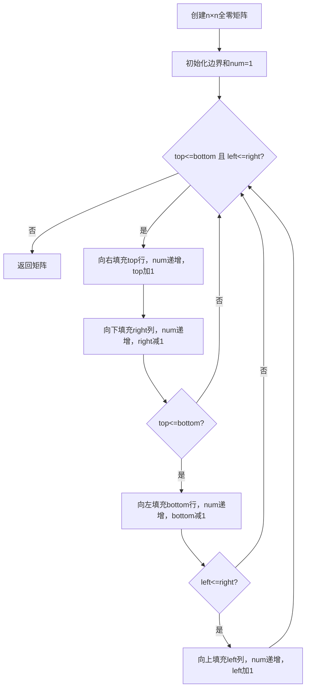

# 59. 螺旋矩阵 II

## 📋 题目信息
- **难度**：Medium
- **标签**：数组、矩阵、模拟
- **来源**：LeetCode 59

---

## 📖 题目描述

给你一个正整数 `n`，生成一个包含 `1` 到 `n²` 所有元素，且元素按顺时针顺序螺旋排列的 `n x n` 正方形矩阵 `matrix`。

### 示例

**示例 1：**
```
输入：n = 3
输出：[[1,2,3],[8,9,4],[7,6,5]]
```

可视化：
```
1 → 2 → 3
            ↓
8 → 9   4
↑        ↓
7 ← 6 ← 5
```

**示例 2：**
```
输入：n = 1
输出：[[1]]
```

### 约束条件

- `1 <= n <= 20`

---

## 🤔 题目分析

### 问题理解

用自己的话描述：给定一个正整数 `n`，需要创建一个 `n×n` 的空矩阵，然后按照**顺时针螺旋**的顺序，依次将数字 `1, 2, 3, ..., n²` 填入矩阵中，最终返回填好的矩阵。

这道题是 **LeetCode 54（螺旋矩阵）的逆操作**：
- 54 题：给定矩阵 → 按螺旋顺序**读取**元素 → 输出一维列表
- 59 题：给定数字 n → 按螺旋顺序**填入**数字 → 输出二维矩阵

**关键点：**
- 矩阵一定是**正方形**（n×n），不需要处理非正方形的情况
- 填入的数字从 1 开始递增到 n²，每个位置恰好填一个数
- 遍历方向固定为：右 → 下 → 左 → 上，循环往复
- 每走完一个方向，对应的边界就要收缩一格

### 关键观察

1. **与 54 题的关系**：本题的遍历逻辑与 54 题完全相同，只是操作从"读取"变成了"写入"。如果你已经掌握了 54 题的边界收缩法，本题只需要把 `result.append(matrix[row][col])` 改成 `matrix[row][col] = num`。

2. **正方形简化了问题**：由于矩阵是 n×n 的正方形，向左和向上遍历时的额外边界判断仍然需要，但不会出现"宽远大于高"或"高远大于宽"的极端情况。

3. **边界收缩规律**（与 54 题一致）：
   - 向右走完一行后，上边界 `top` 下移（`top += 1`）
   - 向下走完一列后，右边界 `right` 左移（`right -= 1`）
   - 向左走完一行后，下边界 `bottom` 上移（`bottom -= 1`）
   - 向上走完一列后，左边界 `left` 右移（`left += 1`）

4. **终止条件**：当 `left > right` 或 `top > bottom` 时，所有 n² 个数字已填完。

5. **题目规模**：`n <= 20`，矩阵最多 400 个元素，任何合理算法都能通过。

### 题目类型识别

- **数据结构**：二维数组（矩阵）
- **算法思想**：模拟（Simulation）
- **核心技巧**：边界收缩法 / 方向数组法

这道题本质上是一道**模拟题**，与 54 题共享相同的螺旋遍历框架，区别仅在于"读"变成了"写"。

---

## 💡 解题思路

### 方法一：暴力解法（方向数组 + visited 标记）

#### 🌟 形象化理解

**场景类比：铺地砖的工人**

想象一个工人在一个空房间里铺地砖。房间是 n×n 的方格地面，工人手里有编号 1 到 n² 的地砖。他从左上角开始，按照"右→下→左→上"的顺序铺砖。每铺一块砖，就在上面写上编号。当前方是墙壁或者已经铺过砖的位置时，工人就右转 90 度继续铺。

**对应关系**：
- **空房间** = 初始化为 0 的 n×n 矩阵
- **工人当前位置** = 当前坐标 `(row, col)`
- **铺砖** = 将当前编号 `num` 写入 `matrix[row][col]`
- **已铺过的砖** = 矩阵中值不为 0 的位置（或 `visited` 数组标记为 `True`）
- **右转** = 切换到下一个方向（右→下→左→上→右...）

**核心理解**：工人不需要提前规划路线，只需要"走不通就转弯"，按顺序铺砖，自然就能铺出螺旋图案。

---

#### 思路说明

最直观的方法：创建一个 n×n 的全零矩阵，用方向数组模拟螺旋行走过程，每走一步就将当前编号填入矩阵。判断"是否走过"可以通过检查矩阵值是否为 0 来实现（因为填入的数字都 ≥ 1），所以实际上不需要额外的 `visited` 数组。

1. 定义四个方向的移动向量：右`(0,1)`、下`(1,0)`、左`(0,-1)`、上`(-1,0)`
2. 从 `(0, 0)` 出发，初始方向为"右"
3. 每走一步，将当前编号 `num` 填入矩阵，`num` 递增
4. 如果下一步越界或已填过数字，则顺时针换方向
5. 重复直到填完 n² 个数字

#### 算法步骤

1. 创建 `matrix = [[0]*n for _ in range(n)]`
2. 定义方向数组 `directions = [(0,1), (1,0), (0,-1), (-1,0)]`，初始方向索引 `d = 0`
3. 当前位置 `row = 0, col = 0`，当前编号 `num = 1`
4. 循环 `n²` 次：
   - 填入 `matrix[row][col] = num`，`num += 1`
   - 计算下一步位置 `next_row, next_col`
   - 若下一步越界或 `matrix[next_row][next_col] != 0`，则 `d = (d + 1) % 4`
   - 更新 `row, col` 为新方向的下一步
5. 返回 `matrix`

#### 复杂度分析

- **时间复杂度**：O(n²) — 每个格子恰好被填入一次
- **空间复杂度**：O(1)（不计输出矩阵）— 利用矩阵本身的 0 值判断是否访问过，无需额外 `visited` 数组

#### 为什么需要优化

方向数组法的逻辑清晰，代码也比较简洁。但它的缺点是：
- 每一步都需要**计算下一步位置并判断是否合法**，存在较多的条件分支
- 方向切换的逻辑（取模运算）在循环内部，不够直观

相比之下，**边界收缩法**将四个方向的遍历显式地写成四个 `for` 循环，逻辑更加清晰、结构化，也更容易在面试中快速写出无 bug 的代码。

---

### 方法二：优化解法（边界收缩法）

#### 🌟 形象化理解

> **💡 在进入专业算法分析之前，先通过一个生活化的例子来理解优化思路的本质**

**场景类比：画螺旋线圈**

想象你在一张正方形纸上画螺旋线圈。你从外圈开始，沿着纸的边缘画一圈（上边→右边→下边→左边），画完一圈后，纸的"可画区域"就缩小了一圈。然后你继续在缩小后的区域画下一圈，如此往复，直到纸的中心。

在画的过程中，你手里拿着一支笔，笔尖上的数字从 1 开始递增。每画一小段，就在纸上标上当前数字，然后数字 +1。

**对应关系**：
- **正方形纸** = n×n 矩阵
- **画一圈** = 按"右→下→左→上"遍历一圈边界
- **可画区域缩小** = 四个边界各收缩一格（top+1, right-1, bottom-1, left+1）
- **笔尖上的数字** = 当前要填入的编号 `num`
- **画完整张纸** = `top > bottom` 或 `left > right`，所有格子已填满
- **不需要记录"画过哪里"** = 不需要 `visited` 数组，边界本身就记录了进度

**核心理解**：用四条边界线围住"还没填数字的区域"，每画完一条边就把对应边界往内收缩，自然就不会重复填写，也不需要额外标记。

**从类比到算法**：现在让我们把"画螺旋线圈"的思想转化为具体的边界收缩算法...

---

#### 优化思路推导

**思考过程**：

1. **方向数组法的特点**：每一步都要判断"下一步能否走"，逻辑分散在循环内部
2. **观察螺旋填充的规律**：每填完一条边（上/右/下/左），那条边就永远不会再被访问了
3. **关键洞察**：与其每步判断"能否走"，不如直接用四个边界变量 `top, bottom, left, right` 表示"还剩哪些格子没填"
4. **每填完一条边，对应边界收缩一格**，下次遍历自然就跳过了已填充的部分
5. **最终得到优化方案**：将螺旋遍历结构化为四个 `for` 循环，逻辑清晰，易于实现

#### 算法步骤

1. **创建 n×n 的全零矩阵**：`matrix = [[0]*n for _ in range(n)]`

2. **初始化四个边界**：
   - `top = 0`（上边界，初始为第0行）
   - `bottom = n - 1`（下边界，初始为最后一行）
   - `left = 0`（左边界，初始为第0列）
   - `right = n - 1`（右边界，初始为最后一列）

3. **初始化当前编号**：`num = 1`

4. **循环，直到边界交叉**（`top > bottom` 或 `left > right`）：

   - **向右填充**：从 `left` 到 `right`，固定行为 `top`，填入 `num` 并递增；完成后 `top += 1`
   - **向下填充**：从 `top` 到 `bottom`，固定列为 `right`，填入 `num` 并递增；完成后 `right -= 1`
   - **向左填充**（需判断 `top <= bottom`）：从 `right` 到 `left`，固定行为 `bottom`，填入 `num` 并递增；完成后 `bottom -= 1`
   - **向上填充**（需判断 `left <= right`）：从 `bottom` 到 `top`，固定列为 `left`，填入 `num` 并递增；完成后 `left += 1`

5. 返回 `matrix`

> **注意**：虽然本题矩阵是正方形，但向左和向上填充前仍需判断边界，原因是当 n 为奇数时，最后会剩下中心的一个格子，只需向右填充即可，不应再向左/向上填充。

#### 复杂度分析

- **时间复杂度**：O(n²) — 每个格子恰好被填入一次
- **空间复杂度**：O(1)（不计输出矩阵）— 只使用了 `top, bottom, left, right, num` 五个变量

#### 💭 回顾类比

- 生活中的"画一圈线圈" 对应 代码中的"一次完整的四方向填充循环"
- 生活中的"可画区域缩小" 对应 代码中的"四个边界各收缩一格"
- 生活中的"不需要记录画过哪里" 对应 代码中的"不需要 `visited` 数组"
- 这就是为什么边界收缩法逻辑清晰、代码简洁的原因

---

## 🎨 图解说明

### 执行过程示例

以 `n = 3` 为例，初始边界：`top=0, bottom=2, left=0, right=2`，`num=1`

```
初始矩阵（全0）：
┌─────────────┐
│  0   0   0  │  ← top=0
│  0   0   0  │
│  0   0   0  │  ← bottom=2
└─────────────┘
   ↑           ↑
 left=0      right=2

第1圈：
→ 向右填充 top行(row=0)，col: 0→2，填入 1,2,3，num变为4，top变为1
   矩阵：[[1,2,3],[0,0,0],[0,0,0]]

↓ 向下填充 right列(col=2)，row: 1→2，填入 4,5，num变为6，right变为1
   矩阵：[[1,2,3],[0,0,4],[0,0,5]]

← 向左填充 bottom行(row=2)，col: 1→0，填入 6,7，num变为8，bottom变为1
   矩阵：[[1,2,3],[0,0,4],[7,6,5]]

↑ 向上填充 left列(col=0)，row: 1→1，填入 8，num变为9，left变为1
   矩阵：[[1,2,3],[8,0,4],[7,6,5]]

此时边界：top=1, bottom=1, left=1, right=1

第2圈：
→ 向右填充 top行(row=1)，col: 1→1，填入 9，num变为10，top变为2
   矩阵：[[1,2,3],[8,9,4],[7,6,5]]

此时 top(2) > bottom(1)，循环结束

最终结果：[[1,2,3],[8,9,4],[7,6,5]] ✓
```

### n=4 的示例

```
初始：top=0, bottom=3, left=0, right=3

第1圈填充后：
 1   2   3   4
12   0   0   5
11   0   0   6
10   9   8   7

第2圈填充后：
 1   2   3   4
12  13  14   5
11  16  15   6
10   9   8   7

最终结果 ✓
```

### 可视化流程图



---

## ✏️ 代码框架填空

> **💡 学习提示**：在查看完整代码之前，先尝试根据上面的算法步骤，自己思考并填写下面的空白处。如果你已经做过 54 题（螺旋矩阵），会发现框架几乎一样，只是"读"变成了"写"。

### Python 填空版

```python
import sys
input = sys.stdin.readline
# List 来自 typing 模块，用于类型注解 generateMatrix 的返回值 List[List[int]]
from typing import List

class Solution:
    def generateMatrix(self, n: int) -> List[List[int]]:
        # 🔹 填空1（简单）：创建 n×n 的全零矩阵
        # 提示：用列表推导式创建二维列表，每个元素初始为 0
        matrix = ______

        # 🔹 填空2（简单）：初始化四个边界变量
        # 提示：上边界从第0行开始，下边界从第n-1行开始
        top, bottom = ______, ______
        left, right = ______, ______

        # 🔹 填空3（简单）：初始化当前要填入的数字
        # 提示：从 1 开始递增
        num = ______

        # 主循环：当边界合法时持续填充
        while top <= bottom and left <= right:

            # 🔹 填空4（中等）：向右填充 top 行
            # 提示：固定行为 top，列从 left 遍历到 right（含）
            for col in range(______, ______):
                matrix[______][______] = num
                num += 1
            # 🔹 填空5（简单）：收缩上边界
            top ______

            # 🔹 填空6（中等）：向下填充 right 列
            # 提示：固定列为 right，行从 top 遍历到 bottom（含）
            for row in range(______, ______):
                matrix[______][______] = num
                num += 1
            # 🔹 填空7（简单）：收缩右边界
            right ______

            # 🔹 填空8（困难）：向左填充 bottom 行（需判断边界）
            # 提示：为什么需要判断 top <= bottom？想想 n 为奇数时最后一圈的情况
            if ______:
                for col in range(______, ______, ______):
                    matrix[______][______] = num
                    num += 1
                # 🔹 填空9（简单）：收缩下边界
                bottom ______

            # 🔹 填空10（困难）：向上填充 left 列（需判断边界）
            # 提示：为什么需要判断 left <= right？
            if ______:
                for row in range(______, ______, ______):
                    matrix[______][______] = num
                    num += 1
                # 🔹 填空11（简单）：收缩左边界
                left ______

        # 🔹 填空12（简单）：返回填好的矩阵
        return ______
```

### 填空提示详解

**填空1 - 创建全零矩阵**
- 思考：如何用 Python 创建一个 n 行 n 列的二维列表？
- 提示：`[[0] * n for _ in range(n)]`，注意不能用 `[[0]*n]*n`（浅拷贝陷阱）

**填空2 - 初始化边界**
- 思考：上边界初始是第几行？下边界初始是第几行？
- 提示：`top = 0, bottom = n-1, left = 0, right = n-1`

**填空3 - 初始化编号**
- 思考：第一个填入的数字是几？
- 提示：`num = 1`

**填空4/6 - 遍历范围**
- 思考：`range(a, b)` 包含 a 但不包含 b，所以终点要 +1
- 提示：向右是 `range(left, right+1)`，向下是 `range(top, bottom+1)`

**填空5/7/9/11 - 边界收缩**
- 思考：走完上边界后，上边界应该往哪个方向移动？
- 提示：`top += 1`，`right -= 1`，`bottom -= 1`，`left += 1`

**填空8/10 - 额外边界判断**
- 思考：当 n 为奇数（如 n=3）时，最后一圈只剩中心一个格子，向右填充后 top 已超过 bottom
- 提示：向左前判断 `top <= bottom`，向上前判断 `left <= right`

**填空12 - 返回结果**
- 思考：返回填好数字的矩阵
- 提示：`return matrix`

### C++ 填空版

```cpp
#include <vector>
using namespace std;

class Solution {
public:
    vector<vector<int>> generateMatrix(int n) {
        // 🔹 填空1：创建 n×n 的全零矩阵
        vector<vector<int>> matrix(______, vector<int>(______, ______));

        // 🔹 填空2：初始化四个边界
        int top = ______, bottom = ______;
        int left = ______, right = ______;

        // 🔹 填空3：初始化编号
        int num = ______;

        while (top <= bottom && left <= right) {
            // 🔹 填空4：向右填充 top 行
            for (int col = ______; col <= ______; col++)
                matrix[______][______] = num++;
            ______;  // top++

            // 🔹 填空5：向下填充 right 列
            for (int row = ______; row <= ______; row++)
                matrix[______][______] = num++;
            ______;  // right--

            // 🔹 填空6：向左填充 bottom 行（需判断）
            if (______) {
                for (int col = ______; col >= ______; col--)
                    matrix[______][______] = num++;
                ______;  // bottom--
            }

            // 🔹 填空7：向上填充 left 列（需判断）
            if (______) {
                for (int row = ______; row >= ______; row--)
                    matrix[______][______] = num++;
                ______;  // left++
            }
        }

        // 🔹 填空8：返回矩阵
        return ______;
    }
};
```

---

## 💻 完整代码实现

> **✅ 对照检查**：现在对比你的填空答案和下面的完整实现，看看思路是否一致。

### Python 实现

```python
import sys
input = sys.stdin.readline
# List 来自 typing 模块，用于 generateMatrix 的返回类型注解 List[List[int]]
from typing import List

class Solution:
    def generateMatrix(self, n: int) -> List[List[int]]:
        # 创建 n×n 的全零矩阵
        # 注意：不能用 [[0]*n]*n，那样每行是同一个列表的引用（浅拷贝陷阱）
        matrix = [[0] * n for _ in range(n)]

        # 初始化四个边界：上、下、左、右
        top, bottom = 0, n - 1
        left, right = 0, n - 1

        # 当前要填入的数字，从 1 开始递增
        num = 1

        # 当上边界不超过下边界，且左边界不超过右边界时，继续填充
        while top <= bottom and left <= right:

            # 1. 向右填充：固定行为 top，列从 left 到 right
            for col in range(left, right + 1):
                matrix[top][col] = num
                num += 1
            top += 1  # 上边界下移，top 行已全部填完

            # 2. 向下填充：固定列为 right，行从 top 到 bottom
            for row in range(top, bottom + 1):
                matrix[row][right] = num
                num += 1
            right -= 1  # 右边界左移，right 列已全部填完

            # 3. 向左填充：固定行为 bottom，列从 right 到 left
            # 需要判断 top <= bottom，防止 n 为奇数时最后一圈只剩一行被重复填充
            if top <= bottom:
                for col in range(right, left - 1, -1):
                    matrix[bottom][col] = num
                    num += 1
                bottom -= 1  # 下边界上移，bottom 行已全部填完

            # 4. 向上填充：固定列为 left，行从 bottom 到 top
            # 需要判断 left <= right，防止最后一圈只剩一列被重复填充
            if left <= right:
                for row in range(bottom, top - 1, -1):
                    matrix[row][left] = num
                    num += 1
                left += 1  # 左边界右移，left 列已全部填完

        return matrix


# 测试代码
if __name__ == "__main__":
    sol = Solution()

    # 测试用例1：n=3
    result1 = sol.generateMatrix(3)
    expected1 = [[1,2,3],[8,9,4],[7,6,5]]
    print(f"测试1: {result1 == expected1}，结果：{result1}")

    # 测试用例2：n=1
    result2 = sol.generateMatrix(1)
    expected2 = [[1]]
    print(f"测试2: {result2 == expected2}，结果：{result2}")

    # 测试用例3：n=2
    result3 = sol.generateMatrix(2)
    expected3 = [[1,2],[4,3]]
    print(f"测试3: {result3 == expected3}，结果：{result3}")

    # 测试用例4：n=4
    result4 = sol.generateMatrix(4)
    expected4 = [[1,2,3,4],[12,13,14,5],[11,16,15,6],[10,9,8,7]]
    print(f"测试4: {result4 == expected4}，结果：{result4}")

    # 测试用例5：n=5（奇数，中心有单独一个格子）
    result5 = sol.generateMatrix(5)
    # 验证中心元素应为 25（n²）
    print(f"测试5: 中心元素={result5[2][2]}，应为25: {result5[2][2] == 25}")
```

**填空答案解析**：
- **填空1**：`matrix = [[0] * n for _ in range(n)]` — 列表推导式创建 n×n 全零矩阵
- **填空2**：`top, bottom = 0, n-1` / `left, right = 0, n-1` — 边界初始覆盖整个矩阵
- **填空3**：`num = 1` — 从 1 开始填入
- **填空4**：`range(left, right+1)` — 向右填充，终点 +1
- **填空5**：`top += 1` — 走完上边界后下移
- **填空6**：`range(top, bottom+1)` — 向下填充，注意 top 已更新
- **填空7**：`right -= 1` — 走完右边界后左移
- **填空8**：`if top <= bottom` — 防止单行重复填充
- **填空9**：`range(right, left-1, -1)` — 向左填充，步长 -1
- **填空10**：`bottom -= 1` — 走完下边界后上移
- **填空11**：`if left <= right` — 防止单列重复填充
- **填空12**：`range(bottom, top-1, -1)` — 向上填充，步长 -1

---

### C++ 实现

```cpp
#include <vector>
#include <iostream>
using namespace std;

class Solution {
public:
    vector<vector<int>> generateMatrix(int n) {
        // 创建 n×n 的全零矩阵
        vector<vector<int>> matrix(n, vector<int>(n, 0));

        // 初始化四个边界
        int top = 0, bottom = n - 1;
        int left = 0, right = n - 1;

        // 当前要填入的数字
        int num = 1;

        while (top <= bottom && left <= right) {
            // 1. 向右填充 top 行
            for (int col = left; col <= right; col++)
                matrix[top][col] = num++;
            top++;

            // 2. 向下填充 right 列
            for (int row = top; row <= bottom; row++)
                matrix[row][right] = num++;
            right--;

            // 3. 向左填充 bottom 行（需判断防止单行重复）
            if (top <= bottom) {
                for (int col = right; col >= left; col--)
                    matrix[bottom][col] = num++;
                bottom--;
            }

            // 4. 向上填充 left 列（需判断防止单列重复）
            if (left <= right) {
                for (int row = bottom; row >= top; row--)
                    matrix[row][left] = num++;
                left++;
            }
        }

        return matrix;
    }
};

// 测试代码
int main() {
    Solution sol;

    // 测试用例1：n=3
    vector<vector<int>> res1 = sol.generateMatrix(3);
    // 期望：[[1,2,3],[8,9,4],[7,6,5]]
    for (auto& row : res1) {
        for (int x : row) cout << x << "\t";
        cout << endl;
    }
    cout << "---" << endl;

    // 测试用例2：n=4
    vector<vector<int>> res2 = sol.generateMatrix(4);
    // 期望：[[1,2,3,4],[12,13,14,5],[11,16,15,6],[10,9,8,7]]
    for (auto& row : res2) {
        for (int x : row) cout << x << "\t";
        cout << endl;
    }

    return 0;
}
```

**与 Python 的主要差异**：
- **矩阵创建**：C++ 用 `vector<vector<int>>(n, vector<int>(n, 0))` 创建，Python 用列表推导式
- **num++**：C++ 支持后缀自增 `num++`，可以在赋值的同时递增，代码更紧凑
- **push_back vs append**：本题不需要，因为是直接通过索引赋值
- **逻辑完全一致**：两种语言的算法思路、边界判断逻辑完全相同

---

## ⚠️ 易错点提醒

### 1. 边界条件

**易错点1：Python 创建二维列表的浅拷贝陷阱**

这是本题最经典的 Python 坑。创建 n×n 全零矩阵时：

**错误代码**：
```python
# 错误：每行都是同一个列表的引用！
matrix = [[0] * n] * n
# 修改 matrix[0][0] = 1 后，matrix[1][0] 也会变成 1
```

**正确处理**：
```python
# 正确：用列表推导式，每行都是独立的新列表
matrix = [[0] * n for _ in range(n)]
```

**原因**：`[[0]*n]*n` 中外层的 `*n` 只是复制了 n 个对同一个列表的引用，修改任何一行都会影响所有行。

**易错点2：向左/向上填充前忘记判断边界**

与 54 题相同的问题。当 n 为奇数（如 n=3）时，最后一圈只剩中心一个格子：
- 向右填充完后，`top` 变为 2，此时 `top(2) > bottom(1)`
- 如果不判断直接向左填充，会在已填过的位置覆盖错误的数字

```python
# 正确：先判断边界是否仍然有效
if top <= bottom:
    for col in range(right, left - 1, -1):
        matrix[bottom][col] = num
        num += 1
```

---

### 2. 常见错误

**错误1：num 忘记递增**
- **原因**：填入数字后忘记 `num += 1`，导致所有格子填入相同的数字
- **正确做法**：每次 `matrix[row][col] = num` 后紧跟 `num += 1`
- **C++ 技巧**：可以用 `matrix[row][col] = num++` 一步完成赋值和递增

**错误2：range 的终点忘记 +1 或 -1**
- **原因**：Python 的 `range(a, b)` 不包含 b
- **正确做法**：
  - 向右：`range(left, right+1)`
  - 向下：`range(top, bottom+1)`
  - 向左：`range(right, left-1, -1)`
  - 向上：`range(bottom, top-1, -1)`

**错误3：边界收缩的方向搞反**
- **原因**：向右走完后应该收缩 `top`（上边界下移），但误写成 `bottom -= 1`
- **记忆口诀**（与 54 题相同）：走完哪条边，就收缩哪条边
  - 走完上边（向右）→ `top += 1`
  - 走完右边（向下）→ `right -= 1`
  - 走完下边（向左）→ `bottom -= 1`
  - 走完左边（向上）→ `left += 1`

**错误4：向下遍历的起点用了旧的 top**
- **原因**：向右填充后 `top` 已经 +1，向下填充的起点应该是新的 `top`
- **正确做法**：代码中先执行 `top += 1`，再执行 `for row in range(top, bottom+1)`

---

### 3. 调试技巧

- **打印矩阵**：每完成一个方向的填充后，打印整个矩阵，观察数字是否按预期填入
- **检查 num 的最终值**：循环结束后 `num` 应该等于 `n² + 1`，可以用 `assert num == n*n + 1` 验证
- **用小规模验证**：先用 n=1、n=2、n=3 手动模拟，确认逻辑正确
- **对比 54 题**：如果你已经写过 54 题，可以用 54 题的 `spiralOrder` 函数验证——对生成的矩阵调用 `spiralOrder`，结果应该是 `[1, 2, 3, ..., n²]`
- **填空验证**：完成填空后，用 n=3 手动追踪每一步，对照期望输出 `[[1,2,3],[8,9,4],[7,6,5]]`

---

## 🔗 相似题目推荐

### 同类型题目

这些题目使用相同或相似的矩阵螺旋遍历思路：

1. **LeetCode 54 - 螺旋矩阵** (Medium)
   - 相似点：本题的"逆操作"——按螺旋顺序读取矩阵元素，而非填入
   - 建议：如果还没做过 54 题，建议先做 54 题再做本题，理解"读"和"写"的对称关系
   - 核心差异：54 题矩阵可以是非正方形（m×n），需要处理更多边界情况

2. **LeetCode 885 - 螺旋矩阵 III** (Medium)
   - 相似点：同样是螺旋遍历，但起点不固定，且需要处理越界情况
   - 建议：用方向数组法解决，是方法一的进阶版

3. **LeetCode 48 - 旋转图像** (Medium)
   - 相似点：同样是对 n×n 矩阵进行操作，需要理解矩阵坐标变换
   - 建议：练习矩阵原地操作的思维方式

### 进阶题目

掌握本题后，可以挑战这些更难的题目：

1. **LeetCode 2326 - 螺旋矩阵 IV** (Medium)
   - 进阶点：将链表中的值按螺旋顺序填入矩阵，结合了链表遍历和螺旋填充

2. **LeetCode 73 - 矩阵置零** (Medium)
   - 进阶点：需要在不使用额外空间的情况下标记并更新矩阵，考验对矩阵操作的掌控

### 相关知识点

本题涉及的核心知识点：

- **矩阵模拟**：按规则填充二维数组，关键是维护清晰的状态变量
  - 相关题目：LeetCode 54、LeetCode 885
- **边界收缩技巧**：用四个变量控制遍历范围，O(1) 空间实现状态追踪
  - 相关题目：LeetCode 54、LeetCode 48
- **方向数组技巧**：用 `directions = [(0,1),(1,0),(0,-1),(-1,0)]` 统一表示四个方向
  - 相关题目：LeetCode 200（岛屿数量）、LeetCode 994（腐烂的橘子）

---

## 📚 知识点总结

### 核心算法

本题使用**模拟（Simulation）**思想，核心是**边界收缩法**：

用四个变量 `top, bottom, left, right` 动态维护"尚未填充的正方形区域"，每填完一条边就收缩对应边界，同时将递增的数字依次填入，直到区域消失。

### 数据结构

- **二维数组（矩阵）**：通过行列索引 `matrix[row][col]` 赋值
- **整数变量 num**：追踪当前要填入的数字，从 1 递增到 n²

### 解题模板

边界收缩法的通用模板（螺旋填充版，可复用于类似题目）：

```python
# 螺旋填充通用模板
def spiral_fill(n):
    matrix = [[0] * n for _ in range(n)]
    top, bottom, left, right = 0, n - 1, 0, n - 1
    num = 1

    while top <= bottom and left <= right:
        # 向右填充
        for col in range(left, right + 1):
            matrix[top][col] = num
            num += 1
        top += 1

        # 向下填充
        for row in range(top, bottom + 1):
            matrix[row][right] = num
            num += 1
        right -= 1

        # 向左填充（需判断）
        if top <= bottom:
            for col in range(right, left - 1, -1):
                matrix[bottom][col] = num
                num += 1
            bottom -= 1

        # 向上填充（需判断）
        if left <= right:
            for row in range(bottom, top - 1, -1):
                matrix[row][left] = num
                num += 1
            left += 1

    return matrix
```

### 与 54 题的对比

| 对比项 | 54 题（螺旋矩阵） | 59 题（螺旋矩阵 II） |
|--------|-------------------|---------------------|
| 操作 | 读取元素到列表 | 填入数字到矩阵 |
| 输入 | m×n 矩阵 | 正整数 n |
| 输出 | 一维列表 | n×n 矩阵 |
| 矩阵形状 | 可以是非正方形 | 一定是正方形 |
| 核心代码差异 | `result.append(matrix[r][c])` | `matrix[r][c] = num; num += 1` |
| 遍历框架 | 完全相同 | 完全相同 |

### 学习要点

1. **54 和 59 是一对互逆题**：掌握一道，另一道只需改动核心操作（读→写），框架完全复用
2. **浅拷贝陷阱**：Python 中 `[[0]*n]*n` 是经典错误，必须用列表推导式创建独立的行
3. **边界判断的必要性**：即使是正方形矩阵，向左和向上填充前仍需判断，因为 n 为奇数时最后一圈只剩一个中心格子
4. **填空练习的价值**：通过填空，你应该掌握了边界收缩的四个方向顺序、每个方向的 range 写法、以及"读"和"写"的对称关系

---

## 📝 补充说明

### 从填空到完整实现的进阶路径

1. **第一遍**：看算法步骤，尝试填空（如果做过 54 题，重点关注"读→写"的差异）
2. **第二遍**：对照答案，理解每个填空的原因，特别是矩阵创建方式
3. **第三遍**：不看提示，独立完整实现，用 n=1,2,3,4,5 五个测试用例验证
4. **第四遍**：尝试用方向数组法（方法一）实现，对比两种方法的代码量

### 时间复杂度优化历程

- 方向数组法：O(n²) 时间，O(1) 空间 → 每步需要判断下一步是否合法
- 边界收缩法：O(n²) 时间，O(1) 空间 → 结构化的四个 for 循环，逻辑更清晰

两种方法的时间和空间复杂度相同，优化体现在**代码结构和可读性**上。

### 空间复杂度说明

本题的输出就是 n×n 矩阵，这是题目要求的输出空间，不计入额外空间复杂度。算法本身只使用了 `top, bottom, left, right, num` 五个整数变量，所以额外空间复杂度为 O(1)。

### 实际应用场景

螺旋矩阵填充在实际工程中的应用：
- **图像处理**：某些图像滤波算法按螺旋顺序处理像素
- **内存布局**：某些缓存友好的矩阵存储方式使用螺旋顺序
- **数学/密码学**：Ulam 螺旋（素数螺旋）是一种将自然数按螺旋排列后观察素数分布的方法
