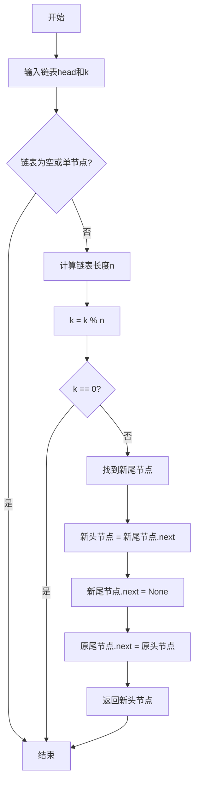

# 61. 旋转链表

## 📋 题目信息
- **难度**：中等
- **标签**：链表、双指针、快慢指针
- **来源**：LeetCode

## 📖 题目描述

给你一个链表的头节点 `head` ，旋转链表，将链表每个节点向右移动 `k` 个位置。

### 示例

**示例 1：**


```
输入：head = [1,2,3,4,5], k = 2
输出：[4,5,1,2,3]
```

**示例 2：**


```
输入：head = [0,1,2], k = 4
输出：[2,0,1]
```

### 约束条件

- 链表中节点的数目在范围 `[0, 500]` 内
- `-100 <= Node.val <= 100`
- `0 <= k <= 2 * 10^9`

---

## 🤔 题目分析

### 问题理解

用自己的话重新描述这个问题：

我们需要将链表向右旋转k个位置。所谓"向右旋转k个位置"，就是把链表末尾的k个节点移动到链表的开头。

**举例说明**：
- 原链表：1 → 2 → 3 → 4 → 5
- 向右旋转2个位置：把末尾的2个节点(4,5)移到开头
- 结果：4 → 5 → 1 → 2 → 3

**关键点：**
- **旋转操作**：实际上是将链表的后k个节点移到前面
- **k可能很大**：k可能大于链表长度，需要取模优化
- **链表操作**：需要找到新的头节点和尾节点
- **边界情况**：空链表、单节点、k=0、k是链表长度的倍数

### 关键观察

从题目中我们可以观察到以下几点：

1. **旋转的本质**：向右旋转k个位置 = 将后k个节点移到前面
2. **周期性**：旋转n次（n是链表长度）后回到原状态，所以实际旋转次数是 k % n
3. **断开与连接**：需要在合适的位置断开链表，然后重新连接
4. **新的头尾**：
   - 新的头节点：原链表倒数第k个节点
   - 新的尾节点：原链表倒数第k+1个节点

### 问题分解

这个问题可以分解为以下子问题：

1. **如何计算链表长度？** - 遍历一次链表
2. **如何处理k大于链表长度的情况？** - 使用 k = k % length
3. **如何找到新的头节点和尾节点？** - 找到倒数第k+1个节点
4. **如何重新连接链表？** - 断开旧连接，建立新连接

---

## 💡 解题思路

### 方法一：计算长度后找断点（推荐）

#### 🌟 形象化理解

> **💡 在进入专业算法分析之前，先通过一个生活化的例子来理解这个问题**

**场景类比**：

想象你在玩一个"火车车厢重组"的游戏。你有一列火车，车厢按顺序连接：1号-2号-3号-4号-5号。

现在要求你"向右旋转2个位置"，这意味着：
1. **找到分界点**：从后往前数2个车厢（4号和5号）
2. **断开连接**：在3号和4号之间断开
3. **重新连接**：
   - 把4号-5号这段移到最前面
   - 把原来的1号连接到5号后面
   - 结果：4号-5号-1号-2号-3号

**对应关系**：
- **火车车厢** = 链表节点
- **车厢连接** = 节点的next指针
- **断开连接** = 将某个节点的next设为None
- **重新连接** = 修改next指针
- **向右旋转k个位置** = 把后k节车厢移到前面

**核心理解**：
旋转链表就像重组火车车厢：找到分界点，断开，然后按新顺序重新连接。

**关键洞察**：
如果我们把链表首尾相连形成环，然后在正确的位置断开，就能得到旋转后的结果！

---

#### 思路说明

最直观且高效的方法：

1. 先计算链表长度n
2. 处理k：k = k % n（因为旋转n次等于没旋转）
3. 如果k=0，直接返回原链表
4. 找到新的尾节点（第n-k个节点）
5. 新的头节点是新尾节点的下一个
6. 断开新尾节点与新头节点的连接
7. 将原尾节点连接到原头节点

#### 算法步骤

1. **边界检查**：
   - 如果链表为空或只有一个节点，直接返回
   - 如果k=0，直接返回

2. **计算链表长度**：
   - 遍历链表，统计节点数n
   - 同时记录尾节点

3. **优化k值**：
   - k = k % n
   - 如果k=0，说明旋转后与原链表相同，直接返回

4. **找到新的尾节点**：
   - 新的尾节点是第 n-k 个节点
   - 从头节点开始，移动 n-k-1 步

5. **重新连接**：
   - 新头节点 = 新尾节点.next
   - 新尾节点.next = None（断开）
   - 原尾节点.next = 原头节点（形成环再断开）

#### 复杂度分析

- **时间复杂度**：O(n)
  - 计算长度：O(n)
  - 找到新尾节点：O(n)
  - 总体：O(n)

- **空间复杂度**：O(1)
  - 只使用了常数个指针变量

---

### 方法二：成环后断开（优化思路）

#### 🌟 形象化理解

**场景类比**：

还是火车车厢的例子，但这次我们用更巧妙的方法：

1. **首尾相连**：先把火车首尾连接，形成一个环形轨道
2. **找到断开点**：在环上找到正确的位置（第n-k个位置）
3. **断开成链**：在这个位置断开，就得到了旋转后的结果

**对应关系**：
- **形成环** = 将尾节点的next指向头节点
- **在环上移动** = 沿着next指针移动
- **断开环** = 将某个节点的next设为None

**核心理解**：
通过先成环再断开，可以简化指针操作，代码更简洁。

---

#### 思路说明

这是方法一的优化版本，思路更清晰：

1. 计算链表长度n，同时将尾节点连接到头节点形成环
2. 计算实际旋转次数：k = k % n
3. 找到新的尾节点位置：第 n-k 个节点
4. 在新尾节点处断开环

#### 算法步骤

1. **边界检查**：
   - 如果链表为空或只有一个节点，直接返回

2. **计算长度并成环**：
   - 遍历到尾节点，统计长度n
   - 将尾节点的next指向头节点，形成环

3. **计算断开位置**：
   - k = k % n
   - 如果k=0，在原尾节点处断开即可
   - 否则，需要移动到第 n-k 个节点

4. **断开环**：
   - 从头节点开始移动 n-k-1 步，到达新尾节点
   - 新头节点 = 新尾节点.next
   - 新尾节点.next = None

5. **返回新头节点**

#### 复杂度分析

- **时间复杂度**：O(n)
  - 计算长度并成环：O(n)
  - 找到断开位置：O(n)
  - 总体：O(n)

- **空间复杂度**：O(1)
  - 只使用了常数个指针变量

#### 💭 回顾类比

让我们回顾一下类比和算法的对应关系：

- **火车首尾相连** 对应 **代码中的 tail.next = head**
- **在环形轨道上移动** 对应 **沿着next指针遍历**
- **在正确位置断开** 对应 **new_tail.next = None**
- **断开后的起点** 对应 **新的头节点**

这就是为什么成环后断开的方法如此优雅！

---

### 方法三：快慢指针（另一种思路）

#### 🌟 形象化理解

**场景类比**：

想象两个人在环形跑道上跑步：
- **快跑者**：先跑k圈（k个位置）
- **慢跑者**：从起点开始
- 然后两人同时跑，当快跑者到达终点时，慢跑者正好在倒数第k个位置

**对应关系**：
- **快指针** = 先走k步的指针
- **慢指针** = 从头开始的指针
- **同时移动** = 两个指针同步前进
- **快指针到尾** = 慢指针到达新尾节点

**核心理解**：
通过快慢指针的间距，可以直接定位到新的尾节点位置。

---

#### 思路说明

使用快慢指针技巧：

1. 快指针先走k步
2. 然后快慢指针同时移动
3. 当快指针到达尾节点时，慢指针正好在新尾节点位置
4. 进行重新连接

#### 算法步骤

1. **计算链表长度**：
   - 遍历一次得到长度n
   - k = k % n

2. **快指针先行**：
   - 快指针从头节点开始走k步

3. **同时移动**：
   - 慢指针从头节点开始
   - 快慢指针同时移动，直到快指针到达尾节点

4. **重新连接**：
   - 此时慢指针在新尾节点位置
   - 进行断开和连接操作

#### 复杂度分析

- **时间复杂度**：O(n)
  - 计算长度：O(n)
  - 快指针移动：O(k)
  - 同时移动：O(n-k)
  - 总体：O(n)

- **空间复杂度**：O(1)
  - 只使用了常数个指针变量

---

## 🎨 图解说明

### 方法一：计算长度后找断点

**示例**：head = [1,2,3,4,5], k = 2

```
步骤1：原始链表
1 → 2 → 3 → 4 → 5 → None
↑                   ↑
head              tail

步骤2：计算长度
length = 5
k = 2 % 5 = 2

步骤3：找到新的尾节点（第n-k = 3个节点）
1 → 2 → 3 → 4 → 5 → None
        ↑   ↑
    new_tail new_head

步骤4：重新连接
- new_head = new_tail.next  (节点4)
- new_tail.next = None
- tail.next = head

结果：
4 → 5 → 1 → 2 → 3 → None
↑
new_head
```

### 方法二：成环后断开

**示例**：head = [1,2,3,4,5], k = 2

```
步骤1：原始链表
1 → 2 → 3 → 4 → 5 → None
↑                   ↑
head              tail

步骤2：形成环
    ┌─────────────────┐
    ↓                 │
1 → 2 → 3 → 4 → 5 ───┘
↑
head
length = 5

步骤3：计算断开位置
k = 2 % 5 = 2
需要移动到第 n-k = 3 个节点

步骤4：移动到新尾节点
    ┌─────────────────┐
    ↓                 │
1 → 2 → 3 → 4 → 5 ───┘
        ↑   ↑
    new_tail new_head

步骤5：断开环
4 → 5 → 1 → 2 → 3 → None
↑
new_head
```

### 特殊情况图解

**情况1：k = 0 或 k % n = 0**
```
输入：[1,2,3,4,5], k = 5
k % 5 = 0
输出：[1,2,3,4,5]  (不变)
```

**情况2：k > n**
```
输入：[1,2,3], k = 4
k % 3 = 1
相当于旋转1个位置
输出：[3,1,2]
```

**情况3：单节点或空链表**
```
输入：[1], k = 100
输出：[1]  (不变)

输入：[], k = 5
输出：[]  (空链表)
```

### 流程图



---

## ✏️ 代码框架填空

> **💡 学习提示**：在查看完整代码之前，先尝试根据上面的算法步骤，自己思考并填写下面的空白处。这将帮助你从"不知道怎么开始"过渡到"能够独立实现关键逻辑"。

### 链表节点定义

```python
class ListNode:
    def __init__(self, val=0, next=None):
        self.val = val
        self.next = next
```

### 方法一：计算长度后找断点（填空版）

```python
def rotateRight(head: ListNode, k: int) -> ListNode:
    """
    旋转链表，将每个节点向右移动k个位置
    
    参数:
        head: 链表头节点
        k: 旋转位置数
    
    返回:
        旋转后的链表头节点
    """
    # 🔹 填空1：边界检查
    # 提示：什么情况下不需要旋转？
    if not head or not head.next or k == 0:
        return ______
    
    # 🔹 填空2：计算链表长度
    # 提示：需要遍历链表，同时记录尾节点
    length = 1
    tail = head
    while ______:
        length += 1
        tail = ______
    
    # 🔹 填空3：优化k值
    # 提示：旋转n次等于没旋转，所以要取模
    k = ______
    
    # 🔹 填空4：如果k为0，直接返回
    if k == 0:
        return ______
    
    # 🔹 填空5：找到新的尾节点（第n-k个节点）
    # 提示：从head开始移动多少步？
    new_tail = head
    for i in range(______):
        new_tail = ______
    
    # 🔹 填空6：确定新的头节点
    # 提示：新头节点是新尾节点的下一个
    new_head = ______
    
    # 🔹 填空7：断开新尾节点与新头节点的连接
    new_tail.next = ______
    
    # 🔹 填空8：将原尾节点连接到原头节点
    tail.next = ______
    
    # 🔹 填空9：返回新的头节点
    return ______
```

### 方法二：成环后断开（填空版）

```python
def rotateRight(head: ListNode, k: int) -> ListNode:
    """
    通过成环再断开的方式旋转链表
    
    参数:
        head: 链表头节点
        k: 旋转位置数
    
    返回:
        旋转后的链表头节点
    """
    # 🔹 填空1：边界检查
    if not head or not head.next:
        return ______
    
    # 🔹 填空2：计算长度并找到尾节点
    length = 1
    tail = head
    while ______:
        length += 1
        tail = ______
    
    # 🔹 填空3：将尾节点连接到头节点，形成环
    tail.next = ______
    
    # 🔹 填空4：计算实际旋转次数
    k = ______
    
    # 🔹 填空5：找到新的尾节点位置
    # 提示：需要移动到第n-k个节点，从head开始移动n-k-1步
    steps = ______
    new_tail = head
    for i in range(steps):
        new_tail = ______
    
    # 🔹 填空6：新头节点是新尾节点的下一个
    new_head = ______
    
    # 🔹 填空7：断开环
    new_tail.next = ______
    
    # 🔹 填空8：返回新头节点
    return ______
```

### 填空提示详解

#### 方法一填空提示

**填空1 - 边界检查**
- 思考：什么情况下链表不需要旋转？
- 答案：空链表、单节点、k=0
- 返回值：head

**填空2 - 计算链表长度**
- 思考：如何遍历到链表末尾？
- 条件：tail.next（当tail.next不为None时继续）
- 移动：tail.next

**填空3 - 优化k值**
- 思考：如何处理k大于链表长度的情况？
- 答案：k % length

**填空4 - k为0的情况**
- 思考：k为0说明什么？
- 答案：不需要旋转，返回head

**填空5 - 找到新尾节点**
- 思考：新尾节点是第几个节点？需要移动几步？
- 答案：第n-k个节点，移动n-k-1步
- 移动：new_tail.next

**填空6 - 新头节点**
- 思考：新头节点在哪里？
- 答案：new_tail.next

**填空7 - 断开连接**
- 思考：如何断开链表？
- 答案：None

**填空8 - 连接原尾到原头**
- 思考：原尾节点应该指向哪里？
- 答案：head

**填空9 - 返回结果**
- 思考：返回什么？
- 答案：new_head

#### 方法二填空提示

**填空1 - 边界检查**
- 答案：head

**填空2 - 计算长度**
- 条件：tail.next
- 移动：tail.next

**填空3 - 形成环**
- 思考：尾节点应该指向哪里？
- 答案：head

**填空4 - 计算实际旋转次数**
- 答案：k % length

**填空5 - 计算移动步数**
- 思考：要移动到第n-k个节点，需要移动几步？
- 答案：length - k - 1
- 移动：new_tail.next

**填空6 - 新头节点**
- 答案：new_tail.next

**填空7 - 断开环**
- 答案：None

**填空8 - 返回结果**
- 答案：new_head

---

## 💻 完整代码实现

> **✅ 对照检查**：现在对比你的填空答案和下面的完整实现，看看思路是否一致。

### 链表节点定义

```python
class ListNode:
    def __init__(self, val=0, next=None):
        self.val = val
        self.next = next
```

### 方法一：计算长度后找断点（Python实现）

```python
def rotateRight(head: ListNode, k: int) -> ListNode:
    """
    旋转链表，将每个节点向右移动k个位置
    
    参数:
        head: 链表头节点
        k: 旋转位置数
    
    返回:
        旋转后的链表头节点
    
    时间复杂度：O(n)
    空间复杂度：O(1)
    """
    # 边界检查：空链表、单节点或k=0
    if not head or not head.next or k == 0:
        return head
    
    # 计算链表长度，同时找到尾节点
    length = 1
    tail = head
    while tail.next:
        length += 1
        tail = tail.next
    
    # 优化k值：旋转n次等于没旋转
    k = k % length
    
    # 如果k为0，说明不需要旋转
    if k == 0:
        return head
    
    # 找到新的尾节点（第n-k个节点）
    # 从head开始移动n-k-1步
    new_tail = head
    for i in range(length - k - 1):
        new_tail = new_tail.next
    
    # 新的头节点是新尾节点的下一个
    new_head = new_tail.next
    
    # 断开新尾节点与新头节点的连接
    new_tail.next = None
    
    # 将原尾节点连接到原头节点，形成完整链表
    tail.next = head
    
    # 返回新的头节点
    return new_head


# 辅助函数：创建链表
def create_linked_list(arr):
    """从数组创建链表"""
    if not arr:
        return None
    head = ListNode(arr[0])
    current = head
    for val in arr[1:]:
        current.next = ListNode(val)
        current = current.next
    return head


# 辅助函数：链表转数组
def linked_list_to_array(head):
    """将链表转换为数组，便于查看"""
    result = []
    current = head
    while current:
        result.append(current.val)
        current = current.next
    return result


# 测试用例
if __name__ == "__main__":
    # 测试用例1
    head1 = create_linked_list([1, 2, 3, 4, 5])
    k1 = 2
    result1 = rotateRight(head1, k1)
    print(f"测试1: {linked_list_to_array(result1)}")
    print(f"期望: [4, 5, 1, 2, 3]")
    print()
    
    # 测试用例2
    head2 = create_linked_list([0, 1, 2])
    k2 = 4
    result2 = rotateRight(head2, k2)
    print(f"测试2: {linked_list_to_array(result2)}")
    print(f"期望: [2, 0, 1]")
    print()
    
    # 测试用例3：k等于链表长度
    head3 = create_linked_list([1, 2, 3])
    k3 = 3
    result3 = rotateRight(head3, k3)
    print(f"测试3: {linked_list_to_array(result3)}")
    print(f"期望: [1, 2, 3]")
```

**代码说明**：
- 第16-17行：边界检查，处理特殊情况
- 第20-24行：遍历链表计算长度，同时记录尾节点
- 第27行：优化k值，避免不必要的旋转
- 第30-31行：如果k为0，直接返回原链表
- 第34-36行：找到新的尾节点位置
- 第39行：确定新的头节点
- 第42行：断开新尾节点的next指针
- 第45行：将原尾节点连接到原头节点
- 第48行：返回新头节点

**填空答案解析**：
- **填空1**：`head` - 边界情况直接返回原链表
- **填空2**：`tail.next` 和 `tail.next` - 遍历到尾节点
- **填空3**：`k % length` - 优化k值
- **填空4**：`head` - k为0不需要旋转
- **填空5**：`length - k - 1` 和 `new_tail.next` - 移动到新尾节点
- **填空6**：`new_tail.next` - 新头节点
- **填空7**：`None` - 断开连接
- **填空8**：`head` - 连接原尾到原头
- **填空9**：`new_head` - 返回新头节点

---

### 方法二：成环后断开（Python实现）

```python
def rotateRight(head: ListNode, k: int) -> ListNode:
    """
    通过成环再断开的方式旋转链表
    
    参数:
        head: 链表头节点
        k: 旋转位置数
    
    返回:
        旋转后的链表头节点
    
    时间复杂度：O(n)
    空间复杂度：O(1)
    """
    # 边界检查
    if not head or not head.next:
        return head
    
    # 计算链表长度，同时找到尾节点
    length = 1
    tail = head
    while tail.next:
        length += 1
        tail = tail.next
    
    # 将尾节点连接到头节点，形成环
    tail.next = head
    
    # 计算实际旋转次数
    k = k % length
    
    # 找到新的尾节点位置
    # 需要移动到第n-k个节点，从head开始移动n-k-1步
    steps = length - k - 1
    new_tail = head
    for i in range(steps):
        new_tail = new_tail.next
    
    # 新的头节点是新尾节点的下一个
    new_head = new_tail.next
    
    # 断开环
    new_tail.next = None
    
    # 返回新的头节点
    return new_head


# 测试用例
if __name__ == "__main__":
    # 测试用例1
    head1 = create_linked_list([1, 2, 3, 4, 5])
    k1 = 2
    result1 = rotateRight(head1, k1)
    print(f"测试1: {linked_list_to_array(result1)}")
    print(f"期望: [4, 5, 1, 2, 3]")
    print()
    
    # 测试用例2
    head2 = create_linked_list([0, 1, 2])
    k2 = 4
    result2 = rotateRight(head2, k2)
    print(f"测试2: {linked_list_to_array(result2)}")
    print(f"期望: [2, 0, 1]")
```

**代码说明**：
- 第16-17行：边界检查
- 第20-24行：计算长度并找到尾节点
- 第27行：形成环，尾节点指向头节点
- 第30行：计算实际旋转次数
- 第33-36行：移动到新尾节点位置
- 第39行：确定新头节点
- 第42行：断开环
- 第45行：返回新头节点

**填空答案解析**：
- **填空1**：`head` - 边界情况返回原链表
- **填空2**：`tail.next` 和 `tail.next` - 遍历到尾节点
- **填空3**：`head` - 形成环
- **填空4**：`k % length` - 计算实际旋转次数
- **填空5**：`length - k - 1` 和 `new_tail.next` - 移动到新尾节点
- **填空6**：`new_tail.next` - 新头节点
- **填空7**：`None` - 断开环
- **填空8**：`new_head` - 返回新头节点

---

### C++实现

#### 链表节点定义

```cpp
struct ListNode {
    int val;
    ListNode *next;
    ListNode() : val(0), next(nullptr) {}
    ListNode(int x) : val(x), next(nullptr) {}
    ListNode(int x, ListNode *next) : val(x), next(next) {}
};
```

#### 方法一：计算长度后找断点

```cpp
class Solution {
public:
    ListNode* rotateRight(ListNode* head, int k) {
        // 边界检查
        if (!head || !head->next || k == 0) {
            return head;
        }
        
        // 计算链表长度，同时找到尾节点
        int length = 1;
        ListNode* tail = head;
        while (tail->next) {
            length++;
            tail = tail->next;
        }
        
        // 优化k值
        k = k % length;
        
        // 如果k为0，直接返回
        if (k == 0) {
            return head;
        }
        
        // 找到新的尾节点（第n-k个节点）
        ListNode* new_tail = head;
        for (int i = 0; i < length - k - 1; i++) {
            new_tail = new_tail->next;
        }
        
        // 新的头节点
        ListNode* new_head = new_tail->next;
        
        // 断开连接
        new_tail->next = nullptr;
        
        // 连接原尾到原头
        tail->next = head;
        
        return new_head;
    }
};
```

#### 方法二：成环后断开

```cpp
class Solution {
public:
    ListNode* rotateRight(ListNode* head, int k) {
        // 边界检查
        if (!head || !head->next) {
            return head;
        }
        
        // 计算长度并找到尾节点
        int length = 1;
        ListNode* tail = head;
        while (tail->next) {
            length++;
            tail = tail->next;
        }
        
        // 形成环
        tail->next = head;
        
        // 计算实际旋转次数
        k = k % length;
        
        // 找到新的尾节点
        int steps = length - k - 1;
        ListNode* new_tail = head;
        for (int i = 0; i < steps; i++) {
            new_tail = new_tail->next;
        }
        
        // 新的头节点
        ListNode* new_head = new_tail->next;
        
        // 断开环
        new_tail->next = nullptr;
        
        return new_head;
    }
};
```

**与Python的主要差异**：
- **指针语法**：C++使用`->`访问指针成员，Python使用`.`
- **空指针**：C++使用`nullptr`，Python使用`None`
- **类型声明**：C++需要显式声明类型
- **内存管理**：C++需要注意指针的生命周期

---

## ⚠️ 易错点提醒

### 1. 边界条件

**易错点1：忘记处理k=0的情况**

```python
# ❌ 错误：没有检查k=0
def rotateRight_wrong(head, k):
    if not head:
        return head
    # 直接开始旋转，浪费时间
    
# ✅ 正确：先检查k=0
def rotateRight_correct(head, k):
    if not head or k == 0:
        return head
```

**易错点2：忘记处理k大于链表长度的情况**

```python
# ❌ 错误：k可能非常大，导致超时
def rotateRight_wrong(head, k):
    # 直接旋转k次
    for i in range(k):
        # 每次旋转一个位置
        pass

# ✅ 正确：先取模优化
def rotateRight_correct(head, k):
    # 计算长度
    length = get_length(head)
    k = k % length  # 优化k值
```

**易错点3：空链表或单节点链表**

```python
# ❌ 错误：没有检查空链表
def rotateRight_wrong(head, k):
    length = 1
    tail = head
    while tail.next:  # 如果head为None，这里会报错
        length += 1
        tail = tail.next

# ✅ 正确：先检查边界
def rotateRight_correct(head, k):
    if not head or not head.next:
        return head
    # 继续处理
```

### 2. 常见错误

**错误1：计算新尾节点位置错误**

```python
# ❌ 错误：移动步数计算错误
def rotateRight_wrong(head, k):
    # ...
    new_tail = head
    for i in range(length - k):  # 错误！多移动了一步
        new_tail = new_tail.next
    
# ✅ 正确：移动n-k-1步
def rotateRight_correct(head, k):
    # ...
    new_tail = head
    for i in range(length - k - 1):  # 正确
        new_tail = new_tail.next
```

**原因**：要到达第n-k个节点，从第1个节点（head）开始，需要移动n-k-1步。

**错误2：忘记断开连接**

```python
# ❌ 错误：没有断开新尾节点的next
def rotateRight_wrong(head, k):
    # ...
    new_head = new_tail.next
    tail.next = head
    return new_head  # 错误！形成了环

# ✅ 正确：必须断开
def rotateRight_correct(head, k):
    # ...
    new_head = new_tail.next
    new_tail.next = None  # 断开！
    tail.next = head
    return new_head
```

**错误3：指针操作顺序错误**

```python
# ❌ 错误：先断开再连接，丢失了原头节点的引用
def rotateRight_wrong(head, k):
    # ...
    new_tail.next = None  # 先断开
    tail.next = head  # 此时head可能已经无法访问

# ✅ 正确：先保存引用，再操作
def rotateRight_correct(head, k):
    # ...
    new_head = new_tail.next  # 先保存新头节点
    new_tail.next = None  # 再断开
    tail.next = head  # 最后连接
    return new_head
```

**填空时注意**：
- 在填空练习中，最容易出错的是填空5（计算移动步数）
- 一定要理解为什么是`length - k - 1`而不是`length - k`
- 指针操作的顺序很重要，先保存再修改

### 3. 调试技巧

**技巧1：打印链表状态**

```python
def print_list(head, name="List"):
    """打印链表，便于调试"""
    result = []
    current = head
    count = 0
    while current and count < 20:  # 防止环导致无限循环
        result.append(current.val)
        current = current.next
        count += 1
    print(f"{name}: {result}")

def rotateRight_debug(head, k):
    print_list(head, "原始链表")
    
    # ... 算法实现 ...
    
    print_list(new_head, "旋转后链表")
    return new_head
```

**技巧2：检查是否形成环**

```python
def has_cycle(head):
    """检查链表是否有环"""
    slow = fast = head
    while fast and fast.next:
        slow = slow.next
        fast = fast.next.next
        if slow == fast:
            return True
    return False

# 在返回前检查
result = rotateRight(head, k)
assert not has_cycle(result), "错误：链表形成了环！"
```

**技巧3：边界测试用例**

```python
# 测试各种边界情况
test_cases = [
    ([], 5, []),  # 空链表
    ([1], 100, [1]),  # 单节点
    ([1, 2], 0, [1, 2]),  # k=0
    ([1, 2, 3], 3, [1, 2, 3]),  # k等于长度
    ([1, 2, 3], 6, [1, 2, 3]),  # k是长度的倍数
    ([1, 2, 3, 4, 5], 2, [4, 5, 1, 2, 3]),  # 正常情况
    ([1, 2, 3], 4, [3, 1, 2]),  # k大于长度
]

for input_list, k, expected in test_cases:
    head = create_linked_list(input_list)
    result = rotateRight(head, k)
    result_list = linked_list_to_array(result)
    assert result_list == expected, f"Failed: input={input_list}, k={k}, expected={expected}, got={result_list}"
    print(f"✓ Passed: {input_list} rotate {k} -> {result_list}")
```

**填空验证技巧**：
- 填完空后，先用简单测试用例验证（如[1,2,3], k=1）
- 再用k=0的情况测试
- 最后用k大于链表长度的情况测试
- 确保没有形成环

### 4. 性能优化提示

**优化1：提前返回**

```python
# 在计算k % length后，如果k=0立即返回
k = k % length
if k == 0:
    return head  # 不需要任何操作
```

**优化2：一次遍历**

```python
# 在计算长度的同时记录尾节点，避免二次遍历
length = 1
tail = head
while tail.next:
    length += 1
    tail = tail.next
# 现在tail就是尾节点，不需要再次遍历
```

---

## 🔗 相似题目推荐

### 同类型题目

这些题目使用相同或相似的链表操作技巧：

1. **LeetCode 189 - 轮转数组** (Medium)
   - 相似点：同样是旋转操作，但操作对象是数组
   - 区别：数组可以直接访问任意位置，链表只能顺序访问
   - 建议：对比数组和链表的旋转方法，理解数据结构的差异

2. **LeetCode 206 - 反转链表** (Easy)
   - 相似点：都涉及链表指针的重新连接
   - 区别：反转是完全颠倒顺序，旋转是部分移动
   - 建议：基础题，先掌握这道题再做旋转链表

3. **LeetCode 24 - 两两交换链表中的节点** (Medium)
   - 相似点：都需要修改链表的连接关系
   - 区别：交换是局部操作，旋转是整体操作
   - 建议：练习链表指针操作的好题

### 进阶题目

掌握本题后，可以挑战这些更难的题目：

1. **LeetCode 25 - K个一组翻转链表** (Hard)
   - 进阶点：需要分组处理链表
   - 关联：涉及链表的分段和重连

2. **LeetCode 143 - 重排链表** (Medium)
   - 进阶点：需要找到中点、反转、合并
   - 关联：综合运用多种链表操作

3. **LeetCode 92 - 反转链表 II** (Medium)
   - 进阶点：反转链表的指定区间
   - 关联：局部反转，需要精确控制指针

### 相关知识点

本题涉及的核心知识点：

- **链表基础操作**：
  - 遍历链表
  - 计算链表长度
  - 相关题目：LeetCode 203、LeetCode 237

- **链表指针操作**：
  - 断开连接
  - 重新连接
  - 形成环和断开环
  - 相关题目：LeetCode 206、LeetCode 141、LeetCode 142

- **取模优化**：
  - 处理大数问题
  - 周期性问题
  - 相关题目：LeetCode 189

---

## 📚 知识点总结

### 核心算法

本题主要使用了以下算法技巧：

1. **链表遍历**
   - 计算链表长度
   - 找到特定位置的节点
   - 时间复杂度：O(n)

2. **指针操作**
   - 断开连接：`node.next = None`
   - 重新连接：`node1.next = node2`
   - 形成环：`tail.next = head`

3. **取模优化**
   - 处理k大于链表长度的情况
   - 利用旋转的周期性
   - 避免不必要的操作

### 数据结构

本题涉及的数据结构：

1. **单向链表（Singly Linked List）**
   - 每个节点包含值和next指针
   - 只能单向遍历
   - 插入和删除操作O(1)（已知位置）

2. **环形链表（Circular Linked List）**
   - 尾节点指向头节点
   - 可以从任意节点遍历整个链表
   - 本题中临时形成环，然后断开

### 解题模板

#### 模板1：计算长度并找特定位置节点

```python
def find_node_at_position(head, pos):
    """找到第pos个节点（从1开始计数）"""
    # 计算长度
    length = 0
    current = head
    while current:
        length += 1
        current = current.next
    
    # 找到第pos个节点
    current = head
    for i in range(pos - 1):
        current = current.next
    
    return current
```

**适用场景**：需要找到链表中特定位置的节点

#### 模板2：成环后断开

```python
def rotate_by_ring(head, k):
    """通过成环再断开的方式旋转"""
    # 计算长度并形成环
    length = 1
    tail = head
    while tail.next:
        length += 1
        tail = tail.next
    tail.next = head
    
    # 找到断开位置
    k = k % length
    steps = length - k - 1
    new_tail = head
    for i in range(steps):
        new_tail = new_tail
```

## 📝 补充说明

### 从填空到完整实现的进阶路径

1. **第一遍**：看算法步骤，尝试填空（不看提示）
2. **第二遍**：看提示，继续填写未完成的部分
3. **第三遍**：对照答案，理解每个填空的原因
4. **第四遍**：关闭答案，重新填写一遍
5. **第五遍**：不看任何提示，独立完整实现
6. **第六遍**：尝试优化，考虑其他解法

### 时间复杂度分析

所有方法的时间复杂度都是O(n)，但具体操作略有不同：

- **方法一（计算长度后找断点）**：
  - 计算长度：O(n)
  - 找到新尾节点：O(n)
  - 总体：O(n)，但需要遍历两次

- **方法二（成环后断开）**：
  - 计算长度并成环：O(n)
  - 找到断开位置：O(n)
  - 总体：O(n)，代码更简洁

- **方法三（快慢指针）**：
  - 计算长度：O(n)
  - 快指针先行：O(k)
  - 同时移动：O(n-k)
  - 总体：O(n)

### 空间复杂度

所有方法的空间复杂度都是O(1)：
- 只使用了常数个指针变量
- 没有使用额外的数据结构
- 原地修改链表结构

### 实际应用场景

这个算法在实际中的应用：

1. **循环缓冲区**：
   - 数据流处理
   - 环形队列实现

2. **任务调度**：
   - 轮询调度算法
   - 循环分配资源

3. **数据结构设计**：
   - 循环链表的应用
   - 环形数据结构

4. **面试常考**：
   - 考察链表操作能力
   - 考察指针操作技巧
   - 考察边界条件处理

### 扩展思考

1. **如果要向左旋转怎么办？**
   - 向左旋转k个位置 = 向右旋转(n-k)个位置
   - 只需修改k的计算方式

2. **如果是双向链表怎么办？**
   - 可以从尾部开始遍历
   - 需要同时维护prev和next指针

3. **如果要旋转多次怎么办？**
   - 累加所有旋转次数，最后一次性旋转
   - k_total = (k1 + k2 + ... + kn) % length

### 两种方法对比总结

| 方法 | 时间复杂度 | 空间复杂度 | 代码难度 | 推荐场景 |
|------|-----------|-----------|---------|---------|
| 方法一：找断点 | O(n) | O(1) | 中等 | 思路清晰，易于理解 |
| 方法二：成环断开 | O(n) | O(1) | 简单 | 代码简洁，推荐使用 |
| 方法三：快慢指针 | O(n) | O(1) | 中等 | 展示双指针技巧 |

### 面试建议

1. **首选方法二（成环后断开）**：
   - 代码最简洁
   - 思路清晰
   - 不容易出错

2. **可以提及方法一**：
   - 说明你理解旋转的本质
   - 展示多种思路

3. **注意边界条件**：
   - 面试时一定要先问清楚边界情况
   - 主动提出k可能很大的优化

4. **填空练习的面试价值**：
   - 帮助你快速回忆算法框架
   - 在白板编程时不会遗漏关键步骤
   - 提高代码一次性正确率

### 常见面试追问

**Q1：如果k非常大怎么办？**
A：使用取模优化，k = k % length，利用旋转的周期性。

**Q2：能否不计算链表长度？**
A：不能。必须知道链表长度才能计算实际旋转次数。

**Q3：时间复杂度能否优化到O(1)？**
A：不能。至少需要O(n)时间计算链表长度。

**Q4：如果链表很长，如何优化？**
A：
- 如果k很小，可以直接移动k次，不计算长度
- 如果需要多次旋转，可以缓存链表长度

**Q5：这道题和数组旋转有什么区别？**
A：
- 数组可以直接访问任意位置，链表只能顺序访问
- 数组旋转可以用三次反转，链表用成环断开
- 数组可以原地操作，链表需要修改指针

### 调试经验总结

1. **画图是关键**：
   - 在纸上画出链表结构
   - 标注每个指针的位置
   - 模拟指针移动过程

2. **检查指针顺序**：
   - 先保存需要的引用
   - 再修改指针
   - 避免丢失节点

3. **验证边界情况**：
   - 空链表
   - 单节点
   - k=0
   - k等于或大于链表长度

4. **检查是否形成环**：
   - 返回前验证链表没有环
   - 使用快慢指针检测环

---

**总结**：

本题是链表操作的经典问题，通过三种不同的方法，我们学习了：

**核心收获**：
1. 掌握了链表长度计算和节点定位
2. 学会了链表指针的断开和重连
3. 理解了成环后断开的巧妙思想
4. 掌握了取模优化处理大数的技巧
5. 通过填空练习，建立了从理解到实现的桥梁

**关键技巧**：
- 旋转k个位置 = 将后k个节点移到前面
- 使用k % length优化
- 成环后断开是最简洁的方法
- 注意指针操作的顺序

**下一步学习**：
- 练习相似题目巩固知识点
- 尝试不看答案独立实现
- 思考如何将这些技巧应用到其他链表问题
