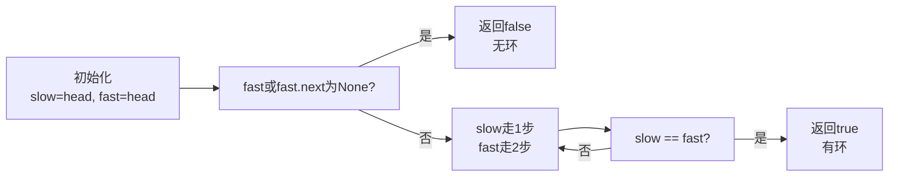

# 141 环形链表

## 📋 题目信息

- **难度**：Easy
- **标签**：链表、快慢指针、Floyd判圈算法
- **来源**：LeetCode
- **进阶**：O(1)空间复杂度

---

## 📖 题目描述

给你一个链表的头节点 `head`，判断链表中是否有环。

如果链表中有某个节点，可以通过连续跟踪 `next` 指针再次到达，则链表中存在环。为了表示给定链表中的环，评测系统内部使用整数 `pos` 来表示链表尾连接到链表中的位置（索引从 0 开始）。**注意：`pos` 不作为参数进行传递**。仅仅是为了标识链表的实际情况。

_如果链表中存在环_，则返回 `true`。否则，返回 `false`。

### 示例

**示例 1：**
```
输入：head = [3,2,0,-4], pos = 1
输出：true
解释：链表中有一个环，其尾部连接到第二个节点。
```

**示例 2：**
```
输入：head = [1,2], pos = 0
输出：true
解释：链表中有一个环，其尾部连接到第一个节点。
```

**示例 3：**
```
输入：head = [1], pos = -1
输出：false
解释：链表中没有环。
```

### 约束条件

- 链表中节点的数目范围是 `[0, 10^4]`
- `-10^5 <= Node.val <= 10^5`
- `pos` 为 `-1` 或者链表中的一个**有效索引**

---

## 🤔 题目分析

### 问题理解

这道题要求我们判断一个链表中是否存在环。环的定义是：通过不断跟踪 `next` 指针，最终会回到某个已经访问过的节点。

关键点：
- 链表可能为空或只有一个节点
- 环可能在链表的任何位置
- 我们需要在不修改链表结构的情况下检测环
- 进阶要求：用O(1)空间复杂度解决

### 关键观察

1. **无环链表的特征**：最终会到达 `None`（null）
2. **有环链表的特征**：永远无法到达 `None`，会陷入循环
3. **快慢指针的妙用**：如果有环，快指针最终一定会追上慢指针

---

## 💡 解题思路

### 方法一：暴力解法（哈希表）

#### 🌟 形象化理解

想象你在一个公园里散步，每经过一个地点就在笔记本上记录下来。如果你再次到达一个已经记录过的地点，说明你在绕圈子。

**场景类比**：
- 你的位置 = 链表节点
- 笔记本 = 哈希表
- 记录位置 = 将节点加入哈希表
- 再次到达 = 在哈希表中找到该节点

**核心理解**：通过记录访问过的节点，如果再次访问同一个节点就说明有环。

---

#### 思路说明

最直观的方法是使用哈希表记录所有访问过的节点。遍历链表，每次访问一个节点时：
1. 检查该节点是否已在哈希表中
2. 如果在，说明有环，返回 `true`
3. 如果不在，将其加入哈希表
4. 继续访问下一个节点
5. 如果到达 `None`，说明无环，返回 `false`

#### 算法步骤

1. 创建一个空的哈希集合
2. 从头节点开始遍历
3. 对于每个节点：
   - 如果节点在集合中，返回 `true`（有环）
   - 否则将节点加入集合
   - 移动到下一个节点
4. 如果遍历完成（到达 `None`），返回 `false`（无环）

#### 复杂度分析

- **时间复杂度**：O(n) - 最坏情况下需要遍历所有节点
- **空间复杂度**：O(n) - 哈希表最多存储所有节点

#### 为什么需要优化

虽然哈希表方法正确且简单，但它需要 O(n) 的额外空间来存储所有节点。题目的进阶要求是用 O(1) 空间复杂度解决，这意味着我们不能使用额外的数据结构。

---

### 方法二：优化解法（快慢指针 - Floyd判圈算法）

#### 🌟 形象化理解

> **💡 这是本题最精妙的部分，通过一个生活化的例子来理解为什么快慢指针一定能检测到环**

**场景类比**：

想象一个圆形跑道，两个人在跑步：
- 慢速跑者每秒跑1圈的1/10
- 快速跑者每秒跑1圈的1/5

如果跑道是圆形（有环），快速跑者最终一定会从后面追上慢速跑者。为什么？因为快速跑者每秒比慢速跑者多跑1圈的1/10，这个差距会不断累积，最终快速跑者会多跑一整圈，从而追上慢速跑者。

如果跑道是直线（无环），快速跑者会先到达终点，而慢速跑者永远追不上。

**对应关系**：
- **慢指针** = 每次走1步的跑者
- **快指针** = 每次走2步的跑者
- **环** = 圆形跑道
- **相遇** = 快指针追上慢指针
- **无环** = 快指针到达终点（None）

**核心理解**：在有限的环中，速度不同的两个对象最终一定会相遇；在无限的直线上，快的永远追不上慢的。

**从类比到算法**：

现在让我们把这个生活化的思想转化为具体的算法。在链表中：
- 如果有环，快指针和慢指针会在环内相遇
- 如果无环，快指针会先到达 `None`

---

#### 优化思路推导

**思考过程**：

1. 暴力解法的瓶颈在于需要额外空间存储所有节点
2. 我们能否不使用额外空间，仅通过指针的移动来检测环？
3. 关键观察：如果有环，两个以不同速度移动的指针最终会相遇
4. 引入快慢指针技巧：慢指针每次走1步，快指针每次走2步
5. 最终得到O(1)空间的优化方案

**数学证明**：

假设链表中有环，环的长度为 L。设慢指针进入环时，快指针已经在环内某个位置。

- 慢指针速度：v
- 快指针速度：2v
- 相对速度：v

快指针每次循环比慢指针多走一步。由于环的长度是有限的 L，快指针最终会追上慢指针。具体地，快指针需要多走 L 步才能追上慢指针，这需要 L/v 的时间。

#### 算法步骤

1. 初始化两个指针：`slow` 和 `fast`，都指向头节点
2. 进入循环，条件是 `fast` 和 `fast.next` 都不为 `None`
3. 每次迭代：
   - 慢指针走一步：`slow = slow.next`
   - 快指针走两步：`fast = fast.next.next`
   - 检查是否相遇：`if slow == fast`，返回 `true`
4. 如果循环结束（快指针到达 `None`），返回 `false`

#### 复杂度分析

- **时间复杂度**：O(n) - 在最坏情况下，快指针需要遍历整个链表。但由于快指针速度是慢指针的两倍，实际操作次数约为 n/2 + n/4 + ... = n
- **空间复杂度**：O(1) - 只使用了两个指针，不需要额外的数据结构

#### 💭 回顾类比

- 生活中的"圆形跑道"对应代码中的"环形链表"
- 生活中的"快速跑者追上慢速跑者"对应代码中的"快指针追上慢指针"
- 生活中的"直线跑道"对应代码中的"无环链表"
- 这就是为什么快慢指针能够在O(1)空间内检测环的原因

---

## 🎨 图解说明

### 执行过程示例

**示例输入**：`head = [3,2,0,-4], pos = 1`（环在第二个节点）

**执行步骤**：

```
初始状态：
3 → 2 → 0 → -4
↑       ↑
slow   fast

步骤1：slow走1步，fast走2步
3 → 2 → 0 → -4
    ↑   ↑
   slow fast

步骤2：slow走1步，fast走2步
3 → 2 → 0 → -4
        ↑   ↑
       slow fast

步骤3：slow走1步，fast走2步（fast绕过环回到2）
3 → 2 → 0 → -4
    ↑↑
   slow/fast 相遇！返回 true
```

### 可视化图表



---

## ✏️ 代码框架填空

> **💡 学习提示**：在查看完整代码之前，先尝试根据上面的算法步骤，自己思考并填写下面的空白处。这将帮助你从"不知道怎么开始"过渡到"能够独立实现关键逻辑"。

### Python填空版

```python
class ListNode:
    def __init__(self, x):
        self.val = x
        self.next = None

def hasCycle(head):
    """
    判断链表中是否有环
    
    参数:
        head: 链表的头节点
    
    返回:
        bool: 如果有环返回True，否则返回False
    """
    # 🔹 填空1：初始化两个指针
    # 提示：两个指针都应该从哪里开始？
    slow = ______
    fast = ______
    
    # 🔹 填空2：循环条件
    # 提示：什么时候应该停止循环？快指针到达什么位置时说明无环？
    while ______:
        
        # 🔹 填空3：慢指针移动
        # 提示：慢指针每次应该走几步？
        slow = ______
        
        # 🔹 填空4：快指针移动
        # 提示：快指针每次应该走几步？
        fast = ______
        
        # 🔹 填空5：检查是否相遇
        # 提示：什么时候说明找到了环？
        if ______:
            return True
    
    # 🔹 填空6：返回结果
    # 提示：如果循环结束还没有相遇，说明什么？
    return ______
```

### 填空提示详解

**填空1 - 指针初始化**
- 思考：两个指针应该从链表的哪个位置开始？
- 常见选择：都从头节点开始
- 参考算法步骤的第1步

**填空2 - 循环条件**
- 思考：什么时候应该停止循环？
- 关键：快指针到达None时说明无环
- 需要检查：`fast` 和 `fast.next` 是否都不为None

**填空3 - 慢指针移动**
- 思考：慢指针的速度是多少？
- 答案：每次走1步，即 `slow.next`

**填空4 - 快指针移动**
- 思考：快指针的速度是多少？
- 答案：每次走2步，即 `fast.next.next`

**填空5 - 相遇检查**
- 思考：什么时候说明两个指针相遇了？
- 答案：`slow == fast`

**填空6 - 返回结果**
- 思考：如果循环正常结束（快指针到达None），说明什么？
- 答案：链表中没有环，返回 `False`

---

## 💻 完整代码实现

> **✅ 对照检查**：现在对比你的填空答案和下面的完整实现，看看思路是否一致。

### Python实现

```python
class ListNode:
    def __init__(self, x):
        self.val = x
        self.next = None

def hasCycle(head):
    """
    判断链表中是否有环 - Floyd判圈算法
    
    参数:
        head: 链表的头节点
    
    返回:
        bool: 如果有环返回True，否则返回False
    """
    # 边界情况：空链表或单节点链表无环
    if not head or not head.next:
        return False
    
    # 初始化两个指针，都从头节点开始
    slow = head
    fast = head
    
    # 快指针每次走2步，慢指针每次走1步
    # 如果有环，快指针最终会追上慢指针
    while fast and fast.next:
        slow = slow.next           # 慢指针走1步
        fast = fast.next.next      # 快指针走2步
        
        # 如果两个指针相遇，说明有环
        if slow == fast:
            return True
    
    # 如果快指针到达None，说明无环
    return False


# 测试用例
if __name__ == "__main__":
    # 测试用例1：有环 [3,2,0,-4], pos=1
    node1 = ListNode(3)
    node2 = ListNode(2)
    node3 = ListNode(0)
    node4 = ListNode(-4)
    node1.next = node2
    node2.next = node3
    node3.next = node4
    node4.next = node2  # 环在第二个节点
    
    result1 = hasCycle(node1)
    print(f"测试1 (有环): {result1}")  # 应输出 True
    
    # 测试用例2：有环 [1,2], pos=0
    node5 = ListNode(1)
    node6 = ListNode(2)
    node5.next = node6
    node6.next = node5  # 环在第一个节点
    
    result2 = hasCycle(node5)
    print(f"测试2 (有环): {result2}")  # 应输出 True
    
    # 测试用例3：无环 [1]
    node7 = ListNode(1)
    
    result3 = hasCycle(node7)
    print(f"测试3 (无环): {result3}")  # 应输出 False
    
    # 测试用例4：空链表
    result4 = hasCycle(None)
    print(f"测试4 (空链表): {result4}")  # 应输出 False
```

**代码说明**：
- 第8-9行：边界情况处理，空链表或单节点链表不可能有环
- 第12-13行：初始化两个指针
- 第16-19行：核心循环，快指针走2步，慢指针走1步
- 第21-22行：检查是否相遇
- 第25行：如果快指针到达None，返回False

**填空答案解析**：
- **填空1**：`slow = head` 和 `fast = head` - 两个指针都从头节点开始
- **填空2**：`fast and fast.next` - 检查快指针是否能继续走2步
- **填空3**：`slow.next` - 慢指针每次走1步
- **填空4**：`fast.next.next` - 快指针每次走2步
- **填空5**：`slow == fast` - 检查两个指针是否指向同一个节点
- **填空6**：`False` - 无环

---

### C++实现

```cpp
#include <iostream>
using namespace std;

struct ListNode {
    int val;
    ListNode *next;
    ListNode(int x) : val(x), next(NULL) {}
};

class Solution {
public:
    bool hasCycle(ListNode *head) {
        // 边界情况处理
        if (!head || !head->next) {
            return false;
        }
        
        // 初始化两个指针
        ListNode *slow = head;
        ListNode *fast = head;
        
        // Floyd判圈算法
        while (fast && fast->next) {
            slow = slow->next;           // 慢指针走1步
            fast = fast->next->next;     // 快指针走2步
            
            // 如果相遇，说明有环
            if (slow == fast) {
                return true;
            }
        }
        
        // 快指针到达末尾，无环
        return false;
    }
};

// 测试代码
int main() {
    Solution sol;
    
    // 测试用例1：有环
    ListNode *node1 = new ListNode(3);
    ListNode *node2 = new ListNode(2);
    ListNode *node3 = new ListNode(0);
    ListNode *node4 = new ListNode(-4);
    node1->next = node2;
    node2->next = node3;
    node3->next = node4;
    node4->next = node2;  // 环在第二个节点
    
    cout << "测试1 (有环): " << (sol.hasCycle(node1) ? "true" : "false") << endl;
    
    return 0;
}
```

**与Python的主要差异**：
- 使用指针而不是引用
- 需要显式的类型声明
- 使用 `NULL` 而不是 `None`
- 使用 `->` 访问指针成员而不是 `.`

**填空答案解析**：
- **填空1**：`ListNode *slow = head;` 和 `ListNode *fast = head;` - C++需要类型声明
- **填空2**：`fast && fast->next` - 检查指针有效性
- **填空3**：`slow = slow->next;` - 指针移动
- **填空4**：`fast = fast->next->next;` - 快指针走2步
- **填空5**：`slow == fast` - 指针比较
- **填空6**：`false` - 返回布尔值

---
## ⚠️ 易错点提醒

### 1. 边界条件

**易错点**：忘记检查空链表或单节点链表

```python
# ❌ 错误：直接开始循环，可能导致空指针异常
slow = head
fast = head
while fast and fast.next:  # 如果head为None，这里会出错
    ...

# ✅ 正确：先检查边界条件
if not head or not head.next:
    return False
slow = head
fast = head
while fast and fast.next:
    ...
```

**原因**：空链表或单节点链表不可能有环，需要提前返回

**正确处理**：在开始循环前检查 `head` 和 `head.next` 是否为 `None`

**填空时注意**：在初始化指针后，循环条件中要检查 `fast` 和 `fast.next` 都不为 `None`

---

### 2. 常见错误

**错误1**：快指针初始化时就走2步

```python
# ❌ 错误：快指针一开始就走2步，可能跳过环的入口
slow = head
fast = head.next.next  # 错误！可能导致空指针异常

# ✅ 正确：快指针和慢指针都从head开始
slow = head
fast = head
while fast and fast.next:
    slow = slow.next
    fast = fast.next.next
```

**原因**：如果链表只有1-2个节点，`head.next.next` 可能为 `None`，导致异常

**正确做法**：两个指针都从 `head` 开始，在循环中逐步移动

---

**错误2**：检查相遇条件放在错误的位置

```python
# ❌ 错误：在移动指针之前检查，可能漏掉相遇
while fast and fast.next:
    if slow == fast:  # 第一次迭代时不可能相遇
        return True
    slow = slow.next
    fast = fast.next.next

# ✅ 正确：在移动指针之后检查
while fast and fast.next:
    slow = slow.next
    fast = fast.next.next
    if slow == fast:  # 移动后再检查
        return True
```

**原因**：初始时两个指针都指向 `head`，所以第一次迭代时一定相遇，这不是有环的证明

**正确做法**：先移动指针，再检查是否相遇

---

**错误3**：快指针走的步数不对

```python
# ❌ 错误：快指针只走1步，和慢指针一样
fast = fast.next  # 应该是 fast.next.next

# ✅ 正确：快指针走2步
fast = fast.next.next
```

**原因**：快慢指针的核心是速度差异，如果速度相同就无法检测环

**正确做法**：确保快指针每次走2步，慢指针每次走1步

---

### 3. 调试技巧

- **技巧1**：使用打印语句追踪指针位置
  ```python
  while fast and fast.next:
      slow = slow.next
      fast = fast.next.next
      print(f"slow.val={slow.val}, fast.val={fast.val}")
      if slow == fast:
          return True
  ```

- **技巧2**：手动模拟小规模输入
  - 对于 `[1,2]` 且 `pos=0` 的情况，手动追踪每一步

- **技巧3**：验证边界情况
  - 空链表：`None`
  - 单节点：`[1]`
  - 两节点有环：`[1,2]` 且 `pos=0`

- **填空验证**：填完后，用上述三个测试用例验证代码是否正确

---

## 🔗 相似题目推荐

### 同类型题目

这些题目使用相同或相似的快慢指针算法：

1. **LeetCode 142 - 环形链表 II** (Medium)
   - 相似点：也是检测链表中的环，但要求找出环的入口节点
   - 建议：掌握本题后，可以进一步学习如何找到环的入口

2. **LeetCode 876 - 链表的中间结点** (Easy)
   - 相似点：使用快慢指针找到链表的中间位置
   - 建议：快慢指针的另一个经典应用，逻辑更简单

3. **LeetCode 19 - 删除链表的倒数第N个结点** (Medium)
   - 相似点：使用快慢指针维持固定距离
   - 建议：快慢指针的变体应用

4. **LeetCode 234 - 回文链表** (Easy)
   - 相似点：使用快慢指针找到中点，然后反转后半部分
   - 建议：综合应用快慢指针和链表反转

### 进阶题目

掌握本题后，可以挑战这些更难的题目：

1. **LeetCode 142 - 环形链表 II** (Medium)
   - 进阶点：不仅要检测环，还要找出环的入口节点
   - 难度提升：需要理解快慢指针相遇后的数学关系

2. **LeetCode 287 - 寻找重复数** (Medium)
   - 进阶点：将环检测问题转化为数组问题
   - 难度提升：需要理解问题的转化

### 相关知识点

本题涉及的核心知识点：

- **快慢指针技巧**：[LeetCode 876](https://leetcode.com/problems/middle-of-the-linked-list/)、[LeetCode 19](https://leetcode.com/problems/remove-nth-node-from-end-of-list/)
  - 相关题目：LeetCode 876、LeetCode 19、LeetCode 234

- **Floyd判圈算法**：[LeetCode 142](https://leetcode.com/problems/linked-list-cycle-ii/)、[LeetCode 287](https://leetcode.com/problems/find-the-duplicate-number/)
  - 相关题目：LeetCode 142、LeetCode 287

- **链表基础操作**：[LeetCode 206](https://leetcode.com/problems/reverse-linked-list/)、[LeetCode 21](https://leetcode.com/problems/merge-two-sorted-lists/)
  - 相关题目：LeetCode 206、LeetCode 21

---

## 📚 知识点总结

### 核心算法

**Floyd判圈算法（龟兔赛跑算法）**：
- 使用两个指针以不同速度遍历链表
- 如果有环，快指针最终会追上慢指针
- 时间复杂度O(n)，空间复杂度O(1)
- 这是检测环的最优解法

### 数据结构

**链表的特点**：
- 单向链表：只能从前往后遍历
- 环形链表：存在某个节点的next指向前面的节点
- 无法直接访问中间节点，必须从头开始遍历

### 解题模板

```python
# 快慢指针检测环的通用模板
def hasCycle(head):
    # 边界检查
    if not head or not head.next:
        return False
    
    # 初始化指针
    slow = head
    fast = head
    
    # 快慢指针遍历
    while fast and fast.next:
        slow = slow.next           # 慢指针走1步
        fast = fast.next.next      # 快指针走2步
        
        if slow == fast:           # 相遇判断
            return True
    
    return False
```

### 学习要点

1. **要点1**：理解为什么快慢指针一定会相遇
   - 关键：在有限的环中，速度不同的两个对象最终一定会相遇
   - 数学原理：相对速度会不断累积

2. **要点2**：掌握快慢指针的初始化和移动方式
   - 初始化：都从head开始
   - 移动：慢指针走1步，快指针走2步
   - 检查：在移动后检查是否相遇

3. **要点3**：理解O(1)空间复杂度的意义
   - 不使用额外的数据结构（如哈希表）
   - 只使用常数个指针变量
   - 这是链表问题中的重要优化思想

4. **要点4**：通过填空练习，你应该掌握了
   - 如何初始化两个指针
   - 如何在循环中移动指针
   - 如何判断是否有环
   - 如何处理边界情况

---

## 📝 补充说明

### 从填空到完整实现的进阶路径

1. **第一遍**：看算法步骤，尝试填空（不看提示）
2. **第二遍**：对照答案，理解每个填空的原因
3. **第三遍**：不看提示，独立完整实现
4. **第四遍**：优化代码，考虑边界情况和性能

### 时间复杂度优化历程

- **暴力解法**：O(n) 时间，O(n) 空间 → 瓶颈是额外空间
- **优化解法**：O(n) 时间，O(1) 空间 → 通过快慢指针消除空间需求

### 空间复杂度权衡

在这道题中，我们成功地将空间复杂度从O(n)降低到O(1)，这是通过以下方式实现的：
- 不使用哈希表存储节点
- 只使用两个指针变量
- 利用数学性质（快慢指针必相遇）

这种权衡展示了算法设计中的重要思想：有时候通过更巧妙的算法设计，可以在不增加时间复杂度的情况下大幅降低空间复杂度。

### 实际应用场景

**Floyd判圈算法的应用**：
1. **链表环检测**：本题的直接应用
2. **寻找重复数**：LeetCode 287，将数组问题转化为链表问题
3. **密码学**：某些伪随机数生成器的周期检测
4. **内存泄漏检测**：检测对象引用是否形成环

---

## 🎓 进阶思考

### 问题1：为什么快指针走2步而不是3步或更多？

**答**：理论上快指针走任何大于1的步数都可以检测环，但走2步是最优的：
- 走2步：相对速度为1，最快相遇
- 走3步：相对速度为2，相遇速度更快，但不必要
- 走2步是在简洁性和效率之间的最佳平衡

### 问题2：快慢指针相遇的位置有什么特点？

**答**：相遇位置取决于环的长度和入口位置。这是LeetCode 142的内容，涉及更深层的数学关系。

### 问题3：能否用其他方法检测环？

**答**：可以，但各有优缺点：
- **哈希表**：O(n)时间，O(n)空间，实现简单
- **快慢指针**：O(n)时间，O(1)空间，实现稍复杂但更优
- **修改链表**：O(n)时间，O(1)空间，但会破坏链表结构（不推荐）

---

**记住**：快慢指针是链表问题中的经典技巧，掌握这道题后，你就掌握了一个强大的工具！

