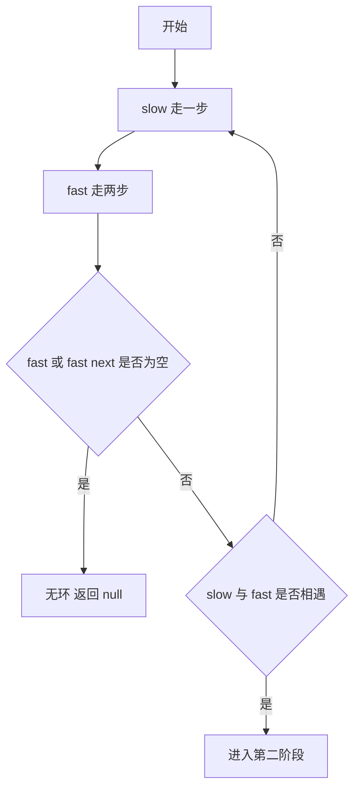
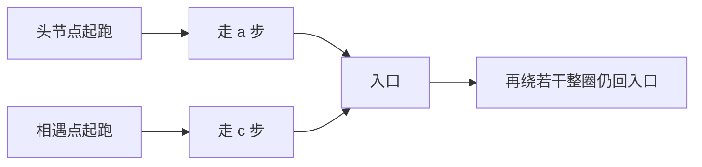

# 142. Linked List Cycle II - 思路分析

## 📋 题目信息

- **难度**：中等
- **标签**：链表、双指针、快慢指针、Floyd 判圈算法、数学推导
- **来源**：LeetCode
- **核心要求**：返回链表开始入环的第一个节点
- **进阶要求**：不允许修改链表，并尽量做到 `O(1)` 额外空间

这道题是链表双指针专题里非常有代表性的一题，因为它不是简单地问你链表里有没有环，而是在已经可能存在环的前提下，要求你进一步找出环的起点。很多同学在学习这题时，第一反应往往是先解决有无环的问题，然后再去思考入口在哪里，但真正难的部分恰恰就在第二步，也就是快慢指针第一次相遇之后，为什么再让一个指针从头节点出发，另一个指针从相遇点出发，并且两个指针都每次走一步，最终它们就会在环入口再次相遇。这个结论如果只靠记忆，很容易在做题时忘掉；如果真正把式子推清楚，把路径关系想明白，这题就会从“背模板”变成“真正理解”。

本题与 `141. Linked List Cycle` 有着非常紧密的联系。141 题只要求判断是否成环，属于判定问题，本题则进一步升级为定位问题。也正因为升级到了定位，题目的思维密度明显更高，它要求你不仅会写双指针，还要能解释双指针为什么有效。对于链表题来说，这类“先相遇，再重置，再同步走”的技巧属于非常重要的知识点，后面遇到链表相交、链表重排、复杂指针同步等题目时，你都会感受到这类思维方式的价值。

---

## 📖 题目描述

给定一个链表的头节点 `head`，判断链表中是否存在环。如果链表中存在某个节点，可以通过不断沿着 `next` 指针继续走，最终再次回到这个节点或它所在的某个闭环区域，那么这个链表就存在环。题目要求你返回这个环开始进入的第一个节点，也就是环的入口节点；如果链表中没有环，则返回 `null`。

这里的“入口节点”需要特别理解清楚。链表从头节点出发，一开始可能是一段正常的不重复路径，当某个节点的 `next` 指针指向前面已经出现过的节点时，从那个被重新连回去的节点开始，后面的访问就会进入无限循环。这个被重新连回去的节点，就是我们要找的环入口。题目不是让你返回第一次重复访问到的节点值，也不是让你返回快慢指针第一次相遇的节点，而是要返回“从非环部分第一次进入环的那个节点”。

题目通常会配合一个参数 `pos` 来描述测试数据的构造方式，其中 `pos` 表示链表尾节点连接到链表中的位置，`pos = -1` 表示无环。需要注意的是，`pos` 只是在线下构造测试样例时方便说明链表结构的辅助信息，它并不会作为函数参数直接传给你。在真正写代码时，你只能通过指针关系去判断和定位，不能借助额外的输入位置。

**示例 1：**

```text
输入：head = [3,2,0,-4], pos = 1
输出：返回索引为 1 的链表节点
解释：链表中有一个环，其尾部连接到第二个节点。
```

**示例 2：**

```text
输入：head = [1,2], pos = 0
输出：返回索引为 0 的链表节点
解释：链表中有一个环，其尾部连接到第一个节点。
```

**示例 3：**

```text
输入：head = [1], pos = -1
输出：返回 null
解释：链表中没有环。
```

### 约束条件

- 链表中节点的数目范围在 `[0, 10^4]` 内。
- `-10^5 <= Node.val <= 10^5`。
- `pos` 为 `-1` 或者链表中的一个有效索引。

题目还隐含了一个非常重要的工程约束，那就是尽量不要修改链表结构。你不能为了判断环而随意破坏 `next` 指针，也不能靠给节点打永久标记来改变原链表语义。真正优雅的解法应该只通过读指针关系完成判断和定位。在进阶要求里，通常还会问你能否用 `O(1)` 的额外空间解决问题，这也就是本题最经典的 Floyd 两阶段解法存在的意义。

---

## 🤔 题目分析

这道题表面上是在找一个特殊节点，实际上是在追踪一条路径的重复起点。链表一旦无环，从头往后走最终一定会走到 `null`，这是一个自然终止过程；链表一旦有环，从某个时刻开始，后面的访问就会在一个闭环里无限打转。也就是说，这道题的本质不是普通意义上的“查找某个值”，而是“找到路径第一次进入重复区域的位置”。这种描述很重要，因为它会直接决定你使用什么思维工具。

如果先从最朴素的角度思考，我们沿着链表一直往后走，每到一个节点就把它记下来。如果某一天我们走到了一个以前已经见过的节点，那么说明我们从这个节点开始进入了重复路径，它就是环入口。这种思路极其自然，几乎不需要额外推导，因为它完全遵循人的直觉：第一次走到老地方的那个节点，就是开始绕圈的位置。这个想法会自然导向哈希表解法。

不过题目的真正难点不在于写出一个能过的程序，而在于理解为什么可以不用哈希表，仅靠两个指针就找出入口。快慢指针用于判环，很多同学已经熟悉了：慢指针每次走一步，快指针每次走两步，如果链表有环，它们迟早会在环里相遇；如果链表无环，快指针会先走到 `null`。这个结论本身并不复杂，难的是相遇之后如何得到入口。相遇点未必是入口，甚至大多数时候都不是入口。那为什么从头结点再出发一个指针，并让它和从相遇点出发的另一个指针同步前进，最后它们偏偏会在入口相遇，这就需要把环前长度、环内路径和环长之间的数量关系真正推出来。

为了让这个过程更容易理解，我们先把链表结构抽象成两段。第一段是从头节点到环入口的直线部分，这段长度记作 `a`。第二段是从环入口开始的环形部分，环的总长度记作 `L`。当快慢指针第一次相遇时，慢指针在环内从入口又走了一段距离，这段距离记作 `b`。那么从相遇点继续沿环走回入口，还剩下的那段距离就记作 `c`，于是有 `b + c = L`。接下来一切关键推导，都是围绕这几个量展开的。

你会发现，这题实际上把三个能力揉在了一起。第一，链表结构的抽象能力，要把看似杂乱的指针路径压缩成几段可数的长度；第二，快慢指针的运动关系建模能力，要把“一个走一步，一个走两步”翻译成可列式的距离关系；第三，数学推导后的代码落地能力，要把抽象证明转换成简洁稳定的实现。很多同学代码会背，但一旦被问“为什么第二次相遇一定在入口”，就说不清楚，本质上就是第二和第三层之间没有打通。

还要注意一个常见误区，很多人会下意识以为快慢指针第一次相遇点就是入口，这是错的。只有在非常特殊的结构下，相遇点才恰好等于入口。大多数情况下，相遇点只是环上的某个普通节点。正因为第一次相遇点不一定是入口，所以才需要第二阶段重新安排两个指针的起点。如果你没有从路径关系去理解这个重置动作，只是把它当成模板记忆，那么一旦题目稍作变形，或者让你手写证明，你就很容易卡住。

从教学角度看，本题最值得抓住的不是结论，而是“为什么需要第二阶段”以及“第二阶段为什么有效”。第一阶段只负责回答一件事，有没有环；第二阶段才负责解决真正的目标，入口在哪。很多题解把重点都放在第一阶段，几行代码就带过第二阶段，导致初学者明明代码跑通了，脑子里却一直有一个结没有解开。学习这题时，必须反过来，把主要精力放到第二阶段的数学关系和几何直觉上，这样你才能真正建立扎实的双指针理解。

---

## 💡 解题思路

### 方法一：暴力解法 哈希表

先从最直观的办法说起。我们可以把自己想象成在一条陌生的公园小路上散步，如果这条路没有环，那么你会一直走到出口；如果这条路其实会绕回自己，那么你总有一天会走到一个已经来过的位置。为了防止自己忘记走过哪里，你每经过一个岔路口，就在地上做一个小标记。以后只要再走到这个已经有标记的地方，你立刻就知道，自己已经开始重复走之前的路了。这就是本题中非常形象的“公园散步做标记”类比。

把这个类比翻译成代码就是，准备一个哈希集合 `visited`，从 `head` 开始依次遍历链表。每访问到一个节点，先判断这个节点是否已经存在于集合中。如果已经存在，说明这个节点此前访问过，而链表是单向前进结构，第一次遇到重复节点时，这个节点就一定是环入口，因为从头节点出发一路向后走，直到第一次“撞见老节点”的那一刻，恰恰说明你从这里开始进入了已经走过的闭环区域。如果不在集合中，就把它加入集合，然后继续访问下一个节点。遍历过程中如果走到了 `null`，说明没有环，直接返回 `null` 即可。

这个思路的优点是非常稳，非常符合直觉，代码也不容易写错。它不需要你记住任何数学推导，也不需要理解相遇点和入口之间的特殊关系。只要你会“边遍历边判重”，就能写出来。时间复杂度是 `O(n)`，因为每个节点最多处理一次；空间复杂度也是 `O(n)`，因为集合里最多要存下所有访问过的节点。

不过这个方法虽然简单，却没有满足进阶要求中的常数空间目标。链表题里只要看到“能否用 `O(1)` 额外空间”，就要警惕哈希表可能不是最终答案。本题真正经典的地方，不是哈希表，而是如何只用两个指针，不额外记录任何节点，仍然把入口精确找出来。

#### 算法步骤

1. 创建一个空哈希集合 `visited`。
2. 使用指针 `current` 从 `head` 开始遍历链表。
3. 如果 `current` 已经在 `visited` 中，直接返回 `current`，因为它就是第一次重复访问到的节点，也就是环入口。
4. 如果 `current` 不在集合中，就把它加入 `visited`。
5. 把 `current` 移动到 `current.next`，继续遍历。
6. 如果最终走到 `null`，说明链表无环，返回 `null`。

#### 复杂度分析

- **时间复杂度**：`O(n)`。
- **空间复杂度**：`O(n)`。

### 方法二：优化解法 Floyd 两阶段

要理解优化解法，先看一个形象类比。想象你面前有一条“带入场通道的环形跑道”。运动员进入场地之前，要先沿着一条直通道跑一段，这段通道尽头就是跑道入口；进入之后，里面是一圈一圈不断循环的环形跑道。现在有两个人从通道起点同时出发，一个每次跑一步，另一个每次跑两步。如果不存在环形跑道，快的人最终会先跑出终点区域，不可能再和慢的人碰面；但如果前面接的是一条闭合跑道，那么快的人一旦追上慢的人，他们一定是在跑道内部某处相遇。接下来的关键问题是，如何根据这个相遇位置，反推出跑道入口在哪里。

Floyd 算法分成两个阶段。第一阶段负责判环并找到第一次相遇点。设置 `slow = head`，`fast = head`，循环中让 `slow = slow.next`，`fast = fast.next.next`。如果某个时刻 `fast == null` 或 `fast.next == null`，说明链表无环，返回 `null`；如果某次更新后 `slow == fast`，说明链表有环，并且两个指针第一次在环内相遇。

真正精华在第二阶段。设从头节点到环入口的距离为 `a`，从环入口到第一次相遇点的距离为 `b`，从第一次相遇点继续往前走回到环入口的距离为 `c`，环长为 `L`，于是有 `b + c = L`。当慢指针第一次相遇时，它总共走了 `a + b` 步。快指针每次走两步，所以它总共走了 `2(a + b)` 步。因为快指针和慢指针最终停在同一个相遇点，而快指针比慢指针多走的那部分，一定是环内整圈整圈的距离，所以存在某个正整数 `n`，使得：

```text
2(a + b) = a + b + nL
```

把等式整理可得：

```text
a + b = nL
```

再利用 `L = b + c`，继续变形：

```text
a = nL - b
  = (n - 1)L + (L - b)
  = (n - 1)L + c
```

于是得到非常关键的结论：

```text
a = (n - 1)L + c
```

这个式子是什么意思？它说明从头节点走到环入口的距离 `a`，等于从相遇点继续向前走 `c` 步回到环入口，再额外绕上 `n - 1` 整圈环长。因为在环上多绕整圈并不会改变落点，所以如果我们让一个指针从头节点出发，每次走一步；再让另一个指针从第一次相遇点出发，也每次走一步，那么头节点出发的指针走了 `a` 步会到达入口，相遇点出发的指针走了 `c + (n - 1)L` 步也会到达入口。由于两者步速相同，它们会在入口节点相遇。

这个证明不仅给出了算法正确性，也直接解释了为什么第二阶段必须“一个从头结点出发，一个从第一次相遇点出发，而且都走一步”。如果你改成别的出发点，或者一个走一步一个走两步，这个距离关系就不成立了。很多同学把第二阶段当成结论背下来，但真正牢固的理解应该建立在 `a = (n - 1)L + c` 这个公式上。它不是凭空出现的技巧，而是由第一次相遇时的距离等式严格推出来的。

接下来把过程再串起来看一遍。第一阶段中，快慢指针在环内第一次相遇，证明有环。第二阶段中，保留一个指针在相遇点，另设一个指针从头节点出发，两个指针每次都前进一步。由于前面已经证明了从头到入口的距离与从相遇点回到入口的某种等价关系，所以它们一定会在环入口再次相遇。这个第二次相遇点，就是题目要求返回的答案。

#### 算法步骤

1. 初始化 `slow = head`，`fast = head`。
2. 当 `fast` 和 `fast.next` 都不为空时循环。
3. 令 `slow = slow.next`，`fast = fast.next.next`。
4. 如果循环中出现 `slow == fast`，说明有环，并且找到了第一次相遇点。
5. 新建指针 `finder = head`，让 `slow` 保持在第一次相遇点。
6. 让 `finder` 和 `slow` 都每次走一步，直到二者相等。
7. 返回相遇节点，它就是环入口。
8. 如果第一阶段循环结束都没有相遇，返回 `null`。

#### 复杂度分析

- **时间复杂度**：`O(n)`。
- **空间复杂度**：`O(1)`。

从学习顺序上建议这样掌握：先把哈希表思路写通，确保你对“入口”的定义没有歧义；接着再去理解 Floyd 两阶段，重点盯住三个问题：第一，为什么有环时快慢指针必然会相遇；第二，为什么第一次相遇点不一定是入口；第三，为什么第二阶段同步走一步会在入口相遇。只要这三个点都彻底吃透，本题就不会再是记忆题，而会成为你链表双指针知识体系中的一个稳定支点。

---

## 🎨 图解说明

先用一个具体例子建立整体直觉。假设链表结构可以抽象为一条直线段接一个环，写成路径就是：头节点先走若干步到达入口 `E`，进入环之后依次经过若干节点，最终绕回 `E`。设第一次相遇点为 `M`。我们关心的不是节点值，而是相对位置关系，所以图里主要强调路径长度，而不是具体数字。


在这张图里，从 `H` 到 `E` 的长度记作 `a`，从 `E` 到 `M` 的长度记作 `b`，从 `M` 再走回 `E` 的长度记作 `c`，整圈长度 `L = b + c`。慢指针第一次相遇时一共走了 `a + b`，快指针走了 `2(a + b)`。由于快指针比慢指针多走的部分一定是整圈数，所以得到 `2(a + b) = a + b + nL`，进一步推出 `a = (n - 1)L + c`。这张图真正要表达的是，相遇点离入口的“剩余距离” `c`，和头节点到入口的距离 `a`，在模环长意义下是等价的。

下面用“第一阶段判环”的过程再画一次。设慢指针每次走一步，快指针每次走两步。两人进入环之前，快指针只是在前面拉开距离；一旦都进入环，由于环是一个有限长度的闭合结构，快指针相对于慢指针每轮都会缩小一部分相对位置差，所以最终一定会追上。



这里要特别强调，第一次相遇只能说明“环存在”，并不能说明“入口已找到”。初学者经常在这里误停，误以为第一次相遇节点就是答案。图上虽然把 `M` 画成一个显眼节点，但它只是快慢指针速度关系下自然出现的碰头点，并不具备“首次入环”的特殊语义。

第二阶段的图解更关键。我们把一个指针放回头节点，把另一个指针留在第一次相遇点，然后两个都每次走一步。头节点出发的指针需要走 `a` 步到达入口；相遇点出发的指针如果走 `c` 步，就刚好回到入口；而由 `a = (n - 1)L + c` 可知，它在走 `a` 步时，相当于先走 `c` 步到入口，再多绕 `n - 1` 圈，最终仍然停在入口。



如果你把它想成“带入场通道的环形跑道”，第二阶段就更容易理解：一个人从通道起点重新出发，目标是跑到入场口；另一个人已经在跑道上的某个位置，他距离入场口还差 `c`，但由于环形跑道可以整圈循环，所以当两人都以相同步伐前进时，前者走完 `a` 到入口，后者走完 `c` 再多绕若干整圈，也会正好回到入口。这个过程的关键不是“同时开始就一定会碰上”，而是“二者到入口的剩余路程在模环长意义下相等”。

再看一个具体的小例子。假设头节点到入口有 3 步，环长为 5，第一次相遇点距离入口继续往前还有 3 步，也就是 `c = 3`。如果公式算出 `a = 3 = 0 * 5 + 3`，那说明从头节点出发走 3 步是入口，从相遇点出发走 3 步也是入口，此时两者第一次同步相遇就直接发生在入口。若 `a = 8 = 1 * 5 + 3`，那么头节点出发走 8 步到入口，相遇点出发则先走 3 步到入口，再绕 1 整圈，最终也在第 8 步时回到入口。无论是哪种情况，落点都相同。

图解里最重要的不是记住某一张图，而是建立这样一种观察方式：链表中的环入口题，不要只看节点值和指针名字，要把它翻译成路径长度关系。一旦你会用 `a`、`b`、`c`、`L` 去描述结构，很多看似神秘的双指针技巧都会变得可证明、可解释、可迁移。

---

## ✏️ 代码框架填空

这一部分的目标不是直接抄答案，而是让你在已经理解思路的前提下，自己把关键逻辑补完整。对于本题来说，真正最值得训练的地方不是第一阶段判环，而是第二阶段找入口，因为很多同学第一阶段能默写，第二阶段却容易把“从哪里重新出发”“每次走几步”“何时停止”写乱，所以这里会刻意强调第二阶段的挖空。

### Python 代码框架填空

下面先给出暴力哈希表版本的骨架。这个版本的重点是“先判重，再加入集合”，因为第一次遇到重复节点时，那个节点本身就是入口。

```python
from typing import Optional


class ListNode:
    def __init__(self, x: int):
        self.val = x
        self.next: Optional["ListNode"] = None


class SolutionHash:
    def detectCycle(self, head: Optional[ListNode]) -> Optional[ListNode]:
        visited = set()
        current = head

        while current:
            if ______:
                return current
            ______
            current = current.next

        return None
```

填空提示如下：第一处要判断当前节点是否已经访问过；第二处要把当前节点加入集合。注意顺序不能反，若先加入再判断，那么当前节点第一次出现时也会被误判成重复。

再看 Floyd 两阶段版本。第一阶段的目的是找到第一次相遇点或确认无环，第二阶段的目的是定位入口。请尤其注意第二阶段的空，这里才是本题最核心的训练点。

```python
from typing import Optional


class ListNode:
    def __init__(self, x: int):
        self.val = x
        self.next: Optional["ListNode"] = None


class Solution:
    def detectCycle(self, head: Optional[ListNode]) -> Optional[ListNode]:
        slow = head
        fast = head

        while fast and fast.next:
            slow = ______
            fast = ______

            if slow == fast:
                finder = ______
                while finder != slow:
                    finder = ______
                    slow = ______
                return finder

        return None
```

填空提示如下：第一阶段里，慢指针每次走一步，快指针每次走两步，所以前两个空分别对应 `slow.next` 和 `fast.next.next`。进入第二阶段后，新指针 `finder` 必须从头节点 `head` 出发，而不是从 `head.next` 或相遇点的下一个位置出发。接着 `finder` 和 `slow` 都必须每次只走一步，这一点千万不能改成两步，否则前面证明得到的同步关系就会被破坏。很多同学第二阶段最常见的错误就是把 `finder = head.next`，或者让 `slow = slow.next.next`，这些写法都不满足我们推导出来的距离关系。

### C++ 代码框架填空

先看暴力哈希表版本的骨架。这里使用 `unordered_set<ListNode*>` 存放节点地址，而不是节点值，因为题目要判断的是“同一个节点对象是否再次出现”，不是值是否重复。

```cpp
#include <unordered_set>
using namespace std;

struct ListNode {
    int val;
    ListNode* next;
    ListNode(int x) : val(x), next(nullptr) {}
};

class SolutionHash {
public:
    ListNode* detectCycle(ListNode* head) {
        unordered_set<ListNode*> visited;
        ListNode* current = head;

        while (current != nullptr) {
            if (______) {
                return current;
            }
            ______
            current = current->next;
        }

        return nullptr;
    }
};
```

填空提示如下：第一处是判断当前节点是否已经在集合中；第二处是把当前节点插入集合。这里必须操作节点指针本身，不能插入 `current->val`，因为链表中完全可能出现不同节点值相同的情况。

接着看 Floyd 两阶段版本。依旧提醒你，真正的重点在第二阶段，不在第一阶段。

```cpp
using namespace std;

struct ListNode {
    int val;
    ListNode* next;
    ListNode(int x) : val(x), next(nullptr) {}
};

class Solution {
public:
    ListNode* detectCycle(ListNode* head) {
        ListNode* slow = head;
        ListNode* fast = head;

        while (fast != nullptr && fast->next != nullptr) {
            slow = ______;
            fast = ______;

            if (slow == fast) {
                ListNode* finder = ______;
                while (finder != slow) {
                    finder = ______;
                    slow = ______;
                }
                return finder;
            }
        }

        return nullptr;
    }
};
```

填空提示如下：第一阶段两个空分别是 `slow->next` 和 `fast->next->next`。第二阶段第一个空必须是 `head`，因为我们要让一个指针重新从起点走到入口。后面两个空都是各走一步，也就是 `finder->next` 与 `slow->next`。如果你对第二阶段还有些不放心，建议你在纸上画一个具体环，自己代入 `a`、`b`、`c`、`L` 再走一遍，体会为什么“同步走一步”是唯一和公式完全贴合的写法。

### 参考答案

下面给出上面填空的标准答案，建议你先自己补，再对照检查。

Python 暴力哈希表版本填空答案：

```python
from typing import Optional


class ListNode:
    def __init__(self, x: int):
        self.val = x
        self.next: Optional["ListNode"] = None


class SolutionHash:
    def detectCycle(self, head: Optional[ListNode]) -> Optional[ListNode]:
        visited = set()
        current = head

        while current:
            if current in visited:
                return current
            visited.add(current)
            current = current.next

        return None
```

Python Floyd 两阶段版本填空答案：

```python
from typing import Optional


class ListNode:
    def __init__(self, x: int):
        self.val = x
        self.next: Optional["ListNode"] = None


class Solution:
    def detectCycle(self, head: Optional[ListNode]) -> Optional[ListNode]:
        slow = head
        fast = head

        while fast and fast.next:
            slow = slow.next
            fast = fast.next.next

            if slow == fast:
                finder = head
                while finder != slow:
                    finder = finder.next
                    slow = slow.next
                return finder

        return None
```

C++ 暴力哈希表版本填空答案：

```cpp
#include <unordered_set>
using namespace std;

struct ListNode {
    int val;
    ListNode* next;
    ListNode(int x) : val(x), next(nullptr) {}
};

class SolutionHash {
public:
    ListNode* detectCycle(ListNode* head) {
        unordered_set<ListNode*> visited;
        ListNode* current = head;

        while (current != nullptr) {
            if (visited.count(current)) {
                return current;
            }
            visited.insert(current);
            current = current->next;
        }

        return nullptr;
    }
};
```

C++ Floyd 两阶段版本填空答案：

```cpp
using namespace std;

struct ListNode {
    int val;
    ListNode* next;
    ListNode(int x) : val(x), next(nullptr) {}
};

class Solution {
public:
    ListNode* detectCycle(ListNode* head) {
        ListNode* slow = head;
        ListNode* fast = head;

        while (fast != nullptr && fast->next != nullptr) {
            slow = slow->next;
            fast = fast->next->next;

            if (slow == fast) {
                ListNode* finder = head;
                while (finder != slow) {
                    finder = finder->next;
                    slow = slow->next;
                }
                return finder;
            }
        }

        return nullptr;
    }
};
```

如果你只想强化一个地方，那就优先反复手写 Floyd 版本第二阶段。因为第一阶段判环在很多题里都能见到，但“第一次相遇后，从头结点重新出发一个指针，再与相遇点指针同步走到入口”这个结构，正是本题最有代表性的知识点。

---

## 💻 完整代码实现

### Python 完整实现

下面先给出 Python 完整实现。代码里同时保留暴力哈希表版本和 Floyd 两阶段版本，并提供简单测试，方便你本地直接运行验证。测试部分会构造有环和无环链表，检查返回节点是否正确。

```python
from typing import Optional, List


class ListNode:
    def __init__(self, x: int):
        self.val = x
        self.next: Optional["ListNode"] = None

    def __repr__(self) -> str:
        return f"ListNode({self.val})"


class SolutionHash:
    def detectCycle(self, head: Optional[ListNode]) -> Optional[ListNode]:
        """
        暴力哈希表解法。
        用集合记录已经访问过的节点。
        第一次再次遇到的节点就是环入口。
        """
        visited = set()
        current = head

        while current:
            if current in visited:
                return current
            visited.add(current)
            current = current.next

        return None


class Solution:
    def detectCycle(self, head: Optional[ListNode]) -> Optional[ListNode]:
        """
        Floyd 两阶段解法。

        第一阶段：
        使用快慢指针判断链表是否有环。
        如果 slow 和 fast 能在环内相遇，则说明有环。

        第二阶段：
        一个指针从头节点出发，另一个指针从第一次相遇点出发。
        两者每次都走一步，再次相遇的位置就是环入口。
        """
        slow = head
        fast = head

        while fast and fast.next:
            slow = slow.next
            fast = fast.next.next

            if slow == fast:
                finder = head
                while finder != slow:
                    finder = finder.next
                    slow = slow.next
                return finder

        return None


def build_linked_list_with_cycle(values: List[int], pos: int) -> Optional[ListNode]:
    """
    根据 values 和 pos 构造链表。
    pos 表示尾节点连接到的索引位置，-1 表示无环。
    """
    if not values:
        return None

    nodes = [ListNode(v) for v in values]

    for i in range(len(nodes) - 1):
        nodes[i].next = nodes[i + 1]

    if pos != -1:
        nodes[-1].next = nodes[pos]

    return nodes[0]


def get_node_by_index(head: Optional[ListNode], index: int, limit: int = 100) -> Optional[ListNode]:
    """
    在测试中辅助获取某个索引位置的节点。
    因为可能有环，所以加一个 limit 防止无限循环。
    """
    current = head
    step = 0
    while current and index > 0 and step < limit:
        current = current.next
        index -= 1
        step += 1
    return current


def run_test_case(values: List[int], pos: int, expected_index: int) -> None:
    head_hash = build_linked_list_with_cycle(values, pos)
    head_floyd = build_linked_list_with_cycle(values, pos)
    expected_head = build_linked_list_with_cycle(values, pos)

    expected_node = None
    if expected_index != -1:
        expected_node = get_node_by_index(expected_head, expected_index)

    answer_hash = SolutionHash().detectCycle(head_hash)
    answer_floyd = Solution().detectCycle(head_floyd)

    hash_ok = (expected_node is None and answer_hash is None) or (
        expected_node is not None and answer_hash is expected_node
    )
    floyd_ok = (expected_node is None and answer_floyd is None) or (
        expected_node is not None and answer_floyd is expected_node
    )

    print(f"values={values}, pos={pos}, expected_index={expected_index}")
    print(f"Hash result={None if answer_hash is None else answer_hash.val}, passed={hash_ok}")
    print(f"Floyd result={None if answer_floyd is None else answer_floyd.val}, passed={floyd_ok}")
    print("-" * 60)


if __name__ == "__main__":
    run_test_case([3, 2, 0, -4], 1, 1)
    run_test_case([1, 2], 0, 0)
    run_test_case([1], -1, -1)
    run_test_case([1], 0, 0)
    run_test_case([1, 2, 3, 4, 5], 2, 2)
```

上面这份代码里，`SolutionHash` 用来体现最直观的判重思路，`Solution` 则是正式推荐掌握的最优解。测试用例覆盖了几种高频场景，包括普通有环、整个链表成环、单节点无环、单节点自环以及较长链表的中间入环。需要注意的是，LeetCode 实际判题通常通过“返回的节点对象是否为正确入口节点”来判断，而不是只比对节点值。这里为了方便控制台演示，打印时展示了节点值，但在算法逻辑上，返回的是节点本身。

### C++ 完整实现

下面给出 C++ 完整实现，同样保留两种方法，并且在 `main` 函数中构造测试样例。C++ 版本与 Python 版本在逻辑上完全一致，只是语法形式不同。这里继续强调，哈希表版本存的是节点指针，不是节点值。

```cpp
#include <iostream>
#include <vector>
#include <unordered_set>
using namespace std;

struct ListNode {
    int val;
    ListNode* next;
    ListNode(int x) : val(x), next(nullptr) {}
};

class SolutionHash {
public:
    ListNode* detectCycle(ListNode* head) {
        unordered_set<ListNode*> visited;
        ListNode* current = head;

        while (current != nullptr) {
            if (visited.count(current)) {
                return current;
            }
            visited.insert(current);
            current = current->next;
        }

        return nullptr;
    }
};

class Solution {
public:
    ListNode* detectCycle(ListNode* head) {
        ListNode* slow = head;
        ListNode* fast = head;

        while (fast != nullptr && fast->next != nullptr) {
            slow = slow->next;
            fast = fast->next->next;

            if (slow == fast) {
                ListNode* finder = head;
                while (finder != slow) {
                    finder = finder->next;
                    slow = slow->next;
                }
                return finder;
            }
        }

        return nullptr;
    }
};

ListNode* buildLinkedListWithCycle(const vector<int>& values, int pos, vector<ListNode*>& nodes) {
    if (values.empty()) {
        return nullptr;
    }

    for (int value : values) {
        nodes.push_back(new ListNode(value));
    }

    for (int i = 0; i + 1 < (int)nodes.size(); ++i) {
        nodes[i]->next = nodes[i + 1];
    }

    if (pos != -1) {
        nodes.back()->next = nodes[pos];
    }

    return nodes[0];
}

void freeListWithoutCycle(vector<ListNode*>& nodes, int pos) {
    if (pos != -1 && !nodes.empty()) {
        nodes.back()->next = nullptr;
    }
    for (ListNode* node : nodes) {
        delete node;
    }
}

void runTestCase(const vector<int>& values, int pos, int expectedIndex) {
    vector<ListNode*> nodesHash;
    vector<ListNode*> nodesFloyd;

    ListNode* headHash = buildLinkedListWithCycle(values, pos, nodesHash);
    ListNode* headFloyd = buildLinkedListWithCycle(values, pos, nodesFloyd);

    ListNode* expected = nullptr;
    if (expectedIndex != -1) {
        expected = nodesFloyd[expectedIndex];
    }

    SolutionHash solutionHash;
    Solution solution;

    ListNode* answerHash = solutionHash.detectCycle(headHash);
    ListNode* answerFloyd = solution.detectCycle(headFloyd);

    bool hashOk = (expected == nullptr) ? (answerHash == nullptr) : (answerHash && answerHash->val == expected->val);
    bool floydOk = (expected == nullptr) ? (answerFloyd == nullptr) : (answerFloyd && answerFloyd->val == expected->val);

    cout << "values=[";
    for (int i = 0; i < (int)values.size(); ++i) {
        cout << values[i];
        if (i + 1 < (int)values.size()) {
            cout << ", ";
        }
    }
    cout << "], pos=" << pos << ", expectedIndex=" << expectedIndex << "\n";

    cout << "Hash result=";
    if (answerHash == nullptr) {
        cout << "null";
    } else {
        cout << answerHash->val;
    }
    cout << ", passed=" << (hashOk ? "true" : "false") << "\n";

    cout << "Floyd result=";
    if (answerFloyd == nullptr) {
        cout << "null";
    } else {
        cout << answerFloyd->val;
    }
    cout << ", passed=" << (floydOk ? "true" : "false") << "\n";

    cout << "------------------------------------------------------------\n";

    freeListWithoutCycle(nodesHash, pos);
    freeListWithoutCycle(nodesFloyd, pos);
}

int main() {
    runTestCase({3, 2, 0, -4}, 1, 1);
    runTestCase({1, 2}, 0, 0);
    runTestCase({1}, -1, -1);
    runTestCase({1}, 0, 0);
    runTestCase({1, 2, 3, 4, 5}, 2, 2);
    return 0;
}
```

从代码实现层面再总结一下本题的关键：哈希表版本简单稳妥，适合第一次理解题意时使用；Floyd 版本结构上稍微短一些，但真正难的是你必须清楚第二阶段每一行代码为何成立。`finder = head` 不是随便写的，它对应的是“从头节点重新走 `a`”；`while finder != slow` 也不是机械模板，它对应的是“同步推进直到在入口汇合”；而 `finder = finder.next` 与 `slow = slow.next` 的并行移动，则正好对应我们前面通过 `a = (n - 1)L + c` 推出来的距离等价关系。只有把证明和代码一一对应起来，你对这题的掌握才算扎实。

---

## ⚠️ 易错点提醒

本题最容易错的，不是有没有想到快慢指针，而是把几个关键概念混在一起。
- 第一类高频错误是把“第一次相遇点”误当成“环入口”。快慢指针第一次相遇只能说明链表有环，因为在环内相对追赶必然会碰头，但碰头位置通常只是环上的某个普通节点，不具备唯一的入口含义。如果你在第一次 `slow == fast` 时直接返回，绝大多数数据都会错。

- 第二类高频错误出现在第二阶段的起点设置上。正确做法是让一个新指针从 `head` 出发，另一个指针停留在第一次相遇点，然后两者每次都走一步。常见错误包括把新指针写成 `head.next`，或者让原来的相遇指针先额外走一步再同步。只要起点偏了一个位置，前面推导出的距离关系就被破坏，最后相遇点往往不再是入口。

- 第三类高频错误是第二阶段的步长写错。有些同学看到前面一直是快慢指针，就下意识保留“一快一慢”的节奏，让一个指针继续走两步。这样写是错误的。第二阶段的本质不再是追赶，而是利用路径长度关系做同步对齐，所以两个指针必须都走一步。你可以把它理解成两个剩余路程等价的人同时匀速前进，若速度不同，就不再对应同一个方程。

- 第四类高频错误是第一阶段循环条件不完整。C++ 或 Python 中，如果你直接写 `fast = fast.next.next`，却没有先判断 `fast` 和 `fast.next` 是否为空，那么在无环链表上很容易发生空指针错误。规范写法必须是先检查 `while fast and fast.next`，或者在 C++ 中写成 `while (fast != nullptr && fast->next != nullptr)`，再执行双步跳跃。

- 第五类高频错误是哈希表解法里把节点值加入集合，而不是把节点对象本身加入集合。链表中可能出现多个值相同但节点不同的位置，如果你只按值判重，会把“值重复”误判成“节点重复”，导致无环链表也可能被错误识别为有环。正确做法是存节点引用或节点地址，这样判断的是“是不是同一个节点对象”。

- 第六类错误与边界情况有关，比如空链表 `head = null`、单节点无环、单节点自环，这些情况都应该能正确处理。单节点自环尤其值得注意，它既是最短的有环链表，也是检验代码是否真正按指针逻辑写对的一个好样例。若你的代码在这种极小规模数据上都不稳定，说明循环条件或第二阶段处理还存在漏洞。

- 第七类错误是证明记混，尤其是 `b`、`c`、`L` 的关系容易写乱。要牢牢记住，`b` 是入口到第一次相遇点的距离，`c` 是第一次相遇点再回到入口的距离，所以 `L = b + c`。从 `2(a + b) = a + b + nL` 推导出 `a + b = nL` 后，再代入 `L = b + c`，最终得到 `a = (n - 1)L + c`。如果你把 `c` 误写成入口到相遇点的距离，就会导致整个推导方向混乱。

最后提醒一个学习层面的误区，不要把这题只当成一道孤立模板。它真正训练的是“把链表路径长度抽象出来，然后建立指针运动方程”的能力。如果你只是背下几行代码，短期内或许能过题，但过一段时间就会忘；如果你能自己从 `a`、`b`、`c`、`L` 推出第二阶段，之后再遇到类似的双指针数学题，就会有更强的迁移能力。

---

## 🔗 相似题目推荐

第一题当然是 `141. Linked List Cycle`。这是本题最直接的前置题。141 题只要求判断是否有环，不需要定位入口，因此重点放在快慢指针第一阶段。你可以把它当成本题的基础版，先练习为什么快慢指针在有环时必然相遇、在无环时必然停下。当你已经对判环过程完全熟悉，再来学 142 的第二阶段，会轻松很多。

第二题推荐 `160. Intersection of Two Linked Lists`。这道题虽然不是环入口问题，但同样体现了“不同起点经过路径补偿后在某个关键节点相遇”的思想。它帮助你建立一种更高层的认识：很多链表双指针题的本质并不是“一个快一个慢”，而是“通过控制路径长度，让两个指针在某个结构性节点对齐”。这种路径对齐意识一旦形成，你会发现很多看似不同的链表题其实都有共同骨架。

第三题推荐 `19. Remove Nth Node From End of List`。这题重点不在环，而在前后指针的距离控制。它能够帮助你熟悉双指针中“保持间距”的经典用法。虽然和本题的数学推导不同，但它和本题一样，都要求你把链表中的位置关系转化成指针运动规则，而不是靠反复数节点去硬做。

如果想继续向更复杂的链表结构题延伸，可以再看 `143. Reorder List` 和 `234. Palindrome Linked List`。前者会让你继续接触快慢指针找到中点、链表反转、再交替合并的综合技巧；后者则会让你把中点查找和反转校验结合起来。它们和本题共同构成了链表双指针专题里非常核心的一组训练题，能够帮助你逐步建立对链表结构、路径和局部操作的整体感觉。

从学习路径上建议这样安排：先做 141，扎实掌握判环；接着做 142，重点啃下第二阶段入口定位；然后用 160 和 19 扩展你对“路径补偿”和“距离控制”的理解；最后再去练 143 和 234，把双指针与反转、合并等链表基本功串联起来。这样学，知识点之间会形成网络，而不是一题一题彼此孤立。

---

## 📚 知识点总结

这道题的核心结论可以压缩成一句话：第一阶段用快慢指针判断是否有环并找到第一次相遇点，第二阶段让一个指针从头节点出发、另一个指针从第一次相遇点出发，二者同步每次走一步，再次相遇的位置就是环入口。真正需要你掌握的不是这句话本身，而是这句话背后的结构、证明和代码对应关系。

从方法层面看，本题有两条主线。第一条是暴力哈希表，思路直接，适合理解题意和验证入口定义；它的本质是记录访问历史，第一次访问到重复节点时直接返回该节点。第二条是 Floyd 两阶段，空间更优，也更能体现双指针技巧的精华；它先用速度差制造相遇，再用路径等式完成入口对齐。

从数学层面看，四个符号一定要真正吃透。`a` 表示头节点到入口的距离，`b` 表示入口到第一次相遇点的距离，`c` 表示第一次相遇点回到入口的距离，`L` 表示环长，满足 `L = b + c`。第一次相遇时，慢指针走了 `a + b`，快指针走了 `2(a + b)`，两者相差若干整圈，所以有 `2(a + b) = a + b + nL`，化简得到 `a = (n - 1)L + c`。这个式子就是第二阶段正确性的根。

从代码层面看，你要记住几个不可替换的动作：第一阶段循环条件必须确保快指针能安全走两步；第一次相遇后不能直接返回；第二阶段必须新建一个指针从 `head` 出发，并且让它与停在相遇点的指针都每次走一步。只要这几个动作有任何一个改动，算法就可能失效。换句话说，代码不是孤立模板，而是证明的直接落地。

从链表思维层面看，本题最重要的训练价值在于让你学会把“指针问题”翻译成“路径问题”。只盯着节点和 `next` 容易迷糊，一旦改用路径长度、环长、相对位移的角度观察，很多链表题都会清晰很多。链表的难点常常不在实现，而在抽象；你能否把结构抽象对，往往决定了你是背答案，还是能自己推出答案。

最后再用一句最实用的话收尾：如果你忘了代码，可以重新从“公园散步做标记”想到哈希表，再从“带入场通道的环形跑道”想到 Floyd 两阶段；如果你忘了第二阶段为什么成立，就重新写下 `a`、`b`、`c`、`L`，从 `2(a + b) = a + b + nL` 再推到 `a = (n - 1)L + c`。只要这个推导你还能独立完成，本题你就真的掌握了。
