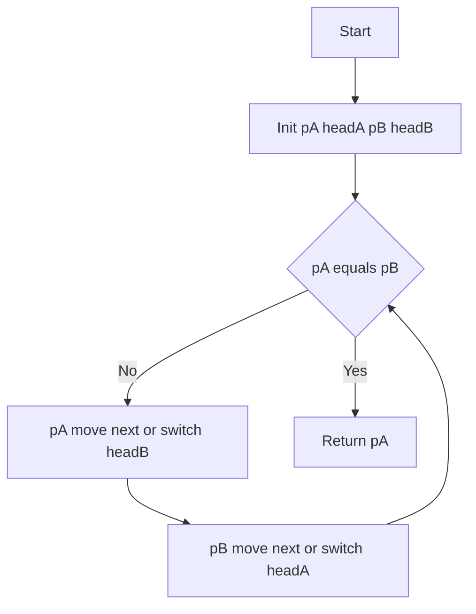

# 160. 相交链表 - 思路分析

## 📋 题目信息
- **难度**：简单
- **标签**：链表、双指针、哈希表
- **来源**：LeetCode

## 📖 题目描述

给你两个单链表的头节点 `headA` 和 `headB`，请你找出并返回两个单链表相交的起始节点。如果两个链表不存在相交节点，返回 `null`。

这道题表面上看起来很简单——"找到两条链表的交叉点"——但真正写起来就会发现，两条链表的长度可能不同，你没有办法让两个指针"对齐"地同时走到交叉点。这正是本题从"看起来简单"到"写起来需要想一想"的核心变化。

需要特别注意的是：题目说的"相交"不是指节点值相同，而是指两个指针在内存中指向了**同一个节点对象**。换句话说，从相交点开始，两条链表共享同一段尾部。

### 示例

**示例 1：**

```text
输入：intersectVal = 8, listA = [4,1,8,4,5], listB = [5,6,1,8,4,5], skipA = 2, skipB = 3
输出：Intersected at '8'
解释：链表 A 为 [4,1,8,4,5]，链表 B 为 [5,6,1,8,4,5]。
在 A 中，相交节点前有 2 个节点；在 B 中，相交节点前有 3 个节点。
```

这个示例最值得注意的地方是：链表 A 中值为 `1` 的节点和链表 B 中值为 `1` 的节点**不是同一个节点**，虽然它们的值相同。而值为 `8` 的节点才是真正的相交起始点，因为从这个节点开始，两条链表在内存中指向的是同一串节点。

**示例 2：**

```text
输入：intersectVal = 2, listA = [1,9,1,2,4], listB = [3,2,4], skipA = 3, skipB = 1
输出：Intersected at '2'
```

**示例 3：**

```text
输入：intersectVal = 0, listA = [2,6,4], listB = [1,5], skipA = 3, skipB = 2
输出：No intersection
解释：两个链表不相交，返回 null。
```

这说明两条链表完全可能没有任何交叉点，此时应该返回 `None`。

### 约束条件

- `listA` 中节点数目为 `m`
- `listB` 中节点数目为 `n`
- `1 <= m, n <= 3 * 10^4`
- `1 <= Node.val <= 10^5`
- 如果 `listA` 和 `listB` 没有交点，`intersectVal` 为 `0`
- 题目数据保证整个链式结构中不存在环
- 函数返回结果后，链表必须保持其原始结构

### 进阶要求

你能否设计一个时间复杂度 `O(m + n)`、仅用 `O(1)` 内存的解决方案？

### 原题提供的 Python 模板

```python
# Definition for singly-linked list.
# class ListNode:
#     def __init__(self, x):
#         self.val = x
#         self.next = None

class Solution:
    def getIntersectionNode(self, headA: ListNode, headB: ListNode) -> Optional[ListNode]:
        
```

---

## 🤔 题目分析

### 1. 先把题目翻译成人话

这道题真正问的不是"两条链表有没有值相同的节点"，而是：**两条链表是否在某个节点处物理合并成了同一条链表？如果是，找到那个合并起始点。**

想象两条河流，它们各自从不同的源头出发，在某个地方汇合成了一条河。我们要找的就是那个汇合点。汇合之后，两条河就变成了同一条河——不是"看起来一样"的两条河，而是**物理上就是同一条河**。

### 2. "相交"到底意味着什么

很多人第一次做这题时会犯一个理解错误：以为"相交"是指两条链表中存在值相同的节点。但题目说得很清楚，相交是指**节点对象本身相同**，也就是两个指针指向内存中的同一个地址。

这意味着一旦两条链表相交，从交叉点开始，它们后面的所有节点都是共享的。不可能出现"交叉一下又分开"的情况，因为单链表每个节点只有一个 `next` 指针。所以两条相交链表的形状一定是一个 **Y 字形**，而不是 X 字形。

### 3. 为什么这题不像看起来那么简单

如果两条链表长度相同，那事情就很简单了：两个指针各自从头开始，同步往前走，第一个相同的节点就是交叉点。但问题在于，两条链表的长度通常不同。链表 A 可能有 5 个节点，链表 B 可能有 7 个节点，交叉点前面的"独有部分"长度不一样。

这就导致了一个核心困难：**两个指针如果同时从各自头节点出发，它们不会同时到达交叉点。** 一个指针可能已经走过了交叉点，另一个还没到。

所以本题的本质问题是：**如何让两个指针在不知道链表长度差的情况下，恰好同时到达交叉点？**

### 4. 本题真正考察的是什么

这道题至少在考两层能力。

第一层，是你能不能意识到"长度差"是核心障碍。只要两条链表长度不同，简单的同步遍历就对不齐。

第二层，是你能不能找到一种优雅的方式来消除这个长度差。主流答案有三个方向：

- 用**哈希集合**记录一条链表的所有节点，然后遍历另一条链表查找。
- 先**计算长度差**，让长链表的指针先走几步，然后同步前进。
- 用**双指针交替遍历**的技巧，让两个指针自动对齐。

其中第三种方法最为精妙，它不需要额外空间，也不需要提前计算长度，却能让两个指针恰好在交叉点相遇。这正是本题被归类在"链表双指针"专题下的原因。

### 5. 统一记号

为了后面讨论更清晰，统一一下记号：

- `m`：链表 A 的总长度。
- `n`：链表 B 的总长度。
- `a`：链表 A 中交叉点之前的独有部分长度。
- `b`：链表 B 中交叉点之前的独有部分长度。
- `c`：两条链表共享的尾部长度（如果不相交则 `c = 0`）。

因此 `m = a + c`，`n = b + c`。

### 6. 本题与其他链表双指针题的关系

把链表双指针题放在一起看，你会发现它们都在做一件事：**想办法让两个指针在正确的时机出现在正确的位置**。区别只在于“对齐目标”不同。

- `141. 环形链表`：快慢指针要在环内相遇，对齐目标是“速度差制造追及”。
- `19. 删除链表的倒数第 N 个结点`：前后指针要保持固定间隔，对齐目标是“距离差固定”。
- `876. 链表的中间结点`：快慢指针要让慢指针停在中点，对齐目标是“步速比例 2:1”。
- `160. 相交链表`：两个头不同、长度不同的链表要在交点同步，对齐目标是“路径总长一致”。

所以本题的独特价值在于：它不是用速度差对齐，也不是用固定间隔对齐，而是用**路径重排**来对齐。

### 7. 自然思路梳理

如果按一个初学者最自然的思考路径，这题通常会经历三个层次。

第一层：先做出来。最直接想到哈希集合，把 A 的所有节点地址放进去，再扫 B，谁先命中谁就是交点。

第二层：开始追求空间优化。既然哈希用了 `O(m)` 空间，那能不能不用集合？可以。先算长度差，让长链表先走差值步，再同步前进。

第三层：追求代码和思维都更优雅。长度差方案虽然是 `O(1)` 空间，但还要先遍历两遍算长度。有没有办法既不哈希、也不显式算差值，还能自动对齐？这就来到主解：**双指针交替遍历**。

这个思路梳理很重要，因为它体现了面试里常见的优化节奏：
`能做出来 -> 能省空间 -> 能在不增加代码负担的前提下更优雅地达成同级复杂度`。

### 8. 为什么双指针交替遍历能自动对齐

这是本题最核心的数学点。

设：

- `A = a + c`
- `B = b + c`

让 `pA` 从 `headA` 出发，走到空后切到 `headB`；让 `pB` 从 `headB` 出发，走到空后切到 `headA`。

如果存在交点，那么它们第一次在交点相遇时：

- `pA` 走过的路径是 `a + c + b`
- `pB` 走过的路径是 `b + c + a`

于是：

`a + c + b = b + c + a`

两者总步数完全相同，所以会在同一时刻到达同一节点，也就是交点。

如果不存在交点，`c = 0`，两人都会走完整条 `A + B` 路径后同时变成 `null`，最终在 `null` 相遇并退出循环。这就是为什么主解无需额外判定“有没有交点”，循环本身已经统一覆盖两种情况。

### 9. 一句话突破口

**让两个指针都走完 `A + B` 这条总路径：`pA` 走 `A` 再走 `B`，`pB` 走 `B` 再走 `A`，总步数相同，若有交点必相遇，无交点则同到 `null`。**

---

## 💡 解题思路

### 方法一：哈希集合暴力法

#### 🌟 形象化理解：先给 A 链路所有路牌做登记

想象你在两条山路找汇合点。最笨但稳的方法是：先把 A 路所有路牌编号登记到一本册子里，然后沿 B 路走，看到第一个已登记路牌就是汇合点。这里“路牌编号”必须是节点地址，而不是节点值。

#### 思路说明

1. 遍历链表 A，把每个节点对象放进集合 `seen`。
2. 遍历链表 B，遇到第一个在 `seen` 里的节点就返回它。
3. 若 B 扫完都没命中，返回 `None`。

这个方法正确性很直接，缺点是空间开销偏大。

#### 算法步骤

1. 初始化空集合 `seen`。
2. 指针 `cur` 遍历 A，将 `cur` 加入 `seen`。
3. 指针 `cur` 遍历 B，若 `cur in seen`，返回 `cur`。
4. 遍历结束返回 `None`。

#### 复杂度分析

- 时间复杂度：`O(m + n)`
- 空间复杂度：`O(m)`

#### 为什么需要优化

题目进阶要求是 `O(1)` 额外空间。哈希法虽然线性时间，但明显不满足进阶空间约束，因此需要继续优化。

---

### 方法二：计算长度差并对齐

#### 🌟 形象化理解：先让长队伍提前出发

想象两支队伍要在共同终点段前同步。A 队比 B 队多走 `|m-n|` 米，那就先让长队伍提前走这段距离，随后两队并肩前进。这样它们到“共同尾段”的入口就对齐了。

#### 思路说明

1. 先分别计算链表 A 和 B 的长度 `m`、`n`。
2. 让长链表指针先走 `abs(m-n)` 步。
3. 两指针同步前进，第一个相同节点即交点。
4. 若同步走到 `None` 仍未相遇，则不相交。

#### 算法步骤

1. 写辅助函数 `get_len(head)` 计算链表长度。
2. 得到 `m`、`n`。
3. 令 `pA=headA`、`pB=headB`，让较长链表先走差值步。
4. `while pA != pB`：两者都走一步。
5. 返回 `pA`。

#### 复杂度分析

- 时间复杂度：`O(m + n)`
- 空间复杂度：`O(1)`

#### 💭 回顾类比

这个方法像体育比赛里的“让时制”：先补偿长度差，再同步竞走。它已经达到进阶复杂度，但要显式计算长度，代码步骤比主解更繁琐。

---

### 方法三：双指针交替遍历（主解）

#### 🌟 形象化理解：两个人交换跑道后总里程相同

两个人分别从 A 跑道和 B 跑道出发。谁先跑完自己的跑道，就立刻去跑对方的跑道。这样最终两个人都精确跑了 `A + B` 的总里程。若存在公共路段，他们会在公共路段入口相遇；若不存在，就会在终点空点同时停下。

#### 思路说明

核心写法非常短：

```python
pA = headA
pB = headB
while pA != pB:
    pA = pA.next if pA else headB
    pB = pB.next if pB else headA
return pA
```

重点不是代码长短，而是背后的对齐机制：

- `pA` 轨迹：先走 `A`，再走 `B`
- `pB` 轨迹：先走 `B`，再走 `A`

两者走过总长度都为 `m+n`，自然就把起点差异抵消了。

#### 算法步骤

1. 初始化 `pA = headA`，`pB = headB`。
2. 当 `pA != pB` 时循环。
3. 若 `pA` 非空，`pA = pA.next`；否则 `pA = headB`。
4. 若 `pB` 非空，`pB = pB.next`；否则 `pB = headA`。
5. 循环结束返回 `pA`（可能是交点，也可能是 `None`）。

#### 复杂度分析

- 时间复杂度：`O(m + n)`
- 空间复杂度：`O(1)`

#### 为什么这是主解

它同时满足三点：

1. 达到进阶复杂度要求。
2. 不需要显式计算长度差。
3. 代码短而稳定，边界统一（有交点与无交点共用同一循环）。

#### 💭 回顾类比

把它记成一句口令就够了：**先跑自己跑道，跑完换对方跑道，直到同点相遇。**

---

## 🎨 图解说明

下面用示例 1 进行图解：

- `A: 4 -> 1 -> 8 -> 4 -> 5`
- `B: 5 -> 6 -> 1 -> 8 -> 4 -> 5`
- 交点是值为 `8` 的节点
- 记号：`a=2`，`b=3`，`c=3`

### 1. 主解执行过程图解

先看两条路径展开：

- `pA` 走：`A 独有 -> 共享 -> B 独有`
- `pB` 走：`B 独有 -> 共享 -> A 独有`

写成长度表达：

- `pA: a + c + b`
- `pB: b + c + a`

两者相等，所以同刻相遇。

### 2. 状态表

| 轮次 | pA 所在 | pB 所在 | 说明 |
|---|---|---|---|
| 0 | A4 | B5 | 从各自头节点出发 |
| 1 | A1 | B6 | 同步前进 |
| 2 | C8 | B1 | pA 先进入共享段 |
| 3 | C4 | C8 | pB 开始进入共享段 |
| 4 | C5 | C4 | 继续前进 |
| 5 | null | C5 | pA 到尾后置空 |
| 6 | B5 | null | pA 切到 B 头，pB 到尾后置空 |
| 7 | B6 | A4 | pB 切到 A 头 |
| 8 | B1 | A1 | 继续对齐 |
| 9 | C8 | C8 | 在交点相遇，循环结束 |

### 3. Mermaid 流程图



### 4. 边界情况一览

| 场景 | 输入特点 | 结果 |
|---|---|---|
| 正常相交 | `c > 0` | 返回交点节点 |
| 完全不相交 | `c = 0` | 最终同时为 `None` |
| 一开始就相交 | `headA is headB` | 直接返回头节点 |
| 其中一条只有一个节点 | 极短链表 | 逻辑不变 |
| 两条都很长 | `m n` 大 | 仍是线性时间 |

---

## ✏️ 代码框架填空

### Python 填空版 主解 双指针交替遍历

```python
from typing import Optional


class ListNode:
    def __init__(self, x: int):
        self.val = x
        self.next = None


class Solution:
    def getIntersectionNode(
        self,
        headA: Optional[ListNode],
        headB: Optional[ListNode]
    ) -> Optional[ListNode]:
        pA = ______
        pB = ______

        while ______:
            pA = pA.next if pA else ______
            pB = pB.next if pB else ______

        return ______
```

### 填空提示详解

- **填空 1**：`pA` 初始应指向哪？
  - 提示：从链表 A 的头出发。
- **填空 2**：`pB` 初始应指向哪？
  - 提示：从链表 B 的头出发。
- **填空 3**：循环条件是什么？
  - 提示：只要两指针还没在同一节点就继续。
- **填空 4**：`pA` 走到空后切到哪里？
  - 提示：切到另一条链表头。
- **填空 5**：`pB` 走到空后切到哪里？
  - 提示：与上面对称。
- **填空 6**：最终返回谁？
  - 提示：循环结束时两者相等，返回任意一个都行。

### C++ 填空版 主解 双指针交替遍历

```cpp
#include <cstddef>
using namespace std;

/**
 * Definition for singly-linked list.
 * struct ListNode {
 *     int val;
 *     ListNode *next;
 *     ListNode(int x) : val(x), next(nullptr) {}
 * };
 */
class Solution {
public:
    ListNode *getIntersectionNode(ListNode *headA, ListNode *headB) {
        ListNode* pA = ______;
        ListNode* pB = ______;

        while (______) {
            pA = pA ? pA->next : ______;
            pB = pB ? pB->next : ______;
        }

        return ______;
    }
};
```

---

## 💻 完整代码实现

### Python 主解 双指针交替遍历

```python
from typing import Optional


class ListNode:
    def __init__(self, x: int):
        self.val = x
        self.next = None


class Solution:
    def getIntersectionNode(
        self,
        headA: Optional[ListNode],
        headB: Optional[ListNode]
    ) -> Optional[ListNode]:
        pA = headA
        pB = headB

        while pA != pB:
            pA = pA.next if pA else headB
            pB = pB.next if pB else headA

        return pA
```

### Python 代码逐段解析

第一段初始化：`pA=headA`、`pB=headB`，两个指针分别从不同起点出发。

第二段循环：只要 `pA != pB` 就继续。这里的“不相等”是对象地址不相等，而不是值不相等。

第三段换头逻辑：

- `pA` 为空时切到 `headB`
- `pB` 为空时切到 `headA`

这就是“路径重排”的关键动作。

第四段返回：循环结束时两者要么同在交点，要么同为 `None`，统一返回 `pA` 即可。

### 填空答案解析 Python

- **填空 1**：`headA`
- **填空 2**：`headB`
- **填空 3**：`pA != pB`
- **填空 4**：`headB`
- **填空 5**：`headA`
- **填空 6**：`pA`

### Python 哈希集合补充

```python
from typing import Optional


class ListNode:
    def __init__(self, x: int):
        self.val = x
        self.next = None


class SolutionHash:
    def getIntersectionNode(
        self,
        headA: Optional[ListNode],
        headB: Optional[ListNode]
    ) -> Optional[ListNode]:
        seen = set()

        cur = headA
        while cur:
            seen.add(cur)
            cur = cur.next

        cur = headB
        while cur:
            if cur in seen:
                return cur
            cur = cur.next

        return None
```

### C++ 主解 双指针交替遍历

```cpp
#include <cstddef>
using namespace std;

/**
 * Definition for singly-linked list.
 * struct ListNode {
 *     int val;
 *     ListNode *next;
 *     ListNode(int x) : val(x), next(nullptr) {}
 * };
 */
class Solution {
public:
    ListNode *getIntersectionNode(ListNode *headA, ListNode *headB) {
        ListNode* pA = headA;
        ListNode* pB = headB;

        while (pA != pB) {
            pA = pA ? pA->next : headB;
            pB = pB ? pB->next : headA;
        }

        return pA;
    }
};
```

### C++ 与 Python 的差异

1. Python 用 `None`，C++ 用 `nullptr`。
2. Python 写 `p.next`，C++ 写 `p->next`。
3. 两者主逻辑完全同构，证明语言无关，核心在指针路径设计。

### C++ 填空答案

- **填空 1**：`headA`
- **填空 2**：`headB`
- **填空 3**：`pA != pB`
- **填空 4**：`headB`
- **填空 5**：`headA`
- **填空 6**：`pA`

---

## ⚠️ 易错点提醒

### 1. 把相交误判成值相等

本题必须比较节点对象是否相同，不能比较 `val`。

### 2. 循环条件写成 `while pA and pB`

这样会在任一指针先到空时提前退出，无法完成“换头对齐”。必须写 `while pA != pB`。

### 3. 换头方向写反

`pA` 到空应该切 `headB`，`pB` 到空应该切 `headA`。任何一处写反都会破坏总路径相等。

### 4. 误以为会死循环

不会。每个指针最多走 `m+n` 步后必与另一个同点相遇，或同到 `None`。

### 5. 在循环体内先判断 `pA == pB`

容易制造多余分支。直接把判定放在 `while pA != pB` 最稳。

### 6. 没考虑 `headA is headB`

这种情况下应该立刻返回头节点。主解天然支持，因为初始就满足 `pA == pB`。

### 7. 人为加长度变量导致逻辑变重

主解不需要 `m`、`n` 显式参与代码，数学证明在思维层完成即可。

### 8. 哈希法里把 `node.val` 放进集合

值可能重复，必须放节点对象本身。

### 9. C++ 中把空指针判断写错

推荐统一写成三目：`pA = pA ? pA->next : headB`，可读性高且不易漏分支。

### 10. 忘记题目要求不能破坏原链表结构

本题只移动局部指针变量，不修改任何节点 `next`，自然满足要求。

### 调试建议测试集

- `A=[4,1,8,4,5], B=[5,6,1,8,4,5], 交点=8`
- `A=[1,9,1,2,4], B=[3,2,4], 交点=2`
- `A=[2,6,4], B=[1,5], 无交点`
- `A=[1], B=[1], 同一节点`
- `A=[1], B=[2], 无交点`

### 本地调试辅助函数 Python

```python
from typing import Optional, List


class ListNode:
    def __init__(self, x: int):
        self.val = x
        self.next = None


def build_list(nums: List[int]) -> Optional[ListNode]:
    dummy = ListNode(0)
    tail = dummy
    for v in nums:
        tail.next = ListNode(v)
        tail = tail.next
    return dummy.next


def attach_tail(prefix: Optional[ListNode], shared: Optional[ListNode]) -> Optional[ListNode]:
    if not prefix:
        return shared
    cur = prefix
    while cur.next:
        cur = cur.next
    cur.next = shared
    return prefix
```

---

## 🔗 相似题目推荐

### 1. 同类型题目

**141. 环形链表（简单）**：练“相遇判定”最经典入口，理解为什么快慢指针会相遇。

**142. 环形链表 II（中等）**：在相遇基础上继续定位入环点，训练指针路径方程思维。

**19. 删除链表的倒数第 N 个结点（中等）**：前后指针固定间隔模型，练习“对齐后同步推进”。

### 2. 进阶题目

**21. 合并两个有序链表（简单）**：强化链表指针基本功，尤其是 dummy 和 tail 的稳定连接。

**234. 回文链表（简单）**：快慢指针找中点 + 反转后半段，训练多阶段链表操作组合。

**287. 寻找重复数（中等）**：把数组映射成链表环，用快慢指针做 Floyd 判环，理解模型迁移。

### 3. 推荐学习路径

建议顺序：`141 -> 142 -> 160 -> 19 -> 234 -> 287`。

- 先掌握相遇与入口定位。
- 再学本题的路径重排对齐。
- 最后扩展到固定间隔、链表反转组合和数组映射场景。

---

## 📚 知识点总结

### 1. 核心算法

本题核心算法是**双指针交替遍历**：两指针分别走 `A+B` 与 `B+A`，依靠总路径等长实现自动对齐。

### 2. 核心数据结构

核心数据结构仍是单链表本身。主解不依赖额外结构，只依赖两个游标指针与空节点跳转规则。

### 3. 最重要的四个技巧

1. **对象相等判断**：比较节点引用，不比较值。
2. **换头重排路径**：到空即切换到另一链表头。
3. **统一循环条件**：`while pA != pB` 同时覆盖有交点和无交点。
4. **数学背书**：`a+c+b = b+c+a` 是主解正确性的根。

### 4. 可复用模板

```python
def align_by_switch(headA, headB):
    pA, pB = headA, headB
    while pA != pB:
        pA = pA.next if pA else headB
        pB = pB.next if pB else headA
    return pA
```

这个模板可直接复用于“两个单链表是否存在公共尾段”的判定场景。

### 5. 学完最该记住的六句话

1. 相交判定看地址，不看值。
2. 难点不是找交点，而是处理长度差。
3. 交替遍历本质是把路径改写为等长。
4. 有交点在交点相遇，无交点在 `None` 相遇。
5. 主解达到 `O(m+n)` 时间和 `O(1)` 空间。
6. 面试表达先讲思路层次，再给主解和证明。

---

## 📝 补充说明

### 1. 从填空到独立实现的建议路径

第一轮只填空，重点背下三行核心循环；第二轮手写完整主解；第三轮脱稿写出哈希法与长度差法；第四轮口述证明 `a+c+b = b+c+a`。这样你不仅会写，还能讲清为什么对。

### 2. 时间复杂度优化历程

哈希法与长度差法都已是 `O(m+n)` 时间，主解并不是进一步降时间，而是把思路从“先准备再对齐”变成“遍历中自动对齐”，降低实现负担与面试叙述成本。

### 3. 空间复杂度权衡

- 哈希法：`O(m)`，好懂但不满足进阶。
- 长度差法：`O(1)`，需要先计长。
- 交替遍历法：`O(1)`，代码最短、边界最统一。

### 4. 实际应用场景

这个模型可用于判定两条数据处理链路是否在某一步之后共享同一对象序列，例如持久化结构共享尾部、版本链公共祖先后缀检测等。

### 5. 面试表达建议

建议按这条线说：

1. 先定义相交是地址相同。
2. 给出三种解法并说明取舍。
3. 主推交替遍历，写出三行核心代码。
4. 用 `a b c` 记号做一步等式证明。
5. 收尾给出复杂度与边界覆盖。

### 6. 最后一句总结

**这道题的精髓不是记住一段短代码，而是理解如何用路径重排把长度差问题转化为等长行走问题。**
