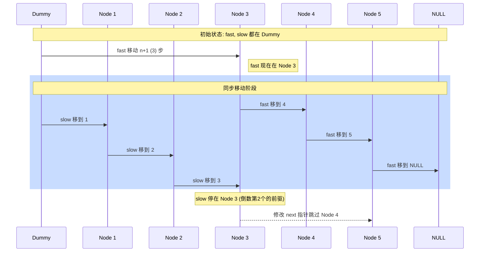

# 19. 删除链表的倒数第 N 个结点

## 📋 题目信息
- **难度**：Medium
- **标签**：链表、双指针
- **来源**：LeetCode

## 📖 题目描述

给你一个链表，删除链表的倒数第 `n` 个结点，并且返回链表的头结点。

### 示例

**示例 1：**

```
输入：head = [1,2,3,4,5], n = 2
输出：[1,2,3,5]
```

**示例 2：**
```
输入：head = [1], n = 1
输出：[]
```

**示例 3：**
```
输入：head = [1,2], n = 1
输出：[1]
```

### 约束条件

- 链表中结点的数目为 `sz`
- `1 <= sz <= 30`
- `0 <= Node.val <= 100`
- `1 <= n <= sz`

**进阶：** 你能尝试使用一趟扫描实现吗？

---

## 🤔 题目分析

### 问题理解

题目要求我们删除链表中从末尾开始数的第 `n` 个节点。链表是一个单向结构，我们只能从头向后遍历。

关键点：
- 链表是单向的，无法直接从后往前数。
- 需要找到倒数第 `n` 个节点的前驱节点，才能执行删除操作。
- 需要处理删除头节点的特殊情况。
- 进阶要求是一次遍历完成。

### 关键观察

1. **倒数与正数的转换**：如果链表长度为 `L`，倒数第 `n` 个节点就是正数第 `L - n + 1` 个节点。
2. **删除操作**：要删除一个节点，我们需要找到它的前一个节点。如果我们要删除正数第 `k` 个节点，我们需要找到第 `k-1` 个节点。
3. **哨兵节点（Dummy Node）**：为了统一处理删除头节点的情况，我们可以引入一个虚拟的头节点指向真实的头节点。这样，即使删除的是原头节点，操作逻辑也是一致的。

---

## 💡 解题思路

### 方法一：暴力解法（两次遍历）

#### 🌟 形象化理解

**场景类比：寻宝游戏中的“倒数第N个宝箱”**

想象你在参加一个寻宝游戏，宝箱排成一排，每个宝箱里都有下一关的线索。规则是你必须从第一个宝箱开始找。现在任务是：**毁掉倒数第 N 个宝箱**。

**对应关系**：
- **链表** = 宝箱队列
- **节点** = 宝箱
- **删除操作** = 毁掉宝箱并把前后的线索连起来
- **两次遍历** = 先跑一遍数总数，再跑一遍找目标

**核心理解**：
因为你不知道总共有多少个宝箱，你得先从头到尾跑一遍，数清楚总数（比如 10 个）。如果你要毁掉倒数第 2 个，那你心算一下：10 - 2 + 1 = 9，也就是正数第 9 个。然后你再从头跑一次，跑到第 8 个宝箱那里，把它的线索指向第 10 个宝箱，第 9 个就被跳过了。

---

#### 思路说明

最直观的方法是先遍历一遍链表，求出链表的总长度 `L`。然后再次遍历，找到第 `L - n` 个节点（即倒数第 `n` 个节点的前驱节点），将其 `next` 指向 `next.next`。

#### 算法步骤

1. 创建一个哨兵节点 `dummy`，令 `dummy.next = head`。
2. 第一次遍历：从 `head` 开始，统计链表长度 `length`。
3. 计算目标位置：我们需要找到倒数第 `n` 个节点的前驱，它在正数第 `length - n` 个位置（从 `dummy` 开始算）。
4. 第二次遍历：从 `dummy` 开始，移动 `length - n` 步，到达目标节点的前驱。
5. 执行删除：`cur.next = cur.next.next`。
6. 返回 `dummy.next`。

#### 复杂度分析

- **时间复杂度**：O(L) - 其中 L 是链表长度。需要遍历两次链表。
- **空间复杂度**：O(1) - 只使用了常数级别的额外空间。

#### 为什么需要优化

虽然两次遍历的时间复杂度也是 O(L)，但在面试中，面试官通常会要求“一趟扫描”完成。两次遍历意味着我们要处理两倍的节点访问，如果链表非常长，或者存储在远程服务器上，减少一次遍历能显著提高效率。

---

### 方法二：优化解法（快慢指针 - 一次遍历）

#### 🌟 形象化理解

> **💡 在进入专业算法分析之前，先通过一个生活化的例子来理解优化思路的本质**

**场景类比：保持距离的“探路者”**

想象你和你的朋友在一条狭窄的隧道里行走，隧道很黑，你们看不见尽头。你想要在到达终点时，正好站在倒数第 `n` 个位置。

**对应关系**：
- **快指针（Fast）** = 你的朋友（先出发）
- **慢指针（Slow）** = 你（后出发）
- **n 步距离** = 你们之间始终保持的固定步数
- **隧道尽头** = 链表的末尾（NULL）

**核心理解**：
让你的朋友先走 `n` 步，然后你再出发。你们保持同样的步速前进。当你的朋友撞到隧道的尽头墙壁时，因为你一直落后他 `n` 步，你现在所在的位置正好就是倒数第 `n` 个位置！

**从类比到算法**：
为了删除倒数第 `n` 个节点，我们需要找到它的**前一个**节点。所以，我们让快指针先走 `n + 1` 步，然后快慢指针同步移动。当快指针到达末尾（NULL）时，慢指针正好指向倒数第 `n + 1` 个节点，也就是目标节点的前驱。

---

#### 优化思路推导

**思考过程**：
1. 暴力解法的瓶颈在于需要先知道总长度才能定位。
2. 我们可以通过“相对位移”来抵消对“绝对长度”的依赖。
3. 引入两个指针：`fast` 和 `slow`。
4. 让 `fast` 先走 `n` 步，此时 `fast` 和 `slow` 之间隔了 `n` 个节点。
5. 当 `fast` 走到末尾时，`slow` 所在的位置与末尾的距离正好是 `n`。

#### 算法步骤

1. 初始化：创建哨兵节点 `dummy`，`dummy.next = head`。设置 `fast` 和 `slow` 指针都指向 `dummy`。
2. 快指针先行：`fast` 指针先向前移动 `n + 1` 步。
3. 同步移动：同时移动 `fast` 和 `slow`，直到 `fast` 指向 `None`（链表末尾之后）。
4. 此时，`slow` 指针指向的就是倒数第 `n` 个节点的前驱节点。
5. 删除节点：`slow.next = slow.next.next`。
6. 返回结果：返回 `dummy.next`。

#### 复杂度分析

- **时间复杂度**：O(L) - 只需要一次遍历，访问每个节点一次。
- **空间复杂度**：O(1) - 只使用了两个额外的指针。

#### 💭 回顾类比

- 生活中的 **“保持距离”** 对应 代码中的 **“指针间隔”**。
- 生活中的 **“朋友撞墙”** 对应 代码中的 **“快指针触底”**。
- 这就是为什么我们不需要知道隧道有多长，也能精准定位倒数第 N 个位置的原因。

---

## 🎨 图解说明

### 执行过程示例

**输入**：`head = [1, 2, 3, 4, 5], n = 2`

**执行步骤**：

```
初始状态：
dummy -> 1 -> 2 -> 3 -> 4 -> 5 -> NULL
f,s

1. fast 先走 n+1 = 3 步：
dummy -> 1 -> 2 -> 3 -> 4 -> 5 -> NULL
s              f

2. fast 和 slow 同步移动，直到 fast 为 NULL：
Step 1:
dummy -> 1 -> 2 -> 3 -> 4 -> 5 -> NULL
     s              f

Step 2:
dummy -> 1 -> 2 -> 3 -> 4 -> 5 -> NULL
          s              f

Step 3:
dummy -> 1 -> 2 -> 3 -> 4 -> 5 -> NULL
               s              f (NULL)

3. 此时 slow 指向 3，是倒数第 2 个节点 (4) 的前驱。
执行 slow.next = slow.next.next:
3.next = 5

结果：
dummy -> 1 -> 2 -> 3 -> 5 -> NULL
```

### 可视化图表



---

## ✏️ 代码框架填空

> **💡 学习提示**：在查看完整代码之前，先尝试根据上面的算法步骤，自己思考并填写下面的空白处。这将帮助你从"不知道怎么开始"过渡到"能够独立实现关键逻辑"。

### Python填空版

```python
class ListNode:
    def __init__(self, val=0, next=None):
        self.val = val
        self.next = next

def removeNthFromEnd(head: ListNode, n: int) -> ListNode:
    # 🔹 填空1：创建哨兵节点并初始化指针
    # 提示：为了处理删除头节点的情况，我们需要一个 dummy 节点
    dummy = ListNode(0, head)
    fast = ______
    slow = ______
    
    # 🔹 填空2：快指针先行
    # 提示：快指针需要领先慢指针 n+1 步，这样当快指针到末尾时，慢指针在倒数第 n 个的前驱
    for _ in range(______):
        fast = ______
    
    # 🔹 填空3：同步移动
    # 提示：只要快指针没到头，两个指针就一起走
    while ______:
        fast = ______
        slow = ______
    
    # 🔹 填空4：执行删除操作
    # 提示：跳过 slow 的下一个节点
    ______ = ______
    
    # 🔹 填空5：返回结果
    # 提示：返回真正的头节点
    return ______
```

### 填空提示详解

**填空1 - 变量初始化**
- 思考：我们需要 `fast` 和 `slow` 都从哪里出发？
- 答案：都从 `dummy` 出发，这样 `slow` 最终能停在被删节点的前驱。

**填空2 - 快指针先行**
- 思考：为什么要走 `n + 1` 步而不是 `n` 步？
- 答案：走 `n` 步会让 `slow` 停在被删节点上，走 `n + 1` 步会让 `slow` 停在被删节点的前一个。

**填空3 - 循环结构**
- 思考：快指针走到哪里停止？
- 答案：走到 `None`，表示已经越过了最后一个节点。

**填空4 - 删除逻辑**
- 思考：如何修改指针实现删除？
- 答案：`slow.next = slow.next.next`。

**填空5 - 返回结果**
- 思考：如果原头节点被删了，直接返回 `head` 会报错吗？
- 答案：会。所以要返回 `dummy.next`。

---

### C++填空版

```cpp
struct ListNode {
    int val;
    ListNode *next;
    ListNode() : val(0), next(nullptr) {}
    ListNode(int x) : val(x), next(nullptr) {}
    ListNode(int x, ListNode *next) : val(x), next(next) {}
};

class Solution {
public:
    ListNode* removeNthFromEnd(ListNode* head, int n) {
        // 🔹 填空1：初始化哨兵节点
        ListNode* dummy = new ListNode(0, head);
        ListNode* fast = ______;
        ListNode* slow = ______;
        
        // 🔹 填空2：快指针先行 n+1 步
        for (int i = 0; i < ______; ++i) {
            fast = ______;
        }
        
        // 🔹 填空3：同步移动
        while (______) {
            fast = ______;
            slow = ______;
        }
        
        // 🔹 填空4：删除节点
        ListNode* temp = slow->next;
        slow->next = ______;
        delete temp; // C++ 需要手动释放内存
        
        // 🔹 填空5：返回结果
        ListNode* ans = ______;
        delete dummy; // 释放哨兵节点
        return ans;
    }
};
```

---

## 💻 完整代码实现

> **✅ 对照检查**：现在对比你的填空答案和下面的完整实现，看看思路是否一致。

### Python实现 (ACM模式)

```python
import sys

# 节点定义
class ListNode:
    def __init__(self, val=0, next=None):
        self.val = val
        self.next = next

class Solution:
    def removeNthFromEnd(self, head: ListNode, n: int) -> ListNode:
        """
        使用快慢指针一趟扫描删除倒数第 N 个节点
        """
        # 1. 初始化哨兵节点，处理删除头节点的边界情况
        dummy = ListNode(0, head)
        fast = dummy
        slow = dummy
        
        # 2. 快指针先走 n + 1 步
        # 为什么要走 n + 1？
        # 因为我们要让 slow 停在倒数第 n 个节点的前驱节点上
        for _ in range(n + 1):
            fast = fast.next
            
        # 3. 快慢指针同步移动
        # 当 fast 走到 None 时，slow 刚好在倒数第 n 个的前驱
        while fast:
            fast = fast.next
            slow = slow.next
            
        # 4. 删除目标节点
        # 此时 slow.next 就是要被删除的节点
        slow.next = slow.next.next
        
        # 5. 返回真正的头节点
        return dummy.next

# --- ACM 模式测试代码 ---
def create_linked_list(arr):
    if not arr: return None
    head = ListNode(arr[0])
    cur = head
    for i in range(1, len(arr)):
        cur.next = ListNode(arr[i])
        cur = cur.next
    return head

def linked_list_to_list(head):
    res = []
    while head:
        res.append(head.val)
        head = head.next
    return res

if __name__ == "__main__":
    sol = Solution()
    
    # 测试用例 1
    head1 = create_linked_list([1, 2, 3, 4, 5])
    n1 = 2
    res1 = sol.removeNthFromEnd(head1, n1)
    print(f"测试1: 输入 [1,2,3,4,5], n=2 -> 输出 {linked_list_to_list(res1)}")
    
    # 测试用例 2: 删除头节点
    head2 = create_linked_list([1, 2])
    n2 = 2
    res2 = sol.removeNthFromEnd(head2, n2)
    print(f"测试2: 输入 [1,2], n=2 -> 输出 {linked_list_to_list(res2)}")
    
    # 测试用例 3: 只有一个节点
    head3 = create_linked_list([1])
    n3 = 1
    res3 = sol.removeNthFromEnd(head3, n3)
    print(f"测试3: 输入 [1], n=1 -> 输出 {linked_list_to_list(res3)}")
```

**代码说明**：
- **哨兵节点**：`dummy` 的引入极其重要，它让删除第一个节点的操作和删除中间节点的操作完全一致，避免了大量的 `if head == target` 判断。
- **循环次数**：`range(n + 1)` 确保了快慢指针之间的间距。如果 `n` 等于链表长度，`fast` 最终会先走完整个链表到达 `None`，此时 `slow` 还在 `dummy`，正好可以删除原头节点。

---

### C++实现 (ACM模式)

```cpp
#include <iostream>
#include <vector>

using namespace std;

// 链表节点结构
struct ListNode {
    int val;
    ListNode *next;
    ListNode() : val(0), next(nullptr) {}
    ListNode(int x) : val(x), next(nullptr) {}
    ListNode(int x, ListNode *next) : val(x), next(next) {}
};

class Solution {
public:
    ListNode* removeNthFromEnd(ListNode* head, int n) {
        // 1. 创建哨兵节点
        ListNode* dummy = new ListNode(0, head);
        ListNode* fast = dummy;
        ListNode* slow = dummy;
        
        // 2. 快指针先行 n + 1 步
        for (int i = 0; i <= n; ++i) {
            if (fast != nullptr) {
                fast = fast->next;
            }
        }
        
        // 3. 同步移动
        while (fast != nullptr) {
            fast = fast->next;
            slow = slow->next;
        }
        
        // 4. 删除节点并释放内存
        ListNode* target = slow->next;
        slow->next = slow->next->next;
        delete target; // 良好的内存管理习惯
        
        // 5. 获取结果并释放哨兵
        ListNode* result = dummy->next;
        delete dummy;
        return result;
    }
};

// --- ACM 模式辅助函数 ---
ListNode* createList(const vector<int>& nums) {
    if (nums.empty()) return nullptr;
    ListNode* head = new ListNode(nums[0]);
    ListNode* cur = head;
    for (size_t i = 1; i < nums.size(); ++i) {
        cur->next = new ListNode(nums[i]);
        cur = cur->next;
    }
    return head;
}

void printList(ListNode* head) {
    cout << "[";
    while (head) {
        cout << head->val << (head->next ? "," : "");
        head = head->next;
    }
    cout << "]" << endl;
}

int main() {
    Solution sol;
    
    // 测试 1
    ListNode* h1 = createList({1, 2, 3, 4, 5});
    ListNode* r1 = sol.removeNthFromEnd(h1, 2);
    cout << "测试1: "; printList(r1);
    
    // 测试 2
    ListNode* h2 = createList({1});
    ListNode* r2 = sol.removeNthFromEnd(h2, 1);
    cout << "测试2: "; printList(r2);
    
    return 0;
}
```

**与Python的主要差异**：
- **内存管理**：C++ 中使用 `new` 创建的节点需要手动 `delete`。在删除链表节点时，如果不 `delete` 掉被删节点，会造成内存泄漏。
- **指针操作**：使用 `->` 访问成员，且需要显式检查 `nullptr`。

---

## ⚠️ 易错点提醒

### 1. 边界条件：删除头节点

**易错点**：如果 `n` 等于链表长度，意味着要删除的是第一个节点。如果没有哨兵节点，你需要写特殊的逻辑来处理 `head = head.next`。

**正确处理**：
使用 `dummy` 节点。
```python
dummy = ListNode(0, head)
# ... 逻辑保持一致 ...
return dummy.next
```

### 2. 常见错误：快指针步数算错

**错误1**：快指针只走了 `n` 步。
- **原因**：如果只走 `n` 步，当 `fast` 走到最后一个节点时，`slow` 刚好走到倒数第 `n` 个节点。但删除操作需要找到**前一个**节点。
- **正确做法**：让 `fast` 走 `n + 1` 步，或者让 `fast` 走到最后一个节点（而不是 `None`）时停止。

### 3. 调试技巧

- **画图法**：在纸上画出 `dummy -> 1 -> 2`，手动模拟 `n=2` 的情况。
- **打印指针**：在循环中打印 `fast.val` 和 `slow.val`，观察它们的间距是否符合预期。
- **空链表检查**：虽然题目约束 `sz >= 1`，但在实际工程中应考虑 `head` 为空的情况。

---

## 🔗 相似题目推荐

### 同类型题目

这些题目使用相同或相似的双指针思路：

1. **LeetCode 876 - 链表的中间结点** (Easy)
   - 相似点：同样使用快慢指针，快指针速度是慢指针的两倍。
   - 建议：练习如何通过指针速度差定位特定位置。

2. **LeetCode 141 - 环形链表** (Easy)
   - 相似点：快慢指针经典应用，用于检测链表是否有环。
   - 核心：如果快慢指针相遇，则有环。

3. **LeetCode 61 - 旋转链表** (Medium)
   - 相似点：需要找到倒数第 `k` 个节点，将其作为新的头节点。

### 进阶题目

1. **LeetCode 142 - 环形链表 II** (Medium)
   - 进阶点：不仅要判断有环，还要找到环的入口。需要数学推导。

2. **LeetCode 143 - 重排链表** (Medium)
   - 进阶点：综合考察找中点、反转链表、合并链表。

---

## 📚 知识点总结

### 核心算法：快慢指针 (Fast-Slow Pointers)

快慢指针是解决链表问题的万金油。它通过两个指针以不同的速度或不同的起始时间移动，来解决以下问题：
- **定位问题**：找中点、找倒数第 N 个。
- **环路问题**：判断是否有环、找环入口。
- **相交问题**：找两个链表的第一个公共节点。

### 数据结构：哨兵节点 (Dummy Node)

哨兵节点是链表题目中的“降智打击”利器。它的核心作用是：
- **消除特例**：让头节点变成“普通节点”，不再需要单独处理 `head` 为空或删除 `head` 的情况。
- **简化代码**：减少 `if-else` 分支，使逻辑更纯粹。

### 解题模板

```python
def linked_list_two_pointers(head, n):
    # 1. 初始化哨兵
    dummy = ListNode(0, head)
    fast = slow = dummy
    
    # 2. 设置间距
    for _ in range(n + 1):
        fast = fast.next
        
    # 3. 同步移动
    while fast:
        fast = fast.next
        slow = slow.next
        
    # 4. 执行操作
    # slow.next = ...
    
    return dummy.next
```

### 学习要点

1. **理解相对位移**：不需要知道总长，只需要知道“差距”。
2. **内存安全**：在 C++ 等语言中，删除节点后务必释放内存。
3. **边界意识**：始终考虑 `n=1`（删末尾）和 `n=length`（删开头）的情况。

---

## 📝 补充说明

### 从填空到完整实现的进阶路径

1. **第一遍**：看算法步骤，尝试填空，建立逻辑框架。
2. **第二遍**：对照答案，重点理解为什么快指针要多走一步。
3. **第三遍**：不看提示，在 LeetCode 上独立提交，处理报错。
4. **第四遍**：尝试用 C++ 实现，理解底层内存管理。

### 时间复杂度优化历程

- **暴力解法**：O(2L) → 虽然也是 O(L)，但需要两次扫描，增加了 I/O 或内存访问开销。
- **优化解法**：O(L) → 真正的一趟扫描，在流式数据处理中优势巨大。

### 空间复杂度权衡

本题的两种解法空间复杂度均为 O(1)。在链表问题中，除非要求返回新链表或使用递归（递归会占用 O(L) 的栈空间），否则通常应追求 O(1) 的空间复杂度。

---
**总结**：删除倒数第 N 个节点的核心在于“提前量”。通过让快指针先跑，我们成功地将“未来的终点信息”提前反馈给了慢指针，从而实现了一次遍历的精准打击。
