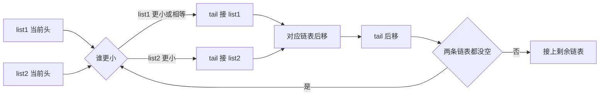
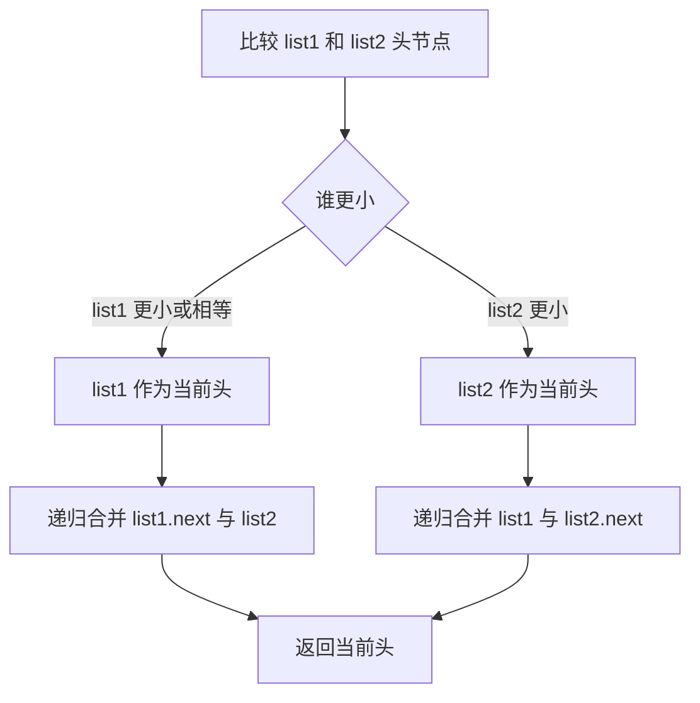

# 21. 合并两个有序链表 - 思路分析

## 📋 题目信息
- **难度**：简单
- **标签**：链表、双指针、归并、递归、迭代
- **来源**：LeetCode

## 📖 题目描述

给定两个按**非递减顺序**排列的链表 `list1` 和 `list2`，要求把它们合并成一个新的升序链表并返回。这里的“新链表”并不是一定要创建一整套全新的节点，题目真正想表达的是：最终返回的链表顺序必须正确，并且它由两个原链表中的所有节点拼接而成。

从题意上看，这道题非常像数组里的“合并两个有序数组”，但数据结构从数组变成了链表。正是这个变化，让我们不能再依赖下标访问，而必须使用指针逐步推进。也正因为如此，这道题是链表双指针、链表归并、虚拟头节点这些基础技巧的经典入门题。

### 示例

**示例 1：**


```text
输入：l1 = [1,2,4], l2 = [1,3,4]
输出：[1,1,2,3,4,4]
```

**示例 2：**

```text
输入：l1 = [], l2 = []
输出：[]
```

**示例 3：**

```text
输入：l1 = [], l2 = [0]
输出：[0]
```

### 约束条件

- 两个链表的节点数目范围是 `[0, 50]`
- `-100 <= Node.val <= 100`
- `list1` 和 `list2` 都按**非递减顺序**排列

### 原题提供的 Python 模板

```python
# Definition for singly-linked list.
# class ListNode:
#     def __init__(self, val=0, next=None):
#         self.val = val
#         self.next = next
class Solution:
    def mergeTwoLists(self, list1: Optional[ListNode], list2: Optional[ListNode]) -> Optional[ListNode]:
        
```

---

## 🤔 题目分析

### 1. 先把题目翻译成人话

这道题表面上是在问“如何合并两个有序链表”，实际上真正的问题是：**当两条已经排好序的链表同时摆在你面前时，你能不能始终只看当前最前面的节点，就把整体结果按升序拼出来？**

这个问题的关键并不在“排序”，因为题目已经告诉我们两个输入链表本身都是有序的。也就是说，我们不需要重新发明排序算法，而是要利用这个“局部有序”的条件，做一次类似归并排序里 merge 步骤的工作：每次只比较两个链表当前头节点的值，把更小的那个接到结果链表后面，然后把对应链表指针向后移动一格。

从这个角度看，本题其实不是一题“复杂链表题”，而是一题“归并思想在链表上的最基础落地题”。

### 2. 题目真正考察的是什么

很多人第一次做这题时，会认为它只是“比较大小，然后接上去”，所以看起来很简单。它确实是简单题，但它简单的地方不在于没有技巧，而在于它把多个重要技巧浓缩在了一个非常短的小题目里。至少有以下几点是它在训练的核心能力。

- 你是否能抓住“输入已排序”这一关键信息，而不是多做无用功。
- 你是否能理解链表题里“操作节点连接关系”比“操作数值”更重要。
- 你是否知道用 `dummy head` 统一处理头节点问题。
- 你是否能稳定维护“结果链表尾指针”。
- 你是否知道当某一条链表先耗尽时，剩余部分可以整体接上，而不必一个个重新比较。

也就是说，这道题虽然短，但它几乎是链表归并、双指针和虚拟头节点的标准教学样板。

### 3. 为什么这是链表题而不是数组题

如果把两个输入换成数组，我们可能会想到用下标 `i`、`j` 分别指向两个数组当前元素，再用第三个数组接结果。数组里你可以通过下标直接访问任意位置；但链表不行，链表的特点是只能沿着 `next` 一步一步往后走。因此，在链表场景下，“当前位置”就不是一个整数下标，而是“当前节点指针”。

这意味着本题的两个核心变量不再是数组下标，而是：

- `list1`：当前第一条链表还没处理完的头节点
- `list2`：当前第二条链表还没处理完的头节点

此外，我们还需要一个额外的“结果链表尾指针”来负责不断往后接新节点。于是本题就自然形成了“三指针结构”：两个输入指针，一个输出尾指针。

### 4. 为什么可以只比较两个头节点

这一步是整道题的理论基础。假设现在 `list1.val <= list2.val`，那为什么我们就能放心地把 `list1` 当前头节点接到结果链表后面？原因在于两个链表都已经有序。

既然 `list1` 当前头节点已经不大于 `list2` 当前头节点，而 `list1` 当前头节点又不大于 `list1` 后面所有节点，那么它就是当前所有候选节点里最小的那个。既然它一定最小，就应该先被放进结果链表。之后我们只需要把 `list1` 向后移动一格，继续做下一轮同样的决策。

这个推理其实就是归并思想的本质：**全局最小值一定出现在两个局部最小值之间。** 因为每条链表都已经排好序，所以每条链表当前头节点就是该链表尚未处理部分中的最小值。比较两个最小值，就足以决定下一步要接谁。

### 5. 本题最自然的状态设计

要稳定地写出这题，建议在脑中先明确三个角色。

1. `list1`：第一条候选链表的当前头。
2. `list2`：第二条候选链表的当前头。
3. `tail`：结果链表当前最后一个节点。

除此之外，我们通常还会引入一个**虚拟头节点 `dummy`**。它本身不存放有效答案，只是帮助我们统一地处理“结果链表第一个节点是谁”这个问题。有了它之后，我们每次都只管做一件事：把更小的那个节点接到 `tail.next`，然后让 `tail` 往后走。等全部合并完成后，真正的答案就是 `dummy.next`。

### 6. 为什么虚拟头节点非常重要

很多链表初学者在这题里最容易写乱的地方，不是比较逻辑，而是“结果链表还没有头节点时怎么处理”。如果不用虚拟头节点，你往往要写额外分支：第一次插入时单独处理结果头，后面插入再走统一逻辑。这会让代码变得不够干净，而且更容易漏边界。

引入 `dummy` 后，整个过程被统一成：

- `tail.next = 选中的节点`
- `tail = tail.next`

无论当前是不是第一轮，逻辑都完全一致。这就是虚拟头节点在链表题中的价值：**把“头节点是特殊情况”改造成“头节点也是普通拼接情况”。**

### 7. 本题的关键观察

这道题有几个非常关键的观察点，抓住它们后整题几乎就是顺推。

#### 观察一：输入链表已经有序，所以不需要重新排序

这一点决定了我们没必要把所有值取出来再整体排序，虽然那样也能做，但不是最优思路。既然输入已经排序，最优做法应该直接利用这一性质，在线性扫描中完成合并。

#### 观察二：每一轮只需决定“下一位是谁”

结果链表的构建不需要提前知道最终全貌。由于目标是升序排列，我们只要每一轮都选出当前最小的那个节点接到尾部，最终整体自然就是升序的。

#### 观察三：某一条链表耗尽后，另一条可以整段接上

这是一个极其重要的简化点。假设 `list1` 已经是 `None`，而 `list2` 还剩一段有序链表，那么此时完全没必要继续比较。因为 `list2` 剩余部分本身已经有序，而且其中所有元素都不小于前面已经接入结果链表的那些元素，所以可以直接：

```python
tail.next = list2
```

这样能让代码既简洁又高效。

#### 观察四：本题是在“拼节点”，不是在“改值”

题目说“拼接给定链表的所有节点组成新链表”，这句话暗示我们：更自然的做法是直接重连原有节点，而不是重新创建一批新节点并复制值。虽然重新建链也能通过，但直接拼原节点更能体现链表题的本质，也更节省空间。

### 8. 本题可以拆成哪些子问题

如果你仍然觉得整题有点抽象，可以把它拆成下面几个小问题。

1. 如果两个链表当前头节点都存在，怎么决定先接谁？
2. 接完之后，哪一个链表指针要向后移动？
3. 每接入一个节点后，结果链表的尾指针如何更新？
4. 当一条链表走完时，剩余那条链表应该怎么处理？
5. 最后到底返回 `dummy` 还是 `dummy.next`？

当你发现这些问题的答案都很直接时，就会意识到：本题真正的难点只是“把这些简单动作按稳定顺序写出来”。

### 9. 题目突破口

如果必须把突破口浓缩成一句话，那就是：**建立一个虚拟头节点，让两个输入指针每轮比较当前值，把较小节点接到结果尾部，并把对应链表指针后移。** 这句话一旦想清楚，本题的迭代解几乎已经完整了。

---

## 💡 解题思路

### 方法一：暴力解法

#### 🌟 形象化理解：把两堆排好序的卡片全部倒出来，再重新排一次

先故意不用链表归并的思路，想一个最直观、但不够优雅的方法。想象你手里有两摞已经排好序的卡片，每张卡片上都有数字。最省脑子的办法不是边看边合并，而是把两摞卡片的数字全部抄到一张纸上，混在一起之后重新排序，再按排序结果重新串成一条新链表。

在这个类比中：

- 两条有序链表 = 两摞已排序的卡片
- 遍历链表取值 = 把卡片上的数字抄下来
- 排序数组 = 把所有数字重新按大小排好
- 重建链表 = 按新的顺序重新把卡片串起来

这种方法当然能得到正确答案，但它没有利用“原链表已经有序”这一条件，所以从思想上是有浪费的。

#### 思路说明

暴力方案可以分成三步。

1. 遍历 `list1` 和 `list2`，把所有节点值收集到一个数组中。
2. 对数组进行排序。
3. 根据排序后的数组重新创建一条新的链表并返回。

这个方案的好处是实现直白，对链表指针操作要求低；坏处是它多做了很多原本不需要做的事：一方面重新排序，另一方面重新创建节点。教学上讲它的价值在于：它能帮助我们意识到“正确解”和“利用题目条件的优雅解”之间的差别。

#### 算法步骤

1. 创建空数组 `values`。
2. 遍历 `list1`，把每个节点值加入 `values`。
3. 遍历 `list2`，把每个节点值加入 `values`。
4. 对 `values` 排序。
5. 创建虚拟头节点 `dummy` 和尾指针 `tail`。
6. 依次读取排序后的值，为每个值新建节点并接到结果链表尾部。
7. 返回 `dummy.next`。

#### 复杂度分析

- **时间复杂度**：`O((m+n) log(m+n))`，其中 `m` 和 `n` 分别是两条链表长度。因为收集值需要 `O(m+n)`，排序需要 `O((m+n) log(m+n))`。
- **空间复杂度**：`O(m+n)`，因为我们额外使用了数组存全部值，并且重建了新链表。

#### 为什么需要优化

暴力解法的问题很明显：题目已经给了我们两条有序链表，我们却仍然把所有值扔到一起重新排序，这相当于没有充分利用输入的有序性。同时，我们还重新创建了节点，而原有节点其实完全可以直接拼接使用。因此，更合理的优化方向是：**既然两条链表已经有序，那就模仿归并排序的合并步骤，在一次线性遍历中直接拼接节点。**

---

### 方法二：双指针 + 虚拟头节点

#### 🌟 形象化理解：两列排好序的车厢，列车长每次只挑前面更小的一节接到总列车后面

想象现在有两列已经排好顺序的火车车厢，车厢上的编号从小到大。你要把它们并成一列新的有序火车。你不需要把所有车厢拆开重排，只要每次看看两列火车最前面的那一节，哪一节编号更小，就先把哪一节挂到总火车的尾部，然后让对应那列火车向前推进一节。

在这个场景里：

- `list1` 和 `list2` = 两列待合并的有序车厢
- `dummy` = 总火车前面那个不载客的虚拟火车头
- `tail` = 当前总火车最后一节车厢
- 比较 `list1.val` 与 `list2.val` = 比较两列火车最前面的编号
- 把更小节点接到 `tail.next` = 把更小车厢挂到总火车后面
- 某一列车厢用完后，把另一列剩余部分整体接上 = 直接把剩余整串车厢挂上

这个类比非常贴切，因为它强调了两个关键事实：第一，我们并没有修改节点值，只是在“重新挂接车厢”；第二，我们每次只需要看两列最前面的车厢，不需要看更后面的内容。

#### 核心理解

由于两个链表都已经有序，因此每一轮比较时，当前最小的候选只可能是 `list1` 的头节点或者 `list2` 的头节点。谁更小，谁就应该先进入结果链表。接入之后，对应链表向后移动一位，继续比较。这个过程不断重复，直到某一条链表为空为止。最后把另一条未处理完的链表整体接到尾部，整个合并就完成了。

#### 从类比到算法

把上面的火车类比翻译成代码后，我们会得到如下结构。

- 建一个虚拟头节点 `dummy`，它的意义是让结果链表永远有“前面那个固定起点”。
- 让 `tail` 初始指向 `dummy`，表示当前结果链表还为空。
- 当 `list1` 和 `list2` 都非空时，不断比较二者当前头节点值。
- 如果 `list1.val <= list2.val`，则把 `list1` 当前节点接到 `tail.next`，并让 `list1 = list1.next`。
- 否则，把 `list2` 当前节点接到 `tail.next`，并让 `list2 = list2.next`。
- 不管接了谁，`tail` 都要向后移动到新接入的那个节点。
- 循环结束后，说明至少有一条链表为空。此时另一条剩余部分可以直接挂到 `tail.next`。
- 最后返回 `dummy.next`。

#### 优化思路推导

为了让思路更扎实，我们把这个方法从“为什么一定正确”也顺一遍。

##### 第一步：结果链表应该如何生长

结果链表不是一开始就存在的，它是边比较边长出来的。因此我们需要一个指针始终记住“当前结果链表的尾部在哪里”，方便每次把新的最小节点接到后面。这个角色就是 `tail`。

##### 第二步：为什么每次选当前较小值一定正确

因为两条链表都是有序的，所以每条链表当前头节点都是该链表剩余部分中的最小值。两个最小值再比较一下，较小者就是当前全局最小值。既然它一定是全局最小，那就必须先放进结果链表。这是整个方法正确性的基础。

##### 第三步：为什么某一条链表耗尽后能直接整段接上

假设循环结束时 `list1` 已经为空，而 `list2` 还剩下一段。由于 `list2` 本身有序，并且它剩余部分里的所有值都不可能小于已经选入结果链表的那些值，所以这段链表可以原样整体接到结果尾部。这也是本题代码非常简洁的关键之一。

##### 第四步：为什么 `dummy` 可以消除特殊情况

如果没有 `dummy`，第一次接节点时必须单独判断“结果链表头是不是还没确定”。而有了 `dummy` 以后，所有轮次的接入动作都变成统一操作：`tail.next = 某个节点`。因此 `dummy` 的作用并不在于保存值，而在于让代码结构稳定、统一、少分支。

#### 算法步骤

1. 创建一个虚拟头节点 `dummy`。
2. 令 `tail = dummy`。
3. 当 `list1` 和 `list2` 都不为空时：
   - 若 `list1.val <= list2.val`，则把 `list1` 当前节点接到 `tail.next`，并将 `list1` 后移。
   - 否则把 `list2` 当前节点接到 `tail.next`，并将 `list2` 后移。
   - 然后让 `tail = tail.next`。
4. 循环结束后，把未空的那一条链表整体接到 `tail.next`。
5. 返回 `dummy.next`。

#### 复杂度分析

- **时间复杂度**：`O(m+n)`，每个节点最多只被访问一次。
- **空间复杂度**：`O(1)`，如果不把递归栈算进去，迭代方法只使用了常数个指针变量。

#### 💭 回顾类比

- 两列有序火车车厢，对应两条有序链表。
- 每次选前面较小那节车厢，对应每轮比较两个头节点。
- 虚拟火车头，对应 `dummy`。
- 总火车尾部，对应 `tail`。
- 某列火车车厢耗尽后，另一列整串挂上，对应 `tail.next = list1 or list2`。

这正是为什么这个方法又快又自然：它没有做多余工作，而是把“有序”这个条件利用到了极致。

---

### 方法三：递归写法

#### 🌟 形象化理解：让“当前更小的节点”去决定后面应该接谁

递归版本可以理解成一种更“自上而下”的思维方式。假设当前 `list1.val <= list2.val`，那么最终答案的第一个节点一定是 `list1`。既然头节点已经确定，那么后面应该接什么？答案就是：把 `list1.next` 和 `list2` 再次合并，得到的结果接到 `list1.next` 上即可。反过来，如果 `list2.val < list1.val`，那就让 `list2` 当头节点，并把 `list1` 与 `list2.next` 的合并结果接到 `list2.next` 上。

这个思路像是在说：**我先决定谁做头，然后把剩下的问题交给一个更小的同类问题去解决。**

#### 思路说明

递归的核心分三种情况。

1. 如果 `list1` 为空，直接返回 `list2`。
2. 如果 `list2` 为空，直接返回 `list1`。
3. 如果二者都非空，则比较当前值：
   - 若 `list1.val <= list2.val`，则令 `list1.next = mergeTwoLists(list1.next, list2)`，然后返回 `list1`。
   - 否则令 `list2.next = mergeTwoLists(list1, list2.next)`，然后返回 `list2`。

递归写法的优点是结构优美、定义直接；缺点是对递归理解要求更高，而且会有递归调用栈开销。在这题数据规模很小的前提下，两者都可接受，但面试中通常更推荐先写迭代版，因为它更稳、更容易清楚展示指针移动过程。

#### 算法步骤

1. 如果 `list1` 为空，返回 `list2`。
2. 如果 `list2` 为空，返回 `list1`。
3. 比较 `list1.val` 和 `list2.val`。
4. 较小者作为当前头节点。
5. 把“剩余部分的合并结果”递归接到这个头节点后面。
6. 返回当前头节点。

#### 复杂度分析

- **时间复杂度**：`O(m+n)`。
- **空间复杂度**：`O(m+n)`，严格来说是递归栈最深可能达到 `m+n` 层。

#### 什么时候适合提递归

如果你已经用迭代版稳定写出来了，递归版很适合作为“同题多解”补充，因为它能帮助你进一步理解链表结构的递归定义。但如果是在面试场景、或者你对链表递归还不够熟，优先使用迭代版通常更稳妥。

---

## 🎨 图解说明

### 1. 迭代版执行过程示例

我们用最经典的示例来手推：

```text
list1 = 1 -> 2 -> 4
list2 = 1 -> 3 -> 4
```

先创建：

```text
dummy -> None
tail 指向 dummy
```

#### 第 1 轮比较

比较：

```text
list1.val = 1
list2.val = 1
```

按照我们的写法，当相等时优先接 `list1`。

接入后：

```text
dummy -> 1
tail  移到这个 1
list1 变成 2 -> 4
list2 仍是 1 -> 3 -> 4
```

#### 第 2 轮比较

比较：

```text
list1.val = 2
list2.val = 1
```

这次更小的是 `list2` 当前头节点。

接入后：

```text
dummy -> 1 -> 1
tail  移到第二个 1
list1 仍是 2 -> 4
list2 变成 3 -> 4
```

#### 第 3 轮比较

比较：

```text
list1.val = 2
list2.val = 3
```

更小的是 `list1`。

接入后：

```text
dummy -> 1 -> 1 -> 2
tail 移到 2
list1 变成 4
list2 仍是 3 -> 4
```

#### 第 4 轮比较

比较：

```text
list1.val = 4
list2.val = 3
```

更小的是 `list2`。

接入后：

```text
dummy -> 1 -> 1 -> 2 -> 3
tail 移到 3
list1 仍是 4
list2 变成 4
```

#### 第 5 轮比较

比较：

```text
list1.val = 4
list2.val = 4
```

相等时仍接 `list1`。

接入后：

```text
dummy -> 1 -> 1 -> 2 -> 3 -> 4
tail 移到这个 4
list1 变成 None
list2 仍是 4
```

#### 循环结束

此时 `list1` 已空，说明 `list2` 剩余部分可以直接接到 `tail.next`。

最终结果：

```text
dummy -> 1 -> 1 -> 2 -> 3 -> 4 -> 4
```

返回 `dummy.next`，得到：

```text
1 -> 1 -> 2 -> 3 -> 4 -> 4
```

### 2. 执行过程状态表

| 轮次 | `list1` 当前值 | `list2` 当前值 | 选中节点 | 结果链表 | 说明 |
| --- | --- | --- | --- | --- | --- |
| 初始 | 1 | 1 | 无 | `dummy` | 刚开始还没有接任何有效节点 |
| 1 | 1 | 1 | `list1` 的 1 | `1` | 相等时先接 `list1` |
| 2 | 2 | 1 | `list2` 的 1 | `1 -> 1` | 选更小者 |
| 3 | 2 | 3 | `list1` 的 2 | `1 -> 1 -> 2` | 继续比较头部 |
| 4 | 4 | 3 | `list2` 的 3 | `1 -> 1 -> 2 -> 3` | 选更小者 |
| 5 | 4 | 4 | `list1` 的 4 | `1 -> 1 -> 2 -> 3 -> 4` | 相等时接 `list1` |
| 结束 | 空 | 4 | 直接挂剩余部分 | `1 -> 1 -> 2 -> 3 -> 4 -> 4` | 一条链表为空时整体接上 |

### 3. 用箭头图理解 Dummy Head 的作用

#### 没有 Dummy 时

```text
结果链表头是谁？
第一次比较后才知道。
```

这会导致代码里必须单独处理“第一次接节点”的特殊情况。

#### 有 Dummy 时

```text
dummy -> None
tail 指向 dummy
```

之后不管接入谁，统一都是：

```text
tail.next = 某个节点
tail = tail.next
```

你不再需要关心“这是第一个节点还是第十个节点”，这正是 `dummy` 最大的价值。

### 4. Mermaid 图示：迭代合并骨架



### 5. Mermaid 图示：递归思维



### 6. 一个特别重要的细节图解：剩余部分为什么能直接接上

假设某一时刻我们已经得到：

```text
结果链表：1 -> 1 -> 2 -> 3
list1：None
list2：4 -> 4 -> 5
```

此时为什么可以直接：

```python
tail.next = list2
```

因为：

1. `list2` 剩余部分本身已经有序。
2. 它当前头节点 `4` 一定不小于已经放进结果链表的最后一个值 `3`。
3. 所以把整个剩余链表直接挂上，不会破坏整体升序。

很多人第一次做这题会下意识继续逐个比较，其实这是多余的。看懂这一点，说明你真的理解了“局部有序如何推出全局有序”。

---

## ✏️ 代码框架填空

> **💡 学习提示**：本题的核心不是死记整段代码，而是牢牢记住四个动作：创建 `dummy`、比较两个头、接较小节点、移动对应指针。下面的填空刻意围绕这四步展开。

### Python 填空版（迭代主解）

```python
# Definition for singly-linked list.
# class ListNode:
#     def __init__(self, val=0, next=None):
#         self.val = val
#         self.next = next

class Solution:
    def mergeTwoLists(self, list1: Optional[ListNode], list2: Optional[ListNode]) -> Optional[ListNode]:
        # 🔹 填空1：创建虚拟头节点和结果链表尾指针
        # 提示：dummy 用来统一处理头节点问题，tail 初始应指向 dummy
        dummy = ______
        tail = ______

        # 🔹 填空2：主循环条件
        # 提示：只有当两条链表当前都还有节点时，才需要继续比较
        while ______:
            # 🔹 填空3：比较两个当前头节点
            # 提示：较小的那个应该先接到结果链表后面；相等时可优先接 list1
            if ______:
                tail.next = ______
                list1 = ______
            else:
                tail.next = ______
                list2 = ______

            # 🔹 填空4：更新结果链表尾指针
            tail = ______

        # 🔹 填空5：接上剩余未处理完的链表
        # 提示：两条链表中最多只会有一条还没空
        tail.next = ______

        # 🔹 填空6：返回真正的头节点
        return ______
```

### Python 填空提示详解

#### 填空 1：为什么要先创建 `dummy`

如果不创建虚拟头节点，那么第一次接入结果链表时就得单独判断“结果头是不是还没确定”。有了 `dummy` 以后，无论是不是第一轮，都能统一写成 `tail.next = 某个节点`。因此这里应该让 `dummy` 成为一个值随意的虚拟节点，并令 `tail` 初始指向它。

#### 填空 2：主循环为什么是“两个都非空”

因为只要有一条链表已经为空，就没必要继续比较了。此时另一条链表的剩余部分可以整体接上去。因此主循环条件应当体现“两个当前头节点都存在”。

#### 填空 3：比较后到底接谁、移谁

如果 `list1.val <= list2.val`，说明当前更小或相等的是 `list1` 的头节点，那么应该先把这个节点接到 `tail.next`，再把 `list1` 向后移到 `list1.next`。否则就对 `list2` 做同样的事。注意这里是“接节点”，不是“复制值”。

#### 填空 4：为什么 `tail` 一定要往后移

每接入一个节点，它就成了结果链表新的最后一个节点，所以 `tail` 必须同步后移到这个新节点。否则下一次接入时，你会一直覆盖同一个位置，结果链表就无法正确生长。

#### 填空 5：为什么剩余链表能直接接上

这是本题最容易忽略但又最优雅的一步。循环结束时，至多只有一条链表还没空；这条链表本身已经有序，而且其剩余元素都应该排在当前结果尾部之后，所以可以直接整体挂上。

#### 填空 6：最后为什么返回 `dummy.next`

`dummy` 只是辅助节点，不是真正答案的一部分。真正结果链表的起点，是它后面的第一个有效节点，因此必须返回 `dummy.next`，而不是 `dummy` 本身。

### Python 填空版（递归补充）

```python
# Definition for singly-linked list.
# class ListNode:
#     def __init__(self, val=0, next=None):
#         self.val = val
#         self.next = next

class Solution:
    def mergeTwoLists(self, list1: Optional[ListNode], list2: Optional[ListNode]) -> Optional[ListNode]:
        # 🔹 填空1：递归边界
        if not list1:
            return ______
        if not list2:
            return ______

        # 🔹 填空2：选择当前更小的节点作为头节点
        if ______:
            list1.next = ______
            return ______
        else:
            list2.next = ______
            return ______
```

### 递归填空提示

递归版的关键思想是“先决定当前头节点是谁，再把剩余问题递归地交给同一个函数处理”。因此边界条件就是某一条链表为空时，直接返回另一条；而递归主体则是谁小返回谁，并把谁的 `next` 接上“剩余部分合并结果”。

### C++ 填空版（迭代主解）

```cpp
/**
 * Definition for singly-linked list.
 * struct ListNode {
 *     int val;
 *     ListNode *next;
 *     ListNode() : val(0), next(nullptr) {}
 *     ListNode(int x) : val(x), next(nullptr) {}
 *     ListNode(int x, ListNode *next) : val(x), next(next) {}
 * };
 */
class Solution {
public:
    ListNode* mergeTwoLists(ListNode* list1, ListNode* list2) {
        // 🔹 填空1：创建 dummy 节点和 tail 指针
        ListNode dummy(0);
        ListNode* tail = ______;

        // 🔹 填空2：当两条链表都非空时继续比较
        while (______) {
            if (______) {
                tail->next = ______;
                list1 = ______;
            } else {
                tail->next = ______;
                list2 = ______;
            }

            tail = ______;
        }

        // 🔹 填空3：接上剩余链表
        tail->next = ______;

        // 🔹 填空4：返回真正答案的头节点
        return ______;
    }
};
```

### C++ 填空提示

这部分和 Python 逻辑一模一样，只是语法不同。你需要特别注意三点：第一，`dummy` 是一个栈上对象，所以 `tail` 应该指向 `&dummy`；第二，访问成员要用 `->`；第三，空指针写作 `nullptr`，但在当前模板里边界可以直接通过指针真假判断。

---

## 💻 完整代码实现

> **✅ 对照检查**：建议先自己写一遍迭代版，再看下面的实现。因为这道题真正需要形成肌肉记忆的是“指针更新顺序”，而不是看懂之后觉得会了。

### Python 实现（迭代主解）

```python
# Definition for singly-linked list.
# class ListNode:
#     def __init__(self, val=0, next=None):
#         self.val = val
#         self.next = next

class Solution:
    def mergeTwoLists(self, list1: Optional[ListNode], list2: Optional[ListNode]) -> Optional[ListNode]:
        # 创建虚拟头节点，避免单独处理结果链表的第一个节点
        dummy = ListNode(0)
        # tail 始终指向当前结果链表的最后一个节点
        tail = dummy

        # 当两条链表都还有节点时，持续比较当前头节点
        while list1 and list2:
            # 谁更小，谁就应该先接到结果链表后面
            if list1.val <= list2.val:
                tail.next = list1
                # 被接走的是 list1 当前头节点，因此 list1 向后移动
                list1 = list1.next
            else:
                tail.next = list2
                # 被接走的是 list2 当前头节点，因此 list2 向后移动
                list2 = list2.next

            # 无论接了谁，tail 都要后移到新接入的节点
            tail = tail.next

        # 此时两条链表中最多只有一条还有剩余，直接整体接上即可
        tail.next = list1 if list1 else list2

        # dummy 本身不是答案的一部分，真正头节点是 dummy.next
        return dummy.next
```

### Python 代码逐段解析

#### 1. `dummy` 和 `tail` 的分工

`dummy` 的职责只有一个：帮我们稳定地拿到最终答案头节点。`tail` 的职责则是在合并过程中始终指向结果链表的最后一个节点。很多同学会把这两个角色混淆，实际上它们非常不同：`dummy` 是起点锚点，`tail` 是动态尾部。

#### 2. 为什么相等时用 `<=`

这里写成 `<=` 还是 `<` 都不会影响结果是否有序，但会影响“相等时优先接哪条链表”。使用 `<=` 表示当两个值相同的时候优先取 `list1`。这是一个稳定且常见的写法，也和归并排序中的稳定归并习惯一致。

#### 3. 为什么接入节点后先移动输入指针、再移动 `tail`

逻辑顺序是这样的：先把当前较小节点挂到 `tail.next`，然后让对应输入链表跳过这个节点，接着把 `tail` 自己也移动到刚刚接入的新尾部。这个顺序能让每个变量的语义始终保持清晰：输入指针表示“待处理部分的头”，而 `tail` 表示“结果部分的尾”。

#### 4. 为什么最后一行如此简洁

`tail.next = list1 if list1 else list2` 这行代码其实非常有力量，它体现了我们对题目结构的完整理解：主循环结束后，不会存在“两条链表都还有内容”的情况，因为那样循环就不会退出；因此要么剩 `list1`，要么剩 `list2`，要么二者都空。既然如此，直接把未空的那一条整体接上就是最简洁、最正确的处理。

### Python 填空答案解析

- **填空 1**：`ListNode(0)` 与 `dummy`
- **填空 2**：`list1 and list2`
- **填空 3**：`list1.val <= list2.val`、`list1`、`list1.next`、`list2`、`list2.next`
- **填空 4**：`tail.next`
- **填空 5**：`list1 if list1 else list2`
- **填空 6**：`dummy.next`

### Python 实现（递归补充）

```python
# Definition for singly-linked list.
# class ListNode:
#     def __init__(self, val=0, next=None):
#         self.val = val
#         self.next = next

class Solution:
    def mergeTwoLists(self, list1: Optional[ListNode], list2: Optional[ListNode]) -> Optional[ListNode]:
        # 递归边界：某一条链表为空时，直接返回另一条
        if not list1:
            return list2
        if not list2:
            return list1

        # 当前更小的节点应成为结果链表头节点
        if list1.val <= list2.val:
            list1.next = self.mergeTwoLists(list1.next, list2)
            return list1
        else:
            list2.next = self.mergeTwoLists(list1, list2.next)
            return list2
```

### 递归版解析

递归版最值得体会的一点是：它并没有显式维护 `tail`，因为“当前头节点之后该接什么”被递归地交给了子问题去返回。也正因为如此，递归版在定义上非常优美，但在执行层面会额外消耗调用栈空间。它更像一种帮助你深化理解的写法，而不是必须优先掌握的主解。

### C++ 实现（迭代主解）

```cpp
/**
 * Definition for singly-linked list.
 * struct ListNode {
 *     int val;
 *     ListNode *next;
 *     ListNode() : val(0), next(nullptr) {}
 *     ListNode(int x) : val(x), next(nullptr) {}
 *     ListNode(int x, ListNode *next) : val(x), next(next) {}
 * };
 */
class Solution {
public:
    ListNode* mergeTwoLists(ListNode* list1, ListNode* list2) {
        // dummy 是虚拟头节点，帮助统一处理结果头节点
        ListNode dummy(0);
        // tail 始终指向当前结果链表尾部
        ListNode* tail = &dummy;

        // 只要两条链表都还没走完，就继续比较当前头节点
        while (list1 && list2) {
            if (list1->val <= list2->val) {
                tail->next = list1;
                list1 = list1->next;
            } else {
                tail->next = list2;
                list2 = list2->next;
            }

            // tail 后移到新接入的节点
            tail = tail->next;
        }

        // 直接接上剩余部分
        tail->next = list1 ? list1 : list2;

        // 返回真正的结果头节点
        return dummy.next;
    }
};
```

### C++ 与 Python 的主要差异

这两份代码的思想完全一致，区别主要是语言层面的。Python 里 `dummy` 是一个普通对象引用，C++ 里 `dummy` 是栈上对象，需要用 `&dummy` 让 `tail` 指向它；Python 使用 `.next`，C++ 使用 `->next`。除此之外，比较逻辑、尾部更新逻辑、剩余链表接入逻辑都一模一样，这再次说明本题最关键的是算法建模，而不是语言细节。

### C++ 填空答案解析

- **填空 1**：`&dummy`
- **填空 2**：`list1 && list2`、`list1->val <= list2->val`、`list1`、`list1->next`、`list2`、`list2->next`、`tail->next`
- **填空 3**：`list1 ? list1 : list2`
- **填空 4**：`dummy.next`

### 这题的通用合并模板

本题的迭代解其实非常适合抽象成一个“链表归并模板”。以后你做 `23. 合并 K 个升序链表`、`148. 排序链表` 这类题时，都会反复用到这个核心骨架。

```python
def merge_two_sorted_lists(a, b):
    dummy = ListNode(0)
    tail = dummy

    while a and b:
        if a.val <= b.val:
            tail.next = a
            a = a.next
        else:
            tail.next = b
            b = b.next
        tail = tail.next

    tail.next = a if a else b
    return dummy.next
```

你要记住的其实不是题号，而是这个模板背后的结构：**两个输入指针，一个输出尾指针，一个虚拟头节点。**

---

## ⚠️ 易错点提醒

### 1. 把“接节点”写成“拷贝值”

这是最常见的理解偏差之一。题目真正想训练的是链表节点重连，而不是把值拿出来重新造一条链。虽然在这题里新建节点复制值通常也能过，但那样会掩盖链表题真正的技巧。更推荐直接拼接原节点，这样才更符合“合并链表”的本意。

### 2. 忘记使用 Dummy Head，结果第一次接节点逻辑单独分叉

如果没有 `dummy`，你通常就得写类似“如果结果链表还为空，就先设置结果头；否则再接到尾部”的额外逻辑。这种写法不一定错，但容易让代码变长、边界变乱。对于本题这种典型链表拼接题，`dummy` 基本可以看成是标准配置。

### 3. 接完节点后忘记移动 `tail`

这是一个非常高频的 bug。你把较小节点接到了 `tail.next`，如果不再执行 `tail = tail.next`，下一轮就还会往同一个位置覆盖，结果链表结构会出错。可以把 `tail` 想象成一只“始终站在结果尾部”的手，只有它跟着往前走，后续节点才会一节一节顺利挂上去。

### 4. 只移动了 `tail`，忘了移动输入链表指针

还有一种对称错误：你正确地让 `tail` 后移了，但忘了让被选中的那条链表指针也向后移动。这样主循环就会一直看到同一个节点，轻则死循环，重则把链表结构接乱。正确做法永远是“谁被接走，谁后移”。

### 5. 主循环写成 `while list1 or list2`

这种写法表面看似能覆盖更多情况，实际上会让比较逻辑变得复杂，因为一旦某条链表为空，你就不能再直接访问它的 `val`。本题最自然、最干净的写法是 `while list1 and list2`，循环外再统一接剩余部分。这样结构清楚、边界也更稳。

### 6. 忘记最后接上剩余链表

很多人主循环写得很顺，但循环结束后直接返回了，结果丢掉了尚未处理完的尾部链表。例如 `list1 = [1,2,100]`，`list2 = [3,4]`，如果你在 `list2` 空了以后直接结束，就会漏掉 `100`。一定记住：循环结束只说明“至少有一条空了”，不说明“所有节点都处理完了”。

### 7. 返回了 `dummy` 而不是 `dummy.next`

这是 Dummy Head 使用中的经典失误。`dummy` 自己并不是答案的一部分，它只是个辅助起点。如果你返回 `dummy`，结果链表前面会多一个值为 `0` 的虚拟节点。正确答案必须是 `dummy.next`。

### 8. 递归版里忘记接回递归结果

递归写法最常见的错误是：虽然判断了谁更小，却没有把递归合并结果赋给 `list1.next` 或 `list2.next`。如果少了这一步，当前头节点和后续合并部分就断开了。递归版的本质是“当前头节点 + 剩余部分的递归合并结果”，少任何一半都不完整。

### 9. 调试建议：优先验证这些边界情况

下面这些用例非常适合拿来检查你的代码是否真正稳定。

- `list1 = []`, `list2 = []`
- `list1 = []`, `list2 = [0]`
- `list1 = [1]`, `list2 = []`
- `list1 = [1,2,4]`, `list2 = [1,3,4]`
- `list1 = [1,1,1]`, `list2 = [1,1]`
- `list1 = [-3,-1,2]`, `list2 = [-2,0,3]`

这些测试能覆盖空链表、单边为空、正常交替合并、重复值、负数等常见边界。

### 10. 一个非常实用的调试辅助函数

如果你在本地练习，可以准备两个辅助函数，把数组转链表、链表转数组，这样非常利于调试。

```python
def build_list(nums):
    dummy = ListNode(0)
    tail = dummy
    for num in nums:
        tail.next = ListNode(num)
        tail = tail.next
    return dummy.next

def to_array(head):
    result = []
    while head:
        result.append(head.val)
        head = head.next
    return result
```

有了它们，你就能快速验证输出是否符合预期，而不用每次手动画链表。

---

## 🔗 相似题目推荐

### 1. 同类型题目

**83. 删除排序链表中的重复元素（简单）**：这题同样建立在“链表已经有序”的前提上，只不过不是合并两条链，而是在一条有序链里处理重复节点。做完本题再做它，你会更深刻地感受到“排序条件能帮我们缩小观察范围”。

**206. 反转链表（简单）**：这题和本题一样，都是链表基础题中的必做题。不同之处在于，本题训练的是“有序拼接”，而 `206` 训练的是“指针反向重连”。两者一起掌握后，链表指针的基本操作能力会明显提升。

**23. 合并 K 个升序链表（困难）**：这是本题最经典的升级版。它本质上还是在做“有序链表的合并”，只不过从 2 条扩展到了 K 条。无论你是用分治还是优先队列，底层都离不开本题的“两条有序链表合并模板”。

### 2. 进阶题目

**148. 排序链表（中等）**：链表归并排序的经典题。你会发现其中最关键的一步，正是本题的合并操作。也就是说，本题实际上是更复杂链表排序题的核心子模块。

**143. 重排链表（中等）**：这题需要找中点、反转后半段，再交替合并两段链表。它比本题复杂得多，但本题中的“链表拼接与尾部推进”能力会在里面反复出现。

**25. K 个一组翻转链表（困难）**：这是链表操作能力的综合提升题。虽然主题不是排序合并，但同样要求你对“局部重连、前驱和尾部维护”有很强的掌控力。

### 3. 推荐学习路径

如果你在系统学习链表专题，比较推荐的顺序是：

1. `206. 反转链表`
2. `21. 合并两个有序链表`
3. `83. 删除排序链表中的重复元素`
4. `19. 删除链表的倒数第 N 个结点`
5. `143. 重排链表`
6. `23. 合并 K 个升序链表`
7. `148. 排序链表`

这个路径的逻辑是：先掌握最基础的单链表指针重连，再掌握双链表源的有序拼接，然后逐步过渡到更复杂的中点、分治和分组操作。

---

## 📚 知识点总结

### 1. 本题的核心算法是什么

本题核心其实就两个字：**归并**。更准确地说，是“两个有序序列的线性归并”。它和归并排序中的 merge 步骤本质完全一致，只不过这里的底层数据结构不是数组，而是链表，因此我们用节点指针代替了数组下标。

### 2. 本题的核心数据结构是什么

本题处理的是**单向链表**。链表和数组最大的不同是，链表不能随机访问，只能顺着 `next` 一步一步往后走。这使得我们在做合并时，天然会采用“头节点比较 + 指针后移”的模式，而不是像数组那样用下标任意跳转。

### 3. 本题最重要的技巧是什么

#### 技巧一：Dummy Head

`dummy` 的价值在于消除头节点特殊情况。凡是涉及“持续向结果链表尾部追加节点”的题目，几乎都值得优先考虑虚拟头节点。

#### 技巧二：双指针同步推进

这里的“双指针”不是传统数组题里那种左右夹逼，而是“两个输入链表头指针并行推进”。谁小谁先接，谁被接走谁前进。

#### 技巧三：剩余部分整体接上

这一步能体现你是否真正理解了有序性。一条链表耗尽后，另一条无需再逐个比较，整段挂接即可。

### 4. 本题通用模板

下面这个模板值得重点记忆，因为它会反复出现在链表归并、链表排序、K 路合并等题中。

```python
def merge(a, b):
    dummy = ListNode(0)
    tail = dummy

    while a and b:
        if a.val <= b.val:
            tail.next = a
            a = a.next
        else:
            tail.next = b
            b = b.next
        tail = tail.next

    tail.next = a if a else b
    return dummy.next
```

你真正要掌握的是这个模板的语义：

- `a`、`b` 表示两段待合并有序链表
- `tail` 表示结果尾部
- 主循环负责逐个挑最小节点
- 循环结束后负责挂剩余部分

### 5. 学习这题最该记住什么

如果你想把本题压缩成几条最值得记忆的内容，我建议记住下面这几句。

1. 两条有序链表当前最小值，只可能出现在两个头节点之间。
2. 合并时不要复制值，优先直接拼节点。
3. `dummy` 负责统一头节点处理，`tail` 负责维护结果尾部。
4. 谁被接走，谁后移。
5. 一条链表耗尽后，另一条整体接上。

### 6. 本题和更大题目的关系

这道题虽然只是简单题，但它的地位其实非常基础。你以后遇到的很多链表题，只要涉及“有序合并”或者“链表排序”，几乎都能在某个角落看到本题的影子。尤其是 `23` 和 `148`，可以说本题就是它们的重要子模块。因此，千万不要因为题目简单就轻视它——很多复杂题恰恰是由这些基础模板拼起来的。

---

## 📝 补充说明

### 1. 从填空到独立实现的建议路径

第一遍，先不看完整代码，只盯住填空版，尝试自己把 `dummy`、`tail`、主循环条件和“剩余链表接上”这几块补出来。第二遍，对照答案，看看自己是哪里卡住：是忘了 `dummy.next`，还是忘了 `tail` 后移，还是主循环条件写错。第三遍，关掉文档，自己从零写一次迭代版。第四遍，再尝试把递归版也写出来。这样练完之后，你对链表归并的理解会比只“看懂答案”扎实得多。

### 2. 时间复杂度优化历程

本题的优化过程很典型。暴力方案先把所有值取出来再排序，时间复杂度会达到 `O((m+n) log(m+n))`；而真正利用有序性的迭代归并方案，只需线性扫描一次两条链表即可完成合并，时间复杂度降为 `O(m+n)`。这个优化不是靠某种高深技巧，而是靠抓住题目本身已经给出的“有序”条件。

### 3. 空间复杂度的权衡

如果使用迭代版并直接拼接原节点，那么额外空间只需要常数级，几乎是最优方案。递归版虽然代码更短，但会消耗调用栈，因此严格来说额外空间不是 `O(1)`。所以如果你在乎空间最优或面试时想更稳，迭代版通常是更好的首选。

### 4. 实际应用场景

这题虽然是算法练习，但背后的思想其实很常见。任何“两个已排序流合并”的场景，本质上都和它相似。比如：

- 合并两个已排序日志流
- 归并排序中的合并步骤
- 多路有序数据流的两两归并
- 外部排序中的分段合并

只不过在工程里，数据结构未必是链表，也可能是数组、文件流或优先队列中的多个有序源。

### 5. 最后一句总结

请把这句话记住：**本题的本质不是“会不会比较两个数字”，而是“能不能利用有序性，用 Dummy Head 和尾指针把两个链表稳定地线性归并起来”。** 一旦这句话真正进脑子，`21. 合并两个有序链表` 就会从一道简单题，变成你链表归并能力的起点模板。
