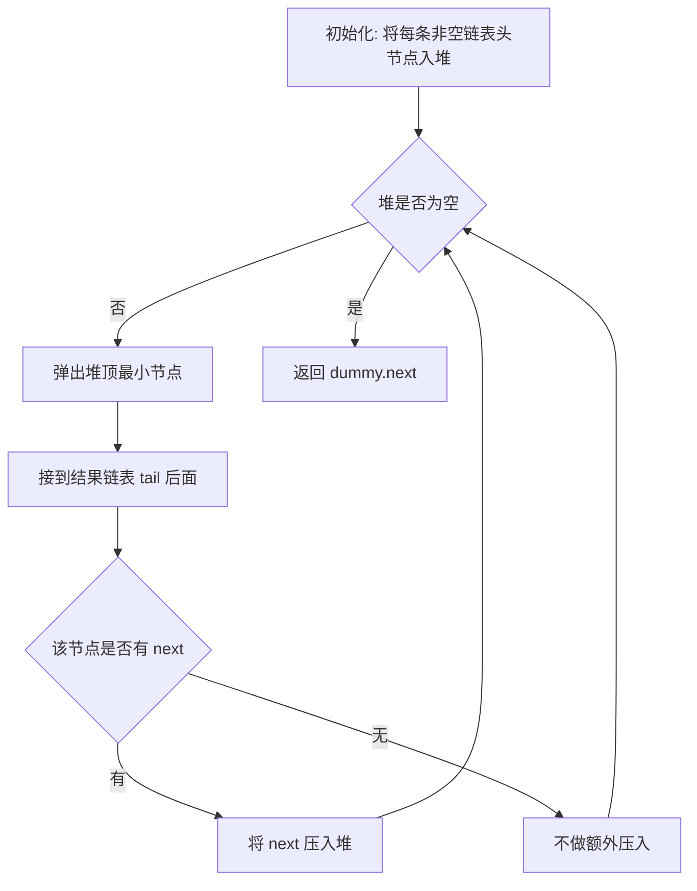
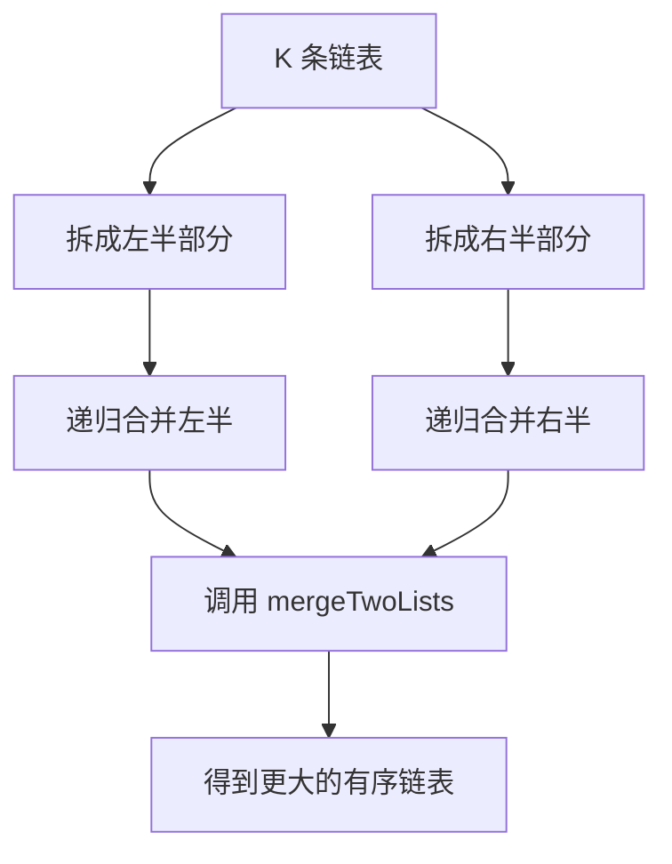

# 23. 合并 K 个升序链表 - 思路分析

## 📋 题目信息
- **难度**：困难
- **标签**：链表、堆、优先队列、分治、归并、Dummy Head
- **来源**：LeetCode

## 📖 题目描述

给你一个链表数组 `lists`，其中每个链表都已经按升序排列。现在要做的事情不是只合并两条链表，而是把 **K 条已经排好序的链表** 一次性合并成一条新的升序链表，并返回合并后的头节点。

这道题如果只看表面，很容易把它理解成 `21. 合并两个有序链表` 的简单放大版；但真正写起来就会发现，`K=2` 和 `K>2` 在思维方式上差别很大。两条链表时，我们每一轮只需要比较两个当前头节点；而现在有 K 条链表，意味着每一轮都要从 **K 个候选头节点** 里选出当前全局最小的那个。这正是本题从简单题跨到困难题的核心变化。

### 示例

**示例 1：**

```text
输入：lists = [[1,4,5],[1,3,4],[2,6]]
输出：[1,1,2,3,4,4,5,6]
解释：链表数组如下：
[
  1->4->5,
  1->3->4,
  2->6
]
将它们合并到一个有序链表中得到：
1->1->2->3->4->4->5->6
```

这个示例最值得注意的地方是：答案中的下一个节点，有时候来自第一条链表，有时候来自第二条，有时候来自第三条。也就是说，我们不能只盯着其中两条链表局部比较，而必须具备“从多路候选里挑当前最小值”的能力。

**示例 2：**

```text
输入：lists = []
输出：[]
```

这说明链表数组本身可能为空，也就是 `k = 0`。这种情况下当然没有任何节点可以合并，直接返回空链表即可。

**示例 3：**

```text
输入：lists = [[]]
输出：[]
```

这说明即使链表数组非空，里面的每条链表也可能本身就是空链表。写代码时，不能想当然地把所有 `lists[i]` 都当成有效头节点来处理。

### 约束条件

- `k == lists.length`
- `0 <= k <= 10^4`
- `0 <= lists[i].length <= 500`
- `-10^4 <= lists[i][j] <= 10^4`
- `lists[i]` 按 **升序** 排列
- `lists[i].length` 的总和不超过 `10^4`

### 原题提供的 Python 模板

```python
# Definition for singly-linked list.
# class ListNode:
#     def __init__(self, val=0, next=None):
#         self.val = val
#         self.next = next
class Solution:
    def mergeKLists(self, lists: List[Optional[ListNode]]) -> Optional[ListNode]:
        
```

---

## 🤔 题目分析

### 1. 先把题目翻译成人话

这道题真正问的不是“你会不会合并链表”，而是：**当你面前同时摆着 K 条已经排好序的链表时，你能不能每次都快速找出所有候选头节点里最小的那个，并把它稳定地接到答案后面？** 只要这句话想清楚，本题的难点就会一下子清晰起来。

两条链表时，我们天然会想到双指针：一个指向第一条链表头，一个指向第二条链表头，然后比较谁小。可是一旦扩展到 K 条链表，这种“固定两个指针比较”的思路就不够用了，因为当前最小值不再只可能出现在两个地方，而是可能出现在 K 个地方中的任意一个地方。因此，本题的本质已经不再是简单的“双指针题”，而是 **K 路有序归并问题**。

### 2. 为什么 `K` 的出现让问题本质发生变化

如果说 `21. 合并两个有序链表` 的核心是“两个局部最小值之间选全局最小值”，那么本题的核心就是“**K 个局部最小值之间选全局最小值**”。这个变化看上去只是把 `2` 换成了 `K`，但算法结构却完全升级了。

原因很简单：对于每一条已经升序排列的链表来说，它当前头节点就是这条链表剩余部分中的最小值。所以在任意时刻，整道题的“下一位答案”一定只可能出现在 K 条链表的当前头节点之中。问题就被压缩成了一个更抽象的版本：

- 现在有 K 个候选值。
- 我们要高频地取出其中最小的一个。
- 取出之后，对应来源链表会暴露出下一个候选值。
- 然后我们还得继续重复同样的操作，直到所有节点都被取完。

你会发现，这已经不是一个单纯的链表拼接题了，而是“**链表 + 高效最小值维护**”的组合问题。

### 3. 本题真正考察的是什么

这道题至少在考三层能力。

第一层，是你能不能识别出它和 `21` 的继承关系。因为无论你最终选堆还是选分治，底层都离不开“合并两条有序链表”的基础模板。换句话说，`21` 是这道题的地基。

第二层，是你能不能意识到“顺序一条一条合并”虽然能做，但效率不够高。很多困难题的关键不在于“有没有办法做出来”，而在于“有没有办法把复杂度压到合理级别”。本题就是典型代表。

第三层，是你能不能为“频繁从 K 个候选中选最小值”找到合适的数据结构或组织方式。主流答案通常有两个方向：

- 用 **最小堆 / 优先队列**，随时维护 K 个候选头节点中的最小值。
- 用 **分治两两归并**，把 K 路归并降解成多轮两路归并。

因此，这道题真正训练的不是单点技巧，而是：**你是否能把已有模板升级成多路场景，并选择适合的整体组织结构。**

### 4. 为什么它不再是普通双指针题

有些同学看到题目分类在“链表双指针”附近，就会下意识想继续用两个指针解决。但这里要非常明确：本题虽然依然和链表指针有关，却已经不是“两个指针就能覆盖状态空间”的问题了。双指针之所以在 `21` 中成立，是因为候选只有两个，而现在候选变成了 K 个。

如果你强行想把 K 条链表都放在一个大 while 循环里逐一比较当前头节点，当然也不是绝对写不出来，但那样每取出一个节点，都可能需要扫描 K 条链表去找最小值，总代价会变得很大。这正说明了一个重要事实：**不是所有链表题都该硬套双指针模板，候选数量扩大后，组织方式必须跟着升级。**

### 5. 我们先统一记号，避免复杂度讨论混乱

为了后面讲复杂度更清楚，这里统一一下常用记号：

- `k`：链表的条数。
- `N`：所有链表节点总数，也就是 `lists[i].length` 的总和。

后面你会看到：

- 暴力取值排序重建的复杂度是 `O(N log N)`。
- 顺序两两合并的复杂度通常记为 `O(Nk)`。
- 最小堆方法是 `O(N log k)`。
- 分治两两归并也是 `O(N log k)`。

为什么最终优秀答案都落在 `log k` 而不是 `k` 上？因为真正的优化目标不是减少节点数处理次数——每个节点总归都得处理一次——而是降低“从 K 个候选中选最小值”这件事的成本。

### 6. 本题与 `21. 合并两个有序链表` 的关系

这题和 `21` 的关系非常像“模块”和“系统”的关系。`21` 教会你的是：如何把 **两条** 有序链表稳定地线性归并。那道题的经典写法里，我们会用 `dummy head` 和 `tail` 尾指针维护结果链表，然后让两个输入指针谁小谁先接上，直到有一方耗尽，最后整体接上剩余部分。

而本题做的事情，其实是把这套两路归并能力扩展到 K 路场景。扩展方式主要有两种：

- **分治法**：把 K 条链表两两配对，每一轮都调用一次 `mergeTwoLists`，最终把 K 路问题拆成若干个两路问题。
- **顺序合并法**：从第一条链表开始，不断把当前结果和下一条链表用 `mergeTwoLists` 合并。

所以可以非常明确地说：**不会 `21`，这题很难做顺；但只会 `21`，还不足以把这题做优。**

### 7. 本题有哪些自然思路

如果我们把思路从朴素到高级排一遍，大致会有四种层次。

第一种，最直白也最不“链表味”的：把所有节点值取出来，扔进数组，排个序，再重建链表。能做，但浪费了输入链表原本已经有序这个条件。

第二种，稍微进步一点：把 K 条链表按顺序一条一条并进结果链表，每次调用一次 `mergeTwoLists`。它已经开始真正利用 `21` 的模板了，但复杂度通常还是不够优雅。

第三种，主流主解：用一个最小堆维护“当前 K 个候选头节点”，每次弹出最小头节点，并把它后继节点重新压入堆中。这样就能把“全局选最小”的成本压到 `log k`。

第四种，同样优秀但思维风格不同：分治两两归并。每一轮把链表成对合并，像归并排序那样做 `log k` 轮，总体也是 `O(N log k)`。

这四种思路非常适合用来构建一篇教学文档，因为它们清楚展示了“从能做出来，到做得漂亮”的优化路径。

### 8. 为什么“下一位答案”一定来自 K 个头节点

这是本题的理论基础。因为每条链表本身已经升序，所以对任意一条链表而言，它当前头节点一定是这条链表尚未处理部分中的最小值。那么放到所有链表一起看，整个系统中当前全局最小值，必然出现在这 K 个“局部最小值”之中。

这句话听起来抽象，但其实很好理解。你可以把每条链表都想象成一列从小到大排好的火车车厢，每列火车最前面那节车厢就是这列火车剩余部分的最小编号。全场最小编号，不可能藏在某列火车后面，因为它早该排到这列火车最前面去了。所以你只需要在每列火车当前的“第一节车厢”之间做选择。

这个观察一旦成立，整道题就只剩下一个核心问题：**我们该如何高效地维护这 K 个候选头节点？**

### 9. 一句话突破口

如果必须把本题突破口压缩成一句话，那就是：**把问题看成 K 路有序归并，要么用最小堆维护 K 个当前头节点，要么把 K 条链表分治成多轮两两归并。**

---

## 💡 解题思路

### 方法一：收集所有值，排序后重建链表

#### 🌟 形象化理解：把所有车厢编号抄下来，重新造一列新火车

先故意不利用链表结构本身，只想一个最容易想到的办法。想象你面前有 K 列已经各自排好序的火车车厢，但你不想处理“多路归并”这种稍微抽象的事，于是你干脆拿个本子，把所有车厢上的编号都抄下来。等所有编号都抄完后，再把这些编号统一排序，然后按照排序结果重新造出一列全新的火车。

在这个类比中：

- K 条升序链表 = K 列已经排好序的火车车厢。
- 遍历节点取值 = 抄下每节车厢的编号。
- 排序数组 = 把所有编号重新排成全局升序。
- 重建链表 = 按排序后的顺序重新造一列新火车。

这个方法当然能得到正确答案，而且理解门槛非常低，但它明显没有利用“每条链表本来就有序”的信息，更没有真正训练链表指针能力。

#### 思路说明

具体做法是：遍历 `lists` 中的每一条链表，把所有节点值全部收集到一个数组 `values` 里。等所有链表都扫完后，对 `values` 做一次整体排序。随后新建一个虚拟头节点 `dummy` 和尾指针 `tail`，按排序结果依次创建新节点并接到结果链表尾部，最后返回 `dummy.next`。

这个方法的好处是结构清晰、代码直观；坏处也同样明显：它没有复用原节点，额外开了一个保存全部值的数组，而且本来输入数据已经部分有序，我们却把它们全部打平后重新排序，相当于没有充分利用题目条件。

#### 算法步骤

1. 创建空数组 `values`。
2. 遍历 `lists` 中每一条链表，把所有节点值加入 `values`。
3. 对 `values` 进行整体排序。
4. 创建虚拟头节点 `dummy` 和尾指针 `tail`。
5. 依次读取排序后的每个值，创建对应新节点并尾插到结果链表。
6. 返回 `dummy.next`。

#### 复杂度分析

- **时间复杂度**：`O(N log N)`。因为收集值是 `O(N)`，整体排序是 `O(N log N)`。
- **空间复杂度**：`O(N)`。数组保存了全部节点值，重建链表时也没有复用原节点。

#### 为什么需要优化

这个方法最大的问题不是“不能做”，而是“做得太浪费”。题目已经给了我们 K 条局部有序链表，但我们却把所有信息打散后重新排了一遍。更合理的方向应该是：**直接利用这些链表已经有序的性质，在归并过程中逐步构造答案，而不是全部打平后再重排。**

---

### 方法二：顺序两两合并（基于 21 的模板）

#### 🌟 形象化理解：总站一条一条接车厢，但总列车会越来越长

想象你是火车总站的调度员。起初总列车为空，第一列火车直接作为当前结果。然后你把第二列火车并进当前结果，得到一列更长的有序火车；接着再把第三列火车并进这列更长的火车；然后再并第四列……如此反复，直到所有火车都并进来。

这个思路的关键优点是：你完全可以复用 `21. 合并两个有序链表` 的模板，不需要新发明任何底层拼接技巧。每一轮都只是做一件你已经会做的事：**把两条有序链表合成一条有序链表。**

但它的问题也很明显：随着合并进行，当前结果链表会越来越长，于是后面每一轮归并都在处理一个越来越庞大的对象，总代价会被不断放大。

#### 思路说明

先准备一个 `mergeTwoLists(a, b)` 辅助函数，写法与 `21` 题完全一致：使用 `dummy head` 和 `tail` 尾指针，谁小谁先接，最后把剩余部分整体接上。然后在主函数里用一个变量 `merged` 表示“当前已经合并好的结果链表”，初始为空。接下来从左到右遍历 `lists`，把 `merged` 与当前链表不断做两两合并，直到遍历结束。

这个方法的教学价值很高，因为它把本题和 `21` 的关系展现得非常直接：K 路问题被简单地还原成了多次两路问题。但它并不是本题最优解，因为合并顺序过于“线性”，没有尽量平衡每轮归并规模。

#### 算法步骤

1. 编写 `mergeTwoLists(a, b)`，作为两路归并模板。
2. 初始化 `merged = None`。
3. 按顺序遍历 `lists` 中每一条链表。
4. 令 `merged = mergeTwoLists(merged, current_list)`。
5. 遍历结束后，返回 `merged`。

#### 复杂度分析

- **时间复杂度**：`O(Nk)`。直观理解是：如果有很多条链表，每轮都拿“当前累计结果”去和下一条链表合并，那么前面已经合并过的节点会被反复扫描多次。在平均每条链表长度相近时，总成本类似 `n + 2n + 3n + ... + kn = O(nk^2)`，而由于 `N = kn`，于是可写成 `O(Nk)`。
- **空间复杂度**：`O(1)` 额外空间（不算辅助递归栈），因为底层两路归并可以直接复用原节点。

#### 为什么还需要优化

这个方法的问题不在正确性，而在“重复劳动”太多。越早进入结果链表的节点，就越可能在后续多轮合并中被反复比较和扫描。我们真正想要的，是让每个节点大致只在 `log k` 个层级中参与选择或合并，而不是在最坏情况下参与接近 `k` 轮处理。这就把我们引向两个更优方向：**最小堆** 和 **分治归并**。

---

### 方法三：最小堆 / 优先队列（主解）

#### 🌟 形象化理解：总调度台始终盯着 K 条轨道最前面的车厢

想象现在不是你一条一条慢慢并火车，而是在一个大型调度中心里，同时有 K 条有序轨道通向总车站。每条轨道最前面那节车厢，都是该轨道目前能拿出来的最小编号车厢。调度台前放着一个“最小编号候选表”，上面只登记每条轨道当前最前面的那节车厢。每次发车时，总调度员都从这张候选表中拿出编号最小的那节车厢接到总列车后面；而这节车厢所在轨道的下一节车厢，就立刻补进候选表里，等待下一轮比较。

这张“候选表”如果用普通数组实现，每次找最小值都要扫一遍 K 个元素；但如果用 **最小堆** 实现，取出当前最小值和插入新的候选，都只需要 `O(log k)`。也就是说，最小堆本质上是在帮我们高效维护“当前 K 个局部最小值中的全局最小值”。

#### 对应关系

- K 条升序链表 = K 条有序轨道。
- 每条链表当前头节点 = 该轨道当前最前面的一节车厢。
- 最小堆 = 总调度台上的“最小候选表”。
- 弹出堆顶 = 选出当前全局最小节点。
- 将 `node.next` 入堆 = 把该轨道的下一节车厢补进候选区。
- `dummy + tail` = 正在被逐步拼接出来的总列车。

#### 核心理解

这道题的关键其实不在于“怎么把节点接起来”，因为拼接结果链表本身和 `21` 一样，依旧是一个 `dummy + tail` 的尾插过程。真正的难点是：**每一轮如何快速决定“下一位是谁”**。在 K 路场景下，最小堆正好解决了这个问题。

每个时刻，堆里只需要放 **每条非空链表的当前头节点**，因此堆大小最多是 `k`。每次从堆顶弹出最小节点，把它接到结果链表尾部；如果这个节点后面还有后继节点，就把后继重新压入堆中。这样不断重复，直到堆为空，说明所有节点都已经被取完。

你会发现，这个过程特别像“多路归并的在线版”：

- 堆顶始终代表当前全局最小候选。
- 弹出一个节点后，只会有一个新候选补上。
- 因此每个节点恰好入堆一次、出堆一次，处理节奏非常干净。

#### 为什么这就是 `O(N log k)`

把复杂度看清楚，整题就彻底通了。总共有 `N` 个节点。每个节点最多会发生两件和堆有关的事：

1. 它第一次成为某条链表的当前头节点时，被压入堆一次。
2. 它被选中进入结果链表时，从堆里弹出一次。

堆的大小始终不超过 `k`，因此每次 `push` 或 `pop` 的代价都是 `O(log k)`。于是总复杂度就是 `N` 次级别的堆操作乘上单次 `log k`，得到：

```text
O(N log k)
```

这是比顺序两两合并的 `O(Nk)` 更好的量级，尤其当 `k` 比较大时差距非常明显。

#### Python 实现里为什么不能直接把节点放进堆

这是本题一个非常经典的实现细节。Python 的 `heapq` 维护的是最小堆，但它要求堆中元素之间可比较。如果你直接把 `ListNode` 对象压入堆，当两个节点值不同还好，Python 会先比元组第一个元素；可一旦两个节点值相同，而堆元素里没有第二个可比较字段，Python 就会尝试比较两个 `ListNode` 对象本身，结果会报错：

```python
TypeError: '<' not supported between instances of 'ListNode' and 'ListNode'
```

因此，Python 主解里通常要把元素写成三元组：

```python
(node.val, idx, node)
```

这里：

- `node.val` 用来保证按值排序。
- `idx` 作为平手时的稳定次关键字，确保即便值相同也能比较。
- `node` 才是我们真正想要的链表节点对象。

这个技巧非常重要，几乎是 Python 版最小堆解法的必考点。

#### 为什么这个方法一定正确

正确性可以从归纳角度理解。任意时刻，堆中维护的是所有非空链表的当前头节点，而这些头节点分别代表各自链表剩余部分的最小值。于是堆顶就是所有候选中的全局最小值，理应作为结果链表的下一位。弹出它之后，该节点所在链表如果还有后继，那么这个后继就成为该链表新的局部最小值，因此只需要把它重新压入堆中即可。如此反复，每一步都选中了当前全局最小节点，最终拼出来的整条链表自然是升序的。

#### 算法步骤

1. 创建空最小堆 `heap`。
2. 遍历 `lists`，把每条非空链表的头节点压入堆中，形式为 `(node.val, idx, node)`。
3. 创建结果链表的 `dummy` 和 `tail`。
4. 当堆不为空时：
   - 弹出堆顶，拿到当前最小节点 `node`。
   - 把 `node` 接到 `tail.next`，并让 `tail` 后移。
   - 如果 `node.next` 不为空，则将 `node.next` 重新压入堆中。
5. 循环结束后，返回 `dummy.next`。

#### 复杂度分析

- **时间复杂度**：`O(N log k)`。每个节点都恰好经历一次入堆和一次出堆，堆大小不超过 `k`。
- **空间复杂度**：`O(k)`。堆中最多同时存在每条链表的一个当前头节点。

#### 💭 回顾类比

把最小堆看成总调度台上的“候选头节点看板”，整件事就特别自然了：每条轨道只上报自己当前最前面的车厢，调度台每次只把最小编号车厢发出去，然后让对应轨道补上下一节车厢。你并不需要每次重新看所有历史车厢，也不需要把所有车厢提前打平成一堆数据。你真正维护的，只是“当前最值得比较的那 K 个入口”。

---

### 方法四：分治两两归并

#### 🌟 形象化理解：锦标赛式配对合并，层层晋级

想象有 K 支已经各自排好序的队伍参加锦标赛。第一轮，让它们两两配对，各自合并成更大的有序队伍；第二轮，再把这些更大的队伍两两合并；如此反复，直到只剩下一支最终队伍。整个过程非常像归并排序中的“分而治之”：不是一口气同时处理 K 路，而是通过多轮、平衡的两两合并，把 K 路问题分解成若干个两路问题。

和顺序两两合并相比，这种方式的关键优势在于“更平衡”。顺序合并是不断拿一个越来越长的结果去和下一个新链表合并，导致前面节点被反复参与太多轮；而分治法尽量让每轮参与归并的链表规模相近，因此每个节点只会经历大约 `log k` 轮归并层级。

#### 思路说明

最常见写法有两种。

第一种是递归分治：把 `lists` 拆成左右两半，分别递归合并，再用 `mergeTwoLists` 把左右结果拼起来。

第二种是迭代式区间翻倍：第一轮合并下标间隔为 `1` 的链表对，第二轮合并间隔为 `2` 的链表对，第三轮间隔为 `4` ……直到覆盖全部链表。

从讲解角度看，递归版更容易体现“分治思想”；从实现角度看，迭代版更接近底层归并排序的写法。这里我们重点讲递归版，因为它更利于建立结构化理解。

#### 为什么它同样是 `O(N log k)`

分治法一共有大约 `log k` 轮归并层级。每一层里，所有链表节点加起来都会被处理一遍，因此每一层代价大约是 `O(N)`。总共有 `log k` 层，于是总复杂度是：

```text
O(N log k)
```

你会发现，这和堆方法的复杂度相同，但思维方式完全不同：

- 堆法是“实时从 K 个头节点中选最小”。
- 分治法是“把 K 路问题分成多轮两路归并”。

它们没有谁在理论上绝对碾压谁，更多是组织方式不同、常数和实现偏好不同。

#### 为什么分治离不开 `mergeTwoLists`

这道题里，分治法其实是在不断重复调用 `21` 的两路合并模板。也就是说，`21` 的 `mergeTwoLists` 是这道题分治写法的底层积木块。没有这个积木块，你很难优雅地把 K 路问题拆成多轮两路问题；而一旦你已经掌握它，分治法几乎就是顺理成章的升级。

这也是为什么说：**`23` 不是脱离 `21` 的新知识，而是以 `21` 为模块做出的更高层组合。**

#### 算法步骤

1. 如果 `lists` 为空，直接返回 `None`。
2. 定义递归函数 `merge_range(left, right)`，用于合并 `lists[left:right+1]`。
3. 若 `left == right`，直接返回这一条链表。
4. 计算中点 `mid`，递归合并左半部分与右半部分。
5. 用 `mergeTwoLists` 把左右结果再合并成一个总结果。
6. 返回 `merge_range(0, len(lists)-1)`。

#### 复杂度分析

- **时间复杂度**：`O(N log k)`。共有 `log k` 层归并，每层合并总节点数约为 `N`。
- **空间复杂度**：递归写法为 `O(log k)` 递归栈；若用迭代式区间翻倍，可以做到额外 `O(1)`（不算链表节点本身）。

#### 💭 回顾类比

把它想成锦标赛就很好理解了：第一轮先让小组内部配对，第二轮让上一轮晋级者再配对，最终经过多轮合并只剩一支大队伍。这个结构为什么高效？因为每个节点不会像顺序合并那样长期留在“超长总链表”里被反复扫来扫去，而是只在有限的、平衡的几轮中参与合并。

---

## 🎨 图解说明

### 1. 主解示例：最小堆执行过程

我们以题目示例为例：

```text
lists = [
  1 -> 4 -> 5,
  1 -> 3 -> 4,
  2 -> 6
]
```

初始时，三条链表的头节点分别是 `1, 1, 2`。我们把它们全部放进最小堆，堆中维护的其实是三条链表当前的“最前候选节点”。此时结果链表还为空，只建立了：

```text
dummy -> None
tail 指向 dummy
```

### 2. 第 1 轮

堆中候选：

```text
(1, list0), (1, list1), (2, list2)
```

弹出最小值 `1`（来自第一条链表），把它接到结果链表后面：

```text
dummy -> 1
```

然后把这条链表的下一个节点 `4` 压入堆中。此时堆里候选变成：

```text
(1, list1), (2, list2), (4, list0)
```

### 3. 第 2 轮

继续弹出堆顶 `1`（来自第二条链表），结果链表变成：

```text
dummy -> 1 -> 1
```

然后把第二条链表的下一个节点 `3` 压入堆中，候选变成：

```text
(2, list2), (3, list1), (4, list0)
```

### 4. 第 3 轮

弹出堆顶 `2`（来自第三条链表），结果链表变成：

```text
dummy -> 1 -> 1 -> 2
```

然后把第三条链表的下一个节点 `6` 压入堆中，候选变成：

```text
(3, list1), (4, list0), (6, list2)
```

### 5. 后续轮次

后面的过程就完全一样：每次只做“弹最小、接到尾部、补上该链表下一节点”这三个动作。继续执行后，结果链表依次变为：

```text
1 -> 1 -> 2 -> 3
1 -> 1 -> 2 -> 3 -> 4
1 -> 1 -> 2 -> 3 -> 4 -> 4
1 -> 1 -> 2 -> 3 -> 4 -> 4 -> 5
1 -> 1 -> 2 -> 3 -> 4 -> 4 -> 5 -> 6
```

最终得到答案：

```text
1 -> 1 -> 2 -> 3 -> 4 -> 4 -> 5 -> 6
```

### 6. 最小堆方法状态表

| 轮次 | 堆中最小候选 | 弹出节点 | 是否压入后继 | 结果链表 |
| --- | --- | --- | --- | --- |
| 初始 | `1, 1, 2` | 无 | 无 | 空 |
| 1 | `1` | 第一条链表的 `1` | 压入 `4` | `1` |
| 2 | `1` | 第二条链表的 `1` | 压入 `3` | `1 -> 1` |
| 3 | `2` | 第三条链表的 `2` | 压入 `6` | `1 -> 1 -> 2` |
| 4 | `3` | 第二条链表的 `3` | 压入 `4` | `1 -> 1 -> 2 -> 3` |
| 5 | `4` | 第一条或第二条链表的 `4` | 视来源压入后继 | `1 -> 1 -> 2 -> 3 -> 4` |
| 6 | `4` | 另一条链表的 `4` | 视来源压入后继 | `1 -> 1 -> 2 -> 3 -> 4 -> 4` |
| 7 | `5` | 第一条链表的 `5` | 无 | `1 -> 1 -> 2 -> 3 -> 4 -> 4 -> 5` |
| 8 | `6` | 第三条链表的 `6` | 无 | `1 -> 1 -> 2 -> 3 -> 4 -> 4 -> 5 -> 6` |

这个表格最关键地展示了一点：**堆里永远只维护当前 K 条链表的入口节点，而不是维护所有节点。** 这就是堆空间只有 `O(k)` 的根本原因。

### 7. 为什么“全局下一位”不能只看两条链表

还拿示例来说。假设你当前只盯着前两条链表，那么在某一轮你可能会看到候选是 `4` 和 `3`，于是你觉得下一位应该是 `3`。可如果第三条链表当前头节点其实是 `2`，那真正的全局下一位应该是 `2`，你这个局部判断立刻就错了。这个例子说明：**一旦候选来源超过两个，局部两两比较不再足够，必须有维护全局最小候选的机制。**

### 8. 分治法图解

对于同样的示例，分治归并可以画成下面这样：

```text
第一轮：
[1->4->5]   与   [1->3->4]   合并成   [1->1->3->4->4->5]
[2->6]      单独保留

第二轮：
[1->1->3->4->4->5] 与 [2->6]
合并成 [1->1->2->3->4->4->5->6]
```

如果链表更多，比如 8 条，分治法就会形成更明显的树状结构：每一轮都把链表数量大致减半，直到只剩一条链表。

### 9. Mermaid 图示：最小堆流程



### 10. Mermaid 图示：分治归并结构



### 11. 边界情况一览

| 情况 | 示例 | 正确处理方式 |
| --- | --- | --- |
| `lists` 本身为空 | `[]` | 直接返回 `None` |
| `lists` 里全是空链表 | `[[], [], []]` | 初始化堆时不会压入任何节点，最后返回空链表 |
| 只有一条非空链表 | `[[], 1->2->3, []]` | 最终结果就是该链表本身 |
| 存在重复值 | `[[1,4],[1,3],[1,2]]` | 最小堆中需正确处理平手，Python 版需加辅助比较字段 |
| `k` 很大但总节点数不大 | 很多空链表 + 少量非空链表 | 仍然只把非空头节点入堆，复杂度受实际有效头节点影响 |

### 12. 一个很重要的实现细节图解：Python 堆中的平手问题

假设你往 Python 的堆里压入：

```python
(1, nodeA)
(1, nodeB)
```

当两个值同为 `1` 时，`heapq` 会继续尝试比较 `nodeA` 和 `nodeB`，而 `ListNode` 对象本身没有定义大小关系，于是报错。因此主解必须用：

```python
(1, idxA, nodeA)
(1, idxB, nodeB)
```

这样即使第一个值相同，也可以比较第二个字段 `idx`，从而避免把比较落到 `ListNode` 对象本身。这是很多人第一次写 Python 堆解法时最容易踩的坑。

---

## ✏️ 代码框架填空

> **💡 学习提示**：这道题真正要记住的不是一整段完整代码，而是主解的几个固定动作：把所有非空头节点入堆、每次弹出最小节点、把它接到结果链表尾部、再把它的后继压回堆中。只要这套动作顺序形成肌肉记忆，主解就很难写乱。

### Python 填空版（最小堆主解）

```python
import heapq

# Definition for singly-linked list.
# class ListNode:
#     def __init__(self, val=0, next=None):
#         self.val = val
#         self.next = next

class Solution:
    def mergeKLists(self, lists: List[Optional[ListNode]]) -> Optional[ListNode]:
        # 🔹 填空1：准备最小堆
        heap = ______

        # 🔹 填空2：把每条非空链表的头节点入堆
        for idx, node in enumerate(lists):
            if ______:
                heapq.heappush(heap, (______, ______, ______))

        # 🔹 填空3：创建结果链表的虚拟头节点和尾指针
        dummy = ______
        tail = ______

        # 🔹 填空4：持续从堆中取出当前最小节点
        while ______:
            val, idx, node = ______

            # 🔹 填空5：接到结果链表尾部
            tail.next = ______
            tail = ______

            # 🔹 填空6：如果当前节点还有后继，就重新压入堆
            if ______:
                heapq.heappush(heap, (______, ______, ______))

        # 🔹 填空7：返回真正答案头节点
        return ______
```

### Python 填空提示详解

**填空 1**：这里当然应该是一个空列表 `[]`，因为 Python 的 `heapq` 是基于普通列表维护堆结构的。不要误以为需要某个专门的 `Heap` 类，标准库里最小堆就是用列表承载。

**填空 2**：遍历 `lists` 时，只有非空链表的头节点才有资格成为候选节点，所以条件必须是 `if node:`。压入堆时不能只放 `node`，也不能只放 `(node.val, node)`，主流稳妥写法是 `(node.val, idx, node)`。其中 `idx` 的作用不是表示顺序逻辑，而是给 Python 一个在值相同情况下仍然可比较的第二关键字。

**填空 3**：和 `21` 一样，结果链表最好仍然使用 `dummy head`。所以应写成 `dummy = ListNode(0)`，`tail = dummy`。这样第一轮接节点和后面每一轮接节点的逻辑完全统一，不需要为“结果链表还没头节点”单独写分支。

**填空 4**：主循环的条件当然是“堆里还有候选节点”，也就是 `while heap:`。弹出当前最小节点则是 `heapq.heappop(heap)`。这一步本质上就是“从 K 个当前候选头节点中选出全局最小的那个”。

**填空 5**：被弹出的 `node` 就是当前应该接到答案里的下一个节点，所以要写 `tail.next = node`，然后让 `tail = tail.next`。这仍然是经典的链表尾插模板。

**填空 6**：如果 `node.next` 不为空，说明该节点所在链表还有剩余部分，而新的局部最小值就是它的后继节点。因此要把 `(node.next.val, idx, node.next)` 重新压入堆中。这里依然沿用原来的 `idx` 作为这条链表的平手辅助编号。

**填空 7**：和所有 dummy head 题一样，真正的答案头节点不是 `dummy` 自己，而是 `dummy.next`。

### C++ 填空版（最小堆主解）

```cpp
/**
 * Definition for singly-linked list.
 * struct ListNode {
 *     int val;
 *     ListNode *next;
 *     ListNode() : val(0), next(nullptr) {}
 *     ListNode(int x) : val(x), next(nullptr) {}
 *     ListNode(int x, ListNode *next) : val(x), next(next) {}
 * };
 */
class Solution {
public:
    struct Compare {
        bool operator()(ListNode* a, ListNode* b) {
            return ______;
        }
    };

    ListNode* mergeKLists(vector<ListNode*>& lists) {
        // 🔹 填空1：创建小顶堆
        priority_queue<ListNode*, vector<ListNode*>, Compare> pq;

        // 🔹 填空2：把所有非空头节点压入堆
        for (ListNode* node : lists) {
            if (______) {
                pq.push(______);
            }
        }

        // 🔹 填空3：创建结果链表
        ListNode dummy(0);
        ListNode* tail = ______;

        // 🔹 填空4：持续弹出最小节点
        while (______) {
            ListNode* node = ______;
            pq.pop();

            tail->next = ______;
            tail = ______;

            // 🔹 填空5：压入后继节点
            if (______) {
                pq.push(______);
            }
        }

        // 🔹 填空6：返回答案
        return ______;
    }
};
```

### C++ 填空提示

这部分和 Python 主解思想完全一致，只是语言写法不同。最重要的点有三个。第一，C++ 的 `priority_queue` 默认是大顶堆，所以我们要自己提供比较器，让值更小的节点拥有更高优先级；第二，C++ 可以直接把 `ListNode*` 放进优先队列，因为比较规则由比较器控制，不像 Python 那样需要额外的平手字段；第三，链表尾插依然是 `dummy + tail` 这个稳定模板。

---

## 💻 完整代码实现

> **✅ 对照检查**：建议先自己补完填空再看完整代码。因为本题真正要建立的不是“我认识这段代码”，而是“我知道每个动作为什么要这么写”。

### Python 实现（最小堆主解）

```python
import heapq
from typing import List, Optional


class ListNode:
    def __init__(self, val=0, next=None):
        self.val = val
        self.next = next


class Solution:
    def mergeKLists(self, lists: List[Optional[ListNode]]) -> Optional[ListNode]:
        # 最小堆中存储三元组：
        # (节点值, 链表编号, 节点对象)
        # 这样在节点值相同的时候，Python 仍能用链表编号继续比较，
        # 避免直接比较 ListNode 对象导致报错。
        heap = []

        # 把每条非空链表的头节点先放入堆中
        for idx, node in enumerate(lists):
            if node:
                heapq.heappush(heap, (node.val, idx, node))

        # 使用 dummy head 统一处理结果链表头节点问题
        dummy = ListNode(0)
        tail = dummy

        # 每次从堆中弹出当前全局最小节点
        while heap:
            _, idx, node = heapq.heappop(heap)

            # 接到结果链表尾部
            tail.next = node
            tail = tail.next

            # 如果当前节点所在链表还有后继节点，
            # 则把新的候选头节点重新压入堆中
            if node.next:
                heapq.heappush(heap, (node.next.val, idx, node.next))

        return dummy.next
```

### Python 代码逐段解析

先看初始化部分。`heap = []` 看起来只是普通列表，但配合 `heapq` 就承担了最小堆的角色。之后遍历 `lists`，把每条非空链表的头节点压入堆中，这一步本质上是在建立“当前所有有效候选头节点”的集合。注意这里我们压入的是三元组，而不是节点本身，这完全是为了适配 Python 的比较规则。

再看结果链表部分。`dummy` 和 `tail` 的角色与 `21` 完全一样：`dummy` 负责消除头节点分支，`tail` 负责稳定尾插。也就是说，本题虽然引入了堆，但“链表怎么接”这件事一点都没有变，仍然是那个你在 `21` 里已经熟悉的基本模板。

最后看主循环。每一轮 `heappop` 都是在做“从 K 个当前候选头节点中选出全局最小值”。把这个最小节点接入答案后，唯一需要补充的新候选，只会来自它原链表的后继节点，因此如果 `node.next` 存在，就把它重新压回堆里。整轮逻辑的结构极其工整：**弹最小 → 接结果 → 补后继**。只要这三步顺序不乱，代码就很稳定。

### Python 填空答案解析

- **填空 1**：`[]`
- **填空 2**：`node`、`node.val`、`idx`、`node`
- **填空 3**：`ListNode(0)`、`dummy`
- **填空 4**：`heap`、`heapq.heappop(heap)`
- **填空 5**：`node`、`tail.next`
- **填空 6**：`node.next`、`node.next.val`、`idx`、`node.next`
- **填空 7**：`dummy.next`

### Python 实现（分治补充）

```python
from typing import List, Optional


class ListNode:
    def __init__(self, val=0, next=None):
        self.val = val
        self.next = next


class Solution:
    def mergeKLists(self, lists: List[Optional[ListNode]]) -> Optional[ListNode]:
        if not lists:
            return None

        def mergeTwoLists(a: Optional[ListNode], b: Optional[ListNode]) -> Optional[ListNode]:
            dummy = ListNode(0)
            tail = dummy

            while a and b:
                if a.val <= b.val:
                    tail.next = a
                    a = a.next
                else:
                    tail.next = b
                    b = b.next
                tail = tail.next

            tail.next = a if a else b
            return dummy.next

        def merge_range(left: int, right: int) -> Optional[ListNode]:
            if left == right:
                return lists[left]

            mid = (left + right) // 2
            left_merged = merge_range(left, mid)
            right_merged = merge_range(mid + 1, right)
            return mergeTwoLists(left_merged, right_merged)

        return merge_range(0, len(lists) - 1)
```

### 分治补充代码解析

这份补充代码最值得看的地方，不是 `mergeKLists` 本身，而是它如何把 `21` 题的 `mergeTwoLists` 作为底层模块复用起来。`merge_range(left, right)` 负责把一个大区间拆成两个小区间，直到区间里只剩一条链表为止；然后在回溯过程中不断调用 `mergeTwoLists` 把左右结果合成更大的有序链表。换句话说，分治法真正做的事情，是把“多路合并”重新组织成一棵“不断做两路合并”的二叉树。

### C++ 实现（优先队列主解）

```cpp
#include <vector>
#include <queue>
using namespace std;

/**
 * Definition for singly-linked list.
 * struct ListNode {
 *     int val;
 *     ListNode *next;
 *     ListNode() : val(0), next(nullptr) {}
 *     ListNode(int x) : val(x), next(nullptr) {}
 *     ListNode(int x, ListNode *next) : val(x), next(next) {}
 * };
 */
class Solution {
public:
    struct Compare {
        bool operator()(ListNode* a, ListNode* b) {
            return a->val > b->val;
        }
    };

    ListNode* mergeKLists(vector<ListNode*>& lists) {
        // 小顶堆，堆顶始终是当前值最小的节点
        priority_queue<ListNode*, vector<ListNode*>, Compare> pq;

        // 先把所有非空链表的头节点入堆
        for (ListNode* node : lists) {
            if (node) {
                pq.push(node);
            }
        }

        // dummy 用来统一处理结果头节点
        ListNode dummy(0);
        ListNode* tail = &dummy;

        while (!pq.empty()) {
            ListNode* node = pq.top();
            pq.pop();

            // 把当前最小节点接到结果尾部
            tail->next = node;
            tail = tail->next;

            // 该节点所在链表若还有后继，则继续入堆
            if (node->next) {
                pq.push(node->next);
            }
        }

        return dummy.next;
    }
};
```

### C++ 与 Python 的主要差异

两份主解的思想完全一致：都维护一个只包含“当前候选头节点”的最小结构，都用 `dummy + tail` 构造结果链表。差异主要体现在语言层面。Python 的 `heapq` 是最小堆，但需要借助元组规避 `ListNode` 不可比较问题；C++ 的 `priority_queue` 默认是大顶堆，因此要自己提供比较器，把它改造成“小顶堆”效果。除此之外，流程几乎是逐句一一对应的。

### C++ 填空答案解析

- **填空 1（比较器）**：`a->val > b->val`
- **填空 2**：`node`、`node`
- **填空 3**：`&dummy`
- **填空 4**：`!pq.empty()`、`pq.top()`
- **填空 5**：`node`、`tail->next`、`node->next`、`node->next`
- **填空 6**：`dummy.next`

### 如果想复用 `21` 的 helper，这里就是模板

下面这个两路合并模板，是本题顺序两两合并和分治两两归并的共同基础。你会发现它其实和 `21. 合并两个有序链表` 的核心代码完全一致：

```python
def mergeTwoLists(a, b):
    dummy = ListNode(0)
    tail = dummy

    while a and b:
        if a.val <= b.val:
            tail.next = a
            a = a.next
        else:
            tail.next = b
            b = b.next
        tail = tail.next

    tail.next = a if a else b
    return dummy.next
```

真正会做本题的人，往往不是单纯记住 `mergeKLists` 代码，而是知道：**什么时候该调用这个 helper，什么时候该用堆维护 K 个头节点。**

---

## ⚠️ 易错点提醒

### 1. 误以为这是 `21` 的简单循环版

很多人第一眼会觉得“反正会合并两条链表了，那就多写几层循环就行”。这会让你很难主动想到最小堆或分治。一定要意识到，本题的难点不是“能不能调用 `mergeTwoLists`”，而是“多路场景下如何降低全局选最小的成本”。

### 2. Python 中直接把 `ListNode` 压入堆

这是最经典的坑之一。只要有两个节点值相同，Python 就可能在堆调整时尝试比较两个 `ListNode` 对象本身，直接报类型错误。最稳妥的方式是压三元组 `(node.val, idx, node)`。

### 3. 忘记只压入非空链表头节点

如果你在初始化时不判断 `if node:` 就直接入堆，空链表会带来无效数据甚至运行错误。本题的候选集合应该只包含当前真实存在的头节点。

### 4. 弹出堆顶后忘记补上 `node.next`

主解最重要的动态过程就是：弹出一个最小节点后，该链表的新候选头节点变成了它的后继。如果你忘了把 `node.next` 压回堆，这条链表后面所有节点都会永久丢失。

### 5. 结果链表尾指针忘记后移

哪怕本题核心难点在堆，也不代表链表拼接部分可以掉以轻心。`tail.next = node` 之后，必须紧跟 `tail = tail.next`。否则下一轮会继续覆盖同一个位置，结果链表结构就乱了。

### 6. 返回了 `dummy` 而不是 `dummy.next`

这和几乎所有 dummy head 题一样，是一个高频基础错误。`dummy` 只是辅助节点，真正答案头节点永远是 `dummy.next`。

### 7. 低估顺序两两合并的复杂度

不少同学看到“每次只是合并两条链表”，就误以为总复杂度仍然接近线性。问题在于你是在反复把一个越来越长的结果链表和下一条链表合并，所以很多旧节点会被反复扫描。最坏情况下它不是 `O(N log k)`，而是 `O(Nk)`。

### 8. 分治法递归边界写错

分治里最常见的问题是没处理好 `left == right` 的情况，或者当 `lists` 为空时仍然直接调用 `merge_range(0, -1)`。递归写法一定要先守住空数组边界，再处理单链表区间边界。

### 9. 以为堆法和分治法可以随便混写

这两种方法虽然复杂度同级，但组织结构完全不同。堆法是“每次选一个全局最小头节点”，分治法是“多轮两两归并”。如果在思路还没理清前把两种方法混在一起写，很容易导致代码和解释都变得不清晰。

### 10. 忽略 `lists = []` 和 `lists = [[]]` 的区别

这两个测试用例都输出空链表，但含义不同。`lists = []` 说明根本没有链表；`lists = [[]]` 说明有一条链表，但它本身为空。优秀的写法不需要对它们分别写很多特判，但你在理解题意时必须意识到它们是两个不同层级的空。

### 11. 误把本题做成“复制值题”

暴力解法中复制值重建链表是允许的教学过渡方案，但主解更推荐直接复用原节点，因为这才体现链表题的本质。尤其在分治和顺序合并中，底层 `mergeTwoLists` 就应该直接重连节点，而不是重新新建一批节点。

### 12. 调试建议：优先验证这些测试集

以下样例非常适合检查代码是否稳定：

- `lists = []`
- `lists = [[]]`
- `lists = [[1]]`
- `lists = [[1,4,5],[1,3,4],[2,6]]`
- `lists = [[1,1,1],[1,1],[1]]`
- `lists = [[], [1,2,3], []]`
- `lists = [[-3,-1],[-2,4],[0]]`

这些样例能覆盖空数组、空链表、单条链表、重复值、负数、非均匀长度等常见边界。

### 13. 一个实用的本地调试辅助函数

如果你在本地练习，下面两个函数非常有助于快速验证结果：

```python
def build_list(nums):
    dummy = ListNode(0)
    tail = dummy
    for num in nums:
        tail.next = ListNode(num)
        tail = tail.next
    return dummy.next

def to_array(head):
    result = []
    while head:
        result.append(head.val)
        head = head.next
    return result
```

然后你可以这样快速测试：

```python
lists = [
    build_list([1, 4, 5]),
    build_list([1, 3, 4]),
    build_list([2, 6])
]
ans = Solution().mergeKLists(lists)
print(to_array(ans))  # 期望输出 [1, 1, 2, 3, 4, 4, 5, 6]
```

---

## 🔗 相似题目推荐

### 1. 同类型题目

**21. 合并两个有序链表（简单）**：这是本题最直接的前置基础。它教你的不是 K 路归并，而是两路归并的底层模板。顺序两两合并和分治两两归并，本质上都要反复调用这道题里的 `mergeTwoLists`。

**148. 排序链表（中等）**：这道题的核心是链表归并排序，而归并排序的灵魂步骤恰恰就是“合并两条有序链表”。所以你会发现，`23` 和 `148` 实际上共享同一个底层归并基因。

**88. 合并两个有序数组（简单）**：虽然数据结构不同，但思想上与 `21` 和本题非常接近。它能帮助你从数组视角理解“有序归并”的普遍性。

### 2. 进阶题目

**632. 最小区间（困难）**：这题同样会涉及“从 K 个有序来源中维护当前候选”的思想，最小堆经常是关键工具。如果你在本题中真正理解了“堆里维护的是当前 K 个入口”，那做 `632` 会顺很多。

**373. 查找和最小的 K 对数字（中等）**：这道题不是链表题，但它同样体现了“不要把所有组合打平后再暴力排序，而要用堆维护当前最有希望的候选”的思想，非常适合和本题一起理解堆的使用边界。

**25. K 个一组翻转链表（困难）**：虽然主题不同，但同样要求你对链表局部结构和整体拼接关系保持极强控制力。如果你能把本题的“多模块组合”思维掌握好，再去做这题会更有把握。

### 3. 推荐学习路径

如果你在系统学习链表归并专题，我比较推荐这样的顺序：先做 `21. 合并两个有序链表`，把 Dummy Head 和两路归并模板练熟；再做 `23. 合并 K 个升序链表`，理解如何把两路归并升级到 K 路；之后做 `148. 排序链表`，体会归并思想在排序中的完整落地；最后再结合堆类题如 `373`、`632`，把“堆维护当前候选最小值”的模型彻底打通。这个顺序非常有利于建立“归并 + 堆 + 链表”的系统理解。

---

## 📚 知识点总结

### 1. 本题的核心算法是什么

本题核心其实就一句话：**K 路有序归并。** 只不过为了把这句话真正落地，我们有两种主流组织方式：一种是用最小堆维护 K 个当前候选头节点，从而实时选出全局最小值；另一种是用分治法把 K 路问题拆成多轮两路归并，从而借助 `mergeTwoLists` 模板逐层合并。

### 2. 本题的核心数据结构是什么

如果采用主解，那么最关键的数据结构就是 **最小堆 / 优先队列**。它的职责不是保存所有节点，而是保存“每条链表当前还没处理部分的最小候选节点”。如果采用分治法，那么最关键的数据结构仍然是链表本身，但组织结构变成了一棵递归归并树。

### 3. 本题最重要的技巧是什么

#### 技巧一：把 `21` 的两路归并模板当成底层积木

无论顺序合并还是分治合并，底层都在反复做同一件事：用 `dummy + tail` 把两条升序链表稳定拼起来。这个 helper 是本题的基础模块。

#### 技巧二：把“下一位答案”问题转化为“维护 K 个候选头节点”问题

这是从题意跳到数据结构设计的关键一跃。只要你意识到全局下一位只可能来自 K 个当前头节点，那么最小堆的出现就变得非常自然。

#### 技巧三：复杂度比较要用 `N` 与 `k` 两个维度来思考

本题不是只有一个输入规模。总节点数 `N` 决定你至少要处理多少数据，链表条数 `k` 决定你每轮全局选最小时会有多少候选。真正优秀的答案，是把“选最小”的成本从 `k` 压到 `log k`。

#### 技巧四：Python 堆的平手处理

在 Python 中，堆元素若可能出现相同第一关键字，就要小心第二关键字是否可比较。主解里的 `(node.val, idx, node)` 不是花招，而是实战中非常重要的实现细节。

### 4. 本题可复用模板

下面是堆法的通用骨架，你以后做多路有序归并题时几乎都能参考它：

```python
import heapq

def merge_k_sorted_sources(heads):
    heap = []
    for idx, node in enumerate(heads):
        if node:
            heapq.heappush(heap, (node.val, idx, node))

    dummy = ListNode(0)
    tail = dummy

    while heap:
        _, idx, node = heapq.heappop(heap)
        tail.next = node
        tail = tail.next

        if node.next:
            heapq.heappush(heap, (node.next.val, idx, node.next))

    return dummy.next
```

下面是分治法的通用骨架：

```python
def merge_k_lists_divide_and_conquer(lists):
    if not lists:
        return None

    def merge_two(a, b):
        ...

    def solve(left, right):
        if left == right:
            return lists[left]
        mid = (left + right) // 2
        return merge_two(solve(left, mid), solve(mid + 1, right))

    return solve(0, len(lists) - 1)
```

### 5. 学完这题最该记住什么

如果只保留最值得记忆的内容，我建议记住下面六句：

1. `23` 是 `21` 的经典升级版。
2. 本题本质是 **K 路有序归并**，不是普通双指针题。
3. 任意时刻，下一位答案一定来自 K 个当前头节点中的最小者。
4. 最小堆能把“多路选最小”的成本压到 `O(log k)`。
5. 分治法通过多轮两两归并，也能做到 `O(N log k)`。
6. Python 堆实现时，值相同的节点要加辅助比较字段。

### 6. 什么时候选堆，什么时候选分治

如果你在面试里想快速给出主流标准答案，**最小堆** 往往是第一反应，因为它直接对应“从 K 个候选中不断取最小值”这个题意模型，解释也最顺。若你已经对 `mergeTwoLists` 非常熟练，并且想展示自己对归并思想和分治结构的理解，那么 **分治两两归并** 会是非常漂亮的替代方案。两者复杂度同级，更多取决于你更想强调哪种思维方式。

---

## 📝 补充说明

### 1. 从填空到独立实现的建议路径

第一遍，先不要急着写完整堆解法，而是只盯住四个动作：初始化堆、弹出堆顶、尾插到结果链表、压入后继节点。第二遍，再去理解为什么 Python 里要用 `(val, idx, node)` 三元组，而 C++ 里只要写比较器即可。第三遍，再回头看分治法，体会它和 `21` 的 `mergeTwoLists` 模板是如何拼接起来的。第四遍，彻底关掉文档，自己从零写一遍堆法主解，再试着把分治法也默出来。这样练完之后，你对这题的掌握会是结构性的，而不是只会背一份代码。

### 2. 时间复杂度优化历程

本题的优化路径非常有代表性。最开始把所有值取出来排序，复杂度是 `O(N log N)`；之后想到复用 `21` 的两路归并模板，用顺序两两合并可以做出来，但最坏复杂度通常是 `O(Nk)`；再进一步，我们意识到问题真正贵在“每轮如何从 K 个候选头节点中选最小”，于是最小堆和分治法分别把这个问题优化到了 `O(N log k)`。这个优化过程特别值得记，因为它展示了算法进步不是靠“更难的代码”，而是靠更准确地定位瓶颈。

### 3. 空间复杂度如何权衡

最小堆法需要 `O(k)` 额外空间，因为堆里始终放着当前候选头节点；分治递归法需要 `O(log k)` 递归栈；顺序两两合并和底层 `mergeTwoLists` 本身如果采用迭代写法，则额外空间可以做到常数级。也就是说，堆法时间组织最直接，分治法空间常数可能更漂亮一些，但两者都已经是很优秀的答案。

### 4. 实际应用场景

这道题虽然是 LeetCode 题，但背后模型在工程里非常常见。例如：

- 合并多个已经按时间排序的日志流。
- 合并多个已经排序的消息队列片段。
- 搜索系统中对多个有序结果源做统一归并。
- 外部排序中对多个有序文件段做 K 路合并。

这些场景的共同点就是：**多个数据源各自有序，但需要高效地产出全局有序结果。** 所以本题不是“只在面试里才会出现的奇题”，而是一个很经典的真实模型。

### 5. 你应该如何向面试官解释这题

如果你在面试里做这题，一个非常稳的表达方式是：先说明朴素方案与顺序两两合并都能做，但复杂度不够优；随后点出“任意时刻答案下一位一定来自 K 个当前头节点”，因此可以用最小堆把选择最小候选的成本降到 `log k`；再补充说，也可以用分治两两归并把复杂度压到同样的量级。这样的表达会显得你不是只会背一个答案，而是清楚知道不同方案的层次关系。

### 6. 最后一句总结

请记住这句话：**23. 合并 K 个升序链表 的本质，不是“会不会合并链表”，而是“能不能把两路归并模板升级成 K 路归并系统，并用堆或分治把全局选最小的成本压到 `log k` 级别”。** 一旦这句话真正进脑子，这道困难题就会从“很长的一段代码”，变成“非常清晰的多路归并模型”。
