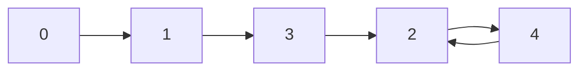
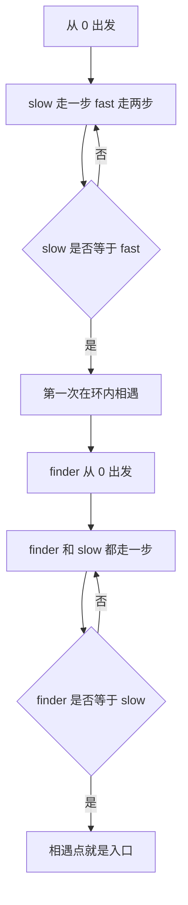

# 287. 寻找重复数 - 思路分析

## 📋 题目信息

- **难度**：中等
- **标签**：数组、双指针、快慢指针、Floyd 判圈算法、函数图、数学建模
- **来源**：LeetCode
- **核心要求**：不能修改原数组，额外空间必须控制在 `O(1)`

这题虽然写在数组专题里，真正考的却不是常见的数组技巧，而是你能不能把一个数组问题翻译成隐式链表问题。很多同学第一次看到时会先想到哈希表、排序、原地交换，这些方向都能找到重复值，但题目把路卡得很死，既不让改数组，又只给 `O(1)` 额外空间，于是关键不再是“有没有办法找重复”，而是“怎样把重复信息藏进指针运动里”。一旦你把 `nums` 重新看成 `next(i)=nums[i]` 的跳转关系，本题就会从“数组里找重复”瞬间变成“函数图里找环入口”，而这正是 Floyd 判圈最擅长解决的问题。

如果说 `141` 训练的是“如何判断有环”，`142` 训练的是“如何定位环入口”，那 `287` 训练的就是更高一层的迁移能力，题目表面换成数组了，但底层模式根本没换。你要学会识别这种“数据结构变了，运动规律没变”的题，而不是只会在真实链表节点上背模板。

## 📖 题目描述

给定一个包含 `n + 1` 个整数的数组 `nums`，其中每个整数都在 `[1, n]` 范围内。已知数组中只存在**一个重复的整数**，请返回这个重复数。这里的“只有一个重复整数”不是说它只出现两次，而是说只有一个数值发生重复，这个值可能出现两次、三次，甚至更多次。

题目还额外加了两个硬约束，不能修改原数组，额外空间只能是 `O(1)`。这两条限制一起出现时，排序、哈希表、下标标记、原地交换这些熟悉套路基本都不能作为正式主解，所以真正的问题其实是：**在不改数组、又不额外记录访问状态的前提下，怎样把那个重复值逼出来。**

### 示例

**示例 1：**

```text
输入：nums = [1,3,4,2,2]
输出：2
```

**示例 2：**

```text
输入：nums = [3,1,3,4,2]
输出：3
```

**示例 3：**

```text
输入：nums = [3,3,3,3,3]
输出：3
```

### 约束条件

- `1 <= n <= 10^5`
- `nums.length == n + 1`
- `1 <= nums[i] <= n`
- `nums` 中只有一个整数出现两次或多次，其余整数均只出现一次

### 原题提供的 Python 模板

```python
class Solution:
    def findDuplicate(self, nums: List[int]) -> int:
        
```

### 先把题目翻译成人话

数组长度是 `n + 1`，但每个位置上的值只能落在 `1..n` 这 `n` 个数字里，所以重复一定存在，这是抽屉原理给出的底层保证。真正难的地方在后半句，题目不允许你通过“改数组”或“记历史”的方式拿答案，于是你不能靠排序、哈希、负号标记这些常见手段直接做。换句话说，本题不是考你是否知道“重复一定存在”，而是考你能不能在**几乎没有额外工具**的前提下，从数组本身的跳转结构中恢复出那个重复值。

---

## 🤔 题目分析

### 1. 先看最直接的直觉

如果没有额外限制，这题其实很好做。你可以开一个集合，从左到右扫数组，第一次看到已经出现过的数就返回它，时间 `O(n)`，空间 `O(n)`；或者先排序，再扫描相邻元素，第一次出现相等值时返回，时间通常 `O(n log n)`。这些思路都没错，但它们都绕不过题目的限制，一个要额外空间，一个通常会改原数组，所以它们只能帮助我们建立直觉，不能作为正式最优解。

本题真正的难点不是“怎么找重复数”，而是“怎么在不改数组、不记访问历史的前提下，让重复结构自己暴露出来”。这句话要反复记，因为后面的建模和 Floyd 主线，本质上都是在回答这个问题。

### 2. 为什么重复一定存在

数组有 `n + 1` 个位置，但每个位置上的值只能取 `1..n`，也就是只有 `n` 个候选值。把 `n + 1` 个球塞进 `n` 个抽屉里，至少会有一个抽屉装下两个或更多球，这就是抽屉原理。翻译回本题，就是至少有一个数值被写了两次或更多次。这个结论只负责保证“答案存在”，还没有告诉你该怎么找，但它会成为整个函数图建模的起点。

### 3. 为什么数组能和链表扯上关系

这一步是整题最关键的转折。先暂时忘掉“数组”这个名字，不要只把 `nums[i]` 理解成“下标 `i` 上存了一个值”，而要把它看成一条跳转规则。具体地说，我们把**下标 `i` 看成节点**，把**`nums[i]` 看成从节点 `i` 指向的下一个节点**，也就是定义一个函数：

```text
f(i) = nums[i]
```

于是每个位置都会指向一个确定的下一站，这就是典型的单出边函数图。比如 `nums = [1,3,4,2,2]` 时，跳转关系就是 `0 -> 1, 1 -> 3, 2 -> 4, 3 -> 2, 4 -> 2`。这已经非常像链表里的 `next` 了，唯一差别只是这里没有真实节点对象，而是用下标充当节点编号。

### 4. 下标和数值的角色，千万别搞反

这是本题第一大误区。正确建模必须是：**下标是节点，`nums[i]` 是 next**。原因很简单，我们在代码里每次都是从一个当前位置 `i` 出发，然后做 `i = nums[i]` 这件事，它和链表里的 `node = node.next` 结构完全平行。也正因为如此，后面说“找入口”“找相遇点”“返回入口编号”时，讨论的对象一直都是节点编号，而不是“某个位置上存的值再去映射成节点”。

如果你把角色弄反，后面所有概念都会混掉，比如会分不清“重复值”“入口节点”“第一次相遇点”“前驱下标”到底谁是谁。对这题来说，建模比代码更重要，模型一错，推导再漂亮也没用。

### 5. 为什么从 `0` 出发一定会进入环

这一步要说得很准确，不是“因为有重复，所以才有环”，而是“因为这是一个有限状态的单出边函数图，所以从某个起点不断跳转，必然会进入环”。我们从 `0` 出发，第一步跳到 `nums[0]`，而题目保证每个 `nums[i]` 都落在 `1..n`，所以从第一跳开始，我们就永远留在 `1..n` 这个有限状态空间里。

注意这里的结构很关键。`1..n` 一共只有 `n` 个节点，但你可以无限次执行 `i = nums[i]`，也就是在一个只有 `n` 个状态的系统里无限前进。状态有限，步数无限，某个节点迟早会被再次访问。一旦第一次重复到达某个节点，后面的路径就开始循环，于是函数图必入环。这也是为什么很多英文题解会用 `functional graph` 这个词，本质上就是“每个节点恰好有一条出边的图”，从任意起点一直走，最终结构一定是“一段链 + 一个环”。

### 6. 重复值和环入口，到底是什么关系

这是本题第二个最容易讲歪的地方。很多题解会说“重复值制造了环”，这句话不够精确。更准确的说法是：**函数图本身天然会入环，而重复值决定了从起点路径首次汇入环的那个入口节点。**

为什么这样说？因为重复值 `d` 意味着至少有两个不同下标 `i != j` 满足 `nums[i] = nums[j] = d`，翻译成图上的语言就是 `i -> d` 和 `j -> d`。这说明节点 `d` 至少有两条入边，它是一个多路径汇合点。图之所以有环，是因为有限单出边结构必然循环；而入口之所以是某个特定节点，是因为只有那个重复值对应的节点，额外承受了来自外部路径和环内前驱的汇合。

换句话说，千万别说“重复值本身创造了环”，更准确的表达应该是：**图一定会入环，重复值决定了入口是谁。** 对本题而言，这个入口编号恰好就是答案本身。

### 7. 为什么环入口就是重复数

我们从 `0` 出发，会先走一段不重复路径，然后第一次进入某个循环区域。这个“第一次进入环的节点”，就是入口节点。入口为什么恰好对应重复值？因为入口一定要同时满足两件事：一条路径从环外链部分汇入它，另一条路径从环内前驱走回它，所以它至少有两条来源。在“只有一个数值重复”的题目约束下，这个拥有额外入边的特殊节点，正是那个重复数本身。

因此，本题里的答案不是“第一次相遇点”，也不是“某个指向入口的前驱下标”，而是**入口节点的编号**。由于节点编号本来就是整数，所以返回入口编号，也就是返回重复值。

### 8. 一个很贴切的类比，房间门牌跳转

想象一栋奇怪的大楼，每个房间门口都贴着一张卡片。你现在站在房间 `i`，下一步必须去门牌号为 `nums[i]` 的房间。你会一直做“看卡片，再跳房间”这件事。因为房间总数有限，而且每个房间只指定一个唯一下一站，所以你不可能永远走新房间，迟早会再次走到一个以前到过的房间。从那一刻开始，你就在楼里绕圈了。

那“重复值”代表什么？它代表至少有两个不同房间，卡片上都写着同一个门牌号，也就是两条不同路径会汇入同一个房间。从 `0` 号房间出发，第一次真正进入那个反复绕圈区域时，最先踏入的汇合房间，就是入口，它的门牌号也就是答案。这个类比的价值在于它把三件事分得很清，房间编号是节点，卡片数字是下一跳，第一次进入循环区域的房间号就是重复值。

### 9. 为什么第一次快慢指针相遇点不是答案

这是第三个高频误区。Floyd 第一阶段里的相遇，本质上是“速度差导致的追上”，不是“从同一起点精确对齐到入口”。快指针每轮比慢指针多走一步，一旦两者都进入环，这个额外步数就会不断吃掉它们之间的相对距离，所以它们可能在环上的任何位置碰头。这个相遇点只能说明两件事，第一，确实有环；第二，你现在拿到了一个环内节点。它通常**不是答案**。

例如在 `[1,3,4,2,2]` 里，第一次相遇点是 `4`，但答案是 `2`；在 `[3,1,3,4,2]` 里，第一次相遇点是 `2`，但答案是 `3`。所以第一阶段相遇后绝对不能直接返回，还必须进入第二阶段定位入口。

### 10. 为什么本题可以直接套 Floyd 判圈

到这里，其实题目已经完全转化完成了。虽然我们手里没有真实链表节点，但有一个完全等价的隐式 `next` 关系：

```text
next(i) = nums[i]
```

于是本题就变成了：从 `0` 出发，在隐式链表上跑快慢指针，先找到第一次相遇点，再用第二阶段找到入口，最后返回入口编号。换句话说，这题代码写的是数组，脑子里跑的其实是 `142`。它真正训练的能力，不是让你死记某段模板，而是让你在表面数据结构变化时，仍然能识别出同一个底层模式。

---

## 💡 解题思路

### 方法一：哈希表，最直观但不满足空间要求

#### 🌟 形象化理解：边走边记门牌

如果只是想先做出来，最自然的办法就是记住已经见过哪些数字。你从左到右扫描数组，看到一个值就查一次集合，若它以前出现过，答案就是它；若没出现过，就把它记下来。这和逛迷宫时把经过的门牌号记在本子上完全一样，第二次看到同一个门牌号时，你就知道它是重复的。

#### 思路说明

准备一个集合 `seen`，从头遍历数组中的每个值 `x`。如果 `x` 已经在 `seen` 中，立刻返回 `x`；否则把 `x` 加入集合，继续扫描。这个方法的优点是实现简单、正确性直观，但缺点也同样直接，集合需要 `O(n)` 额外空间，因此它只能帮助你建立直觉，不能作为正式主解。

#### 算法步骤

1. 创建空集合 `seen`。
2. 遍历数组 `nums`。
3. 若当前值已在 `seen` 中，返回它。
4. 否则把当前值加入 `seen`。

#### 复杂度分析

- **时间复杂度**：`O(n)`
- **空间复杂度**：`O(n)`

### 方法二：排序，能看清重复，但会破坏原数组

#### 🌟 形象化理解：先把卡片排好，再找撞车位置

如果把数组看成一叠数字卡片，那么重复值最容易暴露的办法就是先排序。排序后，相同数字一定挨在一起，所以只要扫描相邻位置，第一次看到 `nums[i] == nums[i - 1]` 就能返回答案。这条路很好想，但不符合题目约束。

#### 思路说明

排序法能帮助你把“多个位置映到同一个数值”这个事实看得很直观，但它通常会修改原数组。如果你复制一份再排，虽然避开了“修改原数组”，却又引入了额外空间。也就是说，这种方法适合理解问题，不适合作为本题的正式答案。

#### 复杂度分析

- **时间复杂度**：通常是 `O(n log n)`
- **空间复杂度**：视排序实现而定，复制后至少是 `O(n)`

### 方法三：二分答案 + 计数，不改数组但时间不是最优

#### 🌟 形象化理解：猜一个门槛，看看左半边是不是挤爆了

这题还有一个经典思路叫“二分答案”，二分的不是下标，而是数值范围 `1..n`。如果你猜一个中点 `mid`，然后统计数组里有多少数 `<= mid`，当这个数量大于 `mid` 时，说明左半边 `1..mid` 这段范围装不下这么多元素，重复数一定藏在左半边；否则重复数就在右半边。这本质上还是抽屉原理，只是它把“重复”转成了“某个值域区间过载”。

#### 算法步骤

1. 设 `left = 1`，`right = n`。
2. 当 `left < right` 时，取 `mid = (left + right) // 2`。
3. 统计数组中 `<= mid` 的元素个数 `cnt`。
4. 若 `cnt > mid`，令 `right = mid`；否则令 `left = mid + 1`。
5. 最终 `left` 就是重复数。

#### 复杂度分析

- **时间复杂度**：`O(n log n)`
- **空间复杂度**：`O(1)`

#### 这个方法的定位

它满足“不改数组”和“常量空间”，说明这题不只有一条思路，但它的时间复杂度还不是线性，因此仍然不是最优主解。真正让这题变经典的，是下面这个结构升级。

### 方法四：Floyd 判圈算法，主解

#### 🌟 形象化理解：两个人在会绕圈的大楼里追赶

还是用房间卡片的类比，只不过这次不记门牌，而是派两个人同时走。慢的人每次按卡片跳一次，快的人每次按卡片跳两次。只要这栋楼的跳转路径最终会绕圈，快的人迟早会在循环区域里追上慢的人。相遇后，再派一个人从 `0` 号房间重新出发，让他和相遇点上的人都每次跳一次，他们下一次碰头的房间，就是入口房间，而入口编号正是重复数。

#### 第一步，建立隐式链表

定义 `next(i) = nums[i]`，并从 `0` 开始不断执行 `i = nums[i]`。由于 `nums[i]` 永远落在 `1..n`，所以从第一跳开始，你就被锁进 `1..n` 这个有限状态空间。有限状态里无限前进，必然重复；一旦重复，就得到“一段链 + 一个环”的结构，而这正是 Floyd 判圈的标准舞台。

#### 第二步，第一阶段为什么一定会相遇

设慢指针每次走一步，快指针每次走两步。在进入环之前，快指针只是更快地逼近环；一旦两者都进环，事情就和 `141` 完全一样。环长有限，而快指针相对慢指针每轮多走一步，所以它们之间的相对距离会不断变化，在模环长的意义下迟早变成 `0`，于是二者一定会在环内某个位置碰头。注意，这一步只负责告诉我们“有环”，以及“拿到了一个环内节点”，并不负责给答案。

#### 第三步，第二阶段为什么能找到入口

这一步和 `142` 同构。设从起点 `0` 到入口的距离为 `a`，从入口到第一次相遇点的距离为 `b`，从第一次相遇点继续走回入口的距离为 `c`，环长为 `L`，于是 `L = b + c`。当慢指针第一次相遇时，它一共走了 `a + b` 步，快指针走了 `2(a + b)` 步。因为它们停在同一相遇点，所以快指针比慢指针多走的部分一定是若干整圈环长，也就是：

```text
2(a + b) = a + b + nL
```

化简得到：

```text
a + b = nL
```

再代入 `L = b + c`：

```text
a = nL - b
  = (n - 1)L + (L - b)
  = (n - 1)L + c
```

这个式子是整题最关键的地方。它说明，从起点 `0` 走到入口的距离 `a`，等价于从第一次相遇点继续向前走 `c` 步回到入口，再加上若干整圈环长。环上多绕整圈不会改变落点，所以如果让一个指针从 `0` 出发，另一个指针从第一次相遇点出发，并且两者都每次走一步，那么它们会在入口相遇。

这也是为什么第二阶段必须满足三件事，一个指针从 `0` 出发，一个指针从相遇点出发，两者都每次只走一步。这里不再是追赶问题，而是路径对齐问题；只要你把步速或起点改掉，前面的距离关系就不成立了。

#### 为什么返回的是入口编号

我们在图里把节点定义成下标编号，而 Floyd 第二阶段找到的入口节点恰好是某个编号 `d`。由于这个入口节点对应的就是那个被多个位置指向的重复值，所以返回入口编号，也就是返回重复数本身。换句话说，本题不是返回“某个节点对象”，而是返回“入口节点的编号”。

#### 算法步骤

1. 设 `slow = nums[0]`，`fast = nums[nums[0]]`。
2. 持续执行 `slow = nums[slow]`，`fast = nums[nums[fast]]`，直到 `slow == fast`。
3. 设 `finder = 0`。
4. 持续执行 `finder = nums[finder]`，`slow = nums[slow]`。
5. 当 `finder == slow` 时，返回该值。

#### 复杂度分析

- **时间复杂度**：`O(n)`
- **空间复杂度**：`O(1)`

#### 为什么这是本题主解

因为它同时满足了三件事，不修改原数组，额外空间是 `O(1)`，时间复杂度还是线性级别 `O(n)`。这正是题目真正想要的最优组合，也是 `287` 被视为 Floyd 判圈代表题的原因。

---

## 🎨 图解说明

这一节手推题目给出的三个典型例子。图解时始终坚持同一套口径，**下标是节点，`nums[i]` 是下一跳，从 `0` 出发，找的是入口编号。**

### 1. 例子一，`[1,3,4,2,2]`

先写出跳转关系：

```text
0 -> 1
1 -> 3
2 -> 4
3 -> 2
4 -> 2
```

从 `0` 出发的实际路径是 `0 -> 1 -> 3 -> 2 -> 4 -> 2 -> 4 -> ...`，所以链部分是 `0 -> 1 -> 3`，进入环的位置是 `2`，环本身是 `2 -> 4 -> 2`。这里 `2` 之所以是入口，是因为 `nums[3] = 2` 且 `nums[4] = 2`，也就是有两条路径 `3 -> 2` 和 `4 -> 2` 汇进同一个节点，外部路径第一次汇入环的位置正好就是 `2`。

第一阶段如果按常见写法初始化 `slow = nums[0] = 1`，`fast = nums[nums[0]] = nums[1] = 3`，后续状态会依次变成：第 1 轮 `slow = 3, fast = 4`，第 2 轮 `slow = 2, fast = 4`，第 3 轮 `slow = 4, fast = 4`。也就是说，第一次相遇点是 `4`，这正好能提醒你，相遇点通常不是答案。

第二阶段令 `finder = 0`，并保留 `slow = 4`。同步前进后，第 1 轮得到 `finder = 1, slow = 2`，第 2 轮得到 `finder = 3, slow = 4`，第 3 轮得到 `finder = 2, slow = 2`，二者在 `2` 相遇，所以答案是 `2`。

### 2. 例子二，`[3,1,3,4,2]`

跳转关系为：

```text
0 -> 3
1 -> 1
2 -> 3
3 -> 4
4 -> 2
```

从 `0` 出发的路径是 `0 -> 3 -> 4 -> 2 -> 3 -> 4 -> 2 -> ...`，所以入口是 `3`，环是 `3 -> 4 -> 2 -> 3`。这里答案之所以是 `3`，是因为 `nums[0] = 3` 且 `nums[2] = 3`，也就是两条路径都汇入 `3`，从 `0` 出发第一次进入循环区域时，踏入的节点就是 `3`。

第一阶段初始化后，`slow = 3, fast = 4`，再走一轮得到 `slow = 4, fast = 3`，再走一轮得到 `slow = 2, fast = 2`，第一次相遇点是 `2`，依旧不是答案。第二阶段令 `finder = 0`，同步走一步后就得到 `finder = 3, slow = 3`，立刻在入口相遇，所以答案是 `3`。

### 3. 例子三，`[3,3,3,3,3]`

这个例子非常重要，因为它能打掉“重复值只出现两次”的误解。跳转关系是：

```text
0 -> 3
1 -> 3
2 -> 3
3 -> 3
4 -> 3
```

从 `0` 出发的路径就是 `0 -> 3 -> 3 -> 3 -> ...`，这里的环长度只有 `1`，也就是一个自环 `3 -> 3`。这说明重复值完全可能出现很多次，而 Floyd 模型依然成立。第一阶段一开始就有 `slow = 3, fast = 3`，说明它们立刻在环内相遇；第二阶段令 `finder = 0`，同步走一步后得到 `finder = 3, slow = 3`，仍然在入口 `3` 相遇，所以答案还是 `3`。

这个例子很好地提醒我们三件事，重复值可能出现很多次，环长度可以是 `1`，第一阶段有时会非常快地相遇，但第二阶段的逻辑仍然丝毫不变。

### 4. Mermaid 图，例子一的函数图



这张图里，`0 -> 1 -> 3` 是链部分，`2 -> 4 -> 2` 是环部分，`2` 既是入口，也是最终答案。

### 5. Mermaid 图，Floyd 两阶段骨架



### 6. 形式化视角，再看一遍图结构

把从 `0` 出发的可达部分抽象成 `0 -> ... -> 入口 -> ... -> 相遇点 -> ... -> 入口 -> ...`，并记从 `0` 到入口的距离为 `a`，从入口到第一次相遇点的距离为 `b`，从相遇点回入口的距离为 `c`，环长 `L = b + c`。这套记号和 `142` 完全同构，所以本题不是另起炉灶，而是把真实链表节点换成了数组下标。

### 7. 图解里最该记住的三个结论

1. 从 `0` 出发，不断做 `i = nums[i]`，一定会进入 `1..n` 的有限状态空间，并最终入环。
2. 第一次快慢指针相遇点通常不是答案，它只是一个环内节点。
3. 第二阶段让 `0` 和相遇点同步每次走一步，最终相遇在入口，而入口编号就是重复值。

---

## ✏️ 代码框架填空

> **💡 学习提示**：这题最值得形成肌肉记忆的，不是某几行孤立代码，而是三件事，第一阶段怎么相遇，第二阶段为什么从 `0` 出发，最终为什么返回的是入口编号。

### Python 填空版，Floyd 主解

```python
from typing import List


class Solution:
    def findDuplicate(self, nums: List[int]) -> int:
        # 🔹 填空1：初始化第一阶段的快慢指针
        # 提示：slow 先走一步，fast 先走两步
        slow = ______
        fast = ______

        # 🔹 填空2：第一阶段，找到环内第一次相遇点
        while ______:
            slow = ______
            fast = ______

        # 🔹 填空3：第二阶段，finder 从起点 0 出发
        finder = ______

        # 🔹 填空4：同步前进，直到在入口相遇
        while ______:
            finder = ______
            slow = ______

        # 🔹 填空5：返回入口编号，也就是重复数
        return ______
```

### Python 填空提示详解

填空 1 的关键是认清“走一步”和“走两步”在数组版 Floyd 里分别怎么写。这里没有真实 `node.next`，所以走一步是 `nums[index]`，走两步就是再套一层 `nums[...]`，于是慢指针初始化为 `nums[0]`，快指针初始化为 `nums[nums[0]]`。这样进入循环后，二者就维持了标准的 `1:2` 速度差。

填空 2 的循环条件不是判空，而是“直到相遇”。链表版 Floyd 需要关心 `None`，数组版这里不需要，因为题目保证 `nums[i]` 始终落在合法范围 `1..n`，路径会一直合法跳转，所以第一阶段的目标就是找到 `slow == fast` 的时刻。

填空 3 为什么必须从 `0` 出发，这是本题最重要的细节之一。我们的建模从一开始就定义了“起点是下标 `0`”，所以第二阶段完全对应链表版里的“一个指针从 head 出发”，不能偷换成 `nums[0]` 或别的位置。

填空 4 为什么两者都只走一步，因为第二阶段不再是追赶问题，而是路径对齐问题。前面已经证明 `a = (n - 1)L + c`，所以两个指针必须同步一步一步走，才能在入口相遇。只要你让其中一个继续走两步，这个等式对应的几何意义就被破坏了。

填空 5 为什么返回 `finder` 或 `slow` 都可以，因为第二阶段结束时二者已经指向同一个入口编号，返回任意一个都等价。

### Python 对比填空版，二分计数补充

```python
from typing import List


class SolutionBinary:
    def findDuplicate(self, nums: List[int]) -> int:
        left = 1
        right = len(nums) - 1

        while left < right:
            mid = (left + right) // 2
            cnt = 0

            for num in nums:
                if ______:
                    cnt += 1

            if ______:
                right = mid
            else:
                left = mid + 1

        return ______
```

这个补充填空的意义是帮助你看清主解的优势。二分计数同样不改数组、同样只用 `O(1)` 空间，但时间复杂度仍然是 `O(n log n)`，而 Floyd 主解把时间也压到了线性级别。

### C++ 填空版，Floyd 主解

```cpp
#include <vector>
using namespace std;

class Solution {
public:
    int findDuplicate(vector<int>& nums) {
        // 🔹 填空1：初始化第一阶段
        int slow = ______;
        int fast = ______;

        // 🔹 填空2：第一阶段找相遇点
        while (______) {
            slow = ______;
            fast = ______;
        }

        // 🔹 填空3：第二阶段从 0 出发找入口
        int finder = ______;
        while (______) {
            finder = ______;
            slow = ______;
        }

        // 🔹 填空4：返回重复数
        return ______;
    }
};
```

### C++ 填空提示

和 Python 版本逻辑完全一致，区别只在语法。这里操作的始终是数组下标，不是链表指针对象，所以不要被“快慢指针”四个字误导，以为 C++ 版本会出现 `->next`。本题里的所有运动，本质上都在做下标跳转。

### Floyd 填空答案解析

Python 主解填空答案：

```python
from typing import List


class Solution:
    def findDuplicate(self, nums: List[int]) -> int:
        slow = nums[0]
        fast = nums[nums[0]]

        while slow != fast:
            slow = nums[slow]
            fast = nums[nums[fast]]

        finder = 0
        while finder != slow:
            finder = nums[finder]
            slow = nums[slow]

        return finder
```

C++ 主解填空答案：

```cpp
#include <vector>
using namespace std;

class Solution {
public:
    int findDuplicate(vector<int>& nums) {
        int slow = nums[0];
        int fast = nums[nums[0]];

        while (slow != fast) {
            slow = nums[slow];
            fast = nums[nums[fast]];
        }

        int finder = 0;
        while (finder != slow) {
            finder = nums[finder];
            slow = nums[slow];
        }

        return finder;
    }
};
```

特别要对照这几处，第一阶段循环条件是“直到相遇”，第二阶段起点是 `0`，第二阶段两者都只走一步，返回的是入口编号，不是第一次相遇点。

---

## 💻 完整代码实现

> **✅ 对照检查**：这题真正要核对的，不只是代码能不能跑通，而是填空版和完整版是否完全一致，尤其是第一阶段相遇循环、第二阶段找入口循环，以及最终返回值是否都和前面的解释一一对得上。

### Python 实现，Floyd 主解

```python
from typing import List


class Solution:
    def findDuplicate(self, nums: List[int]) -> int:
        # 第一阶段：先在环内找到一次相遇
        slow = nums[0]
        fast = nums[nums[0]]

        while slow != fast:
            slow = nums[slow]
            fast = nums[nums[fast]]

        # 第二阶段：一个指针从起点 0 出发
        # 另一个指针从第一次相遇点出发
        # 两者同步走一步，最终会在入口相遇
        finder = 0
        while finder != slow:
            finder = nums[finder]
            slow = nums[slow]

        # 入口编号就是重复数
        return finder
```

### Python 代码逐段解析

为什么第一阶段初始化不是 `slow = fast = 0`？当然也能写成从 `0` 开始，再在循环体里先走一步，但这里采用的是最常见、最整齐的写法，直接让慢指针先走一步，快指针先走两步，这样后续循环体里始终保持“慢一步、快两步”的稳定节奏，代码更紧凑。

为什么第一阶段不需要判空？因为这不是普通链表，数组中的每个 `nums[i]` 都保证落在 `1..n`，也就是说从 `0` 出发之后，不存在“掉出图外面”的情况。路径只会在有限集合中不断跳转，因此只需要等待相遇，不需要担心空指针。

为什么第二阶段从 `0` 开始，而不是从 `nums[0]` 开始？因为前面的距离记号里，`a` 定义的就是从起点 `0` 到入口的距离。第二阶段如果不从 `0` 重新出发，整个推导就不再对齐。

为什么返回 `finder`？因为第二阶段结束时，`finder == slow`，二者已经在入口编号处相遇，返回谁都一样，这里返回 `finder` 只是为了让“它专门负责找入口”这个角色更清楚。

### Python 实现，二分计数对比版

```python
from typing import List


class SolutionBinary:
    def findDuplicate(self, nums: List[int]) -> int:
        left = 1
        right = len(nums) - 1

        while left < right:
            mid = (left + right) // 2
            cnt = 0

            for num in nums:
                if num <= mid:
                    cnt += 1

            if cnt > mid:
                right = mid
            else:
                left = mid + 1

        return left
```

### Python 实现，哈希表直觉版

```python
from typing import List


class SolutionHash:
    def findDuplicate(self, nums: List[int]) -> int:
        seen = set()

        for num in nums:
            if num in seen:
                return num
            seen.add(num)

        raise ValueError("Input guarantees at least one duplicate")
```

### C++ 实现，Floyd 主解

```cpp
#include <vector>
using namespace std;

class Solution {
public:
    int findDuplicate(vector<int>& nums) {
        // 第一阶段：找到环内第一次相遇点
        int slow = nums[0];
        int fast = nums[nums[0]];

        while (slow != fast) {
            slow = nums[slow];
            fast = nums[nums[fast]];
        }

        // 第二阶段：从起点 0 和第一次相遇点同步出发
        int finder = 0;
        while (finder != slow) {
            finder = nums[finder];
            slow = nums[slow];
        }

        return finder;
    }
};
```

### C++ 实现，二分计数对比版

```cpp
#include <vector>
using namespace std;

class SolutionBinary {
public:
    int findDuplicate(vector<int>& nums) {
        int left = 1;
        int right = static_cast<int>(nums.size()) - 1;

        while (left < right) {
            int mid = left + (right - left) / 2;
            int cnt = 0;

            for (int num : nums) {
                if (num <= mid) {
                    ++cnt;
                }
            }

            if (cnt > mid) {
                right = mid;
            } else {
                left = mid + 1;
            }
        }

        return left;
    }
};
```

### C++ 实现，哈希表直觉版

```cpp
#include <unordered_set>
#include <vector>
using namespace std;

class SolutionHash {
public:
    int findDuplicate(vector<int>& nums) {
        unordered_set<int> seen;

        for (int num : nums) {
            if (seen.count(num)) {
                return num;
            }
            seen.insert(num);
        }

        return -1;
    }
};
```

### 三种方法怎么比较

| 方法 | 时间复杂度 | 空间复杂度 | 是否改数组 | 备注 |
| --- | --- | --- | --- | --- |
| 哈希表 | `O(n)` | `O(n)` | 否 | 最直观，但不满足空间要求 |
| 二分计数 | `O(n log n)` | `O(1)` | 否 | 满足约束，但不是线性时间 |
| Floyd 判圈 | `O(n)` | `O(1)` | 否 | 本题最优主解 |

### 这题最值得背下来的主模板

```python
def find_duplicate(nums):
    slow = nums[0]
    fast = nums[nums[0]]

    while slow != fast:
        slow = nums[slow]
        fast = nums[nums[fast]]

    finder = 0
    while finder != slow:
        finder = nums[finder]
        slow = nums[slow]

    return finder
```

不过更重要的是别只背模板。你要知道前半段负责先拿到一个环内节点，后半段负责把入口定位出来；只有这样，这份模板才是活的，而不是死记硬背的一串下标跳转。

---

## ⚠️ 易错点提醒

### 1. 把下标和数值的角色搞反

本题最根源的错误通常都从这里开始。一定记住，**下标 `i` 是节点，`nums[i]` 是下一跳**。不是反过来。如果这一步就错，后面的“入口是谁”“答案返回谁”“第一次相遇点和答案什么关系”都会一起乱掉。

### 2. 误以为第一次相遇点就是答案

例如 `[1,3,4,2,2]` 里第一次相遇点是 `4`，但答案是 `2`；`[3,1,3,4,2]` 里第一次相遇点是 `2`，但答案是 `3`。第一阶段相遇只说明“确实有环，并且拿到了一个环内节点”，还必须做第二阶段才会落到真正的入口。

### 3. 误以为“因为有重复值，所以才产生环” 

这句话不够严谨。更准确的说法是，**有限函数图从某个起点不断跳转，本来就必然入环**；重复值的作用不是凭空创造环，而是让某个节点拥有额外入边，从而成为外部路径汇入环的入口。这个区别必须讲清，不然一遇到变体题就容易解释打结。

### 4. 忽视重复值可能出现多次

题目只说“只有一个整数重复”，没说它只出现两次。像 `[3,3,3,3,3]` 这种情况依然完全合法，答案还是 `3`。所以写解释和代码时，都不要偷偷默认“重复值恰好出现两次”。

### 5. 第二阶段从错误起点出发

有些同学会把第二阶段写成 `finder = nums[0]`，或者把两个指针都从相遇点再出发，这都不对。第二阶段必须从真正起点 `0` 重新出发，这一点和链表版 `finder = head` 是一一对应的。

### 6. 第二阶段继续让快指针走两步

第一阶段是追赶问题，第二阶段是对齐问题。第二阶段里两个指针必须都只走一步，否则前面的 `a = (n - 1)L + c` 就不再对应当前运动规则。

### 7. 把“入口编号”和“入口前驱下标”混淆

本题返回的是重复值，也就是入口节点编号，不是返回某个前驱位置。比如在 `[1,3,4,2,2]` 里，`3` 和 `4` 都会指向 `2`，但答案既不是 `3` 也不是 `4`，而是入口编号 `2`。

### 8. 用排序或标记法时忘了题目“不修改数组”

排序原数组、把访问过的位置改成负数、交换元素到“正确位置”这些在别的题里可能很好用，但在这题里都会触碰题目约束。写题时一定先盯住约束，再选方法。

### 9. 调试时建议优先手推这三组数据

`[1,3,4,2,2]` 适合验证“第一次相遇点不是答案”，`[3,1,3,4,2]` 适合验证“入口较早出现时第二阶段如何立刻对齐”，`[3,3,3,3,3]` 适合验证“重复值可出现很多次，且环长度可为 1”。能把这三组手推顺，说明模型基本真的进脑子了。

---

## 🔗 相似题目推荐

### 1. `141. Linked List Cycle`

这是 Floyd 判圈的基础题，只要求判断有没有环。它的核心价值在于帮你理解第一阶段为什么一定会在环内相遇，也就是本题前半段的底层支撑。如果 `141` 还没真正吃透，直接学 `287` 往往会觉得跳跃太大。

### 2. `142. Linked List Cycle II`

这是本题最直接的母题。`287` 的精华其实就是把 `142` 里的“找环入口”迁移到了数组隐式链表上，所以本题最该和 `142` 放在一起学。重点要抓住三件事，入口为什么不是第一次相遇点，为什么第二阶段同步走一步能找到入口，`a / b / c / L` 这套推导怎样落地到代码。

### 3. `160. Intersection of Two Linked Lists`

这题不是判环，但它同样训练“路径对齐”的感觉。`160` 的关键是让两条不同长度路径走成同总长，`287` 的关键是让起点到入口与相遇点到入口在模环长意义下对齐。把这两题一起看，双指针理解会更立体。

### 4. `19. 删除链表的倒数第 N 个结点`

这题是快慢指针另一种经典用法，重点不是入环，而是保持固定距离。它能帮你区分双指针里几种不同的运动模型，速度差模型、距离差模型、路径补偿模型，各自解决的问题并不一样。

### 5. 推荐学习顺序

如果你正在系统学这个专题，比较推荐按下面顺序来学：

1. `141. Linked List Cycle`
2. `142. Linked List Cycle II`
3. `160. Intersection of Two Linked Lists`
4. `19. Remove Nth Node From End of List`
5. `287. Find the Duplicate Number`

这样学的好处是，你会先把真实链表上的运动规律练熟，再回头看 `287`，就能很清楚地看见，题目虽然换成数组，底层骨架其实完全没换。

---

## 📚 知识点总结

### 1. 本题表面是数组题，本质是函数图题

本题最重要的第一层结论，不是“会背 Floyd 模板”，而是**会把数组问题看成函数图问题**。一旦定义 `f(i) = nums[i]`，每个下标就都拥有了唯一后继，这个问题就从数组索引关系，转成了单出边图关系。

### 2. 从 `0` 出发，必然进入 `1..n` 的有限状态空间

由于 `nums[i]` 永远在 `[1, n]`，所以从 `0` 出发跳一次后，就永远留在 `1..n` 里。而 `1..n` 只有 `n` 个节点，不断跳转就一定重复，重复就一定入环。这一步解释的是“为什么图一定有环”，它来自有限状态和单后继结构，不来自某个神秘技巧。

### 3. 重复值对应的是入口，不是因为它“创造了环”

这道题最容易被讲错的地方就在这里。必须分清两件事，入环是有限函数图的结构必然，入口为何是某个特定值，是因为重复值造成了多入边汇合。所以更准确的话应该是：**图本来就会入环，而重复值决定了从起点路径首次汇入环的位置。**

### 4. Floyd 两阶段在这里完全照搬 `142`

第一阶段里，慢指针一次走一步，快指针一次走两步，并在环中第一次相遇；第二阶段里，一个指针从起点 `0` 出发，一个指针从第一次相遇点出发，二者都每次走一步，并在入口相遇。这套流程和 `142` 唯一的区别，只是数据载体从真实链表节点换成了数组下标。

### 5. 公式不是为了背，而是为了理解第二阶段

核心推导是：

```text
2(a + b) = a + b + nL
```

进一步得到：

```text
a = (n - 1)L + c
```

它真正想说明的不是某个公式本身，而是“从起点到入口的距离”和“从相遇点继续回到入口的距离”在模环长意义下是等价的，所以第二阶段同步一步一步走，入口就会自己出现。

### 6. 本题三个高频误区必须牢牢记住

1. 下标才是节点，值是 `next`。
2. 第一次相遇点通常不是答案。
3. 重复值可能出现两次，也可能出现很多次。

如果这三点混了，这题就很容易出现“代码像是会写，一问解释就乱”的状态。

### 7. 三种常见解法的定位

哈希表最直观，帮你建立“第一次撞见老值就是重复”的朴素直觉；二分计数满足约束，但时间不是线性；Floyd 判圈同时满足 `O(n)` 时间和 `O(1)` 空间，是本题真正的主解。比较好的学习顺序也是先靠哈希表看懂问题，再用二分计数理解抽屉原理还能怎么玩，最后再用 Floyd 完成结构升级。

### 8. 这题真正值得迁移出去的能力

学完 `287`，最该带走的不是一道题的答案，而是一种迁移能力：**当题目表面结构变了，能不能把它还原到你已经熟悉的模型里。** 今天是数组映射成隐式链表，明天也可能是状态跳转、伪随机序列周期检测、函数迭代路径，只要本质仍然是“有限状态 + 单后继 + 重复访问”，Floyd 的影子就可能出现。

### 9. 一句话收尾

请把这句话真正记住，**`287` 的关键不是“数组里有个重复数”，而是“把数组当成 `next(i)=nums[i]` 的隐式链表后，重复值正好变成了环入口”。** 一旦这句话想通，Floyd 判圈就不再是一段死模板，而会变成你能跨题型迁移的稳定工具。
