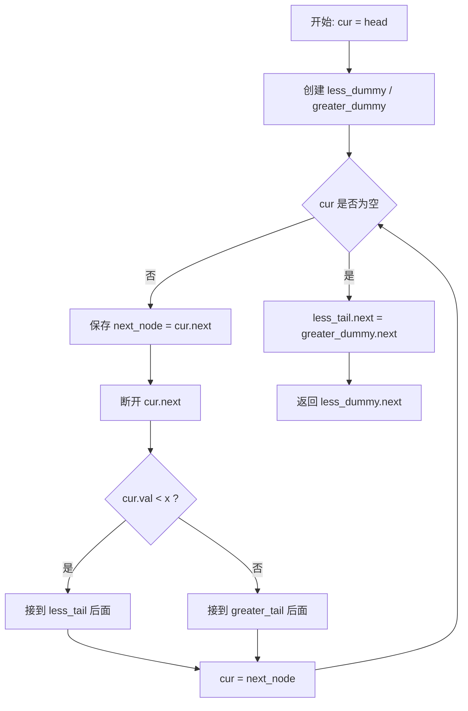
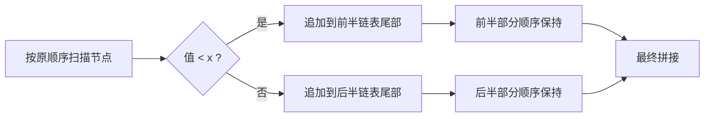

# 86. 分隔链表 - 思路分析

## 📋 题目信息
- **难度**：中等
- **标签**：链表、双指针、Dummy Head、稳定分区、链表重连
- **来源**：LeetCode

## 📖 题目描述

给你一个链表的头节点 `head` 和一个特定值 `x`，请你对链表进行分隔，使得所有 **小于** `x` 的节点都出现在 **大于或等于** `x` 的节点之前，并且要 **保留** 两个分区中每个节点的初始相对位置。换句话说，这道题并不是让我们把链表排序，而是让我们做一次“稳定分组”：把所有 `< x` 的节点抽出来放到前面，把所有 `>= x` 的节点放到后面，同时保证各自内部的先后顺序不能乱。

### 示例

**示例 1：**


```text
输入：head = [1,4,3,2,5,2], x = 3
输出：[1,2,2,4,3,5]
```

解释：所有小于 `3` 的节点是 `1, 2, 2`，所有大于等于 `3` 的节点是 `4, 3, 5`。由于必须保留原始相对顺序，所以前半部分仍是 `1 -> 2 -> 2`，后半部分仍是 `4 -> 3 -> 5`，最终连接成 `1 -> 2 -> 2 -> 4 -> 3 -> 5`。

**示例 2：**

```text
输入：head = [2,1], x = 2
输出：[1,2]
```

解释：节点 `1` 属于前半部分，节点 `2` 属于后半部分，最终结果是 `1 -> 2`。

### 约束条件

- 链表中节点的数目在范围 `[0, 200]` 内。
- `-100 <= Node.val <= 100`。
- `-200 <= x <= 200`。

### 原题提供的 Python 模板

```python
# Definition for singly-linked list.
# class ListNode:
#     def __init__(self, val=0, next=None):
#         self.val = val
#         self.next = next
class Solution:
    def partition(self, head: Optional[ListNode], x: int) -> Optional[ListNode]:
        
```

---

## 🤔 题目分析

### 1. 这道题到底在做什么

把题目翻译成人话，它做的事情其实很像“排队分流”：一串节点从左到右走过来，我们拿着阈值 `x` 做判断，值小于 `x` 的节点送进左边队伍，值大于等于 `x` 的节点送进右边队伍，最后再把左边队伍整体接到右边队伍前面。真正需要注意的不是“分两组”本身，而是题目额外强调了“保留相对位置”，这说明我们做的不是普通分区，而是 **稳定分区**。

所谓稳定分区，意思是：如果两个节点都属于前半部分，那么它们在结果链表中的前后顺序，必须与它们在原链表中的前后顺序一致；如果两个节点都属于后半部分，也必须保留原来的先后关系。这个要求一下子就把很多看似可以用的思路排除了，比如随意交换节点、把值取出来排序再塞回去、或者用头插法收集节点，这些做法要么不符合题意，要么没有体现链表题的本质。

因此，本题最核心的理解应该是：**它不是排序题，也不是“找到某个切分点直接断开”的题，而是一道“遍历原链表、按条件稳定收集节点、最后再重连”的链表模板题。**

### 2. 为什么它不是排序题

很多同学第一次看到“把小的放前面，大的放后面”时，会下意识联想到排序，甚至会误以为结果应该是局部有序或整体有序。其实这完全不是题目要求。题目并没有要求 `< x` 的部分内部升序，也没有要求 `>= x` 的部分内部升序，更没有要求整条链表最后全局升序。它只要求分成前后两组，并保住每组内部的原顺序。

举个很典型的例子：如果原链表是 `5 -> 1 -> 4 -> 2`，`x = 3`，那么合法结果是 `1 -> 2 -> 5 -> 4`，而不是 `1 -> 2 -> 4 -> 5`。之所以 `5 -> 4` 依然成立，是因为这两个节点都在后半部分，而且原链表里 `5` 本来就出现在 `4` 前面。这个例子非常重要，因为它能帮你从根子上避免把本题误读成“局部排序题”。

所以请牢牢记住：**本题的关键词不是“有序”，而是“稳定”。** 一旦这个定位错了，后面所有设计都会偏掉。

### 3. 题目真正考察哪些能力

这道题虽然只是中等题，但它把很多链表基础能力浓缩在了一起。首先，你要能读懂题意里的“保留相对位置”，意识到自己需要的是尾插而不是头插；其次，你要会用 `dummy head` 这种经典技巧来统一处理子链表的第一个节点；再次，你必须能稳定地维护尾指针，保证每次追加节点都是 `O(1)`；最后，你还要知道在移动节点时如何处理旧的 `next` 指针，避免把旧链路残留到新链表里。

换句话说，这道题训练的是一个非常常见、非常值得掌握的模型：**遍历原链表，把节点按规则分发到多个结果链表尾部，然后把这些结果链表重新拼起来。** 以后你做 `328. 奇偶链表`、`143. 重排链表`、甚至更复杂的链表重组题时，都会反复用到这种“拆分 + 收集 + 重连”的思维方式。

### 4. 为什么链表版本比数组版本更值得练

如果这是数组题，我们完全可以开两个数组，遍历一遍，把 `< x` 的数字放到第一个数组，把 `>= x` 的数字放到第二个数组，最后拼接一下就完了。因为数组支持随机访问，也天然适合“复制值”。但链表不一样，链表的精髓在于操作 **节点关系**，不是操作“值的拷贝”。

因此，本题最优雅的写法不是把所有值收集到数组里重建，而是直接复用原节点，靠修改 `next` 指针完成稳定重组。这样做的好处有两层：一层是复杂度更好，额外空间可以降到 `O(1)`；另一层更重要——你真正练到了链表题最核心的指针控制能力。

### 5. 本题最自然的结构设计

既然目标是把节点稳定地分成两组，那么最自然的设计就是准备两条子链表：一条专门收集 `< x` 的节点，一条专门收集 `>= x` 的节点。遍历原链表时，如果当前节点属于前半部分，就把它追加到“小链表”尾部；否则就追加到“大链表”尾部。遍历结束后，再把“小链表”的尾部接到“大链表”的头部，答案自然就出来了。

这个设计看上去几乎朴素得没有技巧，但它恰恰是最贴近题目本质的。你不需要在原链表中到处插来插去，不需要找某个神秘的“分界节点”，也不需要把题目想得很复杂。**把复杂问题转化成两个简单子问题，然后再拼接回来，本身就是一种非常强的解题能力。**

### 6. 为什么 Dummy Head 在这里几乎是标配

如果你不给两条子链表各准备一个虚拟头节点，那么一开始往某个子链表里塞第一个节点时，你就得写额外分支去判断“这条链表现在是不是空的”。这样代码会出现很多无谓的 if-else，既影响可读性，也更容易出边界 bug。引入 `dummy head` 后，所有追加动作都统一成：`tail.next = cur`，然后 `tail = tail.next`。不管当前是不是这条子链表的第一个有效节点，逻辑都完全一样。

这就是 `dummy head` 在链表题中的价值：**把头节点这个特殊情况，变成普通拼接情况。** 本题恰好就是它最标准的应用场景之一。

### 7. 为什么必须用尾插而不能用头插

只要题目要求“保留相对位置”，尾插几乎就是唯一自然的选择。因为我们遍历原链表时，节点是按原顺序被看到的；如果把它们依次追加到子链表尾部，那么进入子链表的顺序就与原链表一致，稳定性自然被保住。相反，如果你用头插，后遇到的节点会跑到前面，顺序立刻被翻转。

例如原链表中 `< x` 的节点依次为 `1, 2, 2`。如果用尾插，结果是 `1 -> 2 -> 2`；如果用头插，结果会变成 `2 -> 2 -> 1`。两者复杂度都不高，但只有尾插符合题意。这种“从题意直接推出数据结构操作方式”的能力，是链表题里非常关键的一种基本功。

### 8. 这道题真正的难点不在分类，而在指针顺序

从逻辑上看，“当前节点属于哪一组”这个判断非常简单，真正容易出错的地方，是在你改变指针时有没有保持正确顺序。链表题常见口诀是：**先保存后路，再改当前连接。** 对本题来说，这句话翻译成代码就是：先记住 `next_node = cur.next`，因为当前节点一旦被摘下并挂到新链表尾部，它原来的 `next` 指针关系就不该再被信任了；接着可以选择把 `cur.next = None` 断开旧连接；最后把它接到对应子链表尾部，并让 `cur = next_node` 继续遍历。

如果你没有先保存 `next_node` 就直接修改 `cur.next`，原链表剩余部分就可能丢失。如果你完全不管旧的 `next` 关系，又可能把新链表和旧链路意外串在一起。所以本题表面上是“稳定分组”，本质上也是一题很标准的“指针更新顺序训练题”。

### 9. 一句话突破口

如果要把本题浓缩成一句模板化描述，那就是：**创建两个 dummy head，用两个尾指针分别稳定收集 `< x` 和 `>= x` 的节点，遍历结束后把前者接到后者前面。** 想明白这句话，代码其实就已经写出八成了。

---

## 💡 解题思路

### 方法一：收集两组数值后重建链表

#### 🌟 形象化理解：先做分组记录，再按记录重新编队

想象有一列编号好的火车车厢从你面前开过去。你不急着直接重新挂接这些车厢，而是先拿两张清单做记录：第一张专门记下所有编号小于 `x` 的车厢，第二张专门记下所有编号大于等于 `x` 的车厢。等整列火车都经过之后，再按照这两张清单的顺序重新造出一列新火车。这个方法当然能得到正确答案，而且因为你是按原顺序记录，所以稳定性也能自然保住。

这个类比对应到题目里就是：原链表节点的值先被收集到两个数组，再根据数组内容重新新建一条链表。思路不难，适合第一次理解题意时使用，但它的问题也很明显：你并没有真正利用链表节点本身，而是把题目退化成了“读值 + 重建”。

#### 思路说明

具体做法非常直白：遍历链表时，把所有 `< x` 的值放进 `less_values`，把所有 `>= x` 的值放进 `greater_values`。由于数组追加操作是按扫描顺序进行的，因此每个分区的相对顺序天然会被保留下来。遍历结束后，再把 `less_values` 和 `greater_values` 拼起来，按这个顺序新建结果链表即可。

这个方案教学意义很强，因为它能帮我们确认题目要求的是“稳定分组”而不是“排序”，也能说明为什么“保留顺序”与“按遍历顺序追加”是天然对应的。不过，它依然不是最优解，因为题目给的是链表，我们却没有真正把链表结构利用起来。

#### 算法步骤

1. 创建两个空数组 `less_values` 和 `greater_values`。
2. 遍历原链表，若当前值 `< x`，就追加到 `less_values`，否则追加到 `greater_values`。
3. 创建结果链表的虚拟头节点 `dummy` 和尾指针 `tail`。
4. 先按 `less_values` 的顺序新建节点并接到结果链表尾部，再按 `greater_values` 的顺序做同样的事情。
5. 返回 `dummy.next`。

#### 复杂度分析

- **时间复杂度**：`O(n)`。虽然有“收集 + 重建”两遍动作，但总体仍是线性级别。
- **空间复杂度**：`O(n)`。我们用了两个数组保存值，而且最终又重新创建了新节点。

#### 为什么还需要优化

问题不在时间，而在空间和思路层次。这个解法额外保存了所有节点值，没有复用原节点，也没有训练到链表最核心的指针重连能力。更好的方案应该是：**节点不新建，直接分流到两条子链表中，最后原地重连。**

---

### 方法二：双 Dummy Head + 一次遍历尾插（主解）

#### 🌟 形象化理解：编组站双轨分流，最后再并轨

想象一列火车车厢依次开进编组站，站内有两条缓冲轨道：左轨专门停放编号小于 `x` 的车厢，右轨专门停放编号大于等于 `x` 的车厢。每来一节车厢，工作人员只做一次判断：若编号小于 `x`，就把它挂到左轨末尾；否则挂到右轨末尾。由于所有车厢都是按照原火车的顺序进入编组站的，所以无论在哪条轨道上，车厢的先后顺序都天然被保留下来了。等所有车厢都分流完成后，再把左轨末尾接到右轨头部，一列满足要求的新火车就形成了。

这个类比恰好解释了本题的三个关键点：第一，为什么要有两条子链表，因为题目本质就是分成两组收集；第二，为什么必须是尾插，因为尾插才不会破坏原顺序；第三，为什么最后只需要一次拼接，因为两个局部结果在收集阶段已经各自正确了，最后只是把它们串起来。

#### 对应关系

- 左缓冲轨道 = `less_dummy` 开头的前半链表。
- 右缓冲轨道 = `greater_dummy` 开头的后半链表。
- 左轨尾部 = `less_tail`。
- 右轨尾部 = `greater_tail`。
- 当前驶入车厢 = 遍历中的当前节点 `cur`。
- 分流规则 = `cur.val < x`。
- 最后并轨 = `less_tail.next = greater_dummy.next`。

#### 核心思路推导

先看第一步：既然题目要把节点稳定地分为两组，那么与其在原链表内部来回插入，不如直接准备两条结果链表分别收集，这会让结构更清楚。再看第二步：既然要求保留相对顺序，追加方式就不能是头插，只能是尾插。第三步：既然要做高效尾插，每条子链表就必须维护一个尾指针，否则每接一个节点都从头走到尾，整体会退化成 `O(n^2)`。第四步：既然子链表一开始可能为空，就干脆给它们各自放一个虚拟头节点，消掉“首个节点插入”的边界分支。到这里，主解的整体轮廓已经完全成型。

然后再看一个非常重要的细节：链表题里最容易出错的是旧 `next` 的处理。稳妥写法是每次先保存 `next_node = cur.next`，然后把 `cur.next = None`，将当前节点从旧链路里彻底摘出来，再接到某条子链表尾部。这样做的好处非常明显：新链表结构不会被旧链接污染，最后也不容易留下隐藏的尾巴。虽然也有写法选择在末尾统一令 `greater_tail.next = None`，但从教学角度看，“先摘干净再挂接”更不容易出错，也更利于建立清晰的指针意识。

#### 为什么这个方法一定正确

正确性可以从三个角度理解。第一，**完整性**：原链表的每个节点都会被遍历到，并且根据 `cur.val < x` 的结果，恰好进入两条子链表中的一条，不会遗漏，也不会重复。第二，**稳定性**：因为每条子链表都采用尾插，节点进入子链表的顺序与它在原链表中被看到的顺序一致，所以每组内部相对位置被保留。第三，**顺序性**：最终把“小链表”接到“大链表”前面后，结果链表一定满足“所有 `< x` 的节点都在前，所有 `>= x` 的节点都在后”。这三点合在一起，就刚好对应题目要求的全部条件。

#### 算法步骤

1. 创建两个虚拟头节点 `less_dummy` 和 `greater_dummy`。
2. 准备两个尾指针 `less_tail`、`greater_tail`，初始分别指向对应 dummy。
3. 用 `cur` 遍历原链表。
4. 每一轮先保存 `next_node = cur.next`，然后将 `cur.next = None` 断开旧连接。
5. 若 `cur.val < x`，则把当前节点接到 `less_tail.next`，并让 `less_tail` 后移；否则接到 `greater_tail.next`，并让 `greater_tail` 后移。
6. 令 `cur = next_node`，继续处理原链表剩余部分。
7. 遍历结束后，执行 `less_tail.next = greater_dummy.next`。
8. 返回 `less_dummy.next`。

#### 复杂度分析

- **时间复杂度**：`O(n)`。每个节点只被访问和处理一次。
- **空间复杂度**：`O(1)`。只用了常数个指针变量，没有额外与节点数成比例增长的辅助空间。

#### 💭 回顾类比

从类比回到代码会发现，这个方法其实非常朴素：缓冲轨道对应两条子链表，列车尾部工作人员对应尾指针，按编号分流对应条件判断，最终并轨对应最后一次拼接。换句话说，本题并不需要什么“神秘技巧”，而是在训练你用清晰的数据结构设计，把一个链表重组过程拆成若干个简单、稳定、可控的动作。

---

## 🎨 图解说明

### 1. 主解执行过程总览

我们用示例 `head = 1 -> 4 -> 3 -> 2 -> 5 -> 2, x = 3` 进行完整手推。初始时创建两条子链表：`less_dummy -> None` 与 `greater_dummy -> None`，两个尾指针分别指向各自 dummy，遍历指针 `cur` 指向原链表头节点 `1`。之后每一轮都只做三件事：记住下一个节点、把当前节点摘出来、按条件接到某条子链表尾部。

### 2. 逐轮状态变化

| 轮次 | 当前节点 | 分配结果 | 前半链表 `less` | 后半链表 `greater` | 剩余未处理部分 |
| --- | --- | --- | --- | --- | --- |
| 初始 | 无 | 无 | 空 | 空 | `1 -> 4 -> 3 -> 2 -> 5 -> 2` |
| 1 | `1` | `< 3` | `1` | 空 | `4 -> 3 -> 2 -> 5 -> 2` |
| 2 | `4` | `>= 3` | `1` | `4` | `3 -> 2 -> 5 -> 2` |
| 3 | `3` | `>= 3` | `1` | `4 -> 3` | `2 -> 5 -> 2` |
| 4 | `2` | `< 3` | `1 -> 2` | `4 -> 3` | `5 -> 2` |
| 5 | `5` | `>= 3` | `1 -> 2` | `4 -> 3 -> 5` | `2` |
| 6 | `2` | `< 3` | `1 -> 2 -> 2` | `4 -> 3 -> 5` | 空 |

当所有节点都被处理完后，再执行一次 `less_tail.next = greater_dummy.next`，结果就变成：

```text
1 -> 2 -> 2 -> 4 -> 3 -> 5
```

### 3. 为什么这个过程天然保序

观察上面的表格会发现，不管节点被分到前半链表还是后半链表，它们进入对应链表的顺序，完全取决于被遍历到的顺序。比如节点 `4, 3, 5` 都属于后半部分，而它们在原链表里的先后顺序就是 `4 -> 3 -> 5`，尾插到后半链表之后得到的仍然是 `4 -> 3 -> 5`。这件事不是额外维护出来的，而是“遍历顺序 + 尾插结构”自动保证的结果。

### 4. 为什么头插会出问题

如果把同样属于前半部分的节点 `1, 2, 2` 改成头插，过程会变成：先插 `1` 得到 `1`，再插 `2` 得到 `2 -> 1`，最后再插 `2` 得到 `2 -> 2 -> 1`。可以看到，相对顺序直接被翻转。这个反例非常经典，它说明“保留相对位置”这句话，其实已经在悄悄告诉你数据结构操作方式必须是尾插而不是头插。

### 5. 为什么要先保存 `next_node`

当前节点一旦被摘出来并挂到别的链表尾部，原链表中指向它后续部分的通道就不再安全了。如果你没有先保存 `next_node = cur.next`，那你后面再去改 `cur.next` 时，就可能把原链表剩余部分的入口丢掉。因此，本题每一轮最稳妥的顺序永远是：先保存后继，再断开当前节点，再把当前节点挂到某个结果链表尾部，最后把 `cur` 移动到刚才保存的 `next_node`。

### 6. 为什么要断开旧 `next`

假设当前处理的是节点 `4`，原链表里它后面本来连着 `3`。如果你把 `4` 接到“后半链表”的尾部之后，却没有处理旧的 `next`，那么中间状态下 `4` 仍然可能偷偷带着原链路指向 `3`。有些写法最后可以靠 `greater_tail.next = None` 修正尾巴，但从写法稳定性来看，先把 `cur.next = None` 再挂接会更清晰。这样每个被处理过的节点都会变成“干净节点”，不会把过去的连接关系带入新的结构。

### 7. Mermaid 图示：整体流程



### 8. Mermaid 图示：稳定分流的本质



### 9. 边界情况一览

| 情况 | 例子 | 结果说明 |
| --- | --- | --- |
| 空链表 | `head = []` | 直接返回空链表 |
| 全部 `< x` | `1 -> 1 -> 2, x = 5` | 后半链表为空，拼接后仍是原顺序 |
| 全部 `>= x` | `4 -> 5 -> 6, x = 3` | 前半链表为空，最终返回后半链表 |
| 存在大量等于 `x` 的节点 | `3 -> 1 -> 3 -> 2, x = 3` | 所有等于 `x` 的节点都必须归入后半部分 |
| `x` 不在链表中出现 | `1 -> 4 -> 2, x = 3` | 仍按 `< x` 和 `>= x` 分组，不要求 `x` 本身出现 |

这些边界情况都不需要额外分支，只要双 dummy 的主逻辑写对了，它们会自然地被统一处理掉，这也是为什么这个写法非常稳定。

---

## ✏️ 代码框架填空

> **💡 学习提示**：这道题最值得背下来的不是整段完整代码，而是那几个固定动作：准备两条子链表、保存后继、断开旧连接、按条件尾插、最后拼接。下面的填空就是围绕这五个动作设计的。

### Python 填空版（主解）

```python
# Definition for singly-linked list.
# class ListNode:
#     def __init__(self, val=0, next=None):
#         self.val = val
#         self.next = next

class Solution:
    def partition(self, head: Optional[ListNode], x: int) -> Optional[ListNode]:
        # 🔹 填空1：准备两条子链表的虚拟头节点和尾指针
        less_dummy = ______
        greater_dummy = ______
        less_tail = ______
        greater_tail = ______

        # 🔹 填空2：遍历原链表
        cur = ______
        while cur:
            # 🔹 填空3：先保存后继节点
            next_node = ______

            # 🔹 填空4：断开当前节点旧连接
            cur.next = ______

            # 🔹 填空5：按条件分流到对应子链表
            if ______:
                less_tail.next = ______
                less_tail = ______
            else:
                greater_tail.next = ______
                greater_tail = ______

            # 🔹 填空6：继续遍历原链表
            cur = ______

        # 🔹 填空7：把前半部分接到后半部分前面
        less_tail.next = ______

        # 🔹 填空8：返回最终头节点
        return ______
```

### Python 填空提示详解

**填空 1** 的关键在于理解角色分工：`less_dummy` 和 `greater_dummy` 是两条结果链表的起点锚点，`less_tail` 和 `greater_tail` 是实时维护的尾部指针，所以应该分别写成 `ListNode(0)`、`ListNode(0)`、`less_dummy`、`greater_dummy`。这里最常见的错误是忘记给尾指针指向 dummy，导致后续尾插根本没有统一入口。

**填空 2** 很直接，遍历当然从原链表头节点 `head` 开始，因此 `cur = head`。但这一步的语义要记清楚：`cur` 始终表示“当前还没处理完的那个原节点”，而不是某条结果链表里的节点。

**填空 3** 是本题最关键的防丢链操作，必须写成 `next_node = cur.next`。因为后面我们会改 `cur.next`，如果不先把后继保存起来，原链表剩余部分就可能找不到了。

**填空 4** 推荐写 `None`。也就是先把当前节点从旧链路中摘干净，再挂到新链表里。虽然不是唯一写法，但这是最稳妥、最容易调试的写法。

**填空 5** 的判断条件必须是 `cur.val < x`，而不是 `<=`。如果条件成立，当前节点应该接到 `less_tail.next`，然后 `less_tail = less_tail.next`；否则接到 `greater_tail.next`，并让 `greater_tail = greater_tail.next`。这一段的本质是“谁收下当前节点，谁的尾巴就向后走一步”。

**填空 6** 必须是 `next_node`，因为我们下一轮应该继续处理的是原链表中当前节点后面的那个节点，而不是已经挂到结果链表里的当前节点。

**填空 7** 和 **填空 8** 是收尾动作：先把 `less_tail.next = greater_dummy.next`，再返回 `less_dummy.next`。如果前半链表为空，`less_dummy.next` 会自然等于后半链表头部；如果后半链表为空，拼接空链表也没有任何问题，所以这是一个非常统一的写法。

### C++ 填空版（主解）

```cpp
/**
 * Definition for singly-linked list.
 * struct ListNode {
 *     int val;
 *     ListNode *next;
 *     ListNode() : val(0), next(nullptr) {}
 *     ListNode(int x) : val(x), next(nullptr) {}
 *     ListNode(int x, ListNode *next) : val(x), next(next) {}
 * };
 */
class Solution {
public:
    ListNode* partition(ListNode* head, int x) {
        // 🔹 填空1：创建两条子链表的 dummy 节点
        ListNode lessDummy(0);
        ListNode greaterDummy(0);

        // 🔹 填空2：初始化尾指针
        ListNode* lessTail = ______;
        ListNode* greaterTail = ______;

        // 🔹 填空3：遍历原链表
        ListNode* cur = ______;
        while (cur) {
            // 🔹 填空4：保存下一个节点
            ListNode* nextNode = ______;

            // 🔹 填空5：断开旧连接
            cur->next = ______;

            if (______) {
                lessTail->next = ______;
                lessTail = ______;
            } else {
                greaterTail->next = ______;
                greaterTail = ______;
            }

            cur = ______;
        }

        // 🔹 填空6：最终拼接
        lessTail->next = ______;

        // 🔹 填空7：返回答案
        return ______;
    }
};
```

### C++ 填空提示

这部分与 Python 的算法骨架完全相同，只是换成了 C++ 的指针语法。你要特别注意三件事：第一，`lessDummy` 和 `greaterDummy` 是对象，所以尾指针初始化必须写 `&lessDummy` 和 `&greaterDummy`；第二，访问成员要用 `->` 而不是 `.`；第三，空指针写作 `nullptr`。如果这三点没问题，那么 बाकी逻辑和 Python 完全一一对应。

---

## 💻 完整代码实现

> **✅ 对照检查**：建议你先自己补完填空，再来看完整代码。因为这题真正要形成肌肉记忆的是那套指针动作顺序，而不是“看懂答案时觉得自己会了”。

### Python 实现（双 Dummy Head + 一次遍历）

```python
# Definition for singly-linked list.
# class ListNode:
#     def __init__(self, val=0, next=None):
#         self.val = val
#         self.next = next

class Solution:
    def partition(self, head: Optional[ListNode], x: int) -> Optional[ListNode]:
        less_dummy = ListNode(0)
        greater_dummy = ListNode(0)
        less_tail = less_dummy
        greater_tail = greater_dummy

        cur = head
        while cur:
            next_node = cur.next
            cur.next = None

            if cur.val < x:
                less_tail.next = cur
                less_tail = less_tail.next
            else:
                greater_tail.next = cur
                greater_tail = greater_tail.next

            cur = next_node

        less_tail.next = greater_dummy.next
        return less_dummy.next
```

### Python 代码逐段解析

第一段初始化其实已经把整题的结构定死了：`less_dummy / less_tail` 管前半链表，`greater_dummy / greater_tail` 管后半链表。因为 dummy 的存在，我们不需要讨论“这是某一组的第一个节点怎么办”，所有追加动作都统一成尾插。第二段遍历时，`next_node = cur.next` 与 `cur.next = None` 的顺序千万不要写反；前者负责保留原链表后续入口，后者负责把当前节点从旧链路中摘干净。第三段分流时，真正的题意差别就体现在那句 `if cur.val < x` 上，注意是严格小于。最后一段拼接时，`less_tail.next = greater_dummy.next` 这句非常关键，它把两个局部正确结果串成全局正确结果，也是本题最后一步最容易被遗漏的地方。

从实现风格上看，这份代码有两个优点。第一，整个过程只依赖常数个指针变量，空间复杂度非常干净；第二，逻辑完全由“分流 + 拼接”组成，没有多余分支，因此空链表、全进前半部分、全进后半部分等边界情况都会被自然覆盖。这也是为什么双 dummy 写法几乎是这题的标准答案。

### Python 填空答案解析

- **填空 1**：`ListNode(0)`、`ListNode(0)`、`less_dummy`、`greater_dummy`
- **填空 2**：`head`
- **填空 3**：`cur.next`
- **填空 4**：`None`
- **填空 5**：`cur.val < x`、`cur`、`less_tail.next`、`cur`、`greater_tail.next`
- **填空 6**：`next_node`
- **填空 7**：`greater_dummy.next`
- **填空 8**：`less_dummy.next`

### C++ 实现（双 Dummy Head + 一次遍历）

```cpp
/**
 * Definition for singly-linked list.
 * struct ListNode {
 *     int val;
 *     ListNode *next;
 *     ListNode() : val(0), next(nullptr) {}
 *     ListNode(int x) : val(x), next(nullptr) {}
 *     ListNode(int x, ListNode *next) : val(x), next(next) {}
 * };
 */
class Solution {
public:
    ListNode* partition(ListNode* head, int x) {
        ListNode lessDummy(0);
        ListNode greaterDummy(0);
        ListNode* lessTail = &lessDummy;
        ListNode* greaterTail = &greaterDummy;

        ListNode* cur = head;
        while (cur) {
            ListNode* nextNode = cur->next;
            cur->next = nullptr;

            if (cur->val < x) {
                lessTail->next = cur;
                lessTail = lessTail->next;
            } else {
                greaterTail->next = cur;
                greaterTail = greaterTail->next;
            }

            cur = nextNode;
        }

        lessTail->next = greaterDummy.next;
        return lessDummy.next;
    }
};
```

### C++ 与 Python 的主要差异

两份代码的算法本质完全一致，区别只是语言细节。Python 使用对象引用，C++ 使用显式指针；Python 写 `.next`，C++ 写 `->next`；Python 用 `None`，C++ 用 `nullptr`。此外，C++ 中 `lessDummy` 和 `greaterDummy` 是局部对象，所以尾指针初始化要写成 `&lessDummy` 与 `&greaterDummy`。这些差异都只是语法层面的，真正该记住的仍然是“分流到两条链表尾部，再做最终拼接”的算法骨架。

### C++ 填空答案解析

- **填空 1**：已给出 `lessDummy(0)` 和 `greaterDummy(0)`
- **填空 2**：`&lessDummy`、`&greaterDummy`
- **填空 3**：`head`
- **填空 4**：`cur->next`
- **填空 5**：`nullptr`、`cur->val < x`、`cur`、`lessTail->next`、`cur`、`greaterTail->next`
- **填空 6**：`nextNode`、`greaterDummy.next`
- **填空 7**：`lessDummy.next`

### 写法变体：末尾统一断链

你也会看到另一种常见写法：在循环里不显式执行 `cur.next = None`，而是在把节点分流到后半链表后，最后统一写 `greater_tail.next = None`，然后再拼接。这个写法也能通过，但它对中间状态的理解要求更高，初学时更容易因为旧链接残留而调试困难。因此，如果你还在建立链表题的稳定手感，更建议使用本篇主解这种“先摘干净再挂接”的写法。

### 本题可复用的通用模板

这题值得提炼成一个“稳定拆分链表”的通用模板。以后只要题目长得像“按某个条件把链表分成两部分，并保持原顺序”，你几乎都可以从这个模板出发思考。

```python
def stable_split(head, predicate):
    a_dummy = ListNode(0)
    b_dummy = ListNode(0)
    a_tail = a_dummy
    b_tail = b_dummy

    cur = head
    while cur:
        next_node = cur.next
        cur.next = None

        if predicate(cur):
            a_tail.next = cur
            a_tail = a_tail.next
        else:
            b_tail.next = cur
            b_tail = b_tail.next

        cur = next_node

    a_tail.next = b_dummy.next
    return a_dummy.next
```

对本题来说，`predicate(cur)` 就是 `cur.val < x`。真正值得记住的不是题号，而是这个通用骨架。

---

## ⚠️ 易错点提醒

### 1. 把条件写成 `<= x`

这是本题第一高频错误。题目要求的是“小于 `x` 的放前面”，而不是“小于等于 `x` 的放前面”。所以所有等于 `x` 的节点都必须归到后半链表。如果你把判断写成 `cur.val <= x`，结果看上去可能也“差不多”，但它已经不符合题意了。

### 2. 忘记“保留相对位置”意味着必须尾插

有些同学知道要分成两组，但一写代码就顺手用头插，因为头插看起来也很方便。问题在于，头插会把分区内部顺序翻转，直接破坏稳定性。本题一旦看到“保留相对位置”，你就要条件反射想到“只能尾插”。

### 3. 没有先保存 `next_node`

如果你先改了 `cur.next`，再去尝试访问原链表后续部分，往往就已经晚了。很多链表 bug 其实都不是逻辑理解错误，而是“指针改动顺序”错了。本题最稳的顺序永远是：`next_node = cur.next` → `cur.next = None` → 分流挂接 → `cur = next_node`。

### 4. 忘记断开旧链接

这类 bug 最烦人的地方在于，有时候你在简单样例上看不出问题，但一换数据就会发现结果链表尾巴后面还挂着不该出现的节点，甚至出现环。根源通常就是旧的 `next` 关系没有被正确处理。如果你不想和这种 bug 反复纠缠，就在每一轮把当前节点先摘干净。

### 5. 忘记最后拼接两条子链表

有些代码把分流阶段写对了，但循环结束后直接返回 `less_dummy.next`，结果后半链表整个丢失。请记住：遍历结束时你只是“把两组都收集好了”，离答案还差最后一步——把它们拼起来。没有 `less_tail.next = greater_dummy.next`，整题就还没做完。

### 6. 返回了错误的节点

如果返回 `less_dummy`，结果前面会多一个虚拟节点；如果返回原来的 `head`，那更是直接忽略了你刚才重建出的新结构。真正答案永远是 `less_dummy.next`，因为 dummy 只是辅助锚点，不属于结果本身。

### 7. 把题目做成“改值题”

把值取出来重新排再塞回去，或者重建新链表，并不一定会错，但这种写法没有体现链表题真正有价值的部分。链表题最该练的是“节点如何移动、连接如何变化”，而不是“怎么把值搬来搬去”。所以在学习阶段，更推荐直接复用原节点完成重组。

### 8. 调试时忽略边界情况

本题最适合拿来做稳定性检查的样例包括：空链表、全部小于 `x`、全部大于等于 `x`、存在多个等于 `x` 的节点、`x` 根本不在链表中出现等。如果这些边界情况都能稳定通过，基本说明你的双 dummy 写法已经比较扎实了。

### 9. 一个实用的调试技巧

调试链表题时，不要只盯着最后结果。更有效的方法是每轮都观察三件事：当前节点是谁、前半链表长什么样、后半链表长什么样。你甚至可以把每轮状态打印成数组来观察，这样很容易发现究竟是“分类错了”“尾巴没移动”“还是拼接漏了”。

### 10. 本地调试辅助函数

如果你在本地练习，下面两个函数非常有用：一个负责把数组转成链表，一个负责把链表转回数组，方便你快速验证结果。

```python
def build_list(nums):
    dummy = ListNode(0)
    tail = dummy
    for num in nums:
        tail.next = ListNode(num)
        tail = tail.next
    return dummy.next

def to_array(head):
    result = []
    while head:
        result.append(head.val)
        head = head.next
    return result
```

配合下面这种测试方式，你能很快定位问题：

```python
head = build_list([1, 4, 3, 2, 5, 2])
ans = Solution().partition(head, 3)
print(to_array(ans))  # 期望输出 [1, 2, 2, 4, 3, 5]
```

---

## 🔗 相似题目推荐

### 1. 同类型题目

**21. 合并两个有序链表（简单）**：这题和本题一样，都非常依赖 `dummy head` 与尾指针。不同之处在于 `21` 是把两条链表按大小归并，本题则是一条链表按条件稳定拆分后再拼接。两题放在一起练，特别适合建立“尾插拼接链表”的手感。

**328. 奇偶链表（中等）**：这是本题最典型的兄弟题。它同样是把一条链表拆成两组，再把两组重新连接，只不过分组条件从“节点值与 `x` 的比较”变成了“节点所处位置的奇偶性”。如果你已经熟悉本题的双 dummy / 双尾指针思路，再看 `328` 会非常顺。

**86. 分隔链表（中等）**：这道题本身就是“稳定拆分链表”的经典模板。以后只要看到“按条件分两组、保留相对顺序、最后重连”这种描述，脑中都应该立刻浮现本题的结构。

### 2. 进阶题目

**143. 重排链表（中等）**：需要找中点、反转后半段、再交替合并，指针操作链条更长，但本质上同样离不开“拆链”和“重连”。本题练熟之后，再做它会更容易建立全局结构感。

**92. 反转链表 II（中等）**：这题训练的是局部区间内的原地重连能力，虽然主题与稳定分区不同，但对 `dummy head`、前驱节点和断链顺序的理解要求都很高，是很好的进阶方向。

**25. K 个一组翻转链表（困难）**：这是链表重连的综合题，局部翻转、分组处理、前后拼接都会出现。本题中的“先保存后继，再做局部结构重建”的意识，会在 `25` 里被进一步放大。

### 3. 推荐学习路径

如果你正在系统学习链表专题，我比较推荐这样的顺序：先做 `206. 反转链表` 建立最基础的指针重连感，再做 `21. 合并两个有序链表` 练习尾插和 dummy，接着做本题 `86. 分隔链表` 掌握稳定分组，然后做 `328. 奇偶链表` 强化同模板迁移，最后再去挑战 `92`、`143`、`25` 这类更复杂的重组题。这个学习路径的好处是每一步都在前一步的结构理解上往前推进，而不是跳跃式地硬啃复杂题。

---

## 📚 知识点总结

### 1. 核心算法

本题的核心算法可以概括成一句话：**稳定分区 + 链表拼接**。扫描原链表时，按条件把节点稳定地分流到两条子链表尾部；扫描结束后，再把前半链表接到后半链表前面。这里的“稳定”是整道题的灵魂，因为它决定了我们必须按遍历顺序尾插，而不是随意交换或头插。

### 2. 核心数据结构角色

本题真正需要管理的不是下标，而是四类指针角色：`cur` 负责指向当前正在处理的原节点，`next_node` 负责保存原链表的后继入口，`less_tail` 负责维护前半链表尾部，`greater_tail` 负责维护后半链表尾部。只要你脑中这四个角色分工清楚，代码写起来就会稳定很多。

### 3. 最重要的技巧

第一是 **双 Dummy Head**，它让两条结果链表都能无脑尾插，消掉首节点分支；第二是 **尾插法保序**，只要题目提到“保留相对位置”，你就应该想到这一点；第三是 **先保存后继再改连接**，这是所有链表重连题里的通用铁律；第四是 **把大问题拆成前后两个局部链表分别处理**，这会让链表结构变化变得可控。

### 4. 可复用模板

下面这个模板非常值得记住，因为它不仅能做本题，也能迁移到很多“按条件拆分链表”的场景：

```python
def split_by_condition(head, predicate):
    left_dummy = ListNode(0)
    right_dummy = ListNode(0)
    left_tail = left_dummy
    right_tail = right_dummy

    cur = head
    while cur:
        next_node = cur.next
        cur.next = None

        if predicate(cur):
            left_tail.next = cur
            left_tail = left_tail.next
        else:
            right_tail.next = cur
            right_tail = right_tail.next

        cur = next_node

    left_tail.next = right_dummy.next
    return left_dummy.next
```

对本题来说，`predicate(cur)` 就是 `cur.val < x`。如果以后条件改成“是否奇数位”“是否正数”“是否满足某个属性”，这个模板依然可以继续使用。

### 5. 学完这题最该记住什么

如果你只想留下最关键的记忆点，我建议记住下面五句：第一，本题不是排序题，而是稳定分区题；第二，看到“保留相对位置”就想到尾插；第三，遇到两条结果链表时优先想到双 dummy；第四，修改 `next` 之前先保存后继；第五，最后别忘记拼接两条子链表。只要这五句真正进入脑子，本题以及它的一大类变形题都会变得清晰很多。

---

## 📝 补充说明

### 1. 从填空到独立实现的练习路径

第一遍建议只看“题目分析 + 图解 + 填空版”，尝试自己补出双 dummy、双尾指针和主循环顺序；第二遍再对照完整代码，重点检查自己是不是在 `next_node`、`cur.next = None`、最终拼接这三个地方出错；第三遍关掉文档，从零默写完整实现；第四遍再换几组边界样例做调试，确保自己不只是“看懂”，而是真正可以稳定写出来。

### 2. 时间复杂度为什么已经最优

题目至少要求我们看一遍每个节点，否则根本不知道它应该进前半链表还是后半链表，因此时间复杂度下界天然就是 `O(n)`。而主解刚好只扫描一遍原链表，每个节点都只做常数次指针操作，所以已经达到了线性最优。

### 3. 空间复杂度为什么能做到 `O(1)`

我们没有使用数组保存节点值，也没有使用递归栈，只是引入了几个固定数量的辅助指针。也就是说，额外空间不会随着链表长度增长，因此是 `O(1)`。这也是为什么主解相比“数组收集后重建”的方法更值得记忆。

### 4. 与数组稳定分区的关系

如果你学过数组里的稳定分区，会发现两者在思想上其实非常接近：都是按遍历顺序把元素分到不同容器，再把容器拼起来。区别只在于数组更容易“拷贝值”，而链表更适合“重连节点”。所以本题可以看成是“稳定分区思想在链表结构上的落地版本”。

### 5. 最后一句总结

请把这句话记住：**86. 分隔链表 的本质，不是“在一条链表里东插西挪”，而是“用双 Dummy Head 把节点稳定地分成前后两组，再按顺序拼接成新的链表”。** 一旦这句话真正理解透了，你掌握的就不只是这道题，而是一类链表稳定重组问题的通用模板。
