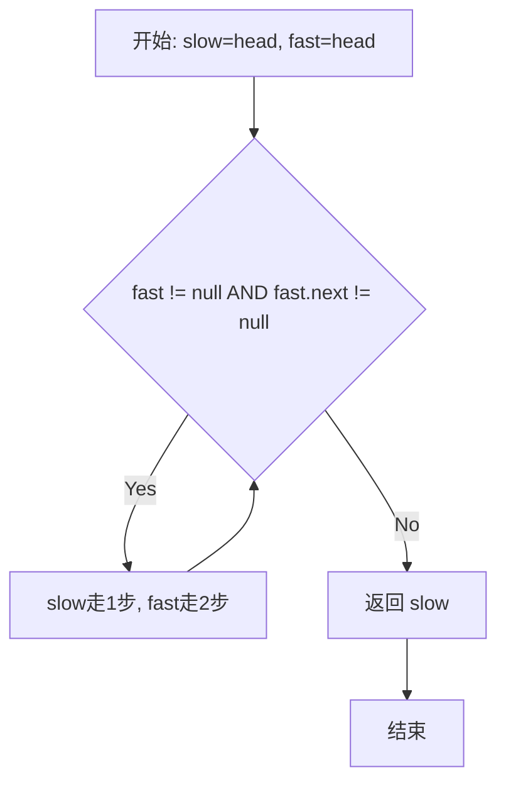

# 876. 链表的中间结点

## 📋 题目信息
- **难度**：简单 (Easy)
- **标签**：链表 (Linked List)、双指针 (Two Pointers)、快慢指针 (Fast-Slow Pointer)
- **来源**：LeetCode

## 📖 题目描述

给你单链表的头结点 `head` ，请你找出并返回链表的中间结点。

如果有两个中间结点，则返回第二个中间结点。

### 示例

**示例 1：**
```
输入：head = [1,2,3,4,5]
输出：[3,4,5]
解释：链表只有一个中间结点，值为 3 。
```

**示例 2：**
```
输入：head = [1,2,3,4,5,6]
输出：[4,5,6]
解释：该链表有两个中间结点，值分别为 3 和 4 ，返回第二个结点。
```

### 约束条件

- 链表的结点数范围是 `[1, 100]`
- `1 <= Node.val <= 100`

---

## 🤔 题目分析

### 问题理解

我们需要找到单链表的中间节点：
1. 如果链表有奇数个节点（如5个），返回正中间的节点（第3个）
2. 如果链表有偶数个节点（如6个），返回两个中间节点中的第二个（第4个，不是第3个）

### 关键观察

- **链表特性**：链表不像数组可以直接通过索引访问，必须从头节点开始逐个遍历
- **中点定义**：对于长度为 n 的链表，中点位置是 `⌊n/2⌋`（向下取整）
  - n=5: 中点在索引2（第3个节点）
  - n=6: 中点在索引3（第4个节点）
- **关键突破**：如何在不知道链表长度的情况下，一次遍历就找到中点？

---

## 💡 解题思路

### 方法一：两次遍历（暴力解法）

#### 思路说明

最直观的想法：
1. 第一次遍历：统计链表的总长度 n
2. 计算中点位置：`mid = n // 2`
3. 第二次遍历：从头节点开始走 mid 步，到达中点

#### 算法步骤

1. 初始化计数器 `count = 0`，指针 `cur = head`
2. 第一次遍历：
   ```python
   while cur:
       count += 1
       cur = cur.next
   ```
3. 计算中点位置：`mid = count // 2`
4. 第二次遍历：
   ```python
   cur = head
   for i in range(mid):
       cur = cur.next
   return cur
   ```

#### 复杂度分析

- **时间复杂度**：O(N) - 虽然遍历了两次，但仍是线性时间
- **空间复杂度**：O(1) - 只使用了常数个变量

#### 为什么需要优化

虽然时间复杂度已经是 O(N)，但需要遍历两次链表：
- 第一次遍历：统计长度
- 第二次遍历：走到中点

能否只遍历一次就找到中点？

---

### 方法二：快慢指针（优化解法）⭐ 推荐

#### 🌟 形象化理解：龟兔赛跑

> **💡 在进入专业算法分析之前，先通过一个生活化的例子来理解快慢指针的本质**

**场景类比**：

想象一条环形跑道上，乌龟和兔子同时从起点出发：
- **乌龟**每次走 1 步
- **兔子**每次走 2 步（速度是乌龟的2倍）

当兔子跑完全程到达终点时，乌龟正好跑了一半的路程，恰好在跑道的中点位置。

**对应关系**：
- **跑道** = 链表
- **起点** = 头节点 head
- **终点** = 链表末尾（null）
- **乌龟** = 慢指针 slow（每次移动1步）
- **兔子** = 快指针 fast（每次移动2步）
- **中点** = 当快指针到达终点时，慢指针所在的位置

**核心理解**：

因为快指针的速度是慢指针的2倍，所以当快指针走完全程时，慢指针恰好走了一半，正好停在中点位置。这样我们只需要一次遍历就能找到中点！

**从类比到算法**：

现在让我们把这个龟兔赛跑的思想转化为具体的链表算法...

---

#### 优化思路推导

1. 暴力解法需要两次遍历的原因：不知道链表长度，所以必须先数一遍
2. 能否在遍历的同时就确定中点位置？
3. **关键洞察**：使用两个指针，一个走得快，一个走得慢
   - 慢指针每次移动 1 步
   - 快指针每次移动 2 步
4. 当快指针到达链表末尾时，慢指针恰好在中点
5. 这样只需要一次遍历！

#### 算法步骤

1. 初始化两个指针：`slow = head`, `fast = head`
2. 循环条件：`while fast and fast.next:`
   - 为什么是这个条件？
     - `fast` 不为空：确保快指针没有越界
     - `fast.next` 不为空：确保快指针可以再走一步（因为每次走2步）
3. 每次循环：
   - `slow = slow.next`（慢指针走1步）
   - `fast = fast.next.next`（快指针走2步）
4. 循环结束时，`slow` 指向中点，返回 `slow`

#### 为什么这样能找到中点？

**数学证明**：

假设链表长度为 n：
- 慢指针走了 k 步
- 快指针走了 2k 步

当快指针到达末尾时：
- 如果 n 是奇数（如 n=5）：快指针走到最后一个节点，2k = n-1，所以 k = (n-1)/2 = 2，慢指针在索引2（第3个节点）
- 如果 n 是偶数（如 n=6）：快指针走到 null，2k = n，所以 k = n/2 = 3，慢指针在索引3（第4个节点）

这正好符合题目要求：偶数个节点时返回第二个中间节点！

#### 复杂度分析

- **时间复杂度**：O(N) - 只遍历一次链表，快指针走了 N 步，慢指针走了 N/2 步
- **空间复杂度**：O(1) - 只使用了两个指针变量

#### 💭 回顾类比

- 跑道上的乌龟（慢指针）每次走1步 → 代码中的 `slow = slow.next`
- 跑道上的兔子（快指针）每次走2步 → 代码中的 `fast = fast.next.next`
- 兔子到达终点时，乌龟在中点 → 循环结束时，`slow` 指向中点

这就是为什么快慢指针能够一次遍历就找到中点的原因！

---

## 🎨 图解说明

### 执行过程示例

**示例 1：奇数个节点 [1,2,3,4,5]**

```
初始状态：
slow, fast
  ↓    ↓
  1 → 2 → 3 → 4 → 5 → null

第1步：slow走1步，fast走2步
     slow    fast
       ↓      ↓
  1 → 2 → 3 → 4 → 5 → null

第2步：slow走1步，fast走2步
          slow         fast
            ↓           ↓
  1 → 2 → 3 → 4 → 5 → null

循环结束（fast到达末尾），返回slow（节点3）
```

**示例 2：偶数个节点 [1,2,3,4,5,6]**

```
初始状态：
slow, fast
  ↓    ↓
  1 → 2 → 3 → 4 → 5 → 6 → null

第1步：slow走1步，fast走2步
     slow    fast
       ↓      ↓
  1 → 2 → 3 → 4 → 5 → 6 → null

第2步：slow走1步，fast走2步
          slow         fast
            ↓           ↓
  1 → 2 → 3 → 4 → 5 → 6 → null

第3步：slow走1步，fast走2步
               slow              fast
                 ↓                ↓
  1 → 2 → 3 → 4 → 5 → 6 → null

循环结束（fast为null），返回slow（节点4）
```

### 可视化流程图



---

## ✏️ 代码框架填空

> **💡 学习提示**：在查看完整代码之前，先尝试根据上面的算法步骤，自己思考并填写下面的空白处。这将帮助你从"不知道怎么开始"过渡到"能够独立实现关键逻辑"。

### Python填空版

```python
# Definition for singly-linked list.
# class ListNode:
#     def __init__(self, val=0, next=None):
#         self.val = val
#         self.next = next

def middleNode(head):
    """
    使用快慢指针找到链表的中间节点
    
    参数:
        head: 链表的头节点
    
    返回:
        中间节点（如果有两个中间节点，返回第二个）
    """
    # 🔹 填空1：初始化快慢指针
    # 提示：两个指针都从哪里开始？
    slow = ______
    fast = ______
    
    # 🔹 填空2：循环条件
    # 提示：什么时候停止？需要检查fast和fast.next
    while ______:
        
        # 🔹 填空3：移动慢指针
        # 提示：慢指针每次走几步？
        slow = ______
        
        # 🔹 填空4：移动快指针
        # 提示：快指针每次走几步？
        fast = ______
    
    # 🔹 填空5：返回结果
    # 提示：循环结束时，哪个指针指向中点？
    return ______
```

### 填空提示详解

**填空1 - 初始化快慢指针**
- 思考：两个指针应该从哪里开始？
- 提示：都从链表的头节点开始
- 答案：`slow = head`, `fast = head`

**填空2 - 循环条件**
- 思考：什么时候应该停止循环？
- 提示：快指针到达末尾时停止，需要检查 `fast` 和 `fast.next` 都不为空
- 为什么检查两个？因为快指针每次走2步，需要确保下一步不会越界
- 答案：`fast and fast.next`

**填空3 - 移动慢指针**
- 思考：慢指针每次移动几步？
- 提示：慢指针每次走1步
- 答案：`slow = slow.next`

**填空4 - 移动快指针**
- 思考：快指针每次移动几步？
- 提示：快指针每次走2步（速度是慢指针的2倍）
- 答案：`fast = fast.next.next`

**填空5 - 返回结果**
- 思考：循环结束时，哪个指针指向中点？
- 提示：慢指针走了一半的路程，正好在中点
- 答案：`return slow`

---

## 💻 完整代码实现

> **✅ 对照检查**：现在对比你的填空答案和下面的完整实现，看看思路是否一致。

### Python实现

```python
# Definition for singly-linked list.
# class ListNode:
#     def __init__(self, val=0, next=None):
#         self.val = val
#         self.next = next

def middleNode(head):
    """
    使用快慢指针找到链表的中间节点
    
    参数:
        head: 链表的头节点
    
    返回:
        中间节点（如果有两个中间节点，返回第二个）
    
    时间复杂度: O(N)
    空间复杂度: O(1)
    """
    # 初始化快慢指针，都从头节点开始
    slow = head
    fast = head
    
    # 快指针每次走2步，慢指针每次走1步
    # 循环条件：fast和fast.next都不为空
    # - fast不为空：确保快指针没有越界
    # - fast.next不为空：确保快指针可以再走一步（因为每次走2步）
    while fast and fast.next:
        slow = slow.next          # 慢指针走1步
        fast = fast.next.next     # 快指针走2步
    
    # 当快指针到达末尾时，慢指针恰好在中点
    return slow


# 测试用例
if __name__ == "__main__":
    # 辅助函数：创建链表
    def create_linked_list(arr):
        if not arr:
            return None
        head = ListNode(arr[0])
        cur = head
        for val in arr[1:]:
            cur.next = ListNode(val)
            cur = cur.next
        return head
    
    # 辅助函数：链表转数组（从某个节点开始）
    def linked_list_to_array(head):
        result = []
        while head:
            result.append(head.val)
            head = head.next
        return result
    
    # 测试用例1：奇数个节点
    head1 = create_linked_list([1, 2, 3, 4, 5])
    middle1 = middleNode(head1)
    print(f"测试1: {linked_list_to_array(middle1)}")  # 期望: [3, 4, 5]
    
    # 测试用例2：偶数个节点
    head2 = create_linked_list([1, 2, 3, 4, 5, 6])
    middle2 = middleNode(head2)
    print(f"测试2: {linked_list_to_array(middle2)}")  # 期望: [4, 5, 6]
    
    # 测试用例3：单个节点
    head3 = create_linked_list([1])
    middle3 = middleNode(head3)
    print(f"测试3: {linked_list_to_array(middle3)}")  # 期望: [1]
    
    # 测试用例4：两个节点
    head4 = create_linked_list([1, 2])
    middle4 = middleNode(head4)
    print(f"测试4: {linked_list_to_array(middle4)}")  # 期望: [2]
```

**代码说明**：
- 第20-21行：初始化快慢指针，都指向头节点
- 第28行：循环条件 `fast and fast.next` 确保快指针可以安全地走2步
- 第29行：慢指针每次走1步
- 第30行：快指针每次走2步
- 第33行：循环结束时，慢指针指向中点

**填空答案解析**：
- **填空1**：`slow = head`, `fast = head` - 两个指针都从头节点开始
- **填空2**：`fast and fast.next` - 确保快指针可以安全地走2步
- **填空3**：`slow = slow.next` - 慢指针每次走1步
- **填空4**：`fast = fast.next.next` - 快指针每次走2步
- **填空5**：`return slow` - 返回慢指针（中点位置）

---

### C++实现

```cpp
#include <iostream>
using namespace std;

// Definition for singly-linked list.
struct ListNode {
    int val;
    ListNode *next;
    ListNode() : val(0), next(nullptr) {}
    ListNode(int x) : val(x), next(nullptr) {}
    ListNode(int x, ListNode *next) : val(x), next(next) {}
};

class Solution {
public:
    ListNode* middleNode(ListNode* head) {
        // 初始化快慢指针
        ListNode* slow = head;
        ListNode* fast = head;
        
        // 快指针每次走2步，慢指针每次走1步
        // 注意：C++中需要先检查fast，再检查fast->next
        while (fast != nullptr && fast->next != nullptr) {
            slow = slow->next;           // 慢指针走1步
            fast = fast->next->next;     // 快指针走2步
        }
        
        // 返回中点
        return slow;
    }
};

// 测试代码
int main() {
    Solution sol;
    
    // 创建测试链表: 1 -> 2 -> 3 -> 4 -> 5
    ListNode* head = new ListNode(1);
    head->next = new ListNode(2);
    head->next->next = new ListNode(3);
    head->next->next->next = new ListNode(4);
    head->next->next->next->next = new ListNode(5);
    
    ListNode* middle = sol.middleNode(head);
    
    // 输出从中点开始的链表
    cout << "Middle node and after: ";
    while (middle != nullptr) {
        cout << middle->val << " ";
        middle = middle->next;
    }
    cout << endl;  // 期望输出: 3 4 5
    
    return 0;
}
```

**与Python的主要差异**：
- **指针语法**：C++使用 `->` 访问指针成员，Python使用 `.`
- **空值检查**：C++使用 `nullptr`，Python使用 `None`
- **条件判断**：C++需要显式写 `!= nullptr`，Python可以直接用 `if fast`
- **内存管理**：C++需要手动管理内存（本例中未释放，实际应用需要），Python有垃圾回收

---

## ⚠️ 易错点提醒

### 1. 循环条件错误

**错误写法**：
```python
while fast:  # ❌ 错误！
    slow = slow.next
    fast = fast.next.next  # 可能导致 NoneType 错误
```

**问题分析**：
- 如果只检查 `fast`，当 `fast.next` 为 `None` 时，执行 `fast.next.next` 会报错
- 例如：链表 `[1,2]`，第一次循环后 `fast` 指向节点2，`fast.next` 为 `None`，再执行 `fast.next.next` 就会出错

**正确写法**：
```python
while fast and fast.next:  # ✅ 正确！
    slow = slow.next
    fast = fast.next.next
```

### 2. 初始化位置错误

**错误写法**：
```python
slow = head
fast = head.next  # ❌ 错误！快指针从第二个节点开始
```

**问题分析**：
- 如果快指针从 `head.next` 开始，会导致结果偏移
- 例如：链表 `[1,2,3,4,5]`，应该返回节点3，但这样会返回节点2

**正确写法**：
```python
slow = head
fast = head  # ✅ 正确！两个指针都从头节点开始
```

### 3. 边界条件处理

**需要特别注意的边界情况**：

1. **单个节点**：`[1]`
   - `fast = head`，`fast.next = None`
   - 循环不执行，直接返回 `slow = head`
   - 结果正确：返回节点1

2. **两个节点**：`[1,2]`
   - 第一次循环：`slow` 移到节点2，`fast` 移到 `None`
   - 循环结束，返回 `slow = 节点2`
   - 结果正确：返回第二个节点

3. **空链表**：`None`
   - 题目约束保证至少有1个节点，但实际编码中应该处理
   - 可以在函数开头添加：`if not head: return None`

### 4. 返回值理解错误

**错误理解**：
```python
# ❌ 错误！返回节点的值
return slow.val
```

**正确理解**：
```python
# ✅ 正确！返回节点本身（包含后续链表）
return slow
```

题目要求返回中间节点及其后续链表，不是只返回节点的值。

---

## 🔗 相似题目推荐

掌握了快慢指针这一核心技巧后，你可以尝试解决以下题目：

### 同类型题目（快慢指针）

1. **[LeetCode 141] - 环形链表** (Easy)
   - **相似点**：同样使用快慢指针，但目的是检测环
   - **核心思想**：如果有环，快指针最终会追上慢指针
   - **建议**：先掌握本题，再挑战环检测

2. **[LeetCode 142] - 环形链表 II** (Medium)
   - **相似点**：快慢指针的进阶应用
   - **核心思想**：不仅检测环，还要找到环的入口
   - **难度提升**：需要数学推导来确定入口位置

3. **[LeetCode 19] - 删除链表的倒数第N个结点** (Medium)
   - **相似点**：使用双指针，但间隔固定为N
   - **核心思想**：快指针先走N步，然后快慢指针同时走
   - **应用场景**：一次遍历找到倒数第N个节点

### 进阶题目

1. **[LeetCode 234] - 回文链表** (Easy)
   - **进阶点**：结合快慢指针找中点 + 反转链表
   - **思路**：先用快慢指针找到中点，然后反转后半部分，最后比较

2. **[LeetCode 143] - 重排链表** (Medium)
   - **进阶点**：快慢指针 + 反转 + 合并
   - **思路**：找中点 → 反转后半部分 → 交替合并两部分

### 相关知识点

本题涉及的核心知识点：

- **快慢指针（Fast-Slow Pointer）**：
  - 核心原理：速度差异导致位置差异
  - 应用场景：找中点、检测环、找倒数第K个节点
  - 相关题目：141、142、19、234、876

- **链表遍历**：
  - 单向遍历的特点和限制
  - 指针操作的安全性（空指针检查）
  - 相关题目：206、21、83

- **双指针技巧**：
  - 对撞指针、快慢指针、同向双指针
  - 时间复杂度优化的常用手段
  - 相关题目：1、15、11、42

---

## 📚 知识点总结

### 核心算法：快慢指针

快慢指针是链表问题中最重要的技巧之一，其核心思想是：
- 使用两个移动速度不同的指针
- 通过速度差异来解决问题
- 常见速度比：1:2（本题）、固定间隔N（删除倒数第N个节点）

### 算法优势

1. **空间效率**：O(1) 空间复杂度，只需要两个指针
2. **时间效率**：O(N) 时间复杂度，只需一次遍历
3. **代码简洁**：逻辑清晰，易于理解和实现
4. **应用广泛**：可以解决多种链表问题

### 解题模板

```python
def fast_slow_pointer(head):
    # 1. 初始化快慢指针
    slow = head
    fast = head
    
    # 2. 循环条件（根据具体问题调整）
    while fast and fast.next:
        # 3. 移动指针（速度可调整）
        slow = slow.next
        fast = fast.next.next
        
        # 4. 检查条件（根据具体问题）
        if condition:
            return result
    
    # 5. 返回结果
    return slow
```

### 学习要点

1. **理解速度差异的本质**：快指针走完全程时，慢指针走了一半
2. **掌握循环条件**：`fast and fast.next` 确保安全访问
3. **注意边界情况**：单节点、双节点、空链表
4. **举一反三**：快慢指针可以解决多种链表问题

### 实际应用

快慢指针不仅在算法题中有用，在实际工程中也有应用：
- **内存泄漏检测**：检测循环引用
- **数据流处理**：在不知道总长度的情况下找到中间位置
- **负载均衡**：分配任务到不同的处理器

---
