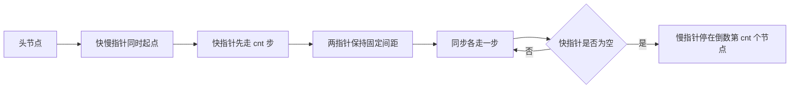

# LCR 140. Training Plan II - 思路分析

## 📋 题目信息

- **题号**：LCR 140
- **题目**：训练计划 II
- **难度**：简单
- **标签**：链表、双指针、前后指针、快慢指针、一次遍历
- **来源**：力扣 LeetCode LCR
- **本质对应**：剑指 Offer 22 / LeetCode 19 的查找版
- **核心要求**：在单链表中找到并返回倒数第 `cnt` 个训练项目编号
- **返回类型**：返回节点值 `int`，不是节点对象，也不是修改后的链表

这道题虽然被标成简单，但它在链表双指针专题里很有代表性，因为它专门训练一种非常常用的能力：**如何在不知道链表总长度的前提下，直接定位倒数第 `k` 个位置**。很多同学第一次看到“倒数第几个节点”时，会先想到“那我先求长度”，这个想法没错，而且完全可以做出来；但当题目进一步追问能否一次遍历完成时，就需要你掌握前后指针保持固定间距的技巧。

从专题价值上看，这题比表面难度更值得认真学。因为它不是孤立的一题，而是很多链表题的基础骨架。你后面学习 `19. 删除链表的倒数第 N 个结点`、`876. 链表的中间结点`、`141/142. 环形链表` 时，都会反复遇到“让两个指针形成某种相对位置关系，再通过同步移动得到答案”的思路。换句话说，本题不是只教你找一个值，而是在教你理解“链表中的距离控制”。

这题还有一个很适合教学的地方：暴力解法和优化解法都很自然，而且二者之间的升级关系特别清楚。暴力解法是“先得到总长度，再把倒数转换成正数位置”；优化解法则是“根本不显式求总长度，而是通过两个指针的固定间距，隐式完成定位”。这种从直接思维到技巧思维的过渡，正是链表题最值得训练的部分。

另外一定要记住，本题最终返回的是**节点值**。这一点看似简单，实际写代码时很容易和剑指 Offer 22、LeetCode 19 混淆。Offer 22 常见写法是返回节点本身，而本题题面要求返回“训练项目编号”，也就是整数值。所以你在代码最后不能直接 `return slow`，而应该 `return slow.val`。

---

## 📖 题目描述

给定一个头节点为 `head` 的单链表，这个链表按顺序记录了一系列核心肌群训练项目编号。现在给你一个整数 `cnt`，表示希望从链表尾部开始计数，找到倒数第 `cnt` 个训练项目，并返回它的编号。

也就是说，如果链表从前往后是：

```text
head -> a -> b -> c -> d
```

那么：

- 倒数第 `1` 个是 `d`
- 倒数第 `2` 个是 `c`
- 倒数第 `3` 个是 `b`
- 倒数第 `4` 个是 `a`

题目并不要求你删除节点，也不要求你返回节点对象，而是只返回这个位置上的**编号值**。

**示例 1：**

```text
输入：head = [2,4,7,8], cnt = 1
输出：8
```

解释：倒数第 `1` 个节点就是最后一个节点，值为 `8`。

**示例 2：**

```text
输入：head = [2,4,7,8], cnt = 2
输出：7
```

解释：从尾部往前数，第 `1` 个是 `8`，第 `2` 个是 `7`。

**示例 3：**

```text
输入：head = [5], cnt = 1
输出：5
```

解释：链表只有一个节点，倒数第 `1` 个自然就是它自己。

### 约束条件

- `1 <= head.length <= 100`
- `0 <= head[i] <= 100`
- `1 <= cnt <= head.length`

这些约束告诉我们两件事。第一，链表一定非空，所以理论上答案一定存在，不需要处理“找不到倒数第 `cnt` 个节点”的非法输入。第二，数据范围不大，所以暴力做法完全可过；但从算法训练角度，我们仍然应该把重点放在一次遍历的优化思路上，因为这才是题目真正想让你掌握的能力。

还要特别理解“倒数第 `cnt` 个”到底是什么意思。它不是“第 `cnt` 个大”，不是“值为 `cnt` 的节点”，也不是“从头数第 `cnt` 个”。它强调的是**相对于尾部的位置**。而链表偏偏只有 `next` 指针，没有从尾往前的访问方式，所以这个“倒数”信息并不能直接拿到，必须借助额外技巧进行转换或间接维护。

如果把这题和 `19. 删除链表的倒数第 N 个结点` 对比，你会发现它其实是一个更温和的版本。19 题要求你不仅找到目标位置，还要修改链表完成删除，因此必须进一步定位前驱节点，边界处理也更复杂。本题只要求返回目标值，所以整体难度更低，非常适合作为“前后指针找倒数第 `k` 个节点”的入门题。

---

## 🤔 题目分析

这道题的关键词不是“查找值”，而是“查找位置”。我们并不是去链表里找某个编号等于多少的节点，而是要找一个**相对于链表尾部定义的位置**。这就带来一个核心矛盾：链表只能从头向后走，但题目要你从尾向前数。

如果这是数组，事情会简单很多。因为数组支持随机访问，假设长度是 `n`，倒数第 `cnt` 个元素就是下标 `n - cnt`。但链表没有下标，也不支持从尾巴直接回跳，所以你无法像数组那样一步算出位置后立刻访问。也正因此，“倒数第 `k` 个”几乎是链表题里最典型的需要技巧的问题之一。

理解本题时，先要明确一个事实：**倒数位置可以转化成正数位置**。如果链表总长度是 `n`，那么倒数第 `cnt` 个节点，等价于正数第 `n - cnt + 1` 个节点。如果我们知道 `n`，题目立刻就变简单了。于是最自然的第一反应就是：先遍历一遍统计长度，再遍历一遍走到第 `n - cnt + 1` 个节点。

这个思路完全成立，而且时间复杂度仍然是 `O(n)`。很多同学会误以为“两次遍历就一定差”，其实不对。对于这题的数据范围来说，两次遍历已经足够好。真正的问题不在于它不能过题，而在于它没有体现链表双指针专题里最有价值的技巧。

接下来要思考的是：**能不能不显式知道长度，也仍然完成定位**。这里就是优化解法诞生的地方。我们注意到，如果两个指针之间始终保持 `cnt` 个节点的距离，那么当前面的指针走到链表末尾时，后面的指针自然就落在倒数第 `cnt` 个位置。

这个观察非常关键，因为它把问题从“我必须知道总长度”转化成了“我只需要维护两个指针的相对距离”。一旦你接受这种视角，链表题就会突然变得灵活很多。我们不再执着于把位置写成显式公式，而是通过运动过程本身，让答案自动浮现出来。

换句话说，本题有两种完全不同的思维方式：

1. **长度思维**：先求总长度，再把倒数转换成正数位置。
2. **间距思维**：让两个指针保持固定差距，利用同步前进完成定位。

前者适合入门和验证题意，后者才是面试和专题学习里更重要的能力。很多链表题真正难的地方，不是会不会写 `while` 循环，而是你能不能把“位置”问题翻译成“指针间距”问题。本题恰好就是这项能力的最经典练习。

还有一个细节需要提前提醒：本题最终返回的是节点值，不是节点对象。因此即使我们在优化解法中最后让慢指针停在了目标节点上，返回时也必须写成 `slow.val`。如果你把本题和 Offer 22 混在一起，常见错误就是直接返回节点，这在题意上是不匹配的。

从教学角度看，本题真正要吃透的是下面两个问题：

- 为什么两次遍历能做对
- 为什么快指针先走 `cnt` 步后，再和慢指针同步前进，慢指针最终会停在答案位置

只要这两个问题你都能独立解释清楚，这题就不仅仅是“写过”，而是真的掌握了。

---

## 💡 解题思路

### 方法一：暴力解法 两次遍历

先看最直接、最稳定、最符合直觉的做法。

#### 🌟 形象化类比

把链表想象成一支从前往后排好的队伍，现在老师让你找“倒数第 `cnt` 个人”。但你站在队伍前面，只能从队头往后看，不能直接从队尾开始数。那最自然的做法是什么？

就是先从头到尾把队伍人数数一遍，得到总人数 `n`。然后你回到队伍最前面，再从头开始数到第 `n - cnt + 1` 个人，这个人就是倒数第 `cnt` 个。

这个类比非常贴近暴力解法的本质：

- **第一次遍历**：数队伍总人数
- **第二次遍历**：从头重新数到目标位置

比如队伍里有 `8` 个人，你要找倒数第 `3` 个，那么这个人其实就是正数第 `8 - 3 + 1 = 6` 个。你只要从头数到第 `6` 个人，就找到答案了。

这个方法的好处是几乎不需要技巧，只要你理解了“倒数第 `cnt` 个 = 正数第 `n - cnt + 1` 个”，代码就自然出来了。

#### 思路说明

设链表长度为 `n`。

- 第一次遍历，统计链表节点总数 `n`
- 第二次遍历，从头节点出发走 `n - cnt` 步
- 走到的位置就是倒数第 `cnt` 个节点

注意这里是走 `n - cnt` 步，而不是 `n - cnt + 1` 步。因为如果从头节点开始，站在第一个节点上时还没有走步数。这个“步数”和“第几个节点”的换算，初学者特别容易弄混。

举个例子：

```text
head = [2,4,7,8], cnt = 2
```

链表长度 `n = 4`。

倒数第 `2` 个 = 正数第 `4 - 2 + 1 = 3` 个，也就是值为 `7` 的节点。

如果指针一开始就在头节点 `2` 上，那么它只需要向后走 `2` 步：

- 走 0 步：在 `2`
- 走 1 步：到 `4`
- 走 2 步：到 `7`

所以代码里应当移动 `n - cnt` 次。

#### 算法步骤

1. 用指针 `current` 从 `head` 开始遍历，统计链表长度 `n`
2. 再次令 `current = head`
3. 向后移动 `n - cnt` 步
4. 此时 `current` 恰好指向倒数第 `cnt` 个节点
5. 返回 `current.val`

#### 复杂度分析

- **时间复杂度**：`O(n)`
- **空间复杂度**：`O(1)`

虽然是两次遍历，但总访问节点数仍然与 `n` 成正比，因此时间复杂度依旧是 `O(n)`。空间上只用了几个指针和计数变量，所以是 `O(1)`。

#### 这个方法的局限

它最大的问题不是复杂度，而是“需要两次遍历”。如果面试官追问“一次遍历能不能做”，或者如果链表很长、访问代价较高，那么我们更希望用一种不显式统计长度的方法完成定位。这就引出优化解法。

---

### 方法二：优化解法 前后指针 一次遍历

这才是本题最值得掌握的核心方法。

#### 🌟 形象化类比

想象有两个人在队伍旁边走路，他们都从队头位置出发。

- 两个人一开始站在同一个起点
- 第一个人先往前走 `cnt` 步
- 然后两个人再同时一步一步往前走
- 当第一个人走到队尾之外时，第二个人恰好站在倒数第 `cnt` 个位置

为什么会这样？

因为在整个同步前进阶段，这两个人之间始终保持着**固定的 `cnt` 个位置间距**。前面的人一旦到达终点，说明后面的人距离终点正好还差 `cnt` 个位置，也就是正好落在倒数第 `cnt` 个位置。

这个类比非常重要，因为它揭示了优化解法的本质：

- 我们不再去显式求队伍总人数
- 我们改为维持两个人之间的固定距离
- 最终用“前者到终点”这个时刻，反推出“后者所处的位置”

这就是链表里典型的前后指针技巧。它不是在算总长度，而是在利用相对位置关系。

#### 核心观察

设链表长度为 `n`。

如果快指针先从头节点出发，提前走了 `cnt` 步，那么：

- 快指针距离链表末尾还剩 `n - cnt` 步
- 慢指针此时还在头节点

接下来快慢指针同时前进，每次都走一步。由于它们同步移动，所以两者之间的距离始终保持 `cnt` 不变。

当快指针走完剩下的 `n - cnt` 步到达 `None` 时，慢指针也恰好走了 `n - cnt` 步，于是慢指针就从头节点走到了第 `n - cnt` 个偏移位置，也就是正数第 `n - cnt + 1` 个节点，恰好对应倒数第 `cnt` 个节点。

这就是整个算法成立的数学原因。

#### 数学原理

设链表长度为 `n`，目标是倒数第 `cnt` 个节点。

1. 快指针先走 `cnt` 步
2. 此时快指针距离末尾还有 `n - cnt` 步
3. 慢指针从头开始与快指针同步前进
4. 当快指针走完这 `n - cnt` 步后到达 `None`
5. 慢指针也同步走了 `n - cnt` 步
6. 慢指针位于从头开始偏移 `n - cnt` 的节点

而从头开始偏移 `n - cnt` 的节点，正是正数第 `n - cnt + 1` 个节点，也就是倒数第 `cnt` 个节点。

这个推导最关键的一句就是：**快慢指针之间始终保持 `cnt` 的固定间距**。

#### 算法步骤

1. 初始化 `fast = head`，`slow = head`
2. 先让 `fast` 向前走 `cnt` 步
3. 然后只要 `fast` 还不为空，就让 `fast` 和 `slow` 同时向前走一步
4. 当 `fast` 为空时，`slow` 恰好指向倒数第 `cnt` 个节点
5. 返回 `slow.val`

#### 复杂度分析

- **时间复杂度**：`O(n)`
- **空间复杂度**：`O(1)`

这个方法本质上只遍历了链表一趟，因此虽然复杂度表达式和暴力解法一样也是 `O(n)`，但它在思维层次上更高级，也更符合双指针专题的训练目标。

#### 为什么它比暴力解法更值得学

因为它抓住了链表题的一个通用模式：

- 不直接求绝对位置
- 而是通过维护两个指针的相对关系来定位答案

这种能力后面会迁移到很多题里，比如：

- 维护固定窗口长度
- 找倒数第 `k` 个节点
- 找链表中点
- 删除倒数第 `k` 个节点

所以本题虽然简单，但它其实是在训练一个非常重要的链表思想模板。

---

## 🎨 图解说明

下面重点图解优化解法，因为暴力解法相对直观，而真正值得理解的是前后指针为什么有效。

### 示例一：`head = [2,4,7,8]`，`cnt = 1`

目标是找倒数第 `1` 个节点，也就是最后一个节点 `8`。

#### 第一步：快指针先走 `cnt = 1` 步

初始状态：

```text
2 -> 4 -> 7 -> 8 -> None
f
s
```

快指针先走 1 步后：

```text
2 -> 4 -> 7 -> 8 -> None
     f
s
```

此时快慢指针之间相差 1 个节点位置。

#### 第二步：快慢指针同步前进

同步第 1 次：

```text
2 -> 4 -> 7 -> 8 -> None
     s
          f
```

同步第 2 次：

```text
2 -> 4 -> 7 -> 8 -> None
          s
               f
```

同步第 3 次：

```text
2 -> 4 -> 7 -> 8 -> None
               s
                    f = None
```

当快指针到达 `None` 时，慢指针恰好停在值为 `8` 的节点上，这就是倒数第 `1` 个节点。

### 示例二：`head = [2,4,7,8]`，`cnt = 2`

目标是倒数第 `2` 个节点，也就是 `7`。

#### 初始状态

```text
2 -> 4 -> 7 -> 8 -> None
f
s
```

#### 快指针先走 2 步

```text
2 -> 4 -> 7 -> 8 -> None
          f
s
```

此时两者间距固定为 2。

#### 同步前进第 1 次

```text
2 -> 4 -> 7 -> 8 -> None
     s
               f
```

#### 同步前进第 2 次

```text
2 -> 4 -> 7 -> 8 -> None
          s
                    f = None
```

此时慢指针停在 `7`，正是倒数第 `2` 个节点。

### 用 Mermaid 画出整体流程



这张流程图强调的是算法动作，而不是具体值。真正关键的逻辑链条是：

- 先拉开间距
- 再保持间距
- 用前指针到终点的时刻，确定后指针的位置

### 用 Mermaid 画出间距关系


上图只是抽象表达“slow 和 fast 之间隔着 `cnt` 的距离”。当 `fast` 最终走到 `None` 时，`slow` 与链表尾部之间的距离正好就是我们想要的倒数关系。

### 再用生活场景回看一遍

把链表看成一条路，把节点看成路上的站点。两个人从起点出发：

- 第一个人先走 `cnt` 个站点
- 之后两个人始终同步走
- 由于距离始终不变，所以当前面的人走到终点时，后面的人正好落在离终点还差 `cnt` 个站点的位置

而“离终点还差 `cnt` 个站点”，翻译回链表语言，就是“倒数第 `cnt` 个节点”。

如果你能把这个图和这个生活类比对应起来，本题的优化解法基本就彻底理解了，而不是只记住几行模板代码。

---

## ✏️ 代码框架填空

这一部分建议你先自己补，再对照后面的完整代码。真正需要重点训练的空，主要集中在三个地方：

- 快指针先走 `cnt` 步
- 同步前进的循环条件
- 最终返回的是节点值 `val` 而不是节点对象

### Python 代码框架填空

#### 暴力解法 两次遍历

```python
from typing import Optional


class ListNode:
    def __init__(self, val: int = 0, next: Optional["ListNode"] = None):
        self.val = val
        self.next = next


class SolutionBruteForce:
    def trainingPlan(self, head: Optional[ListNode], cnt: int) -> int:
        length = 0
        current = head

        while current:
            length += 1
            current = current.next

        current = head
        for _ in range(______):
            current = current.next

        return ______
```

填空提示：

- 第一处应该是走多少步才能到达倒数第 `cnt` 个节点
- 第二处要注意返回的是节点值，不是节点本身

#### 优化解法 前后指针

```python
from typing import Optional


class ListNode:
    def __init__(self, val: int = 0, next: Optional["ListNode"] = None):
        self.val = val
        self.next = next


class Solution:
    def trainingPlan(self, head: Optional[ListNode], cnt: int) -> int:
        fast = head
        slow = head

        for _ in range(______):
            fast = ______

        while ______:
            fast = ______
            slow = ______

        return ______
```

填空提示：

- 第一处是快指针先走的步数
- 第二处是快指针先行时的移动方式
- 第三处是同步前进的循环条件
- 第四、五处分别是快慢指针同步前进的写法
- 最后一处再次提醒，返回的是 `slow.val`

### C++ 代码框架填空

#### 暴力解法 两次遍历

```cpp
#include <iostream>
using namespace std;

struct ListNode {
    int val;
    ListNode* next;
    ListNode(int x) : val(x), next(nullptr) {}
};

class SolutionBruteForce {
public:
    int trainingPlan(ListNode* head, int cnt) {
        int length = 0;
        ListNode* current = head;

        while (current != nullptr) {
            ++length;
            current = current->next;
        }

        current = head;
        for (int i = 0; i < ______; ++i) {
            current = current->next;
        }

        return ______;
    }
};
```

填空提示：

- 第一处是 `length - cnt`
- 第二处是 `current->val`

#### 优化解法 前后指针

```cpp
#include <iostream>
using namespace std;

struct ListNode {
    int val;
    ListNode* next;
    ListNode(int x) : val(x), next(nullptr) {}
};

class Solution {
public:
    int trainingPlan(ListNode* head, int cnt) {
        ListNode* fast = head;
        ListNode* slow = head;

        for (int i = 0; i < ______; ++i) {
            fast = ______;
        }

        while (______) {
            fast = ______;
            slow = ______;
        }

        return ______;
    }
};
```

填空提示：

- 快指针先走 `cnt` 步，拉开间距
- 同步阶段的条件是 `fast != nullptr`
- 同步阶段两个指针都只走一步
- 最终返回 `slow->val`

### 参考答案

下面给出标准答案，建议你先自己填，再来核对。

Python 暴力解法填空答案：

```python
from typing import Optional


class ListNode:
    def __init__(self, val: int = 0, next: Optional["ListNode"] = None):
        self.val = val
        self.next = next


class SolutionBruteForce:
    def trainingPlan(self, head: Optional[ListNode], cnt: int) -> int:
        length = 0
        current = head

        while current:
            length += 1
            current = current.next

        current = head
        for _ in range(length - cnt):
            current = current.next

        return current.val
```

Python 优化解法填空答案：

```python
from typing import Optional


class ListNode:
    def __init__(self, val: int = 0, next: Optional["ListNode"] = None):
        self.val = val
        self.next = next


class Solution:
    def trainingPlan(self, head: Optional[ListNode], cnt: int) -> int:
        fast = head
        slow = head

        for _ in range(cnt):
            fast = fast.next

        while fast:
            fast = fast.next
            slow = slow.next

        return slow.val
```

C++ 暴力解法填空答案：

```cpp
#include <iostream>
using namespace std;

struct ListNode {
    int val;
    ListNode* next;
    ListNode(int x) : val(x), next(nullptr) {}
};

class SolutionBruteForce {
public:
    int trainingPlan(ListNode* head, int cnt) {
        int length = 0;
        ListNode* current = head;

        while (current != nullptr) {
            ++length;
            current = current->next;
        }

        current = head;
        for (int i = 0; i < length - cnt; ++i) {
            current = current->next;
        }

        return current->val;
    }
};
```

C++ 优化解法填空答案：

```cpp
#include <iostream>
using namespace std;

struct ListNode {
    int val;
    ListNode* next;
    ListNode(int x) : val(x), next(nullptr) {}
};

class Solution {
public:
    int trainingPlan(ListNode* head, int cnt) {
        ListNode* fast = head;
        ListNode* slow = head;

        for (int i = 0; i < cnt; ++i) {
            fast = fast->next;
        }

        while (fast != nullptr) {
            fast = fast->next;
            slow = slow->next;
        }

        return slow->val;
    }
};
```

如果你在填空中只想重点练一个地方，那就优先手写优化解法。因为本题的学习价值主要就在“如何通过固定间距找到倒数第 `cnt` 个节点”这个动作上。暴力解法帮助你理解题意，优化解法帮助你建立模板。

---

## 💻 完整代码实现

### Python 完整实现

下面给出 Python 的完整代码。为了完整展示学习路径，这里保留了两种实现：

- `SolutionBruteForce`：两次遍历
- `Solution`：前后指针一次遍历

同时补上辅助构造链表和测试代码，方便你本地直接运行验证。

```python
from typing import Optional, List


class ListNode:
    def __init__(self, val: int = 0, next: Optional["ListNode"] = None):
        self.val = val
        self.next = next


class SolutionBruteForce:
    def trainingPlan(self, head: Optional[ListNode], cnt: int) -> int:
        length = 0
        current = head

        while current:
            length += 1
            current = current.next

        current = head
        for _ in range(length - cnt):
            current = current.next

        return current.val


class Solution:
    def trainingPlan(self, head: Optional[ListNode], cnt: int) -> int:
        fast = head
        slow = head

        for _ in range(cnt):
            fast = fast.next

        while fast:
            fast = fast.next
            slow = slow.next

        return slow.val


def build_linked_list(values: List[int]) -> Optional[ListNode]:
    dummy = ListNode()
    tail = dummy

    for value in values:
        tail.next = ListNode(value)
        tail = tail.next

    return dummy.next


def run_test_case(values: List[int], cnt: int, expected: int) -> None:
    head1 = build_linked_list(values)
    head2 = build_linked_list(values)

    answer1 = SolutionBruteForce().trainingPlan(head1, cnt)
    answer2 = Solution().trainingPlan(head2, cnt)

    print(f"values={values}, cnt={cnt}, expected={expected}")
    print(f"brute_force={answer1}, passed={answer1 == expected}")
    print(f"two_pointers={answer2}, passed={answer2 == expected}")
    print("-" * 50)


if __name__ == "__main__":
    run_test_case([2, 4, 7, 8], 1, 8)
    run_test_case([2, 4, 7, 8], 2, 7)
    run_test_case([2, 4, 7, 8], 4, 2)
    run_test_case([5], 1, 5)
    run_test_case([1, 3, 5, 7, 9, 11], 3, 7)
```

上面的两份 Python 实现逻辑完全对应前面填空版，不存在“填空版一个写法、完整版另一个写法”的情况。这样做是为了确保你在练习时建立的是同一个思路，而不是被多个版本打乱。

这份代码里，暴力解法的关键是：

- 第一段 `while` 求长度
- 第二段 `for` 走到 `length - cnt` 位置
- 最后返回 `current.val`

优化解法的关键则是：

- 先让 `fast` 走 `cnt` 步
- 然后 `fast` 和 `slow` 一起走
- `fast` 为空时，`slow` 正好停在答案位置

### C++ 完整实现

下面给出 C++ 版本。逻辑与 Python 完全一致，只是语法形式不同。

```cpp
#include <iostream>
#include <vector>
using namespace std;

struct ListNode {
    int val;
    ListNode* next;
    ListNode(int x) : val(x), next(nullptr) {}
};

class SolutionBruteForce {
public:
    int trainingPlan(ListNode* head, int cnt) {
        int length = 0;
        ListNode* current = head;

        while (current != nullptr) {
            ++length;
            current = current->next;
        }

        current = head;
        for (int i = 0; i < length - cnt; ++i) {
            current = current->next;
        }

        return current->val;
    }
};

class Solution {
public:
    int trainingPlan(ListNode* head, int cnt) {
        ListNode* fast = head;
        ListNode* slow = head;

        for (int i = 0; i < cnt; ++i) {
            fast = fast->next;
        }

        while (fast != nullptr) {
            fast = fast->next;
            slow = slow->next;
        }

        return slow->val;
    }
};

ListNode* buildLinkedList(const vector<int>& values, vector<ListNode*>& nodes) {
    ListNode* dummy = new ListNode(0);
    ListNode* tail = dummy;

    for (int value : values) {
        tail->next = new ListNode(value);
        tail = tail->next;
        nodes.push_back(tail);
    }

    ListNode* head = dummy->next;
    delete dummy;
    return head;
}

void freeLinkedList(vector<ListNode*>& nodes) {
    for (ListNode* node : nodes) {
        delete node;
    }
}

void runTestCase(const vector<int>& values, int cnt, int expected) {
    vector<ListNode*> nodes1;
    vector<ListNode*> nodes2;

    ListNode* head1 = buildLinkedList(values, nodes1);
    ListNode* head2 = buildLinkedList(values, nodes2);

    int answer1 = SolutionBruteForce().trainingPlan(head1, cnt);
    int answer2 = Solution().trainingPlan(head2, cnt);

    cout << "values=[";
    for (int i = 0; i < (int)values.size(); ++i) {
        cout << values[i];
        if (i + 1 < (int)values.size()) {
            cout << ", ";
        }
    }
    cout << "], cnt=" << cnt << ", expected=" << expected << "\n";
    cout << "brute_force=" << answer1 << ", passed=" << (answer1 == expected ? "true" : "false") << "\n";
    cout << "two_pointers=" << answer2 << ", passed=" << (answer2 == expected ? "true" : "false") << "\n";
    cout << "--------------------------------------------------\n";

    freeLinkedList(nodes1);
    freeLinkedList(nodes2);
}

int main() {
    runTestCase({2, 4, 7, 8}, 1, 8);
    runTestCase({2, 4, 7, 8}, 2, 7);
    runTestCase({2, 4, 7, 8}, 4, 2);
    runTestCase({5}, 1, 5);
    runTestCase({1, 3, 5, 7, 9, 11}, 3, 7);
    return 0;
}
```

这份 C++ 代码同样与填空版严格一致。`SolutionBruteForce` 通过长度换算完成定位，`Solution` 通过前后指针间距完成定位。两者都只依赖链表的顺序访问，不需要数组下标，也不需要额外容器。

从工程实现角度看，C++ 版本尤其要注意两点：

- 指针移动前提必须基于题目约束 `cnt <= head.length`，因此 `fast = fast->next` 在先行阶段是安全的
- 辅助测试代码里记得手动释放链表节点，避免内存泄漏

### 代码对照理解

把填空版和完整版对照着看，你会发现本题优化解法真正不可替换的代码动作只有三步：

1. `for` 循环让快指针先走 `cnt` 步
2. `while fast` 或 `while (fast != nullptr)` 作为同步条件
3. 返回 `slow.val` 或 `slow->val`

只要这三处你真正理解了，本题就已经吃透。其余部分基本都是语言语法层面的细节。

---

## ⚠️ 易错点提醒

### 1. 把返回节点和返回节点值混淆

这是本题最常见的错误之一。很多同学学过剑指 Offer 22 后，已经形成了“找到倒数第 `k` 个节点就返回指针”的习惯，于是在本题里顺手写成 `return slow`。但本题明确要求返回的是训练项目编号，也就是整数值，因此正确写法应该是：

- Python：`return slow.val`
- C++：`return slow->val`

这类错误不属于算法不会，而是题意细节没有对齐。

### 2. 快指针先走的步数写错

本题是“找到倒数第 `cnt` 个节点本身”，因此快指针应该先走 **`cnt` 步**。

很多同学会受 `19. 删除链表的倒数第 N 个结点` 影响，误写成先走 `cnt + 1` 步。那是因为 19 题要找的是目标节点的**前驱节点**，需要多拉开一步距离。本题只需要找到目标节点本身，所以只需要先走 `cnt` 步。

请一定把这两个模板分清：

- **找节点本身**：快指针先走 `k` 步
- **找节点前驱**：快指针通常先走 `k + 1` 步，并配合虚拟头节点

### 3. 同步循环条件写错

优化解法中，正确的同步条件是：

- Python：`while fast:`
- C++：`while (fast != nullptr)`

因为我们希望当快指针刚好走到 `None` 时停止，这样慢指针正好停在倒数第 `cnt` 个节点上。

如果你误写成 `while fast.next:`，那么当快指针位于最后一个节点时循环就提前结束，慢指针会少走一步，答案整体向前偏一位。

### 4. 暴力解法中步数与节点编号换算出错

很多同学知道“倒数第 `cnt` 个 = 正数第 `n - cnt + 1` 个”，但在代码里还是容易写成多走一步或少走一步。

记住一个最稳的方法：

- 指针起点在头节点时
- 如果要到达正数第 `k` 个节点
- 实际只需要走 `k - 1` 步

所以本题中应当走的是：

```text
(n - cnt + 1) - 1 = n - cnt
```

### 5. 忘记链表是单向的

这听起来像废话，但很多人在思考时会潜意识地把链表当数组，想当然地认为“从尾部往前数就好了”。链表题的本质难点就在这里：你只能顺着 `next` 向前走，不能反向访问。所以凡是涉及“倒数第几个”“末尾之前的位置”之类的问题，都要优先考虑：

- 先求总长度
- 或者用双指针保持距离

### 6. 误以为两次遍历就不是好解法

这也是一个学习误区。暴力解法并不差，它是完全正确、完全值得写出来的解法。对于很多简单题，先写暴力解法验证题意，再自然过渡到优化解法，是非常健康的学习路径。

不要把算法学习理解成“上来就必须最优”。真正好的学习方式是：

1. 先写出能正确解决问题的方法
2. 再思考瓶颈在哪里
3. 最后总结出更通用、更优雅的模板

本题就是这种学习路径的典型例子。

### 7. 调试技巧

如果你写完代码后不确定是否正确，可以用下面几个专门的测试用例来查错：

- `head = [5], cnt = 1`，检查单节点情况
- `head = [2,4,7,8], cnt = 1`，检查最后一个节点
- `head = [2,4,7,8], cnt = 4`，检查第一个节点
- `head = [1,3,5,7,9], cnt = 3`，检查中间位置

调试优化解法时，尤其建议你打印 `fast` 和 `slow` 的值，观察：

- 快指针先走完后，两者间隔是否正确
- 同步阶段中，二者是否始终一起移动
- 快指针到 `None` 时，慢指针是否刚好落在目标位置

只要把这三个观察点看清楚，绝大多数错误都能定位出来。

---

## 🔗 相似题目推荐

### 1. `19. Remove Nth Node From End of List`

这是本题最直接的进阶题。它和本题使用的是同一类核心思想：前后指针保持固定距离，定位倒数第 `n` 个位置。区别在于 19 题不只是查找，而是要**删除**这个节点，因此你不能只停在目标节点上，而要停在它的前驱节点上。也正因为如此，19 题通常会引入虚拟头节点，并让快指针先走 `n + 1` 步。

如果你已经学会了本题，再去做 19 题会很顺，因为你只需要在“找到目标节点本身”的基础上，进一步理解“如何找到目标节点前驱”。

### 2. `876. Middle of the Linked List`

这题同样属于快慢指针经典题，只不过它利用的不是固定间距，而是不同速度。快指针每次走两步，慢指针每次走一步，当快指针到尾部时，慢指针自然就在中点。

本题和 876 放在一起学很有帮助，因为二者都在训练你一件事：**不要执着于下标，而要通过指针运动规则制造答案位置**。

### 3. `141. Linked List Cycle`

这是快慢指针的另一道基础题。它关注的是链表中是否有环。虽然目标不同，但本质仍然是通过指针之间的相对位置变化来完成判断。本题是“固定距离模板”，141 是“速度差模板”，二者一起能帮助你更系统地理解链表双指针。

### 4. `142. Linked List Cycle II`

这是 141 的升级版，不只是判断是否有环，还要找到入环点。它的难度明显更高，因为不仅要使用快慢指针，还要理解第一次相遇后为什么重新同步移动能定位入口。从学习路径上说，本题比 142 简单得多，但它和 142 一样，都要求你意识到“答案是通过指针关系被制造出来的，而不是直接下标访问得到的”。

### 5. 剑指 Offer 22 链表中倒数第 k 个节点

这是本题最直接的原型题。两者核心逻辑几乎一样，区别主要在于返回形式。Offer 22 常见表述是返回节点对象，而本题要求返回节点值。你如果已经会 Offer 22，本题几乎就是换个题面；反过来，如果你把本题学透，再做 Offer 22 也会非常轻松。

### 建议学习顺序

如果你想把这一类题系统掌握，推荐这样练：

1. 先做本题 LCR 140，理解固定间距找倒数第 `k` 个节点
2. 再做剑指 Offer 22，巩固同一模型的不同题面
3. 接着做 19，学会在此基础上删除节点
4. 然后做 876，体会速度差找中点
5. 最后做 141 和 142，系统掌握快慢指针判环与定位

这样一套练下来，链表双指针专题的地基会非常扎实。

---

## 📚 知识点总结

本题最核心的知识点，可以浓缩成一句话：

**在单链表中查找倒数第 `k` 个节点时，除了先求长度再换算位置，还可以让前后两个指针保持 `k` 的固定间距，当快指针到尾部时，慢指针恰好停在目标节点。**

这句话背后包含了几个非常重要的学习要点。

### 1. 倒数位置问题的两种基本处理思路

凡是看到“倒数第几个节点”，你脑中应该立刻跳出两种方法：

- **方法一**：长度转换法
- **方法二**：双指针间距法

长度转换法更直接，适合理解题意和稳定实现；双指针间距法更巧妙，适合一次遍历和面试表达。真正成熟的解题能力，不是只会其中一种，而是能清楚知道二者各自的思考方式和适用场景。

### 2. 前后指针间距技巧的本质

本题真正要记住的，不是一段死代码，而是这个思想：

```text
如果两个指针之间始终保持固定距离 k，
那么当前面的指针走到终点时，
后面的指针位置就会被这个固定距离唯一确定。
```

这是一种非常强的链表思维模板。你以后看到类似“离末尾还有 `k` 个节点”“窗口长度固定为 `k`”“找到目标节点前驱”等问题时，都可以尝试用“保持固定距离”来思考。

### 3. 本题模板

可以把本题优化解法总结成下面这个小模板：

```text
fast = head
slow = head

先让 fast 走 k 步
再让 fast 和 slow 同时走
直到 fast 为空
此时 slow 就在倒数第 k 个节点
```

这个模板要和另一个模板区分开：

```text
如果要找倒数第 k 个节点的前驱，
通常要引入 dummy，
并让 fast 先走 k + 1 步
```

你只要能把“找节点本身”和“找节点前驱”分开，本专题很多题都会清爽很多。

### 4. 这题为什么适合作为链表双指针入门题

因为它刚好处在一个非常理想的教学位置：

- 题意简单，不会被复杂业务逻辑干扰
- 暴力解法自然，容易建立第一层理解
- 优化解法经典，能直接引出固定间距模板
- 与 Offer 22、19、876、141、142 都能形成知识连接

也就是说，这题虽然简单，但它不是“水题”，而是很适合用来打基础的题。

### 5. 学完本题后你应该真正收获什么

如果你学完后只记住了“快指针先走 `cnt` 步”，那还不够。更重要的是，你应该能自己说出下面这些结论：

- 为什么两次遍历一定能做对
- 为什么固定间距的一次遍历也能做对
- 为什么本题是先走 `cnt` 步而不是 `cnt + 1` 步
- 为什么本题返回的是节点值而不是节点对象
- 为什么这个模板能迁移到删除倒数节点和其他链表题

当你能把这些问题都讲清楚时，本题才算真正学会。

### 6. 最后一句实战记忆法

如果考试或面试时你一紧张忘了代码，就先回忆那个两人走路的画面：

- 两个人从同一起点出发
- 先让前面的人走 `cnt` 步
- 然后两人同步前进
- 前面的人走到终点时，后面的人就是答案

只要这个画面还在，你就能把代码重新写出来。这种基于理解的记忆，比单纯背模板稳定得多。
