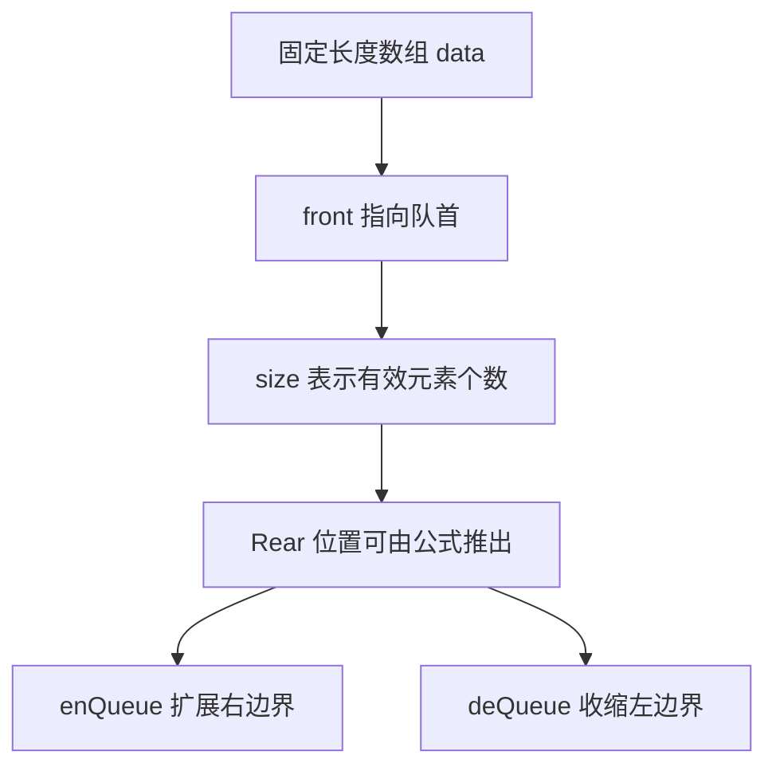

# 622. 设计循环队列 - 思路分析

## 📋 题目信息
- **难度**：中等
- **标签**：设计、队列、循环数组、环形缓冲区、数据结构
- **来源**：LeetCode

## 📖 题目描述

题目要求我们从零设计一个**循环队列** `MyCircularQueue`。这个队列的容量固定为 `k`，并且要满足标准的 FIFO 语义，也就是**先进先出**：最早进入队列的元素，必须最早离开队列。与普通线性队列不同的是，这里强调的是“循环”结构，也就是说，当数组尾部已经走到尽头时，如果前面有已经释放出来的空间，后续元素应该能够重新利用这些位置，而不是简单地认为整个队列已经无法继续插入。

要实现的接口如下。

- `MyCircularQueue(k)`：初始化一个容量为 `k` 的循环队列。
- `enQueue(value)`：向队尾插入一个元素，成功返回 `true`，失败返回 `false`。
- `deQueue()`：从队首删除一个元素，成功返回 `true`，失败返回 `false`。
- `Front()`：获取当前队首元素，如果为空返回 `-1`。
- `Rear()`：获取当前队尾元素，如果为空返回 `-1`。
- `isEmpty()`：判断队列是否为空。
- `isFull()`：判断队列是否已满。

题目文字里还专门提到了“环形缓冲器”这个说法。这个词很重要，因为它提醒我们：这道题并不是单纯在实现一个“支持入队和出队的容器”，而是在实现一个**固定容量下能循环复用空间的队列**。只要这一点想清楚，这道题就不难了；如果这一点没想明白，很容易写成“看上去像队列、实际上不是循环队列”的代码。

### 示例

```text
MyCircularQueue circularQueue = new MyCircularQueue(3); // 设置长度为 3
circularQueue.enQueue(1);  // 返回 true
circularQueue.enQueue(2);  // 返回 true
circularQueue.enQueue(3);  // 返回 true
circularQueue.enQueue(4);  // 返回 false，队列已满
circularQueue.Rear();      // 返回 3
circularQueue.isFull();    // 返回 true
circularQueue.deQueue();   // 返回 true
circularQueue.enQueue(4);  // 返回 true
circularQueue.Rear();      // 返回 4
```

### 约束条件

- 所有插入的值都在 `0 ~ 1000` 范围内。
- 操作次数在 `1 ~ 1000` 范围内。
- 不允许直接使用语言内置的队列库。

### 原题提供的 Python 模板

```python
class MyCircularQueue:

    def __init__(self, k: int):
        

    def enQueue(self, value: int) -> bool:
        

    def deQueue(self) -> bool:
        

    def Front(self) -> int:
        

    def Rear(self) -> int:
        

    def isEmpty(self) -> bool:
        

    def isFull(self) -> bool:
        
```

---

## 🤔 题目分析

### 1. 先把题目翻译成人话

如果把“设计循环队列”翻译成更口语化的话，题目其实是在问：请你设计一个容量固定的仓位系统，东西只能从一端进入、从另一端离开；当最前面的仓位被释放出来之后，后续的元素要能够重新使用这些空出来的位置，而不是让这些空间白白浪费掉。

因此，这道题要解决的并不是“怎么插入一个元素”这么简单，而是下面这三个更底层的问题。

1. 如何表示一个标准的 FIFO 队列。
2. 如何在固定长度数组中判断当前是空还是满。
3. 如何在不搬移所有元素的情况下复用之前释放出的空间。

这三个问题里面，第三个才是“循环队列”的灵魂。普通数组队列很多人都会写，但只要没有空间复用，严格来说它就不是题目要的解法。

### 2. 什么是队列

队列是一种线性数据结构，它的核心操作模式是：元素总是从一端加入，从另一端离开。这和栈的“后进先出”完全不同，队列强调的是“先来先走”。

从接口上看，本题中的队列只有一端入队、一端出队，因此它比上一题 `641. 设计循环双端队列` 要简单一些。`641` 里既有头插也有尾插，既有头删也有尾删，边界两端都在动；而 `622` 中，只有队尾负责插入，只有队首负责删除，所以状态变化更单纯，建模也更适合作为“循环数组专题”的入门题。

如果用一个现实类比来帮助理解，可以把队列想象成窗口排队：新来的人只能站到队伍最后面，离开的人只能是排在最前面的那一个。中间的人既不能跳到前面去，也不会从中途离开。只要你脑中一直保留这个“只能尾进头出”的画面，很多接口的语义就会非常稳定。

### 3. 为什么普通线性队列不够用

很多同学第一次做这题时，会先想到这样一种简单实现：用数组存元素，再维护一个 `head` 和一个 `tail`；每次入队就写到 `tail` 位置，然后 `tail += 1`；每次出队就让 `head += 1`。乍一看这已经像一个队列了，但它有一个明显问题：如果 `tail` 一直往右走，最终走到数组末尾之后，就再也无法继续插入，即使数组前面已经因为出队腾出了很多空位。

举个例子，容量为 `5` 的数组，先后执行以下操作：

```text
enQueue(1), enQueue(2), enQueue(3), deQueue(), deQueue(), enQueue(4), enQueue(5), enQueue(6)
```

如果你的实现只是线性地推进 `tail`，那么当 `tail` 到达数组尾部后就会误以为“队列已满”，但实际上前面已经释放出了可用位置。题目特别强调“循环”的目的，就是要求你把这种前面腾出的空位重新利用起来。

所以，普通线性推进的队列只能算半成品。真正的循环队列必须做到：**物理数组长度固定，但逻辑上的头尾位置可以在数组上绕圈移动。**

### 4. 这题为什么强烈暗示用数组

题目并没有禁止链表实现，但“固定容量 + 循环复用空间”这个组合几乎已经把最佳方案指向了数组。原因有几个。

- 数组的下标访问是 `O(1)`，非常适合快速定位头尾。
- 固定容量意味着不需要扩容，也就不需要链表那种动态分配能力。
- 循环的本质是“下标绕回”，数组通过取模最容易表达。
- 题目本身强调的是“用之前用过的空间”，这正是循环数组最擅长解决的问题。

当然，链表也能做标准队列，但链表的优势在于动态扩展，而不是固定容量下的环形复用。既然题目已经把问题描述得这么像“环形缓冲区”，我们就应该顺着题目最自然的语义去设计。

### 5. 本题最核心的难点其实是“空”和“满”

循环队列里最经典的问题不是入队和出队本身，而是：在环形结构中，如何区分当前是空队列还是满队列？如果你只维护 `front` 和 `rear` 这两个指针，那么它们有可能在队列为空时相等，也有可能在队列填满一圈后再次相等。也就是说，`front == rear` 这一状态本身是不够表达完整语义的。

解决这个问题常见有两条路线。

第一条路线是维护一个额外的 `size`，直接记录当前有效元素个数。空时 `size == 0`，满时 `size == capacity`。这种做法直观、清晰、适合教学。第二条路线是故意浪费一个空位，通过“总有一个位置不用”的方式，让 `front == rear` 只代表空，而满则由其他指针关系表示。这种方法也很经典，但解释成本更高。

在这道题的分析文档里，我们依然使用**数组 + front + size** 的建模方式，因为它更容易从题意自然过渡到代码，也更容易和 `641` 那题形成统一体系。

### 6. 本题比 641 简单在哪里

这一点非常值得点明。虽然 `622` 和 `641` 都属于循环数组设计题，但它们的复杂度并不完全一样。`641` 是双端队列，两边都要处理插入和删除；而 `622` 是普通队列，逻辑上只有“尾部扩张”和“头部收缩”两种边界变化。因此，在 `622` 中你只需要特别关注下面三件事。

- 队头在哪里。
- 新的队尾元素应该写到哪里。
- 出队之后队头如何向前推进。

你甚至可以把 `622` 看成理解 `641` 的前置题：先把“单端入队 + 单端出队”的循环数组模型吃透，再去扩展到“双端都能操作”的版本，会自然很多。

### 7. 最推荐的状态设计

我们维护以下四个成员变量。

- `data`：长度为 `k` 的固定数组。
- `capacity`：数组总容量。
- `front`：当前队首元素所在的物理下标。
- `size`：当前队列中有效元素个数。

注意，这里我们没有单独保存 `rear`。原因很简单：**队尾位置是可以由 `front` 和 `size` 算出来的派生信息，不一定需要额外存成根状态。**

如果当前有 `size` 个元素，那么逻辑上的第 `0` 个元素是队首，第 `size - 1` 个元素是队尾。于是：

- 队首位置：`front`
- 队尾位置：`(front + size - 1) % capacity`
- 新元素入队位置：`(front + size) % capacity`

一旦这三个公式建立起来，整道题其实已经解决了一大半。

### 8. 本题最重要的不变量

设计题最值得刻意训练的能力，就是写出不变量。这道题的不变量可以表述为：

> 当前循环队列中一共有 `size` 个有效元素；逻辑上的第 `i` 个元素，始终存储在 `data[(front + i) % capacity]` 中，其中 `0 <= i < size`。

这个不变量有几个直接推论。

1. `Front()` 直接返回 `data[front]`。
2. `Rear()` 返回 `data[(front + size - 1) % capacity]`。
3. `enQueue(value)` 时，把新值写到 `(front + size) % capacity`。
4. `deQueue()` 时，不必搬移数组，只需要让 `front` 向后走一格，并令 `size -= 1`。

也就是说，所有操作都可以被解释为：**在一个环形数组里维护“从 front 开始、长度为 size 的这段有效区间”。**

### 9. 为什么删除时通常不需要清空数组值

这是很多初学者容易卡住的一点。出队以后，原来队首所在位置的值要不要改成 `0` 或 `-1`？从逻辑正确性角度出发，通常并不需要。因为我们定义队列内容的依据不是“数组里哪些位置非零”，而是“从 `front` 开始连续 `size` 个位置有效”。

换句话说，数组中即使残留着历史值，只要它们已经不属于当前有效区间，就不会影响结果。后续如果这个位置再次被纳入有效区间，只需要在入队时覆盖新值即可。这种“逻辑有效性比物理残留值更重要”的观点，是很多数据结构设计题的共同思想。

### 10. 本题真正的突破口

如果要把整道题的突破口压缩成一句话，我会这样说：**不要把“队列顺序”理解成数组必须始终物理连续，而要把它理解成“从 front 开始读 size 个元素”这段逻辑区间。** 一旦你接受这个视角，所谓“循环”就不再神秘，它只不过是用取模把线性下标映射到环形数组上而已。

---

## 💡 解题思路

### 方法一：暴力解法

#### 🌟 形象化理解：排队的人离开后，后面所有人整体往前挪

先用最直观的方式理解这道题。想象一条排队通道被画成一条直线，地面上有 `k` 个固定脚印，分别表示数组中的 `k` 个槽位。每当一个人入队，就站到当前最后一个脚印后面；每当最前面的人出队，为了保证队头始终处于最左侧，后面所有人都整体向前挪一步。这个模型完全符合我们对“线性数组”的直觉：队列看起来总是从左到右连续排开的。

这个方案为什么叫“暴力”？因为它虽然逻辑正确，但每次出队都可能触发整段元素搬移。我们并不是通过更聪明的状态设计来复用空间，而是通过“硬搬数据”的方式维持队列的线性形态。

#### 思路说明

具体实现时，可以维护一个普通列表 `data`，始终保证当前队列内容从 `data[0]` 开始连续存放。入队时检查长度是否达到 `k`，若未满则直接追加；出队时删除 `data[0]`，让后续元素自动整体前移。获取队首就是读 `data[0]`，获取队尾就是读 `data[-1]`。判空和判满分别由当前长度是否为 `0` 或 `k` 决定。

这种写法的优点是：非常容易理解，而且能保证功能正确。它的缺点也非常明确：**每次出队都可能是 `O(k)` 的搬移成本。**

#### 算法步骤

1. 初始化一个空列表 `data` 和固定容量 `k`。
2. `enQueue(value)`：若 `len(data) == k`，返回 `False`；否则执行 `append(value)`。
3. `deQueue()`：若 `len(data) == 0`，返回 `False`；否则删除第一个元素。
4. `Front()`：若为空返回 `-1`，否则返回 `data[0]`。
5. `Rear()`：若为空返回 `-1`，否则返回 `data[-1]`。
6. `isEmpty()`：判断 `len(data) == 0`。
7. `isFull()`：判断 `len(data) == k`。

#### 复杂度分析

- `enQueue`：`O(1)` 均摊。
- `deQueue`：`O(k)`，因为删除头部后可能需要整体搬移。
- `Front`、`Rear`、`isEmpty`、`isFull`：都是 `O(1)`。
- 空间复杂度：`O(k)`。

#### 为什么需要优化

这个方案的问题不在于“不能做”，而在于“没有体现循环队列的本质优势”。题目之所以强调循环结构，就是希望我们避免头部删除带来的整体搬移。最优的设计应该做到：入队、出队、读头、读尾都只修改少量状态，而不是对一整段数据做线性移动。

因此，下一步的优化方向非常明确：**能不能不移动元素，只移动队列边界？** 一旦问题转化成这个形式，循环数组就自然登场了。

---

### 方法二：循环数组 + `front` + `size`

#### 🌟 形象化理解：一圈编号座位，队列只是其中连续的一段

想象有一圈编号座位，共 `k` 个，编号从 `0` 到 `k-1`。队列中的人并不是在一条直线上排，而是在这圈座位上占据一段连续的有效区间。最前面的人坐在 `front` 对应的座位上，后面的人依次沿着编号增长方向坐下，走到末尾后就回到 `0` 号位继续排。新来的人只能坐到这段区间的尾部后面，离开的人永远只会是 `front` 所指向的那个。

在这个类比里：

- 固定数组就是那一圈座位。
- `front` 表示当前排在最前面的人坐在哪个位置。
- `size` 表示当前一共有多少个人在排队。
- 入队就是在有效区间右端再扩一个座位。
- 出队就是让有效区间左端向前收缩一个座位。

这个类比特别好的一点在于，它强调了一个核心事实：**真正变化的不是数组本身，而是我们如何解释“当前哪一段位置属于队列”。**

#### 核心状态与公式

我们使用下面的状态建模方式。

- `data`：固定长度为 `capacity` 的数组。
- `front`：当前队首下标。
- `size`：当前有效元素数量。
- `capacity`：数组总长度。

基于这个建模，有三条核心公式需要记住。

1. 逻辑上的第 `i` 个元素位置：`(front + i) % capacity`
2. 当前队尾位置：`(front + size - 1) % capacity`
3. 新元素入队位置：`(front + size) % capacity`

如果把这三条公式想明白，本题所有接口就都只是它们的直接应用。

#### 优化思路推导

下面把每个操作逐一从状态角度推出来。

##### 1）`Front()` 为什么最简单

因为我们直接把队首位置保存成了 `front`，所以只要队列非空，`Front()` 直接返回 `data[front]` 即可。这看起来很普通，但其实说明我们的状态设计非常到位：最重要、最常访问的边界被显式保存了下来。

##### 2）`Rear()` 为什么不用单独维护 `rear`

队尾是逻辑上的最后一个元素，而当前共有 `size` 个元素，所以最后一个元素就是第 `size - 1` 个。根据“第 `i` 个元素位置”的公式，队尾位置就是 `(front + size - 1) % capacity`。这说明 `rear` 不是必须额外存储的状态，它完全可以从已有状态推导出来。

这种“按需计算派生状态，而不额外保存”的思想，在设计题里很重要。多保存一个变量看似方便，但实际上会增加同步出错的风险。

##### 3）`enQueue(value)` 的本质是什么

当前有 `size` 个元素，新元素入队后会成为逻辑上的第 `size` 个元素，因此它的物理位置应该是 `(front + size) % capacity`。把值写进去后，令 `size += 1` 即可。

注意，入队时 `front` 不变，因为队首没有变化。我们只是让右边界向后扩了一格。

##### 4）`deQueue()` 的本质是什么

出队总是删除当前队首元素，因此删除之后，新的队首应该是逻辑上的第二个元素。也就是说，`front` 应该向后移动一格，即 `front = (front + 1) % capacity`，然后 `size -= 1`。

这里最值得强调的是：**不需要搬移任何数组元素。** 原来 `front` 所在位置上的旧值即使还保留着，也已经不再属于有效区间了。后续如果新元素入队覆盖掉它，那是之后的事。

##### 5）为什么判空判满很自然

由于我们显式维护 `size`，所以判空和判满都直接落在最自然的语义上。

- 空：`size == 0`
- 满：`size == capacity`

这也是我们选择 `size` 方案的重要原因之一。它让接口语义和状态语义几乎一一对应，不需要引入额外的“保留空位”技巧。

#### 算法步骤

1. 初始化一个长度为 `k` 的数组 `data`。
2. 维护 `capacity = k`、`front = 0`、`size = 0`。
3. `enQueue(value)`：如果队列已满，返回 `False`；否则在 `(front + size) % capacity` 位置写入 `value`，再令 `size += 1`。
4. `deQueue()`：如果队列为空，返回 `False`；否则让 `front = (front + 1) % capacity`，再令 `size -= 1`。
5. `Front()`：若为空返回 `-1`，否则返回 `data[front]`。
6. `Rear()`：若为空返回 `-1`，否则返回 `data[(front + size - 1) % capacity]`。
7. `isEmpty()`：返回 `size == 0`。
8. `isFull()`：返回 `size == capacity`。

#### 复杂度分析

这个方案中，每个接口都只做了有限次数组访问、取模运算和变量更新，因此所有操作的时间复杂度都是 `O(1)`。底层数组大小固定为 `k`，额外只使用了常数个成员变量，因此空间复杂度为 `O(k)`。

#### 为什么这个方案才真正体现“循环”

很多人对“循环”的直觉是“指针会转圈”，但更深一层的理解应该是：**一旦头部元素出队，前面腾出来的位置可以被后续元素重新利用，而整个过程中不需要移动已有元素。** 这就是循环结构相对于普通线性数组队列最大的价值所在。取模只是实现形式，本质是空间复用和状态重解释。

#### 补充：另一种经典写法是什么

循环队列还有一种非常经典的实现方式：不开 `size`，而是申请 `k + 1` 个位置，故意让其中一个位置永远不用。这样当 `front == rear` 时表示空，当 `(rear + 1) % capacity == front` 时表示满。这个方案也完全正确，而且在很多教材里很常见。

不过从教学角度看，它需要先解释“为什么明明容量是 `k`，却要申请 `k+1` 个位置”，对初学者不够直接。因此在这份文档里我们更推荐 `size` 方案：表达更直观，和 `641` 双端队列也更容易统一起来。

---

## 🎨 图解说明

### 1. 用题目示例完整手推一次

下面我们按题目给出的示例，一步一步展示循环队列的状态变化。注意我会同时给出“数组的物理状态”和“队列的逻辑顺序”，因为这两者在循环数组题里并不总是一致。

#### 初始状态

```text
capacity = 3
data     = [_, _, _]
front    = 0
size     = 0
逻辑队列 = []
```

此时没有任何元素。`front = 0` 只是一个初始占位值，并不表示 `0` 号位里一定有有效数据。

#### 操作一：`enQueue(1)`

入队位置为 `(front + size) % capacity = (0 + 0) % 3 = 0`，因此把 `1` 写入 `data[0]`，随后 `size = 1`。

```text
data     = [1, _, _]
front    = 0
size     = 1
逻辑队列 = [1]
```

#### 操作二：`enQueue(2)`

入队位置为 `(0 + 1) % 3 = 1`，因此把 `2` 写入 `data[1]`。

```text
data     = [1, 2, _]
front    = 0
size     = 2
逻辑队列 = [1, 2]
```

#### 操作三：`enQueue(3)`

入队位置为 `(0 + 2) % 3 = 2`，因此把 `3` 写入 `data[2]`。

```text
data     = [1, 2, 3]
front    = 0
size     = 3
逻辑队列 = [1, 2, 3]
```

此时 `size == capacity`，说明队列已满。

#### 操作四：`enQueue(4)`

因为当前已满，所以入队失败，返回 `False`，状态保持不变。

```text
data     = [1, 2, 3]
front    = 0
size     = 3
逻辑队列 = [1, 2, 3]
```

#### 操作五：`Rear()`

队尾位置为 `(front + size - 1) % capacity = (0 + 3 - 1) % 3 = 2`，因此返回 `data[2] = 3`。

#### 操作六：`isFull()`

由于 `size == capacity`，因此返回 `True`。

#### 操作七：`deQueue()`

出队时，当前队首元素 `1` 被逻辑删除。新的队首应当是下一个位置，因此更新：`front = (0 + 1) % 3 = 1`，然后 `size = 2`。

```text
data     = [1, 2, 3]
front    = 1
size     = 2
逻辑队列 = [2, 3]
```

注意这一步特别关键：物理数组里 `1` 还留在 `data[0]` 中，但它已经不在当前有效区间里了，因此不会再被当作队列元素使用。

#### 操作八：`enQueue(4)`

此时入队位置为 `(front + size) % capacity = (1 + 2) % 3 = 0`。这就是“循环”的体现：新元素不会写到数组外面，而是写回到之前被出队释放掉的 `0` 号位置。

```text
data     = [4, 2, 3]
front    = 1
size     = 3
逻辑队列 = [2, 3, 4]
```

这一步也非常适合帮助你理解“物理顺序与逻辑顺序不同”。物理数组看起来是 `[4, 2, 3]`，但逻辑顺序必须从 `front = 1` 开始读三个元素，因此是 `2 -> 3 -> 4`。

#### 操作九：`Rear()`

队尾位置为 `(1 + 3 - 1) % 3 = 0`，因此返回 `data[0] = 4`。

### 2. 状态变化总表

| 步骤 | 操作 | 返回值 | `front` | `size` | 数组物理状态 | 逻辑队列 |
| --- | --- | --- | --- | --- | --- | --- |
| 0 | 初始化 | `null` | 0 | 0 | `[_, _, _]` | `[]` |
| 1 | `enQueue(1)` | `true` | 0 | 1 | `[1, _, _]` | `[1]` |
| 2 | `enQueue(2)` | `true` | 0 | 2 | `[1, 2, _]` | `[1, 2]` |
| 3 | `enQueue(3)` | `true` | 0 | 3 | `[1, 2, 3]` | `[1, 2, 3]` |
| 4 | `enQueue(4)` | `false` | 0 | 3 | `[1, 2, 3]` | `[1, 2, 3]` |
| 5 | `Rear()` | `3` | 0 | 3 | `[1, 2, 3]` | `[1, 2, 3]` |
| 6 | `isFull()` | `true` | 0 | 3 | `[1, 2, 3]` | `[1, 2, 3]` |
| 7 | `deQueue()` | `true` | 1 | 2 | `[1, 2, 3]` | `[2, 3]` |
| 8 | `enQueue(4)` | `true` | 1 | 3 | `[4, 2, 3]` | `[2, 3, 4]` |
| 9 | `Rear()` | `4` | 1 | 3 | `[4, 2, 3]` | `[2, 3, 4]` |

### 3. 一个额外的跨边界例子

很多同学真正困惑的不是题目示例，而是“为什么 `front` 变了之后，数组看起来会断开”。下面我们单独举一个更典型的跨边界场景。

假设当前容量 `capacity = 5`，状态如下：

```text
index: 0   1   2   3   4
data : _   _   _  10  11
front = 3
size  = 2
逻辑队列 = [10, 11]
```

此时如果执行 `enQueue(12)`，新位置是 `(3 + 2) % 5 = 0`。于是：

```text
index: 0   1   2   3   4
data : 12  _   _  10  11
front = 3
size  = 3
逻辑队列 = [10, 11, 12]
```

这时物理上数据是“断开”的，但逻辑上队列仍然是连续的。这个例子可以帮助你彻底摆脱“数组必须从左到右连续才算队列”的思维惯性。

### 4. 再看一个出队后的例子

假设当前状态为：

```text
index: 0   1   2   3   4
data : 12  _   _  10  11
front = 3
size  = 3
逻辑队列 = [10, 11, 12]
```

现在执行一次 `deQueue()`，队首元素 `10` 逻辑出队，新的 `front = (3 + 1) % 5 = 4`，新的 `size = 2`。

```text
index: 0   1   2   3   4
data : 12  _   _  10  11
front = 4
size  = 2
逻辑队列 = [11, 12]
```

请注意，`data[3]` 中的旧值 `10` 依然保留着，但队列逻辑已经完全不再包含它。只要你真正理解了这一点，就说明你已经跨过循环队列最核心的认知门槛了。

### 5. Mermaid 图解



### 6. 一句图解总结

如果把这道题画成一张脑图，它的中心句应该是：**循环队列不是“把数组转一圈”，而是“把数组解释为一个环，并让队列始终占据其中一段长度为 `size` 的连续逻辑区间”。**

---

## ✏️ 代码框架填空

> **学习提示**：这道题真正需要牢牢记住的不是七个接口，而是三条位置公式和两个状态量。填空的目标，就是逼自己把这些公式从“看懂”变成“能写出来”。

### Python 填空版

```python
class MyCircularQueue:

    def __init__(self, k: int):
        # 固定数组，用来承载循环队列
        self.data = [0] * k
        # 数组总容量
        self.capacity = k
        # front 始终指向当前队首元素的位置
        self.front = 0
        # 当前有效元素数量
        self.size = ______

    def enQueue(self, value: int) -> bool:
        # 已满时不能继续入队
        if ______:
            return False

        # 新元素应写到逻辑上的第 size 个位置
        insert_index = ______
        self.data[insert_index] = value
        self.size += 1
        return True

    def deQueue(self) -> bool:
        # 空队列不能出队
        if ______:
            return False

        # 出队后，新的队首应该向后移动一格
        self.front = ______
        self.size -= 1
        return True

    def Front(self) -> int:
        if self.isEmpty():
            return -1
        return self.data[self.front]

    def Rear(self) -> int:
        if self.isEmpty():
            return -1

        # 队尾是逻辑上的最后一个元素
        rear_index = ______
        return self.data[rear_index]

    def isEmpty(self) -> bool:
        return ______

    def isFull(self) -> bool:
        return ______
```

### Python 填空提示详解

#### 填空 1：初始化时 `size` 应该是多少

初始化之后队列中还没有任何元素，因此 `size` 必须从 `0` 开始。这是后续所有状态更新的基准。别小看这个空，它直接决定了第一次入队时新元素应该写到哪里。

#### 填空 2：入队前如何判断已满

既然我们已经单独实现了 `isFull()`，最清晰的写法就是直接复用它，而不是重复展开判满条件。这样做的好处是：语义集中、代码简洁，也能减少未来修改时的同步成本。

#### 填空 3：新元素入队位置

当前有 `size` 个元素，因此新元素会成为逻辑上的第 `size` 个元素，其下标为 `(self.front + self.size) % self.capacity`。这一条公式是整道题的关键之一，如果你忘了它，就很难真正理解循环队列。

#### 填空 4：出队前如何判断为空

空队列不能删除元素，所以这里也应直接调用 `self.isEmpty()`。这种做法能让边界条件检查具有统一风格，不会一会儿写成接口调用，一会儿又手写判断表达式。

#### 填空 5：出队后 `front` 怎么更新

出队总是删除当前队首，因此新的队首就是下一个环形位置，也就是 `(self.front + 1) % self.capacity`。请注意这里并不需要先清除旧值，因为旧位置是否有效并不由数组内容决定，而由 `front` 和 `size` 决定。

#### 填空 6：队尾下标怎么求

当前队尾是逻辑上的最后一个元素，也就是第 `self.size - 1` 个，因此位置是 `(self.front + self.size - 1) % self.capacity`。这与入队位置公式只差一个偏移量，很适合放在一起记忆。

#### 填空 7 与 8：空和满的判断

因为我们采用的是 `size` 方案，所以空和满的判断最直观：`self.size == 0` 表示空，`self.size == self.capacity` 表示满。只要坚持这套方案，就不要再混入其他“空一格”写法，否则思路会打架。

### C++ 填空版

```cpp
class MyCircularQueue {
private:
    vector<int> data;
    int capacity;
    int front;
    int size;

public:
    MyCircularQueue(int k) {
        data = vector<int>(k, 0);
        capacity = k;
        front = 0;
        size = ______;
    }

    bool enQueue(int value) {
        if (______) {
            return false;
        }

        int insertIndex = ______;
        data[insertIndex] = value;
        size++;
        return true;
    }

    bool deQueue() {
        if (______) {
            return false;
        }

        front = ______;
        size--;
        return true;
    }

    int Front() {
        if (isEmpty()) {
            return -1;
        }
        return data[front];
    }

    int Rear() {
        if (isEmpty()) {
            return -1;
        }

        int rearIndex = ______;
        return data[rearIndex];
    }

    bool isEmpty() {
        return ______;
    }

    bool isFull() {
        return ______;
    }
};
```

### C++ 填空提示

这部分和 Python 的逻辑完全一样，只是把 `self.xxx` 改成成员变量名本身即可。特别要注意的是：即便是 C++，删除队首也不需要做任何内存释放，因为这里用的是固定数组槽位，不是链表节点；队列的逻辑变化只由 `front` 和 `size` 控制。

---

## 💻 完整代码实现

> **阅读建议**：看代码时不要只盯着语句本身，而要不断对照前面的不变量，问自己“这一步是在扩张哪一侧边界，还是在收缩哪一侧边界”。

### Python 实现

```python
class MyCircularQueue:

    def __init__(self, k: int):
        # 固定长度数组，用于承载循环队列中的元素
        self.data = [0] * k
        # 队列容量固定为 k
        self.capacity = k
        # front 始终指向当前队首元素的下标
        self.front = 0
        # 当前有效元素个数
        self.size = 0

    def enQueue(self, value: int) -> bool:
        # 队列已满，不能继续入队
        if self.isFull():
            return False

        # 新元素应插入到逻辑上的第 size 个位置
        insert_index = (self.front + self.size) % self.capacity
        self.data[insert_index] = value
        self.size += 1
        return True

    def deQueue(self) -> bool:
        # 空队列无法出队
        if self.isEmpty():
            return False

        # 删除队首后，新的队首是下一个环形位置
        self.front = (self.front + 1) % self.capacity
        self.size -= 1
        return True

    def Front(self) -> int:
        # 空队列没有队首元素
        if self.isEmpty():
            return -1
        return self.data[self.front]

    def Rear(self) -> int:
        # 空队列没有队尾元素
        if self.isEmpty():
            return -1

        # 队尾是逻辑上的最后一个元素
        rear_index = (self.front + self.size - 1) % self.capacity
        return self.data[rear_index]

    def isEmpty(self) -> bool:
        return self.size == 0

    def isFull(self) -> bool:
        return self.size == self.capacity
```

### Python 代码逐段解析

#### 1. 初始化为什么只需要四个变量

我们只保存了 `data`、`capacity`、`front`、`size` 这四个量。之所以不再额外维护 `rear`，不是因为它不重要，而是因为它完全可以从已有信息推导出来。设计题中一个非常重要的原则是：如果某个状态能够稳定地由其他根状态导出，那么最好不要把它也存成独立变量。变量越多，状态同步的负担往往越重。

#### 2. 为什么 `enQueue` 不更新 `front`

入队发生在队尾，本质上是让右边界向后扩张一格。由于左边界没有变化，因此 `front` 不应发生任何改变。很多初学者刚接触循环队列时，会担心“下标转一圈之后是不是所有指针都要动”。其实不需要。谁的语义发生变化，谁才应该更新。`front` 作为队首位置，在入队过程中没有语义变化，所以保持不动是最自然的。

#### 3. 为什么 `deQueue` 的顺序是先改 `front` 再减 `size`

从严格语义上讲，这两句的先后顺序在当前写法下都不会出错，但“先让队首向前走，再缩小有效长度”更符合我们对出队动作的直观理解：先确定新的队首位置，再确认有效元素数减少一个。好的代码不仅要对机器正确，也要尽量贴近人的思维顺序，这样阅读和维护都更轻松。

#### 4. 为什么 `Rear()` 不需要修改任何状态

`Rear()` 是一个只读操作，它只需要利用当前状态计算队尾位置并返回值，不应改变任何成员变量。这一点虽然看起来不复杂，但在设计题中很重要：读操作和写操作要边界分明。只读接口不改变状态，是保证代码可预期性的基本要求。

#### 5. 为什么这段代码对 `k = 1` 也完全成立

当 `capacity = 1` 时，所有取模结果都只能是 `0`。第一次入队会把元素写到 `data[0]`，随后 `size = 1`，队列已满；出队时 `front = (0 + 1) % 1 = 0`，`size` 再次回到 `0`。整个流程没有任何特殊分支，说明我们的公式是真正统一的，而不是靠“默认容量足够大”侥幸通过。

### Python 填空答案

- 填空 1：`0`
- 填空 2：`self.isFull()`
- 填空 3：`(self.front + self.size) % self.capacity`
- 填空 4：`self.isEmpty()`
- 填空 5：`(self.front + 1) % self.capacity`
- 填空 6：`(self.front + self.size - 1) % self.capacity`
- 填空 7：`self.size == 0`
- 填空 8：`self.size == self.capacity`

### C++ 实现

```cpp
#include <vector>
using namespace std;

class MyCircularQueue {
private:
    vector<int> data;
    int capacity;
    int front;
    int size;

public:
    MyCircularQueue(int k) {
        // 初始化固定长度数组
        data = vector<int>(k, 0);
        // 队列总容量
        capacity = k;
        // front 指向当前队首位置
        front = 0;
        // 当前有效元素个数
        size = 0;
    }

    bool enQueue(int value) {
        // 满队列无法继续入队
        if (isFull()) {
            return false;
        }

        // 新元素会成为逻辑上的第 size 个元素
        int insertIndex = (front + size) % capacity;
        data[insertIndex] = value;
        size++;
        return true;
    }

    bool deQueue() {
        // 空队列无法出队
        if (isEmpty()) {
            return false;
        }

        // 队首向后移动一个环形位置
        front = (front + 1) % capacity;
        size--;
        return true;
    }

    int Front() {
        // 空队列没有队首
        if (isEmpty()) {
            return -1;
        }
        return data[front];
    }

    int Rear() {
        // 空队列没有队尾
        if (isEmpty()) {
            return -1;
        }

        // 队尾是当前逻辑上的最后一个元素
        int rearIndex = (front + size - 1) % capacity;
        return data[rearIndex];
    }

    bool isEmpty() {
        return size == 0;
    }

    bool isFull() {
        return size == capacity;
    }
};
```

### C++ 与 Python 的主要差异

两份代码在逻辑上没有任何本质差异，区别主要体现在语法层面：Python 使用动态语言的列表，C++ 使用 `vector<int>`；Python 通过 `self.xxx` 访问成员变量，C++ 直接访问类成员。无论语言如何变化，真正需要掌握的都是那套状态设计和公式，而不是某门语言的表面写法。

### C++ 填空答案

- 填空 1：`0`
- 填空 2：`isFull()`
- 填空 3：`(front + size) % capacity`
- 填空 4：`isEmpty()`
- 填空 5：`(front + 1) % capacity`
- 填空 6：`(front + size - 1) % capacity`
- 填空 7：`size == 0`
- 填空 8：`size == capacity`

### 公式速记表

| 含义 | 公式 |
| --- | --- |
| 逻辑第 `i` 个元素位置 | `(front + i) % capacity` |
| 队首位置 | `front` |
| 队尾位置 | `(front + size - 1) % capacity` |
| 新元素入队位置 | `(front + size) % capacity` |
| 出队后的新队首 | `(front + 1) % capacity` |
| 判空 | `size == 0` |
| 判满 | `size == capacity` |

### 如果想进一步抽象成本题模板

你也可以把本题抽象成如下模板，用来帮助记忆“循环数组 + 单端队列”的共性结构。

```python
class CircularQueueTemplate:
    def __init__(self, k: int):
        self.data = [0] * k
        self.capacity = k
        self.front = 0
        self.size = 0

    def push_back(self, value: int) -> bool:
        if self.size == self.capacity:
            return False
        index = (self.front + self.size) % self.capacity
        self.data[index] = value
        self.size += 1
        return True

    def pop_front(self) -> bool:
        if self.size == 0:
            return False
        self.front = (self.front + 1) % self.capacity
        self.size -= 1
        return True

    def front_value(self) -> int:
        if self.size == 0:
            return -1
        return self.data[self.front]

    def rear_value(self) -> int:
        if self.size == 0:
            return -1
        return self.data[(self.front + self.size - 1) % self.capacity]
```

这个模板的价值不在于复制粘贴，而在于帮助你看出：本题所有接口其实都围绕同一套状态公式展开，并没有哪一个函数需要“额外灵感”。

---

## ⚠️ 易错点提醒

### 1. 误以为数组内容顺序就是队列顺序

循环数组里，物理顺序和逻辑顺序经常不同。尤其当 `front` 不等于 `0` 时，如果你仍然按数组从左到右去读，就会得到错误的队列顺序。正确做法永远是：从 `front` 开始，连续读取 `size` 个位置，并且每走一步都要取模。

### 2. 写成“线性队列”而不是“循环队列”

有些实现会维护一个一直递增的 `rear`，一旦走到数组末尾就认定不能再插入。这种代码即使前面已经有空位，也无法继续复用空间。它实现的只是一个低配版数组队列，而不是题目要求的循环队列。判断自己是否真的写对了，一个很简单的方法就是：出队几次之后再入队，看看新元素能不能回到数组前面的空位里。

### 3. 没有统一好空与满的判定方案

如果你选择了 `size` 方案，就应该始终围绕 `size` 来判断空与满。不要在某些函数里用 `size == 0`，在另一些函数里又改成根据 `front`、`rear` 的关系来猜测，这样非常容易出现逻辑冲突。设计题里最怕的不是公式复杂，而是方案混搭。

### 4. 忘记在 `Rear()` 中先判空

`Rear()` 虽然只是读值，但空队列时没有合法队尾。如果你直接计算 `(front + size - 1) % capacity`，当 `size = 0` 时就会得到毫无语义保证的结果。因此，`Rear()` 必须和 `Front()` 一样，先判断是否为空，再决定返回有效值还是 `-1`。

### 5. 出队时错误地尝试清空旧值

严格来说，把旧位置清空通常不会导致错误，但这会暴露出一个更深层的问题：你还没有完全接受“逻辑有效性由 `front` 和 `size` 决定”这一点。如果你真的理解了这个模型，就会知道出队时最关键的是移动 `front` 和更新 `size`，而不是执着于把数组里的旧数抹掉。

### 6. 忘记小容量边界

`k = 1` 是非常好的测试用例。很多实现表面看起来能跑，但在容量为 `1` 时会暴露出判满、判空或取模更新上的问题。写完之后，强烈建议你手推一下：入队一次、再入队一次、出队一次、再出队一次，看看每一步是否都符合预期。

### 7. 调试时建议打印“逻辑快照”

如果你自己实现这道题时总感觉状态混乱，建议写一个调试辅助函数，用来按逻辑顺序而不是物理顺序打印队列，例如：

```python
def snapshot(self):
    return [self.data[(self.front + i) % self.capacity] for i in range(self.size)]
```

有了这个函数，你就不会被数组中的历史残留值迷惑，而能直接看到当前队列真正的逻辑内容。

### 8. 推荐重点验证的测试场景

下面这些测试用例特别值得自己手动跑一遍。

- 初始状态下直接 `Front()`、`Rear()`、`deQueue()`。
- 连续入队直到满，再多入一次。
- 入队若干次、出队若干次，再入队，看是否发生回绕复用。
- 连续执行“入队、出队、入队、出队”，观察 `front` 是否始终稳定。
- 极小容量 `k = 1`、`k = 2`。

如果这些场景都能正确通过，说明你的循环队列实现基本已经很扎实了。

---

## 🔗 相似题目推荐

### 1. 同类型题目

**641. 设计循环双端队列（中等）**：这是本题最直接的升级版。`622` 只要求尾插、头删，而 `641` 要求两端都支持插入和删除。理解了本题的 `front + size` 建模之后，再去看 `641` 会非常顺，因为你只是在现有“单端边界变化”基础上增加了另一端的边界操作。

**225. 用队列实现栈（简单）**：虽然它不是循环数组题，但它非常适合帮助你进一步理解“接口语义”和“底层实现”并不一定一致。你会逐渐意识到，数据结构题真正重要的不是名字，而是你如何用内部状态去满足对外语义。

**232. 用栈实现队列（简单）**：这题同样强调队列语义，只不过底层用的是两个栈。它能帮助你从另一个角度强化对 FIFO 的理解，也让你体会“实现方式可以很多，但语义必须稳定”这一原则。

### 2. 进阶题目

**707. 设计链表（中等）**：如果说本题是数组型设计题的代表，那么 `707` 则是链表型设计题的代表。前者关注下标和环，后者关注节点和指针。两题搭配学习，会帮助你建立更全面的数据结构设计视角。

**146. LRU 缓存（中等）**：这是更高阶的数据结构设计题，需要哈希表与双向链表联合维护顺序和快速定位能力。完成本题后再去挑战 `146`，你会更能理解“根状态”和“派生状态”的选择，以及为什么设计题里状态越清晰，代码就越稳定。

**1670. 设计前中后队列（中等）**：它把队列操作从“头和尾”进一步扩展到“中间”，要求你维护更复杂的平衡关系。掌握本题之后，这道题会是一个不错的进阶练习。

### 3. 推荐学习路径

如果你正在系统学习基础数据结构设计题，建议按下面的顺序练习：

1. `232. 用栈实现队列`
2. `225. 用队列实现栈`
3. `622. 设计循环队列`
4. `641. 设计循环双端队列`
5. `707. 设计链表`
6. `146. LRU 缓存`

这个顺序的好处在于，它先让你建立“队列/栈语义”，然后再过渡到“循环数组中的边界维护”，最后再扩展到链表和复合结构，整体难度上升比较自然。

---

## 📚 知识点总结

### 1. 本题最值得带走的东西

这道题最值得带走的，不是某份具体代码，而是一个非常通用的设计思想：**如果一个线性结构只关心逻辑上的相对顺序，而不要求物理上始终连续，那么很多昂贵的搬移操作都可以被“边界状态更新”替代。** 循环队列就是这个思想最经典的例子之一。

### 2. 本题涉及的核心知识点

- **FIFO 语义**：谁先进入，谁先离开，队首和队尾职责明确。
- **循环数组**：通过取模运算让下标在固定范围内循环回绕。
- **空间复用**：数组前部释放出的空间可以被后续入队重新利用。
- **状态建模**：使用 `front` 和 `size` 共同描述当前有效区间。
- **派生状态计算**：队尾位置不必存储，可以按需通过公式推出。
- **不变量意识**：逻辑上的第 `i` 个元素始终位于 `(front + i) % capacity`。

### 3. 一份可以复用的认知模板

做类似题目时，你可以优先问自己下面几个问题。

1. 我真正需要保存的根状态有哪些？
2. 哪些量只是派生状态，不必额外存？
3. 我维护的“有效区间”是由哪两个量定义的？
4. 读操作是否只是读取，不该改状态？
5. 删除某个元素时，是真要改动数据本体，还是只要收缩有效区间？

如果你能用这种提问方式去思考设计题，很多看似不同的题目其实都会变得非常相似。

### 4. 从 622 到 641 的迁移要点

如果你已经掌握了本题，那么再看 `641` 时可以把它理解为：在 `622` 的基础上，把“只有右边能扩张、左边能收缩”扩展成“两边都能扩张、两边都能收缩”。本题中最关键的 `front + size` 模型并不会被推翻，反而会继续发挥作用。因此，本题是理解双端循环结构的最理想跳板之一。

### 5. 最终一句复盘

如果你最后只记住一句话，请记住：**循环队列的本质不是让数组真的转起来，而是把数组看成一个环，并用 `front` 和 `size` 去定义“从哪开始、连续多少个位置当前有效”。** 一旦这句话真正变成你的直觉，本题就不再是一道要背模板的设计题，而是一道你可以自己推出来的题。

---

## 📝 补充说明

### 1. 从理解到独立实现的建议顺序

第一步，先不用写代码，尝试自己回答：为什么普通线性数组队列会浪费空间？第二步，再写出本题最关键的三个公式：逻辑第 `i` 个元素位置、当前队尾位置、新元素入队位置。第三步，尝试自己补全填空版代码。第四步，对照完整实现，看看自己错在公式、边界还是语义理解。第五步，再自己从零写一遍，并用 `k = 1` 和“跨边界回绕”案例进行验证。这样走一轮下来，本题就会真正内化成你自己的能力。

### 2. 时间复杂度优化历程

本题非常适合拿来训练“优化到底优化了什么”这个问题。暴力方案把顺序理解成物理连续，因此一旦队首删除，后面所有元素都要前移，导致出队成本高；循环数组方案则把顺序理解成逻辑连续，于是头部删除只需移动边界，不必搬移元素，从而把所有操作统一压缩到 `O(1)`。这里的优化不是某种花哨技巧，而是对问题表示方式的升级。

### 3. 工程中的对应场景

循环队列并不是面试里才会出现的“纸上结构”。很多工程场景都和它高度相似，例如固定长度日志缓冲区、网络数据包接收缓冲、音视频流数据的环形缓存、操作系统中的有界消息队列等。理解本题之后，你会更容易看懂为什么这些系统喜欢“固定容量 + 环形下标 + 边界移动”这种设计：它简单、稳定、高效，而且非常节省不必要的数据搬移。

### 4. 与另一种写法的取舍总结

最后再强调一次，`size` 写法不是唯一答案，但它是这道题非常适合学习的一种答案。它的优点在于：判空判满直观，和题目语义贴合，和 `641` 的统一性强，教学解释成本低。另一种“空一格”的写法也值得知道，但更适合在你已经理解循环结构之后再去扩展掌握，而不是一开始就作为主线方案使用。

### 5. 结束前的自测问题

你可以在看完文档后，尝试闭上文档自己回答下面这些问题：

- 为什么 `Rear()` 能算出来，而不一定要单独维护？
- 为什么出队后不需要移动整段元素？
- 为什么旧值保留在数组里不会影响正确性？
- 为什么“数组物理顺序”和“队列逻辑顺序”可以不同？
- 为什么 `enQueue(4)` 在示例最后一步会写回到数组开头？

如果这些问题你都能清楚回答，那么这道题你就已经不是“刷过”了，而是真的理解了。
