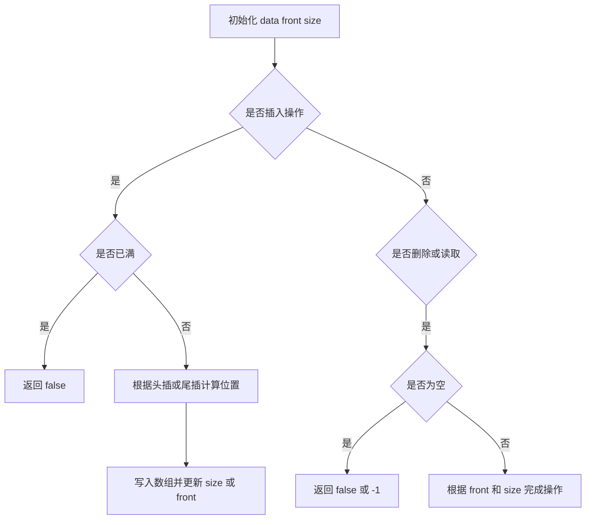

# 641. 设计循环双端队列 - 思路分析

## 📋 题目信息
- **难度**：中等
- **标签**：设计、队列、双端队列、循环数组、数据结构
- **来源**：LeetCode

## 📖 题目描述

题目要求我们设计一个容量固定为 `k` 的双端队列 `MyCircularDeque`。这个双端队列既要支持从队头插入和删除，也要支持从队尾插入和删除；与此同时，它还不是普通的“线性数组队列”，而是一个**循环**结构，也就是说，当底层数组走到末尾之后，还可以回到开头继续使用之前释放出来的位置。

需要实现的接口如下。

- `MyCircularDeque(int k)`：初始化双端队列，最大容量为 `k`。
- `boolean insertFront(int value)`：将一个元素插入到队头，如果成功返回 `true`，否则返回 `false`。
- `boolean insertLast(int value)`：将一个元素插入到队尾，如果成功返回 `true`，否则返回 `false`。
- `boolean deleteFront()`：删除队头元素，如果成功返回 `true`，否则返回 `false`。
- `boolean deleteLast()`：删除队尾元素，如果成功返回 `true`，否则返回 `false`。
- `int getFront()`：获取队头元素，如果为空则返回 `-1`。
- `int getRear()`：获取队尾元素，如果为空则返回 `-1`。
- `boolean isEmpty()`：判断当前双端队列是否为空。
- `boolean isFull()`：判断当前双端队列是否已满。

这道题看上去是在考很多接口，实际上真正考察的核心只有一个：**如何用有限长度的数组维护一个逻辑上连续、物理上允许绕回的双端序列**。只要这个建模清楚了，所有接口都只是状态转移的不同表现。

### 示例

**示例 1：**

```text
输入
["MyCircularDeque", "insertLast", "insertLast", "insertFront", "insertFront", "getRear", "isFull", "deleteLast", "insertFront", "getFront"]
[[3], [1], [2], [3], [4], [], [], [], [4], []]

输出
[null, true, true, true, false, 2, true, true, true, 4]

解释
MyCircularDeque circularDeque = new MyCircularDeque(3);
circularDeque.insertLast(1);   // 返回 true
circularDeque.insertLast(2);   // 返回 true
circularDeque.insertFront(3);  // 返回 true
circularDeque.insertFront(4);  // 队列已满，返回 false
circularDeque.getRear();       // 返回 2
circularDeque.isFull();        // 返回 true
circularDeque.deleteLast();    // 返回 true
circularDeque.insertFront(4);  // 返回 true
circularDeque.getFront();      // 返回 4
```

### 约束条件

- `1 <= k <= 1000`
- `0 <= value <= 1000`
- `insertFront`、`insertLast`、`deleteFront`、`deleteLast`、`getFront`、`getRear`、`isEmpty`、`isFull` 的总调用次数不超过 `2000`

### 原题提供的 Python 模板

```python
class MyCircularDeque:

    def __init__(self, k: int):
        

    def insertFront(self, value: int) -> bool:
        

    def insertLast(self, value: int) -> bool:
        

    def deleteFront(self) -> bool:
        

    def deleteLast(self) -> bool:
        

    def getFront(self) -> int:
        

    def getRear(self) -> int:
        

    def isEmpty(self) -> bool:
        

    def isFull(self) -> bool:
        
```

---

## 🤔 题目分析

### 1. 先把题目翻译成人话

如果不看“循环双端队列”这个稍显专业的名字，这道题的本质可以翻译成这样一句话：请你设计一个容量固定的容器，它允许你在左边放东西、右边放东西，也允许你从左边拿东西、从右边拿东西；当底层数组末尾没有空位时，不是简单报废，而是要能利用前面已经腾空的位置继续工作。

也就是说，这道题并不是在考“怎么调库”，而是在考“怎么自己组织底层状态”。题目把接口列得很多，容易让人产生一种错觉，好像需要分别记住九个不同的小技巧；其实只要我们把整个结构维护得足够统一，所有操作都能从同一个状态模型自然推出来。

### 2. 这题属于哪一类题

这题属于非常典型的**数据结构设计题**，并且是设计题里非常基础、但也非常重要的一类：**循环数组 + 队列边界维护**。它不像搜索、动态规划、图论那样强调复杂推导，而是强调你是否能正确地定义状态、不变量和边界条件。对初学者来说，这种题最大的挑战不是代码量，而是“脑中模型”是否足够清晰。

从知识点归类角度看，本题同时涉及以下几层内容。

- 队列与双端队列的抽象语义：什么叫头、什么叫尾、哪些操作会改变哪一侧边界。
- 固定容量数组的空间复用：为什么不能简单线性推进下标，而要回绕。
- 取模运算的使用：如何把线性下标映射成环形下标。
- 不变量设计：怎样保证无论执行多少次操作，结构含义都不变。

### 3. 什么是双端队列

普通队列的典型操作是“尾部入队、头部出队”，所以它天然只有一侧插入、一侧删除。双端队列则更灵活，它允许两端都进行操作：可以头插、头删、尾插、尾删。因此，双端队列可以看成是一个“受限的线性序列”，它不像数组那样能在任意中间位置插入删除，但它在两端的操作都应该足够高效。

如果用生活中的场景类比，普通队列更像超市单向排队，只能末尾加入、前方离开；双端队列更像一段专用通道，两端都开口，东西既可以从左边推进去，也可以从右边推进去。既然两端都要高效，最重要的问题就变成：**我们如何描述“当前左边是谁、右边是谁”？**

### 4. 什么是循环数组

循环数组不是一种新的数组类型，它本质上只是普通数组的一种使用方式。假设底层容量为 `k`，下标范围固定是 `0 ~ k-1`。当某个指针从 `k-1` 再向后移动一步时，并不是越界报错，而是回到 `0`；同理，当某个指针从 `0` 向前移动一步时，也不是变成非法位置，而是回到 `k-1`。这就是所谓的“环形”行为。

从代码上看，环形行为几乎总是依赖取模完成。例如向右移动一格常写成 `(index + 1) % k`，向左移动一格则常写成 `(index - 1 + k) % k`。这里 `+ k` 的目的不是画蛇添足，而是为了避免某些语言中负数取模带来的语义差异。在 Python 里负数取模通常也能得到非负结果，但在教学和跨语言实现时，统一写成 `+ k` 会更稳妥。

### 5. 为什么这题强烈暗示使用数组

题目虽然没有硬性规定底层一定要用数组，但它使用了“循环”这个关键词，又给出了固定容量 `k`。这两个条件合在一起，几乎已经把最自然的实现方案指向了数组。

如果用链表来做，也可以完成双端队列操作，但“循环”这个特性在链表方案里并不重要，反而会让实现变得不够贴题。相反，数组天然适合以下场景。

- 容量固定，不需要扩容。
- 下标访问是 `O(1)`。
- 取模之后可以轻松实现首尾相接的逻辑。
- 用很少的状态就能描述整个结构。

因此，这道题最符合题意、也最适合学习的方式，是使用**循环数组**来实现双端队列。

### 6. 这题最难的不是操作，而是“空与满”的区分

循环队列类题目有一个著名难点：如果只维护两个位置指针，例如 `front` 和 `rear`，那么它们重合时到底表示队列为空，还是表示队列已满？这是很多同学第一次接触循环结构时最容易卡住的地方。

解决这个问题的思路通常有两种。

第一种是维护一个额外的 `size`，用它明确记录当前有效元素个数。这样空时就是 `size == 0`，满时就是 `size == capacity`，没有任何歧义。第二种是故意浪费一个空位，让“满”永远不等于“完全占满数组”，从而用指针关系区分空和满。两种方法都正确，但从教学角度和可读性角度出发，本题更推荐第一种，也就是**数组 + front + size** 的建模方式。

### 7. 本题最推荐的状态设计

我们用四个成员变量描述整个双端队列。

- `data`：长度固定为 `k` 的数组，负责存储元素。
- `capacity`：数组总容量，等于 `k`。
- `front`：当前队头元素所在的物理下标。
- `size`：当前队列中有效元素个数。

这个设计有一个很大的优点：它把“物理存储”和“逻辑顺序”统一起来了。你不需要额外维护一个真实的“rear 指针”，因为队尾位置随时都能根据 `front` 和 `size` 算出来；你也不需要在删除元素后特意清空数组，因为逻辑上哪些位置有效，已经完全由 `front` 和 `size` 决定。

### 8. 最重要的不变量

设计类题目里最值得训练的能力，就是主动给自己建立一个不变量。这道题的不变量可以写成一句非常关键的话：

> 无论执行多少次操作，当前双端队列一共有 `size` 个元素；逻辑上的第 `i` 个元素，一定存储在 `data[(front + i) % capacity]` 中，其中 `0 <= i < size`。

这句话一旦想明白，很多接口几乎不需要背。因为你会发现：

- 队头就是第 `0` 个元素，因此位置是 `front`。
- 队尾就是第 `size - 1` 个元素，因此位置是 `(front + size - 1) % capacity`。
- 尾插相当于新增逻辑上的第 `size` 个元素，因此插入位置是 `(front + size) % capacity`。
- 头插相当于在逻辑最前面新增一个元素，因此只要把 `front` 向前挪一格，再在新位置写值即可。

这就是“用不变量统一所有操作”的经典思维。

### 9. 物理顺序与逻辑顺序为什么会不一样

这是循环数组中最容易误解、也是最需要刻意强调的一点。很多人看到数组内容就下意识按 `0 -> 1 -> 2 -> ...` 去理解元素顺序，但在循环结构里，真正的读取顺序并不一定从 `0` 开始，而是从 `front` 开始。

例如容量为 `5`，当前数组可能长这样。

```text
index: 0   1   2   3   4
data : 9  10   _   _   8
```

如果此时 `front = 4`，`size = 3`，那么逻辑上的顺序并不是 `[9, 10, 8]`，而是从下标 `4` 开始读，共读三个元素，因此顺序是 `[8, 9, 10]`。这说明数组只是物理容器，真正定义队列语义的是“从哪儿开始读”和“总共读多少个”。

### 10. 本题的突破口到底是什么

如果必须把整道题压缩成一句话来概括，我会说：**突破口不是某个具体函数，而是接受“删除尾部并不一定要真删掉数组值、队尾也不需要单独维护”的状态思维**。一旦你习惯用 `front` 和 `size` 去解释整个结构，就会发现很多原本看起来复杂的操作，其实只是几行常数级公式。

---

## 💡 解题思路

### 方法一：暴力解法

#### 🌟 形象化理解：一排椅子，前面进人就整体挪动

先不要急着想循环数组。想象我们面前有一排固定数量的椅子，用来表示队列中的元素。如果有人要在最前面坐下，那么前面所有已经坐好的人都得整体向后挪一格；如果最前面的人离开了，那么后面的人又得整体向前补位。这个模型虽然笨，但非常直观，因为它和我们对“线性数组”的天然理解一致：顺序总是从左到右，头部操作需要挪动后续元素。

这个类比对应到代码中，就是用一个普通列表或数组顺序存储当前元素，然后把头插视为在开头插入，把头删视为删除开头位置。只要当前元素个数没有超过容量 `k`，这个方案就能正确工作。

#### 思路说明

暴力方案可以这样实现：维护一个普通列表 `deque`，每次 `insertFront` 时把新元素插到 `deque[0]` 的位置，每次 `insertLast` 时把新元素追加到末尾；删除队头时删掉第一个元素，删除队尾时删掉最后一个元素。空和满都直接用当前长度判断，获取队头队尾也只需读首尾位置。

这个方案为什么值得讲？因为它能帮我们明确看见“慢”到底慢在哪里。很多时候最优解的价值，并不是因为它更神秘，而是因为你先把最直观的解法写出来之后，能非常明确地观察到瓶颈。

#### 算法步骤

1. 初始化一个空列表 `data` 和固定容量 `k`。
2. `insertFront` 时，若 `len(data) == k` 则返回 `False`，否则执行头部插入。
3. `insertLast` 时，若已满则返回 `False`，否则执行尾部追加。
4. `deleteFront` 时，若为空则返回 `False`，否则删除第一个元素。
5. `deleteLast` 时，若为空则返回 `False`，否则删除最后一个元素。
6. `getFront` 和 `getRear` 分别返回首元素和尾元素；若为空则返回 `-1`。
7. `isEmpty` 和 `isFull` 分别通过长度与 `0`、`k` 的关系来判断。

#### 复杂度分析

- `insertFront`：`O(k)`，因为头插通常要整体搬移元素。
- `insertLast`：`O(1)` 均摊。
- `deleteFront`：`O(k)`，因为删除第一个元素后，后续元素通常要整体前移。
- `deleteLast`：`O(1)`。
- `getFront`、`getRear`、`isEmpty`、`isFull`：都是 `O(1)`。
- 总空间复杂度：`O(k)`。

#### 为什么暴力解法不够好

双端队列的设计目标应该是“两端操作都高效”。如果头插、头删都需要搬移整段元素，那么这种实现虽然能通过小数据，但从数据结构设计的角度讲是不合格的。它没有抓住队列的本质，而只是把列表当成了万能容器硬套过去。

所以优化的关键方向很明确：**不要移动元素本身，而是移动我们对“头”和“尾”的定义**。也就是说，下一步我们要做的不是想办法更快地搬动元素，而是想办法用更聪明的状态，让我们根本不用搬动元素。

---

### 方法二：循环数组 + `front` + `size`

#### 🌟 形象化理解：环形座位，只改变哪一段座位算有效

想象有一张圆桌，桌边总共有 `k` 个座位，编号从 `0` 到 `k-1`。这些座位不是一条直线，而是一个首尾相连的圆圈。现在有一群人依次坐在这些座位上，而我们只关心“当前哪一个座位坐着队头、接下来连续有多少个有效座位”。如果某个人从队尾离开，我们并不需要真的把他的椅子搬走，也不需要重排其他人，只要把“有效区间长度”减一即可；如果有新的人想坐到队头前面，那就把队头位置沿着圆圈向前退一格，把新值放进去。

这个类比很有价值，因为它精准表达了循环数组的本质：**数组本身没有变，变的是我们解释数组的方式**。所谓的“循环”，不是数据在动，而是边界在绕着数组转圈。

#### 核心状态定义

我们把双端队列的内部状态定义为：

- `data[i]`：底层数组的物理槽位。
- `front`：当前队头元素所在位置。
- `size`：当前有效元素数量。
- `capacity`：总容量。

基于这个定义，可以得到三条最关键的公式：

1. 逻辑上的第 `i` 个元素位置：`(front + i) % capacity`
2. 当前队尾位置：`(front + size - 1) % capacity`
3. 尾插新元素位置：`(front + size) % capacity`

这三条公式一旦记住，本题的主框架就已经出来了。

#### 优化思路推导

下面我们从每个操作出发，看它为什么会自然落到上述状态设计上。

##### 1）如何获取队头

如果 `front` 的定义就是“当前队头元素位置”，那获取队头就不需要任何额外计算，直接返回 `data[front]` 即可。这个操作之所以这么简单，恰恰说明我们的状态定义是合理的：我们把最常访问的边界直接保存起来了。

##### 2）如何获取队尾

队尾是逻辑上的最后一个元素，而当前共有 `size` 个元素，因此最后一个元素是逻辑上的第 `size - 1` 个。根据“第 `i` 个元素位置”的公式，队尾位置就是 `(front + size - 1) % capacity`。注意这一点特别重要：**我们完全不需要单独维护一个 `rear` 指针**，因为它可以随算随得。

##### 3）如何在队尾插入

当前已有 `size` 个元素，那么新元素插入后会成为逻辑上的第 `size` 个元素，也就是原有效区间右侧的下一个位置。因此尾插位置直接是 `(front + size) % capacity`。写入之后，把 `size` 加一即可。整个过程中 `front` 不变，因为左边界没变。

##### 4）如何在队头插入

头插的思路稍微反过来。因为新元素要成为新的第 `0` 个逻辑元素，所以我们不能把它写在当前 `front` 上，而是要先为它腾出一个新的头位置。这个新的头位置就是“当前 `front` 的前一个位置”，写成公式就是 `(front - 1 + capacity) % capacity`。先更新 `front`，再把值写到 `data[front]`，最后 `size += 1`。

##### 5）如何删除队头

队头删除后，逻辑上的第 `1` 个元素会成为新的第 `0` 个元素，因此新的 `front` 应该向后移动一格，也就是 `(front + 1) % capacity`，然后 `size -= 1`。这个过程中不需要清空旧的数组值，因为旧位置是否有效不由残留数据决定，而由新的 `front` 和 `size` 决定。

##### 6）如何删除队尾

删除队尾是整个题里最容易被过度复杂化的一步。许多人会下意识去找出队尾位置，然后把数组中对应槽位改成 `0` 或 `-1`。其实这是完全没必要的。因为当前有效区间长度由 `size` 决定，删掉最后一个元素后，最自然的做法就是只执行 `size -= 1`。一旦有效长度减一，原来那个尾位置自动就不再属于当前队列了。

#### 统一的判空判满逻辑

由于我们维护了 `size`，所以判空和判满变得非常直观。

- 队列为空：`size == 0`
- 队列已满：`size == capacity`

这也是为什么这套设计对初学者很友好。相比之下，如果采用“空一格”的经典方案，那么在教学上你还得额外解释为什么容量是 `k` 却要申请 `k+1` 个槽位，以及为什么要故意浪费一个位置。对于本题这种以理解为主的分析文档来说，`size` 方案显然更自然。

#### 算法步骤

1. 初始化长度为 `k` 的数组 `data`，同时维护 `capacity = k`、`front = 0`、`size = 0`。
2. 执行任何插入前，先判断是否已满；执行任何删除或读取前，先判断是否为空。
3. `insertFront`：将 `front` 更新为前一个环形位置，把值写入 `data[front]`，然后 `size += 1`。
4. `insertLast`：计算尾插位置 `(front + size) % capacity`，写入后令 `size += 1`。
5. `deleteFront`：将 `front` 向后移动一格，令 `size -= 1`。
6. `deleteLast`：仅执行 `size -= 1`。
7. `getFront`：返回 `data[front]`。
8. `getRear`：返回 `data[(front + size - 1) % capacity]`。
9. `isEmpty` 和 `isFull` 分别通过 `size == 0`、`size == capacity` 返回结果。

#### 复杂度分析

所有操作都只涉及常数次下标计算、数组读写和变量更新，因此时间复杂度全部是 `O(1)`。空间方面，底层固定数组占用 `O(k)`，额外变量只有常数个，所以总空间复杂度是 `O(k)`。这是一个非常标准且干净的设计题最优解。

#### 为什么这个方案是“从根上”解决问题

暴力解法的问题在于它把“顺序”理解成了“数组必须物理连续”，所以一旦头部变化，就不得不搬动整段元素。循环数组的方案则重新定义了顺序：顺序不再由数组从 `0` 开始读出来决定，而是由 `front` 和 `size` 定义。换句话说，我们并没有“更快地做同一件事”，而是改变了问题的建模方式，这才是真正的优化。

---

## 🎨 图解说明

### 1. 用示例完整走一遍状态变化

我们用题目示例 `k = 3` 来推演整个过程。请特别注意：下面既会写出数组的物理状态，也会写出逻辑队列顺序，这两者在循环数组里经常不同。

#### 初始状态

```text
capacity = 3
data     = [_, _, _]
front    = 0
size     = 0
逻辑队列 = []
```

此时队列为空，但 `front = 0` 并不矛盾，因为空队列下的 `front` 只是一个占位状态，真正语义要等 `size > 0` 后才体现出来。

#### 操作一：`insertLast(1)`

尾插位置是 `(front + size) % capacity = (0 + 0) % 3 = 0`，所以把 `1` 写入下标 `0`。随后 `size += 1`。

```text
data     = [1, _, _]
front    = 0
size     = 1
逻辑队列 = [1]
```

#### 操作二：`insertLast(2)`

尾插位置变成 `(0 + 1) % 3 = 1`，因此写入 `data[1] = 2`。

```text
data     = [1, 2, _]
front    = 0
size     = 2
逻辑队列 = [1, 2]
```

#### 操作三：`insertFront(3)`

头插前先更新 `front`，新 `front = (0 - 1 + 3) % 3 = 2`。然后写入 `data[2] = 3`，再把 `size` 加一。

```text
data     = [1, 2, 3]
front    = 2
size     = 3
逻辑队列 = [3, 1, 2]
```

这里就是理解循环数组的第一个关键时刻：虽然物理数组看起来是 `[1, 2, 3]`，但队列的逻辑顺序是从 `front = 2` 开始读三个元素，因此顺序是 `3 -> 1 -> 2`。

#### 操作四：`insertFront(4)`

此时 `size == capacity == 3`，因此队列已满，插入失败，返回 `False`。数组和状态保持不变。

```text
data     = [1, 2, 3]
front    = 2
size     = 3
逻辑队列 = [3, 1, 2]
```

#### 操作五：`getRear()`

队尾位置是 `(front + size - 1) % capacity = (2 + 3 - 1) % 3 = 1`，因此返回 `data[1] = 2`。这一操作只读取，不改变结构。

#### 操作六：`isFull()`

因为 `size == capacity`，所以返回 `True`。

#### 操作七：`deleteLast()`

删除队尾时我们只做一件事：`size -= 1`。不需要改 `front`，也不需要清理数组。

```text
data     = [1, 2, 3]
front    = 2
size     = 2
逻辑队列 = [3, 1]
```

请注意，`data[1]` 虽然还保留着 `2`，但它已经不在当前逻辑区间里了。因为从 `front = 2` 开始，只读 `size = 2` 个元素，对应的是下标 `2` 和 `0`。

#### 操作八：`insertFront(4)`

头插前先更新 `front`：`front = (2 - 1 + 3) % 3 = 1`。然后写入 `data[1] = 4`，再令 `size = 3`。

```text
data     = [1, 4, 3]
front    = 1
size     = 3
逻辑队列 = [4, 3, 1]
```

这一步非常能体现循环数组的“覆盖旧无效位置”思想。原来 `data[1]` 里残留的是被逻辑删除过的旧值 `2`，现在这个位置重新进入有效区间，因此直接覆盖为新值 `4` 即可。

#### 操作九：`getFront()`

因为当前 `front = 1`，所以直接返回 `data[1] = 4`。

### 2. 状态变化总表

| 步骤 | 操作 | 返回值 | `front` | `size` | 数组物理状态 | 逻辑队列 |
| --- | --- | --- | --- | --- | --- | --- |
| 0 | 初始化 | `null` | 0 | 0 | `[_, _, _]` | `[]` |
| 1 | `insertLast(1)` | `true` | 0 | 1 | `[1, _, _]` | `[1]` |
| 2 | `insertLast(2)` | `true` | 0 | 2 | `[1, 2, _]` | `[1, 2]` |
| 3 | `insertFront(3)` | `true` | 2 | 3 | `[1, 2, 3]` | `[3, 1, 2]` |
| 4 | `insertFront(4)` | `false` | 2 | 3 | `[1, 2, 3]` | `[3, 1, 2]` |
| 5 | `getRear()` | `2` | 2 | 3 | `[1, 2, 3]` | `[3, 1, 2]` |
| 6 | `isFull()` | `true` | 2 | 3 | `[1, 2, 3]` | `[3, 1, 2]` |
| 7 | `deleteLast()` | `true` | 2 | 2 | `[1, 2, 3]` | `[3, 1]` |
| 8 | `insertFront(4)` | `true` | 1 | 3 | `[1, 4, 3]` | `[4, 3, 1]` |
| 9 | `getFront()` | `4` | 1 | 3 | `[1, 4, 3]` | `[4, 3, 1]` |

### 3. 再看两个容易卡住的跨边界例子

#### 例子 A：队尾绕回到数组开头

假设 `capacity = 5`，当前状态如下。

```text
index: 0   1   2   3   4
data : _   _   _  10  11
front = 3
size  = 2
逻辑队列 = [10, 11]
```

现在执行 `insertLast(12)`，尾插位置是 `(3 + 2) % 5 = 0`，因此新元素不写在数组末尾，而是绕回写到 `0` 号槽位。

```text
index: 0   1   2   3   4
data : 12  _   _  10  11
front = 3
size  = 3
逻辑队列 = [10, 11, 12]
```

这就是“物理断开、逻辑连续”的典型场景。

#### 例子 B：队头向左绕回到数组末尾

假设 `capacity = 5`，当前状态如下。

```text
index: 0   1   2   3   4
data : 7   8   9   _   _
front = 0
size  = 3
逻辑队列 = [7, 8, 9]
```

执行 `insertFront(6)` 时，新的 `front = (0 - 1 + 5) % 5 = 4`，因此新值写入 `data[4]`。

```text
index: 0   1   2   3   4
data : 7   8   9   _   6
front = 4
size  = 4
逻辑队列 = [6, 7, 8, 9]
```

这说明“队头插入”并不要求数组前面有空位，只要求环上有空位。

### 4. 流程图：本题状态维护的逻辑骨架



### 5. 一句图解总结

这道题的图像化本质可以概括为：**数组是一条首尾相接的轨道，`front` 是车头位置，`size` 是列车长度；我们不挪车厢，只挪“哪一段轨道目前算列车”的边界定义。**

---

## ✏️ 代码框架填空

> **学习提示**：这部分不是为了机械记忆，而是帮助你把“公式”变成“代码动作”。建议先自己填，再对照完整实现。

### Python 填空版

```python
class MyCircularDeque:

    def __init__(self, k: int):
        # 固定长度数组，负责承载所有元素
        self.data = [0] * k
        # 总容量固定不变
        self.capacity = k
        # front 始终指向当前队头元素的位置
        self.front = 0
        # 当前有效元素数量
        self.size = ______

    def insertFront(self, value: int) -> bool:
        # 若已满，则不能插入
        if ______:
            return False

        # 头插的关键：先把 front 往前移动一格
        self.front = ______
        self.data[self.front] = value
        self.size += 1
        return True

    def insertLast(self, value: int) -> bool:
        if self.isFull():
            return False

        # 尾插位置等于逻辑上的第 size 个元素位置
        insert_index = ______
        self.data[insert_index] = value
        self.size += 1
        return True

    def deleteFront(self) -> bool:
        if self.isEmpty():
            return False

        # 删掉队头后，新的队头是下一个位置
        self.front = ______
        self.size -= 1
        return True

    def deleteLast(self) -> bool:
        if self.isEmpty():
            return False

        # 删除队尾时，不需要清空数组，只需缩小有效区间
        ______
        return True

    def getFront(self) -> int:
        if self.isEmpty():
            return -1
        return self.data[self.front]

    def getRear(self) -> int:
        if self.isEmpty():
            return -1

        # 队尾是逻辑上的最后一个元素
        rear_index = ______
        return self.data[rear_index]

    def isEmpty(self) -> bool:
        return ______

    def isFull(self) -> bool:
        return ______
```

### Python 填空提示详解

#### 填空 1：`self.size`

初始化时还没有插入任何元素，因此当前有效元素数量应当为 `0`。这一点看似简单，但它决定了后续所有判空、判满和下标公式的起点，所以不能含糊。

#### 填空 2：头插前的满队列判断

这里最合适的写法不是重复写 `self.size == self.capacity`，而是直接复用 `self.isFull()`。设计题中应尽量让公共语义集中在一个接口中，这样可读性和一致性都更好，也能避免未来修改时出现多处逻辑不统一的问题。

#### 填空 3：头插时 `front` 如何更新

头插操作的本质是“在当前头部前面再扩展一个位置”。因此新 `front` 应该是旧 `front` 的前一个环形位置，也就是 `(self.front - 1 + self.capacity) % self.capacity`。注意这里不是先赋值再改 `front`，而是要先把 `front` 调整到新头位置，再在该位置写入新值。

#### 填空 4：尾插位置公式

当前共有 `self.size` 个元素，那么新的尾元素会成为逻辑上的第 `self.size` 个元素，因此其物理下标为 `(self.front + self.size) % self.capacity`。这是整道题里最值得牢记的核心公式之一。

#### 填空 5：删除队头后 `front` 的变化

删除当前队头后，逻辑上的第二个元素会成为新的第一个元素，因此 `front` 应该向后移动一格，也就是 `(self.front + 1) % self.capacity`。这一步和头插刚好形成镜像关系，一个向前退，一个向后进。

#### 填空 6：删除队尾时真正需要做什么

这里最容易写得过于复杂。请记住：我们维护的是“当前有效区间”，而不是强迫数组中的历史值实时清零。因此删除队尾时只需要执行 `self.size -= 1` 即可，不需要额外定位尾下标、更不需要修改残留值。

#### 填空 7：队尾下标公式

当前队尾是逻辑上的最后一个元素，也就是第 `self.size - 1` 个元素，因此它的位置是 `(self.front + self.size - 1) % self.capacity`。这个公式和“尾插位置公式”只差一位，非常适合放在一起记忆：一个是最后一个有效元素，一个是下一个可插入位置。

#### 填空 8 和 9：判空判满

由于我们使用 `size` 方案，所以条件非常直接：空时 `self.size == 0`，满时 `self.size == self.capacity`。请注意不要把它和另一种“空一格”方案混用，否则逻辑一定会乱。

### C++ 填空版

```cpp
class MyCircularDeque {
private:
    vector<int> data;
    int capacity;
    int front;
    int size;

public:
    MyCircularDeque(int k) {
        data = vector<int>(k, 0);
        capacity = k;
        front = 0;
        size = ______;
    }

    bool insertFront(int value) {
        if (______) {
            return false;
        }

        front = ______;
        data[front] = value;
        size++;
        return true;
    }

    bool insertLast(int value) {
        if (isFull()) {
            return false;
        }

        int insertIndex = ______;
        data[insertIndex] = value;
        size++;
        return true;
    }

    bool deleteFront() {
        if (isEmpty()) {
            return false;
        }

        front = ______;
        size--;
        return true;
    }

    bool deleteLast() {
        if (isEmpty()) {
            return false;
        }

        ______;
        return true;
    }

    int getFront() {
        if (isEmpty()) {
            return -1;
        }
        return data[front];
    }

    int getRear() {
        if (isEmpty()) {
            return -1;
        }

        int rearIndex = ______;
        return data[rearIndex];
    }

    bool isEmpty() {
        return ______;
    }

    bool isFull() {
        return ______;
    }
};
```

### C++ 填空提示

这份 C++ 填空与 Python 的逻辑完全一致，只是语法表现不同。你需要重点注意以下几点：第一，成员变量没有 `self.` 前缀，直接用变量名即可；第二，向前移动一格依旧推荐写成 `(front - 1 + capacity) % capacity`，这样对所有语言都稳定；第三，`deleteLast` 仍然只是 `size--`，不要因为写的是 C++ 就误以为一定要手动“删除数组位置”。数组槽位不是链表节点，没有释放这一说。

---

## 💻 完整代码实现

> **对照建议**：先独立看一遍代码，尝试自己口述每个函数的状态变化；然后再对照后面的代码解析，效果会比只看答案好很多。

### Python 实现

```python
class MyCircularDeque:

    def __init__(self, k: int):
        # 固定长度数组，用来承载循环双端队列的数据
        self.data = [0] * k
        # 双端队列总容量
        self.capacity = k
        # front 始终指向当前队头元素的物理下标
        self.front = 0
        # 当前有效元素个数
        self.size = 0

    def insertFront(self, value: int) -> bool:
        # 如果已经满了，就不能继续头插
        if self.isFull():
            return False

        # 先把 front 向前移动到新的队头位置
        self.front = (self.front - 1 + self.capacity) % self.capacity
        # 再把新值写入新的队头槽位
        self.data[self.front] = value
        # 有效元素数加一
        self.size += 1
        return True

    def insertLast(self, value: int) -> bool:
        # 如果已经满了，就不能继续尾插
        if self.isFull():
            return False

        # 新元素会成为逻辑上的第 size 个元素
        insert_index = (self.front + self.size) % self.capacity
        self.data[insert_index] = value
        self.size += 1
        return True

    def deleteFront(self) -> bool:
        # 空队列无法删除队头
        if self.isEmpty():
            return False

        # 删除当前队头后，新的队头是下一个环形位置
        self.front = (self.front + 1) % self.capacity
        self.size -= 1
        return True

    def deleteLast(self) -> bool:
        # 空队列无法删除队尾
        if self.isEmpty():
            return False

        # 队尾位置由 front 和 size 决定，因此只需缩小有效区间
        self.size -= 1
        return True

    def getFront(self) -> int:
        # 空队列没有队头元素
        if self.isEmpty():
            return -1
        return self.data[self.front]

    def getRear(self) -> int:
        # 空队列没有队尾元素
        if self.isEmpty():
            return -1

        # 队尾是逻辑上的最后一个元素
        rear_index = (self.front + self.size - 1) % self.capacity
        return self.data[rear_index]

    def isEmpty(self) -> bool:
        return self.size == 0

    def isFull(self) -> bool:
        return self.size == self.capacity
```

### Python 代码逐段解析

#### 1. 初始化为什么只需要四个成员变量

很多同学第一次写设计题时喜欢准备很多变量，例如 `front`、`rear`、`count`、`left`、`right` 等等，生怕信息不够用。其实好的设计往往不是变量越多越好，而是越少越统一越好。在这个实现中，`data` 负责承载数据，`capacity` 负责给所有取模公式提供边界，`front` 定义左边界，`size` 定义有效长度。只要这四个变量始终保持一致，整个双端队列就已经被完整描述了。

#### 2. 为什么 `insertFront` 要先更新 `front`

因为 `front` 的语义是“当前队头位置”，而头插完成后，新元素就应该位于新的队头位置。如果你先把值写在旧的 `front` 上，再去改 `front`，就会让成员变量和真实含义错位。因此正确顺序必须是：先算出新的头位置，再写值进去。这个细节看似只是两行代码的顺序问题，实际上体现的是你有没有真正理解状态语义。

#### 3. 为什么 `insertLast` 不改 `front`

尾插只会向右扩展有效区间，不会改变左边界。我们已经把左边界抽象成了 `front`，因此尾插只需要算出“右边新增的位置”并写入，然后把 `size` 增一即可。这里恰恰说明 `front` 不是“随便定义的一个指针”，而是左边界的明确语义载体。

#### 4. 为什么 `deleteFront` 和 `insertFront` 互为镜像

`insertFront` 的动作是让左边界向前扩展一格，而 `deleteFront` 的动作是让左边界向后收缩一格。它们本质上就是一对镜像操作。因此在记忆时，可以把二者放在一起想：一个是 `front - 1`，一个是 `front + 1`，都要取模回绕。

#### 5. 为什么 `deleteLast` 只改 `size`

这是本题最值得反复体会的地方。我们维护的不是“数组里哪些值非空”，而是“从 `front` 开始，连续 `size` 个位置有效”。因此删除最后一个元素后，只要把 `size` 减一，逻辑上的有效区间就自动收缩了，旧的尾位置自然退出有效区间。理解这一点之后，你会发现很多设计题的本质都在于“定义状态，而不是操作原始数据本身”。

#### 6. 为什么 `getRear` 用公式而不是维护 `rear`

如果维护 `rear`，当然也能写，但它会带来更多状态同步负担：头插、尾插、头删、尾删都有可能影响 `rear`，你必须确保所有路径都更新正确。相反，如果 `rear` 可以由 `front` 和 `size` 推导出来，那就说明它不是“根状态”，而是“派生状态”。对于派生状态，最好的策略通常是按需计算，而不是额外存储。

### Python 填空答案

- 填空 1：`0`
- 填空 2：`self.isFull()`
- 填空 3：`(self.front - 1 + self.capacity) % self.capacity`
- 填空 4：`(self.front + self.size) % self.capacity`
- 填空 5：`(self.front + 1) % self.capacity`
- 填空 6：`self.size -= 1`
- 填空 7：`(self.front + self.size - 1) % self.capacity`
- 填空 8：`self.size == 0`
- 填空 9：`self.size == self.capacity`

### C++ 实现

```cpp
#include <vector>
using namespace std;

class MyCircularDeque {
private:
    vector<int> data;
    int capacity;
    int front;
    int size;

public:
    MyCircularDeque(int k) {
        // 初始化固定长度数组
        data = vector<int>(k, 0);
        // 记录总容量
        capacity = k;
        // front 指向当前队头元素位置
        front = 0;
        // 当前有效元素个数
        size = 0;
    }

    bool insertFront(int value) {
        // 已满时无法头插
        if (isFull()) {
            return false;
        }

        // 向左回退一个环形位置，作为新的队头
        front = (front - 1 + capacity) % capacity;
        data[front] = value;
        size++;
        return true;
    }

    bool insertLast(int value) {
        // 已满时无法尾插
        if (isFull()) {
            return false;
        }

        // 新元素成为逻辑上的第 size 个元素
        int insertIndex = (front + size) % capacity;
        data[insertIndex] = value;
        size++;
        return true;
    }

    bool deleteFront() {
        // 空队列无法删除队头
        if (isEmpty()) {
            return false;
        }

        // 新的队头是下一个环形位置
        front = (front + 1) % capacity;
        size--;
        return true;
    }

    bool deleteLast() {
        // 空队列无法删除队尾
        if (isEmpty()) {
            return false;
        }

        // 只缩小有效区间即可
        size--;
        return true;
    }

    int getFront() {
        // 空队列无队头
        if (isEmpty()) {
            return -1;
        }
        return data[front];
    }

    int getRear() {
        // 空队列无队尾
        if (isEmpty()) {
            return -1;
        }

        // 队尾是最后一个逻辑元素
        int rearIndex = (front + size - 1) % capacity;
        return data[rearIndex];
    }

    bool isEmpty() {
        return size == 0;
    }

    bool isFull() {
        return size == capacity;
    }
};
```

### C++ 与 Python 的主要差异

这两份代码的核心思路和公式完全一样，差异主要体现在语法层面。Python 用列表作为动态语言容器，初始化写成 `[0] * k`；C++ 则使用 `vector<int>(k, 0)`。Python 通过 `self.` 访问成员变量，C++ 则直接使用成员名。除此之外，取模公式、状态更新顺序、边界条件判断都没有本质区别。这也再次说明：真正重要的不是语言技巧，而是建模本身。

### C++ 填空答案

- 填空 1：`0`
- 填空 2：`isFull()`
- 填空 3：`(front - 1 + capacity) % capacity`
- 填空 4：`(front + size) % capacity`
- 填空 5：`(front + 1) % capacity`
- 填空 6：`size--`
- 填空 7：`(front + size - 1) % capacity`
- 填空 8：`size == 0`
- 填空 9：`size == capacity`

### 公式速记清单

如果你想把本题压缩成最后几条必须记住的内容，可以重点记这张“公式速记表”。

| 含义 | 公式 |
| --- | --- |
| 逻辑第 `i` 个元素位置 | `(front + i) % capacity` |
| 队头位置 | `front` |
| 队尾位置 | `(front + size - 1) % capacity` |
| 尾插位置 | `(front + size) % capacity` |
| 头插后的新 `front` | `(front - 1 + capacity) % capacity` |
| 头删后的新 `front` | `(front + 1) % capacity` |
| 判空 | `size == 0` |
| 判满 | `size == capacity` |

---

## ⚠️ 易错点提醒

### 1. 把数组物理顺序误认为队列逻辑顺序

这是本题最常见的理解错误。循环数组里，数组下标从 `0` 到 `capacity - 1` 只是物理位置，真正的逻辑顺序必须从 `front` 开始读，再连续读取 `size` 个位置。如果你在调试时只是肉眼看一眼数组内容，而没有结合 `front` 和 `size` 去解释，就很容易误判代码是否正确。

**建议**：调试时不要只打印 `data`，最好同时打印一个逻辑快照，例如按 `[(front + i) % capacity for i in range(size)]` 的顺序把当前队列内容输出出来，这样会直观很多。

### 2. 头插时先写值、后改 `front`

这种错误的根源是没有真正理解 `front` 的语义。`front` 不是“一个差不多在头附近的指针”，而是严格表示“当前队头位置”。因此头插时一定要先把 `front` 移到新的队头位置，再把值写进去。顺序一旦反了，整个状态定义就被破坏了。

### 3. 删除尾部时做了太多无效操作

有些同学会写成：先算出尾下标，再把数组位置清零，再 `size -= 1`。虽然逻辑上未必一定错，但这暴露出一个理解问题：你仍然把数组中的值看得比状态定义更重要。实际上，循环数组的关键不在于把旧值擦掉，而在于让它退出当前有效区间。只要 `size` 缩小了，它就已经“逻辑上不存在”了。

### 4. 忘了统一使用一种判空判满方案

循环队列常见有两种建模方式：一种是维护 `size`，另一种是“空一格”。如果你在实现中一部分逻辑按 `size` 写，另一部分逻辑又按 `front == rear` 写，那么很容易出现空与满混淆的问题。建议在本题中彻底坚持 `size` 模型，不要混用。

### 5. 忘记先判空再访问队头或队尾

`getFront()` 和 `getRear()` 都必须先判断是否为空。因为即使数组中某些槽位还有历史残留值，空队列时这些值也不再具有语义。题目明确要求空时返回 `-1`，所以一定要先用 `isEmpty()` 守住边界。

### 6. 在 `k = 1` 时手推混乱

容量为 `1` 的情况非常适合检验你是否真正理解公式。此时无论 `front` 怎么取模，结果始终都是 `0`，因此所有操作都围绕一个槽位打转。只要公式正确，代码不会出问题；如果你的实现里暗含了“容量至少为 2 才成立”的假设，那么在这个边界下就会暴露出来。

### 7. 负数取模写法不统一

虽然 Python 中 `(-1) % 5 == 4`，但在很多语言里直接对负数取模未必符合你的直觉。因此教学和跨语言实现时，统一写成 `(front - 1 + capacity) % capacity` 更稳妥。这个写法不仅正确，而且表达了“先退一步，再落回环上”的几何直觉。

### 8. 调试时建议重点覆盖的测试场景

为了验证你的实现是否真的稳固，建议手动或写测试覆盖以下场景。

- 空队列下直接 `deleteFront()`、`deleteLast()`、`getFront()`、`getRear()`。
- 连续插入直到满，再尝试继续插入。
- 先尾插若干元素，再头删若干元素，随后再尾插，让下标发生回绕。
- 头插和尾插交替出现，观察 `front` 是否始终语义正确。
- `k = 1`、`k = 2` 这类非常小的容量边界。

这些场景之所以重要，是因为它们恰好覆盖了循环数组最容易出错的点：判空判满、跨边界下标和头尾镜像更新。

---

## 🔗 相似题目推荐

### 1. 同类型题目

**622. 设计循环队列（中等）**：这是本题最直接的“前置题”。它和本题几乎共享同一套循环数组思想，只是操作范围从“双端”收缩成“单端入队 + 单端出队”。如果你先做 `622`，再来看 `641`，会明显感受到本题多出来的复杂度其实主要集中在“头部也要支持插删”这件事上。

**707. 设计链表（中等）**：虽然底层结构完全不同，但它与本题有一个共通点：都属于设计题，都依赖你对状态语义和边界条件的把握。`707` 训练的是指针与节点关系，本题训练的是数组与环形边界关系。把两题放在一起理解，会帮助你建立“数组型设计题”和“链表型设计题”的对照视角。

**155. 最小栈（中等）**：这题强调的是在主结构之外维护辅助状态，从而让特定查询也保持 `O(1)`。它与本题不在于底层结构相同，而在于设计思路相似：都要先想清楚“我到底该额外保存什么信息，才能让所有操作保持高效”。

### 2. 进阶题目

**1670. 设计前中后队列（中等）**：相比本题，它引入了“中间位置”语义，需要你进一步思考如何维护多个区段之间的平衡。做完这题后，你会更强烈地感受到“设计题的关键不是会写接口，而是会定义状态”。

**146. LRU 缓存（中等）**：这是数据结构设计题中的经典题目之一，需要哈希表和双向链表配合实现。它比本题更进一步，因为你不但要维护顺序，还要维护“按键快速定位”的能力。完成本题后再挑战 `146`，会更容易接受“一个数据结构不够时，可以组合多个结构协同建模”的思想。

**895. 最大频率栈（困难）**：这题涉及多层状态组织和优先级管理，复杂度明显更高，但它同样能训练你对“不变量”和“派生状态”的掌控能力。如果你对设计题想进一步进阶，这是很好的挑战目标。

### 3. 建议的学习顺序

如果你正系统学习基础数据结构设计题，可以参考下面这个顺序：

1. `232. 用栈实现队列`
2. `225. 用队列实现栈`
3. `622. 设计循环队列`
4. `641. 设计循环双端队列`
5. `707. 设计链表`
6. `146. LRU 缓存`

这个顺序的好处在于，它先让你建立“接口语义和底层结构可以不同”的意识，再逐步引入循环数组、双端边界、链表和复合结构设计，学习曲线会比较平滑。

---

## 📚 知识点总结

### 1. 本题最核心的收获是什么

这道题真正值得带走的，不是某份代码模板，而是这样一种思维：**当一个结构的逻辑顺序和物理存储可以分离时，很多原本需要移动数据的操作，都可以转化成对边界状态的修改**。循环数组正是这种思想最经典、最基础的体现。

### 2. 本题涉及的核心知识点

- **循环数组**：通过取模把线性空间首尾相连，实现固定容量下的空间复用。
- **双端队列**：既支持头部操作，也支持尾部操作，因此边界维护比普通队列更丰富。
- **状态建模**：用少量关键变量（`front`、`size`）完整描述结构状态。
- **派生状态与根状态**：队尾位置不是必须保存的根状态，而是可以由 `front` 和 `size` 推导的派生状态。
- **不变量意识**：无论执行多少次操作，都始终保证“逻辑第 `i` 个元素位于 `(front + i) % capacity`”。

### 3. 可复用模板

下面给出一个适合迁移到同类题目的循环数组模板。重点不是死记，而是理解它表达了哪几个结构性概念。

```python
class CircularStructure:
    def __init__(self, k: int):
        self.data = [0] * k
        self.capacity = k
        self.front = 0
        self.size = 0

    def logical_index(self, i: int) -> int:
        return (self.front + i) % self.capacity

    def rear_index(self) -> int:
        return (self.front + self.size - 1) % self.capacity

    def next_tail_index(self) -> int:
        return (self.front + self.size) % self.capacity

    def move_front_left(self) -> None:
        self.front = (self.front - 1 + self.capacity) % self.capacity

    def move_front_right(self) -> None:
        self.front = (self.front + 1) % self.capacity
```

如果你能把这几行模板背后的语义吃透，那么之后遇到循环队列、环形缓冲区、固定容量窗口等题目时，思路会非常快地建立起来。

### 4. 学习本题时最该练的能力

第一，练“先定义状态，再写接口”的习惯。很多同学一看到题目就开始写 `insertFront()` 的代码，但如果脑中还没有统一的状态模型，这样写出来的实现往往是补丁式的。第二，练“区分根状态和派生状态”的能力。不是所有能算出来的量都需要存起来；额外变量越多，状态同步风险往往越大。第三，练“边界就是题目主体”的意识。在设计题里，真正把人区分开的往往不是主干逻辑，而是边界是否严丝合缝。

### 5. 一段最终复盘

如果你已经看完本文，可以尝试不看代码，自己口头回答下面几个问题：

- 为什么本题推荐使用 `size` 方案，而不是“空一格”方案？
- 为什么队尾不需要单独维护？
- 为什么删除尾部只改 `size` 就够了？
- 为什么逻辑顺序必须从 `front` 开始读，而不是从数组下标 `0` 开始读？
- 为什么头插必须先改 `front` 再写值？

如果这些问题你都能顺畅回答出来，那么这道题你基本就不只是“会写”，而是真的“理解了”。

---

## 📝 补充说明

### 从填空到独立实现的建议路径

第一遍，先只看“问题分析”和“图解说明”，尝试自己写出需要维护哪些状态以及最关键的三个公式。第二遍，再看填空版代码，把每个空自己补出来。第三遍，对照完整实现，重点看你填错的地方究竟是公式没记住，还是语义没理解。第四遍，关掉文档，自己从零写一遍。最后，再用极端测试用例验证边界。只有走完这个过程，本题才会真正变成你的能力，而不是一段暂时记住的代码。

### 时间复杂度优化历程

这道题的优化过程可以非常清楚地概括为：从“通过搬移元素维护顺序”升级为“通过修改边界维护顺序”。前者在头部操作上通常是 `O(k)`，后者则把所有操作统一压缩到 `O(1)`。这就是为什么循环数组是一种如此经典的数据结构技巧——它并没有依赖复杂算法，只是通过更合理的表示方式，消灭了不必要的数据移动。

### 实际工程中的对应场景

虽然 LeetCode 把它包装成一道面试题，但类似思想在真实工程中一点也不少见。例如固定长度日志缓冲区、音视频流的环形缓冲、网络数据包的有限接收区、生产者消费者模型中的有界队列等，都带有明显的“有限容量 + 回绕复用”特征。因此，这道题不是一类孤立技巧，而是一种相当常见的基础设计思想。

### 最后一句总结

请把这句话记下来：**循环双端队列的本质，不是数组里放了哪些值，而是 `front` 和 `size` 共同定义了当前哪一段位置是有效的。** 一旦你真正掌握了这句话，本题就不再是一道需要死记硬背的设计题，而会变成一套你可以自己推出来的状态公式。
