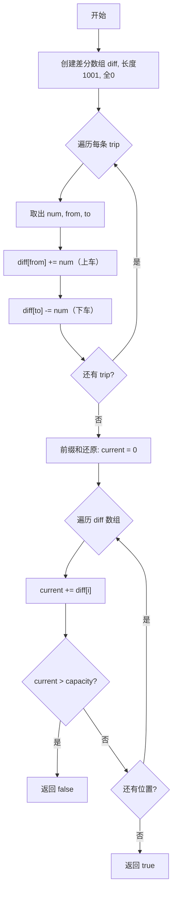

# 1094. 拼车

## 📋 题目信息
- **难度**：Medium
- **标签**：数组、差分数组、前缀和、排序
- **来源**：LeetCode

## 📖 题目描述

车上最初有 `capacity` 个空座位。车 **只能** 向一个方向行驶（也就是说，**不允许掉头或改变方向**）。

给定整数 `capacity` 和一个数组 `trips`，`trips[i] = [numPassengersi, fromi, toi]` 表示第 `i` 次旅行有 `numPassengersi` 乘客，接他们和放他们的位置分别是 `fromi` 和 `toi`。这些位置是从汽车的初始位置向东的公里数。

当且仅当你可以在所有给定的行程中接送所有乘客时，返回 `true`，否则请返回 `false`。

### 示例

**示例 1：**
```
输入：trips = [[2,1,5],[3,3,7]], capacity = 4
输出：false
解释：
位置1：上车2人，车上2人
位置3：上车3人，车上5人 > capacity=4，超载！
```

**示例 2：**
```
输入：trips = [[2,1,5],[3,3,7]], capacity = 5
输出：true
解释：
位置1：上车2人，车上2人
位置3：上车3人，车上5人 = capacity=5，刚好不超载
位置5：下车2人，车上3人
位置7：下车3人，车上0人
```

### 约束条件

- `1 <= trips.length <= 1000`
- `trips[i].length == 3`
- `1 <= numPassengersi <= 100`
- `0 <= fromi < toi <= 1000`
- `1 <= capacity <= 10^5`

---

## 🤔 题目分析

### 问题理解

用自己的话重新描述问题：一辆车沿单方向行驶，有固定的座位容量 capacity。沿途有多批乘客需要搭乘，每批乘客在某个位置上车、在另一个位置下车。我们需要判断在整个行程中，车上的乘客数是否始终不超过 capacity。

这本质上是一个 **区间批量更新 + 全局最大值判断** 的问题：
- 每条 trip `[num, from, to]` 相当于在区间 `[from, to)` 上增加 num 个乘客（注意：乘客在 to 处下车，所以 to 位置不算在内）
- 最终需要判断所有位置的乘客数是否都 ≤ capacity

关键点：
- 乘客在 `from` 处上车，在 `to` 处下车，即区间是 **左闭右开** `[from, to)`
- 需要判断的是 **最大值** 是否超过 capacity，而不是求每个位置的值
- 位置范围是 `0 ~ 1000`，范围较小，可以直接用数组模拟

### 关键观察

1. **区间特征**：每条 trip 是对一个连续区间的加法操作，与 LeetCode 1109（航班预订统计）非常相似
2. **左闭右开**：乘客在 `to` 处下车，意味着 `to` 位置车上已经没有这批乘客了
3. **位置范围有限**：`0 <= from < to <= 1000`，最多只有 1001 个位置，可以用固定大小的数组
4. **差分数组适用**：多次区间加法 + 最后查询，经典的差分数组场景

### 核心难点

1. **如何高效处理多次区间更新？**
   - 暴力做法：每条 trip 遍历区间逐个加 → O(n × L)，其中 L 为最大位置
   - 优化做法：差分数组，每条 trip 只需 O(1) → O(n + L)

2. **左闭右开区间的处理**：
   - 乘客在 `from` 上车 → `diff[from] += num`
   - 乘客在 `to` 下车 → `diff[to] -= num`（不是 `to+1`！因为区间本身就是左闭右开的）

3. **与1109题的区别**：
   - 1109题：返回每个位置的值（区间是闭区间 `[first, last]`）
   - 本题：只需判断最大值是否超过 capacity（区间是左闭右开 `[from, to)`）

### 问题本质

这道题的本质是：**差分数组 + 最大值判断**。通过差分数组高效处理区间加法，再通过前缀和还原每个位置的乘客数，判断是否有任何位置超过 capacity。

---

## 💡 解题思路

### 方法一：暴力解法

#### 🌟 形象化理解

**场景类比**：

想象你是一个公交车司机，手里有一张表格，记录了沿途每个站点车上有多少人。每来一批乘客（一条 trip），你需要从他们的上车站开始，一站一站地在表格上加上人数，直到他们的下车站。最后检查表格上每一站的人数是否都不超过车的座位数。

**对应关系**：
- **站点表格** = passengers 数组（记录每个位置的乘客数）
- **一批乘客** = 一条 trip 记录
- **逐站登记** = 遍历区间逐个累加

**核心理解**：
最笨但最直观的方法——每批乘客都老老实实地把经过的每一站都更新一遍，最后逐站检查是否超载。

---

#### 思路说明

对于每条 trip `[num, from, to]`，遍历区间 `[from, to)` 中的每个位置，将 num 累加到对应位置。最后检查所有位置的乘客数是否都不超过 capacity。

#### 算法步骤

1. 创建长度为 1001 的数组 `passengers`，初始化为全 0（位置范围 0~1000）
2. 遍历每条 trip `[num, from, to]`
3. 对于每条 trip，遍历区间 `[from, to)`，将 `passengers[j] += num`
4. 遍历 `passengers`，如果任何位置的值 > capacity，返回 false
5. 否则返回 true

#### 暴力解法代码

```python
def carPooling(trips, capacity):
    passengers = [0] * 1001
    for num, frm, to in trips:
        for j in range(frm, to):
            passengers[j] += num
    return max(passengers) <= capacity
```

#### 复杂度分析

- **时间复杂度**：O(n × L) - 其中 n 为 trip 数量，L 为最大位置（1000）
- **空间复杂度**：O(L) - passengers 数组

#### 为什么需要优化

1. **效率问题**：虽然本题数据范围较小（n≤1000, L≤1000），暴力解法可以通过，但思路不够优雅
2. **扩展性差**：如果位置范围扩大到 10⁹，暴力解法就完全不可行了
3. **学习价值**：差分数组是处理区间更新的经典技巧，值得掌握

---

### 方法二：差分数组

#### 🌟 形象化理解（重点：差分数组的核心思想）

> **💡 在进入专业算法分析之前，先通过一个生活化的例子来理解差分数组在本题中的应用**

**场景类比**：

想象你是一个公交车调度中心的记录员。你不需要知道每一站车上到底有多少人，你只需要记录 **每一站的人数变化**：
- 某站有人上车 → 变化量为正
- 某站有人下车 → 变化量为负

最后从起点开始，把变化量逐站累加，就能知道每站车上有多少人。

**举例**：
```
trip1: 2人在位置1上车，位置5下车
trip2: 3人在位置3上车，位置7下车

变化量记录：
位置0: 0
位置1: +2（trip1上车）
位置3: +3（trip2上车）
位置5: -2（trip1下车）
位置7: -3（trip2下车）

逐站累加：
位置0: 0人
位置1: 0+2 = 2人
位置2: 2+0 = 2人
位置3: 2+3 = 5人
位置4: 5+0 = 5人
位置5: 5-2 = 3人
位置6: 3+0 = 3人
位置7: 3-3 = 0人
```

如果 capacity=4，位置3和位置4车上有5人，超载了！返回 false。
如果 capacity=5，最多5人，刚好不超载，返回 true。

**对应关系**：
- **变化量记录** = 差分数组 diff
- **上车** = `diff[from] += num`
- **下车** = `diff[to] -= num`（注意：to 处下车，不是 to+1）
- **逐站累加** = 对差分数组求前缀和
- **检查超载** = 前缀和过程中判断是否超过 capacity

**核心理解**：
本题的区间是 **左闭右开** `[from, to)`，乘客在 to 处下车，所以差分标记直接在 `diff[to]` 处减去人数，不需要像闭区间那样在 `to+1` 处减。

**从类比到算法**：
现在让我们把这个思想转化为具体的算法...

---

#### 优化思路推导

**思考过程**：

1. **暴力解法的瓶颈在于**：每条 trip 都要遍历整个区间逐个更新

2. **关键观察**：对区间 `[from, to)` 加 num，从差分角度看：
   - 位置 from 处乘客数增加了 num（变化量 +num）
   - 位置 to 处乘客数减少了 num（变化量 -num）
   - 区间内部相邻位置的差值没有变化

3. **引入差分数组**：
   - `diff[from] += num`：标记上车
   - `diff[to] -= num`：标记下车
   - 每条 trip 只需 O(1) 操作

4. **还原并判断**：对差分数组求前缀和，同时检查是否超过 capacity
   - 可以在求前缀和的过程中 **边累加边判断**，一旦超载立即返回 false

#### 算法步骤

1. **创建差分数组**：长度为 1001 的数组 `diff`，初始化为全 0
2. **处理每条 trip**：对于 `[num, from, to]`
   - `diff[from] += num`（上车标记）
   - `diff[to] -= num`（下车标记）
3. **前缀和还原并判断**：遍历差分数组，逐个累加
   - 如果累加值在任何位置超过 capacity，立即返回 false
4. **返回 true**：所有位置都不超载

#### 复杂度分析

- **时间复杂度**：O(n + L) - 遍历 n 条 trip 各 O(1)，再遍历长度 L 的差分数组
- **空间复杂度**：O(L) - 差分数组的空间（L=1001）

#### 💭 回顾类比

- 生活中的 **乘客上车** 对应 代码中的 `diff[from] += num`
- 生活中的 **乘客下车** 对应 代码中的 `diff[to] -= num`
- 生活中的 **逐站累加检查** 对应 代码中的 **前缀和 + 判断超载**
- 与1109题的关键区别：本题区间是左闭右开，所以下车标记在 `diff[to]` 而不是 `diff[to+1]`

---

## 🎨 图解说明

### 执行过程示例

让我们通过示例 1 来详细演示差分数组算法的执行过程。

**示例输入**：`trips = [[2,1,5],[3,3,7]], capacity = 4`

**执行步骤**：

```
初始状态：
diff = [0, 0, 0, 0, 0, 0, 0, 0, ...]  （长度 1001，这里只展示前8个）

步骤1：处理 trip [2, 1, 5]
  - num=2, from=1, to=5
  - diff[1] += 2  →  diff[1] = 2
  - diff[5] -= 2  →  diff[5] = -2
  - diff = [0, 2, 0, 0, 0, -2, 0, 0, ...]

步骤2：处理 trip [3, 3, 7]
  - num=3, from=3, to=7
  - diff[3] += 3  →  diff[3] = 3
  - diff[7] -= 3  →  diff[7] = -3
  - diff = [0, 2, 0, 3, 0, -2, 0, -3, ...]

步骤3：前缀和还原并判断（capacity=4）
  位置0: current = 0        ≤ 4 ✓
  位置1: current = 0+2 = 2  ≤ 4 ✓
  位置2: current = 2+0 = 2  ≤ 4 ✓
  位置3: current = 2+3 = 5  > 4 ✗ → 超载！返回 false

最终结果：false（位置3处车上有5人，超过capacity=4）
```

**示例2验证**：`trips = [[2,1,5],[3,3,7]], capacity = 5`

```
diff 数组与示例1相同：[0, 2, 0, 3, 0, -2, 0, -3, ...]

前缀和还原并判断（capacity=5）：
  位置0: current = 0        ≤ 5 ✓
  位置1: current = 0+2 = 2  ≤ 5 ✓
  位置2: current = 2+0 = 2  ≤ 5 ✓
  位置3: current = 2+3 = 5  ≤ 5 ✓
  位置4: current = 5+0 = 5  ≤ 5 ✓
  位置5: current = 5-2 = 3  ≤ 5 ✓
  位置6: current = 3+0 = 3  ≤ 5 ✓
  位置7: current = 3-3 = 0  ≤ 5 ✓

最终结果：true（所有位置都不超载）
```

### 可视化图表



### 差分数组变化过程图

**示例：trips = [[2,1,5],[3,3,7]], capacity = 4**

```
位置：              0     1     2     3     4     5     6     7

初始 diff：        [0]   [0]   [0]   [0]   [0]   [0]   [0]   [0]

trip1 [2,1,5]：    [0]  [+2]   [0]   [0]   [0]  [-2]   [0]   [0]
                         ↑上车                    ↑下车

trip2 [3,3,7]：    [0]  [+2]   [0]  [+3]   [0]  [-2]   [0]  [-3]
                                     ↑上车                    ↑下车

前缀和累加：        0     2     2     5     5     3     3     0
                                     ↑超载!（5>4）

结论：返回 false
```

### 关键理解

**为什么 diff[to] -= num 而不是 diff[to+1]？**
- 本题的区间是 **左闭右开** `[from, to)`
- 乘客在 `to` 处下车，`to` 位置车上已经没有这批乘客了
- 所以差分标记直接在 `diff[to]` 处减去人数
- 对比1109题：航班预订是 **闭区间** `[first, last]`，所以在 `diff[last+1]` 处减

**为什么可以边累加边判断？**
- 我们只需要知道是否有任何位置超载
- 不需要求出所有位置的值后再判断
- 边累加边判断可以提前终止，效率更高

**为什么差分数组长度用1001？**
- 位置范围是 `0 <= from < to <= 1000`
- 最大位置是1000，`diff[1000]` 需要被访问
- 所以数组长度至少为1001

---

## ✏️ 代码框架填空

> **💡 学习提示**：在查看完整代码之前，先尝试根据上面的算法步骤，自己思考并填写下面的空白处。

### Python填空版

```python
import sys
# sys.stdin 用于ACM模式读取输入

def carPooling(trips, capacity):
    """
    拼车 - 差分数组解法
    
    参数:
        trips: 旅行记录列表，每条记录为 [num, from, to]
        capacity: 车的座位容量
    
    返回:
        是否能完成所有接送（True/False）
    """
    # 🔹 填空1：创建差分数组
    # 提示：位置范围是 0~1000，数组长度应该是多少？
    diff = ______
    
    # 🔹 填空2：遍历每条 trip，在差分数组上做标记
    for ______ in trips:
        
        # 🔹 填空3：上车标记
        # 提示：乘客在 from 处上车
        diff[______] += ______
        
        # 🔹 填空4：下车标记
        # 提示：乘客在 to 处下车，区间是左闭右开的
        diff[______] -= ______
    
    # 🔹 填空5：前缀和还原并判断是否超载
    current = ______
    for i in range(______):
        current += ______
        
        # 🔹 填空6：判断是否超载
        if ______:
            return ______
    
    # 🔹 填空7：所有位置都不超载
    return ______


# ACM模式输入输出
if __name__ == "__main__":
    n = int(input())
    capacity = int(input())
    trips = []
    for _ in range(n):
        line = list(map(int, input().split()))
        trips.append(line)
    print(carPooling(trips, capacity))
```

### 填空提示详解

**填空1 - 创建差分数组**
- 思考：位置范围是 0~1000，需要多大的数组？
- 提示：`[0] * 1001`，长度1001覆盖所有可能的位置

**填空2 - 遍历 trip**
- 思考：每条 trip 包含哪些信息？
- 提示：使用解构赋值 `num, frm, to`

**填空3 - 上车标记**
- 思考：乘客在哪个位置上车？加多少？
- 提示：`diff[frm] += num`

**填空4 - 下车标记**
- 思考：乘客在哪个位置下车？区间是左闭右开的意味着什么？
- 提示：`diff[to] -= num`（不是 `to+1`！）

**填空5 - 前缀和初始化和遍历范围**
- 思考：累加变量初始值是多少？遍历范围是什么？
- 提示：`current = 0`，遍历 `range(1001)`

**填空6 - 超载判断**
- 思考：什么条件下算超载？超载返回什么？
- 提示：`current > capacity` 时返回 `False`

**填空7 - 返回结果**
- 思考：所有位置都不超载应该返回什么？
- 提示：返回 `True`

### C++填空版

```cpp
#include <vector>
#include <iostream>
// vector 用于差分数组 diff
using namespace std;

bool carPooling(vector<vector<int>>& trips, int capacity) {
    // 🔹 填空1：创建差分数组
    vector<int> diff(______, 0);
    
    // 🔹 填空2：遍历 trip，做差分标记
    for (auto& trip : trips) {
        int num = trip[0], frm = trip[1], to = trip[2];
        
        // 🔹 填空3：上车标记
        diff[______] += ______;
        
        // 🔹 填空4：下车标记
        diff[______] -= ______;
    }
    
    // 🔹 填空5：前缀和还原并判断
    int current = ______;
    for (int i = 0; i < ______; i++) {
        current += diff[i];
        
        // 🔹 填空6：超载判断
        if (______) return ______;
    }
    
    // 🔹 填空7：不超载
    return ______;
}

int main() {
    int n, capacity;
    cin >> n >> capacity;
    vector<vector<int>> trips(n, vector<int>(3));
    for (int i = 0; i < n; i++) {
        cin >> trips[i][0] >> trips[i][1] >> trips[i][2];
    }
    cout << (carPooling(trips, capacity) ? "true" : "false") << endl;
    return 0;
}
```

---

## 💻 完整代码实现

> **✅ 对照检查**：现在对比你的填空答案和下面的完整实现，看看思路是否一致。

### Python实现

```python
import sys

def carPooling(trips, capacity):
    """
    拼车 - 差分数组解法
    
    时间复杂度：O(n + L)，n为trip数量，L为最大位置(1001)
    空间复杂度：O(L)
    
    参数:
        trips: 旅行记录列表，每条记录为 [num, from, to]
        capacity: 车的座位容量
    
    返回:
        是否能完成所有接送（True/False）
    """
    # 创建差分数组，长度1001覆盖位置0~1000
    diff = [0] * 1001
    
    # 遍历每条trip，在差分数组上做标记
    for num, frm, to in trips:
        # 上车标记：位置frm处增加num人
        diff[frm] += num
        # 下车标记：位置to处减少num人（左闭右开，to处已下车）
        diff[to] -= num
    
    # 前缀和还原并判断是否超载
    current = 0
    for i in range(1001):
        current += diff[i]
        # 任何位置超过capacity就返回False
        if current > capacity:
            return False
    
    # 所有位置都不超载
    return True


# ACM模式测试
if __name__ == "__main__":
    # 测试用例1
    trips1 = [[2, 1, 5], [3, 3, 7]]
    capacity1 = 4
    result1 = carPooling(trips1, capacity1)
    print(f"测试1: {result1}")
    print(f"期望:  False")
    print(f"通过:  {result1 == False}")
    print()
    
    # 测试用例2
    trips2 = [[2, 1, 5], [3, 3, 7]]
    capacity2 = 5
    result2 = carPooling(trips2, capacity2)
    print(f"测试2: {result2}")
    print(f"期望:  True")
    print(f"通过:  {result2 == True}")
    print()
    
    # 测试用例3：单条trip
    trips3 = [[5, 0, 1]]
    capacity3 = 5
    result3 = carPooling(trips3, capacity3)
    print(f"测试3: {result3}")
    print(f"期望:  True")
    print(f"通过:  {result3 == True}")
    print()
    
    # 测试用例4：位置0上车
    trips4 = [[3, 0, 5], [3, 0, 5]]
    capacity4 = 5
    result4 = carPooling(trips4, capacity4)
    print(f"测试4: {result4}")
    print(f"期望:  False")
    print(f"通过:  {result4 == False}")
```

**代码说明**：
- 第19行：创建长度1001的差分数组，覆盖所有可能的位置
- 第22行：解构每条trip为 num, frm, to
- 第24行：`diff[frm] += num`，在上车位置标记增量
- 第26行：`diff[to] -= num`，在下车位置标记减量（左闭右开）
- 第29-33行：前缀和还原，边累加边判断，超载立即返回False
- 第36行：遍历完毕无超载，返回True

**填空答案解析**：
- **填空1**：`[0] * 1001` - 覆盖位置0~1000
- **填空2**：`num, frm, to` - 解构trip的三个字段
- **填空3**：`diff[frm] += num` - 上车标记
- **填空4**：`diff[to] -= num` - 下车标记（左闭右开，直接在to处减）
- **填空5**：`current = 0`，`range(1001)` - 初始化累加器，遍历所有位置
- **填空6**：`current > capacity` 时返回 `False` - 超载判断
- **填空7**：`True` - 所有位置不超载

---

### C++实现

```cpp
#include <vector>
#include <iostream>
using namespace std;

bool carPooling(vector<vector<int>>& trips, int capacity) {
    // 创建差分数组，长度1001，初始全0
    vector<int> diff(1001, 0);
    
    // 遍历每条trip，做差分标记
    for (auto& trip : trips) {
        int num = trip[0], frm = trip[1], to = trip[2];
        // 上车标记
        diff[frm] += num;
        // 下车标记（左闭右开）
        diff[to] -= num;
    }
    
    // 前缀和还原并判断
    int current = 0;
    for (int i = 0; i < 1001; i++) {
        current += diff[i];
        if (current > capacity) return false;
    }
    
    return true;
}

// ACM模式输入输出
int main() {
    int n, capacity;
    cin >> n >> capacity;
    vector<vector<int>> trips(n, vector<int>(3));
    for (int i = 0; i < n; i++) {
        cin >> trips[i][0] >> trips[i][1] >> trips[i][2];
    }
    cout << (carPooling(trips, capacity) ? "true" : "false") << endl;
    return 0;
}
```

**与Python的主要差异**：
- **类型声明**：C++需要显式声明 `vector<int>` 类型
- **解构赋值**：Python可以 `for num, frm, to in trips`，C++需要手动取 `trip[0/1/2]`
- **布尔返回**：C++用 `true/false`，Python用 `True/False`
- **提前返回**：两者都支持在循环中提前 return

**填空答案解析**：
- **填空1**：`1001` - 差分数组长度
- **填空3**：`frm` 和 `num` - 上车标记
- **填空4**：`to` 和 `num` - 下车标记
- **填空5**：`0` 和 `1001` - 累加器初始值和遍历范围
- **填空6**：`current > capacity` 返回 `false`
- **填空7**：`true`

---

## ⚠️ 易错点提醒

### 1. 边界条件

**易错点1：左闭右开 vs 闭区间——下车标记位置搞错**

❌ **错误做法**：
```python
# 像1109题那样在 to+1 处减（闭区间写法）
diff[to + 1] -= num
```

✅ **正确做法**：
```python
# 本题区间是左闭右开 [from, to)，直接在 to 处减
diff[to] -= num
```

**原因**：
- 本题乘客在 `to` 处下车，`to` 位置车上已经没有这批乘客
- 区间是 `[from, to)`，不是 `[from, to]`
- 如果在 `to+1` 处减，会导致 `to` 位置多算了一站的乘客

---

**易错点2：位置从0开始，不需要索引转换**

❌ **错误做法**：
```python
# 像1109题那样做 from-1 的索引转换
diff[frm - 1] += num
```

✅ **正确做法**：
```python
# 本题位置从0开始，直接使用
diff[frm] += num
```

**原因**：
- 1109题航班编号从1开始，需要 `first-1` 转为0-indexed
- 本题位置从0开始，`from` 本身就是0-indexed，无需转换

---

**易错点3：差分数组长度不够**

❌ **错误做法**：
```python
diff = [0] * 1000  # to 最大为1000，但索引1000会越界
```

✅ **正确做法**：
```python
diff = [0] * 1001  # 长度1001，索引0~1000
```

**原因**：
- `to` 最大为1000，`diff[1000]` 需要被访问
- 长度1000的数组最大索引是999，访问1000会越界

---

### 2. 常见错误

**错误1：混淆本题和1109题的区间类型**

| 特性 | 1109题（航班预订） | 本题（拼车） |
|------|-------------------|-------------|
| 区间类型 | 闭区间 `[first, last]` | 左闭右开 `[from, to)` |
| 编号起点 | 从1开始 | 从0开始 |
| 起点标记 | `diff[first-1] += seats` | `diff[from] += num` |
| 终点标记 | `diff[last] -= seats` | `diff[to] -= num` |
| 返回值 | 每个位置的值（数组） | 是否超载（布尔值） |

**错误2：忘记边累加边判断，导致效率浪费**

虽然不影响正确性，但最佳实践是在前缀和过程中立即判断：
```python
# 推荐：边累加边判断，可以提前终止
current = 0
for i in range(1001):
    current += diff[i]
    if current > capacity:
        return False
```

### 3. 调试技巧

- **技巧1**：打印差分数组的非零位置，快速检查标记是否正确
```python
for num, frm, to in trips:
    diff[frm] += num
    diff[to] -= num
print("非零位置:", {i: diff[i] for i in range(1001) if diff[i] != 0})
```

- **技巧2**：手动验证小例子，特别注意上下车的边界位置
- **技巧3**：对比暴力解法的结果，确认差分数组解法的正确性
- **填空验证**：填完后用示例1手动走一遍，确认位置3处累加值为5

---

## 🔗 相似题目推荐

### 同类型题目

这些题目使用相同或相似的算法思路：

1. **LeetCode 1109 - 航班预订统计** (Medium)
   - 相似点：差分数组的直接应用，对区间进行批量加法操作
   - 区别：1109是闭区间且返回数组，本题是左闭右开且返回布尔值
   - 建议：两题对比练习，重点理解闭区间和左闭右开区间的差分标记差异

2. **LeetCode 370 - 区间加法** (Medium)
   - 相似点：差分数组的最纯粹模板题，对区间批量加法后求最终数组
   - 建议：如果本题觉得难，先做370题打基础

3. **LeetCode 303 - 区域和检索 - 数组不可变** (Easy)
   - 相似点：前缀和的基础应用，是差分数组的逆操作
   - 建议：理解前缀和后再学差分数组会更顺畅

### 进阶题目

掌握本题后，可以挑战这些更难的题目：

1. **LeetCode 1109 - 航班预订统计** (Medium)
   - 进阶点：需要返回完整数组而非布尔值，且需要处理1-indexed到0-indexed的转换

2. **LeetCode 1314 - 矩阵区域和** (Medium)
   - 进阶点：将一维差分扩展到二维差分数组，需要理解二维差分的标记和还原方式

### 相关知识点

本题涉及的核心知识点：

- **差分数组**：区间批量更新的利器
  - 相关题目：LeetCode 370、LeetCode 1094、LeetCode 1109

- **前缀和**：差分数组的逆运算，区间查询的利器
  - 相关题目：LeetCode 303、LeetCode 304、LeetCode 560

---

## 📚 知识点总结

### 核心算法

**差分数组（Difference Array）**：
- 核心思想：只记录变化量，将区间更新转化为端点操作
- 适用场景：多次对数组的连续区间进行加减操作，最后查询最终状态
- 时间优化：每次区间更新从 O(区间长度) 降为 O(1)

### 数据结构

- **差分数组**：`diff[i]` 记录位置 i 处的变化量
- **前缀和还原**：对差分数组求前缀和得到每个位置的实际值
- 两者互为逆运算

### 解题模板

```python
# 差分数组通用模板（带填空提示）
def diff_array_template(operations, max_pos):
    # 初始化：diff = [0] * (______)
    diff = [0] * (max_pos + 1)
    
    # 区间更新：
    for left, right, val in operations:
        diff[______] += val    # 起点标记
        diff[______] -= val    # 终点标记（注意开闭区间）
    
    # 前缀和还原：
    current = 0
    for i in range(______):
        current += diff[i]
        # 在此处可以做判断或记录结果
    
    return current  # 或返回结果数组
```

### 开闭区间对比速查表

```
闭区间 [l, r]：     diff[l] += val,  diff[r+1] -= val
左闭右开 [l, r)：   diff[l] += val,  diff[r] -= val
```

### 学习要点

1. **要点1**：差分数组的核心是"只记录变化，最后还原"，将 O(n) 的区间更新降为 O(1)
2. **要点2**：区间的开闭类型决定了终点标记的位置——闭区间在 `r+1` 处减，左闭右开在 `r` 处减
3. **要点3**：本题位置从0开始，无需索引转换；1109题编号从1开始，需要转换
4. **填空练习的价值**：通过填空练习，你应该掌握了差分数组在不同区间类型下的标记方式

---

## 📝 补充说明

### 从填空到完整实现的进阶路径

1. **第一遍**：看算法步骤和图解，尝试填空
2. **第二遍**：对照答案，重点理解左闭右开区间的处理方式
3. **第三遍**：不看提示，独立完整实现
4. **第四遍**：对比1109题，总结闭区间和左闭右开区间的差分标记差异

### 时间复杂度优化历程

- 暴力解法：O(n × L) → 瓶颈在于每条trip都要遍历整个区间
- 差分数组：O(n + L) → 每条trip只需O(1)标记，最后一次O(L)还原

### 空间复杂度权衡

- 本题位置范围固定（0~1000），差分数组大小固定为1001，空间开销很小
- 如果位置范围很大（如 10⁹），可以用哈希表代替数组，或者先排序再扫描

### 实际应用场景

差分数组在拼车/调度场景中的应用非常直观：
- **拼车调度**：判断车辆是否超载（正是本题场景）
- **会议室安排**：统计某时间段内需要多少间会议室
- **服务器负载**：统计某时间段内的并发请求数是否超过阈值
- **电梯调度**：判断电梯在各楼层的载重是否超限
