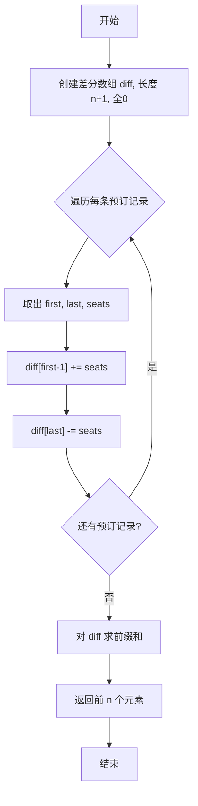

# 1109. 航班预订统计

## 📋 题目信息
- **难度**：Medium
- **标签**：数组、差分数组、前缀和
- **来源**：LeetCode

## 📖 题目描述

这里有 `n` 个航班，它们分别从 `1` 到 `n` 进行编号。

有一份航班预订表 `bookings`，表中第 `i` 条预订记录 `bookings[i] = [firsti, lasti, seatsi]` 意味着在从 `firsti` 到 `lasti`（**包含** `firsti` 和 `lasti`）的 **每个航班** 上预订了 `seatsi` 个座位。

请你返回一个长度为 `n` 的数组 `answer`，里面的元素是每个航班预定的座位总数。

### 示例

**示例 1：**
```
输入：bookings = [[1,2,10],[2,3,20],[2,5,25]], n = 5
输出：[10,55,45,25,25]
解释：
航班编号        1   2   3   4   5
预订记录 1 ：   10  10
预订记录 2 ：       20  20
预订记录 3 ：       25  25  25  25
总座位数：      10  55  45  25  25
因此，answer = [10,55,45,25,25]
```

**示例 2：**
```
输入：bookings = [[1,2,10],[2,2,15]], n = 2
输出：[10,25]
解释：
航班编号        1   2
预订记录 1 ：   10  10
预订记录 2 ：       15
总座位数：      10  25
因此，answer = [10,25]
```

### 约束条件

- `1 <= n <= 2 * 10^4`
- `1 <= bookings.length <= 2 * 10^4`
- `bookings[i].length == 3`
- `1 <= firsti <= lasti <= n`
- `1 <= seatsi <= 10^4`

---

## 🤔 题目分析

### 问题理解

用自己的话重新描述问题：我们有 n 个航班（编号 1~n），每条预订记录表示在某个连续区间的航班上都增加了一定数量的座位预订。最终需要求出每个航班被预订的座位总数。

这本质上是一个 **区间批量更新 + 单点查询** 的问题：
- 每条预订记录 `[first, last, seats]` 相当于对区间 `[first, last]` 中的每个位置都加上 `seats`
- 最终需要查询每个位置的累计值

关键点：
- 预订记录是对 **连续区间** 的批量操作，不是对单个航班的操作
- 多条预订记录可能覆盖同一个航班，需要 **累加** 所有预订
- 航班编号从 1 开始，需要注意索引转换

### 关键观察

1. **操作特征**：每条预订记录都是对一个连续区间做相同值的加法操作
2. **数据规模**：n 和 bookings.length 都可达 2×10⁴，暴力逐个更新可能达到 O(n × m) ≈ 4×10⁸，有超时风险
3. **差分数组的适用性**：当需要对数组的多个连续区间进行批量加减操作时，差分数组是经典的优化手段
4. **问题本质**：这是差分数组的模板题，核心思想是"只记录变化量，最后还原"

### 核心难点

1. **如何高效处理区间更新？**
   - 暴力做法：每条记录遍历区间逐个加 → O(n × m)
   - 优化做法：利用差分数组，每条记录只需 O(1) 操作 → O(n + m)

2. **差分数组的原理是什么？**
   - 差分数组 `diff[i] = arr[i] - arr[i-1]`，记录相邻元素的差值
   - 对区间 `[l, r]` 加 val，只需 `diff[l] += val`，`diff[r+1] -= val`
   - 最后对差分数组求前缀和即可还原原数组

3. **索引转换**：航班编号从 1 开始，数组索引从 0 开始，需要小心处理边界

### 问题本质

这道题的本质是：**差分数组的直接应用**。通过将"区间加法"转化为"端点标记"，再通过前缀和还原，将时间复杂度从 O(n × m) 优化到 O(n + m)。

---

## 💡 解题思路

### 方法一：暴力解法

#### 🌟 形象化理解

**场景类比**：

想象你是一个航空公司的柜台工作人员，面前有一排 n 个航班的座位登记表（初始都是0）。每来一个旅行团（一条预订记录），团长告诉你："我们要预订从第 first 号到第 last 号航班，每个航班 seats 个座位。"你需要拿着笔，从第 first 号航班的表格开始，一个一个地往后写，每个航班都加上 seats，一直写到第 last 号航班。

**对应关系**：
- **航班登记表** = answer 数组
- **旅行团** = 一条预订记录
- **逐个登记** = 遍历区间逐个累加

**核心理解**：
这种做法最直观——来一条记录就老老实实地把区间内每个航班都更新一遍。但如果旅行团很多、区间又很长，柜台工作人员就会忙不过来。

---

#### 思路说明

最直观的想法：对于每条预订记录 `[first, last, seats]`，遍历区间 `[first, last]` 中的每个航班，将 `seats` 累加到对应位置。

#### 算法步骤

1. 创建长度为 n 的结果数组 `answer`，初始化为全 0
2. 遍历每条预订记录 `[first, last, seats]`
3. 对于每条记录，遍历区间 `[first, last]`，将 `answer[j-1] += seats`（注意索引从0开始）
4. 返回 `answer`

#### 暴力解法代码

```python
def corpFlightBookings(bookings, n):
    answer = [0] * n
    for first, last, seats in bookings:
        for j in range(first, last + 1):
            answer[j - 1] += seats
    return answer
```

#### 复杂度分析

- **时间复杂度**：O(n × m) - 其中 m 为预订记录数，每条记录最多遍历 n 个航班
- **空间复杂度**：O(n) - 结果数组（不算额外空间则为 O(1)）

#### 为什么需要优化

暴力解法存在明显的性能瓶颈：

1. **效率低下**：当 n = 2×10⁴，m = 2×10⁴ 时，最坏情况下操作次数为 4×10⁸，会超时
2. **重复劳动**：每条记录都要逐个更新区间内的每个元素，大量时间花在"中间元素"上
3. **核心浪费**：对于区间 `[first, last]` 加 seats，中间的元素变化量其实是一样的，我们只需要关注"从哪里开始变化"和"从哪里结束变化"

---

### 方法二：差分数组

#### 🌟 形象化理解（重点：差分数组的核心思想）

> **💡 在进入专业算法分析之前，先通过一个生活化的例子来理解差分数组的本质**

**场景类比**：

想象你是一个公交车调度员。一条公交线路有 n 个站点（编号 1~n），你需要统计每个站点车上有多少乘客。

乘客信息是这样的：
- 旅行团A：在第 1 站上车 10 人，在第 2 站后下车（即坐到第 2 站）
- 旅行团B：在第 2 站上车 20 人，在第 3 站后下车
- 旅行团C：在第 2 站上车 25 人，在第 5 站后下车（终点站）

**聪明的做法**：你不需要在每个站点都记录完整的乘客数。你只需要记录 **变化量**：
- 预订记录1 `[1,2,10]`：第1站上车，第3站下车 → diff[1]+=10, diff[3]-=10
- 预订记录2 `[2,3,20]`：第2站上车，第4站下车 → diff[2]+=20, diff[4]-=20
- 预订记录3 `[2,5,25]`：第2站上车，第6站下车 → diff[2]+=25, diff[6]-=25

然后从第 1 站开始，逐站累加变化量，就能得到每站的乘客数：
```
站点：     1     2     3     4     5
diff:     +10   +45   -10   -20    0
累加：     10    55    45    25    25
```

完美匹配题目答案 `[10, 55, 45, 25, 25]`！

**对应关系**：
- **公交站点** = 航班编号
- **乘客上车** = 差分数组在区间起点 +seats
- **乘客下车** = 差分数组在区间终点+1 处 -seats
- **逐站累加乘客数** = 对差分数组求前缀和
- **每站乘客总数** = 每个航班的预订座位总数

**核心理解**：
差分数组的精髓是 **只记录变化发生的位置**，而不是逐个更新每个元素。就像公交调度员只需要记录"哪站有人上车、哪站有人下车"，最后累加一遍就知道每站有多少人。

**从类比到算法**：
现在让我们把这个公交车的思想转化为具体的算法...

---

#### 优化思路推导

**思考过程**：

1. **暴力解法的瓶颈在于**：每条预订记录都要遍历整个区间逐个更新，时间花在了"中间元素"上

2. **关键观察**：对区间 `[l, r]` 加上 val 这个操作，从差分的角度看：
   - 位置 l 处的值相比位置 l-1 **增加了** val（变化量 +val）
   - 位置 r+1 处的值相比位置 r **减少了** val（变化量 -val）
   - 区间内部相邻元素的差值 **没有变化**

3. **引入差分数组**：
   - 定义 `diff[i]` 表示原数组中 `arr[i] - arr[i-1]` 的值
   - 对区间 `[l, r]` 加 val，只需：`diff[l] += val`，`diff[r+1] -= val`
   - 这样每条记录只需 O(1) 操作

4. **还原原数组**：对差分数组求前缀和
   - `arr[0] = diff[0]`
   - `arr[i] = arr[i-1] + diff[i]`（即 `arr[i] = diff[0] + diff[1] + ... + diff[i]`）

#### 算法步骤

1. **创建差分数组**：长度为 n+1 的数组 `diff`，初始化为全 0（多一个位置用于处理右边界）
2. **处理每条预订记录**：对于 `[first, last, seats]`
   - `diff[first - 1] += seats`（区间起点标记，注意转为0索引）
   - `diff[last] -= seats`（区间终点+1标记，注意转为0索引后 last-1+1=last）
3. **求前缀和还原**：遍历差分数组，逐个累加得到每个航班的座位总数
4. **返回结果**：前 n 个元素即为答案

#### 复杂度分析

- **时间复杂度**：O(n + m) - 遍历 m 条预订记录各 O(1)，再遍历长度 n 的差分数组求前缀和
- **空间复杂度**：O(n) - 差分数组的空间

#### 💭 回顾类比

- 生活中的 **乘客上车** 对应 代码中的 `diff[first-1] += seats`
- 生活中的 **乘客下车** 对应 代码中的 `diff[last] -= seats`
- 生活中的 **逐站累加** 对应 代码中的 **前缀和求解**
- 这就是为什么差分数组能将每次区间更新从 O(n) 优化到 O(1) 的原因

---

## 🎨 图解说明

### 执行过程示例

让我们通过示例 1 来详细演示差分数组算法的执行过程。

**示例输入**：`bookings = [[1,2,10],[2,3,20],[2,5,25]], n = 5`

**执行步骤**：

```
初始状态：
diff = [0, 0, 0, 0, 0, 0]  （长度 n+1 = 6）
索引：  0  1  2  3  4  5

步骤1：处理预订记录 [1, 2, 10]
  - first=1, last=2, seats=10
  - diff[1-1] += 10  →  diff[0] += 10
  - diff[2] -= 10    →  diff[2] -= 10
  - diff = [10, 0, -10, 0, 0, 0]

步骤2：处理预订记录 [2, 3, 20]
  - first=2, last=3, seats=20
  - diff[2-1] += 20  →  diff[1] += 20
  - diff[3] -= 20    →  diff[3] -= 20
  - diff = [10, 20, -10, -20, 0, 0]

步骤3：处理预订记录 [2, 5, 25]
  - first=2, last=5, seats=25
  - diff[2-1] += 25  →  diff[1] += 25
  - diff[5] -= 25    →  diff[5] -= 25
  - diff = [10, 45, -10, -20, 0, -25]

步骤4：求前缀和还原
  索引0: answer[0] = 10
  索引1: answer[1] = 10 + 45 = 55
  索引2: answer[2] = 55 + (-10) = 45
  索引3: answer[3] = 45 + (-20) = 25
  索引4: answer[4] = 25 + 0 = 25

最终结果：answer = [10, 55, 45, 25, 25] ✓
```

### 可视化图表



### 差分数组变化过程图

**示例：bookings = [[1,2,10],[2,3,20],[2,5,25]], n = 5**

```
航班编号：          1      2      3      4      5     (越界)
数组索引：          0      1      2      3      4      5

初始 diff：        [0]    [0]    [0]    [0]    [0]    [0]

记录1 [1,2,10]：  [+10]   [0]   [-10]   [0]    [0]    [0]
                   ↑起点          ↑终点+1

记录2 [2,3,20]：  [+10]  [+20]  [-10]  [-20]   [0]    [0]
                          ↑起点          ↑终点+1

记录3 [2,5,25]：  [+10]  [+45]  [-10]  [-20]   [0]   [-25]
                          ↑起点                        ↑终点+1

前缀和还原：       10     55     45     25     25
                   ↓      ↓      ↓      ↓      ↓
answer：          [10,    55,    45,    25,    25]
```

### 关键理解

**为什么差分数组长度是 n+1？**
- 当 `last = n` 时，`diff[last]` 即 `diff[n]` 需要减去 seats
- 如果数组只有 n 个元素，`diff[n]` 会越界
- 多开一个位置避免越界，且这个位置不会被纳入最终结果

**为什么 diff[first-1] += seats？**
- 航班编号从 1 开始，数组索引从 0 开始
- 航班编号 first 对应数组索引 first-1

**为什么 diff[last] -= seats 而不是 diff[last-1+1]？**
- 区间终点是 last（1-indexed），对应 0-indexed 为 last-1
- 终点的下一个位置是 last-1+1 = last（0-indexed）
- 所以 `diff[last] -= seats` 是正确的

---

## ✏️ 代码框架填空

> **💡 学习提示**：在查看完整代码之前，先尝试根据上面的算法步骤，自己思考并填写下面的空白处。这将帮助你从"不知道怎么开始"过渡到"能够独立实现关键逻辑"。

### Python填空版

```python
import sys
# sys.stdin 用于ACM模式读取输入

def corpFlightBookings(bookings, n):
    """
    航班预订统计 - 差分数组解法
    
    参数:
        bookings: 预订记录列表，每条记录为 [first, last, seats]
        n: 航班总数
    
    返回:
        长度为 n 的数组，每个航班的预订座位总数
    """
    # 🔹 填空1：创建差分数组
    # 提示：差分数组的长度应该是多少？为什么要多一个位置？
    diff = ______
    
    # 🔹 填空2：遍历每条预订记录
    for ______ in bookings:
        
        # 🔹 填空3：在区间起点标记增量
        # 提示：航班编号从1开始，数组索引从0开始
        diff[______] += ______
        
        # 🔹 填空4：在区间终点+1处标记减量
        # 提示：1-indexed的last对应0-indexed的哪个位置？
        diff[______] -= ______
    
    # 🔹 填空5：求前缀和还原原数组
    # 提示：从第1个元素开始，每个元素等于前一个元素加上当前差分值
    for i in range(1, ______):
        diff[i] += ______
    
    # 🔹 填空6：返回结果
    # 提示：差分数组的前n个元素就是答案
    return ______


# ACM模式输入输出
if __name__ == "__main__":
    n = int(input())
    m = int(input())
    bookings = []
    for _ in range(m):
        line = list(map(int, input().split()))
        bookings.append(line)
    result = corpFlightBookings(bookings, n)
    print(" ".join(map(str, result)))
```

### 填空提示详解

**填空1 - 创建差分数组**
- 思考：差分数组需要多大？
- 提示：需要 n+1 个位置，因为当 last=n 时，diff[last] 即 diff[n] 需要被访问
- 常见错误：只创建长度为 n 的数组，导致越界

**填空2 - 遍历预订记录**
- 思考：每条记录包含哪些信息？
- 提示：使用解构赋值 `first, last, seats`

**填空3 - 起点标记**
- 思考：航班编号 first 对应数组的哪个索引？
- 提示：first 是 1-indexed，转为 0-indexed 需要 first-1

**填空4 - 终点标记**
- 思考：区间终点的下一个位置是哪里？
- 提示：last 是 1-indexed，终点+1 在 0-indexed 下恰好是 last

**填空5 - 前缀和还原**
- 思考：遍历范围是什么？累加的是什么？
- 提示：从索引1到n-1，每个位置加上前一个位置的值

**填空6 - 返回结果**
- 思考：差分数组中哪些元素是有效的？
- 提示：前 n 个元素，即 diff[:n]

### C++填空版

```cpp
#include <vector>
#include <iostream>
// vector 用于动态数组，对应差分数组 diff 和结果数组
using namespace std;

vector<int> corpFlightBookings(vector<vector<int>>& bookings, int n) {
    // 🔹 填空1：创建差分数组
    vector<int> diff(______, 0);
    
    // 🔹 填空2：遍历预订记录
    for (auto& booking : bookings) {
        int first = booking[0], last = booking[1], seats = booking[2];
        
        // 🔹 填空3：起点标记
        diff[______] += ______;
        
        // 🔹 填空4：终点标记
        diff[______] -= ______;
    }
    
    // 🔹 填空5：前缀和还原
    for (int i = 1; i < ______; i++) {
        diff[i] += ______;
    }
    
    // 🔹 填空6：截取前n个元素返回
    return vector<int>(diff.begin(), diff.begin() + ______);
}

int main() {
    int n, m;
    cin >> n >> m;
    vector<vector<int>> bookings(m, vector<int>(3));
    for (int i = 0; i < m; i++) {
        cin >> bookings[i][0] >> bookings[i][1] >> bookings[i][2];
    }
    vector<int> result = corpFlightBookings(bookings, n);
    for (int i = 0; i < n; i++) {
        cout << result[i] << (i < n - 1 ? " " : "\n");
    }
    return 0;
}
```

---

## 💻 完整代码实现

> **✅ 对照检查**：现在对比你的填空答案和下面的完整实现，看看思路是否一致。

### Python实现

```python
import sys

def corpFlightBookings(bookings, n):
    """
    航班预订统计 - 差分数组解法
    
    时间复杂度：O(n + m)
    空间复杂度：O(n)
    
    参数:
        bookings: 预订记录列表，每条记录为 [first, last, seats]
        n: 航班总数
    
    返回:
        长度为 n 的数组，每个航班的预订座位总数
    """
    # 创建差分数组，长度为 n+1
    # 多一个位置是为了处理 last=n 时 diff[last] 不越界
    diff = [0] * (n + 1)
    
    # 遍历每条预订记录，在差分数组上做标记
    for first, last, seats in bookings:
        # 区间起点：航班编号 first (1-indexed) → 数组索引 first-1
        diff[first - 1] += seats
        # 区间终点+1：航班编号 last (1-indexed) → 0-indexed 为 last-1
        # 终点的下一个位置为 last-1+1 = last (0-indexed)
        diff[last] -= seats
    
    # 对差分数组求前缀和，还原每个航班的座位总数
    for i in range(1, n):
        diff[i] += diff[i - 1]
    
    # 返回前 n 个元素（diff[n] 是辅助位置，不需要）
    return diff[:n]


# ACM模式输入输出
if __name__ == "__main__":
    # 测试用例1
    bookings1 = [[1, 2, 10], [2, 3, 20], [2, 5, 25]]
    n1 = 5
    result1 = corpFlightBookings(bookings1, n1)
    print(f"测试1: {result1}")
    print(f"期望:  [10, 55, 45, 25, 25]")
    print(f"通过:  {result1 == [10, 55, 45, 25, 25]}")
    print()
    
    # 测试用例2
    bookings2 = [[1, 2, 10], [2, 2, 15]]
    n2 = 2
    result2 = corpFlightBookings(bookings2, n2)
    print(f"测试2: {result2}")
    print(f"期望:  [10, 25]")
    print(f"通过:  {result2 == [10, 25]}")
    print()
    
    # 测试用例3：单个航班
    bookings3 = [[1, 1, 5]]
    n3 = 1
    result3 = corpFlightBookings(bookings3, n3)
    print(f"测试3: {result3}")
    print(f"期望:  [5]")
    print(f"通过:  {result3 == [5]}")
    print()
    
    # 测试用例4：全覆盖
    bookings4 = [[1, 3, 10], [1, 3, 20]]
    n4 = 3
    result4 = corpFlightBookings(bookings4, n4)
    print(f"测试4: {result4}")
    print(f"期望:  [30, 30, 30]")
    print(f"通过:  {result4 == [30, 30, 30]}")
```

**代码说明**：
- 第21行：创建长度 n+1 的差分数组，初始全0，多出的一个位置用于防止越界
- 第24行：解构每条预订记录为 first, last, seats
- 第26行：`diff[first-1] += seats`，将1-indexed转为0-indexed后在起点标记增量
- 第29行：`diff[last] -= seats`，在终点的下一个位置标记减量
- 第32-33行：前缀和还原，从索引1开始逐个累加
- 第36行：返回前n个元素，丢弃辅助位置

**填空答案解析**：
- **填空1**：`[0] * (n + 1)` - 长度 n+1 的全0数组，多一个位置防越界
- **填空2**：`first, last, seats` - 解构预订记录的三个字段
- **填空3**：`diff[first - 1] += seats` - 1-indexed 转 0-indexed，起点标记
- **填空4**：`diff[last] -= seats` - 终点+1位置标记（1-indexed的last恰好是0-indexed的终点+1）
- **填空5**：`range(1, n)` 和 `diff[i - 1]` - 从索引1到n-1，累加前一个值
- **填空6**：`diff[:n]` - 切片取前n个元素

---

### C++实现

```cpp
#include <vector>
#include <iostream>
using namespace std;

vector<int> corpFlightBookings(vector<vector<int>>& bookings, int n) {
    // 创建差分数组，长度 n+1，初始全0
    vector<int> diff(n + 1, 0);
    
    // 遍历每条预订记录
    for (auto& booking : bookings) {
        int first = booking[0];
        int last = booking[1];
        int seats = booking[2];
        
        // 起点标记：1-indexed 转 0-indexed
        diff[first - 1] += seats;
        // 终点+1标记
        diff[last] -= seats;
    }
    
    // 前缀和还原
    for (int i = 1; i < n; i++) {
        diff[i] += diff[i - 1];
    }
    
    // 截取前n个元素返回
    return vector<int>(diff.begin(), diff.begin() + n);
}

// ACM模式输入输出
int main() {
    int n, m;
    cin >> n >> m;
    vector<vector<int>> bookings(m, vector<int>(3));
    for (int i = 0; i < m; i++) {
        cin >> bookings[i][0] >> bookings[i][1] >> bookings[i][2];
    }
    vector<int> result = corpFlightBookings(bookings, n);
    for (int i = 0; i < n; i++) {
        cout << result[i];
        if (i < n - 1) cout << " ";
    }
    cout << endl;
    return 0;
}
```

**与Python的主要差异**：
- **类型声明**：C++需要显式声明 `vector<int>` 类型，Python 直接用列表
- **解构赋值**：Python 可以 `for first, last, seats in bookings`，C++ 需要手动取 `booking[0/1/2]`
- **数组切片**：Python 用 `diff[:n]`，C++ 用 `vector<int>(diff.begin(), diff.begin() + n)`
- **输入输出**：C++ 使用 `cin/cout`，Python 使用 `input()/print()`

**填空答案解析**：
- **填空1**：`n + 1` - 差分数组长度
- **填空3**：`first - 1` 和 `seats` - 起点标记
- **填空4**：`last` 和 `seats` - 终点+1标记
- **填空5**：`n` 和 `diff[i - 1]` - 前缀和范围和累加值
- **填空6**：`n` - 截取前n个元素

---

## ⚠️ 易错点提醒

### 1. 边界条件

**易错点1：差分数组长度不够**

❌ **错误做法**：
```python
diff = [0] * n  # 长度只有 n
```

✅ **正确做法**：
```python
diff = [0] * (n + 1)  # 长度 n+1，防止 diff[last] 越界
```

**原因**：
- 当 `last = n` 时，`diff[last]` 即 `diff[n]` 需要被访问
- 如果数组长度只有 n，索引 n 会越界
- 多开一个位置，且该位置不会被纳入最终结果

---

**易错点2：索引转换错误（1-indexed vs 0-indexed）**

❌ **错误做法**：
```python
# 忘记转换，直接用1-indexed
diff[first] += seats      # 错误：多偏移了一位
diff[last + 1] -= seats   # 错误：可能越界
```

✅ **正确做法**：
```python
diff[first - 1] += seats  # 正确：1-indexed 转 0-indexed
diff[last] -= seats        # 正确：last(1-indexed) = last-1+1(0-indexed)
```

**原因**：
- 航班编号从 1 开始，数组索引从 0 开始
- `first` 对应索引 `first-1`
- `last` 的下一个位置在 0-indexed 下恰好是 `last`

---

**易错点3：前缀和范围错误**

❌ **错误做法**：
```python
# 遍历到 n+1，包含了辅助位置
for i in range(1, n + 1):
    diff[i] += diff[i - 1]
```

✅ **正确做法**：
```python
# 只遍历到 n-1（即前 n 个元素）
for i in range(1, n):
    diff[i] += diff[i - 1]
```

**原因**：
- 我们只需要前 n 个元素的前缀和
- `diff[n]` 是辅助位置，不需要参与前缀和计算
- 虽然多算一个不影响结果（因为最后只取前n个），但逻辑上应该精确

---

### 2. 常见错误

**错误1：忘记在终点+1处减去 seats**

❌ **错误做法**：
```python
for first, last, seats in bookings:
    diff[first - 1] += seats
    # 忘记了 diff[last] -= seats
```

**原因**：只标记了起点增量，没有标记终点减量，导致增量一直延续到数组末尾
**后果**：后续航班的座位数会被错误地累加

**错误2：混淆差分数组和前缀和数组**

| 概念 | 差分数组 | 前缀和数组 |
|------|---------|-----------|
| 定义 | diff[i] = arr[i] - arr[i-1] | prefix[i] = arr[0] + ... + arr[i] |
| 用途 | 区间更新 O(1) | 区间查询 O(1) |
| 还原 | 前缀和 → 原数组 | 差分 → 原数组 |
| 互逆 | 差分是前缀和的逆运算 | 前缀和是差分的逆运算 |

**错误3：返回了整个差分数组而不是前n个元素**

❌ **错误做法**：
```python
return diff  # 返回了 n+1 个元素
```

✅ **正确做法**：
```python
return diff[:n]  # 只返回前 n 个元素
```

### 3. 调试技巧

- **技巧1**：打印差分数组的中间状态，检查每条记录是否正确标记
```python
for first, last, seats in bookings:
    diff[first - 1] += seats
    diff[last] -= seats
    print(f"记录[{first},{last},{seats}] → diff = {diff}")
```

- **技巧2**：手动验证小例子，用暴力解法的结果对比差分数组的结果
- **技巧3**：特别关注边界情况——`first=1`（最左边界）和 `last=n`（最右边界）
- **填空验证**：填完后用示例1手动走一遍流程，确认每步结果与图解一致

---

## 🔗 相似题目推荐

### 同类型题目

这些题目使用相同或相似的算法思路：

1. **LeetCode 370 - 区间加法** (Medium)
   - 相似点：差分数组的直接应用，对区间进行批量加法操作后求最终数组
   - 建议：本题是370题的变体，370题是差分数组的最纯粹模板题

2. **LeetCode 1094 - 拼车** (Medium)
   - 相似点：乘客在某站上车、某站下车，求每站车上人数，本质是差分数组
   - 建议：与本题的"公交车类比"完全对应，可以用相同的填空方式练习

3. **LeetCode 303 - 区域和检索 - 数组不可变** (Easy)
   - 相似点：前缀和的基础应用，差分数组的逆操作
   - 建议：先掌握前缀和，再理解差分数组会更容易

### 进阶题目

掌握本题后，可以挑战这些更难的题目：

1. **LeetCode 304 - 二维区域和检索 - 矩阵不可变** (Medium)
   - 进阶点：将一维前缀和扩展到二维，需要容斥原理

2. **LeetCode 1314 - 矩阵区域和** (Medium)
   - 进阶点：二维差分数组的应用，需要理解二维差分的标记方式

### 相关知识点

本题涉及的核心知识点：

- **差分数组**：区间批量更新的利器
  - 相关题目：LeetCode 370、LeetCode 1094、LeetCode 1109

- **前缀和**：差分数组的逆运算，区间查询的利器
  - 相关题目：LeetCode 303、LeetCode 304、LeetCode 560

---

## 📚 知识点总结

### 核心算法

**差分数组（Difference Array）**：
- 核心思想：记录相邻元素的差值，将区间更新转化为端点操作
- 适用场景：多次对数组的连续区间进行加减操作，最后查询最终状态
- 时间优化：每次区间更新从 O(n) 降为 O(1)

### 数据结构

- **差分数组**：`diff[i] = arr[i] - arr[i-1]`
- **前缀和数组**：`prefix[i] = arr[0] + arr[1] + ... + arr[i]`
- 两者互为逆运算：对差分数组求前缀和得到原数组，对原数组求差分得到差分数组

### 解题模板

```python
# 差分数组通用模板（带填空提示）
def range_update(operations, n):
    # 初始化：diff = [0] * (______)
    diff = [0] * (n + 1)
    
    # 区间更新：for ______ in operations:
    for left, right, val in operations:
        diff[______] += val    # 起点标记
        diff[______] -= val    # 终点+1标记
    
    # 前缀和还原：for i in range(1, ______):
    for i in range(1, n):
        diff[i] += diff[______]
    
    # 返回：return diff[:______]
    return diff[:n]
```

### 学习要点

1. **要点1**：差分数组是前缀和的逆运算，两者配合使用可以高效处理区间问题
2. **要点2**：差分数组的核心操作只有两步——起点 +val，终点+1 -val
3. **要点3**：注意索引转换（1-indexed vs 0-indexed）和数组长度（n+1 防越界）
4. **填空练习的价值**：通过填空练习，你应该掌握了差分数组的三个关键步骤——创建、标记、还原

---

## 📝 补充说明

### 从填空到完整实现的进阶路径

1. **第一遍**：看算法步骤和图解，尝试填空
2. **第二遍**：对照答案，理解每个填空的原因（特别是索引转换）
3. **第三遍**：不看提示，独立完整实现
4. **第四遍**：尝试用差分数组解决 LeetCode 1094（拼车），巩固模板

### 时间复杂度优化历程

- 暴力解法：O(n × m) → 瓶颈在于每条记录都要遍历整个区间
- 差分数组：O(n + m) → 每条记录只需 O(1) 标记，最后一次 O(n) 还原

### 空间复杂度权衡

- 差分数组需要 O(n) 额外空间
- 但可以原地操作：直接在结果数组上做差分标记，不需要额外数组
- 本题中空间开销是必要的，因为需要返回结果数组

### 实际应用场景

差分数组在实际开发中有广泛应用：
- **日程安排**：统计某时间段内的会议室占用数
- **交通调度**：统计每个站点的乘客数（正如我们的类比）
- **资源分配**：批量分配资源后统计每个节点的资源总量
- **图像处理**：对图像的矩形区域进行批量亮度调整（二维差分）

