# 136. 只出现一次的数字

## 📋 题目信息
- **难度**：简单
- **标签**：位运算、数组
- **来源**：LeetCode

## 📖 题目描述

给你一个 **非空** 整数数组 `nums` ，除了某个元素只出现一次以外，其余每个元素均出现两次。找出那个只出现了一次的元素。

你必须设计并实现线性时间复杂度的算法来解决此问题，且该算法只使用常量额外空间。

### 示例

**示例 1：**
```
输入：nums = [2,2,1]
输出：1
```

**示例 2：**
```
输入：nums = [4,1,2,1,2]
输出：4
```

**示例 3：**
```
输入：nums = [1]
输出：1
```

### 约束条件

- `1 <= nums.length <= 3 * 10^4`
- `-3 * 10^4 <= nums[i] <= 3 * 10^4`
- 除了某个元素只出现一次以外，其余每个元素均出现两次。
- **关键约束**：必须使用 $O(n)$ 时间复杂度和 $O(1)$ 空间复杂度。

---

## 🤔 题目分析

### 问题理解

我们需要在一个数组中找到那个“落单”的数字。
题目给了两个非常强烈的暗示：
1.  **数据特征**：除了一个数字外，其他数字都出现了**两次**。
2.  **性能要求**：线性时间 $O(n)$ 意味着我们只能遍历数组一两次，不能用双重循环；常量空间 $O(1)$ 意味着我们不能使用哈希表（Set/Map）来统计频率，因为那需要 $O(n)$ 的空间。

### 关键观察

- 如果没有 $O(1)$ 空间的限制，用哈希表统计每个数字出现的次数是最直观的。
- 如果没有 $O(n)$ 时间的限制，先排序 (`sort`) 然后看哪两个相邻数字不相等也是个办法。
- 但是，要同时满足这两个条件，我们需要一种能够“一边遍历一边消除成对元素”的方法。

---

## 💡 解题思路

### 方法一：暴力解法 / 哈希表（不符合空间约束）

虽然题目要求 $O(1)$ 空间，但先理解常规思路有助于推导出最优解。

#### 🌟 形象化理解

想象你在整理一堆袜子。
**哈希表法**就像是你准备了很多个贴了标签的篮子。
1. 拿起一只袜子（数字），看看有没有对应的篮子。
2. 如果没有，就放个空篮子并在里面放一颗石子（记录出现1次）。
3. 如果已经有篮子且里面有石子，就把石子拿走（记录出现2次，或者直接从记录中删除）。
4. 最后，哪个篮子里还剩石子，那个就是落单的。

#### 思路说明
遍历数组，使用哈希集合（Set）。如果当前数字已经在集合中，说明之前出现过，现在是第二次，将其移除；如果不在集合中，说明是第一次出现，将其加入。
最后集合中剩下的那个元素就是只出现一次的数字。

#### 复杂度分析
- **时间复杂度**：$O(n)$
- **空间复杂度**：$O(n)$ - 需要存储最多 $n/2 + 1$ 个元素。**（不符合题目要求）**

---

### 方法二：优化解法（位运算 XOR）

#### 🌟 形象化理解（重点：异或的“消消乐”特性）

> **💡 想象一个神奇的“消消乐”房间**

**场景类比**：
想象一个空房间，规则是：**“同类相斥，异类保留”**，或者更准确地说是 **“成对消除”**。

1.  房间里一开始是空的（相当于数字 0）。
2.  当一个数字比如 `4` 走进房间，房间里就有 `4`。
3.  当另一个数字 `1` 走进房间，房间里现在混杂着 `4` 和 `1` 的特征（结果是 `5`，但不用管具体数值）。
4.  当**又一个 `4`** 走进房间时，它看到了房间里已经有一个 `4` 及其特征。根据“成对消除”规则，这两个 `4` 会立刻打一架然后双双消失（互相抵消），连灰尘都不剩。
5.  这时候，房间里就只剩下 `1` 的特征了。

在这个场景中：
- **进房间** = 异或运算（XOR，符号 `^`）
- **成对消除** = 相同的数字异或结果为 0 (`a ^ a = 0`)
- **空房间** = 0 (`a ^ 0 = a`)

**核心理解**：
异或运算就像是一个**能够记忆并抵消**的累加器。它不关心数字出现的顺序，只要两个相同的数字在整个过程中都出现过，它们最终就会互相抵消为0。最后剩下的，就是那个没有“伴侣”的数字。

---

#### 优化思路推导

1.  **认识异或（XOR）运算**：
    *   **归零律**：`a ^ a = 0` （自己和自己异或归零）
    *   **恒等律**：`a ^ 0 = a` （任何数和0异或还是它自己）
    *   **交换律和结合律**：`a ^ b ^ c = a ^ c ^ b` （顺序不影响结果）

2.  **应用到题目**：
    数组 `[4, 1, 2, 1, 2]`
    如果我们把数组里所有数字都异或起来：
    `4 ^ 1 ^ 2 ^ 1 ^ 2`

3.  **利用交换律调整顺序**（这一步在计算机内部自动完成）：
    `= 4 ^ (1 ^ 1) ^ (2 ^ 2)`

4.  **利用归零律消除成对数字**：
    `= 4 ^ 0 ^ 0`

5.  **利用恒等律得到结果**：
    `= 4`

#### 算法步骤

1.  初始化一个变量 `result = 0`。
2.  遍历数组 `nums` 中的每一个数字 `num`。
3.  将 `result` 与 `num` 进行异或运算，并将结果赋值回 `result` (`result = result ^ num`)。
4.  遍历结束后，`result` 中存储的就是只出现一次的数字。

#### 复杂度分析

- **时间复杂度**：$O(n)$ - 只需要遍历一次数组。
- **空间复杂度**：$O(1)$ - 只需要一个变量存储结果，不需要额外空间。

---

## 🎨 图解说明

### 执行过程示例

输入：`nums = [4, 1, 2, 1, 2]`

| 步骤 | 当前数字 (`num`) | 运算 (`result ^ num`) | 二进制过程 (演示) | 新的 `result` | 说明 |
| :--- | :--- | :--- | :--- | :--- | :--- |
| 初始 | - | - | `000` | `0` | 初始值为0 |
| 1 | `4` | `0 ^ 4` | `000 ^ 100` | `4` | 只有4进入 |
| 2 | `1` | `4 ^ 1` | `100 ^ 001` | `5` | 4和1都在 |
| 3 | `2` | `5 ^ 2` | `101 ^ 010` | `7` | 4,1,2都在 |
| 4 | `1` | `7 ^ 1` | `111 ^ 001` | `6` | 1和之前的1抵消，剩4,2 |
| 5 | `2` | `6 ^ 2` | `110 ^ 010` | `4` | 2和之前的2抵消，只剩4 |

### 可视化流程

```mermaid
graph LR
    Start((Result = 0)) --> Op1[异或 4]
    Op1 --> Res1((Result = 4))
    Res1 --> Op2[异或 1]
    Op2 --> Res2((Result = 5))
    Res2 --> Op3[异或 2]
    Op3 --> Res3((Result = 7))
    Res3 --> Op4[异或 1]
    Op4 --> Note1[1与之前的1抵消]
    Note1 --> Res4((Result = 6))
    Res4 --> Op5[异或 2]
    Op5 --> Note2[2与之前的2抵消]
    Note2 --> End((Result = 4))
    
    style Note1 fill:#f9f,stroke:#333,stroke-width:2px
    style Note2 fill:#f9f,stroke:#333,stroke-width:2px
    style End fill:#9f9,stroke:#333,stroke-width:4px
```



---

## ✏️ 代码框架填空

> **💡 学习提示**：在查看完整代码之前，先尝试根据上面的算法步骤，自己思考并填写下面的空白处。这将帮助你从“不知道怎么开始”过渡到“能够独立实现关键逻辑”。

### Python填空版

```python
from typing import List

def singleNumber(nums: List[int]) -> int:
    """
    找出数组中只出现一次的数字
    """
    # 🔹 填空1：初始化需要的变量
    # 提示：异或运算的初始值应该是多少，才不会影响第一次运算的结果？
    result = ______
    
    # 🔹 填空2：主循环结构
    # 提示：我们需要遍历数组中的每一个数字
    for num in ______:
        
        # 🔹 填空3：核心运算逻辑
        # 提示：将当前数字与结果变量进行异或运算
        result = ______
        
    # 🔹 填空4：返回结果
    return ______
```

### 填空提示详解

**填空1 - 变量初始化**
- 思考：`0 ^ x = x`。为了让第一个数字进入计算时不被改变，初始值应设为 0。

**填空2 - 循环结构**
- 思考：需要遍历整个列表 `nums`。

**填空3 - 核心运算逻辑**
- 思考：使用异或操作符 `^` 将 `num` 累积到 `result` 中。写法是 `result ^ num`。

**填空4 - 返回结果**
- 思考：循环结束后，`result` 就是那个没有被抵消的数字。

---

## 💻 完整代码实现

> **✅ 对照检查**：现在对比你的填空答案和下面的完整实现，看看思路是否一致。

### Python实现

```python
from typing import List

class Solution:
    def singleNumber(self, nums: List[int]) -> int:
        """
        使用异或运算找出只出现一次的数字
        时间复杂度: O(n)
        空间复杂度: O(1)
        """
        # 初始化结果变量为0
        # 因为 0 ^ n = n，所以0不会影响异或的最终结果
        result = 0
        
        # 遍历数组中的每个元素
        for num in nums:
            # 将当前元素与结果进行异或
            # 相同的元素异或会变成0 (a ^ a = 0)
            # 不同的元素会保留在结果中
            result ^= num
            
        # 最后剩下的就是只出现一次的元素
        return result

# 测试用例
if __name__ == "__main__":
    sol = Solution()
    # 测试用例1
    print(f"Test 1: {sol.singleNumber([2, 2, 1])} (Expected: 1)")
    # 测试用例2
    print(f"Test 2: {sol.singleNumber([4, 1, 2, 1, 2])} (Expected: 4)")
```

### C++实现

```cpp
#include <vector>
#include <iostream>

using namespace std;

class Solution {
public:
    int singleNumber(vector<int>& nums) {
        // 初始化变量
        // 0异或任何数等于该数本身
        int result = 0;
        
        // 范围for循环遍历数组
        for (int num : nums) {
            // 执行异或运算
            // 相当于 result = result ^ num;
            result ^= num;
        }
        
        // 返回最终结果
        return result;
    }
};

// 测试代码
int main() {
    Solution sol;
    
    vector<int> nums1 = {4, 1, 2, 1, 2};
    cout << "Result: " << sol.singleNumber(nums1) << " (Expected: 4)" << endl;
    
    return 0;
}
```

---

## ⚠️ 易错点提醒

### 1. 异或运算的性质混淆

**易错点**：将异或理解为加减法或与/或运算。
- **错误理解**：认为 `4 ^ 1` 是 5（虽然数值上是，但逻辑是位运算），然后 `5 ^ 2` 是 7... 容易迷失在具体的十进制数值计算中。
- **正确做法**：始终在**二进制位**的层面上或者**“成对消除”**的概念层面上理解异或。不要去算具体的十进制值，而是关注“它出现了几次”。

### 2. 初始值设置

**易错点**：将 `result` 初始化为 `nums[0]` 然后从 `nums[1]` 开始遍历，或者初始化为 `1`。
- **说明**：虽然初始化为 `nums[0]` 并从索引 1 开始遍历也是正确的（且少一次运算），但代码写起来稍微复杂一点（需要处理空数组或索引检查，虽然本题保证非空）。最通用、最不易错的写法是初始化为 `0` 并遍历所有元素。

---

## 🔗 相似题目推荐

### 同类型题目

1.  **137. 只出现一次的数字 II** (Medium)
    *   **相似点**：除了一个元素只出现一次，其余每个元素均出现**三次**。
    *   **思路**：不能简单用异或了（因为 3 次异或不归零）。需要用电路设计的思路（状态机）或者按位统计（每一位上的 1 出现次数模 3）。

2.  **260. 只出现一次的数字 III** (Medium)
    *   **相似点**：有两个元素只出现一次，其余出现两次。
    *   **思路**：先异或所有数得到 `x ^ y`，利用 `x ^ y` 结果中为 1 的某一位将数组分为两组，每组包含其中一个只出现一次的数，再分别异或。

3.  **268. 丢失的数字** (Easy)
    *   **相似点**：寻找 0~n 中缺失的那个数。
    *   **思路**：可以用异或。将数组所有数和 0~n 所有数一起异或，相同的抵消，剩下的就是丢失的数。

### 相关知识点

-   **位运算（Bit Manipulation）**
    -   `&` (与), `|` (或), `^` (异或), `~` (非), `<<`, `>>`
    -   技巧：`n & (n-1)` 消除最低位 1，`n & -n` 获取最低位 1。

---

## 📚 知识点总结

### 核心算法
**位运算（异或）**
本题是异或运算最经典的入门应用。记住口诀：**同性相斥（归零），异性相吸（保留），0是透明人**。

### 数据结构
**数组**
虽然操作的是数组，但本质上我们把数组看作了一个**无序的数据流**，利用交换律，我们不需要关心元素的物理位置。

### 学习要点
1.  **时间空间权衡**：在不能使用额外空间（哈希表）的情况下，位运算通常是优化空间复杂度的利器。
2.  **数学性质应用**：算法不仅仅是代码逻辑，更是数学性质（如交换律、结合律）的应用。