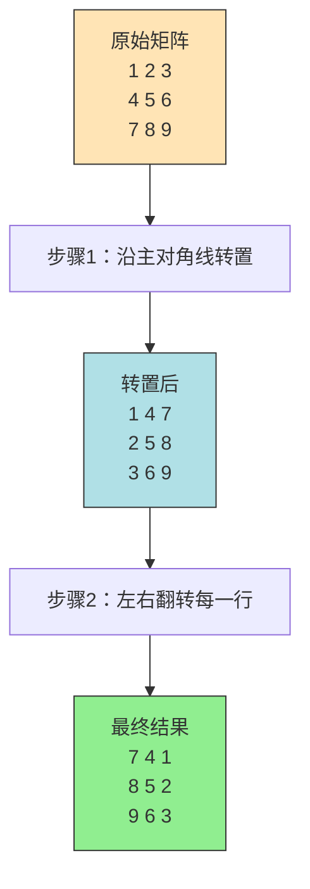
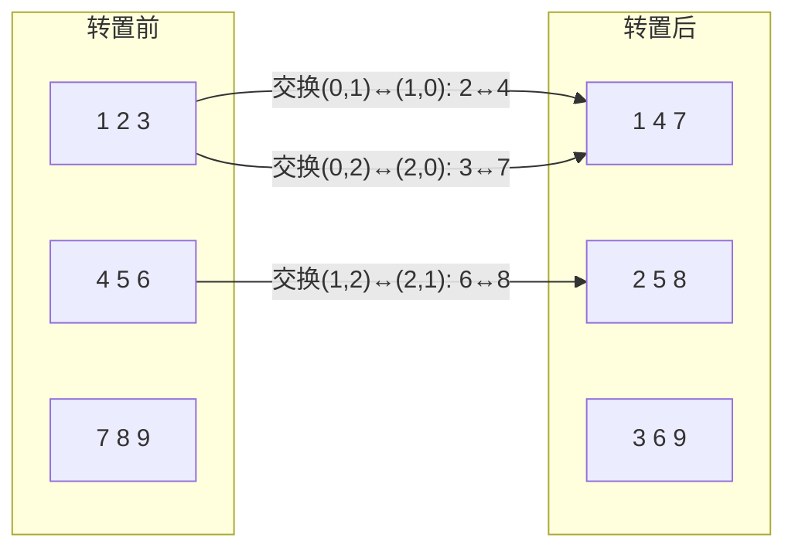
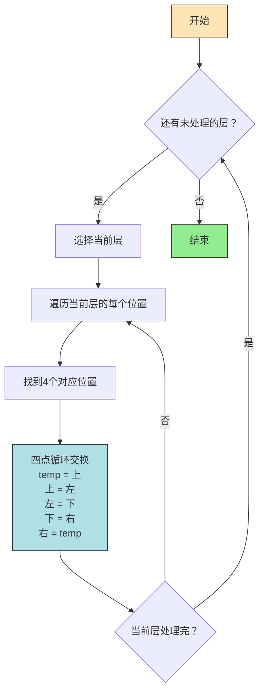

# LeetCode 48. 旋转图像 - 思路分析

---

## 📋 题目信息

| 属性 | 内容 |
|------|------|
| 题目编号 | 48 |
| 题目名称 | 旋转图像（Rotate Image） |
| 难度 | 🟡 Medium |
| 标签 | 数组、数学、矩阵 |
| 核心考点 | 矩阵原地操作、空间优化 |
| 相关技巧 | 转置 + 翻转、逐层旋转、坐标映射 |

---

## 📖 题目描述

给定一个 `n × n` 的二维矩阵 `matrix` 表示一个图像。请你将图像顺时针旋转 90 度。

你必须在 **原地** 旋转图像，这意味着你需要直接修改输入的二维矩阵。**请不要** 使用另一个矩阵来旋转图像。

### 示例 1

```
输入：matrix = [[1,2,3],[4,5,6],[7,8,9]]
输出：[[7,4,1],[8,5,2],[9,6,3]]
```

旋转前：
```
1  2  3
4  5  6
7  8  9
```

旋转后：
```
7  4  1
8  5  2
9  6  3
```

### 示例 2

```
输入：matrix = [[5,1,9,11],[2,4,8,10],[13,3,6,7],[15,14,12,16]]
输出：[[15,13,2,5],[14,3,4,1],[12,6,8,9],[16,7,10,11]]
```

旋转前：
```
 5   1   9  11
 2   4   8  10
13   3   6   7
15  14  12  16
```

旋转后：
```
15  13   2   5
14   3   4   1
12   6   8   9
16   7  10  11
```

### 约束条件

- `n == matrix.length == matrix[i].length`
- `1 <= n <= 20`
- `-1000 <= matrix[i][j] <= 1000`

### 代码模板（Python）

```python
class Solution:
    def rotate(self, matrix: List[List[int]]) -> None:
        """
        Do not return anything, modify matrix in-place instead.
        """
```

---

## 🤔 题目分析

### 关键信息提取

1. **输入**：一个 `n × n` 的正方形矩阵（这一点很重要，非正方形矩阵无法原地旋转）
2. **操作**：顺时针旋转 90 度
3. **约束**：必须原地修改，不能使用额外矩阵
4. **数据范围**：`n ≤ 20`，数据规模很小，O(n²) 甚至 O(n³) 都可以接受

### 题目类型识别

这道题属于 **矩阵操作** 类题目，核心考察：
- 对矩阵坐标变换的理解
- 原地操作的技巧（空间复杂度优化）
- 将复杂操作分解为简单步骤的能力

### 🌟 形象化理解：旋转图像

想象你手里拿着一张正方形的照片，现在要把它顺时针转 90 度。

**旋转前后的变化规律**：

```
原来在第一行的元素 → 旋转后跑到了最后一列
原来在第二行的元素 → 旋转后跑到了倒数第二列
原来在最后一行的元素 → 旋转后跑到了第一列
```

用坐标来表达就是：

```
原位置 (i, j) → 新位置 (j, n-1-i)
```

这就像把照片钉在中心点，然后顺时针拧 90 度：
- 上边 → 变成右边
- 右边 → 变成下边
- 下边 → 变成左边
- 左边 → 变成上边

### 难点分析

1. **原地操作**：如果允许使用额外空间，直接按公式搬运即可；但原地操作意味着搬运时会覆盖原有数据
2. **坐标映射**：需要准确推导旋转前后的坐标关系
3. **避免重复处理**：旋转时需要注意不要把已经旋转好的元素再旋转一次

---

## 💡 解题思路

### 方法一：使用辅助矩阵（暴力法）

#### 思路说明

最直观的想法：既然我们知道旋转公式 `(i, j) → (j, n-1-i)`，那就创建一个新矩阵，把每个元素按公式放到新位置，最后把新矩阵的值拷贝回原矩阵。

#### 🌟 形象化类比：搬家

想象你要重新布置房间里的家具。最简单的方法是：
1. 先把所有家具搬到隔壁空房间，按新布局摆好
2. 然后把家具从隔壁房间搬回来

这就是辅助矩阵的思路——借助一个"空房间"（新矩阵）来完成重新排列。

#### 详细步骤

```
步骤1：创建一个同样大小的空矩阵 new_matrix
步骤2：遍历原矩阵每个元素 matrix[i][j]
步骤3：将 matrix[i][j] 放到 new_matrix[j][n-1-i]
步骤4：将 new_matrix 的值拷贝回 matrix
```

#### 坐标映射推导

以 3×3 矩阵为例，观察每个位置旋转后去了哪里：

```
原矩阵位置 → 新矩阵位置
(0,0) → (0,2)    即 (j, n-1-i) = (0, 3-1-0) = (0, 2) ✓
(0,1) → (1,2)    即 (j, n-1-i) = (1, 3-1-0) = (1, 2) ✓
(0,2) → (2,2)    即 (j, n-1-i) = (2, 3-1-0) = (2, 2) ✓
(1,0) → (0,1)    即 (j, n-1-i) = (0, 3-1-1) = (0, 1) ✓
(1,1) → (1,1)    即 (j, n-1-i) = (1, 3-1-1) = (1, 1) ✓（中心不动）
(2,0) → (0,0)    即 (j, n-1-i) = (0, 3-1-2) = (0, 0) ✓
```

#### 复杂度分析

| 维度 | 复杂度 | 说明 |
|------|--------|------|
| 时间复杂度 | O(n²) | 遍历矩阵所有 n×n 个元素 |
| 空间复杂度 | O(n²) | 需要一个同样大小的辅助矩阵 |

> ⚠️ 注意：虽然这个方法简单直观，但题目要求"原地旋转"，严格来说使用 O(n²) 额外空间不符合题意。不过作为理解问题的第一步，这个方法很有价值。

---

### 方法二：转置 + 水平翻转（推荐解法 ⭐）

#### 思路说明

这是最优雅的解法。核心发现是：**顺时针旋转 90 度 = 先沿主对角线转置 + 再左右翻转每一行**。

这个结论可以通过坐标变换来证明：

```
转置操作：(i, j) → (j, i)
左右翻转：(j, i) → (j, n-1-i)

组合起来：(i, j) → (j, n-1-i)  ← 正好就是顺时针旋转90度的公式！
```

#### 🌟 形象化类比：翻书页

想象一本打开的书：
1. **转置** = 沿着书的对角线（从左上角到右下角）翻折，就像把书页沿对角线折叠
2. **左右翻转** = 把每一行像照镜子一样左右对调

两步操作合在一起，就完成了顺时针 90 度旋转。

#### 详细步骤

以 3×3 矩阵 `[[1,2,3],[4,5,6],[7,8,9]]` 为例：

**第一步：沿主对角线转置**

```
转置前：          转置后：
1  2  3           1  4  7
4  5  6    →      2  5  8
7  8  9           3  6  9
```

转置规则：交换 `matrix[i][j]` 和 `matrix[j][i]`（只处理上三角或下三角，避免交换两次）

**第二步：左右翻转每一行**

```
翻转前：          翻转后：
1  4  7           7  4  1
2  5  8    →      8  5  2
3  6  9           9  6  3
```

翻转规则：对每一行，交换 `matrix[i][j]` 和 `matrix[i][n-1-j]`（只处理前半部分）

**最终结果**：`[[7,4,1],[8,5,2],[9,6,3]]` ✓

#### 4×4 矩阵完整演示

原矩阵：
```
 5   1   9  11
 2   4   8  10
13   3   6   7
15  14  12  16
```

第一步 - 转置（交换 matrix[i][j] 和 matrix[j][i]）：
```
 5   2  13  15
 1   4   3  14
 9   8   6  12
11  10   7  16
```

第二步 - 左右翻转每一行：
```
15  13   2   5
14   3   4   1
12   6   8   9
16   7  10  11
```

结果与预期输出完全一致 ✓

#### 转置操作的注意事项

转置时只需要遍历矩阵的**上三角**部分（即 `j > i` 的位置），因为：
- 对角线上的元素 `(i, i)` 不需要动
- 如果同时处理 `(i, j)` 和 `(j, i)`，会交换两次，等于没交换

```
遍历范围示意（✓ 表示需要处理的位置）：
×  ✓  ✓  ✓
×  ×  ✓  ✓
×  ×  ×  ✓
×  ×  ×  ×
```

#### 复杂度分析

| 维度 | 复杂度 | 说明 |
|------|--------|------|
| 时间复杂度 | O(n²) | 转置 O(n²) + 翻转 O(n²) = O(n²) |
| 空间复杂度 | O(1) | 只使用了常数个临时变量，原地操作 |

> 💡 这个方法的优势在于：思路清晰、代码简洁、容易记忆。面试中推荐优先使用这个方法。

---

### 方法三：逐层旋转（四点循环交换）

#### 思路说明

把矩阵想象成一圈一圈的"洋葱"，从最外层到最内层，逐层处理。对于每一层，找到四个对应位置的元素，进行循环交换。

#### 🌟 形象化类比：旋转拼图

想象一个正方形的拼图框，上面有一圈一圈的轨道：
- 最外圈是第一条轨道
- 往里一圈是第二条轨道
- 以此类推...

旋转时，每条轨道上的拼图块都沿着轨道顺时针移动一个位置。每次移动涉及 4 个块的循环交换：

```
上边的块 → 右边的块
右边的块 → 下边的块
下边的块 → 左边的块
左边的块 → 上边的块
```

#### 四点循环交换的坐标关系

对于位置 `(i, j)`，顺时针旋转涉及的四个位置是：

```
位置1：(i, j)              ← 上边
位置2：(j, n-1-i)          ← 右边
位置3：(n-1-i, n-1-j)      ← 下边
位置4：(n-1-j, i)          ← 左边
```

循环交换过程：

```
temp = matrix[i][j]                          // 保存位置1
matrix[i][j] = matrix[n-1-j][i]             // 位置4 → 位置1
matrix[n-1-j][i] = matrix[n-1-i][n-1-j]     // 位置3 → 位置4
matrix[n-1-i][n-1-j] = matrix[j][n-1-i]     // 位置2 → 位置3
matrix[j][n-1-i] = temp                      // 位置1 → 位置2
```

#### 详细步骤（以 4×4 矩阵为例）

原矩阵：
```
 5   1   9  11
 2   4   8  10
13   3   6   7
15  14  12  16
```

**第一层（最外层）**：`i = 0`，处理 `j = 0, 1, 2`

当 `j = 0` 时，四个位置是 `(0,0)`, `(0,3)`, `(3,3)`, `(3,0)`：
```
 [5]  1   9  [11]         [15]  1   9  [5]
  2   4   8   10    →       2   4   8   10
 13   3   6    7           13   3   6    7
[15] 14  12  [16]         [16] 14  12  [11]
```
即：5→11的位置，11→16的位置，16→15的位置，15→5的位置

当 `j = 1` 时，四个位置是 `(0,1)`, `(1,3)`, `(3,2)`, `(2,0)`：
```
 15  [1]  9    5          15  [13]  9    5
  2   4   8  [10]   →      2    4   8  [1]
[13]  3   6    7          [12]   3   6    7
 16  14 [12]  11          16   14 [10]  11
```

当 `j = 2` 时，四个位置是 `(0,2)`, `(2,3)`, `(3,1)`, `(1,0)`：
```
 15  13  [9]   5          15  13  [2]   5
 [2]  4   8    1    →    [14]  4   8    1
 12   3   6   [7]         12   3   6   [9]
 16 [14] 10   11          16  [7] 10   11
```

**第二层（内层）**：`i = 1`，处理 `j = 1`

四个位置是 `(1,1)`, `(1,2)`, `(2,2)`, `(2,1)`：
```
  15  13   2   5          15  13   2   5
  14  [4] [8]  1    →    14  [3] [4]  1
  12  [3] [6]  9          12  [6] [8]  9
  16   7  10  11          16   7  10  11
```

最终结果：
```
15  13   2   5
14   3   4   1
12   6   8   9
16   7  10  11
```

与预期输出完全一致 ✓

#### 遍历范围

- 外层循环 `i`：从 `0` 到 `n/2 - 1`（层数）
- 内层循环 `j`：从 `i` 到 `n - 1 - i - 1`（每层需要处理的元素个数）

```
4×4 矩阵的遍历范围：
第0层：i=0, j=0,1,2  （处理3个四元组）
第1层：i=1, j=1       （处理1个四元组）
共处理 3+1 = 4 个四元组 = 16个元素 ✓
```

#### 复杂度分析

| 维度 | 复杂度 | 说明 |
|------|--------|------|
| 时间复杂度 | O(n²) | 每个元素恰好被访问和移动一次 |
| 空间复杂度 | O(1) | 只使用了一个临时变量 temp |

---

### 三种方法对比

| 方法 | 时间复杂度 | 空间复杂度 | 代码难度 | 推荐指数 |
|------|-----------|-----------|---------|---------|
| 辅助矩阵 | O(n²) | O(n²) | ⭐ 简单 | ⭐⭐ |
| 转置+翻转 | O(n²) | O(1) | ⭐⭐ 中等 | ⭐⭐⭐⭐⭐ |
| 逐层旋转 | O(n²) | O(1) | ⭐⭐⭐ 较难 | ⭐⭐⭐⭐ |

> 💡 面试建议：优先掌握方法二（转置+翻转），思路清晰且不容易写错。方法三虽然更"直接"，但坐标关系容易搞混。

---

## 🎨 图解说明

### 方法二流程图：转置 + 水平翻转



### 转置操作详解



### 方法三流程图：逐层旋转



### 四点循环交换示意

```
对于位置 (i, j)，四个关联位置的循环：

        (i, j)
          ↑  ↘
          |    (j, n-1-i)
          |         |
    (n-1-j, i)      |
          ↖    ↙
      (n-1-i, n-1-j)

交换方向（逆时针取值，实现顺时针旋转）：
temp         ← matrix[i][j]
matrix[i][j] ← matrix[n-1-j][i]        （左→上）
matrix[n-1-j][i] ← matrix[n-1-i][n-1-j] （下→左）
matrix[n-1-i][n-1-j] ← matrix[j][n-1-i] （右→下）
matrix[j][n-1-i] ← temp                  （上→右）
```

---

## ✏️ 代码框架填空

> 以下代码挖空了关键逻辑部分，请尝试自己填写。答案在下一节「完整代码实现」中。

### 方法二：转置 + 水平翻转（Python）

```python
from typing import List

class Solution:
    def rotate(self, matrix: List[List[int]]) -> None:
        """
        Do not return anything, modify matrix in-place instead.
        """
        n = len(matrix)  # 与 List 类型关联，获取矩阵维度

        # 第一步：沿主对角线转置
        for i in range(n):
            for j in range(______, n):          # 填空1：j 的起始值是什么？
                matrix[i][j], matrix[j][i] = ______, ______  # 填空2：交换哪两个值？

        # 第二步：左右翻转每一行
        for i in range(n):
            for j in range(______):             # 填空3：j 的范围是什么？
                matrix[i][j], matrix[i][______] = matrix[i][______], matrix[i][j]  # 填空4：与哪个位置交换？
```

<details>
<summary>💡 填空提示</summary>

- **填空1**：转置时只需要处理上三角部分，所以 j 应该从哪里开始？
- **填空2**：转置就是交换 `(i,j)` 和 `(j,i)` 位置的元素
- **填空3**：左右翻转只需要处理每行的前半部分
- **填空4**：左右翻转时，位置 j 对应的镜像位置是什么？

</details>

<details>
<summary>✅ 填空答案</summary>

- **填空1**：`i + 1`（从 i+1 开始，避免对角线和重复交换）
- **填空2**：`matrix[j][i], matrix[i][j]`（交换转置位置的两个元素）
- **填空3**：`n // 2`（只处理前半部分）
- **填空4**：`n - 1 - j`（镜像位置）

</details>

### 方法三：逐层旋转（Python）

```python
from typing import List

class Solution:
    def rotate(self, matrix: List[List[int]]) -> None:
        """
        Do not return anything, modify matrix in-place instead.
        """
        n = len(matrix)  # 与 List 类型关联，获取矩阵维度

        # 逐层处理
        for i in range(______):                 # 填空1：外层循环的范围？
            for j in range(i, ______):          # 填空2：内层循环的终止条件？
                # 四点循环交换
                temp = matrix[i][j]
                matrix[i][j] = matrix[______][______]           # 填空3：左边元素的坐标？
                matrix[______][______] = matrix[______][______]  # 填空4：下边元素的坐标？
                matrix[______][______] = matrix[______][______]  # 填空5：右边元素的坐标？
                matrix[______][______] = temp                    # 填空6：保存的值放到哪？
```

<details>
<summary>💡 填空提示</summary>

- **填空1**：矩阵有多少层？想想 n/2
- **填空2**：每层处理到哪个位置结束？
- **填空3-6**：回顾四点循环交换的坐标关系：
  - 上 `(i, j)` ← 左 `(n-1-j, i)`
  - 左 `(n-1-j, i)` ← 下 `(n-1-i, n-1-j)`
  - 下 `(n-1-i, n-1-j)` ← 右 `(j, n-1-i)`
  - 右 `(j, n-1-i)` ← temp

</details>

<details>
<summary>✅ 填空答案</summary>

- **填空1**：`n // 2`
- **填空2**：`n - 1 - i`
- **填空3**：`matrix[n-1-j][i]`（左边元素）
- **填空4**：`matrix[n-1-j][i] = matrix[n-1-i][n-1-j]`（下→左）
- **填空5**：`matrix[n-1-i][n-1-j] = matrix[j][n-1-i]`（右→下）
- **填空6**：`matrix[j][n-1-i] = temp`（上→右）

</details>

---

## 💻 完整代码实现

### Python 实现

#### 方法一：辅助矩阵

```python
from typing import List

class Solution:
    def rotate(self, matrix: List[List[int]]) -> None:
        """
        Do not return anything, modify matrix in-place instead.
        """
        n = len(matrix)

        # 创建辅助矩阵
        new_matrix = [[0] * n for _ in range(n)]

        # 按旋转公式填充新矩阵
        for i in range(n):
            for j in range(n):
                new_matrix[j][n - 1 - i] = matrix[i][j]

        # 将结果拷贝回原矩阵
        for i in range(n):
            for j in range(n):
                matrix[i][j] = new_matrix[i][j]
```

#### 方法二：转置 + 水平翻转（推荐 ⭐）

```python
from typing import List

class Solution:
    def rotate(self, matrix: List[List[int]]) -> None:
        """
        Do not return anything, modify matrix in-place instead.
        """
        n = len(matrix)

        # 第一步：沿主对角线转置
        # 只遍历上三角部分（j > i），避免重复交换
        for i in range(n):
            for j in range(i + 1, n):
                matrix[i][j], matrix[j][i] = matrix[j][i], matrix[i][j]

        # 第二步：左右翻转每一行
        # 只处理前半部分（j < n//2），避免翻转两次
        for i in range(n):
            for j in range(n // 2):
                matrix[i][j], matrix[i][n - 1 - j] = matrix[i][n - 1 - j], matrix[i][j]
```

#### 方法三：逐层旋转

```python
from typing import List

class Solution:
    def rotate(self, matrix: List[List[int]]) -> None:
        """
        Do not return anything, modify matrix in-place instead.
        """
        n = len(matrix)

        # 从外层到内层逐层处理
        for i in range(n // 2):
            # 每层处理 j 从 i 到 n-2-i 的位置
            for j in range(i, n - 1 - i):
                # 保存上边的值
                temp = matrix[i][j]
                # 左边 → 上边
                matrix[i][j] = matrix[n - 1 - j][i]
                # 下边 → 左边
                matrix[n - 1 - j][i] = matrix[n - 1 - i][n - 1 - j]
                # 右边 → 下边
                matrix[n - 1 - i][n - 1 - j] = matrix[j][n - 1 - i]
                # 上边（temp）→ 右边
                matrix[j][n - 1 - i] = temp
```

---

### C++ 实现

#### 方法二：转置 + 水平翻转（推荐 ⭐）

```cpp
#include <vector>
#include <algorithm>
using namespace std;

class Solution {
public:
    void rotate(vector<vector<int>>& matrix) {
        int n = matrix.size();

        // 第一步：沿主对角线转置
        for (int i = 0; i < n; i++) {
            for (int j = i + 1; j < n; j++) {
                swap(matrix[i][j], matrix[j][i]);
            }
        }

        // 第二步：左右翻转每一行
        for (int i = 0; i < n; i++) {
            for (int j = 0; j < n / 2; j++) {
                swap(matrix[i][j], matrix[i][n - 1 - j]);
            }
        }
    }
};
```

#### 方法三：逐层旋转

```cpp
#include <vector>
using namespace std;

class Solution {
public:
    void rotate(vector<vector<int>>& matrix) {
        int n = matrix.size();

        // 逐层旋转，四点循环交换
        for (int i = 0; i < n / 2; i++) {
            for (int j = i; j < n - 1 - i; j++) {
                int temp = matrix[i][j];
                // 左 → 上
                matrix[i][j] = matrix[n - 1 - j][i];
                // 下 → 左
                matrix[n - 1 - j][i] = matrix[n - 1 - i][n - 1 - j];
                // 右 → 下
                matrix[n - 1 - i][n - 1 - j] = matrix[j][n - 1 - i];
                // 上(temp) → 右
                matrix[j][n - 1 - i] = temp;
            }
        }
    }
};
```

### 与 Python 的主要差异

| 差异点 | Python | C++ |
|--------|--------|-----|
| 类定义 | `class Solution:` | `class Solution { public: };` |
| 参数传递 | `matrix: List[List[int]]` | `vector<vector<int>>& matrix`（引用传递） |
| 交换语法 | `a, b = b, a` 一行搞定 | 需要 `swap(a, b)` 或手动用 temp |
| 矩阵大小 | `len(matrix)` | `matrix.size()` |
| 整数除法 | `n // 2` | `n / 2`（整数自动截断） |

---

## ⚠️ 易错点提醒

### 1. 转置时遍历范围错误

**易错点**：转置时遍历整个矩阵，导致每对元素被交换两次（等于没交换）

```python
# ❌ 错误写法：遍历整个矩阵
for i in range(n):
    for j in range(n):
        matrix[i][j], matrix[j][i] = matrix[j][i], matrix[i][j]
# 结果：(0,1)和(1,0)交换了两次，回到原位！

# ✅ 正确写法：只遍历上三角（j 从 i+1 开始）
for i in range(n):
    for j in range(i + 1, n):
        matrix[i][j], matrix[j][i] = matrix[j][i], matrix[i][j]
```

**记忆技巧**：转置只处理"对角线上方"的元素，`j` 从 `i + 1` 开始。

### 2. 左右翻转的范围错误

**易错点**：翻转时遍历整行，导致每对元素被交换两次

```python
# ❌ 错误写法：遍历整行
for j in range(n):
    matrix[i][j], matrix[i][n-1-j] = matrix[i][n-1-j], matrix[i][j]
# 结果：前半部分和后半部分各交换一次，回到原位！

# ✅ 正确写法：只遍历前半部分
for j in range(n // 2):
    matrix[i][j], matrix[i][n-1-j] = matrix[i][n-1-j], matrix[i][j]
```

### 3. 逐层旋转的坐标写错

**易错点**：四点循环交换时坐标关系搞混

**正确的坐标对应关系**（建议背下来）：

```
上：(i, j)
右：(j, n-1-i)
下：(n-1-i, n-1-j)
左：(n-1-j, i)
```

**验证技巧**：用一个具体的小例子（如 3×3 矩阵的角落元素 `(0,0)`）代入验证：
- 上 `(0, 0)` → 右 `(0, 2)` → 下 `(2, 2)` → 左 `(2, 0)` ✓

### 4. 逐层旋转的循环边界

**易错点**：内层循环的终止条件写成 `n - i` 而不是 `n - 1 - i`

```python
# ❌ 错误：多处理了一个元素，导致角落元素被旋转两次
for j in range(i, n - i):
    ...

# ✅ 正确：每层最后一个元素不需要处理（它会被第一个元素的旋转覆盖到）
for j in range(i, n - 1 - i):
    ...
```

**理解**：以最外层为例，第一行有 n 个元素，但只需要处理前 n-1 个，因为第 n 个元素（右上角）会在处理第一个元素时被自动处理。

### 5. 混淆顺时针和逆时针

**易错点**：旋转方向搞反

```
顺时针 90°：先转置，再左右翻转
逆时针 90°：先转置，再上下翻转（或先左右翻转，再转置）
旋转 180°：先上下翻转，再左右翻转
```

### 6. 调试技巧

- **打印中间状态**：在转置后、翻转前打印矩阵，确认转置是否正确
- **小矩阵验证**：先用 2×2 或 3×3 矩阵手动验证
- **角落元素追踪**：追踪四个角落元素的移动路径，快速发现坐标错误

```python
# 调试辅助函数
def print_matrix(matrix, label=""):
    if label:
        print(f"--- {label} ---")
    for row in matrix:
        print(' '.join(f'{x:3d}' for x in row))
    print()
```

---

## 🔗 相似题目推荐

### 同类型题目

这些题目都涉及矩阵操作或坐标变换：

1. **LeetCode 54 - 螺旋矩阵** (Medium)
   - 相似点：需要理解矩阵的层次结构，按层遍历矩阵
   - 关联：本题的逐层旋转思路与螺旋遍历的分层思想一致

2. **LeetCode 59 - 螺旋矩阵 II** (Medium)
   - 相似点：螺旋填充矩阵，同样需要分层处理
   - 进阶：从"读取"变为"写入"，但核心的层次遍历思路相同

3. **LeetCode 73 - 矩阵置零** (Medium)
   - 相似点：原地修改矩阵，需要巧妙利用已有空间
   - 关联：同样考察原地操作的技巧

### 进阶题目

掌握本题后，可以挑战这些更难的题目：

1. **LeetCode 885 - 螺旋矩阵 III** (Medium)
   - 进阶点：在无限大的网格上螺旋行走，需要处理边界外的情况

2. **LeetCode 289 - 生命游戏** (Medium)
   - 进阶点：原地修改矩阵，但需要同时考虑所有元素的状态变化，需要用位运算编码新旧状态

3. **LeetCode 867 - 转置矩阵** (Easy)
   - 关联：本题的第一步操作（转置），但注意该题的矩阵不一定是正方形

### 相关知识点

本题涉及的核心知识点：

- **矩阵转置**：`(i, j) → (j, i)`
  - 相关题目：LeetCode 867

- **原地操作技巧**：不使用额外空间完成数据变换
  - 相关题目：LeetCode 73、LeetCode 189、LeetCode 283

- **坐标映射与变换**：理解二维坐标在各种操作下的变换规律
  - 相关题目：LeetCode 54、LeetCode 59

---

## 📚 知识点总结

### 核心算法

本题的核心是 **矩阵的原地变换**，关键技巧包括：

1. **操作分解**：将复杂的旋转操作分解为两个简单操作（转置 + 翻转）
2. **四点循环交换**：利用临时变量实现多个位置的原地循环赋值
3. **坐标映射公式**：顺时针旋转 90° 的映射关系 `(i, j) → (j, n-1-i)`

### 数据结构

- **二维数组（矩阵）**：本题的核心数据结构
- 关键操作：转置、翻转、元素交换
- 注意：正方形矩阵（n×n）才能原地旋转

### 解题模板

#### 模板1：转置 + 翻转（适用于矩阵旋转类问题）

```python
from typing import List

class Solution:
    def rotate_90_clockwise(self, matrix: List[List[int]]) -> None:
        """顺时针旋转90度 = 转置 + 左右翻转"""
        n = len(matrix)
        # 转置
        for i in range(n):
            for j in range(i + 1, n):
                matrix[i][j], matrix[j][i] = matrix[j][i], matrix[i][j]
        # 左右翻转
        for i in range(n):
            for j in range(n // 2):
                matrix[i][j], matrix[i][n-1-j] = matrix[i][n-1-j], matrix[i][j]

    def rotate_90_counterclockwise(self, matrix: List[List[int]]) -> None:
        """逆时针旋转90度 = 转置 + 上下翻转"""
        n = len(matrix)
        # 转置
        for i in range(n):
            for j in range(i + 1, n):
                matrix[i][j], matrix[j][i] = matrix[j][i], matrix[i][j]
        # 上下翻转
        for i in range(n // 2):
            matrix[i], matrix[n-1-i] = matrix[n-1-i], matrix[i]

    def rotate_180(self, matrix: List[List[int]]) -> None:
        """旋转180度 = 上下翻转 + 左右翻转"""
        n = len(matrix)
        # 上下翻转
        for i in range(n // 2):
            matrix[i], matrix[n-1-i] = matrix[n-1-i], matrix[i]
        # 左右翻转
        for i in range(n):
            for j in range(n // 2):
                matrix[i][j], matrix[i][n-1-j] = matrix[i][n-1-j], matrix[i][j]
```

#### 模板2：逐层旋转（适用于需要精确控制每个元素移动的场景）

```python
from typing import List

class Solution:
    def rotate(self, matrix: List[List[int]]) -> None:
        """逐层四点循环交换"""
        n = len(matrix)
        for i in range(n // 2):
            for j in range(i, n - 1 - i):
                temp = matrix[i][j]
                matrix[i][j] = matrix[n-1-j][i]
                matrix[n-1-j][i] = matrix[n-1-i][n-1-j]
                matrix[n-1-i][n-1-j] = matrix[j][n-1-i]
                matrix[j][n-1-i] = temp
```

### 学习要点

1. **操作分解思想**：遇到复杂的变换操作时，尝试将其分解为多个简单操作的组合。这不仅让代码更简洁，也更不容易出错
2. **原地操作技巧**：当题目要求 O(1) 空间时，考虑使用交换操作、位运算编码等技巧来避免额外空间
3. **坐标变换的数学本质**：矩阵旋转本质上是线性变换，理解坐标映射公式是解题的关键
4. **填空练习的价值**：通过填空练习，你应该掌握了转置和翻转的遍历范围控制，以及四点循环交换的坐标关系

---

## 📝 补充说明

### 从填空到完整实现的进阶路径

1. **第一遍**：看算法步骤，理解转置和翻转的含义
2. **第二遍**：尝试填空，重点关注遍历范围和坐标关系
3. **第三遍**：对照答案，理解为什么 `j` 从 `i+1` 开始、为什么翻转只处理 `n//2`
4. **第四遍**：不看提示，独立完整实现两种方法

### 时间复杂度优化历程

- 辅助矩阵法：O(n²) 时间 + O(n²) 空间 → 空间不满足要求
- 转置+翻转法：O(n²) 时间 + O(1) 空间 → 满足原地要求，代码简洁
- 逐层旋转法：O(n²) 时间 + O(1) 空间 → 满足原地要求，但代码较复杂

> 本题的时间复杂度无法优于 O(n²)，因为每个元素至少需要被访问一次。优化的重点在于空间复杂度。

### 旋转方向速查表

| 操作 | 等价分解 |
|------|---------|
| 顺时针 90° | 转置 → 左右翻转 |
| 逆时针 90° | 转置 → 上下翻转 |
| 旋转 180° | 上下翻转 → 左右翻转 |
| 水平翻转 | 每行 reverse |
| 垂直翻转 | 行顺序 reverse |
| 主对角线翻转 | 转置 |
| 副对角线翻转 | 旋转 180° → 转置 |

### 实际应用场景

- **图像处理**：照片旋转、屏幕方向切换
- **游戏开发**：俄罗斯方块中方块的旋转
- **计算机图形学**：2D 变换矩阵的应用
- **数据可视化**：表格/热力图的方向调整

---
