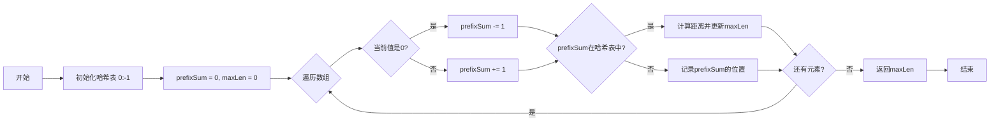

# 525. 连续数组

## 📋 题目信息
- **难度**：Medium
- **标签**：数组、哈希表、前缀和
- **来源**：LeetCode

## 📖 题目描述

给定一个二进制数组 `nums`，找到含有相同数量的 `0` 和 `1` 的最长连续子数组，并返回该子数组的长度。

### 示例

**示例 1：**
```
输入：nums = [0,1]
输出：2
说明：[0, 1] 是具有相同数量 0 和 1 的最长连续子数组。
```

**示例 2：**
```
输入：nums = [0,1,0]
输出：2
说明：[0, 1] (或 [1, 0]) 是具有相同数量 0 和 1 的最长连续子数组。
```

**示例 3：**
```
输入：nums = [0,1,1,1,1,1,0,0,0]
输出：6
解释：[1,1,1,0,0,0] 是具有相同数量 0 和 1 的最长连续子数组。
```

### 约束条件

- `1 <= nums.length <= 10^5`
- `nums[i]` 不是 `0` 就是 `1`

---

## 🤔 题目分析

### 问题理解

这道题要求我们在一个只包含 0 和 1 的数组中，找到一个最长的连续子数组，使得这个子数组中 0 的个数和 1 的个数相等。

用自己的话重新描述：我们需要在二进制数组中找到一个区间 [i, j]，使得这个区间内 0 和 1 的数量相同，并且区间长度 j - i + 1 最大。

### 关键观察

通过仔细分析题目，我们可以发现以下关键点：

1. **0 和 1 数量相等的条件**：
   - 如果一个子数组中 0 和 1 的数量相等
   - 那么 count(1) - count(0) = 0
   - 或者说 count(1) = count(0)

2. **转化思路**：
   - 将 0 看作 -1，将 1 看作 +1
   - 那么"0 和 1 数量相等"就等价于"子数组和为 0"
   - 问题转化为：找到和为 0 的最长子数组

3. **前缀和的应用**：
   - 如果 prefixSum[i] == prefixSum[j]，说明区间 (i, j] 的和为 0
   - 我们需要找到相同前缀和之间距离最远的两个位置

4. **哈希表优化**：
   - 用哈希表记录每个前缀和第一次出现的位置
   - 当再次遇到相同的前缀和时，计算距离并更新最大长度

### 核心难点

1. **如何将问题转化？**
   - 从"0 和 1 数量相等"转化为"子数组和为 0"
   - 这是解题的关键突破口

2. **如何高效查找？**
   - 暴力方法：枚举所有子数组 O(n²)
   - 优化方法：前缀和 + 哈希表 O(n)

3. **边界条件处理**
   - 前缀和初始值的设置
   - 哈希表初始化

### 问题本质

这道题的本质是：**通过巧妙的转化，将"平衡问题"转化为"和为0问题"，然后用前缀和+哈希表高效求解**。

关键洞察：
- **0 → -1 的转化**：让问题从计数变成求和
- **前缀和的性质**：相同前缀和之间的区间和为 0
- **哈希表加速**：O(1) 时间查找之前是否出现过相同的前缀和

---

## 💡 解题思路

### 方法一：暴力解法

#### 思路说明

最直观的想法是：枚举所有可能的子数组，统计每个子数组中 0 和 1 的个数，找出满足条件的最长子数组。

#### 算法步骤

1. **外层循环**：遍历所有可能的起始位置 i
2. **内层循环**：从 i 开始遍历所有可能的结束位置 j
3. **统计计数**：统计区间 [i, j] 中 0 和 1 的个数
4. **更新结果**：如果 count(0) == count(1)，更新最大长度

#### 复杂度分析

- **时间复杂度**：O(n²) - 两层嵌套循环
- **空间复杂度**：O(1) - 只使用常数变量

#### 为什么需要优化

虽然暴力解法简单直观，但存在明显的性能瓶颈：

1. **效率低下**：当 n = 10⁵ 时，O(n²) 约为 10¹⁰ 次操作，会超时
2. **重复计算**：每个子数组都要重新统计，存在大量重复计算
3. **无法通过大数据测试**：题目约束 n 最大为 10⁵，暴力解法无法通过

---

### 方法二：前缀和 + 哈希表优化

#### 🌟 形象化理解：天平的平衡

> **💡 在进入专业算法分析之前，先通过一个生活化的例子来理解核心思想**

**场景类比**：

想象你有一个天平，左边放 0，右边放 1：
- 每遇到一个 0，天平向左倾斜一格（-1）
- 每遇到一个 1，天平向右倾斜一格（+1）
- 天平平衡时（回到原点），说明左右两边重量相等

现在你要找最长的一段路程，使得走完这段路后天平恰好平衡。

**对应关系**：
- **数组中的 0** = 天平向左倾斜（-1）
- **数组中的 1** = 天平向右倾斜（+1）
- **前缀和** = 当前天平的位置（累积倾斜度）
- **相同的前缀和** = 天平回到了相同的位置
- **两个相同位置之间的距离** = 平衡的最长路程

**核心理解**：
如果天平在位置 A 时的状态，和在位置 B 时的状态完全相同，那么从 A 到 B 这段路程中，左右倾斜的次数相等，天平保持了平衡。

**举例说明**：
```
数组：[0, 1, 1, 0, 1, 1, 0, 0]
转化：[-1, 1, 1, -1, 1, 1, -1, -1]

天平位置变化：
起点：0
遇到-1：0 + (-1) = -1
遇到+1：-1 + 1 = 0  ← 回到起点！说明前2个数平衡
遇到+1：0 + 1 = 1
遇到-1：1 + (-1) = 0  ← 又回到起点！说明前4个数平衡
...
```

当天平两次到达同一位置时，中间这段路程就是平衡的！

**从类比到算法**：
现在让我们把这个天平的思想转化为具体的算法...

---

#### 优化思路推导

**思考过程**：

1. **暴力解法的瓶颈**：需要枚举所有子数组并统计，时间复杂度 O(n²)

2. **问题转化**：
   - 0 和 1 数量相等 ⟺ count(1) - count(0) = 0
   - 将 0 看作 -1，1 看作 +1
   - 问题变成：找和为 0 的最长子数组

3. **前缀和的应用**：
   - 定义 prefixSum[i] = nums[0] + nums[1] + ... + nums[i]（0 转化为 -1）
   - 如果 prefixSum[i] == prefixSum[j]，说明区间 (i, j] 的和为 0
   - 即区间 (i, j] 中 0 和 1 的数量相等

4. **哈希表优化**：
   - 用哈希表记录每个前缀和第一次出现的位置
   - 当再次遇到相同的前缀和时，计算距离
   - 更新最大长度

5. **初始化技巧**：
   - 前缀和为 0 时，说明从开始到当前位置的子数组满足条件
   - 需要在哈希表中预设 {0: -1}，表示前缀和 0 在位置 -1

#### 算法步骤

1. **初始化**：
   - 创建哈希表 `sumToIndex`，初始化为 `{0: -1}`
   - 初始化 `prefixSum = 0`，`maxLen = 0`

2. **遍历数组**：
   - 对于每个元素，如果是 0 则 `prefixSum -= 1`，如果是 1 则 `prefixSum += 1`
   - 如果 `prefixSum` 在哈希表中：
     - 计算当前距离：`i - sumToIndex[prefixSum]`
     - 更新最大长度
   - 如果 `prefixSum` 不在哈希表中：
     - 记录当前位置：`sumToIndex[prefixSum] = i`

3. **返回结果**：返回 `maxLen`

#### 复杂度分析

- **时间复杂度**：O(n) - 只需遍历数组一次，哈希表操作 O(1)
- **空间复杂度**：O(n) - 哈希表最多存储 n 个不同的前缀和

#### 💭 回顾类比

- 生活中的**天平位置** 对应 代码中的**前缀和**
- 生活中的**回到相同位置** 对应 代码中的**相同前缀和**
- 生活中的**两次到达同一位置的距离** 对应 代码中的**子数组长度**
- 这就是为什么这个算法能够将时间复杂度从 O(n²) 优化到 O(n) 的原因

---

## 🎨 图解说明

### 执行过程示例

让我们通过示例 3 来详细演示算法的执行过程。

**示例输入**：`nums = [0,1,1,1,1,1,0,0,0]`

**执行步骤**：

```
初始状态：
sumToIndex = {0: -1}  # 前缀和0在位置-1
prefixSum = 0
maxLen = 0

索引 0，值 0：
- prefixSum = 0 + (-1) = -1
- -1 不在哈希表中
- sumToIndex = {0: -1, -1: 0}
- maxLen = 0

索引 1，值 1：
- prefixSum = -1 + 1 = 0
- 0 在哈希表中！位置是 -1
- 距离 = 1 - (-1) = 2
- maxLen = max(0, 2) = 2
- 数组 [0,1] 满足条件 ✓

索引 2，值 1：
- prefixSum = 0 + 1 = 1
- 1 不在哈希表中
- sumToIndex = {0: -1, -1: 0, 1: 2}
- maxLen = 2

索引 3，值 1：
- prefixSum = 1 + 1 = 2
- 2 不在哈希表中
- sumToIndex = {0: -1, -1: 0, 1: 2, 2: 3}
- maxLen = 2

索引 4，值 1：
- prefixSum = 2 + 1 = 3
- 3 不在哈希表中
- sumToIndex = {0: -1, -1: 0, 1: 2, 2: 3, 3: 4}
- maxLen = 2

索引 5，值 1：
- prefixSum = 3 + 1 = 4
- 4 不在哈希表中
- sumToIndex = {0: -1, -1: 0, 1: 2, 2: 3, 3: 4, 4: 5}
- maxLen = 2

索引 6，值 0：
- prefixSum = 4 + (-1) = 3
- 3 在哈希表中！位置是 4
- 距离 = 6 - 4 = 2
- maxLen = max(2, 2) = 2

索引 7，值 0：
- prefixSum = 3 + (-1) = 2
- 2 在哈希表中！位置是 3
- 距离 = 7 - 3 = 4
- maxLen = max(2, 4) = 4
- 数组 [1,1,0,0] 满足条件 ✓

索引 8，值 0：
- prefixSum = 2 + (-1) = 1
- 1 在哈希表中！位置是 2
- 距离 = 8 - 2 = 6
- maxLen = max(4, 6) = 6
- 数组 [1,1,1,0,0,0] 满足条件 ✓

最终结果：maxLen = 6
```

### 可视化图表



### 前缀和变化图

```
数组：  [0,  1,  1,  1,  1,  1,  0,  0,  0]
转化：  [-1, 1,  1,  1,  1,  1, -1, -1, -1]
索引：   0   1   2   3   4   5   6   7   8

前缀和变化：
位置 -1: 0 (初始)
位置  0: -1
位置  1: 0  ← 和位置-1相同，距离=2
位置  2: 1
位置  3: 2
位置  4: 3
位置  5: 4
位置  6: 3  ← 和位置4相同，距离=2
位置  7: 2  ← 和位置3相同，距离=4
位置  8: 1  ← 和位置2相同，距离=6 ✓ 最长
```

### 关键理解

**为什么要将 0 转化为 -1？**
- 这样可以用"和为0"来表示"0和1数量相等"
- 如果不转化，就需要分别统计0和1的个数，更复杂

**为什么初始化 {0: -1}？**
- 当前缀和为0时，说明从数组开始到当前位置的子数组满足条件
- 位置-1表示"数组开始之前"，这样计算距离时不需要特殊处理

**为什么只记录第一次出现的位置？**
- 我们要找最长的子数组
- 相同前缀和第一次出现的位置距离当前位置最远
- 后续出现的位置距离更近，不需要更新

**为什么这个方法是正确的？**
- 如果 prefixSum[i] == prefixSum[j]，说明从 i+1 到 j 的和为 0
- 和为 0 意味着这段区间内 +1 和 -1 的数量相等
- 即原数组中 1 和 0 的数量相等

---

## ✏️ 代码框架填空

> **💡 学习提示**：在查看完整代码之前，先尝试根据上面的算法步骤，自己思考并填写下面的空白处。这将帮助你从"不知道怎么开始"过渡到"能够独立实现关键逻辑"。

### Python填空版

```python
def findMaxLength(nums):
    """
    找到含有相同数量0和1的最长连续子数组
    
    参数:
        nums: 二进制数组
    
    返回:
        最长子数组的长度
    """
    # 🔹 填空1：初始化哈希表
    # 提示：前缀和0应该在哪个位置？为什么是-1？
    sum_to_index = {______: ______}
    
    # 🔹 填空2：初始化前缀和和最大长度
    # 提示：前缀和初始值是多少？最大长度初始值是多少？
    prefix_sum = ______
    max_len = ______
    
    # 🔹 填空3：遍历数组
    # 提示：需要同时获取索引和值
    for i, num in ______:
        
        # 🔹 填空4：更新前缀和
        # 提示：0转化为-1，1转化为+1
        if num == 0:
            prefix_sum ______
        else:
            prefix_sum ______
        
        # 🔹 填空5：检查前缀和是否出现过
        # 提示：如果出现过，说明找到了一个满足条件的子数组
        if ______ in sum_to_index:
            # 🔹 填空6：计算距离并更新最大长度
            # 提示：当前位置 - 第一次出现的位置
            length = ______
            max_len = max(max_len, length)
        else:
            # 🔹 填空7：记录前缀和第一次出现的位置
            sum_to_index[______] = ______
    
    # 🔹 填空8：返回结果
    return ______
```

### 填空提示详解

**填空1 - 初始化哈希表**
- 思考：为什么要预设 {0: -1}？
- 提示：当前缀和为0时，说明从开始到当前位置满足条件
- -1 表示"数组开始之前"的位置

**填空2 - 初始化变量**
- 思考：前缀和的起始值应该是多少？
- 提示：还没有遍历任何元素时，累积和为0
- 最大长度初始为0

**填空3 - 遍历数组**
- 思考：需要获取什么信息？
- 提示：需要索引来计算距离，需要值来更新前缀和
- 使用 enumerate(nums)

**填空4 - 更新前缀和**
- 思考：0和1分别对应什么操作？
- 提示：0 → -1，1 → +1
- 使用 += 或 -= 运算符

**填空5 - 检查是否出现过**
- 思考：如何判断前缀和是否在哈希表中？
- 提示：使用 in 运算符
- 检查 prefix_sum 是否在 sum_to_index 中

**填空6 - 计算距离**
- 思考：如何计算两个位置之间的距离？
- 提示：当前索引 - 第一次出现的索引
- 从哈希表中获取第一次出现的位置

**填空7 - 记录位置**
- 思考：要记录什么信息？
- 提示：记录当前前缀和第一次出现的位置
- key是前缀和，value是索引

**填空8 - 返回结果**
- 思考：最终要返回什么？
- 提示：返回找到的最大长度

### C++填空版

```cpp
int findMaxLength(vector<int>& nums) {
    // 🔹 填空1：初始化哈希表
    // 提示：使用 unordered_map<int, int>
    unordered_map<int, int> sumToIndex;
    sumToIndex[______] = ______;
    
    // 🔹 填空2：初始化变量
    int prefixSum = ______;
    int maxLen = ______;
    
    // 🔹 填空3：遍历数组
    for (int i = 0; i < nums.size(); i++) {
        
        // 🔹 填空4：更新前缀和
        // 提示：0转化为-1，1转化为+1
        if (nums[i] == 0) {
            prefixSum ______;
        } else {
            prefixSum ______;
        }
        
        // 🔹 填空5：检查前缀和是否出现过
        // 提示：使用 find() 方法
        if (sumToIndex.______(prefixSum) != sumToIndex.______()) {
            // 🔹 填空6：计算距离并更新最大长度
            int length = i - sumToIndex[______];
            maxLen = max(maxLen, length);
        } else {
            // 🔹 填空7：记录位置
            sumToIndex[______] = ______;
        }
    }
    
    // 🔹 填空8：返回结果
    return ______;
}
```

---

## 💻 完整代码实现

> **✅ 对照检查**：现在对比你的填空答案和下面的完整实现，看看思路是否一致。

### Python实现

```python
def findMaxLength(nums):
    """
    找到含有相同数量0和1的最长连续子数组
    
    时间复杂度：O(n)
    空间复杂度：O(n)
    """
    # 初始化哈希表，记录每个前缀和第一次出现的位置
    # {0: -1} 表示前缀和0在位置-1（数组开始之前）
    # 这样当前缀和为0时，说明从开始到当前位置满足条件
    sum_to_index = {0: -1}
    
    # 初始化前缀和和最大长度
    prefix_sum = 0
    max_len = 0
    
    # 遍历数组，同时获取索引和值
    for i, num in enumerate(nums):
        
        # 更新前缀和：0转化为-1，1转化为+1
        # 这样"0和1数量相等"就等价于"和为0"
        if num == 0:
            prefix_sum -= 1
        else:
            prefix_sum += 1
        
        # 检查当前前缀和是否之前出现过
        if prefix_sum in sum_to_index:
            # 如果出现过，说明从第一次出现到现在这段区间的和为0
            # 即这段区间内0和1的数量相等
            length = i - sum_to_index[prefix_sum]
            max_len = max(max_len, length)
        else:
            # 如果没出现过，记录当前前缀和第一次出现的位置
            # 只记录第一次，因为我们要找最长的子数组
            sum_to_index[prefix_sum] = i
    
    return max_len


# 测试用例
if __name__ == "__main__":
    # 测试用例1
    nums1 = [0, 1]
    result1 = findMaxLength(nums1)
    print(f"测试1: nums = {nums1}, 结果 = {result1}, 期望 = 2")
    
    # 测试用例2
    nums2 = [0, 1, 0]
    result2 = findMaxLength(nums2)
    print(f"测试2: nums = {nums2}, 结果 = {result2}, 期望 = 2")
    
    # 测试用例3
    nums3 = [0, 1, 1, 1, 1, 1, 0, 0, 0]
    result3 = findMaxLength(nums3)
    print(f"测试3: nums = {nums3}, 结果 = {result3}, 期望 = 6")
    
    # 边界测试
    nums4 = [0, 0, 1, 0, 0, 0, 1, 1]
    result4 = findMaxLength(nums4)
    print(f"测试4: nums = {nums4}, 结果 = {result4}, 期望 = 6")
```

**代码说明**：
- 第14行：初始化哈希表为 `{0: -1}`，处理从数组开始就满足条件的情况
- 第17-18行：初始化前缀和为0，最大长度为0
- 第21行：使用 `enumerate` 同时获取索引和值
- 第25-28行：将0转化为-1，1转化为+1，更新前缀和
- 第31行：检查前缀和是否之前出现过
- 第34行：计算距离，注意是 `i - sum_to_index[prefix_sum]`，不需要+1
- 第38行：只在第一次出现时记录位置，保证找到最长的子数组

**填空答案解析**：
- **填空1**：`0: -1` - 前缀和0在位置-1
- **填空2**：`prefix_sum = 0, max_len = 0` - 初始化为0
- **填空3**：`enumerate(nums)` - 同时获取索引和值
- **填空4**：`-= 1` 和 `+= 1` - 0转化为-1，1转化为+1
- **填空5**：`prefix_sum` - 检查前缀和是否在哈希表中
- **填空6**：`i - sum_to_index[prefix_sum]` - 计算距离
- **填空7**：`prefix_sum] = i` - 记录前缀和和位置
- **填空8**：`max_len` - 返回最大长度

---

### C++实现

```cpp
#include <vector>
#include <unordered_map>
#include <algorithm>
#include <iostream>
using namespace std;

class Solution {
public:
    int findMaxLength(vector<int>& nums) {
        // 初始化哈希表
        unordered_map<int, int> sumToIndex;
        sumToIndex[0] = -1;  // 前缀和0在位置-1
        
        // 初始化变量
        int prefixSum = 0;
        int maxLen = 0;
        
        // 遍历数组
        for (int i = 0; i < nums.size(); i++) {
            
            // 更新前缀和
            if (nums[i] == 0) {
                prefixSum -= 1;
            } else {
                prefixSum += 1;
            }
            
            // 检查前缀和是否出现过
            if (sumToIndex.find(prefixSum) != sumToIndex.end()) {
                // 计算距离并更新最大长度
                int length = i - sumToIndex[prefixSum];
                maxLen = max(maxLen, length);
            } else {
                // 记录前缀和第一次出现的位置
                sumToIndex[prefixSum] = i;
            }
        }
        
        return maxLen;
    }
};

// 测试代码
int main() {
    Solution sol;
    
    // 测试用例1
    vector<int> nums1 = {0, 1};
    cout << "测试1: " << sol.findMaxLength(nums1) << " (期望: 2)" << endl;
    
    // 测试用例2
    vector<int> nums2 = {0, 1, 0};
    cout << "测试2: " << sol.findMaxLength(nums2) << " (期望: 2)" << endl;
    
    // 测试用例3
    vector<int> nums3 = {0, 1, 1, 1, 1, 1, 0, 0, 0};
    cout << "测试3: " << sol.findMaxLength(nums3) << " (期望: 6)" << endl;
    
    return 0;
}
```

**与Python的主要差异**：
- **类型声明**：C++需要显式声明 `unordered_map<int, int>` 类型
- **数组大小**：Python用 `len()`，C++用 `.size()`
- **哈希表查找**：Python用 `in`，C++用 `.find() != .end()`
- **最大值函数**：Python用 `max()`，C++用 `std::max()`

**填空答案解析（C++版）**：
- **填空1**：`0] = -1` - 初始化哈希表
- **填空2**：`prefixSum = 0, maxLen = 0` - 初始化变量
- **填空3**：标准for循环遍历
- **填空4**：`-= 1` 和 `+= 1` - 更新前缀和
- **填空5**：`find(prefixSum) != sumToIndex.end()` - 检查是否存在
- **填空6**：`prefixSum` - 获取第一次出现的位置
- **填空7**：`prefixSum] = i` - 记录位置
- **填空8**：`maxLen` - 返回结果

---

## ⚠️ 易错点提醒

### 1. 边界条件

**易错点1：忘记初始化 {0: -1}**

❌ **错误做法**：
```python
sum_to_index = {}  # 空哈希表
```

✅ **正确做法**：
```python
sum_to_index = {0: -1}  # 预设前缀和0在位置-1
```

**原因**：
- 如果前缀和为0，说明从数组开始到当前位置满足条件
- 没有预设的话，无法正确计算这种情况的长度
- 例如：`[0, 1]`，遍历到索引1时前缀和为0，应该返回长度2

---

**易错点2：距离计算错误**

❌ **错误做法**：
```python
length = i - sum_to_index[prefix_sum] + 1  # 多加了1
```

✅ **正确做法**：
```python
length = i - sum_to_index[prefix_sum]  # 不需要+1
```

**原因**：
- 因为我们记录的是第一次出现的位置，而不是"之前的位置"
- 例如：位置2和位置5的前缀和相同，区间是(2, 5]，长度是5-2=3
- 如果初始化是 `{0: -1}`，位置-1和位置1的前缀和相同，区间是(-1, 1]，长度是1-(-1)=2

---

**易错点3：更新哈希表的时机错误**

❌ **错误做法**：
```python
# 每次都更新哈希表
sum_to_index[prefix_sum] = i
```

✅ **正确做法**：
```python
# 只在第一次出现时记录
if prefix_sum not in sum_to_index:
    sum_to_index[prefix_sum] = i
```

**原因**：
- 我们要找最长的子数组
- 相同前缀和第一次出现的位置距离当前位置最远
- 如果每次都更新，会覆盖第一次出现的位置，导致结果错误

---

### 2. 常见错误

**错误1：不理解为什么要转化为-1和+1**

**错误理解**：直接统计0和1的个数
```python
count0 = count1 = 0
for num in nums:
    if num == 0:
        count0 += 1
    else:
        count1 += 1
    if count0 == count1:
        # 更新最大长度
```

**问题**：
- 这种方法只能判断"从开始到当前位置"是否满足条件
- 无法找到中间的子数组
- 例如：`[1, 1, 0, 1, 0]`，最长子数组是 `[1, 0, 1, 0]`，但这种方法找不到

**正确理解**：
- 转化为-1和+1后，问题变成"找和为0的最长子数组"
- 利用前缀和的性质：如果两个位置的前缀和相同，中间的和为0
- 这样可以找到任意位置的满足条件的子数组

---

**错误2：混淆"第一次出现"和"最后一次出现"**

❌ **错误做法**：
```python
# 每次都更新，记录最后一次出现的位置
sum_to_index[prefix_sum] = i
```

**后果**：
- 会得到最短的子数组，而不是最长的
- 例如：位置2、5、8的前缀和都是1
  - 正确：记录位置2，当遍历到位置8时，长度=8-2=6
  - 错误：记录位置5，当遍历到位置8时，长度=8-5=3

---

**错误3：忘记处理全0或全1的情况**

**测试用例**：`nums = [0, 0, 0, 0]`

**分析**：
- 前缀和变化：0 → -1 → -2 → -3 → -4
- 所有前缀和都不相同，哈希表中没有重复
- 正确返回0（没有满足条件的子数组）

**测试用例**：`nums = [1, 1, 1, 1]`

**分析**：
- 前缀和变化：0 → 1 → 2 → 3 → 4
- 所有前缀和都不相同
- 正确返回0

这两种情况算法自动处理正确，不需要特殊判断。

---

### 3. 调试技巧

**技巧1：打印前缀和和哈希表状态**

在开发过程中，可以打印状态来调试：
```python
for i, num in enumerate(nums):
    if num == 0:
        prefix_sum -= 1
    else:
        prefix_sum += 1
    
    print(f"索引{i}, 值{num}, 前缀和{prefix_sum}, 哈希表{sum_to_index}")
    
    if prefix_sum in sum_to_index:
        length = i - sum_to_index[prefix_sum]
        print(f"  找到匹配！长度={length}")
        max_len = max(max_len, length)
    else:
        sum_to_index[prefix_sum] = i
```

**技巧2：手动验证小例子**

选择一个简单的例子，手动计算每一步：
```
nums = [0, 1, 1, 0]
转化 = [-1, 1, 1, -1]

索引0: prefix_sum = -1, 哈希表 = {0: -1, -1: 0}
索引1: prefix_sum = 0, 在哈希表中！长度 = 1 - (-1) = 2
索引2: prefix_sum = 1, 哈希表 = {0: -1, -1: 0, 1: 2}
索引3: prefix_sum = 0, 在哈希表中！长度 = 3 - (-1) = 4 ✓
```

**技巧3：测试边界情况**

- 只有两个元素：`[0, 1]`
- 全是0：`[0, 0, 0]`
- 全是1：`[1, 1, 1]`
- 交替出现：`[0, 1, 0, 1, 0, 1]`
- 前半部分全0，后半部分全1：`[0, 0, 0, 1, 1, 1]`

**技巧4：验证填空答案**

填完空后，用示例数据走一遍流程：
1. 初始化后哈希表是什么？
2. 每次遍历后前缀和如何变化？
3. 什么时候会找到匹配？
4. 最终结果是否正确？

---

## 🔗 相似题目推荐

### 同类型题目

这些题目使用相同或相似的算法思路（前缀和 + 哈希表）：

1. **[LeetCode 560](https://leetcode.cn/problems/subarray-sum-equals-k/) - 和为 K 的子数组** (Medium)
   - **相似点**：都使用前缀和 + 哈希表，找满足条件的子数组
   - **区别**：560是找所有满足条件的子数组个数，本题是找最长的子数组
   - **建议**：理解前缀和 + 哈希表的经典应用

2. **[LeetCode 1](../questions/1.%20两数之和.md) - 两数之和** (Easy)
   - **相似点**：都使用哈希表记录之前出现的值，实现O(1)查找
   - **区别**：1是找两个数，本题是找子数组
   - **建议**：哈希表优化的入门题，先掌握基础

3. **[LeetCode 303](../questions/303.%20区域和检索%20-%20数组不可变.md) - 区域和检索 - 数组不可变** (Easy)
   - **相似点**：都使用前缀和思想
   - **区别**：303是静态查询，本题需要动态查找
   - **建议**：理解前缀和的基础应用

4. **[LeetCode 930](https://leetcode.cn/problems/binary-subarrays-with-sum/) - 和相同的二元子数组** (Medium)
   - **相似点**：都是二进制数组，都使用前缀和 + 哈希表
   - **区别**：930是找和为目标值的子数组个数
   - **建议**：前缀和在二进制数组中的应用

### 进阶题目

掌握本题后，可以挑战这些更难的题目：

1. **[LeetCode 974](https://leetcode.cn/problems/subarray-sums-divisible-by-k/) - 和可被 K 整除的子数组** (Medium)
   - **进阶点**：前缀和 + 取模运算 + 哈希表
   - **难度提升**：需要理解同余定理

2. **[LeetCode 1124](https://leetcode.cn/problems/longest-well-performing-interval/) - 表现良好的最长时间段** (Medium)
   - **进阶点**：类似的转化思想（>8小时转化为+1，否则-1）
   - **难度提升**：需要找前缀和大于0的最长区间

3. **[LeetCode 325](https://leetcode.cn/problems/maximum-size-subarray-sum-equals-k/) - 和等于 k 的最长子数组长度** (Medium)
   - **进阶点**：前缀和 + 哈希表，找和为k的最长子数组
   - **难度提升**：本题的直接扩展，k可以是任意值

### 相关知识点

本题涉及的核心知识点：

- **前缀和（Prefix Sum）**：
  - 核心思想：预处理累积和，利用差值快速计算区间和
  - 相关题目：LeetCode 303、304、560、525
  - 应用场景：需要频繁查询区间和的问题

- **哈希表优化（Hash Table）**：
  - 核心思想：用空间换时间，O(1)查找之前出现的值
  - 相关题目：LeetCode 1、560、525
  - 应用场景：需要快速查找"之前是否出现过某个值"

- **问题转化（Problem Transformation）**：
  - 核心思想：将复杂问题转化为已知的经典问题
  - 相关题目：LeetCode 525、1124
  - 应用场景：平衡问题、计数问题转化为求和问题

- **贪心思想（记录第一次出现）**：
  - 核心思想：只记录第一次出现的位置，保证找到最长/最优解
  - 相关题目：LeetCode 525、325
  - 应用场景：求最长/最短区间的问题

---

## 📚 知识点总结

### 核心算法

**前缀和 + 哈希表**

这是一种经典的算法组合，用于高效解决子数组问题：

- **前缀和**：将区间和问题转化为两个前缀和的差值
- **哈希表**：快速查找之前是否出现过某个前缀和
- **组合优势**：将O(n²)的暴力解法优化为O(n)

**问题转化技巧**

本题的关键是将"0和1数量相等"转化为"和为0"：

| 原问题 | 转化后 |
|--------|--------|
| 0和1数量相等 | 和为0 |
| 统计0和1的个数 | 计算前缀和 |
| 比较count(0)和count(1) | 检查前缀和是否为0 |
| 找满足条件的子数组 | 找相同前缀和之间的区间 |

### 数据结构

**哈希表（Hash Map）**

本题使用哈希表存储前缀和及其位置：

- **键（Key）**：前缀和的值
- **值（Value）**：该前缀和第一次出现的位置
- **操作**：插入O(1)，查找O(1)
- **空间**：O(n)，最多存储n个不同的前缀和

### 解题模板

**前缀和 + 哈希表模板（找最长子数组）**：

```python
def findMaxSubarray(nums, target):
    """
    找和为target的最长子数组
    """
    # 初始化哈希表，前缀和0在位置-1
    sum_to_index = {0: -1}
    prefix_sum = 0
    max_len = 0
    
    for i, num in enumerate(nums):
        # 更新前缀和
        prefix_sum += num
        
        # 检查 prefix_sum - target 是否出现过
        if (prefix_sum - target) in sum_to_index:
            length = i - sum_to_index[prefix_sum - target]
            max_len = max(max_len, length)
        
        # 只记录第一次出现的位置
        if prefix_sum not in sum_to_index:
            sum_to_index[prefix_sum] = i
    
    return max_len
```

**前缀和 + 哈希表模板（统计子数组个数）**：

```python
def countSubarrays(nums, target):
    """
    统计和为target的子数组个数
    """
    # 初始化哈希表，记录每个前缀和出现的次数
    sum_count = {0: 1}
    prefix_sum = 0
    count = 0
    
    for num in nums:
        # 更新前缀和
        prefix_sum += num
        
        # 如果 prefix_sum - target 出现过，累加次数
        if (prefix_sum - target) in sum_count:
            count += sum_count[prefix_sum - target]
        
        # 记录当前前缀和出现的次数
        sum_count[prefix_sum] = sum_count.get(prefix_sum, 0) + 1
    
    return count
```

### 学习要点

1. **问题转化的重要性**：将"0和1平衡"转化为"和为0"是解题的关键
2. **前缀和的性质**：相同前缀和之间的区间和为0
3. **哈希表的应用**：记录第一次出现的位置，实现O(1)查找
4. **初始化技巧**：`{0: -1}` 的设置处理了从数组开始就满足条件的情况
5. **填空练习的价值**：通过填空练习，你应该掌握了：
   - 如何初始化哈希表和变量
   - 如何将0和1转化为-1和+1
   - 如何利用前缀和和哈希表查找满足条件的子数组
   - 如何计算子数组长度

---

## 📝 补充说明

### 从填空到完整实现的进阶路径

1. **第一遍**：看算法步骤和类比，尝试填空
2. **第二遍**：对照答案，理解每个填空的原因和细节
3. **第三遍**：不看提示，独立完整实现（包括测试用例）
4. **第四遍**：尝试解决相似题目，举一反三

### 时间复杂度优化历程

- **暴力解法**：O(n²) → 枚举所有子数组并统计
- **优化解法**：O(n) → 前缀和 + 哈希表，一次遍历
- **优化策略**：问题转化 + 空间换时间

### 空间复杂度权衡

- **空间使用**：O(n)，哈希表最多存储n个不同的前缀和
- **优化可能**：无法进一步优化，因为需要记录所有出现过的前缀和
- **权衡分析**：用O(n)空间换取O(n)时间，非常值得

### 实际应用场景

1. **数据分析**：找到正负样本数量相等的最长时间段
2. **股票交易**：找到涨跌次数相等的最长交易周期
3. **游戏设计**：找到胜负场次相等的最长连胜/连败记录
4. **传感器数据**：找到高低信号数量平衡的最长时间窗口

### 扩展思考

1. **如果要找0和1数量差值最小的子数组怎么办？**
   - 可以遍历所有前缀和，找差值最小的两个
   - 时间复杂度仍然是O(n)

2. **如果数组中有多个不同的值怎么办？**
   - 可以将问题推广到"找某两个值数量相等的最长子数组"
   - 转化思想仍然适用

3. **如果要找所有满足条件的子数组怎么办？**
   - 需要记录每个前缀和出现的所有位置
   - 时间复杂度可能变为O(n²)

---

**🎉 恭喜你完成了这道题的学习！**

通过本题，你应该掌握了：
- ✅ 前缀和 + 哈希表的经典组合
- ✅ 问题转化的思维方式（0→-1，1→+1）
- ✅ 如何利用"相同前缀和"找满足条件的区间
- ✅ 哈希表记录第一次出现位置的技巧

继续加油，向着算法大师的目标前进！💪


