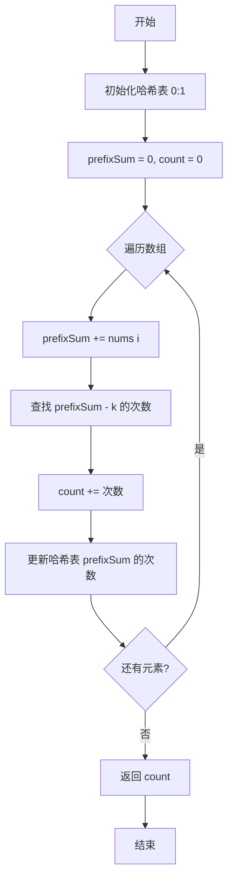

# 560. 和为 K 的子数组

## 📋 题目信息
- **难度**：Medium
- **标签**：数组、哈希表、前缀和
- **来源**：LeetCode

## 📖 题目描述

给你一个整数数组 `nums` 和一个整数 `k`，请你统计并返回该数组中和为 `k` 的子数组的个数。

子数组是数组中元素的连续非空序列。

### 示例

**示例 1：**
```
输入：nums = [1,1,1], k = 2
输出：2
```

**示例 2：**
```
输入：nums = [1,2,3], k = 3
输出：2
```

### 约束条件

- `1 <= nums.length <= 2 * 10^4`
- `-1000 <= nums[i] <= 1000`
- `-10^7 <= k <= 10^7`

---

## 🤔 题目分析

### 问题理解

这道题要求我们统计数组中有多少个连续子数组的和等于 k。

用自己的话重新描述：我们需要找出所有满足条件的区间 [i, j]，使得这个区间内所有元素的和等于 k，并返回这样的区间个数。

### 关键观察

通过仔细分析题目，我们可以发现以下关键点：

1. **子数组和的计算**：
   - 区间 [i, j] 的和 = prefixSum[j] - prefixSum[i-1]
   - 如果这个和等于 k，那么 prefixSum[j] - prefixSum[i-1] = k
   - 即 prefixSum[i-1] = prefixSum[j] - k

2. **前缀和的应用**：
   - 定义 prefixSum[i] 为从开始到第 i 个位置的累积和
   - 对于每个位置 j，如果存在位置 i 使得 prefixSum[i] = prefixSum[j] - k
   - 那么区间 (i, j] 的和就等于 k

3. **哈希表优化**：
   - 用哈希表记录每个前缀和出现的次数
   - 对于当前前缀和 prefixSum，查找 prefixSum - k 出现了多少次
   - 这个次数就是以当前位置为结尾、和为 k 的子数组个数

4. **与之前题目的区别**：
   - 525题（连续数组）：找最长的子数组，记录第一次出现的位置
   - 523题（连续的子数组和）：判断是否存在，记录第一次出现的位置
   - 本题：统计所有满足条件的子数组，需要记录每个前缀和出现的次数

5. **数组可能包含负数**：
   - 负数会让前缀和可能减小
   - 同一个前缀和可能出现多次
   - 需要累加所有可能的情况

### 核心难点

1. **如何高效统计子数组个数？**
   - 暴力方法：枚举所有子数组 O(n²)
   - 优化方法：前缀和 + 哈希表 O(n)

2. **如何理解前缀和的差值？**
   - prefixSum[j] - prefixSum[i] = k
   - 转化为：prefixSum[i] = prefixSum[j] - k
   - 查找之前有多少个前缀和等于 prefixSum[j] - k

3. **为什么要记录出现次数而不是位置？**
   - 因为要统计所有满足条件的子数组
   - 每个满足条件的前缀和都对应一个子数组
   - 需要累加所有可能的情况

### 问题本质

这道题的本质是：**利用前缀和将子数组和问题转化为"查找之前有多少个前缀和等于 prefixSum - k"，然后用哈希表高效统计**。

关键洞察：
- **前缀和的差值**：区间和 = 两个前缀和的差
- **转化思路**：prefixSum[j] - prefixSum[i] = k ⟺ prefixSum[i] = prefixSum[j] - k
- **哈希表统计**：记录每个前缀和出现的次数，累加满足条件的个数

---

## 💡 解题思路

### 方法一：暴力解法

#### 思路说明

最直观的想法是：枚举所有可能的子数组，计算每个子数组的和，统计有多少个和等于 k。

#### 算法步骤

1. **外层循环**：遍历所有可能的起始位置 i
2. **内层循环**：从 i 开始遍历所有可能的结束位置 j
3. **计算和**：累加区间 [i, j] 的元素和
4. **统计个数**：如果 sum == k，计数器加 1
5. **返回结果**：返回计数器的值

#### 复杂度分析

- **时间复杂度**：O(n²) - 两层嵌套循环
- **空间复杂度**：O(1) - 只使用常数变量

#### 为什么需要优化

虽然暴力解法简单直观，但存在明显的性能瓶颈：

1. **效率低下**：当 n = 2×10⁴ 时，O(n²) 约为 4×10⁸ 次操作，会超时
2. **重复计算**：每个子数组都要重新计算和，存在大量重复计算
3. **无法通过大数据测试**：题目约束 n 最大为 2×10⁴，暴力解法无法通过

---

### 方法二：前缀和 + 哈希表

#### 🌟 形象化理解：寻找配对的拼图

> **💡 在进入专业算法分析之前，先通过一个生活化的例子来理解前缀和的应用**

**场景类比**：

想象你在玩拼图游戏，每块拼图上有一个数字（前缀和）：
- 你手里有一块拼图，上面写着数字 10（当前前缀和）
- 你想找到和为 3 的子数组（目标 k = 3）
- 那么你需要找之前有多少块拼图上写着 7（10 - 3 = 7）
- 每找到一块写着 7 的拼图，就能和你手里的拼图配对，形成一个和为 3 的子数组

**对应关系**：
- **拼图上的数字** = 前缀和
- **手里的拼图** = 当前位置的前缀和
- **需要找的拼图** = prefixSum - k
- **找到的拼图数量** = 满足条件的子数组个数
- **拼图盒子** = 哈希表（记录每个数字的拼图有多少块）

**核心理解**：
如果当前前缀和是 10，目标 k 是 3，那么我们需要找之前有多少个前缀和是 7。因为 10 - 7 = 3，这样从前缀和 7 的位置到当前位置的子数组和就是 3。

**举例说明**：
```
数组：[1, 2, 3, -2, 2], k = 3
前缀和：[0, 1, 3, 6, 4, 6]

当遍历到索引 2（前缀和 = 6）：
需要找 6 - 3 = 3
之前出现过前缀和 3（索引 1）
所以找到 1 个子数组：[3]

当遍历到索引 4（前缀和 = 6）：
需要找 6 - 3 = 3
之前出现过前缀和 3（索引 1）
所以又找到 1 个子数组：[3, -2, 2]
```

**从类比到算法**：
现在让我们把这个拼图配对的思想转化为具体的算法...

---

#### 优化思路推导

**思考过程**：

1. **暴力解法的瓶颈**：需要枚举所有子数组并计算和，时间复杂度 O(n²)

2. **前缀和的引入**：
   - 区间 [i, j] 的和 = prefixSum[j] - prefixSum[i-1]
   - 如果这个和等于 k，那么 prefixSum[j] - prefixSum[i-1] = k
   - 即 prefixSum[i-1] = prefixSum[j] - k

3. **问题转化**：
   - 对于每个位置 j，我们要找有多少个位置 i 满足条件
   - 即找有多少个 prefixSum[i-1] = prefixSum[j] - k
   - 这就是"查找之前有多少个前缀和等于 prefixSum[j] - k"

4. **哈希表优化**：
   - 用哈希表记录每个前缀和出现的次数
   - 对于当前前缀和，查找 prefixSum - k 出现了多少次
   - 累加这个次数到结果中

5. **初始化技巧**：
   - 初始化 {0: 1}，表示前缀和 0 出现了 1 次
   - 这样可以处理从数组开始就满足条件的情况

#### 算法步骤

1. **初始化**：
   - 创建哈希表 `prefixSumCount`，初始化为 `{0: 1}`
   - 初始化 `prefixSum = 0`，`count = 0`

2. **遍历数组**：
   - 对于每个元素，更新前缀和：`prefixSum += nums[i]`
   - 查找 `prefixSum - k` 在哈希表中出现的次数
   - 将这个次数累加到 `count` 中
   - 更新哈希表：`prefixSumCount[prefixSum] += 1`

3. **返回结果**：返回 `count`

#### 复杂度分析

- **时间复杂度**：O(n) - 只需遍历数组一次，哈希表操作 O(1)
- **空间复杂度**：O(n) - 哈希表最多存储 n 个不同的前缀和

#### 💭 回顾类比

- 生活中的**拼图数字** 对应 代码中的**前缀和**
- 生活中的**找配对的拼图** 对应 代码中的**查找 prefixSum - k**
- 生活中的**拼图数量** 对应 代码中的**哈希表记录的次数**
- 生活中的**配对成功的次数** 对应 代码中的**满足条件的子数组个数**
- 这就是为什么这个算法能够将时间复杂度从 O(n²) 优化到 O(n) 的原因

---

## 🎨 图解说明

### 执行过程示例

让我们通过示例 1 来详细演示算法的执行过程。

**示例输入**：`nums = [1, 1, 1], k = 2`

**执行步骤**：

```
初始状态：
prefixSumCount = {0: 1}  # 前缀和0出现1次
prefixSum = 0
count = 0

索引 0，值 1：
- prefixSum = 0 + 1 = 1
- 查找 prefixSum - k = 1 - 2 = -1
- -1 不在哈希表中，次数为 0
- count = 0 + 0 = 0
- 更新哈希表：prefixSumCount = {0: 1, 1: 1}

索引 1，值 1：
- prefixSum = 1 + 1 = 2
- 查找 prefixSum - k = 2 - 2 = 0
- 0 在哈希表中，次数为 1
- count = 0 + 1 = 1  ← 找到子数组 [1,1]
- 更新哈希表：prefixSumCount = {0: 1, 1: 1, 2: 1}

索引 2，值 1：
- prefixSum = 2 + 1 = 3
- 查找 prefixSum - k = 3 - 2 = 1
- 1 在哈希表中，次数为 1
- count = 1 + 1 = 2  ← 找到子数组 [1,1]（索引1-2）
- 更新哈希表：prefixSumCount = {0: 1, 1: 1, 2: 1, 3: 1}

最终结果：count = 2
```

### 可视化图表



### 前缀和与查找过程图

**示例：nums = [1, 2, 3, -2, 2], k = 3**

```
索引：      -1   0    1    2    3    4
数组：           1    2    3   -2    2
前缀和：    0    1    3    6    4    6
查找：      ?   -2    0    3    1    3

索引 0: 前缀和=1, 查找-2, 不存在, count=0
索引 1: 前缀和=3, 查找0, 存在1次, count=1 (子数组[1,2])
索引 2: 前缀和=6, 查找3, 存在1次, count=2 (子数组[3])
索引 3: 前缀和=4, 查找1, 存在1次, count=3 (子数组[2,3,-2])
索引 4: 前缀和=6, 查找3, 存在1次, count=4 (子数组[3,-2,2])

最终结果：4 个子数组
```

### 关键理解

**为什么初始化 {0: 1}？**
- 前缀和为 0 表示"还没有遍历任何元素"
- 如果某个位置的前缀和等于 k，说明从开始到这个位置的子数组和为 k
- 需要预设 {0: 1} 来处理这种情况

**为什么要记录出现次数而不是位置？**
- 因为要统计所有满足条件的子数组
- 同一个前缀和可能出现多次（特别是有负数时）
- 每次出现都对应一个满足条件的子数组

**为什么先查找再更新？**
- 先查找 prefixSum - k 的次数，累加到结果中
- 再更新当前 prefixSum 的次数
- 这样保证不会把当前位置和自己配对（子数组长度至少为1）

**与其他题目的区别**：
- 525题：找最长子数组，记录第一次出现的位置
- 523题：判断是否存在，记录第一次出现的位置
- 本题：统计所有子数组，记录每个前缀和出现的次数

---

## ✏️ 代码框架填空

> **💡 学习提示**：在查看完整代码之前，先尝试根据上面的算法步骤，自己思考并填写下面的空白处。

### Python填空版

```python
def subarraySum(nums, k):
    """
    统计和为k的子数组个数
    
    参数:
        nums: 整数数组
        k: 目标和
    
    返回:
        满足条件的子数组个数
    """
    # 🔹 填空1：初始化哈希表
    # 提示：前缀和0出现了多少次？
    prefix_sum_count = {______: ______}
    
    # 🔹 填空2：初始化前缀和和计数器
    prefix_sum = ______
    count = ______
    
    # 🔹 填空3：遍历数组
    for num in ______:
        
        # 🔹 填空4：更新前缀和
        prefix_sum ______
        
        # 🔹 填空5：查找 prefixSum - k 出现的次数
        # 提示：如果 prefixSum - k 在哈希表中，获取其次数
        if ______ in prefix_sum_count:
            count += ______
        
        # 🔹 填空6：更新当前前缀和的次数
        # 提示：如果不存在则初始化为0，然后加1
        prefix_sum_count[______] = prefix_sum_count.get(______, 0) + 1
    
    # 🔹 填空7：返回结果
    return ______
```

### 填空提示详解

**填空1 - 初始化哈希表**
- 思考：为什么要预设 {0: 1}？
- 提示：前缀和0表示还没遍历任何元素，出现1次

**填空2 - 初始化变量**
- 思考：前缀和和计数器的初始值是多少？
- 提示：都初始化为0

**填空3 - 遍历数组**
- 思考：遍历什么？
- 提示：遍历 nums 数组

**填空4 - 更新前缀和**
- 思考：如何累加当前元素？
- 提示：使用 += 运算符

**填空5 - 查找并累加**
- 思考：要查找什么？累加什么？
- 提示：查找 prefix_sum - k，累加其出现次数

**填空6 - 更新哈希表**
- 思考：如何更新当前前缀和的次数？
- 提示：使用 get 方法获取当前次数（默认0），然后加1

**填空7 - 返回结果**
- 思考：最终返回什么？
- 提示：返回计数器 count

---

## 💻 完整代码实现

> **✅ 对照检查**：现在对比你的填空答案和下面的完整实现，看看思路是否一致。

### Python实现

```python
def subarraySum(nums, k):
    """
    统计和为k的子数组个数
    
    时间复杂度：O(n)
    空间复杂度：O(n)
    """
    # 初始化哈希表，记录每个前缀和出现的次数
    # {0: 1} 表示前缀和0出现了1次（还没遍历任何元素）
    prefix_sum_count = {0: 1}
    
    # 初始化前缀和和计数器
    prefix_sum = 0
    count = 0
    
    # 遍历数组
    for num in nums:
        
        # 更新前缀和
        prefix_sum += num
        
        # 查找 prefixSum - k 出现的次数
        # 如果 prefixSum - k 存在，说明存在子数组和为k
        # 累加其出现次数（每次出现对应一个子数组）
        if (prefix_sum - k) in prefix_sum_count:
            count += prefix_sum_count[prefix_sum - k]
        
        # 更新当前前缀和的出现次数
        # 使用 get 方法，如果不存在则返回0
        prefix_sum_count[prefix_sum] = prefix_sum_count.get(prefix_sum, 0) + 1
    
    return count


# 测试用例
if __name__ == "__main__":
    # 测试用例1
    nums1 = [1, 1, 1]
    k1 = 2
    result1 = subarraySum(nums1, k1)
    print(f"测试1: nums = {nums1}, k = {k1}, 结果 = {result1}, 期望 = 2")
    
    # 测试用例2
    nums2 = [1, 2, 3]
    k2 = 3
    result2 = subarraySum(nums2, k2)
    print(f"测试2: nums = {nums2}, k = {k2}, 结果 = {result2}, 期望 = 2")
    
    # 包含负数的测试
    nums3 = [1, 2, 3, -2, 2]
    k3 = 3
    result3 = subarraySum(nums3, k3)
    print(f"测试3: nums = {nums3}, k = {k3}, 结果 = {result3}")
```

**代码说明**：
- 第11行：初始化哈希表为 `{0: 1}`，处理从数组开始就满足条件的情况
- 第14-15行：初始化前缀和为0，计数器为0
- 第18行：遍历数组中的每个元素
- 第21行：累加当前元素到前缀和
- 第26行：查找 `prefix_sum - k` 是否在哈希表中
- 第27行：如果存在，累加其出现次数到结果中
- 第31行：更新当前前缀和的出现次数

**填空答案解析**：
- **填空1**：`0: 1` - 前缀和0出现1次
- **填空2**：`prefix_sum = 0, count = 0` - 初始化为0
- **填空3**：`nums` - 遍历数组
- **填空4**：`+= num` - 累加当前元素
- **填空5**：`(prefix_sum - k)` 和 `prefix_sum_count[prefix_sum - k]`
- **填空6**：`prefix_sum] = prefix_sum_count.get(prefix_sum`
- **填空7**：`count` - 返回计数器

---

### C++实现

```cpp
#include <vector>
#include <unordered_map>
#include <iostream>
using namespace std;

class Solution {
public:
    int subarraySum(vector<int>& nums, int k) {
        // 初始化哈希表
        unordered_map<int, int> prefixSumCount;
        prefixSumCount[0] = 1;  // 前缀和0出现1次
        
        // 初始化变量
        int prefixSum = 0;
        int count = 0;
        
        // 遍历数组
        for (int num : nums) {
            
            // 更新前缀和
            prefixSum += num;
            
            // 查找 prefixSum - k 出现的次数
            if (prefixSumCount.find(prefixSum - k) != prefixSumCount.end()) {
                count += prefixSumCount[prefixSum - k];
            }
            
            // 更新当前前缀和的出现次数
            prefixSumCount[prefixSum]++;
        }
        
        return count;
    }
};

// 测试代码
int main() {
    Solution sol;
    
    // 测试用例1
    vector<int> nums1 = {1, 1, 1};
    cout << "测试1: " << sol.subarraySum(nums1, 2) << " (期望: 2)" << endl;
    
    // 测试用例2
    vector<int> nums2 = {1, 2, 3};
    cout << "测试2: " << sol.subarraySum(nums2, 3) << " (期望: 2)" << endl;
    
    return 0;
}
```

**与Python的主要差异**：
- **类型声明**：C++需要显式声明 `unordered_map<int, int>` 类型
- **哈希表查找**：Python用 `in`，C++用 `.find() != .end()`
- **自增操作**：Python用 `+= 1`，C++可以用 `++`
- **范围for循环**：C++使用 `for (int num : nums)`

---

## ⚠️ 易错点提醒

### 1. 边界条件

**易错点1：忘记初始化 {0: 1}**

❌ **错误做法**：
```python
prefix_sum_count = {}  # 空哈希表
```

✅ **正确做法**：
```python
prefix_sum_count = {0: 1}  # 预设前缀和0出现1次
```

**原因**：
- 如果某个位置的前缀和等于 k，说明从数组开始到这个位置的和为 k
- 没有预设的话，无法正确统计这种情况
- 例如：`[1, 2], k=3`，遍历到索引1时前缀和为3，需要查找0，应该找到1次

---

**易错点2：先更新再查找**

❌ **错误做法**：
```python
# 先更新哈希表
prefix_sum_count[prefix_sum] = prefix_sum_count.get(prefix_sum, 0) + 1

# 再查找
if (prefix_sum - k) in prefix_sum_count:
    count += prefix_sum_count[prefix_sum - k]
```

✅ **正确做法**：
```python
# 先查找
if (prefix_sum - k) in prefix_sum_count:
    count += prefix_sum_count[prefix_sum - k]

# 再更新哈希表
prefix_sum_count[prefix_sum] = prefix_sum_count.get(prefix_sum, 0) + 1
```

**原因**：
- 如果先更新再查找，当 k = 0 时会出错
- 例如：`[1], k=0`，前缀和为1，如果先更新，查找1-0=1时会找到自己
- 这样会把长度为0的"子数组"也统计进去，导致结果错误

---

**易错点3：混淆"记录次数"和"记录位置"**

❌ **错误做法**：
```python
# 记录位置而不是次数
prefix_sum_index = {0: -1}
if (prefix_sum - k) in prefix_sum_index:
    count += 1  # 只加1
prefix_sum_index[prefix_sum] = i
```

✅ **正确做法**：
```python
# 记录次数
prefix_sum_count = {0: 1}
if (prefix_sum - k) in prefix_sum_count:
    count += prefix_sum_count[prefix_sum - k]  # 加上出现次数
prefix_sum_count[prefix_sum] = prefix_sum_count.get(prefix_sum, 0) + 1
```

**原因**：
- 本题要统计所有满足条件的子数组
- 同一个前缀和可能出现多次（特别是有负数时）
- 每次出现都对应一个满足条件的子数组

---

### 2. 常见错误

**错误1：不理解为什么要查找 prefixSum - k**

**错误理解**：直接判断前缀和是否等于k
```python
if prefix_sum == k:
    count += 1
```

**问题**：
- 这只能找到从数组开始的子数组
- 无法找到中间的子数组
- 例如：`[1, 2, 3], k=3`，只能找到 `[1, 2]`，找不到 `[3]`

**正确理解**：
- 区间 [i, j] 的和 = prefixSum[j] - prefixSum[i-1]
- 如果这个和等于 k，那么 prefixSum[i-1] = prefixSum[j] - k
- 所以要查找之前有多少个前缀和等于 prefixSum[j] - k

---

**错误2：处理负数时的困惑**

**疑问**：为什么有负数时同一个前缀和会出现多次？

**解释**：
```
数组：[1, -1, 1, -1, 1]
前缀和：[0, 1, 0, 1, 0, 1]

前缀和0出现了4次（初始 + 索引1 + 索引3 + 索引5）
前缀和1出现了3次（索引0 + 索引2 + 索引4）
```

这就是为什么要记录次数而不是位置！

---

**错误3：k=0 的特殊情况**

**测试用例**：`nums = [1, -1, 0], k = 0`

**分析**：
```
索引0: prefix_sum=1, 查找1, 不存在, count=0
索引1: prefix_sum=0, 查找0, 存在1次, count=1 (子数组[1,-1])
索引2: prefix_sum=0, 查找0, 存在2次, count=3 (子数组[-1,0]和[0])
```

注意：如果先更新再查找，索引1时会把自己也算进去，导致错误！

---

### 3. 调试技巧

**技巧1：打印前缀和和哈希表状态**

```python
for i, num in enumerate(nums):
    prefix_sum += num
    
    print(f"索引{i}, 值{num}, 前缀和{prefix_sum}")
    print(f"  查找 {prefix_sum - k}")
    
    if (prefix_sum - k) in prefix_sum_count:
        found = prefix_sum_count[prefix_sum - k]
        print(f"  找到{found}次，累加到count")
        count += found
    
    prefix_sum_count[prefix_sum] = prefix_sum_count.get(prefix_sum, 0) + 1
    print(f"  哈希表: {prefix_sum_count}")
```

**技巧2：手动验证小例子**

```
nums = [1, 1, 1], k = 2

初始: {0: 1}, prefix_sum=0, count=0

索引0: prefix_sum=1, 查找-1, 不存在
       哈希表: {0: 1, 1: 1}

索引1: prefix_sum=2, 查找0, 存在1次, count=1
       子数组: [1,1] (索引0-1)
       哈希表: {0: 1, 1: 1, 2: 1}

索引2: prefix_sum=3, 查找1, 存在1次, count=2
       子数组: [1,1] (索引1-2)
       哈希表: {0: 1, 1: 1, 2: 1, 3: 1}

结果: 2 ✓
```

**技巧3：测试边界情况**

- k = 0：`[1, -1, 0], k=0`
- 全是负数：`[-1, -1, -1], k=-2`
- 单个元素：`[1], k=1`
- 没有满足条件的：`[1, 2, 3], k=10`
- 整个数组：`[1, 2, 3], k=6`

---

## 🔗 相似题目推荐

### 同类型题目

这些题目使用相同或相似的算法思路（前缀和 + 哈希表）：

1. **[LeetCode 525](../questions/525.%20连续数组.md) - 连续数组** (Medium)
   - **相似点**：都使用前缀和 + 哈希表
   - **区别**：525是找最长子数组（记录位置），本题是统计个数（记录次数）
   - **建议**：理解"记录位置"和"记录次数"的区别

2. **[LeetCode 523](../questions/523.%20连续的子数组和.md) - 连续的子数组和** (Medium)
   - **相似点**：都使用前缀和 + 哈希表
   - **区别**：523是判断是否存在（记录位置），本题是统计个数（记录次数）
   - **建议**：理解同余定理和直接查找的区别

3. **[LeetCode 1](../questions/1.%20两数之和.md) - 两数之和** (Easy)
   - **相似点**：都使用哈希表记录之前出现的值
   - **区别**：1是找两个数，本题是找子数组
   - **建议**：哈希表优化的入门题

4. **[LeetCode 974](https://leetcode.cn/problems/subarray-sums-divisible-by-k/) - 和可被 K 整除的子数组** (Medium)
   - **相似点**：都使用前缀和 + 哈希表统计个数
   - **区别**：974需要取模运算
   - **建议**：本题的扩展，加入同余定理

### 进阶题目

掌握本题后，可以挑战这些更难的题目：

1. **[LeetCode 325](https://leetcode.cn/problems/maximum-size-subarray-sum-equals-k/) - 和等于 k 的最长子数组长度** (Medium)
   - **进阶点**：从统计个数变为找最长长度
   - **难度提升**：需要记录位置而不是次数

2. **[LeetCode 930](https://leetcode.cn/problems/binary-subarrays-with-sum/) - 和相同的二元子数组** (Medium)
   - **进阶点**：二进制数组的前缀和应用
   - **难度提升**：本题的变体

3. **[LeetCode 1248](https://leetcode.cn/problems/count-number-of-nice-subarrays/) - 统计优美子数组** (Medium)
   - **进阶点**：将奇数偶数转化为0和1，再用前缀和
   - **难度提升**：需要问题转化

### 相关知识点

本题涉及的核心知识点：

- **前缀和（Prefix Sum）**：
  - 核心思想：预处理累积和，利用差值快速计算区间和
  - 相关题目：LeetCode 303、304、560、525、523
  - 应用场景：需要频繁查询区间和的问题

- **哈希表优化（Hash Table）**：
  - 核心思想：用空间换时间，O(1)查找之前出现的值
  - 相关题目：LeetCode 1、560、525、523
  - 应用场景：需要快速查找"之前是否出现过某个值"

- **统计个数 vs 记录位置**：
  - 统计个数：记录每个值出现的次数（本题）
  - 记录位置：记录每个值第一次出现的位置（525、523题）
  - 应用场景：根据题目要求选择合适的记录方式

- **前缀和差值的应用**：
  - 核心思想：prefixSum[j] - prefixSum[i] = k ⟺ prefixSum[i] = prefixSum[j] - k
  - 相关题目：LeetCode 560、325
  - 应用场景：查找和为特定值的子数组

---

## 📚 知识点总结

### 核心算法

**前缀和 + 哈希表（统计个数版）**

这是前缀和+哈希表的经典应用之一，用于统计满足条件的子数组个数：

- **前缀和**：将区间和问题转化为两个前缀和的差值
- **哈希表**：记录每个前缀和出现的次数
- **查找逻辑**：对于当前前缀和，查找 prefixSum - k 出现了多少次
- **组合优势**：将O(n²)的暴力解法优化为O(n)

**前缀和+哈希表的三种模式**

| 题目类型 | 哈希表存储 | 查找目标 | 更新方式 |
|---------|-----------|---------|---------|
| 判断是否存在（523） | 余数 → 位置 | 相同余数 | 只记录第一次 |
| 找最长子数组（525） | 前缀和 → 位置 | 相同前缀和 | 只记录第一次 |
| 统计个数（560） | 前缀和 → 次数 | prefixSum - k | 累加次数 |

### 数据结构

**哈希表（Hash Map）**

本题使用哈希表存储前缀和及其出现次数：

- **键（Key）**：前缀和的值
- **值（Value）**：该前缀和出现的次数
- **操作**：插入O(1)，查找O(1)
- **空间**：O(n)，最多存储n个不同的前缀和

### 解题模板

**前缀和 + 哈希表模板（统计个数）**：

```python
def countSubarrays(nums, target):
    """
    统计和为target的子数组个数
    """
    # 初始化哈希表，记录每个前缀和出现的次数
    prefix_sum_count = {0: 1}
    prefix_sum = 0
    count = 0
    
    for num in nums:
        # 更新前缀和
        prefix_sum += num
        
        # 查找 prefixSum - target 出现的次数
        if (prefix_sum - target) in prefix_sum_count:
            count += prefix_sum_count[prefix_sum - target]
        
        # 更新当前前缀和的出现次数
        prefix_sum_count[prefix_sum] = prefix_sum_count.get(prefix_sum, 0) + 1
    
    return count
```

**前缀和 + 哈希表模板（找最长子数组）**：

```python
def findMaxLength(nums, target):
    """
    找和为target的最长子数组长度
    """
    # 初始化哈希表，记录每个前缀和第一次出现的位置
    prefix_sum_index = {0: -1}
    prefix_sum = 0
    max_len = 0
    
    for i, num in enumerate(nums):
        # 更新前缀和
        prefix_sum += num
        
        # 查找 prefixSum - target 是否出现过
        if (prefix_sum - target) in prefix_sum_index:
            length = i - prefix_sum_index[prefix_sum - target]
            max_len = max(max_len, length)
        
        # 只记录第一次出现的位置
        if prefix_sum not in prefix_sum_index:
            prefix_sum_index[prefix_sum] = i
    
    return max_len
```

### 学习要点

1. **前缀和差值的理解**：prefixSum[j] - prefixSum[i] = k ⟺ prefixSum[i] = prefixSum[j] - k
2. **哈希表的应用**：记录次数而不是位置，累加所有可能的情况
3. **初始化技巧**：`{0: 1}` 处理从数组开始就满足条件的情况
4. **更新顺序**：先查找再更新，避免当前位置和自己配对
5. **负数的影响**：负数会让前缀和可能减小，同一个前缀和可能出现多次
6. **填空练习的价值**：通过填空练习，你应该掌握了：
   - 如何初始化哈希表和变量
   - 如何计算前缀和
   - 如何查找并累加满足条件的个数
   - 如何更新哈希表中的次数

---

## 📝 补充说明

### 从填空到完整实现的进阶路径

1. **第一遍**：看算法步骤和类比，尝试填空
2. **第二遍**：对照答案，理解每个填空的原因和细节
3. **第三遍**：不看提示，独立完整实现（包括测试用例）
4. **第四遍**：尝试解决相似题目（如974、325题），举一反三

### 时间复杂度优化历程

- **暴力解法**：O(n²) → 枚举所有子数组并计算和
- **优化解法**：O(n) → 前缀和 + 哈希表，一次遍历
- **优化策略**：前缀和差值转化 + 空间换时间

### 空间复杂度权衡

- **空间使用**：O(n)，哈希表最多存储n个不同的前缀和
- **优化可能**：无法进一步优化，因为需要记录所有出现过的前缀和
- **权衡分析**：用O(n)空间换取O(n)时间，非常值得

### 实际应用场景

1. **数据分析**：统计满足特定条件的连续数据段
2. **财务统计**：统计收支和为特定值的时间段
3. **性能监控**：统计性能指标和为目标值的时间窗口
4. **信号处理**：统计信号累积值为特定值的区间

### 扩展思考

1. **如果要找和为k的最长子数组怎么办？**
   - 记录位置而不是次数
   - 只记录第一次出现的位置
   - 参考LeetCode 325题

2. **如果要找和为k的最短子数组怎么办？**
   - 记录位置，但每次都更新（记录最后一次出现）
   - 或者使用滑动窗口（如果数组全是正数）

3. **如果数组很大，内存不够怎么办？**
   - 可以考虑分块处理
   - 或者使用外部排序的思想

4. **为什么不能用滑动窗口？**
   - 滑动窗口适用于单调性问题（如数组全是正数）
   - 本题有负数，前缀和可能减小，不满足单调性
   - 所以必须用哈希表记录所有前缀和

---

**🎉 恭喜你完成了这道题的学习！**

通过本题，你应该掌握了：
- ✅ 前缀和 + 哈希表的经典应用
- ✅ 如何统计满足条件的子数组个数
- ✅ "记录次数"和"记录位置"的区别
- ✅ 前缀和差值的转化技巧
- ✅ 先查找再更新的重要性

继续加油，向着算法大师的目标前进！💪


