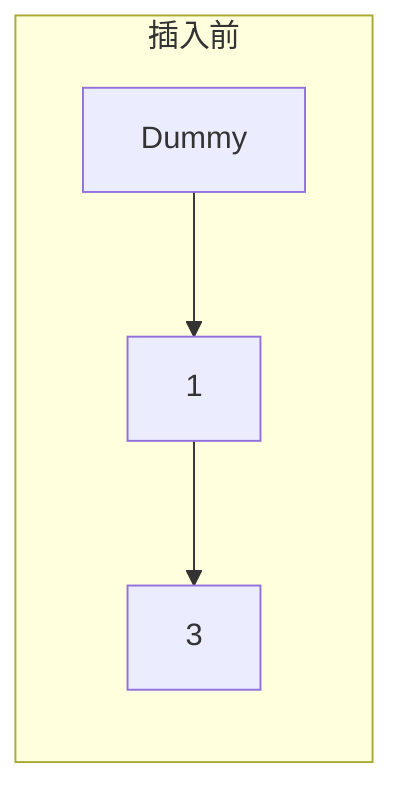
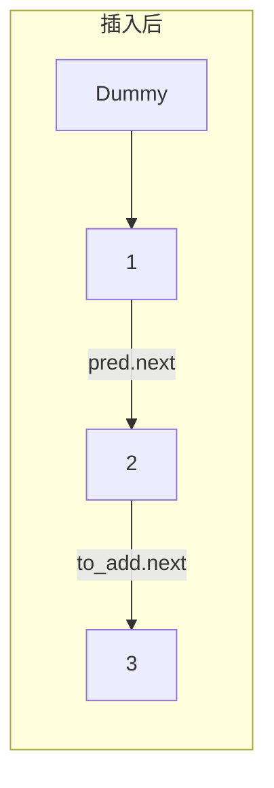
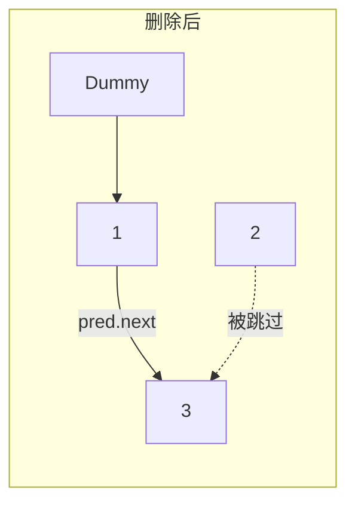

# 707. 设计链表 - 思路分析

## 📋 题目信息
- **难度**：中等
- **标签**：设计、链表
- **来源**：LeetCode

## 📖 题目描述

你可以选择使用单链表或者双链表，设计并实现自己的链表。

单链表中的节点应该具备两个属性：`val` 和 `next` 。`val` 是当前节点的值，`next` 是指向下一个节点的指针/引用。

如果是双向链表，则还需要属性 `prev` 以指示链表中的上一个节点。假设链表中的所有节点下标从 **0** 开始。

实现 `MyLinkedList` 类：
*   `MyLinkedList()` 初始化 `MyLinkedList` 对象。
*   `int get(int index)` 获取链表中下标为 `index` 的节点的值。如果下标无效，则返回 `-1` 。
*   `void addAtHead(int val)` 将一个值为 `val` 的节点插入到链表中第一个元素之前。在插入完成后，新节点会成为链表的第一个节点。
*   `void addAtTail(int val)` 将一个值为 `val` 的节点追加到链表中作为链表的最后一个元素。
*   `void addAtIndex(int index, int val)` 将一个值为 `val` 的节点插入到链表中下标为 `index` 的节点之前。如果 `index` 等于链表的长度，那么该节点会被追加到链表的末尾。如果 `index` 比长度更大，该节点将 **不会插入** 到链表中。
*   `void deleteAtIndex(int index)` 如果下标有效，则删除链表中下标为 `index` 的节点。

### 示例
```
输入
["MyLinkedList", "addAtHead", "addAtTail", "addAtIndex", "get", "deleteAtIndex", "get"]
[[], [1], [3], [1, 2], [1], [1], [1]]
输出
[null, null, null, null, 2, null, 3]

解释
MyLinkedList myLinkedList = new MyLinkedList();
myLinkedList.addAtHead(1);
myLinkedList.addAtTail(3);
myLinkedList.addAtIndex(1, 2);    // 链表变为 1->2->3
myLinkedList.get(1);              // 返回 2
myLinkedList.deleteAtIndex(1);    // 现在，链表变为 1->3
myLinkedList.get(1);              // 返回 3
```

### 约束条件
*   `0 <= index, val <= 1000`
*   请不要使用内置的 LinkedList 库。
*   调用 `get`、`addAtHead`、`addAtTail`、`addAtIndex` 和 `deleteAtIndex` 的次数不超过 `2000` 。

---

## 🤔 题目分析

### 问题理解
我们需要"从零开始"造一个轮子——链表。题目给了我们选择：单向链表或双向链表。
核心任务是管理一串节点，每个节点包含数据（`val`）和指向下一个节点的指针（`next`）。
我们需要支持增（头、尾、指定位置）、删（指定位置）、查（指定位置）这几个基本操作。

### 关键观察
1.  **下标从0开始**：这意味着第0个节点是头节点。
2.  **操作频率**：题目提示操作次数不超过2000，这说明$O(N)$的操作是可以接受的（N最大为1000）。
3.  **哨兵节点（Dummy Head）**：在处理链表问题时，头节点的操作往往很特殊（例如删除头节点需要更新`head`引用）。引入一个**虚拟头节点**（Dummy Head）可以极大简化代码，让头节点的操作和中间节点的操作逻辑一致。

---

## 💡 解题思路

### 方法：单链表 + 虚拟头节点

#### 🌟 形象化理解：火车车厢

> **💡 在写代码前，让我们想象一下你在管理一列火车。**

**场景类比**：
想象你是一列火车的列车长，这列火车由很多节车厢（节点）组成，每节车厢都用钩子（指针）钩住下一节车厢。

*   **虚拟头节点 (Dummy Head)**：这就像是你的**火车头**。它不载客（不存有效数据），但它永远在最前面，钩住第一节载客车厢。有了它，你永远不用担心"如果没有车厢了怎么办"，因为火车头永远在。
*   **get(index)**：你要找第 `index` 节车厢。你得从火车头开始，往后走 `index+1` 步（因为第0步是火车头）。
*   **addAtIndex(index, val)**：你要在第 `index` 节车厢前面加一节新车厢。
    *   你找到第 `index-1` 节车厢（前驱节点）。
    *   先把新车厢的后钩子钩住原来的第 `index` 节车厢。
    *   再把第 `index-1` 节车厢的后钩子钩住新车厢。
    *   **顺序很重要！** 如果先断开旧钩子，后面的车厢就跑丢了！
*   **deleteAtIndex(index)**：你要把第 `index` 节车厢拆掉。
    *   找到第 `index-1` 节车厢（前驱节点）。
    *   直接把它的钩子钩到第 `index+1` 节车厢上。
    *   第 `index` 节车厢就被"跳过"了（被删除了）。

#### 算法步骤

1.  **节点设计**：定义一个 `ListNode` 类，包含 `val` 和 `next`。
2.  **初始化**：
    *   创建一个 `dummy_head` 节点，`val` 随意（通常为0或-1），`next` 指向 `None`。
    *   维护一个 `size` 变量记录链表长度（可选，但推荐，能简化合法性判断）。
3.  **get(index)**：
    *   检查 `index` 是否越界（`index < 0` 或 `index >= size`）。
    *   从 `dummy_head.next` 开始，遍历 `index` 次，找到目标节点。
4.  **addAtIndex(index, val)**：
    *   检查 `index`。如果 `index > size`，不插入；如果 `index < 0`，视为在头部插入。
    *   找到 **前驱节点**（即第 `index-1` 个节点）。因为有 `dummy_head`，所以即使插入在第0位，前驱就是 `dummy_head`，逻辑统一。
    *   执行插入逻辑：`new_node.next = pred.next`，然后 `pred.next = new_node`。
    *   `size` 加 1。
5.  **deleteAtIndex(index)**：
    *   检查 `index` 是否越界。
    *   找到 **前驱节点**。
    *   执行删除逻辑：`pred.next = pred.next.next`。
    *   `size` 减 1。
6.  **addAtHead/addAtTail**：可以直接复用 `addAtIndex`。`addAtHead` 是 `addAtIndex(0, val)`，`addAtTail` 是 `addAtIndex(size, val)`。

#### 复杂度分析
*   **时间复杂度**：
    *   `addAtHead`: $O(1)$
    *   `get`, `addAtIndex`, `deleteAtIndex`, `addAtTail`: $O(k)$，其中 $k$ 是索引位置。平均情况 $O(N)$。
*   **空间复杂度**：$O(N)$，用于存储链表节点。

---

## 🎨 图解说明

### 插入操作 (addAtIndex)

假设要在 `index=1` 处插入值 `2`。
当前链表：`Dummy -> 1(idx:0) -> 3(idx:1)`



**操作步骤**：
1. 找到前驱节点 `pred` (index=0的节点，值为1)。
2. 创建新节点 `to_add` (值为2)。
3. `to_add.next = pred.next` (新节点指向3)。
4. `pred.next = to_add` (前驱指向新节点)。



### 删除操作 (deleteAtIndex)

假设要删除 `index=1` 的节点。
当前链表：`Dummy -> 1 -> 2 -> 3`

**操作步骤**：
1. 找到前驱节点 `pred` (index=0的节点，值为1)。
2. 目标节点 `target = pred.next` (值为2)。
3. `pred.next = target.next` (1直接指向3)。



---

## ✏️ 代码框架填空

> **💡 学习提示**：链表操作最容易出错的就是**指针丢失**。请尝试填写下面的关键步骤，特别是插入和删除时的指针连接顺序。

### Python填空版

```python
class ListNode:
    def __init__(self, val=0, next=None):
        self.val = val
        self.next = next

class MyLinkedList:

    def __init__(self):
        # 🔹 填空1：初始化虚拟头节点和链表大小
        # 提示：我们需要一个永远存在的头，以及记录当前有多少个节点
        self.dummy_head = ListNode(0)
        self.size = ______

    def get(self, index: int) -> int:
        # 🔹 填空2：检查索引有效性
        if index < 0 or index >= ______:
            return -1
        
        curr = self.dummy_head.next
        # 移动到目标位置
        for _ in range(index):
            curr = curr.next
        return curr.val

    def addAtIndex(self, index: int, val: int) -> None:
        if index > self.size:
            return
        index = max(0, index)
        
        # 🔹 填空3：找到前驱节点
        # 提示：我们要找的是目标位置的前一个节点
        pred = self.dummy_head
        for _ in range(index):
            pred = ______
            
        to_add = ListNode(val)
        
        # 🔹 填空4：插入节点的指针操作
        # 提示：先连后一个，再连前一个，顺序不能反！
        to_add.next = ______
        pred.next = ______
        
        self.size += 1

    def deleteAtIndex(self, index: int) -> None:
        if index < 0 or index >= self.size:
            return
        
        pred = self.dummy_head
        for _ in range(index):
            pred = pred.next
            
        # 🔹 填空5：删除节点的指针操作
        # 提示：直接跨过要删除的节点
        pred.next = ______
        
        self.size -= 1
        
    # addAtHead 和 addAtTail 可以复用 addAtIndex
    def addAtHead(self, val: int) -> None:
        self.addAtIndex(0, val)

    def addAtTail(self, val: int) -> None:
        self.addAtIndex(self.size, val)
```

### 填空提示详解

**填空1 - 初始化**
*   `self.size` 初始应该是多少？显然是0。

**填空2 - 索引检查**
*   合法的索引范围是 `0` 到 `size-1`。如果 `index` 等于 `size`，说明越界了（对于 `get` 来说）。

**填空3 - 移动前驱指针**
*   我们要往后移动指针，通常操作是 `pred = pred.next`。

**填空4 - 插入逻辑 (核心)**
*   想象火车的挂钩。新车厢 `to_add` 的后面是原来的 `pred.next`。
*   原来的 `pred` 的后面变更为 `to_add`。
*   所以：`to_add.next = pred.next`，然后 `pred.next = to_add`。

**填空5 - 删除逻辑**
*   我们要跳过当前节点 `pred.next`，直接连到下下个节点 `pred.next.next`。

---

## 💻 完整代码实现

### Python实现

```python
class ListNode:
    def __init__(self, val=0, next=None):
        self.val = val
        self.next = next

class MyLinkedList:

    def __init__(self):
        # 初始化虚拟头节点，便于统一处理头节点操作
        self.dummy_head = ListNode(0)
        # 维护链表长度，便于O(1)判断索引有效性
        self.size = 0

    def get(self, index: int) -> int:
        """获取链表中第 index 个节点的值。如果索引无效，返回 -1。"""
        if index < 0 or index >= self.size:
            return -1
        
        # 从真实头节点（dummy.next）开始遍历
        curr = self.dummy_head.next
        for _ in range(index):
            curr = curr.next
        return curr.val

    def addAtHead(self, val: int) -> None:
        """在链表第一个元素之前添加一个值为 val 的节点。"""
        self.addAtIndex(0, val)

    def addAtTail(self, val: int) -> None:
        """将值为 val 的节点追加到链表末尾。"""
        self.addAtIndex(self.size, val)

    def addAtIndex(self, index: int, val: int) -> None:
        """
        在链表中的第 index 个节点之前添加值为 val 的节点。
        如果 index 等于链表的长度，则该节点将附加到链表的末尾。
        如果 index 大于链表长度，则不会插入节点。
        如果 index 小于 0，则在头部插入节点。
        """
        if index > self.size:
            return
        index = max(0, index) # 处理负数索引情况
        
        # 找到要插入位置的前驱节点
        # 因为是从 dummy 开始，循环 index 次后，pred 正好停在 index-1 的位置（逻辑上）
        # 实际上 pred 停在 dummy 后面第 index-1 个位置，也就是目标 index 的前一个
        pred = self.dummy_head
        for _ in range(index):
            pred = pred.next
            
        to_add = ListNode(val)
        
        # 关键步骤：先连后，再连前
        to_add.next = pred.next
        pred.next = to_add
        
        self.size += 1

    def deleteAtIndex(self, index: int) -> None:
        """如果索引 index 有效，则删除链表中的第 index 个节点。"""
        if index < 0 or index >= self.size:
            return
        
        # 找到要删除节点的前驱节点
        pred = self.dummy_head
        for _ in range(index):
            pred = pred.next
            
        # 删除操作：前驱节点直接指向下下个节点
        # Python有垃圾回收，不需要手动释放内存
        pred.next = pred.next.next
        
        self.size -= 1
```

### C++实现

```cpp
class MyLinkedList {
private:
    // 定义链表节点结构体
    struct ListNode {
        int val;
        ListNode *next;
        ListNode(int x) : val(x), next(nullptr) {}
    };
    
    ListNode* dummyHead; // 虚拟头节点
    int size;            // 链表长度

public:
    MyLinkedList() {
        dummyHead = new ListNode(0); // 初始化 dummy
        size = 0;
    }
    
    int get(int index) {
        if (index < 0 || index >= size) {
            return -1;
        }
        ListNode* curr = dummyHead->next;
        for (int i = 0; i < index; i++) {
            curr = curr->next;
        }
        return curr->val;
    }
    
    void addAtHead(int val) {
        addAtIndex(0, val);
    }
    
    void addAtTail(int val) {
        addAtIndex(size, val);
    }
    
    void addAtIndex(int index, int val) {
        if (index > size) return;
        if (index < 0) index = 0;
        
        ListNode* pred = dummyHead;
        for (int i = 0; i < index; i++) {
            pred = pred->next;
        }
        
        ListNode* toAdd = new ListNode(val);
        // 核心指针操作
        toAdd->next = pred->next;
        pred->next = toAdd;
        
        size++;
    }
    
    void deleteAtIndex(int index) {
        if (index < 0 || index >= size) return;
        
        ListNode* pred = dummyHead;
        for (int i = 0; i < index; i++) {
            pred = pred->next;
        }
        
        ListNode* toDelete = pred->next;
        pred->next = toDelete->next;
        
        // C++ 需要手动释放内存
        delete toDelete;
        size--;
    }
};
```

---

## ⚠️ 易错点提醒

### 1. 指针丢失
**易错点**：在插入节点时，先更新了 `pred.next`，导致找不到原来的后续节点。
**错误写法**：
```python
pred.next = to_add   # 😱 完了，pred.next 原来指向的节点找不到了！
to_add.next = pred.next  # 这时 pred.next 已经是 to_add 了，变成了自己指自己
```
**正确做法**：始终**先连接新节点到后续节点** (`to_add.next = pred.next`)，**再将前驱节点指向新节点** (`pred.next = to_add`)。

### 2. 边界条件
**易错点**：`index=0`（头插）和 `index=size`（尾插）时的处理。
**解决**：使用**虚拟头节点 (Dummy Head)** 可以完美解决头插的特殊性，使代码逻辑统一。对于尾插，只要循环条件正确，逻辑也是通用的。

### 3. 索引越界
**易错点**：`get` 和 `delete` 时，如果 `index` 等于 `size`，是越界的（因为最大索引是 `size-1`）。但在 `addAtIndex` 时，`index` 等于 `size` 是合法的（表示追加到末尾）。

---

## 🔗 相似题目推荐

### 同类型题目

1.  **206. 反转链表** (Easy)
    *   相似点：都需要熟练掌握链表的指针操作。
    *   建议：尝试用迭代（双指针）和递归两种方式实现。

2.  **203. 移除链表元素** (Easy)
    *   相似点：涉及到链表节点的删除，虚拟头节点在这里也非常有用。

3.  **21. 合并两个有序链表** (Easy)
    *   相似点：链表的基本拼接操作。

### 进阶题目

1.  **146. LRU 缓存** (Medium)
    *   进阶点：需要结合哈希表和双向链表来实现 $O(1)$ 的操作，是面试中的高频设计题。

---

## 📚 知识点总结

### 核心数据结构
*   **链表 (Linked List)**：一种线性数据结构，元素在内存中不连续存储，通过指针连接。
*   **虚拟头节点 (Dummy Head)**：一种编程技巧，用于简化边界情况（特别是头部操作）的处理。

### 学习要点
1.  **指针操作是核心**：一定要画图理解指针的指向变化。
2.  **顺序至关重要**：断开旧链接前，先建立新链接。
3.  **边界检查**：时刻关注 `index` 是否越界，`next` 是否为 `None`。
